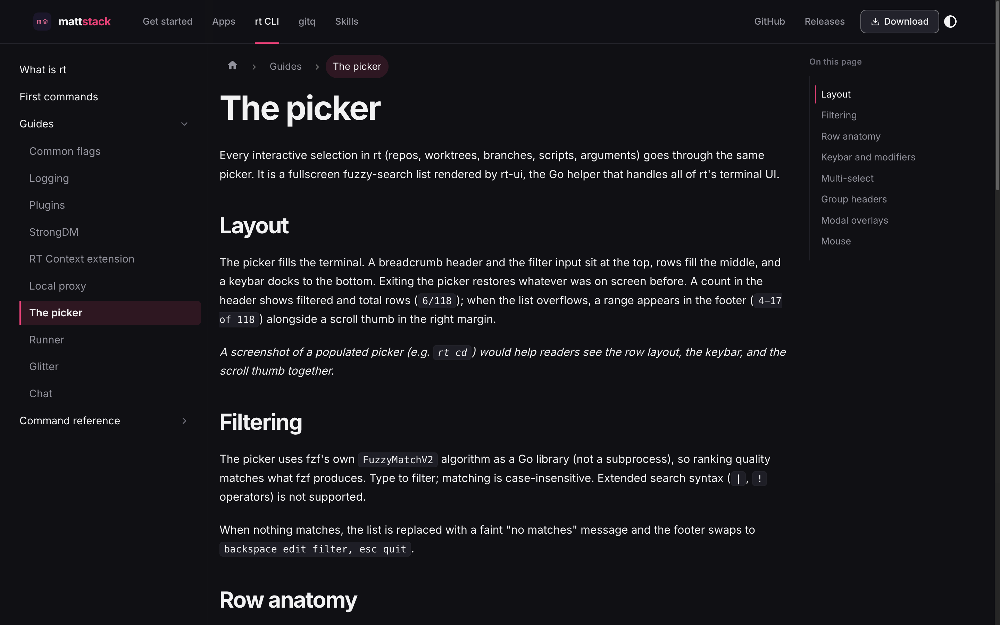

# mattstack

mattstack is an agentic application stack for engineers, built for you and your
team. It runs your agents in parallel, lets them talk to each other, and shows
the work landing. It ships as **mattstack.app** for Macs with Apple silicon
running macOS 14 or newer, and this repo is where most of it lives.



Read the docs at **[docs.mattstack.dev](https://docs.mattstack.dev)**, or see
the project at **[mattstack.dev](https://mattstack.dev)**.

## What's inside

mattstack.app runs the served apps (board, deck, console, chat and boxscore),
and they read one shared settings store. fast-browser and flock come from
their own repos and keep their own settings.

| Piece | What it is | Docs | Folder |
|---|---|---|---|
| mattstack.app | The menu bar app that installs, updates and supervises the whole suite | [Install](https://docs.mattstack.dev/start/install) | [`rt-tray/`](rt-tray) |
| rt | The command line piece: worktrees, safer git, ports and the plumbing agents use to coordinate | [rt](https://docs.mattstack.dev/rt) | repo root |
| board | Mission control for pull requests: review, get reviewed and respond to reviews in one place | [board](https://docs.mattstack.dev/apps/board) | [`apps/board`](apps/board) |
| deck | Gives every local app a name, keeps it running and can share it on your own domain | [deck](https://docs.mattstack.dev/apps/deck) | [`apps/deck`](apps/deck) |
| console | The dashboard that monitors every pipeline: what's running, what needs you and what a run did | [console](https://docs.mattstack.dev/apps/console) | [`apps/console`](apps/console) |
| chat | The web viewer for agent chat, with rooms and direct messages between you and your agents | [chat](https://docs.mattstack.dev/apps/chat) | [`apps/chat`](apps/chat) |
| boxscore | Ranks a hand-picked set of GitLab users on volume and quality metrics | [boxscore](https://docs.mattstack.dev/apps/boxscore) | [`apps/boxscore`](apps/boxscore) |
| gitq | Stacked branches and their merge requests | [gitq](https://docs.mattstack.dev/gitq) | [`apps/gitq`](apps/gitq) |
| glance | A provider-agnostic SDK for GitHub and GitLab | [README](packages/glance/README.md) | [`packages/glance`](packages/glance) |
| rt-client | A typed client for the rt daemon | [README](packages/rt-client/README.md) | [`packages/rt-client`](packages/rt-client) |
| mattstack plugin | The Claude Code skills for parallel agents, pipelines and review | [Skills](https://docs.mattstack.dev/skills) | [`plugins/mattstack`](plugins/mattstack) |
| herdr-chat | A herdr plugin that brings rt chat into the panes | [herdr-chat](https://docs.mattstack.dev/skills/herdr-chat) | [`plugins/herdr-chat`](plugins/herdr-chat) |
| fast-browser | Lets Claude Code and Codex drive the Chrome you already have open | [fast-browser](https://docs.mattstack.dev/apps/fast-browser) | [m4ttstack/fast-browser](https://github.com/m4ttstack/fast-browser) |
| flock | A native macOS window onto your herdr session | [flock](https://docs.mattstack.dev/apps/flock) | [m4ttstack/flock](https://github.com/m4ttstack/flock) |

## Install

Requirements:

- An Apple silicon Mac. rt ships an arm64 build only.
- macOS 14 or newer.
- Xcode Command Line Tools. The setup checklist offers to install them.

1. Download `mattstack-<version>.dmg` from
   [GitHub Releases](https://github.com/m4ttstack/mattstack/releases).
2. Drag **mattstack.app** to `/Applications` and open it.
3. Walk through setup, as [just you or as part of a team](https://docs.mattstack.dev/start/setup).

`rt` is not a separate download: it ships inside the app and setup links it onto
your `PATH`. To drive the same install from a terminal, run it from
`/Applications`, not from the mounted DMG:

```bash
/Applications/mattstack.app/Contents/MacOS/rt --post-install
rt verify
```

If you work with others, read
[Teams and invites](https://docs.mattstack.dev/start/teams).

## Repo layout

| Path | What lives there |
|---|---|
| `cli.ts`, `commands/`, `lib/` | rt, the CLI: dispatch, command handlers and shared logic |
| [`apps/`](apps) | board, deck, console, chat, boxscore and gitq |
| [`packages/`](packages) | Shared packages, including glance and rt-client |
| [`plugins/`](plugins) | The mattstack skills plugin and the herdr-chat plugin |
| [`rt-tray/`](rt-tray) | The Swift menu bar app and the bundle build |
| [`ui/`](ui) | The Go `rt-ui` helper that renders prompts, spinners and the runner board |
| [`website/`](website) | The docs site published at docs.mattstack.dev |

## Development

rt is built with [Bun](https://bun.sh). Run the CLI straight from source, with
no compile step:

```bash
git clone https://github.com/m4ttstack/mattstack.git
cd mattstack
bun install
bun run check             # static gates, the same ones CI runs
bun run test              # rt's unit tests
bun run cli.ts verify     # run any rt command from source
```

More detail:

- [`docs/development.md`](docs/development.md): dev mode, the installer, local
  builds and the release pipeline.
- [`apps/AGENTS.md`](apps/AGENTS.md): how the apps and platform packages are
  built, tested and authored.
- [`docs/release-and-distribution.md`](docs/release-and-distribution.md): the
  release flow, bundle signing and Sparkle.

## Contributing

Issues and pull requests are welcome at
[github.com/m4ttstack/mattstack](https://github.com/m4ttstack/mattstack).

Before opening one:

- Run `bun run test:all`, `bunx tsc --noEmit`, and `bun run picker:check`.
  `test:all` runs the unit, e2e, and pty suites; `bun run test` alone skips
  the last two.
- Run `scripts/repo-purity.sh`. This repo is public, and the gate keeps
  employer, customer, and internal-system references out of the tracked tree.
  Use neutral placeholders such as `acme`, `ACME-1234`, and
  `gitlab.example.com`.
- Add a new command to `lib/command-tree-def.ts`, register its module in
  `lib/module-registry.ts`, and run `bun run docs:gen` so the reference page
  exists.
- Keep the commit message short and imperative.

## License

MIT. See [LICENSE](LICENSE).
