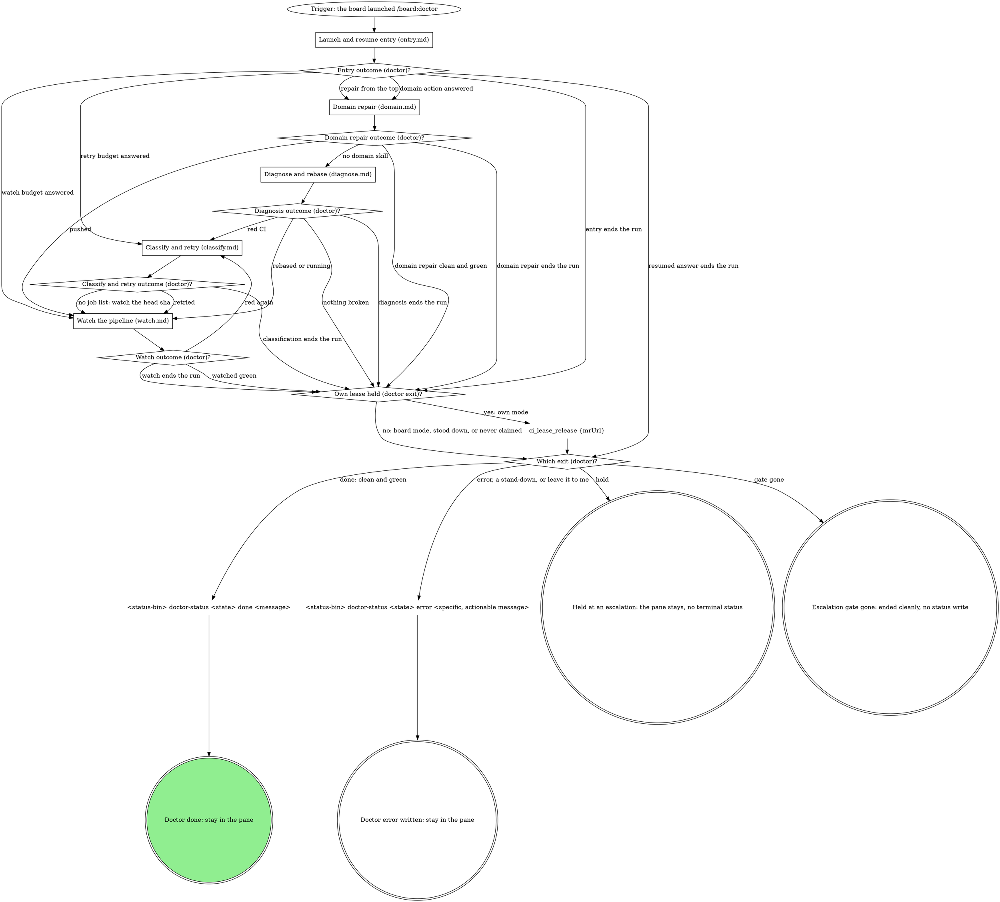
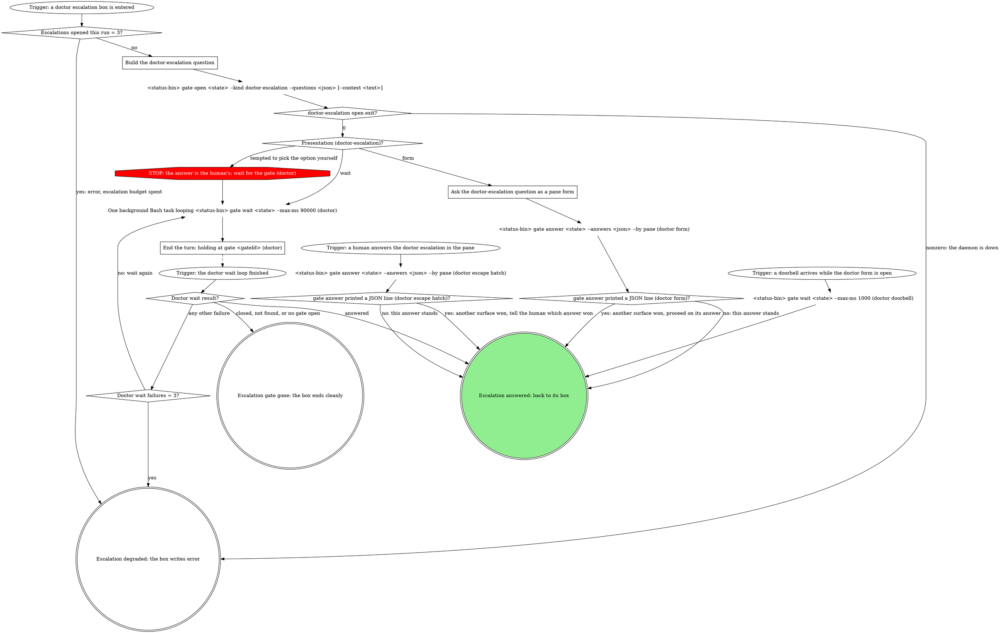

# mr-board doctor runner

The board launched this pane because an MR has mechanical breakage (CI red
and/or merge conflicts); it may be yours or a teammate's. The human is not
watching: finish unattended, and reach a human only through a
`doctor-escalation` gate or a terminal `error`. This wrapper carries **no**
repo- or CI-specific knowledge; the board injects it:

| flag | meaning |
|------|---------|
| `<mrUrl>` (positional) | the merge request to repair |
| `--state <handle>` | opaque board handle for this MR's repair. Pass it verbatim to `--status-bin`, `--draft-bin`, and the `gate` verbs; never read, stat, or write it. It looks like a `.json` path but no such file exists: board state lives in the board's database, and the path is only a key. Its absence on disk says nothing about whether the board is tracking this pass. |
| `--status-bin <path>` | absolute path to the board's status-writer CLI |
| `--skill <name>` | the domain skill that owns the actual repair (optional) |
| `--skill-path <path>` | absolute path to that skill's SKILL.md, when the board already resolved it (optional; see "Resolving the domain skill") |
| `--tier api` | API-only repair tier: no checkout, no worktree, no local commits. Absent = the historical checkout-tier behavior. |
| `--fix-classes <a,b>` | Comma-separated allowlist of fix classes the dispatching policy enabled (e.g. `retry-flake,inherited-note-draft`). Actions outside the list are escalations, not fixes. See "Fix classes" below for what each one licenses. |
| `--draft-bin <path>` | Absolute path to the board's draft-writer CLI. Any outbound MR note MUST be written through it as a held draft, passing this pane's own `--state` value through so the draft lands in the right board's db: `<draft-bin> doctor-draft <mrUrl> <iid> <kind> <body...> --state <state>`. Never post a note directly. |
| `--resumed-gate <gateId>` | this invocation is a parked-gate resume, not a fresh run (optional; see "Resumed entry" in `entry.md`) |
| `--resumed-gate-kind <kind>` | the `kind` of the gate `--resumed-gate` names (e.g. `doctor-escalation`). Present exactly when `--resumed-gate` is, and the only way to learn it: `--state` is an opaque handle and `gate wait` returns only the answer. |

Write status **only** by running the injected `--status-bin`:

```
<status-bin> doctor-status <state> <status> [message]
```

## State progression

The board owns `queued`. You emit the rest as you cross each milestone:

| Status | When to emit |
|--------|--------------|
| `diagnosing` | Immediately, before you know if it's conflicts, CI, or both. |
| `rebasing` | While a rebase/conflict resolution is running. |
| `fixing` | While implementing fixes for CI failures (or resolving conflicts), including while an escalation gate opened during a fix is being waited on; see "Escalation step" below. |
| `watching` | Post-push, while polling CI for green. |
| `done` | Terminal: clean + green, or fixes pushed and green. |
| `error` | Terminal: a non-enumerable failure needs a human to look directly, or an escalation answer is "leave it to me in the pane". |

## Flow

The graph is the map: start at the trigger and take only the edges it
draws. Each stage box is a file beside this one with its own graph and
sections; the exit at the end of the run (the lease release and the
terminal status) is drawn here.



A stage ends at a doublecircle that names where the map goes next, and
the stage's outcome diamond here takes the edge with that exit's name. A
stage entered at a named node (an answered domain action, a retry budget
answer, failed jobs from a watch) starts at its trigger for that entry.

What the graph cannot show:

- **Lease mode.** `Who holds the fresh lease (doctor)?` fixes the mode for
  the run: board mode (the board's `board:doctor:` owner holds it) or own
  mode (this session holds it). Every `Lease mode (...)?` diamond reads
  that mode. In board mode, a check that finds no fresh lease (null, or
  only a stale one) or another owner's lease is `another owner: stand
  down` at the `Lease check result (...)?` diamond: the board's lease is
  gone, and this pane never claims in its place. See "The CI lease".
- **Refusal budgets.** Each `Fixed the <tool> call once already?` counter
  counts for the whole run and does not reset on an off-script iterate: a
  refusal after an iterate goes straight back to that tool's off-script
  escalation, and its `Off-script rounds = 2 (...)?` counter bounds the
  loop.
- **Exit messages.** `done` names what the run repaired (or "clean and green,
  nothing to repair"). `error` is specific and actionable (see "Escalation
  shapes and phrasing"); a stand-down's message is `another CI attendant
  holds !<iid>: <holder>`. Hold and gate gone write no status. Under
  `--tier api` every status write names the action and its fix class.

### Launch and resume entry (entry.md)

Writes the first status, resolves the domain skill, checks the tier, and
reads or claims the CI lease; a parked-gate resume reads its parked
answer first and routes on it.
Read `entry.md` now and follow its graph; its sections are there.

### Domain repair (domain.md)

Hands the repair to the resolved domain skill, escalates the enumerable
decisions it reports back, and takes a refused `git_push` through its
off-script escalation.
Read `domain.md` now and follow its graph; its sections are there.

### Diagnose and rebase (diagnose.md)

The generic path's first read: what is broken on the MR, and a
server-side rebase when it has conflicts.
Read `diagnose.md` now and follow its graph; its sections are there.

### Classify and retry (classify.md)

Reads the failed jobs, classifies each, and retries a flaky job or
drafts an inherited-failure note under the CI lease.
Read `classify.md` now and follow its graph; its sections are there.

### Watch the pipeline (watch.md)

Watches one sha with `ci_watch` to a verdict, re-claims a lost own-mode
lease, and escalates a watch that runs past its budget.
Read `watch.md` now and follow its graph; its sections are there.

## Escalation step

Every `doctor escalation: ...` and `doctor off-script escalation: ...` box,
in whichever stage file holds it, takes this step. The step writes no
status: keep the status the escalating node left (`fixing` during a fix, `diagnosing` or `watching`
when a lease, read or watch refusal escalates), including while waiting.
The box that entered reads the outcome:

- **Answered:** its outcome diamond reads `answers.action`.
- **Gone** (closed, not found, or no gate open): end cleanly, say so in the
  pane, and write no status: whatever superseded the gate already owns this
  MR's board state.
- **Degraded** (`gate open` exits nonzero, the escalation budget is spent,
  or the wait keeps failing): the box writes `error` with the actionable
  escalation message this gate would have asked, and never presents a
  form. Doctor panes are routinely auto-dispatched with no human watching,
  and a form there waits forever without a terminal status; the board
  (and, for auto dispatches, the escalation notifier) surfaces the error
  to a human.



### Build the doctor-escalation question

Exactly one question, id `action`. Its `label` states the situation in one
line, in the voice of "Escalation shapes and phrasing". Each option is an
object in the box's own wording:

```json
{"value": "retry job 812 once more on 4f2a9c1", "label": "Retry it once more", "description": "I retry job 812 one more time and watch the pipeline for 4f2a9c1 again."}
```

`value` is spelled in full, human-readable, never a bare index or a
one-word verb the resumed entry could not route; `label` is 2 to 6 words;
`description` is one sentence saying what happens on that answer. The
last option is always `leave it to me in the pane`, with the value exactly
that literal string.

The open prints one JSON line, `{"gateId": "...", "presentation":
"form"}` or `"wait"`. Keep both: `Presentation (doctor-escalation)?` reads
`presentation`, and `End the turn: holding at gate <gateId> (doctor)`
names `gateId`.

`--context` carries the situation line the escalation composes, with any
quoted errors. When it would exceed 8192 UTF-8 bytes, omit `--context`
entirely rather than trimming it.

`Escalations opened this run = 3?` counts enumerable and off-script
escalations together; a resumed pane counts from zero. Each dead end
opens a new gate; an answered gate is never re-opened.

### Ask the doctor-escalation question as a pane form

Follow the gate protocol included at the end of this skill: its "Present
the in-pane gate form" step and its "Answers are option values" and
"Doorbell" sections, for the mechanics. Where it records the pane's
answer with the `gate_answer` tool, a board gate records it with
`<status-bin> gate answer <state> --answers <json> --by pane` instead.

- Render this gate's one question with its label verbatim, and submit the
  chosen option's `value` verbatim: never an index or a paraphrase.
- Nuance rides the note form: `{"action": {"value": "proceed as code-fix
  after override", "note": "but hold off on the migration file"}}`.
- A printed JSON line from `gate answer`, or a doorbell while the form
  still sits open, means another surface won: proceed on the winning
  answer, never the one you meant to submit. The doorbell is
  verify-only: read the recorded answer with `<status-bin> gate wait
  <state> --max-ms 1000`.
- A PreToolUse hook may deny native AskUserQuestion when no gate is open.
  That denial is the gate protocol speaking: take this step's `gate open`
  first. When the daemon is down the hook allows the native form, but this
  skill's degraded path is still `error`, never a form.

### End the turn: holding at gate <gateId> (doctor)

Read `${CLAUDE_SKILL_DIR}/../gate-cli-recipes/SKILL.md` with the Read
tool and follow its "Wait recipe": one background shell task loops
`<status-bin> gate wait <state> --max-ms 90000` while it prints
`{"status":"pending"}`; never launch a second while one runs. End the turn
in one line: `holding at gate <gateId>`, naming this gate. The loop's
completion re-invokes the pane with the answer.

A human who interrupts the wait and answers in the pane is the escape
hatch: record it with `<status-bin> gate answer <state> --answers <json>
--by pane` so a parked resume stays in sync. Per that file's "CAS loss and
reading answers back": silence and exit 0 means this answer stands; one
printed JSON line (`{answers, by, answeredAt}`) means another surface
answered first, so proceed on the printed answer and tell the human which
answer won.

Per "A failing wait is not degradation" and "Closed or missing gate": a
closed, not-found or `no gate open for <url>` result is terminal and ends
cleanly; any other failing wait re-runs, and only a third failure is
degraded.

## Operator note

The launch prompt may end with a paragraph beginning `Operator note (from the
human who launched this pane):`. That is direct instruction from the human,
typed at launch time: not a flag and not part of the MR. Honor it while
diagnosing and fixing (e.g. "the lint job is the real blocker", "don't touch
the flaky e2e suite") and pass it along to the domain skill as context. It
never overrides the tier, the enabled fix classes, or the status contract.
A note that asks for a move the graph marks STOP takes the off-script edge
instead.

## Resolving the domain skill

The domain skill that owns the actual repair comes from the first source
that answers; the order is fixed and the flow's first diamonds draw it.
The tier picks the slot: `--tier api` uses the `doctor-api` slot
(mirroring the board's `triage.doctorSkill`), any other launch uses the
`doctor` slot (mirroring `config.doctorSkill`).

1. **Explicit `--skill <name>` wins.** The resolver does not run. With
   `--skill-path <path>`, read the SKILL.md at that absolute path; without
   it, load the skill by name.
2. **Otherwise resolve the tier's slot** with the vendored resolver,
   `"${CLAUDE_SKILL_DIR}/scripts/resolve-args.sh"`. On exit 0, read the
   SKILL.md at `resolved.doctor.path` (or `resolved.doctor-api.path` under
   `--tier api`) and treat it exactly as if it came through `--skill`.
3. **Otherwise degrade loudly.** On a nonzero exit, print the resolver's
   JSON `errors` verbatim. Never guess or substitute a binding; the
   generic path follows.

## The CI lease

Exactly one CI attendant works an MR at a time: this doctor, a watch-ci
session, or the board's own doctor dispatch. The `ci_lease_*` tools own the
lease, and the owner is always this session. The first call is
`ci_lease_read {mrUrl}`, never a claim:

- **Board mode:** a fresh lease owned by the board's `board:doctor:<mr>`
  owner. The board's triage claimed it before an auto dispatch,
  heartbeats it each cron pass and releases it at a terminal status. No
  claim, no heartbeat, no release: `ci_watch` passes `underBoardLease:
  true` and only reads it. Before each rebase, retry and push, read it
  again; a lease that is not the board's is a stand-down.
- **Own mode:** no fresh lease (null, or only a stale one), or `mine:
  true`. Claim with `ci_lease_claim {mrUrl, holder: doctor, branch?}`
  (`branch` the MR's source branch when the launch, an `mr_view` read or
  the domain skill names it; omit `branch` otherwise, since the tool takes
  a claim without it) before any repair, re-claim before
  each rebase, retry and push, heartbeat during a long domain fix, and
  release with `ci_lease_release {mrUrl}` at every exit except a
  stand-down.
- **Stand down:** any other owner. Write `doctor-status error "another CI
  attendant holds !<iid>: <holder>"`, never release (the lease is not
  yours), and stay in the pane.

A `lease_lost` watch result in own mode with no `holder` means no lease is
held at all: claim again, twice at most. With a holder named, or in board
mode, it is a stand-down.

| Thought | Reality |
|---|---|
| "The board launched me, so I claim" | Board mode never claims. Read first; the board's lease covers this pane. |
| "Another session holds it but I can retry faster" | Stand down. Two attendants on one MR race each other's commits, pushes and retries. |
| "I claimed at the start, so the retry is mine" | The lease may have lapsed or moved. Check before every repair. |
| "The claim errored, so I skip the lease" | Fix the call once, then the off-script escalation. A repair never runs unleased. |

## Escalation shapes and phrasing

Escalate, don't speculate. A fix that needs product judgment or a
non-obvious semantic resolution takes one of two shapes:

- **Non-enumerable.** No small set of concrete choices exists: the
  diagnosis itself is unclear, or the fix is open-ended. Emit `error` with
  a specific, actionable message.
- **Enumerable.** The decision reduces to a short list of concrete,
  executable choices. Open a `doctor-escalation` gate instead of erroring.

The enumerable cases come in three shapes:

- **Conflict strategy:** both sides of a rebase conflict changed the same
  logic and there is a small set of concrete resolutions (keep one side,
  take the other, or a specific merge of both). Options are those
  resolutions.
- **Author-gate override:** safeguard 2 (`domain.md`) came back
  inconclusive or mismatched for a branch-writing fix class. Options are e.g. `"proceed as
  <fix class> after override"`. **The invariant survives this gate:** an
  answered override does **not** license skipping the independent check.
  Re-verify the author gate fresh, right before applying, exactly as the
  safeguard requires. If the fresh check still does not confirm the
  board's own identity, do not apply the fix; emit `error` with the
  concrete mismatch. A human overriding "proceed" without a match is
  exactly the ambiguity the safeguard exists to catch, so no pane answer
  resolves it.
- **Budget extension:** the fix or watch loop hit its budget without
  converging. Options are e.g. `"extend the fix budget by <n> more
  cycles"`. A
  granted extension that still does not converge is a fresh escalation,
  or `error` when nothing enumerable is left to offer.

### Non-enumerable (`error`)

No small set of concrete choices exists: emit `error` with a specific,
actionable message:

- `"no worktree available: the pool is full"`

Bad ones are vague: `"couldn't fix"`, `"needs human"`, `"CI still red"`.

### Enumerable (`doctor-escalation` gate)

A short list of concrete, executable choices exists: open the gate with
that list as `options`, e.g.:

- `"rebase conflict in app/routes/foo.ts: both sides modified handleSubmit"`
  with options:

  | Value | Label | Description |
  |---|---|---|
  | `keep the MR branch's handleSubmit` | Keep the MR's version | I resolve the conflict with the MR branch's handleSubmit and push. |
  | `keep main's handleSubmit` | Keep main's version | I resolve the conflict with main's handleSubmit and push. |
  | `leave it to me in the pane` | Leave it to me | I stop and write an error naming the conflict. |

- `"CI red after 3 cycles: 2 tests still failing (snapshot + business logic
  in Bar)"` with options:

  | Value | Label | Description |
  |---|---|---|
  | `extend the fix budget by 3 more cycles` | Try three more cycles | I keep fixing for up to three more fix and watch cycles. |
  | `leave it to me in the pane` | Leave it to me | I stop and write an error naming the failing tests. |

## API tier

When `--tier api` is present, the repair is checkout-free by contract:

- Never claim a worktree, never commit, never push. The only mutations
  allowed are job or pipeline retries (`mr_retry`), a server-side rebase
  (`mr_rebase`) when licensed, and held drafts via `--draft-bin`. The CI
  lease calls are bookkeeping, not repairs, and apply at this tier too.
- The `rebasing` and `fixing` milestones apply to their API-shaped
  equivalents (server-side rebase, retry); otherwise go straight from
  `diagnosing` to `watching`. Escalations apply unchanged at this tier: a
  retry loop that does not converge is a budget-extension escalation, as
  at the checkout tier.
- **Every autonomous action is reported as a status-bin write whose
  message names the action and fix class** (e.g. `fixing "retried job 812
  (retry-flake)"`, `rebasing "server-side rebase (clean-api-rebase)"`).
  For auto-dispatched doctors the status writer mirrors each of these into
  the audit log, one line per autonomous action, so an unreported action
  is an audit-trail violation, not a formality.
- Anything that would need a checkout is an `error` escalation whose
  message carries the diagnosis (failed job, one-line cause, why it is not
  yours to retry). The human is not watching; the escalation IS the
  handoff.

## Fix classes

`--fix-classes` is an allowlist, not a suggestion: a fix class not in the
list is out of scope, full stop, and the corresponding breakage is an
escalation instead.

- `retry-flake`: one retry of a flaky job (`mr_retry`).
- `inherited-note-draft`: a held draft through `--draft-bin` naming a
  failure inherited from the target branch.
- `clean-api-rebase`: a server-side rebase (`mr_rebase`).
  `Server-side rebase licensed?` answers yes when `--fix-classes` is
  absent or lists `clean-api-rebase`.
- **`mechanical-lint`** (checkout tier only): **behavior-neutral
  mechanical code fixes ONLY**... appending a required lint-disable reason
  suffix, formatting-only changes (whitespace, quote style, trailing
  commas), import ordering. Nothing that could alter runtime behavior
  qualifies; if a fix touches logic, changes a condition, adds or removes a
  code path, or you are not certain it's a no-op, it is **not**
  mechanical-lint... escalate it instead of guessing.
- **`code-fix`** (checkout tier only): **full repair authority on the
  board identity's OWN MRs**... real code fixes for red CI, semantic
  conflict resolution, committed and pushed to the MR branch. The
  dispatcher only ever includes this class when the MR author IS the
  board's own identity. Judgment line: `code-fix` licenses fixes a
  competent author would consider the obviously-intended change (a missing
  import, a type error with one evident correction, a broken test whose
  fixture drifted from sanctioned behavior). It does NOT license design
  decisions: when the fix would CHANGE sanctioned behavior, pick between
  plausible intents, or the loop is not converging, escalate with the
  options laid out.
- When both `mechanical-lint` and `code-fix` are present, the fix takes the
  narrowest class that covers it, and the commit message names that class.

## Rules

- No `--no-verify`, no bypassing pre-commit hooks.
- Force only through `git_push`'s `forceWithLease: true`, never a plain
  force.
- Open a gate only when the decision genuinely reduces to a short,
  concrete, executable list of options. When in doubt whether a failure is
  enumerable, it isn't: emit `error` instead of inventing options a human
  wouldn't recognize as their real choices.
- `--state` is a handle, not a file: pass it verbatim, never read or write
  it yourself.

## Gate protocol

The daemon-generic gate mechanics every passage above refers to. The board's
own projections (`<status-bin> gate ...`) sit in `board:gate-cli-recipes`;
everything else is here.

{{include:gate-protocol}}
