# board:doctor: classify and retry

This is a stage of the board:doctor skill. Every escalation box here
takes the "Escalation step" in its SKILL.md, and SKILL.md's "The CI
lease", "Fix classes", "API tier" and "What the graph cannot show" apply
here too.

Reads the failed jobs, classifies each, and retries a flaky job or
drafts an inherited-failure note under the CI lease.

```dot
digraph doctor_classify_and_retry {
    rankdir=TB;

    "Trigger: the map enters Classify and retry with red CI" [shape=ellipse];
    "Trigger: the map enters Classify and retry with failed jobs from a watch" [shape=ellipse];
    "Trigger: the map enters Classify and retry with a retry budget answer" [shape=ellipse];
    "mr_pipeline {mrUrl}" [shape=plaintext];
    "mr_pipeline result (doctor)?" [shape=diamond];
    "Fixed the mr_pipeline call once already?" [shape=diamond];
    "Fix what the mr_pipeline error names" [shape=box];
    "Failed jobs listed in pipeline.jobs (doctor)?" [shape=diamond];
    "Trace tails enough to classify (doctor)?" [shape=diamond];
    "mr_job_trace {mrUrl, jobId} per failed job" [shape=plaintext];
    "mr_job_trace result (doctor)?" [shape=diamond];
    "Fixed the mr_job_trace call once already?" [shape=diamond];
    "Fix what the mr_job_trace error names" [shape=box];
    "Classify each failed job (doctor)" [shape=box];
    "Classification (doctor)?" [shape=diamond];
    "<draft-bin> doctor-draft <mrUrl> <iid> <kind> <body...> --state <state>" [shape=plaintext];
    "<status-bin> doctor-status <state> fixing <message naming the draft and inherited-note-draft>" [shape=plaintext];
    "Lease mode (before the retry)?" [shape=diamond];
    "ci_lease_read {mrUrl} (before the retry)" [shape=plaintext];
    "ci_lease_claim {mrUrl, holder: doctor, branch?} (before the retry)" [shape=plaintext];
    "Lease check result (before the retry)?" [shape=diamond];
    "mr_retry {mrUrl, jobId}" [shape=plaintext];
    "mr_retry result?" [shape=diamond];
    "STOP: retries go through mr_retry" [shape=octagon style=filled fillcolor=red fontcolor=white];
    "Fixed the mr_retry call once already?" [shape=diamond];
    "Fix what the mr_retry error names" [shape=box];
    "<status-bin> doctor-status <state> fixing <message naming the retried job and retry-flake>" [shape=plaintext];
    "doctor escalation: budget extension (retry)" [shape=box];
    "Escalation outcome (retry budget)?" [shape=diamond];
    "doctor off-script escalation: lease check refused before the retry" [shape=box];
    "Off-script outcome (lease check before the retry)?" [shape=diamond];
    "Off-script rounds = 2 (lease check before the retry)?" [shape=diamond];
    "doctor off-script escalation: mr_pipeline refused" [shape=box];
    "Off-script outcome (mr_pipeline)?" [shape=diamond];
    "Off-script rounds = 2 (mr_pipeline)?" [shape=diamond];
    "doctor off-script escalation: mr_job_trace refused" [shape=box];
    "Off-script outcome (mr_job_trace)?" [shape=diamond];
    "Off-script rounds = 2 (mr_job_trace)?" [shape=diamond];
    "doctor off-script escalation: mr_retry refused" [shape=box];
    "Off-script outcome (mr_retry)?" [shape=diamond];
    "Off-script rounds = 2 (mr_retry)?" [shape=diamond];
    "Retried: continue at Watch the pipeline" [shape=doublecircle style=filled fillcolor=lightgreen];
    "No job list: continue at Watch the pipeline on the head sha" [shape=doublecircle];
    "Classification ends the run: continue at the map's exit" [shape=doublecircle];

    "Trigger: the map enters Classify and retry with red CI" -> "mr_pipeline {mrUrl}";
    "Trigger: the map enters Classify and retry with failed jobs from a watch" -> "Trace tails enough to classify (doctor)?";
    "Trigger: the map enters Classify and retry with a retry budget answer" -> "Lease mode (before the retry)?";
    "mr_pipeline {mrUrl}" -> "mr_pipeline result (doctor)?";
    "mr_pipeline result (doctor)?" -> "Failed jobs listed in pipeline.jobs (doctor)?" [label="ok"];
    "mr_pipeline result (doctor)?" -> "Fixed the mr_pipeline call once already?" [label="tool error"];
    "Fixed the mr_pipeline call once already?" -> "Fix what the mr_pipeline error names" [label="no"];
    "Fixed the mr_pipeline call once already?" -> "doctor off-script escalation: mr_pipeline refused" [label="yes"];
    "Fix what the mr_pipeline error names" -> "mr_pipeline {mrUrl}";
    "Failed jobs listed in pipeline.jobs (doctor)?" -> "mr_job_trace {mrUrl, jobId} per failed job" [label="yes: read each one's trace"];
    "Failed jobs listed in pipeline.jobs (doctor)?" -> "No job list: continue at Watch the pipeline on the head sha" [label="no: pipeline.jobs empty or no failed job in it"];
    "Trace tails enough to classify (doctor)?" -> "Classify each failed job (doctor)" [label="yes"];
    "Trace tails enough to classify (doctor)?" -> "mr_job_trace {mrUrl, jobId} per failed job" [label="no"];
    "mr_job_trace {mrUrl, jobId} per failed job" -> "mr_job_trace result (doctor)?";
    "mr_job_trace result (doctor)?" -> "Classify each failed job (doctor)" [label="ok"];
    "mr_job_trace result (doctor)?" -> "Fixed the mr_job_trace call once already?" [label="tool error"];
    "Fixed the mr_job_trace call once already?" -> "Fix what the mr_job_trace error names" [label="no"];
    "Fixed the mr_job_trace call once already?" -> "doctor off-script escalation: mr_job_trace refused" [label="yes"];
    "Fix what the mr_job_trace error names" -> "mr_job_trace {mrUrl, jobId} per failed job";
    "Classify each failed job (doctor)" -> "Classification (doctor)?";
    "Classification (doctor)?" -> "Lease mode (before the retry)?" [label="flaky, retry licensed, not retried yet"];
    "Classification (doctor)?" -> "doctor escalation: budget extension (retry)" [label="flaky, retried once already"];
    "Classification (doctor)?" -> "<draft-bin> doctor-draft <mrUrl> <iid> <kind> <body...> --state <state>" [label="inherited from the target branch, inherited-note-draft licensed"];
    "Classification (doctor)?" -> "Classification ends the run: continue at the map's exit" [label="real, or no licensed fix: error with the diagnosis"];
    "<draft-bin> doctor-draft <mrUrl> <iid> <kind> <body...> --state <state>" -> "<status-bin> doctor-status <state> fixing <message naming the draft and inherited-note-draft>";
    "<status-bin> doctor-status <state> fixing <message naming the draft and inherited-note-draft>" -> "Classification ends the run: continue at the map's exit";
    "Lease mode (before the retry)?" -> "ci_lease_read {mrUrl} (before the retry)" [label="board mode"];
    "Lease mode (before the retry)?" -> "ci_lease_claim {mrUrl, holder: doctor, branch?} (before the retry)" [label="own mode"];
    "ci_lease_read {mrUrl} (before the retry)" -> "Lease check result (before the retry)?";
    "ci_lease_claim {mrUrl, holder: doctor, branch?} (before the retry)" -> "Lease check result (before the retry)?";
    "Lease check result (before the retry)?" -> "mr_retry {mrUrl, jobId}" [label="still the board's, or claimed: true"];
    "Lease check result (before the retry)?" -> "Classification ends the run: continue at the map's exit" [label="another owner: stand down"];
    "Lease check result (before the retry)?" -> "doctor off-script escalation: lease check refused before the retry" [label="tool error"];
    "mr_retry {mrUrl, jobId}" -> "mr_retry result?";
    "mr_retry result?" -> "<status-bin> doctor-status <state> fixing <message naming the retried job and retry-flake>" [label="retried"];
    "mr_retry result?" -> "Fixed the mr_retry call once already?" [label="tool error"];
    "mr_retry result?" -> "STOP: retries go through mr_retry" [label="tempted to rerun the job with the GitLab CLI"];
    "STOP: retries go through mr_retry" -> "Fixed the mr_retry call once already?";
    "Fixed the mr_retry call once already?" -> "Fix what the mr_retry error names" [label="no"];
    "Fixed the mr_retry call once already?" -> "doctor off-script escalation: mr_retry refused" [label="yes"];
    "Fix what the mr_retry error names" -> "Lease mode (before the retry)?";
    "<status-bin> doctor-status <state> fixing <message naming the retried job and retry-flake>" -> "Retried: continue at Watch the pipeline";
    "doctor escalation: budget extension (retry)" -> "Escalation outcome (retry budget)?";
    "Escalation outcome (retry budget)?" -> "Lease mode (before the retry)?" [label="retry the job once more on its sha"];
    "Escalation outcome (retry budget)?" -> "Classification ends the run: continue at the map's exit" [label="leave it to me in the pane: error"];
    "Escalation outcome (retry budget)?" -> "Classification ends the run: continue at the map's exit" [label="gate gone"];
    "Escalation outcome (retry budget)?" -> "Classification ends the run: continue at the map's exit" [label="degraded: error"];
    "doctor off-script escalation: lease check refused before the retry" -> "Off-script outcome (lease check before the retry)?";
    "Off-script outcome (lease check before the retry)?" -> "mr_retry {mrUrl, jobId}" [label="take: the human confirms the lease"];
    "Off-script outcome (lease check before the retry)?" -> "Off-script rounds = 2 (lease check before the retry)?" [label="iterate: the cause is fixed"];
    "Off-script outcome (lease check before the retry)?" -> "Classification ends the run: continue at the map's exit" [label="hold"];
    "Off-script outcome (lease check before the retry)?" -> "Classification ends the run: continue at the map's exit" [label="leave it to me in the pane: error"];
    "Off-script outcome (lease check before the retry)?" -> "Classification ends the run: continue at the map's exit" [label="gate gone"];
    "Off-script outcome (lease check before the retry)?" -> "Classification ends the run: continue at the map's exit" [label="degraded: error"];
    "Off-script rounds = 2 (lease check before the retry)?" -> "Lease mode (before the retry)?" [label="no: check again"];
    "Off-script rounds = 2 (lease check before the retry)?" -> "Classification ends the run: continue at the map's exit" [label="yes: error, the refusals are the reason"];
    "doctor off-script escalation: mr_pipeline refused" -> "Off-script outcome (mr_pipeline)?";
    "Off-script outcome (mr_pipeline)?" -> "Trace tails enough to classify (doctor)?" [label="take: the human reports the failed jobs"];
    "Off-script outcome (mr_pipeline)?" -> "Off-script rounds = 2 (mr_pipeline)?" [label="iterate: the cause is fixed"];
    "Off-script outcome (mr_pipeline)?" -> "Classification ends the run: continue at the map's exit" [label="hold"];
    "Off-script outcome (mr_pipeline)?" -> "Classification ends the run: continue at the map's exit" [label="leave it to me in the pane: error"];
    "Off-script outcome (mr_pipeline)?" -> "Classification ends the run: continue at the map's exit" [label="gate gone"];
    "Off-script outcome (mr_pipeline)?" -> "Classification ends the run: continue at the map's exit" [label="degraded: error"];
    "Off-script rounds = 2 (mr_pipeline)?" -> "mr_pipeline {mrUrl}" [label="no: read again"];
    "Off-script rounds = 2 (mr_pipeline)?" -> "Classification ends the run: continue at the map's exit" [label="yes: error, the refusals are the reason"];
    "doctor off-script escalation: mr_job_trace refused" -> "Off-script outcome (mr_job_trace)?";
    "Off-script outcome (mr_job_trace)?" -> "Classify each failed job (doctor)" [label="take: the human pastes the traces"];
    "Off-script outcome (mr_job_trace)?" -> "Off-script rounds = 2 (mr_job_trace)?" [label="iterate: the cause is fixed"];
    "Off-script outcome (mr_job_trace)?" -> "Classification ends the run: continue at the map's exit" [label="hold"];
    "Off-script outcome (mr_job_trace)?" -> "Classification ends the run: continue at the map's exit" [label="leave it to me in the pane: error"];
    "Off-script outcome (mr_job_trace)?" -> "Classification ends the run: continue at the map's exit" [label="gate gone"];
    "Off-script outcome (mr_job_trace)?" -> "Classification ends the run: continue at the map's exit" [label="degraded: error"];
    "Off-script rounds = 2 (mr_job_trace)?" -> "mr_job_trace {mrUrl, jobId} per failed job" [label="no: read again"];
    "Off-script rounds = 2 (mr_job_trace)?" -> "Classification ends the run: continue at the map's exit" [label="yes: error, the refusals are the reason"];
    "doctor off-script escalation: mr_retry refused" -> "Off-script outcome (mr_retry)?";
    "Off-script outcome (mr_retry)?" -> "<status-bin> doctor-status <state> fixing <message naming the retried job and retry-flake>" [label="take: the human retried the job"];
    "Off-script outcome (mr_retry)?" -> "Off-script rounds = 2 (mr_retry)?" [label="iterate: the cause is fixed"];
    "Off-script outcome (mr_retry)?" -> "Classification ends the run: continue at the map's exit" [label="hold"];
    "Off-script outcome (mr_retry)?" -> "Classification ends the run: continue at the map's exit" [label="leave it to me in the pane: error"];
    "Off-script outcome (mr_retry)?" -> "Classification ends the run: continue at the map's exit" [label="gate gone"];
    "Off-script outcome (mr_retry)?" -> "Classification ends the run: continue at the map's exit" [label="degraded: error"];
    "Off-script rounds = 2 (mr_retry)?" -> "Lease mode (before the retry)?" [label="no: check the lease, retry again"];
    "Off-script rounds = 2 (mr_retry)?" -> "Classification ends the run: continue at the map's exit" [label="yes: error, the refusals are the reason"];
}
```

### Fix what the mr_pipeline error names

`mr_pipeline` refused its input. Correct what the error names (`mrUrl` the
MR's https URL, `jobId` the numeric part of a `gitlab:job:N` id when you
passed one) and read again, once. An error that names no input has nothing
to correct: read again unchanged, once, and the off-script escalation
follows.

### Fix what the mr_job_trace error names

`mr_job_trace` refused its input. Correct what the error names (`jobId`
the numeric part of a `gitlab:job:N` id from this MR's pipeline, `mrUrl`
the MR's https URL) and read again, once. An error that names no input has
nothing to correct: read again unchanged, once, and the off-script
escalation follows.

### Fix what the mr_retry error names

`mr_retry` refused its input. Correct what the error names (`jobId` the
numeric part of a `gitlab:job:N` id; pass exactly one of `jobId` or
`pipelineId`) and go back through the lease check before retrying again,
once. An error that names no input (a 403 scope error, for example) has
nothing to correct: retry again unchanged, once, and the off-script
escalation follows. An error is never a reason to rerun the job with the
GitLab CLI.

### Classify each failed job (doctor)

Classify from trace text. Only `ci_watch`'s `failedJobs` carry a trace
tail; `mr_pipeline` lists `pipeline.jobs` (id, name, stage, status) with
no trace, so each failed job it lists is read with `mr_job_trace`. A
`ci_watch` tail too short to classify, or failed jobs the human reported
without their traces, also go through `mr_job_trace`.
`pipeline.jobs` can be empty (a cache entry written at list weight), and
then there is no job id to trace: `Failed jobs listed in pipeline.jobs
(doctor)?` answers no, and the map watches the head sha `mr_view` read.
`ci_watch` on a settled red pipeline returns `failed` with its
`failedJobs` at once, and they come back here with their tails.

When the failed jobs fall in different classes, the first match in this
order decides the run: any real or unlicensed job (`real, or no licensed
fix`), then any inherited job, then flaky. Retrying a flaky job beside a
real failure only spends a watch before the same error.

- **Flaky:** unrelated to the change (a runner, network or dependency
  outage, a known flake). One retry per flaky job: a job retried once
  already goes to the retry budget extension. Retry one job per pass;
  `ci_watch` returns the others still failing, and they come back here.
- **Inherited:** the same failure is red on the target branch. The note
  goes out only as a held draft through `--draft-bin`, and the status
  write names the draft and `inherited-note-draft`; the run then ends in
  `error` with the diagnosis, since the fix is not this MR's.
- **Real:** the change broke it (a test, type or lint failure in touched
  code). Not the generic path's to fix: `error` with the diagnosis (failed
  job, one-line cause, why it is not yours to retry).

`--fix-classes` is an allowlist: a retry needs `retry-flake` listed, a
draft needs `inherited-note-draft` listed (and `--draft-bin`). No
`--fix-classes` means the historical unrestricted behavior: both are
licensed. A classification with no licensed fix is `real, or no licensed
fix`.

`ci_watch` details at most five blocking failures. When `blockingFailures`
is larger than the jobs in `failedJobs`, the rest are unclassified, so the
red is not flaky-only: take `real, or no licensed fix` and let the error
name the count.

### doctor escalation: budget extension (retry)

Take the escalation step with a flaky job that failed again after its one
retry. Label: `job <id> (<name>) failed again after one retry
(retry-flake)`.

| Value                               | Label              | Description                                                            |
| ----------------------------------- | ------------------ | ---------------------------------------------------------------------- |
| `retry job <id> once more on <sha>` | Retry it once more | I retry job <id> one more time and watch the pipeline for <sha> again. |
| `leave it to me in the pane`        | Leave it to me     | I stop here and write an error naming the failing job.                 |

Spell the job id and the sha of its pipeline in the value (`retry job 812
once more on <sha>`); the value carries both, so a resumed pane retries
that job and watches that sha without another read. A granted retry that fails again is a fresh escalation,
never another silent retry.

### doctor off-script escalation: lease check refused before the retry

Take the escalation step with this question. Only one of `ci_lease_read`
or `ci_lease_claim` runs at this site in a run, so the site is one origin.
Label: `lease check before retrying job <id> refused on !<iid>: <error>`.
Context: the lease tool's error, quoted.

| Value                                                                                                     | Label                 | Description                                                   |
| --------------------------------------------------------------------------------------------------------- | --------------------- | ------------------------------------------------------------- |
| `take: you confirm this pane holds the lease, then retry job <id> (lease check refused before the retry)` | Lease is fine, retry  | You confirm this pane holds the lease and I retry job <id>.   |
| `iterate: you fixed the cause, check the lease again (lease check refused before the retry)`              | Fixed it, check again | You fixed what refused the check and I check the lease again. |
| `hold: keep this pane open with nothing moved (lease check refused before the retry)`                     | Hold this pane        | I stop before the retry and the pane stays open.              |
| `leave it to me in the pane`                                                                              | Leave it to me        | I write an error naming the refusal and you take over.        |

Iterate passes `Off-script rounds = 2 (lease check before the retry)?`
before checking again.

### doctor off-script escalation: mr_pipeline refused

Take the escalation step with this question. Label: `mr_pipeline refused
twice on !<iid>: <second error>`. Context: both `mr_pipeline` errors,
quoted.

| Value                                                                         | Label                | Description                                                    |
| ----------------------------------------------------------------------------- | -------------------- | -------------------------------------------------------------- |
| `take: you tell me which jobs failed and why (mr_pipeline refused)`           | Tell me failed jobs  | You name the failed jobs and their causes and I classify them. |
| `iterate: you fixed the cause, read the pipeline again (mr_pipeline refused)` | Fixed it, read again | You fixed what refused the read and I read the pipeline again. |
| `hold: keep this pane open with nothing moved (mr_pipeline refused)`          | Hold this pane       | I stop with nothing moved and the pane stays open.             |
| `leave it to me in the pane`                                                  | Leave it to me       | I write an error naming the refusal and you take over.         |

Iterate passes `Off-script rounds = 2 (mr_pipeline)?` before reading
again.

### doctor off-script escalation: mr_job_trace refused

Take the escalation step with this question. Label: `mr_job_trace refused
twice for job <id> on !<iid>: <second error>`. Context: both
`mr_job_trace` errors, quoted.

| Value                                                                        | Label                | Description                                                  |
| ---------------------------------------------------------------------------- | -------------------- | ------------------------------------------------------------ |
| `take: you paste the failed job traces (mr_job_trace refused)`               | Paste the traces     | You paste the failed job traces and I classify from them.    |
| `iterate: you fixed the cause, read the traces again (mr_job_trace refused)` | Fixed it, read again | You fixed what refused the read and I read the traces again. |
| `hold: keep this pane open with nothing moved (mr_job_trace refused)`        | Hold this pane       | I stop with nothing moved and the pane stays open.           |
| `leave it to me in the pane`                                                 | Leave it to me       | I write an error naming the refusal and you take over.       |

Iterate passes `Off-script rounds = 2 (mr_job_trace)?` before reading
again.

### doctor off-script escalation: mr_retry refused

Take the escalation step with this question. Label: `mr_retry refused
twice for job <id> on !<iid>: <second error>`. Context: both `mr_retry`
errors, quoted.

| Value                                                                              | Label                 | Description                                                             |
| ---------------------------------------------------------------------------------- | --------------------- | ----------------------------------------------------------------------- |
| `take: you retry job <id> yourself, I watch for the result (mr_retry refused)`     | Retry it yourself     | You retry job <id> and I watch the pipeline for the result.             |
| `iterate: you fixed the cause, check the lease and retry again (mr_retry refused)` | Fixed it, retry again | You fixed what refused the retry and I check the lease and retry again. |
| `hold: keep this pane open with nothing moved (mr_retry refused)`                  | Hold this pane        | I stop before retrying and the pane stays open.                         |
| `leave it to me in the pane`                                                       | Leave it to me        | I write an error naming the refusal and you take over.                  |

Iterate passes `Off-script rounds = 2 (mr_retry)?` before the lease check
and the retry.
