# board:doctor: launch and resume entry

This is a stage of the board:doctor skill. Every escalation box here
takes the "Escalation step" in its SKILL.md, and SKILL.md's "Resolving
the domain skill", "The CI lease" and "What the graph cannot show" apply
here too.

Writes the first status, resolves the domain skill, checks the tier, and
reads or claims the CI lease; a parked-gate resume reads its parked
answer first and routes on it.

```dot
digraph doctor_entry {
    rankdir=TB;

    "Trigger: the map enters Launch and resume entry" [shape=ellipse];
    "--resumed-gate given (doctor)?" [shape=diamond];
    "<status-bin> doctor-status <state> fixing (resumed gate)" [shape=plaintext];
    "<status-bin> doctor-status <state> diagnosing" [shape=plaintext];
    "--skill given (doctor)?" [shape=diamond];
    "--skill-path given (doctor)?" [shape=diamond];
    "Read <--skill-path> (doctor)" [shape=plaintext];
    "Load the --skill domain skill by name (doctor)" [shape=box];
    "${CLAUDE_SKILL_DIR}/scripts/resolve-args.sh (doctor)" [shape=plaintext];
    "resolve-args.sh exit (doctor)?" [shape=diamond];
    "Read <the tier's resolved path> (doctor)" [shape=plaintext];
    "Print the resolver's errors verbatim (doctor)" [shape=box];
    "Branch-writing class under --tier api?" [shape=diamond];
    "ci_lease_read {mrUrl}" [shape=plaintext];
    "Who holds the fresh lease (doctor)?" [shape=diamond];
    "ci_lease_claim {mrUrl, holder: doctor, branch?}" [shape=plaintext];
    "ci_lease_claim result (doctor)?" [shape=diamond];
    "Fixed the ci_lease_read call once already?" [shape=diamond];
    "Fix what the ci_lease_read error names" [shape=box];
    "Fixed the ci_lease_claim call once already?" [shape=diamond];
    "Fix what the ci_lease_claim error names" [shape=box];
    "STOP: while another attendant holds the lease, stand down; every commit, push and retry is theirs" [shape=octagon style=filled fillcolor=red fontcolor=white];
    "Which entry (doctor)?" [shape=diamond];
    "<status-bin> gate wait <state> (resumed escalation)" [shape=plaintext];
    "Resumed wait result (doctor)?" [shape=diamond];
    "Resumed wait failures = 3 (doctor)?" [shape=diamond];
    "Does the resumed answer end the run (doctor)?" [shape=diamond];
    "What does the resumed answer name (doctor)?" [shape=diamond];
    "doctor off-script escalation: ci_lease_read refused" [shape=box];
    "Off-script outcome (ci_lease_read)?" [shape=diamond];
    "Off-script rounds = 2 (ci_lease_read)?" [shape=diamond];
    "doctor off-script escalation: ci_lease_claim refused" [shape=box];
    "Off-script outcome (ci_lease_claim)?" [shape=diamond];
    "Off-script rounds = 2 (ci_lease_claim)?" [shape=diamond];
    "Repair from the top: continue at Domain repair" [shape=doublecircle style=filled fillcolor=lightgreen];
    "Domain action answered: continue at Domain repair" [shape=doublecircle];
    "Retry budget answered: continue at Classify and retry" [shape=doublecircle];
    "Watch budget answered: continue at Watch the pipeline" [shape=doublecircle];
    "Entry ends the run: continue at the map's exit" [shape=doublecircle];
    "Resumed answer ends the run: continue at Which exit in the map" [shape=doublecircle];

    "Trigger: the map enters Launch and resume entry" -> "--resumed-gate given (doctor)?";
    "--resumed-gate given (doctor)?" -> "<status-bin> doctor-status <state> fixing (resumed gate)" [label="yes"];
    "--resumed-gate given (doctor)?" -> "<status-bin> doctor-status <state> diagnosing" [label="no: a fresh run"];
    "<status-bin> doctor-status <state> fixing (resumed gate)" -> "<status-bin> gate wait <state> (resumed escalation)";
    "<status-bin> doctor-status <state> diagnosing" -> "--skill given (doctor)?";
    "--skill given (doctor)?" -> "--skill-path given (doctor)?" [label="yes"];
    "--skill given (doctor)?" -> "${CLAUDE_SKILL_DIR}/scripts/resolve-args.sh (doctor)" [label="no"];
    "--skill-path given (doctor)?" -> "Read <--skill-path> (doctor)" [label="yes"];
    "--skill-path given (doctor)?" -> "Load the --skill domain skill by name (doctor)" [label="no"];
    "Read <--skill-path> (doctor)" -> "Branch-writing class under --tier api?";
    "Load the --skill domain skill by name (doctor)" -> "Branch-writing class under --tier api?";
    "${CLAUDE_SKILL_DIR}/scripts/resolve-args.sh (doctor)" -> "resolve-args.sh exit (doctor)?";
    "resolve-args.sh exit (doctor)?" -> "Read <the tier's resolved path> (doctor)" [label="0"];
    "resolve-args.sh exit (doctor)?" -> "Print the resolver's errors verbatim (doctor)" [label="nonzero: generic path"];
    "Read <the tier's resolved path> (doctor)" -> "Branch-writing class under --tier api?";
    "Print the resolver's errors verbatim (doctor)" -> "Branch-writing class under --tier api?";
    "Branch-writing class under --tier api?" -> "Entry ends the run: continue at the map's exit" [label="yes: a dispatcher bug, error"];
    "Branch-writing class under --tier api?" -> "ci_lease_read {mrUrl}" [label="no"];
    "ci_lease_read {mrUrl}" -> "Who holds the fresh lease (doctor)?";
    "Who holds the fresh lease (doctor)?" -> "Which entry (doctor)?" [label="the board's board:doctor owner: board mode"];
    "Who holds the fresh lease (doctor)?" -> "Which entry (doctor)?" [label="mine: true: own mode"];
    "Who holds the fresh lease (doctor)?" -> "ci_lease_claim {mrUrl, holder: doctor, branch?}" [label="nobody, or only a stale lease"];
    "Who holds the fresh lease (doctor)?" -> "Entry ends the run: continue at the map's exit" [label="another owner: stand down, error naming the holder"];
    "Who holds the fresh lease (doctor)?" -> "Fixed the ci_lease_read call once already?" [label="tool error"];
    "Who holds the fresh lease (doctor)?" -> "STOP: while another attendant holds the lease, stand down; every commit, push and retry is theirs" [label="tempted to claim over the holder or work anyway"];
    "STOP: while another attendant holds the lease, stand down; every commit, push and retry is theirs" -> "Entry ends the run: continue at the map's exit";
    "Fixed the ci_lease_read call once already?" -> "Fix what the ci_lease_read error names" [label="no"];
    "Fixed the ci_lease_read call once already?" -> "doctor off-script escalation: ci_lease_read refused" [label="yes"];
    "Fix what the ci_lease_read error names" -> "ci_lease_read {mrUrl}";
    "ci_lease_claim {mrUrl, holder: doctor, branch?}" -> "ci_lease_claim result (doctor)?";
    "ci_lease_claim result (doctor)?" -> "Which entry (doctor)?" [label="claimed: true: own mode"];
    "ci_lease_claim result (doctor)?" -> "Entry ends the run: continue at the map's exit" [label="claimed: false: stand down, error naming the holder"];
    "ci_lease_claim result (doctor)?" -> "Fixed the ci_lease_claim call once already?" [label="tool error"];
    "Fixed the ci_lease_claim call once already?" -> "Fix what the ci_lease_claim error names" [label="no"];
    "Fixed the ci_lease_claim call once already?" -> "doctor off-script escalation: ci_lease_claim refused" [label="yes"];
    "Fix what the ci_lease_claim error names" -> "ci_lease_claim {mrUrl, holder: doctor, branch?}";
    "Which entry (doctor)?" -> "What does the resumed answer name (doctor)?" [label="resumed gate"];
    "Which entry (doctor)?" -> "Repair from the top: continue at Domain repair" [label="fresh run"];
    "<status-bin> gate wait <state> (resumed escalation)" -> "Resumed wait result (doctor)?";
    "Resumed wait result (doctor)?" -> "Does the resumed answer end the run (doctor)?" [label="answered"];
    "Resumed wait result (doctor)?" -> "Entry ends the run: continue at the map's exit" [label="closed, not found, or no gate open: gate gone"];
    "Resumed wait result (doctor)?" -> "Resumed wait failures = 3 (doctor)?" [label="any other failure"];
    "Resumed wait failures = 3 (doctor)?" -> "<status-bin> gate wait <state> (resumed escalation)" [label="no: wait again"];
    "Resumed wait failures = 3 (doctor)?" -> "Entry ends the run: continue at the map's exit" [label="yes: degraded, error"];
    "Does the resumed answer end the run (doctor)?" -> "Resumed answer ends the run: continue at Which exit in the map" [label="an off-script hold: nothing claimed"];
    "Does the resumed answer end the run (doctor)?" -> "Resumed answer ends the run: continue at Which exit in the map" [label="leave it to me in the pane: error, nothing claimed"];
    "Does the resumed answer end the run (doctor)?" -> "--skill given (doctor)?" [label="no: take, iterate, retry, watch or a domain action"];
    "What does the resumed answer name (doctor)?" -> "Retry budget answered: continue at Classify and retry" [label="a job retry on a sha (retry budget extension)"];
    "What does the resumed answer name (doctor)?" -> "Watch budget answered: continue at Watch the pipeline" [label="more watch calls (watch budget extension)"];
    "What does the resumed answer name (doctor)?" -> "Domain action answered: continue at Domain repair" [label="a domain action: conflict strategy, override, budget extension"];
    "What does the resumed answer name (doctor)?" -> "Repair from the top: continue at Domain repair" [label="an off-script take or iterate: repair again with its note"];
    "doctor off-script escalation: ci_lease_read refused" -> "Off-script outcome (ci_lease_read)?";
    "Off-script outcome (ci_lease_read)?" -> "Who holds the fresh lease (doctor)?" [label="take: the human reports who holds it"];
    "Off-script outcome (ci_lease_read)?" -> "Off-script rounds = 2 (ci_lease_read)?" [label="iterate: the cause is fixed"];
    "Off-script outcome (ci_lease_read)?" -> "Entry ends the run: continue at the map's exit" [label="hold"];
    "Off-script outcome (ci_lease_read)?" -> "Entry ends the run: continue at the map's exit" [label="leave it to me in the pane: error"];
    "Off-script outcome (ci_lease_read)?" -> "Entry ends the run: continue at the map's exit" [label="gate gone"];
    "Off-script outcome (ci_lease_read)?" -> "Entry ends the run: continue at the map's exit" [label="degraded: error"];
    "Off-script rounds = 2 (ci_lease_read)?" -> "ci_lease_read {mrUrl}" [label="no: read again"];
    "Off-script rounds = 2 (ci_lease_read)?" -> "Entry ends the run: continue at the map's exit" [label="yes: error, the refusals are the reason"];
    "doctor off-script escalation: ci_lease_claim refused" -> "Off-script outcome (ci_lease_claim)?";
    "Off-script outcome (ci_lease_claim)?" -> "Which entry (doctor)?" [label="take: the human set the lease for this pane"];
    "Off-script outcome (ci_lease_claim)?" -> "Off-script rounds = 2 (ci_lease_claim)?" [label="iterate: the cause is fixed"];
    "Off-script outcome (ci_lease_claim)?" -> "Entry ends the run: continue at the map's exit" [label="hold"];
    "Off-script outcome (ci_lease_claim)?" -> "Entry ends the run: continue at the map's exit" [label="leave it to me in the pane: error"];
    "Off-script outcome (ci_lease_claim)?" -> "Entry ends the run: continue at the map's exit" [label="gate gone"];
    "Off-script outcome (ci_lease_claim)?" -> "Entry ends the run: continue at the map's exit" [label="degraded: error"];
    "Off-script rounds = 2 (ci_lease_claim)?" -> "ci_lease_claim {mrUrl, holder: doctor, branch?}" [label="no: claim again"];
    "Off-script rounds = 2 (ci_lease_claim)?" -> "Entry ends the run: continue at the map's exit" [label="yes: error, the refusals are the reason"];
}
```

What this graph cannot show:

- **Resumed entry.** `--resumed-gate <gateId>` means a human already
  answered a parked `doctor-escalation` gate and the board replayed that
  answer into this pane (`--resumed-gate-kind` is `doctor-escalation`).
  Write `fixing` first even though the board's resume plumbing lands the
  state there, so no stale write lingers and the status is this pane's
  own. Then read the parked answer with `gate wait` before anything else:
  it is registry-status-first, so on an answered gate it returns the
  recorded answer at once instead of blocking. Never run `gate open`
  before the parked answer is read: the gate lives in the rt daemon's
  registry, and a fresh open mints a new `gateId`, supersedes the parked
  one and orphans the answer recorded against it. `Does the resumed
answer end the run (doctor)?` reads the answer next: an off-script hold
  ends the turn holding, with no status write, and `leave it to me in the
pane` writes `error` naming the situation the gate described; both
  leave before the domain skill and every lease node, so nothing is
  claimed or released. Any other answer (a take, an iterate, a retry, a
  watch or a domain action) resolves the domain skill and the lease as a
  fresh run does, and any later escalation (an off-script refusal, a new
  dead end) opens a new `doctor-escalation` gate normally. A wait that
  fails or finds the gate gone also leaves before any lease node, so
  nothing is held to release.
- **Never re-diagnose before acting on the answer.** A retry, watch or
  domain answer acts from the value alone. An off-script take or iterate
  is the exception: it repairs again from the top with the answer's note,
  since this pane has no record of the refused step, and on the generic
  path that re-reads the MR state.
- **Reading an answer.** `gate wait`'s answered form is `{"answers": {...},
"by": "...", "answeredAt": ...}`, keyed by the question id `action`. Read
  `answers.action`: a bare option string, or a `{value, note}` object whose
  `value` you read. `Does the resumed answer end the run (doctor)?` takes
  a value starting `hold:` or the literal `leave it to me in the pane` to
  its exit. `What does the resumed answer name (doctor)?` routes every
  other value on its prefix and reads its data from the value itself:
  `retry job <id> once more on <sha>` is the retry budget (the job id and
  the sha come from the value), `extend by <n> more watch calls on <sha>`
  is the watch budget (the count and sha come from the value), a value
  starting `take:` or `iterate:` is an off-script answer, and any other
  option value is a domain action.

### Load the --skill domain skill by name (doctor)

The board passed `--skill <name>` without `--skill-path`: load that skill
by name and treat it as the domain skill. The resolver does not run. When
`--skill-path` is also given, `Read <--skill-path> (doctor)` reads the
SKILL.md at that absolute path instead, and it is the same domain skill.

### Print the resolver's errors verbatim (doctor)

The resolver exited nonzero. Print its JSON `errors` verbatim in the pane.
Never guess or substitute a binding: the script is the only enforcement
point. The run continues on the generic path (`Domain skill resolved
(doctor)?` answers no), and the api-tier contract (no checkout, no
commits, held drafts only) binds the generic path too.

### Fix what the ci_lease_read error names

`ci_lease_read` refused its input. Correct what the error names (`mrUrl`
must be the MR's https URL, `.../-/merge_requests/<iid>`) and read again,
once. An error that names no input (no session id, the daemon down) has
nothing to correct: read again unchanged, once, and the off-script
escalation follows. An error is never a reason to skip the lease.

### Fix what the ci_lease_claim error names

`ci_lease_claim` refused its input (a tool error, never `claimed: false`,
which is a stand-down). Correct what the error names (`mrUrl` the MR's
https URL, `holder` exactly `doctor`, `branch` the MR's source branch, or
omitted when the launch or the domain skill named none) and claim again,
once. An error that names no input has nothing to correct:
claim again unchanged, once, and the off-script escalation follows.

### doctor off-script escalation: ci_lease_read refused

Take the escalation step with this question. Label: `ci_lease_read refused
twice on !<iid>: <second error>`. Context: both `ci_lease_read` errors,
quoted.

| Value                                                                          | Label                | Description                                                  |
| ------------------------------------------------------------------------------ | -------------------- | ------------------------------------------------------------ |
| `take: you read the CI lease and tell me who holds it (ci_lease_read refused)` | Tell me the holder   | You check who holds the CI lease and I route on your answer. |
| `iterate: you fixed the cause, read the lease again (ci_lease_read refused)`   | Fixed it, read again | You fixed what refused the read and I read the lease again.  |
| `hold: keep this pane open with nothing moved (ci_lease_read refused)`         | Hold this pane       | I stop with nothing moved and the pane stays open.           |
| `leave it to me in the pane`                                                   | Leave it to me       | I write an error naming the refusal and you take over.       |

Iterate passes `Off-script rounds = 2 (ci_lease_read)?` before reading
again. A take routes on the holder the human names, as a read would.

### doctor off-script escalation: ci_lease_claim refused

Take the escalation step with this question. Label: `ci_lease_claim
refused twice on !<iid>: <second error>`. Context: both `ci_lease_claim`
errors, quoted.

| Value                                                                          | Label                  | Description                                                   |
| ------------------------------------------------------------------------------ | ---------------------- | ------------------------------------------------------------- |
| `take: you set the CI lease for this pane (ci_lease_claim refused)`            | Set the lease yourself | You give this pane the CI lease and I start the repair.       |
| `iterate: you fixed the cause, claim the lease again (ci_lease_claim refused)` | Fixed it, claim again  | You fixed what refused the claim and I claim the lease again. |
| `hold: keep this pane open with nothing moved (ci_lease_claim refused)`        | Hold this pane         | I stop with nothing moved and the pane stays open.            |
| `leave it to me in the pane`                                                   | Leave it to me         | I write an error naming the refusal and you take over.        |

Iterate passes `Off-script rounds = 2 (ci_lease_claim)?` before claiming
again.
