# board:doctor: watch the pipeline

This is a stage of the board:doctor skill. Every escalation box here
takes the "Escalation step" in its SKILL.md, and SKILL.md's "The CI
lease", "API tier" and "What the graph cannot show" apply here too.

Watches one sha with `ci_watch` to a verdict, re-claims a lost own-mode
lease, and escalates a watch that runs past its budget.

```dot
digraph doctor_watch {
    rankdir=TB;

    "Trigger: the map enters Watch the pipeline" [shape=ellipse];
    "<status-bin> doctor-status <state> watching" [shape=plaintext];
    "ci_watch {mrUrl, sha, underBoardLease: <true in board mode>, budgetMinutes?}" [shape=plaintext];
    "ci_watch state (doctor)?" [shape=diamond];
    "STOP: CI watches go through ci_watch" [shape=octagon style=filled fillcolor=red fontcolor=white];
    "budget.spent (doctor)?" [shape=diamond];
    "Waiting results in a row = 2 (doctor)?" [shape=diamond];
    "Fixed the ci_watch call once already?" [shape=diamond];
    "Fix what the ci_watch error names" [shape=box];
    "Re-claims after a lost lease = 2 (doctor)?" [shape=diamond];
    "ci_lease_claim {mrUrl, holder: doctor, branch?} (after a lost lease)" [shape=plaintext];
    "Re-claim result (after a lost lease)?" [shape=diamond];
    "Watch verdict the human reported (doctor)?" [shape=diamond];
    "doctor escalation: budget extension (watch)" [shape=box];
    "Escalation outcome (watch budget)?" [shape=diamond];
    "doctor off-script escalation: re-claim refused after a lost lease" [shape=box];
    "Off-script outcome (re-claim after a lost lease)?" [shape=diamond];
    "Off-script rounds = 2 (re-claim after a lost lease)?" [shape=diamond];
    "doctor off-script escalation: the lease keeps vanishing" [shape=box];
    "Off-script outcome (lease keeps vanishing)?" [shape=diamond];
    "Off-script rounds = 2 (lease keeps vanishing)?" [shape=diamond];
    "doctor off-script escalation: ci_watch refused" [shape=box];
    "Off-script outcome (ci_watch)?" [shape=diamond];
    "Off-script rounds = 2 (ci_watch)?" [shape=diamond];
    "Red again: continue at Classify and retry" [shape=doublecircle];
    "Watched green: continue at the map's exit" [shape=doublecircle style=filled fillcolor=lightgreen];
    "Watch ends the run: continue at the map's exit" [shape=doublecircle];

    "Trigger: the map enters Watch the pipeline" -> "<status-bin> doctor-status <state> watching";
    "<status-bin> doctor-status <state> watching" -> "ci_watch {mrUrl, sha, underBoardLease: <true in board mode>, budgetMinutes?}";
    "ci_watch {mrUrl, sha, underBoardLease: <true in board mode>, budgetMinutes?}" -> "ci_watch state (doctor)?";
    "ci_watch state (doctor)?" -> "Watched green: continue at the map's exit" [label="success or success_with_warnings: done"];
    "ci_watch state (doctor)?" -> "budget.spent (doctor)?" [label="running"];
    "ci_watch state (doctor)?" -> "Waiting results in a row = 2 (doctor)?" [label="waiting"];
    "ci_watch state (doctor)?" -> "Red again: continue at Classify and retry" [label="failed: classify its failedJobs"];
    "ci_watch state (doctor)?" -> "Watch ends the run: continue at the map's exit" [label="canceled, skipped, manual, superseded or aborted: error"];
    "ci_watch state (doctor)?" -> "Watch ends the run: continue at the map's exit" [label="lease_lost in board mode, or a holder named: stand down"];
    "ci_watch state (doctor)?" -> "Re-claims after a lost lease = 2 (doctor)?" [label="lease_lost in own mode, no holder"];
    "ci_watch state (doctor)?" -> "Fixed the ci_watch call once already?" [label="tool error"];
    "ci_watch state (doctor)?" -> "STOP: CI watches go through ci_watch" [label="tempted to poll with the GitLab CLI or a script"];
    "STOP: CI watches go through ci_watch" -> "Fixed the ci_watch call once already?";
    "budget.spent (doctor)?" -> "ci_watch {mrUrl, sha, underBoardLease: <true in board mode>, budgetMinutes?}" [label="false: call again"];
    "budget.spent (doctor)?" -> "doctor escalation: budget extension (watch)" [label="true"];
    "Waiting results in a row = 2 (doctor)?" -> "ci_watch {mrUrl, sha, underBoardLease: <true in board mode>, budgetMinutes?}" [label="no: call again"];
    "Waiting results in a row = 2 (doctor)?" -> "Watch ends the run: continue at the map's exit" [label="yes: error, no pipeline ran for the sha"];
    "Fixed the ci_watch call once already?" -> "Fix what the ci_watch error names" [label="no"];
    "Fixed the ci_watch call once already?" -> "doctor off-script escalation: ci_watch refused" [label="yes"];
    "Fix what the ci_watch error names" -> "ci_watch {mrUrl, sha, underBoardLease: <true in board mode>, budgetMinutes?}";
    "Re-claims after a lost lease = 2 (doctor)?" -> "ci_lease_claim {mrUrl, holder: doctor, branch?} (after a lost lease)" [label="no: claim again"];
    "Re-claims after a lost lease = 2 (doctor)?" -> "doctor off-script escalation: the lease keeps vanishing" [label="yes"];
    "ci_lease_claim {mrUrl, holder: doctor, branch?} (after a lost lease)" -> "Re-claim result (after a lost lease)?";
    "Re-claim result (after a lost lease)?" -> "ci_watch {mrUrl, sha, underBoardLease: <true in board mode>, budgetMinutes?}" [label="claimed: true"];
    "Re-claim result (after a lost lease)?" -> "Watch ends the run: continue at the map's exit" [label="claimed: false: stand down"];
    "Re-claim result (after a lost lease)?" -> "doctor off-script escalation: re-claim refused after a lost lease" [label="tool error"];
    "doctor escalation: budget extension (watch)" -> "Escalation outcome (watch budget)?";
    "Escalation outcome (watch budget)?" -> "ci_watch {mrUrl, sha, underBoardLease: <true in board mode>, budgetMinutes?}" [label="extend the watch to <m> minutes"];
    "Escalation outcome (watch budget)?" -> "Watch ends the run: continue at the map's exit" [label="leave it to me in the pane: error"];
    "Escalation outcome (watch budget)?" -> "Watch ends the run: continue at the map's exit" [label="gate gone"];
    "Escalation outcome (watch budget)?" -> "Watch ends the run: continue at the map's exit" [label="degraded: error"];
    "doctor off-script escalation: re-claim refused after a lost lease" -> "Off-script outcome (re-claim after a lost lease)?";
    "Off-script outcome (re-claim after a lost lease)?" -> "ci_watch {mrUrl, sha, underBoardLease: <true in board mode>, budgetMinutes?}" [label="take: the human set the lease for this pane"];
    "Off-script outcome (re-claim after a lost lease)?" -> "Off-script rounds = 2 (re-claim after a lost lease)?" [label="iterate: the cause is fixed"];
    "Off-script outcome (re-claim after a lost lease)?" -> "Watch ends the run: continue at the map's exit" [label="hold"];
    "Off-script outcome (re-claim after a lost lease)?" -> "Watch ends the run: continue at the map's exit" [label="leave it to me in the pane: error"];
    "Off-script outcome (re-claim after a lost lease)?" -> "Watch ends the run: continue at the map's exit" [label="gate gone"];
    "Off-script outcome (re-claim after a lost lease)?" -> "Watch ends the run: continue at the map's exit" [label="degraded: error"];
    "Off-script rounds = 2 (re-claim after a lost lease)?" -> "ci_lease_claim {mrUrl, holder: doctor, branch?} (after a lost lease)" [label="no: claim again"];
    "Off-script rounds = 2 (re-claim after a lost lease)?" -> "Watch ends the run: continue at the map's exit" [label="yes: error, the refusals are the reason"];
    "doctor off-script escalation: the lease keeps vanishing" -> "Off-script outcome (lease keeps vanishing)?";
    "Off-script outcome (lease keeps vanishing)?" -> "ci_watch {mrUrl, sha, underBoardLease: <true in board mode>, budgetMinutes?}" [label="take: the human set the lease for this pane"];
    "Off-script outcome (lease keeps vanishing)?" -> "Off-script rounds = 2 (lease keeps vanishing)?" [label="iterate: the cause is fixed"];
    "Off-script outcome (lease keeps vanishing)?" -> "Watch ends the run: continue at the map's exit" [label="hold"];
    "Off-script outcome (lease keeps vanishing)?" -> "Watch ends the run: continue at the map's exit" [label="leave it to me in the pane: error"];
    "Off-script outcome (lease keeps vanishing)?" -> "Watch ends the run: continue at the map's exit" [label="gate gone"];
    "Off-script outcome (lease keeps vanishing)?" -> "Watch ends the run: continue at the map's exit" [label="degraded: error"];
    "Off-script rounds = 2 (lease keeps vanishing)?" -> "ci_lease_claim {mrUrl, holder: doctor, branch?} (after a lost lease)" [label="no: claim again"];
    "Off-script rounds = 2 (lease keeps vanishing)?" -> "Watch ends the run: continue at the map's exit" [label="yes: error, the lease keeps vanishing"];
    "doctor off-script escalation: ci_watch refused" -> "Off-script outcome (ci_watch)?";
    "Off-script outcome (ci_watch)?" -> "Watch verdict the human reported (doctor)?" [label="take: the human reads the pipeline"];
    "Off-script outcome (ci_watch)?" -> "Off-script rounds = 2 (ci_watch)?" [label="iterate: the cause is fixed"];
    "Off-script outcome (ci_watch)?" -> "Watch ends the run: continue at the map's exit" [label="hold"];
    "Off-script outcome (ci_watch)?" -> "Watch ends the run: continue at the map's exit" [label="leave it to me in the pane: error"];
    "Off-script outcome (ci_watch)?" -> "Watch ends the run: continue at the map's exit" [label="gate gone"];
    "Off-script outcome (ci_watch)?" -> "Watch ends the run: continue at the map's exit" [label="degraded: error"];
    "Off-script rounds = 2 (ci_watch)?" -> "ci_watch {mrUrl, sha, underBoardLease: <true in board mode>, budgetMinutes?}" [label="no: watch again"];
    "Off-script rounds = 2 (ci_watch)?" -> "Watch ends the run: continue at the map's exit" [label="yes: error, the refusals are the reason"];
    "Watch verdict the human reported (doctor)?" -> "Watched green: continue at the map's exit" [label="green for the watched sha: done"];
    "Watch verdict the human reported (doctor)?" -> "Red again: continue at Classify and retry" [label="red: the failed jobs they named"];
}
```

What this graph cannot show:

- **The watched sha.** `ci_watch` takes the sha to watch: after a rebase,
  the new head the rebase poll read; after a retry, the sha of the
  pipeline `mr_pipeline` or `ci_watch` returned for that job; after a
  resumed retry budget or watch budget, the sha in the answered value; on
  a running or pending pipeline, or a red one whose `pipeline.jobs` came
  back empty, the head sha `mr_view` read; after a push, `git rev-parse
HEAD` in the domain skill's worktree root.
- **The watch budget.** `budget.spent (doctor)?` reads the `budget` field
  of a `running` result: `ci_watch` measures it from the pipeline's own
  start against the `ci.watch.budgetMinutes` setting, so there are no
  calls to count. Pass `budgetMinutes` only after a granted extension: the
  `<m>` from the answered value, on every later call for that sha.
  `Waiting results in a row = 2 (doctor)?` counts consecutive `waiting`
  results (their `budget` is null); any other state resets it, and so does
  a new watched sha or a job retry.

### Fix what the ci_watch error names

`ci_watch` refused its input. Correct what the error names (`sha` 7 to 40
hex characters, `mrUrl` the MR's https URL, `priorPipelineId` the number
`N` of a `gitlab:pipeline:N` id, `underBoardLease: true` only in board
mode, since it needs a fresh board doctor lease) and watch again, once. An
error that names no input has nothing to correct: watch again unchanged,
once, and the off-script escalation follows. An error is never a reason to
poll with the GitLab CLI or a script.

### doctor escalation: budget extension (watch)

Take the escalation step when a `running` result's `budget.spent` is
true. Label: `pipeline for <sha> still running after <elapsedMinutes>
minutes`, with `elapsedMinutes` from that result's `budget`.

| Value                                      | Label                | Description                                                           |
| ------------------------------------------ | -------------------- | --------------------------------------------------------------------- |
| `extend the watch to <m> minutes on <sha>` | Keep watching longer | I watch the pipeline for <sha> until it has run <m> minutes.          |
| `leave it to me in the pane`               | Leave it to me       | I stop watching and write an error naming the pipeline still running. |

`<m>` is the result's `budget.minutes` plus the extra minutes you pick,
spelled as one number (`budget.minutes` 75 plus 30 is `extend the watch to
105 minutes on <sha>`). The value carries the total and the sha, so a
resumed pane watches without another read: pass `budgetMinutes: <m>` on
every `ci_watch` call for that sha. A spent budget at the new total is a
fresh escalation.

### doctor off-script escalation: re-claim refused after a lost lease

Take the escalation step with this question. Label: `re-claiming the lost
lease refused on !<iid>: <error>`. Context: the `lease_lost` watch result
and the `ci_lease_claim` error, quoted.

| Value                                                                                           | Label                  | Description                                                   |
| ----------------------------------------------------------------------------------------------- | ---------------------- | ------------------------------------------------------------- |
| `take: you set the CI lease for this pane, keep watching (re-claim refused after a lost lease)` | Set the lease yourself | You give this pane the CI lease back and I keep watching.     |
| `iterate: you fixed the cause, claim the lease again (re-claim refused after a lost lease)`     | Fixed it, claim again  | You fixed what refused the claim and I claim the lease again. |
| `hold: keep this pane open with nothing moved (re-claim refused after a lost lease)`            | Hold this pane         | I stop watching and the pane stays open.                      |
| `leave it to me in the pane`                                                                    | Leave it to me         | I write an error naming the refusal and you take over.        |

Iterate passes `Off-script rounds = 2 (re-claim after a lost lease)?`
before claiming again.

### doctor off-script escalation: the lease keeps vanishing

Take the escalation step after the second re-claim still ends in
`lease_lost` with no holder: something keeps dropping this pane's lease.
Label: `the CI lease on !<iid> keeps vanishing while I watch <sha>`.
Context: the last `lease_lost` watch result, quoted.

| Value                                                                             | Label                  | Description                                                    |
| --------------------------------------------------------------------------------- | ---------------------- | -------------------------------------------------------------- |
| `take: you set the CI lease for this pane, keep watching (lease keeps vanishing)` | Set the lease yourself | You give this pane the CI lease back and I keep watching.      |
| `iterate: you fixed what drops the lease, claim it again (lease keeps vanishing)` | Fixed it, claim again  | You fixed what keeps dropping the lease and I claim it again.  |
| `hold: keep this pane open with nothing moved (lease keeps vanishing)`            | Hold this pane         | I stop watching and the pane stays open.                       |
| `leave it to me in the pane`                                                      | Leave it to me         | I write an error naming the vanishing lease and you take over. |

Iterate passes `Off-script rounds = 2 (lease keeps vanishing)?` before
claiming again. That counter counts within one pane's life: a resumed pane
repairs again from the top, so it starts from zero.
`Re-claims after a lost lease = 2 (doctor)?` does not reset on an
iterate, so a lease lost again after the iterate comes straight back
here.

### doctor off-script escalation: ci_watch refused

Take the escalation step with this question. Label: `ci_watch refused
twice for <sha> on !<iid>: <second error>`. Context: both `ci_watch`
errors, quoted.

| Value                                                                               | Label                 | Description                                                      |
| ----------------------------------------------------------------------------------- | --------------------- | ---------------------------------------------------------------- |
| `take: you read the pipeline for <sha> and tell me green or red (ci_watch refused)` | Tell me green or red  | You read the pipeline for <sha> and I act on your verdict.       |
| `iterate: you fixed the cause, watch again (ci_watch refused)`                      | Fixed it, watch again | You fixed what refused the watch and I watch the pipeline again. |
| `hold: keep this pane open with nothing moved (ci_watch refused)`                   | Hold this pane        | I stop watching and the pane stays open.                         |
| `leave it to me in the pane`                                                        | Leave it to me        | I write an error naming the refusal and you take over.           |

Iterate passes `Off-script rounds = 2 (ci_watch)?` before watching again.
A take reads the human's verdict at `Watch verdict the human reported
(doctor)?`: green only for the watched sha.
