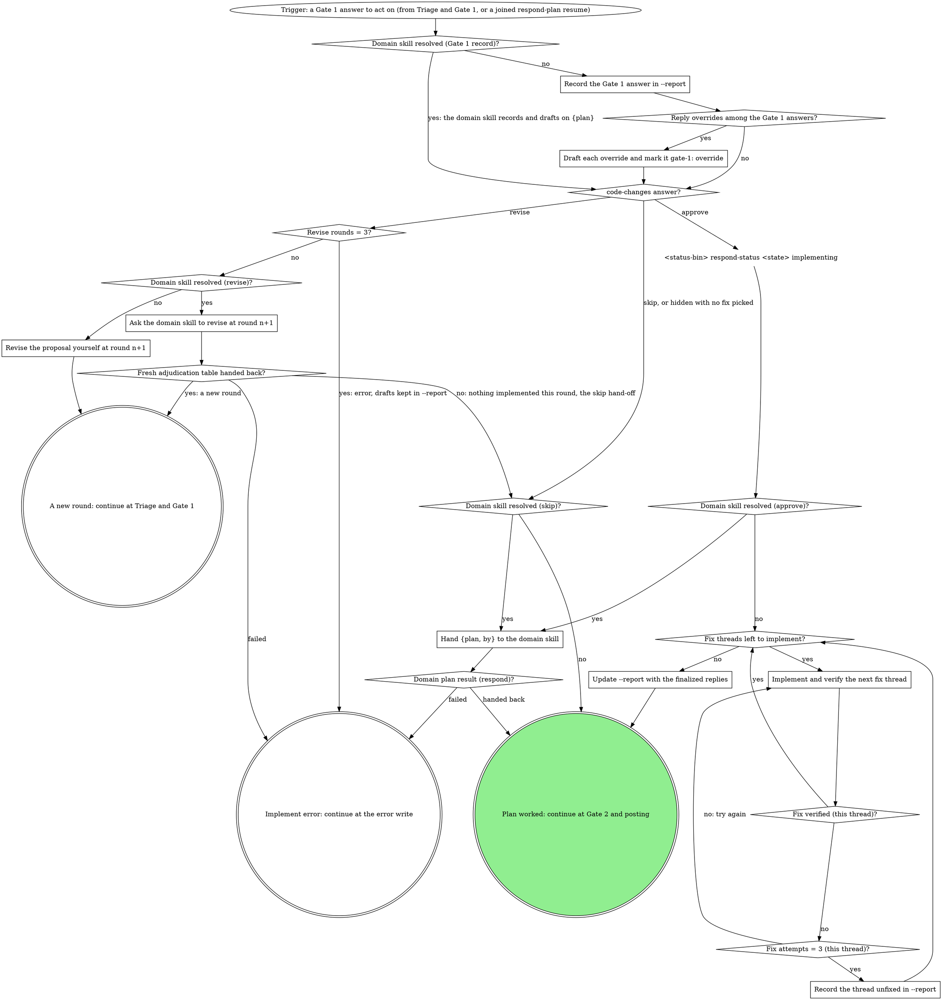

# board:respond: implement the plan

This is a stage of the board:respond skill. Its SKILL.md holds the flags, the
status contract and the shared sections the sections here name in quotes
("Off-script step", "Gate 1 and Gate 2 shapes", "Reading answers", "Reply
overrides", "Counts and the badge"); "Gate step" is in `gate-step.md`.

Record the Gate 1 answer, draft the reply overrides, and act on `code-changes`:
implement the fixes on `approve`, hand the plan over on `skip`, or re-adjudicate
at the next round on `revise`.

### Record the Gate 1 answer in --report

Read each thread's disposition off its answer value (`reply:<id>`,
`fix:<id>` or `skip:<id>`, per "Reading answers") and the `code-changes`
answer, which decides whether anything is implemented this round. Each
row gains a `gate-1` field: `reply`, `fix` or `skip` (a reply override
turns into `override` at the next box). A `reply:` answer's `text`, when
present, replaces the draft in its row. Posting, a resume included, reads
which threads are reply-only (`gate-1: reply`) from these rows, never from
the recommendation. On an escalation resume that continues here (the
Posted already read before Implement), the answer is the report's
`gate-1-answer:` line, never the escalation's own answer.

### Draft each override and mark it gate-1: override

For each reply override ("Reply overrides"), draft its reply after Gate 1
in the loaded voice, folding in its note when it has one, write that reply
into its row, and set the row to `gate-1: override`. Gate 2 offers every
override: the human has not yet seen its words.

### Hand {plan, by} to the domain skill

If a rule in the domain skill asks for a move this graph marks STOP, take the off-script edge instead.

Here that means the STOP's redirect: the move goes through the tool the STOP names. On the domain path, a move the domain skill cannot make that way is its reported failure, which takes the `error` exit.

Hand the domain skill `{plan: <answers>, by: <by>}`, the `--report` path
and the current round. `by` is the wait's own decider field, so the
domain skill's decision record names who decided instead of guessing. On
a resume, tell it this is a resume (the resumed `gateId` and
`answeredAt`), so its own Posted already rule runs. On an escalation
resume, `{plan, by}` and `answeredAt` come from the `gate-1-answer:`
line; the resumed `gateId` is the escalation's, not Gate 1's, so say
that the Gate 1 answer was recorded rather than naming a gate.

- **`approve`:** it implements the `fix:` threads one at a time, verified,
  updates `--report` with the finalized replies, and hands back the threads
  to offer at Gate 2 plus the path of a fitted `respond-post` open file
  when it builds one. A thread it could not implement comes back unfixed:
  not offered at Gate 2, counted neither posted nor held.
- **`skip`:** nothing is implemented; it hands back the reply overrides to
  offer at Gate 2, with a fitted open file when it builds one.
- **Nothing to offer.** On either answer, when no fixed thread and no
  reply override is left for Gate 2, it posts the reply-only threads on
  `{plan}` and hands back which posted and its counts, with no Gate 2
  file; post nothing yourself.

It records the Gate 1 answer and drafts overrides in `--report` itself.
`Domain plan result (respond)?` reads what comes back: anything above is
`handed back`; a failure it reports (it could not work the plan at all) is
`failed`, which writes `error` with its message.

### Implement and verify the next fix thread

The generic path under `code-changes: approve`. Take the next `fix:`
thread in verdict order and make the change its fix direction describes,
in the checkout at `<root>`, on the branch it is on: never switch
branches here, since the push check decides whether the fix can go up.
Verify it: the change answers the reviewer's point and the repo's checks
for the touched code (tests, types, lint) pass. Commit the verified change
with a message naming the thread's `<file>:<line>`. A failed verification
is one attempt; fix what failed and try again.

### Record the thread unfixed in --report

Three attempts on this thread failed verification. Revert the attempt so
no half-applied change stays in the checkout, and mark its row `unfixed`
with one line naming the check that kept failing. It gets no finalized
reply, is never offered at Gate 2, and counts neither posted nor held.
Name it in the `done` summary.

### Update --report with the finalized replies

Every fix is implemented or recorded unfixed. Rewrite each fixed thread's
reply to what will actually post, e.g. `"Fixed: src/cart.ts:40"`. Before
Gate 2 opens, the report holds what will post, never the earlier draft.

### Ask the domain skill to revise at round n+1

If a rule in the domain skill asks for a move this graph marks STOP, take the off-script edge instead.

Here that means the STOP's redirect: the move goes through the tool the STOP names. On the domain path, a move the domain skill cannot make that way is its reported failure, which takes the `error` exit.

`code-changes: revise`, under the budget. Nothing is implemented this
round. Tell the domain skill the next round number (the current round
plus one; on a resume, the current round is the recovered one) and hand it
the Gate 1 answers with their notes: the revise note is the human's steer.
A fresh adjudication table it hands back is a new round: the report is
rewritten for it, `drafting --round <n+1>` records it through the drafting
node on the loop (in `triage.md`), and a new `respond-plan` Gate 1 opens, from its fresh
open file when it hands one back. No fresh table means nothing changed
this round: the edge goes to `Domain skill resolved (skip)?` and takes the
skip branch's hand-off, so `Hand {plan, by} to the domain skill` hands it
the Gate 1 answers with nothing to implement, and it records them, drafts
any overrides and, when Gate 2 has nothing to offer, posts the reply-only
threads. A domain skill that fails during the revise (it reports a
failure, or stops without a table or a clean "nothing changed") is
`failed`: `error` naming what went wrong, with the drafts kept in
`--report`, never the skip hand-off.

### Revise the proposal yourself at round n+1

The generic path under `code-changes: revise`. Nothing is implemented this
round. Re-adjudicate with the Gate 1 answers and their notes as the
human's steer, redraft in the loaded voice, and continue at the report
write (in `triage.md`), which records round `n+1` through `drafting --round <n+1>` before
the new Gate 1 opens.
