# board:respond: launch and resume

This is a stage of the board:respond skill. Its SKILL.md holds the flags, the
status contract and the shared sections the sections here name in quotes
("Off-script step", "Gate 1 and Gate 2 shapes", "Reading answers", "Reply
overrides", "Counts and the badge"); "Gate step" is in `gate-step.md`.

The first acts of every launch: the status the entry implies, the domain skill,
the writing style on the generic path, and on a parked-gate resume the recorded
answer, the Posted already read, the join to `--report`, and for an escalation
the route back to the stage its origin names.

```dot
digraph respond_launch_and_resume {
    rankdir=TB;

    "Trigger: entered from the map at launch (respond)" [shape=ellipse];
    "--resumed-gate given (respond)?" [shape=diamond];
    "--resumed-gate-kind (respond)?" [shape=diamond];
    "<status-bin> respond-status <state> implementing (resumed respond-plan)" [shape=plaintext];
    "<status-bin> respond-status <state> drafting (resumed respond-post)" [shape=plaintext];
    "<status-bin> respond-status <state> triaging" [shape=plaintext];
    "--skill given (respond)?" [shape=diamond];
    "--skill-path given (respond)?" [shape=diamond];
    "Read <--skill-path> (respond)" [shape=plaintext];
    "Load the --skill domain skill by name (respond)" [shape=box];
    "${CLAUDE_SKILL_DIR}/scripts/resolve-args.sh (respond)" [shape=plaintext];
    "resolve-args.sh exit (respond)?" [shape=diamond];
    "Read <resolved.respond.path>" [shape=plaintext];
    "Print the resolver's errors verbatim (respond)" [shape=box];
    "Which entry (respond)?" [shape=diamond];
    "Recover the round from --round (absent: 1)" [shape=box];
    "<status-bin> gate wait <state> (resumed respond gate)" [shape=plaintext];
    "Resumed wait result (respond)?" [shape=diamond];
    "Resumed wait failures = 3 (respond)?" [shape=diamond];
    "Which stage raised the escalation (respond)?" [shape=diamond];
    "<status-bin> respond-status <state> triaging (resumed escalation)" [shape=plaintext];
    "<status-bin> respond-status <state> drafting (resumed escalation)" [shape=plaintext];
    "Read <--report> (resumed respond)" [shape=plaintext];
    "Recorded line the resumed escalation needs (respond)?" [shape=diamond];
    "Domain skill resolved (respond resume)?" [shape=diamond];
    "rt_verb {args: [skills, writing-style, show]} (respond)" [shape=plaintext];
    "rt_verb named a style skill (respond)?" [shape=diamond];
    "Load the named writing-style skill (respond)" [shape=box];
    "Load the preferences.md style, else conversational (respond)" [shape=box];
    "Which entry (respond writing style)?" [shape=diamond];
    "Record the resumed Gate 1 or Gate 2 answer in --report" [shape=box];
    "Record the resumed escalation's marks in --report" [shape=box];
    "mr_threads {mrUrl, refresh: true} (posted already)" [shape=plaintext];
    "mr_threads result (posted already)?" [shape=diamond];
    "Fixed the posted-already mr_threads call once already?" [shape=diamond];
    "Fix what the posted-already mr_threads error names" [shape=box];
    "Mark the threads that already carry this run's reply" [shape=box];
    "Resumed kind (act)?" [shape=diamond];
    "Join the plan answers to report rows by thread id" [shape=box];
    "--report carries respond-post-held (resume)?" [shape=diamond];
    "Narrow this pass to the held threads" [shape=box];
    "Route the resumed escalation by its origin (respond)" [shape=box];
    "Resumed escalation origin (respond)?" [shape=diamond];
    "--report carries gate-2 picks (resume)?" [shape=diamond];
    "--report carries a gate-1 answer (resume)?" [shape=diamond];
    "Domain skill resolved (respond)?" [shape=diamond];
    "respond off-script gate: mr_threads refused (posted already)" [shape=box];
    "Off-script outcome (posted-already mr_threads)?" [shape=diamond];
    "Off-script rounds = 2 (posted-already mr_threads)?" [shape=diamond];
    "Resumed gate gone: continue at Respond gate gone" [shape=doublecircle];
    "Launch error: continue at the error write" [shape=doublecircle];
    "Fresh generic run, style loaded: continue at Triage and Gate 1" [shape=doublecircle style=filled fillcolor=lightgreen];
    "respond-plan resume joined: continue at Implement the plan" [shape=doublecircle style=filled fillcolor=lightgreen];
    "respond-post resume: continue at Gate 2 and posting" [shape=doublecircle style=filled fillcolor=lightgreen];
    "Fresh run with a domain skill: continue at Triage and Gate 1" [shape=doublecircle style=filled fillcolor=lightgreen];
    "Resumed triage escalation: continue at Triage and Gate 1" [shape=doublecircle style=filled fillcolor=lightgreen];
    "Held at a launch escalation: continue at Held" [shape=doublecircle];

    "Trigger: entered from the map at launch (respond)" -> "--resumed-gate given (respond)?";
    "--resumed-gate given (respond)?" -> "--resumed-gate-kind (respond)?" [label="yes"];
    "--resumed-gate given (respond)?" -> "<status-bin> respond-status <state> triaging" [label="no: a fresh run"];
    "--resumed-gate-kind (respond)?" -> "<status-bin> respond-status <state> implementing (resumed respond-plan)" [label="respond-plan"];
    "--resumed-gate-kind (respond)?" -> "<status-bin> respond-status <state> drafting (resumed respond-post)" [label="respond-post"];
    "--resumed-gate-kind (respond)?" -> "--skill given (respond)?" [label="respond-escalation: its status waits for the answer's origin"];
    "<status-bin> respond-status <state> implementing (resumed respond-plan)" -> "--skill given (respond)?";
    "<status-bin> respond-status <state> drafting (resumed respond-post)" -> "--skill given (respond)?";
    "<status-bin> respond-status <state> triaging" -> "--skill given (respond)?";
    "--skill given (respond)?" -> "--skill-path given (respond)?" [label="yes"];
    "--skill given (respond)?" -> "${CLAUDE_SKILL_DIR}/scripts/resolve-args.sh (respond)" [label="no"];
    "--skill-path given (respond)?" -> "Read <--skill-path> (respond)" [label="yes"];
    "--skill-path given (respond)?" -> "Load the --skill domain skill by name (respond)" [label="no"];
    "Read <--skill-path> (respond)" -> "Which entry (respond)?";
    "Load the --skill domain skill by name (respond)" -> "Which entry (respond)?";
    "${CLAUDE_SKILL_DIR}/scripts/resolve-args.sh (respond)" -> "resolve-args.sh exit (respond)?";
    "resolve-args.sh exit (respond)?" -> "Read <resolved.respond.path>" [label="0"];
    "resolve-args.sh exit (respond)?" -> "Print the resolver's errors verbatim (respond)" [label="nonzero: generic path"];
    "Read <resolved.respond.path>" -> "Which entry (respond)?";
    "Print the resolver's errors verbatim (respond)" -> "Which entry (respond)?";
    "Which entry (respond)?" -> "Recover the round from --round (absent: 1)" [label="resumed gate"];
    "Which entry (respond)?" -> "Domain skill resolved (respond)?" [label="fresh run"];
    "Recover the round from --round (absent: 1)" -> "<status-bin> gate wait <state> (resumed respond gate)";
    "<status-bin> gate wait <state> (resumed respond gate)" -> "Resumed wait result (respond)?";
    "Resumed wait result (respond)?" -> "Which stage raised the escalation (respond)?" [label="answered"];
    "Which stage raised the escalation (respond)?" -> "Read <--report> (resumed respond)" [label="none: a respond-plan or respond-post resume"];
    "Which stage raised the escalation (respond)?" -> "<status-bin> respond-status <state> triaging (resumed escalation)" [label="a triage origin"];
    "Which stage raised the escalation (respond)?" -> "<status-bin> respond-status <state> drafting (resumed escalation)" [label="a posting origin, or the Posted already read"];
    "<status-bin> respond-status <state> triaging (resumed escalation)" -> "Read <--report> (resumed respond)";
    "<status-bin> respond-status <state> drafting (resumed escalation)" -> "Read <--report> (resumed respond)";
    "Resumed wait result (respond)?" -> "Resumed gate gone: continue at Respond gate gone" [label="closed, not found, or no gate open"];
    "Resumed wait result (respond)?" -> "Resumed wait failures = 3 (respond)?" [label="any other failure"];
    "Resumed wait failures = 3 (respond)?" -> "<status-bin> gate wait <state> (resumed respond gate)" [label="no: wait again"];
    "Resumed wait failures = 3 (respond)?" -> "Launch error: continue at the error write" [label="yes"];
    "Read <--report> (resumed respond)" -> "Recorded line the resumed escalation needs (respond)?";
    "Recorded line the resumed escalation needs (respond)?" -> "--report carries gate-2 picks (resume)?" [label="gate-2 picks: a posting origin other than a hold, or the Posted already read before posting on a take or round-1 iterate"];
    "Recorded line the resumed escalation needs (respond)?" -> "--report carries a gate-1 answer (resume)?" [label="gate-1 answer: the Posted already read before Implement on a take or round-1 iterate"];
    "Recorded line the resumed escalation needs (respond)?" -> "Domain skill resolved (respond resume)?" [label="none: a respond-plan or respond-post resume, a triage origin, a hold, or a hand back or round-2 iterate at the Posted already read"];
    "Domain skill resolved (respond resume)?" -> "Resumed kind (act)?" [label="yes: it runs its own Posted already read"];
    "Domain skill resolved (respond resume)?" -> "rt_verb {args: [skills, writing-style, show]} (respond)" [label="no"];
    "rt_verb {args: [skills, writing-style, show]} (respond)" -> "rt_verb named a style skill (respond)?";
    "rt_verb named a style skill (respond)?" -> "Load the named writing-style skill (respond)" [label="yes"];
    "rt_verb named a style skill (respond)?" -> "Load the preferences.md style, else conversational (respond)" [label="no: refused, failed or unavailable"];
    "Load the named writing-style skill (respond)" -> "Which entry (respond writing style)?";
    "Load the preferences.md style, else conversational (respond)" -> "Which entry (respond writing style)?";
    "Which entry (respond writing style)?" -> "Fresh generic run, style loaded: continue at Triage and Gate 1" [label="fresh run"];
    "Which entry (respond writing style)?" -> "Record the resumed Gate 1 or Gate 2 answer in --report" [label="resumed respond-plan or respond-post"];
    "Which entry (respond writing style)?" -> "Mark the threads that already carry this run's reply" [label="resumed escalation, a take at the Posted already read: its note names the threads"];
    "Which entry (respond writing style)?" -> "Resumed kind (act)?" [label="resumed escalation: a triage origin, a hold, or a hand back or round-2 iterate at the Posted already read"];
    "Which entry (respond writing style)?" -> "Record the resumed escalation's marks in --report" [label="resumed escalation, any other answer"];
    "Record the resumed escalation's marks in --report" -> "mr_threads {mrUrl, refresh: true} (posted already)";
    "Record the resumed Gate 1 or Gate 2 answer in --report" -> "mr_threads {mrUrl, refresh: true} (posted already)";
    "mr_threads {mrUrl, refresh: true} (posted already)" -> "mr_threads result (posted already)?";
    "mr_threads result (posted already)?" -> "Mark the threads that already carry this run's reply" [label="ok"];
    "mr_threads result (posted already)?" -> "Fixed the posted-already mr_threads call once already?" [label="tool error"];
    "Fixed the posted-already mr_threads call once already?" -> "Fix what the posted-already mr_threads error names" [label="no"];
    "Fixed the posted-already mr_threads call once already?" -> "respond off-script gate: mr_threads refused (posted already)" [label="yes"];
    "Fix what the posted-already mr_threads error names" -> "mr_threads {mrUrl, refresh: true} (posted already)";
    "Mark the threads that already carry this run's reply" -> "Resumed kind (act)?";
    "Resumed kind (act)?" -> "Join the plan answers to report rows by thread id" [label="respond-plan"];
    "Resumed kind (act)?" -> "--report carries respond-post-held (resume)?" [label="respond-post"];
    "Resumed kind (act)?" -> "Route the resumed escalation by its origin (respond)" [label="respond-escalation"];
    "Join the plan answers to report rows by thread id" -> "respond-plan resume joined: continue at Implement the plan";
    "--report carries respond-post-held (resume)?" -> "Narrow this pass to the held threads" [label="yes"];
    "--report carries respond-post-held (resume)?" -> "respond-post resume: continue at Gate 2 and posting" [label="no"];
    "Narrow this pass to the held threads" -> "respond-post resume: continue at Gate 2 and posting";
    "Route the resumed escalation by its origin (respond)" -> "Resumed escalation origin (respond)?";
    "Resumed escalation origin (respond)?" -> "Launch error: continue at the error write" [label="a hand back or round-2 iterate at fetch mr_threads or the Posted already read: the refusals are the reason"];
    "Resumed escalation origin (respond)?" -> "Resumed triage escalation: continue at Triage and Gate 1" [label="a triage origin: take or round-1 iterate; at mr_view, also a hand back or round-2 iterate"];
    "Resumed escalation origin (respond)?" -> "respond-post resume: continue at Gate 2 and posting" [label="a posting origin: take, hand back, or iterate at either round; its picks checked at launch"];
    "Resumed escalation origin (respond)?" -> "respond-post resume: continue at Gate 2 and posting" [label="the Posted already read before posting: take, or iterate at round 1; its picks checked at launch"];
    "Resumed escalation origin (respond)?" -> "respond-plan resume joined: continue at Implement the plan" [label="the Posted already read before Implement: take, or iterate at round 1; its answer checked at launch"];
    "Resumed escalation origin (respond)?" -> "Held at a launch escalation: continue at Held" [label="hold"];
    "--report carries gate-2 picks (resume)?" -> "Domain skill resolved (respond resume)?" [label="yes"];
    "--report carries gate-2 picks (resume)?" -> "Launch error: continue at the error write" [label="no: never post from memory"];
    "--report carries a gate-1 answer (resume)?" -> "Domain skill resolved (respond resume)?" [label="yes"];
    "--report carries a gate-1 answer (resume)?" -> "Launch error: continue at the error write" [label="no: never act from memory"];
    "Domain skill resolved (respond)?" -> "Fresh run with a domain skill: continue at Triage and Gate 1" [label="yes"];
    "Domain skill resolved (respond)?" -> "rt_verb {args: [skills, writing-style, show]} (respond)" [label="no: generic path"];
    "respond off-script gate: mr_threads refused (posted already)" -> "Off-script outcome (posted-already mr_threads)?";
    "Off-script outcome (posted-already mr_threads)?" -> "Mark the threads that already carry this run's reply" [label="take: the human names the threads already answered"];
    "Off-script outcome (posted-already mr_threads)?" -> "Off-script rounds = 2 (posted-already mr_threads)?" [label="iterate: the cause is fixed"];
    "Off-script outcome (posted-already mr_threads)?" -> "Held at a launch escalation: continue at Held" [label="hold"];
    "Off-script outcome (posted-already mr_threads)?" -> "Launch error: continue at the error write" [label="hand back"];
    "Off-script outcome (posted-already mr_threads)?" -> "Resumed gate gone: continue at Respond gate gone" [label="gate gone"];
    "Off-script outcome (posted-already mr_threads)?" -> "Launch error: continue at the error write" [label="gate unavailable"];
    "Off-script rounds = 2 (posted-already mr_threads)?" -> "mr_threads {mrUrl, refresh: true} (posted already)" [label="no: read again"];
    "Off-script rounds = 2 (posted-already mr_threads)?" -> "Launch error: continue at the error write" [label="yes: the refusals are the reason"];
}
```

What the graph cannot show:

- **Resumed entry.** `--resumed-gate <gateId>` means a human already
  answered a gate an earlier pane on this MR opened and the board parked,
  and the board is replaying that answer into this pane. `--resumed-gate-kind`
  names one of the three kinds this wrapper parks: `respond-plan` (Gate
  1), `respond-post` (Gate 2) or `respond-escalation` (an off-script
  gate). The board's resume plumbing lands the state at `implementing`
  whichever gate resumed it, so the pane re-emits the status the gate
  implies, never guessed from context: `respond-plan` writes
  `implementing` (already correct, written anyway so a stale write never
  lingers) and `respond-post` writes `drafting` (finalized replies waiting
  to post, not code waiting to be written), both first. An escalation's
  status depends on its origin, which only the answer names, so
  `Which stage raised the escalation (respond)?` writes it right after the
  wait: `triaging` for a triage origin, `drafting` for the rest. Read the
  parked answer with `gate wait` before anything else: it is
  registry-status-first, so on an answered gate it returns the recorded
  answer at once instead of blocking. Never re-adjudicate, never
  re-implement from scratch, and never run `gate open` before the parked
  answer is read: the gate lives in the rt daemon's registry, and a fresh
  open mints a new `gateId` and orphans the answer recorded against the
  old one. No node between the trigger and that wait opens a gate. Once
  the answer is read, later gates open normally: a fresh Gate 2 over the
  threads a `respond-plan` resume offers, a new Gate 1 after a `revise`, an
  off-script gate at a refusal. This invocation supersedes any earlier gate
  contract remembered in the conversation.
- **What a resumed pane carries.** From the resumed wait: `answers`, `by`
  and `answeredAt`, which on an escalation resume are the escalation's
  own. From `--report`: the verdict rows keyed by thread id (each row's
  recommendation, `gate-1` and `gate-2` fields and draft or finalized
  reply), the `source-branch:` line, any `gate-1-context: dropped` or
  `respond-post-held:` line, and the `gate-1-answer:` and `gate-2-answer:`
  lines. From the launch: `--round`. Nothing else survives the earlier
  pane. On a `respond-post` resume, the Gate 2 threads and their finalized
  replies come from `--report` and the picks from the resumed wait; a
  thread answer's `text` replaces that thread's report reply. On an
  escalation resume the earlier gate's answer comes only from those
  recorded lines and fields, since the escalation moved the state's gate
  id.

### Load the --skill domain skill by name (respond)

The board passed `--skill <name>` without `--skill-path`: load that skill
by name and treat it as the domain skill. The resolver does not run. When
`--skill-path` is also given, `Read <--skill-path> (respond)` reads the
SKILL.md at that absolute path instead, and it is the same domain skill.

### Print the resolver's errors verbatim (respond)

The resolver exited nonzero. Print its JSON `errors` verbatim in the pane.
Never guess or substitute a binding: the script is the only enforcement
point. The run continues on the generic path: every `Domain skill resolved
(...)?` diamond answers no.

### Recover the round from --round (absent: 1)

Read `--round <n>`; absent means round 1. This pane's conversation has no
memory of the round an earlier pane was on, so the flag is the only way to
know it. It is the current round for everything after: the round the
domain skill hears when handed the resumed answer, and the base for round
`n+1` on a further `revise`, recorded as `<status-bin> respond-status
<state> drafting --round <n+1>` before that round's Gate 1 opens.

### Load the named writing-style skill (respond)

`rt_verb` answered with the resolved style skill in its `skill` field.
Load that skill before drafting anything: compose in its voice from the
first word, never as a pass over a finished draft. It governs every reply
this pane drafts, reply overrides and finalized fix replies included.

### Load the preferences.md style, else conversational (respond)

`rt_verb` is unavailable, refused, or failed. Read
`~/.mattstack/user/skills/preferences.md` with the Read tool and load the
skill its `writing-style:` line names, if it has one. If the line is
missing, or that skill will not load, load
`mattstack:writing-style-conversational`. The load still comes before the
first drafted word. This fallback chain is the defined path, not an
off-script origin.

### Record the resumed Gate 1 or Gate 2 answer in --report

The generic path, before the Posted already read: an off-script gate
opened at that read moves the state's gate id, and `gate wait` can then no
longer return this answer, so it goes into `--report` first.

- **`respond-plan`:** join the answers to the rows exactly as
  `Join the plan answers to report rows by thread id` says, and write
  each joined row's `gate-1` field (`reply`, `fix` or `skip`). Then
  append one final line,
  `gate-1-answer: <{answers, by, answeredAt} as one-line JSON>`,
  replacing an existing one: it keeps `code-changes`, every note and
  every `text`, which the rows do not.
- **`respond-post`:** write the picks exactly as
  `Record the Gate 2 picks in --report` (in `post.md`) says, from the
  resumed wait's answer: the `gate-2` fields and the `gate-2-answer:`
  line.

Either kind starts a new posting pass: drop every `escalation:` mark from
the rows ("Escalation marks" in `post.md`). What an earlier pass posted or
resolved by hand the Posted already read finds; a held push is retried,
as any `respond-post-held:` resume retries it. Never rewrite the verdict
table or the drafts here.

### Route the resumed escalation by its origin (respond)

The resumed wait returned a `respond-escalation` answer: an off-script
gate an earlier pane opened on this MR. Read `answers.action`'s value (a
bare value or a `{value, note}` object). It starts with its verb (`take:`,
`iterate:`, `hold:` or `hand back:`) and ends `(<origin>, round <k>)`,
the origin being the refused call its table names. Round `k` seeds that
origin's `Off-script rounds = 2 (...)?` counter, and a later iterate at
the same origin counts on from it. An iterate at round 2 is that origin's
second iterate, which the live pane's `Off-script rounds = 2 (...)?`
answers yes to: it never retries, and takes that yes edge's exit, the
same as the origin's hand back in every respond table. A round-1 iterate
also seeds that origin's fix-once counter as spent (the named thread's,
for `mr_reply_thread` and `mr_resolve_thread`), as a live iterate leaves
it: a refusal after the retry goes straight back to the off-script gate.
Both seeds hold from the moment the wait returns, so they already bound
the Posted already read above when it is the retry.

`Which entry (respond writing style)?` already read the value on the
generic path, to decide whether the Posted already read runs: a triage
origin, a hold, and a hand back or round-2 iterate at the Posted already
read skip it (nothing of this run can post, or the pane stops); a take at
the Posted already read skips it too, marking its note's threads; every
other answer records its marks, then reads.

- **Triage origins** (`mr_view refused`, `mr_threads refused`): no
  verdict table exists yet. `Read <--report> (resumed respond)` finding
  no file is nothing read, never an error, and from a file (possibly an
  earlier run's) only the `source-branch:` line a `mr_threads` origin
  wrote counts. Triage continues at the refused call, as
  `Which triage call refused (resumed)?` (in `triage.md`) draws it: a
  take skips the call, a round-1 iterate reads again, and at `mr_view` a
  hand back or round-2 iterate carries on without the branch. At fetch
  `mr_threads`, a hand back or round-2 iterate writes `error`.
- **Posting origins** (`git_push refused`, `mr_reply_thread refused`,
  `mr_resolve_thread refused`): Gate 2 was answered and its picks
  recorded before the escalation opened.
  `--report carries gate-2 picks (resume)?` answers yes when the
  `gate-2-answer:` line is present and parses and every thread it picks
  has a report row; no is `error` naming the file and which case it was.
  `Recorded line the resumed escalation needs (respond)?` sends it there
  right after `Read <--report> (resumed respond)`, before the marks write
  and the Posted already read, so a missing line errors before anything
  is written or read. Never rebuild the picks from memory
  or from the conversation. The recorded picks then stand in for the
  resumed wait's answer at Gate 2 and posting, and the walk honours every
  `escalation:` mark in the rows
  (`Record the resumed escalation's marks in --report`), so the taken
  call never runs again and a handed-back one stays down.
- **A round-1 iterate at a posting origin** walks the posting again from
  the top, pushing and posting in the usual order; the Posted already
  read has dropped what is up, so the refused call runs again in its
  turn.
- **The Posted already read**
  (`mr_threads refused on the Posted already read before <stage>`): a
  take marked exactly the threads its note names and skipped the read,
  since that read is what refused; a round-1 iterate ran the read above.
  Either way the pass continues at the stage the value names: `posting`
  checks the recorded picks as a posting origin does; `Implement` needs
  the `gate-1-answer:` line, which
  `--report carries a gate-1 answer (resume)?` checks the same way and at
  the same point, before the Posted already read (no is `error` naming
  the file), and whose answer then stands in for the joined Gate 1
  answer. A hand back or round-2 iterate writes `error` naming the
  refusal.
- **Hold** keeps the pane open with nothing more moved and no terminal
  status.

### Record the resumed escalation's marks in --report

The generic path, after the recorded-line check and before the Posted
already read. A refusal at that read opens a second escalation, which
moves the state's gate id, and a pane resumed on it could then no longer
learn this answer. So a take, a hand
back or a round-2 iterate at a posting origin writes its mark into the
row now, as "Escalation marks" in `post.md` spells them: the same mark
the live pane writes when it acts on that answer. A round-1 iterate, and
any answer at the Posted already read, writes nothing. The marks outlive
this pane: a pane resumed on a later escalation reads them back from the
rows, and the posting walk honours them.

### Fix what the posted-already mr_threads error names

`mr_threads` refused its input on the Posted already read. Correct what
the error names (`mrUrl` the MR's https URL,
`.../-/merge_requests/<iid>`, whose project is registered with rt;
`refresh` a boolean) and read again, once. An error that names no input
(the daemon down, a GitLab fetch failure) has nothing to correct: read
again unchanged, once, and the off-script gate follows. An error is never
a reason to skip the read and post anyway: a reply posted twice is what
this read prevents.

### Mark the threads that already carry this run's reply

The Posted already rule. Before any reply posts on this resume, or a fresh
Gate 2 offers a thread, read each thread this pass could post (Gate 2's
threads and the reply-only rows) in the `mr_threads` result, its full note
chain. A thread already carries this run's reply when it holds either:

- a note whose text is the reply due to post, or
- any note by the account this pane posts as, dated after the answered
  gate's `answeredAt`: from the resumed wait on a `respond-plan` or
  `respond-post` resume. On an escalation resume it comes from the line
  recorded for the stage the pass resumes: `gate-2-answer:` for a posting
  origin or a read before posting, `gate-1-answer:` for a read before
  Implement. A triage origin never takes this read.

Such a thread is posted: it counts toward `--posted`, it is never offered
at a fresh Gate 2, and its reply is never posted again, whatever
`--report` says of it, though a `resolve:` pick on it still runs. Keep the
list of these thread ids for the posting walk and the counts. One read
covers every thread. After an off-script take, the threads the human names
are the list. A resumed escalation's take at the Posted already read skips
the read: its note's threads are the list.

With a domain skill this box never runs: the domain skill runs its own
Posted already read when told the pass is a resume, and hands back which
replies posted, the ones it found already up included.

### Join the plan answers to report rows by thread id

A `respond-plan` resume: the resumed wait's `answers` are Gate 1's plan,
and they select among the report's threads. Join each answer to its report
row by the thread id inside the option VALUE: every `answers` key other
than `code-changes` holds one `<verb>:<threadId>`, or a `{value, note,
text}` object around it; unwrap `value` first, then split at the first
`:` ("Reading answers"). Never join by the `thread-<n>` question id, which
is only a container. A report carrying the line `gate-1-context: dropped`
counts every question's context as dropped, so every `reply:` answer with
no `text` is a reply override ("Reply overrides"). An answer whose thread
id has no report row is named in the pane and counts neither posted nor
held.

Record the join at once on the generic path: each joined row's `gate-1`
field and the `gate-1-answer:` line, so the answer survives an off-script
gate that moves the state's gate id. `Record the resumed Gate 1 or Gate 2
answer in --report` wrote both before the Posted already read; confirm
them and write what is missing. With a domain skill it records the plan
itself on `{plan}` (in `implement.md`).

The joined answers continue at `Record the Gate 1 answer in --report`
(in `implement.md`),
exactly as a fresh Gate 1 answer does: Gate 2 opens fresh over only the
threads `Threads to offer at Gate 2?` (in `post.md`) finds (even with nothing
implemented, such as `code-changes: skip` with a reply override), and the
reply-only threads post as the posting walk says.

### Narrow this pass to the held threads

A `respond-post` resume whose report carries `respond-post-held:
<threadId>[, <threadId>...]`: an earlier pass posted every other reply and
held these fixed threads when its push failed. This pass acts only on the
listed threads: the push checks and `git_push` run for them, then they
post and resolve as the resumed Gate 2 answer picks. Every other reply
already went up. With a domain skill, hand it the narrowed list with
`{post, by}`. On the generic path, once the listed threads post, `Delete
the respond-post-held line from --report` (in `post.md`) removes the line.

### respond off-script gate: mr_threads refused (posted already)

Take "Off-script step" with this question. Label: `mr_threads refused
twice on the Posted already read for !<iid>: <second error>`. Context:
both `mr_threads` errors, quoted, and the thread ids this pass could post.

| Value                                                                                                                                      | Label                 | Description                                                     |
| ------------------------------------------------------------------------------------------------------------------------------------------ | --------------------- | --------------------------------------------------------------- |
| `take: you name the threads that already carry this run's reply (mr_threads refused on the Posted already read before <stage>, round <k>)` | Name answered threads | You name the threads already answered and I post only the rest. |
| `iterate: you fixed the cause, read the threads again (mr_threads refused on the Posted already read before <stage>, round <k>)`           | Fixed it, read again  | You fixed what refused the read and I read the threads again.   |
| `hold: keep this pane open with nothing posted (mr_threads refused on the Posted already read before <stage>, round <k>)`                  | Hold this pane        | I stop before posting anything and the pane stays open.         |
| `hand back: write an error naming the refusal, nothing posted (mr_threads refused on the Posted already read before <stage>, round <k>)`   | Hand it back          | I write an error naming the refusal and post nothing.           |

`<stage>` names where this pass goes after the read, since a pane resumed
on this gate learns it only from the value: `Implement` on a
`respond-plan` resume, `posting` on a `respond-post` resume or a posting
origin's escalation resume, and on a resume of this same gate the stage
its value named.

A take marks exactly the threads the human names as posted already.
Iterate passes `Off-script rounds = 2 (posted-already mr_threads)?`
before reading again. Hand back, gate unavailable and a spent round
budget write `error` naming the refusal; no reply posts unchecked.
