# board:respond: launch and resume

This is a stage of the board:respond skill. Its SKILL.md holds the flags, the
status contract and the shared sections the sections here name in quotes
("Off-script step", "Gate 1 and Gate 2 shapes", "Reading answers", "Reply
overrides", "Counts and the badge"); "Gate step" is in `gate-step.md`.

The first acts of every launch: the status the entry implies, the domain skill,
the writing style on the generic path, and on a parked-gate resume the recorded
answer, the Posted already read and the join to `--report`.

```dot
digraph respond_launch_and_resume {
    rankdir=TB;

    "Trigger: entered from the map at launch (respond)" [shape=ellipse];
    "--resumed-gate given (respond)?" [shape=diamond];
    "--resumed-gate-kind (respond)?" [shape=diamond];
    "<status-bin> respond-status <state> implementing (resumed respond-plan)" [shape=plaintext];
    "<status-bin> respond-status <state> drafting (resumed respond-post)" [shape=plaintext];
    "<status-bin> respond-status <state> triaging" [shape=plaintext];
    "--skill given (respond)?" [shape=diamond];
    "--skill-path given (respond)?" [shape=diamond];
    "Read <--skill-path> (respond)" [shape=plaintext];
    "Load the --skill domain skill by name (respond)" [shape=box];
    "${CLAUDE_SKILL_DIR}/scripts/resolve-args.sh (respond)" [shape=plaintext];
    "resolve-args.sh exit (respond)?" [shape=diamond];
    "Read <resolved.respond.path>" [shape=plaintext];
    "Print the resolver's errors verbatim (respond)" [shape=box];
    "Which entry (respond)?" [shape=diamond];
    "Recover the round from --round (absent: 1)" [shape=box];
    "<status-bin> gate wait <state> (resumed respond gate)" [shape=plaintext];
    "Resumed wait result (respond)?" [shape=diamond];
    "Resumed wait failures = 3 (respond)?" [shape=diamond];
    "Read <--report> (resumed respond)" [shape=plaintext];
    "Domain skill resolved (respond resume)?" [shape=diamond];
    "rt_verb {args: [skills, writing-style, show]} (respond)" [shape=plaintext];
    "rt_verb named a style skill (respond)?" [shape=diamond];
    "Load the named writing-style skill (respond)" [shape=box];
    "Load the preferences.md style, else conversational (respond)" [shape=box];
    "Which entry (respond writing style)?" [shape=diamond];
    "mr_threads {mrUrl, refresh: true} (posted already)" [shape=plaintext];
    "mr_threads result (posted already)?" [shape=diamond];
    "Fixed the posted-already mr_threads call once already?" [shape=diamond];
    "Fix what the posted-already mr_threads error names" [shape=box];
    "Mark the threads that already carry this run's reply" [shape=box];
    "Resumed kind (act)?" [shape=diamond];
    "Join the plan answers to report rows by thread id" [shape=box];
    "--report carries respond-post-held (resume)?" [shape=diamond];
    "Narrow this pass to the held threads" [shape=box];
    "Domain skill resolved (respond)?" [shape=diamond];
    "respond off-script gate: mr_threads refused (posted already)" [shape=box];
    "Off-script outcome (posted-already mr_threads)?" [shape=diamond];
    "Off-script rounds = 2 (posted-already mr_threads)?" [shape=diamond];
    "Resumed gate gone: continue at Respond gate gone" [shape=doublecircle];
    "Launch error: continue at the error write" [shape=doublecircle];
    "Fresh generic run, style loaded: continue at Triage and Gate 1" [shape=doublecircle style=filled fillcolor=lightgreen];
    "respond-plan resume joined: continue at Implement the plan" [shape=doublecircle style=filled fillcolor=lightgreen];
    "respond-post resume: continue at Gate 2 and posting" [shape=doublecircle style=filled fillcolor=lightgreen];
    "Fresh run with a domain skill: continue at Triage and Gate 1" [shape=doublecircle style=filled fillcolor=lightgreen];
    "Held at the posted-already off-script gate: continue at Held" [shape=doublecircle];

    "Trigger: entered from the map at launch (respond)" -> "--resumed-gate given (respond)?";
    "--resumed-gate given (respond)?" -> "--resumed-gate-kind (respond)?" [label="yes"];
    "--resumed-gate given (respond)?" -> "<status-bin> respond-status <state> triaging" [label="no: a fresh run"];
    "--resumed-gate-kind (respond)?" -> "<status-bin> respond-status <state> implementing (resumed respond-plan)" [label="respond-plan"];
    "--resumed-gate-kind (respond)?" -> "<status-bin> respond-status <state> drafting (resumed respond-post)" [label="respond-post"];
    "<status-bin> respond-status <state> implementing (resumed respond-plan)" -> "--skill given (respond)?";
    "<status-bin> respond-status <state> drafting (resumed respond-post)" -> "--skill given (respond)?";
    "<status-bin> respond-status <state> triaging" -> "--skill given (respond)?";
    "--skill given (respond)?" -> "--skill-path given (respond)?" [label="yes"];
    "--skill given (respond)?" -> "${CLAUDE_SKILL_DIR}/scripts/resolve-args.sh (respond)" [label="no"];
    "--skill-path given (respond)?" -> "Read <--skill-path> (respond)" [label="yes"];
    "--skill-path given (respond)?" -> "Load the --skill domain skill by name (respond)" [label="no"];
    "Read <--skill-path> (respond)" -> "Which entry (respond)?";
    "Load the --skill domain skill by name (respond)" -> "Which entry (respond)?";
    "${CLAUDE_SKILL_DIR}/scripts/resolve-args.sh (respond)" -> "resolve-args.sh exit (respond)?";
    "resolve-args.sh exit (respond)?" -> "Read <resolved.respond.path>" [label="0"];
    "resolve-args.sh exit (respond)?" -> "Print the resolver's errors verbatim (respond)" [label="nonzero: generic path"];
    "Read <resolved.respond.path>" -> "Which entry (respond)?";
    "Print the resolver's errors verbatim (respond)" -> "Which entry (respond)?";
    "Which entry (respond)?" -> "Recover the round from --round (absent: 1)" [label="resumed gate"];
    "Which entry (respond)?" -> "Domain skill resolved (respond)?" [label="fresh run"];
    "Recover the round from --round (absent: 1)" -> "<status-bin> gate wait <state> (resumed respond gate)";
    "<status-bin> gate wait <state> (resumed respond gate)" -> "Resumed wait result (respond)?";
    "Resumed wait result (respond)?" -> "Read <--report> (resumed respond)" [label="answered"];
    "Resumed wait result (respond)?" -> "Resumed gate gone: continue at Respond gate gone" [label="closed, not found, or no gate open"];
    "Resumed wait result (respond)?" -> "Resumed wait failures = 3 (respond)?" [label="any other failure"];
    "Resumed wait failures = 3 (respond)?" -> "<status-bin> gate wait <state> (resumed respond gate)" [label="no: wait again"];
    "Resumed wait failures = 3 (respond)?" -> "Launch error: continue at the error write" [label="yes"];
    "Read <--report> (resumed respond)" -> "Domain skill resolved (respond resume)?";
    "Domain skill resolved (respond resume)?" -> "Resumed kind (act)?" [label="yes: it runs its own Posted already read"];
    "Domain skill resolved (respond resume)?" -> "rt_verb {args: [skills, writing-style, show]} (respond)" [label="no"];
    "rt_verb {args: [skills, writing-style, show]} (respond)" -> "rt_verb named a style skill (respond)?";
    "rt_verb named a style skill (respond)?" -> "Load the named writing-style skill (respond)" [label="yes"];
    "rt_verb named a style skill (respond)?" -> "Load the preferences.md style, else conversational (respond)" [label="no: refused, failed or unavailable"];
    "Load the named writing-style skill (respond)" -> "Which entry (respond writing style)?";
    "Load the preferences.md style, else conversational (respond)" -> "Which entry (respond writing style)?";
    "Which entry (respond writing style)?" -> "Fresh generic run, style loaded: continue at Triage and Gate 1" [label="fresh run"];
    "Which entry (respond writing style)?" -> "mr_threads {mrUrl, refresh: true} (posted already)" [label="resumed gate"];
    "mr_threads {mrUrl, refresh: true} (posted already)" -> "mr_threads result (posted already)?";
    "mr_threads result (posted already)?" -> "Mark the threads that already carry this run's reply" [label="ok"];
    "mr_threads result (posted already)?" -> "Fixed the posted-already mr_threads call once already?" [label="tool error"];
    "Fixed the posted-already mr_threads call once already?" -> "Fix what the posted-already mr_threads error names" [label="no"];
    "Fixed the posted-already mr_threads call once already?" -> "respond off-script gate: mr_threads refused (posted already)" [label="yes"];
    "Fix what the posted-already mr_threads error names" -> "mr_threads {mrUrl, refresh: true} (posted already)";
    "Mark the threads that already carry this run's reply" -> "Resumed kind (act)?";
    "Resumed kind (act)?" -> "Join the plan answers to report rows by thread id" [label="respond-plan"];
    "Resumed kind (act)?" -> "--report carries respond-post-held (resume)?" [label="respond-post"];
    "Join the plan answers to report rows by thread id" -> "respond-plan resume joined: continue at Implement the plan";
    "--report carries respond-post-held (resume)?" -> "Narrow this pass to the held threads" [label="yes"];
    "--report carries respond-post-held (resume)?" -> "respond-post resume: continue at Gate 2 and posting" [label="no"];
    "Narrow this pass to the held threads" -> "respond-post resume: continue at Gate 2 and posting";
    "Domain skill resolved (respond)?" -> "Fresh run with a domain skill: continue at Triage and Gate 1" [label="yes"];
    "Domain skill resolved (respond)?" -> "rt_verb {args: [skills, writing-style, show]} (respond)" [label="no: generic path"];
    "respond off-script gate: mr_threads refused (posted already)" -> "Off-script outcome (posted-already mr_threads)?";
    "Off-script outcome (posted-already mr_threads)?" -> "Mark the threads that already carry this run's reply" [label="take: the human names the threads already answered"];
    "Off-script outcome (posted-already mr_threads)?" -> "Off-script rounds = 2 (posted-already mr_threads)?" [label="iterate: the cause is fixed"];
    "Off-script outcome (posted-already mr_threads)?" -> "Held at the posted-already off-script gate: continue at Held" [label="hold"];
    "Off-script outcome (posted-already mr_threads)?" -> "Launch error: continue at the error write" [label="hand back"];
    "Off-script outcome (posted-already mr_threads)?" -> "Resumed gate gone: continue at Respond gate gone" [label="gate gone"];
    "Off-script outcome (posted-already mr_threads)?" -> "Launch error: continue at the error write" [label="gate unavailable"];
    "Off-script rounds = 2 (posted-already mr_threads)?" -> "mr_threads {mrUrl, refresh: true} (posted already)" [label="no: read again"];
    "Off-script rounds = 2 (posted-already mr_threads)?" -> "Launch error: continue at the error write" [label="yes: the refusals are the reason"];
}
```

What the graph cannot show:

- **Resumed entry.** `--resumed-gate <gateId>` means a human already
  answered one of the two gates an earlier pane on this MR opened, and the
  board is replaying that answer into this pane. The board's resume
  plumbing lands the state at `implementing` whichever gate resumed it, so
  the first act re-emits the status the gate's kind implies, read from
  `--resumed-gate-kind` and never guessed from context: `respond-plan`
  writes `implementing` (already correct, written anyway so a stale write
  never lingers) and `respond-post` writes `drafting` (finalized replies
  waiting to post, not code waiting to be written). Then read the parked
  answer with `gate wait` before anything else: it is
  registry-status-first, so on an answered gate it returns the recorded
  answer at once instead of blocking. Never re-adjudicate, never
  re-implement from scratch, and never run `gate open` before the parked
  answer is read: the gate lives in the rt daemon's registry, and a fresh
  open mints a new `gateId` and orphans the answer recorded against the
  old one. No node between the trigger and that wait opens a gate. Once
  the answer is read, later gates open normally: a fresh Gate 2 over the
  threads a `respond-plan` resume offers, a new Gate 1 after a `revise`, an
  off-script gate at a refusal. This invocation supersedes any earlier gate
  contract remembered in the conversation.
- **What a resumed pane carries.** From the resumed wait: `answers`, `by`
  and `answeredAt`. From `--report`: the verdict rows keyed by thread id
  (each row's recommendation, `gate-1` field and draft or finalized
  reply), the `source-branch:` line, and any `gate-1-context: dropped` or
  `respond-post-held:` line. From the launch: `--round`. Nothing else
  survives the earlier pane. On a `respond-post` resume, the Gate 2
  threads and their finalized replies come from `--report` and the picks
  from the resumed wait; a thread answer's `text` replaces that thread's
  report reply.

### Load the --skill domain skill by name (respond)

The board passed `--skill <name>` without `--skill-path`: load that skill
by name and treat it as the domain skill. The resolver does not run. When
`--skill-path` is also given, `Read <--skill-path> (respond)` reads the
SKILL.md at that absolute path instead, and it is the same domain skill.

### Print the resolver's errors verbatim (respond)

The resolver exited nonzero. Print its JSON `errors` verbatim in the pane.
Never guess or substitute a binding: the script is the only enforcement
point. The run continues on the generic path: every `Domain skill resolved
(...)?` diamond answers no.

### Recover the round from --round (absent: 1)

Read `--round <n>`; absent means round 1. This pane's conversation has no
memory of the round an earlier pane was on, so the flag is the only way to
know it. It is the current round for everything after: the round the
domain skill hears when handed the resumed answer, and the base for round
`n+1` on a further `revise`, recorded as `<status-bin> respond-status
<state> drafting --round <n+1>` before that round's Gate 1 opens.

### Load the named writing-style skill (respond)

`rt_verb` answered with the resolved style skill in its `skill` field.
Load that skill before drafting anything: compose in its voice from the
first word, never as a pass over a finished draft. It governs every reply
this pane drafts, reply overrides and finalized fix replies included.

### Load the preferences.md style, else conversational (respond)

`rt_verb` is unavailable, refused, or failed. Read
`~/.mattstack/user/skills/preferences.md` with the Read tool and load the
skill its `writing-style:` line names, if it has one. If the line is
missing, or that skill will not load, load
`mattstack:writing-style-conversational`. The load still comes before the
first drafted word. This fallback chain is the defined path, not an
off-script origin.

### Fix what the posted-already mr_threads error names

`mr_threads` refused its input on the Posted already read. Correct what
the error names (`mrUrl` the MR's https URL,
`.../-/merge_requests/<iid>`, whose project is registered with rt;
`refresh` a boolean) and read again, once. An error that names no input
(the daemon down, a GitLab fetch failure) has nothing to correct: read
again unchanged, once, and the off-script gate follows. An error is never
a reason to skip the read and post anyway: a reply posted twice is what
this read prevents.

### Mark the threads that already carry this run's reply

The Posted already rule. Before any reply posts on this resume, or a fresh
Gate 2 offers a thread, read each thread this pass could post (Gate 2's
threads and the reply-only rows) in the `mr_threads` result, its full note
chain. A thread already carries this run's reply when it holds either:

- a note whose text is the reply due to post, or
- any note by the account this pane posts as, dated after the resumed
  gate's `answeredAt` (from the resumed wait).

Such a thread is posted: it counts toward `--posted`, it is never offered
at a fresh Gate 2, and its reply is never posted again, whatever
`--report` says of it, though a `resolve:` pick on it still runs. Keep the
list of these thread ids for the posting walk and the counts. One read
covers every thread. After an off-script take, the threads the human names
are the list.

With a domain skill this box never runs: the domain skill runs its own
Posted already read when told the pass is a resume, and hands back which
replies posted, the ones it found already up included.

### Join the plan answers to report rows by thread id

A `respond-plan` resume: the resumed wait's `answers` are Gate 1's plan,
and they select among the report's threads. Join each answer to its report
row by the thread id inside the option VALUE: every `answers` key other
than `code-changes` holds one `<verb>:<threadId>`, or a `{value, note,
text}` object around it; unwrap `value` first, then split at the first
`:` ("Reading answers"). Never join by the `thread-<n>` question id, which
is only a container. A report carrying the line `gate-1-context: dropped`
counts every question's context as dropped, so every `reply:` answer with
no `text` is a reply override ("Reply overrides"). An answer whose thread
id has no report row is named in the pane and counts neither posted nor
held.

The joined answers continue at `Record the Gate 1 answer in --report`
(in `implement.md`),
exactly as a fresh Gate 1 answer does: Gate 2 opens fresh over only the
threads `Threads to offer at Gate 2?` (in `post.md`) finds (even with nothing
implemented, such as `code-changes: skip` with a reply override), and the
reply-only threads post as the posting walk says.

### Narrow this pass to the held threads

A `respond-post` resume whose report carries `respond-post-held:
<threadId>[, <threadId>...]`: an earlier pass posted every other reply and
held these fixed threads when its push failed. This pass acts only on the
listed threads: the push checks and `git_push` run for them, then they
post and resolve as the resumed Gate 2 answer picks. Every other reply
already went up. With a domain skill, hand it the narrowed list with
`{post, by}`. On the generic path, once the listed threads post, `Delete
the respond-post-held line from --report` (in `post.md`) removes the line.

### respond off-script gate: mr_threads refused (posted already)

Take "Off-script step" with this question. Label: `mr_threads refused
twice on the Posted already read for !<iid>: <second error>`. Context:
both `mr_threads` errors, quoted, and the thread ids this pass could post.

| Value                                                                                                            | Label                 | Description                                                     |
| ---------------------------------------------------------------------------------------------------------------- | --------------------- | --------------------------------------------------------------- |
| `take: you name the threads that already carry this run's reply (mr_threads refused on the Posted already read)` | Name answered threads | You name the threads already answered and I post only the rest. |
| `iterate: you fixed the cause, read the threads again (mr_threads refused on the Posted already read)`           | Fixed it, read again  | You fixed what refused the read and I read the threads again.   |
| `hold: keep this pane open with nothing posted (mr_threads refused on the Posted already read)`                  | Hold this pane        | I stop before posting anything and the pane stays open.         |
| `hand back: write an error naming the refusal, nothing posted (mr_threads refused on the Posted already read)`   | Hand it back          | I write an error naming the refusal and post nothing.           |

A take marks exactly the threads the human names as posted already.
Iterate passes `Off-script rounds = 2 (posted-already mr_threads)?`
before reading again. Hand back, gate unavailable and a spent round
budget write `error` naming the refusal; no reply posts unchecked.
