# board:respond: Gate 2 and posting

This is a stage of the board:respond skill. Its SKILL.md holds the flags, the
status contract and the shared sections the sections here name in quotes
("Off-script step", "Gate 1 and Gate 2 shapes", "Reading answers", "Reply
overrides", "Counts and the badge"); "Gate step" is in `gate-step.md`.

Offer the fixed threads and reply overrides at Gate 2, push the fixes with
`git_push` after the two checks, then post and resolve as the answer picks,
the reply-only threads included.

```dot
digraph respond_gate_2_and_posting {
    rankdir=TB;

    "Trigger: a respond-post resume (from Launch and resume)" [shape=ellipse];
    "Trigger: the plan is worked (from Implement the plan)" [shape=ellipse];
    "Threads to offer at Gate 2?" [shape=diamond];
    "Domain skill resolved (reply-only)?" [shape=diamond];
    "<status-bin> respond-status <state> drafting (before Gate 2)" [shape=plaintext];
    "Fitted respond-post open file handed back?" [shape=diamond];
    "${CLAUDE_SKILL_DIR}/scripts/open-gate.sh <status-bin> <state> respond-post <open-file>" [shape=plaintext];
    "Build the Gate 2 questions" [shape=box];
    "<status-bin> gate open <state> --kind respond-post --questions <json> [--context <text>]" [shape=plaintext];
    "respond-post open exit?" [shape=diamond];
    "Gate 2: take the respond gate step" [shape=box];
    "Gate 2 step outcome?" [shape=diamond];
    "Ask Gate 2 as native forms (degraded)" [shape=box];
    "Domain skill resolved (Gate 2 act)?" [shape=diamond];
    "Record the Gate 2 picks in --report" [shape=box];
    "Hand {post, by} to the domain skill" [shape=box];
    "Domain posting result (respond)?" [shape=diamond];
    "A fixed thread picked to post or resolve?" [shape=diamond];
    "git branch --show-current" [shape=plaintext];
    "On the MR's source branch?" [shape=diamond];
    "git rev-parse --abbrev-ref @{push}" [shape=plaintext];
    "Push target is origin/<source branch>?" [shape=diamond];
    "git_push {tree: <root>}" [shape=plaintext];
    "git_push result (respond)?" [shape=diamond];
    "STOP: push only with git_push (respond)" [shape=octagon style=filled fillcolor=red fontcolor=white];
    "Fixed the git_push call once already (respond)?" [shape=diamond];
    "Fix what the git_push error names (respond)" [shape=box];
    "Hold the fixed threads: write respond-post-held into --report" [shape=box];
    "Threads left to post (respond)?" [shape=diamond];
    "Post this thread's reply?" [shape=diamond];
    "mr_reply_thread {mrUrl, discussionId, body}" [shape=plaintext];
    "mr_reply_thread result?" [shape=diamond];
    "STOP: replies post with mr_reply_thread" [shape=octagon style=filled fillcolor=red fontcolor=white];
    "Fixed the mr_reply_thread call once already?" [shape=diamond];
    "Fix what the mr_reply_thread error names" [shape=box];
    "Resolve this thread?" [shape=diamond];
    "mr_resolve_thread {mrUrl, discussionId}" [shape=plaintext];
    "mr_resolve_thread result?" [shape=diamond];
    "Fixed the mr_resolve_thread call once already?" [shape=diamond];
    "Fix what the mr_resolve_thread error names" [shape=box];
    "STOP: threads resolve with mr_resolve_thread" [shape=octagon style=filled fillcolor=red fontcolor=white];
    "Held threads from a respond-post-held line posted this pass?" [shape=diamond];
    "Delete the respond-post-held line from --report" [shape=box];
    "respond off-script gate: git_push refused" [shape=box];
    "Off-script outcome (git_push, respond)?" [shape=diamond];
    "Off-script rounds = 2 (git_push, respond)?" [shape=diamond];
    "respond off-script gate: mr_reply_thread refused" [shape=box];
    "Off-script outcome (mr_reply_thread)?" [shape=diamond];
    "Off-script rounds = 2 (mr_reply_thread)?" [shape=diamond];
    "respond off-script gate: mr_resolve_thread refused" [shape=box];
    "Off-script outcome (mr_resolve_thread)?" [shape=diamond];
    "Off-script rounds = 2 (mr_resolve_thread)?" [shape=diamond];
    "Posting finished: continue at the done write" [shape=doublecircle style=filled fillcolor=lightgreen];
    "Posting gate gone: continue at Respond gate gone" [shape=doublecircle];
    "Posting error: continue at the error write" [shape=doublecircle];
    "Held at a posting off-script gate: continue at Held" [shape=doublecircle];

    "Trigger: the plan is worked (from Implement the plan)" -> "Threads to offer at Gate 2?";
    "Trigger: a respond-post resume (from Launch and resume)" -> "Domain skill resolved (Gate 2 act)?";
    "Threads to offer at Gate 2?" -> "Domain skill resolved (reply-only)?" [label="none: no fixed thread, no override"];
    "Threads to offer at Gate 2?" -> "<status-bin> respond-status <state> drafting (before Gate 2)" [label="some"];
    "Domain skill resolved (reply-only)?" -> "Posting finished: continue at the done write" [label="yes: it posted them on {plan}"];
    "Domain skill resolved (reply-only)?" -> "Record the Gate 2 picks in --report" [label="no: post the reply-only threads"];
    "<status-bin> respond-status <state> drafting (before Gate 2)" -> "Fitted respond-post open file handed back?";
    "Fitted respond-post open file handed back?" -> "${CLAUDE_SKILL_DIR}/scripts/open-gate.sh <status-bin> <state> respond-post <open-file>" [label="yes"];
    "Fitted respond-post open file handed back?" -> "Build the Gate 2 questions" [label="no"];
    "Build the Gate 2 questions" -> "<status-bin> gate open <state> --kind respond-post --questions <json> [--context <text>]";
    "${CLAUDE_SKILL_DIR}/scripts/open-gate.sh <status-bin> <state> respond-post <open-file>" -> "respond-post open exit?";
    "<status-bin> gate open <state> --kind respond-post --questions <json> [--context <text>]" -> "respond-post open exit?";
    "respond-post open exit?" -> "Gate 2: take the respond gate step" [label="0"];
    "respond-post open exit?" -> "Ask Gate 2 as native forms (degraded)" [label="nonzero: the daemon is down"];
    "Gate 2: take the respond gate step" -> "Gate 2 step outcome?";
    "Gate 2 step outcome?" -> "Domain skill resolved (Gate 2 act)?" [label="answered"];
    "Gate 2 step outcome?" -> "Posting gate gone: continue at Respond gate gone" [label="gate gone"];
    "Gate 2 step outcome?" -> "Ask Gate 2 as native forms (degraded)" [label="the wait keeps failing"];
    "Ask Gate 2 as native forms (degraded)" -> "Domain skill resolved (Gate 2 act)?";
    "Domain skill resolved (Gate 2 act)?" -> "Hand {post, by} to the domain skill" [label="yes"];
    "Domain skill resolved (Gate 2 act)?" -> "Record the Gate 2 picks in --report" [label="no"];
    "Record the Gate 2 picks in --report" -> "A fixed thread picked to post or resolve?";
    "Hand {post, by} to the domain skill" -> "Domain posting result (respond)?";
    "Domain posting result (respond)?" -> "Posting finished: continue at the done write" [label="posted: its counts"];
    "Domain posting result (respond)?" -> "Posting error: continue at the error write" [label="failed"];
    "A fixed thread picked to post or resolve?" -> "git branch --show-current" [label="yes, and no fixed thread marked pushed by hand or push handed back"];
    "A fixed thread picked to post or resolve?" -> "Threads left to post (respond)?" [label="no, or marked pushed by hand: push nothing"];
    "A fixed thread picked to post or resolve?" -> "Hold the fixed threads: write respond-post-held into --report" [label="yes, marked push handed back"];
    "git branch --show-current" -> "On the MR's source branch?";
    "On the MR's source branch?" -> "git rev-parse --abbrev-ref @{push}" [label="yes"];
    "On the MR's source branch?" -> "Hold the fixed threads: write respond-post-held into --report" [label="no, or an error: never switch branches"];
    "git rev-parse --abbrev-ref @{push}" -> "Push target is origin/<source branch>?";
    "Push target is origin/<source branch>?" -> "git_push {tree: <root>}" [label="yes"];
    "Push target is origin/<source branch>?" -> "Hold the fixed threads: write respond-post-held into --report" [label="no, or an error"];
    "git_push {tree: <root>}" -> "git_push result (respond)?";
    "git_push result (respond)?" -> "Threads left to post (respond)?" [label="ok"];
    "git_push result (respond)?" -> "Fixed the git_push call once already (respond)?" [label="refused"];
    "git_push result (respond)?" -> "STOP: push only with git_push (respond)" [label="tempted to push from the shell or force past it"];
    "STOP: push only with git_push (respond)" -> "Fixed the git_push call once already (respond)?";
    "Fixed the git_push call once already (respond)?" -> "Fix what the git_push error names (respond)" [label="no"];
    "Fixed the git_push call once already (respond)?" -> "respond off-script gate: git_push refused" [label="yes"];
    "Fix what the git_push error names (respond)" -> "git_push {tree: <root>}";
    "Hold the fixed threads: write respond-post-held into --report" -> "Threads left to post (respond)?";
    "Threads left to post (respond)?" -> "Post this thread's reply?" [label="yes"];
    "Threads left to post (respond)?" -> "Held threads from a respond-post-held line posted this pass?" [label="no"];
    "Post this thread's reply?" -> "mr_reply_thread {mrUrl, discussionId, body}" [label="yes: picked post, or reply-only; not held, not posted already, no mark on its reply"];
    "Post this thread's reply?" -> "Resolve this thread?" [label="no"];
    "mr_reply_thread {mrUrl, discussionId, body}" -> "mr_reply_thread result?";
    "mr_reply_thread result?" -> "Resolve this thread?" [label="posted"];
    "mr_reply_thread result?" -> "Fixed the mr_reply_thread call once already?" [label="tool error"];
    "mr_reply_thread result?" -> "STOP: replies post with mr_reply_thread" [label="tempted to post with the GitLab CLI or the API"];
    "STOP: replies post with mr_reply_thread" -> "Fixed the mr_reply_thread call once already?";
    "Fixed the mr_reply_thread call once already?" -> "Fix what the mr_reply_thread error names" [label="no"];
    "Fixed the mr_reply_thread call once already?" -> "respond off-script gate: mr_reply_thread refused" [label="yes"];
    "Fix what the mr_reply_thread error names" -> "mr_reply_thread {mrUrl, discussionId, body}";
    "Resolve this thread?" -> "mr_resolve_thread {mrUrl, discussionId}" [label="yes: resolve picked; not held, no mark stopping its resolve"];
    "Resolve this thread?" -> "Threads left to post (respond)?" [label="no"];
    "mr_resolve_thread {mrUrl, discussionId}" -> "mr_resolve_thread result?";
    "mr_resolve_thread result?" -> "Threads left to post (respond)?" [label="resolved"];
    "mr_resolve_thread result?" -> "Fixed the mr_resolve_thread call once already?" [label="tool error"];
    "mr_resolve_thread result?" -> "STOP: threads resolve with mr_resolve_thread" [label="tempted to resolve with the GitLab CLI or the API"];
    "STOP: threads resolve with mr_resolve_thread" -> "Fixed the mr_resolve_thread call once already?";
    "Fixed the mr_resolve_thread call once already?" -> "Fix what the mr_resolve_thread error names" [label="no"];
    "Fixed the mr_resolve_thread call once already?" -> "respond off-script gate: mr_resolve_thread refused" [label="yes"];
    "Fix what the mr_resolve_thread error names" -> "mr_resolve_thread {mrUrl, discussionId}";
    "Held threads from a respond-post-held line posted this pass?" -> "Delete the respond-post-held line from --report" [label="yes: its threads posted"];
    "Held threads from a respond-post-held line posted this pass?" -> "Posting finished: continue at the done write" [label="no"];
    "Delete the respond-post-held line from --report" -> "Posting finished: continue at the done write";
    "respond off-script gate: git_push refused" -> "Off-script outcome (git_push, respond)?";
    "Off-script outcome (git_push, respond)?" -> "Threads left to post (respond)?" [label="take: the human pushed"];
    "Off-script outcome (git_push, respond)?" -> "Off-script rounds = 2 (git_push, respond)?" [label="iterate: the cause is fixed"];
    "Off-script outcome (git_push, respond)?" -> "Held at a posting off-script gate: continue at Held" [label="hold"];
    "Off-script outcome (git_push, respond)?" -> "Hold the fixed threads: write respond-post-held into --report" [label="hand back"];
    "Off-script outcome (git_push, respond)?" -> "Posting gate gone: continue at Respond gate gone" [label="gate gone"];
    "Off-script outcome (git_push, respond)?" -> "Hold the fixed threads: write respond-post-held into --report" [label="gate unavailable"];
    "Off-script rounds = 2 (git_push, respond)?" -> "git branch --show-current" [label="no: check the target, push again"];
    "Off-script rounds = 2 (git_push, respond)?" -> "Hold the fixed threads: write respond-post-held into --report" [label="yes"];
    "respond off-script gate: mr_reply_thread refused" -> "Off-script outcome (mr_reply_thread)?";
    "Off-script outcome (mr_reply_thread)?" -> "Resolve this thread?" [label="take: the human posted it"];
    "Off-script outcome (mr_reply_thread)?" -> "Off-script rounds = 2 (mr_reply_thread)?" [label="iterate: the cause is fixed"];
    "Off-script outcome (mr_reply_thread)?" -> "Held at a posting off-script gate: continue at Held" [label="hold"];
    "Off-script outcome (mr_reply_thread)?" -> "Threads left to post (respond)?" [label="hand back: this thread stays unposted"];
    "Off-script outcome (mr_reply_thread)?" -> "Posting gate gone: continue at Respond gate gone" [label="gate gone"];
    "Off-script outcome (mr_reply_thread)?" -> "Threads left to post (respond)?" [label="gate unavailable: this thread stays unposted"];
    "Off-script rounds = 2 (mr_reply_thread)?" -> "mr_reply_thread {mrUrl, discussionId, body}" [label="no: post again"];
    "Off-script rounds = 2 (mr_reply_thread)?" -> "Threads left to post (respond)?" [label="yes: this thread stays unposted"];
    "respond off-script gate: mr_resolve_thread refused" -> "Off-script outcome (mr_resolve_thread)?";
    "Off-script outcome (mr_resolve_thread)?" -> "Threads left to post (respond)?" [label="take: the human resolved it"];
    "Off-script outcome (mr_resolve_thread)?" -> "Off-script rounds = 2 (mr_resolve_thread)?" [label="iterate: the cause is fixed"];
    "Off-script outcome (mr_resolve_thread)?" -> "Held at a posting off-script gate: continue at Held" [label="hold"];
    "Off-script outcome (mr_resolve_thread)?" -> "Threads left to post (respond)?" [label="hand back: this thread stays open"];
    "Off-script outcome (mr_resolve_thread)?" -> "Posting gate gone: continue at Respond gate gone" [label="gate gone"];
    "Off-script outcome (mr_resolve_thread)?" -> "Threads left to post (respond)?" [label="gate unavailable: this thread stays open"];
    "Off-script rounds = 2 (mr_resolve_thread)?" -> "mr_resolve_thread {mrUrl, discussionId}" [label="no: resolve again"];
    "Off-script rounds = 2 (mr_resolve_thread)?" -> "Threads left to post (respond)?" [label="yes: this thread stays open"];
}
```

What the graph cannot show:

- **The push.** Only when Gate 2's picks post or resolve at least one
  fixed thread (a `gate-1: fix` row) does anything push; otherwise push
  nothing. Gate 2's answer is the authorization: ask nothing more. The
  MR's source branch is the `sourceBranch` that `mr_view {mrUrl} (respond
source branch)` (in `triage.md`) returns on a fresh generic run, kept in the report as
  `source-branch: <branch>`, where a resumed pane reads it; with no known
  source branch (the read refused past its off-script gate, or a report
  without the line), `On the MR's source branch?` answers `no, or an
error` and the fixed threads are held. `<root>` is the
  absolute top level of the checkout this pane runs in (the board's
  configured respond checkout), where the generic path commits its fixes
  and where both git checks read; a resumed pane launches in the same
  checkout and finds the same root. `git_push` pushes exactly the current
  branch as one ref to its same-named upstream, so no other ref can go up
  with it. Never switch branches, force, rebase or merge to make a check
  pass.
- **Posting.** `Threads left to post (respond)?` walks the Gate 2 threads
  in verdict order, then each reply-only thread (a `gate-1: reply` row)
  that Gate 2 neither offered nor named; a `respond-post-held:` resume
  walks only the listed threads. A picked `post:` posts the answer's
  `text` when it carries one, else the report's finalized reply; a
  reply-only thread posts the reply its row records (Gate 1's `text` when
  present, the draft otherwise) and is never resolved, so the reviewer can
  answer. `resolve:` runs after the reply when both are picked. An empty
  array leaves the thread untouched. A held thread posts and resolves
  nothing. A thread marked posted already never posts its reply again,
  though its `resolve:` pick still runs. When Gate 2 offered a `gate-1:
reply` thread, or an answer value names one (a gate opened before this
  rule), that thread's answer decides it instead, an empty array included,
  and no reply posts twice.
- **Escalation marks.** An off-script answer at a posting origin that
  keeps a call from running again writes an `escalation:` field into the
  row it touches, before the walk moves on, whether this pane or a
  resumed one acts on it: `pushed by hand` (a `git_push` take) and
  `push handed back` (a `git_push` hand back, gate unavailable or spent
  round budget) on every fixed thread Gate 2 picked; `posted by hand` (an
  `mr_reply_thread` take) and `reply handed back` (its hand back,
  unavailable or spent budget) on that thread; `resolved by hand` (an
  `mr_resolve_thread` take) and `resolve handed back` (the rest) on that
  thread. A row can carry several, comma-separated. The walk reads them
  back: `pushed by hand` pushes nothing, `push handed back` holds the
  fixed threads, `posted by hand` counts the reply posted and skips it,
  `reply handed back` posts and resolves nothing on that thread, and
  either resolve mark skips its resolve. A pane resumed on a later
  escalation has lost every earlier answer but these, so they are what
  keeps a handed-back call down and a taken call from running twice. On
  an escalation resume the picks themselves come from the rows' `gate-2:`
  fields and the `gate-2-answer:` line, never from memory.

### Build the Gate 2 questions

No fitted open file came back, so build Gate 2 yourself from the finalized
replies: one multi-select question per offered thread (each fixed thread
and each reply override, in verdict-table order; never a reply-only,
`skip:`, unfixed or posted-already thread), exactly as "Gate 1 and Gate 2
shapes" draws them. Each thread's `<file>:<line>` and finalized reply ride
its own question's `context`; `--context` carries only the shared frame,
under the same byte budget. The open prints one JSON line (see "Gate
step" in `gate-step.md`); keep `gateId` and `presentation`.

### Gate 2: take the respond gate step

Read `gate-step.md` and take "Gate step" with Gate 2's `gateId` and `presentation`. Its outcome
comes back here: answered, gate gone (end cleanly with no status write),
or the wait keeps failing (the degraded native forms). The reply-only
threads wait for this answer too, then post with its picks.

### Ask Gate 2 as native forms (degraded)

The daemon is down at open time, or the wait failed three times. Present
Gate 2 as native forms alone, chunked exactly as the form branch in `gate-step.md` does: its
thread questions in order, up to four per call, each a multi-select of
post and resolve. Proceed on the combined answers with `by: pane`.

### Record the Gate 2 picks in --report

The generic path, before any push or post. Each thread Gate 2 offered gets
one field in its row, from its answer: `gate-2: post`, `gate-2: resolve`,
`gate-2: post, resolve`, or `gate-2: none` for an explicit empty array. A
thread answer's `text` replaces that row's finalized reply. Then append
one final line to `--report`:

`gate-2-answer: <{answers, by, answeredAt} as one-line JSON>`

replacing an existing one; never write a second. When the answer came
with no `answeredAt` (this pane's own `gate answer` stood, or the degraded
form), write the current UTC time in ISO 8601, and `by` is `pane`. With
nothing offered (the reply-only path), write the line with empty
`answers`, `by` `pane` and the current time: it still records that
posting began.

An off-script gate at the push or a post moves the state's gate id, and
`gate wait` can then no longer return this answer. A pane resumed on that
escalation reads the picks from these fields and this line, and `Mark the
threads that already carry this run's reply` (in `launch.md`) dates notes
against its `answeredAt`. On a resume the fields and line are already
there (`Record the resumed Gate 1 or Gate 2 answer in --report` wrote them
on a `respond-post` resume, an earlier pane on an escalation resume):
confirm them and write what is missing.

### Hand {post, by} to the domain skill

If a rule in the domain skill asks for a move this graph marks STOP, take the off-script edge instead.

Here that means the STOP's redirect: the move goes through the tool the STOP names. On the domain path, a move the domain skill cannot make that way is its reported failure, which takes the `error` exit.

Hand the domain skill `{post: <answers>, by: <by>}`, the `--report` path
and the round, so it executes the posting, the reply-only threads
included (unresolved). On a resume, tell it this is a resume, so its own
Posted already rule runs, and hand it the narrowed list when the report
carried `respond-post-held:`. On an escalation resume, `{post, by}` come
from the report's `gate-2-answer:` line, and hand it too every
`escalation:` mark in the rows plus the resumed answer's own (a take, hand
back or round-2 iterate at a posting origin, which a domain-path resume has
not recorded), so it skips the taken calls and keeps the handed-back ones
down. Its push before any Fixed reply
runs only after the source-branch and push-target checks, only with
`git_push {tree: <root>}`, never from the shell; a failed check or a
refused push holds those fixed threads and every other reply posts. It
hands back which replies posted (the ones already up included), which it
held, and its counts; a failure is `error` with its message.

### Fix what the git_push error names (respond)

`git_push` refused. Correct what the error names: `tree` must be the
absolute top level of a checkout or worktree registered with rt (`git
rev-parse --show-toplevel` in this pane's checkout prints it), never a
subdirectory. A refusal about the branch itself (a detached HEAD, a
protected or default branch, no upstream, an upstream with a different
branch name) has nothing to correct in the call: push again unchanged,
once, and the off-script gate follows. Never add `forceWithLease` or
`setUpstream` to get past a refusal.

### Hold the fixed threads: write respond-post-held into --report

A push check failed (not on the source branch, a push target other than
`origin/<source branch>`, an error, or no known source branch), or the
`git_push` off-script gate handed back (a resumed hand back included).
Post and resolve none of the fixed threads Gate 2 picked, report the
mismatch or the refusal verbatim in the pane, and never force, rebase,
merge or switch branches past it. Write one line, `respond-post-held:
<threadId>[, <threadId>...]`, into `--report`, replacing any earlier one.
Every other reply still posts as decided. The run still marks `done`,
counting each push-held thread in neither `--posted` nor `--held` (see
"Counts and the badge" in SKILL.md): that partial badge is what leaves
the run open, since the board then offers a resume, and the resume acts
only on the listed threads.

### Fix what the mr_reply_thread error names

`mr_reply_thread` refused. Correct what the error names: `mrUrl` the MR's
https URL, `discussionId` the thread id from its report row exactly as
`mr_threads` gave it, `body` the non-empty reply text. A "discussion not
found" error with the id already matching the row, or an error that names
no input, has nothing to correct: post again unchanged, once, and the
off-script gate follows. An error is never a reason to post with the
GitLab CLI or the API.

### Fix what the mr_resolve_thread error names

`mr_resolve_thread` refused. Correct what the error names: `mrUrl` the
MR's https URL, `discussionId` the thread id from its report row exactly
as `mr_threads` gave it. An error that names no input has nothing to
correct: resolve again unchanged, once, and the off-script gate follows.
An error is never a reason to resolve with the GitLab CLI or the API.

### Delete the respond-post-held line from --report

This pass posted the threads a `respond-post-held:` line listed: the push
went up and their replies posted. Delete the line from `--report`, so a
later resume never acts on those threads again.

### respond off-script gate: git_push refused

Take "Off-script step" with this question. Label: `push of <branch> refused
on !<iid>: <second refusal>`. Context: both `git_push` refusals, quoted,
with the branch, `<root>` and the fixed thread ids waiting on the push.

| Value                                                                                                       | Label                  | Description                                                            |
| ----------------------------------------------------------------------------------------------------------- | ---------------------- | ---------------------------------------------------------------------- |
| `take: you push <branch> yourself, then I post the fixed replies (git_push refused, round <k>)`             | Push it yourself       | You push the fixed commits and I post their replies.                   |
| `iterate: you fixed the cause, check the target and push again with git_push (git_push refused, round <k>)` | Fixed it, push again   | You fixed what refused the push and I check the target and push again. |
| `hold: keep this pane open with the fixes unpushed and nothing posted (git_push refused, round <k>)`        | Hold this pane         | I stop with the fixes unpushed and no reply posted.                    |
| `hand back: hold the fixed threads and post the other replies (git_push refused, round <k>)`                | Hold the fixed replies | I hold the fixed threads unposted and post every other reply.          |

A take continues to the posting walk as if the push went up, and marks
the fixed threads `pushed by hand` ("Escalation marks"). Iterate
passes `Off-script rounds = 2 (git_push, respond)?`, then runs both push
checks again before `git_push`. Hand back, gate unavailable and a spent
round budget take the held path: `respond-post-held:` for the fixed
threads, marked `push handed back`, every other reply posted.

### respond off-script gate: mr_reply_thread refused

Take "Off-script step" with this question. Label: `reply to thread
<threadId> refused twice on !<iid>: <second error>`. Context: both
`mr_reply_thread` errors, quoted, and the reply text.

| Value                                                                                                          | Label                | Description                                                                   |
| -------------------------------------------------------------------------------------------------------------- | -------------------- | ----------------------------------------------------------------------------- |
| `take: you post the reply to thread <threadId> yourself (mr_reply_thread refused, round <k>)`                  | Post it yourself     | You post this reply and I continue with its resolve pick and the next thread. |
| `iterate: you fixed the cause, post the reply to thread <threadId> again (mr_reply_thread refused, round <k>)` | Fixed it, post again | You fixed what refused the reply and I post it again.                         |
| `hold: keep this pane open with the remaining replies unposted (mr_reply_thread refused, round <k>)`           | Hold this pane       | I stop here and the replies not yet posted stay unposted.                     |
| `hand back: leave thread <threadId> unposted and post the rest (mr_reply_thread refused, round <k>)`           | Skip this reply      | I leave this thread unposted and carry on with the rest.                      |

A take counts the reply as posted, marks the thread `posted by hand`, and
runs the thread's `resolve:` pick.
Iterate passes `Off-script rounds = 2 (mr_reply_thread)?` for this
thread before posting again. Hand back, gate unavailable and a spent
round budget leave this thread unposted and unresolved, marked `reply
handed back`, and move to the next thread; it counts neither posted nor
held.

### respond off-script gate: mr_resolve_thread refused

Take "Off-script step" with this question. Label: `resolving thread
<threadId> refused twice on !<iid>: <second error>`. Context: both
`mr_resolve_thread` errors, quoted.

| Value                                                                                                   | Label                   | Description                                                 |
| ------------------------------------------------------------------------------------------------------- | ----------------------- | ----------------------------------------------------------- |
| `take: you resolve thread <threadId> yourself (mr_resolve_thread refused, round <k>)`                   | Resolve it yourself     | You resolve this thread and I carry on with the next one.   |
| `iterate: you fixed the cause, resolve thread <threadId> again (mr_resolve_thread refused, round <k>)`  | Fixed it, resolve again | You fixed what refused the resolve and I resolve it again.  |
| `hold: keep this pane open with the remaining threads untouched (mr_resolve_thread refused, round <k>)` | Hold this pane          | I stop here and the threads not yet handled stay untouched. |
| `hand back: leave thread <threadId> open and carry on (mr_resolve_thread refused, round <k>)`           | Leave it open           | I leave this thread unresolved and carry on with the rest.  |

A take marks the thread `resolved by hand`. Iterate passes
`Off-script rounds = 2 (mr_resolve_thread)?` for this thread before
resolving again. Hand back, gate unavailable and a spent round budget
leave the thread open, marked `resolve handed back`, and move to the next
one. A resolve
refusal changes no count: a thread whose reply posted still counts as
posted, since `--posted` counts replies. Name the unresolved thread in the
`done` message.
