# board:respond: triage and Gate 1

This is a stage of the board:respond skill. Its SKILL.md holds the flags, the
status contract and the shared sections the sections here name in quotes
("Off-script step", "Gate 1 and Gate 2 shapes", "Reading answers", "Reply
overrides", "Counts and the badge"); "Gate step" is in `gate-step.md`.

Adjudicate every unresolved human thread, through the domain skill or on the
generic path, write the verdict table and drafts to `--report`, and open Gate 1
and wait for its answer.

```dot
digraph respond_triage_and_gate_1 {
    rankdir=TB;

    "Trigger: a fresh generic run with the style loaded (from Launch and resume)" [shape=ellipse];
    "Trigger: a fresh run with a domain skill (from Launch and resume)" [shape=ellipse];
    "Trigger: revise brought a new round (from Implement the plan)" [shape=ellipse];
    "Trigger: a resumed triage escalation (from Launch and resume)" [shape=ellipse];
    "Which triage call refused (resumed)?" [shape=diamond];
    "Delegate adjudication to the domain skill" [shape=box];
    "Domain adjudication result?" [shape=diamond];
    "mr_view {mrUrl} (respond source branch)" [shape=plaintext];
    "mr_view result (respond)?" [shape=diamond];
    "STOP: MR reads go through mr_view (respond)" [shape=octagon style=filled fillcolor=red fontcolor=white];
    "Fixed the mr_view call once already (respond)?" [shape=diamond];
    "Fix what the mr_view error names (respond)" [shape=box];
    "mr_threads {mrUrl, refresh: true} (fetch)" [shape=plaintext];
    "mr_threads result (fetch)?" [shape=diamond];
    "STOP: threads are read with mr_threads" [shape=octagon style=filled fillcolor=red fontcolor=white];
    "Fixed the fetch mr_threads call once already?" [shape=diamond];
    "Fix what the fetch mr_threads error names" [shape=box];
    "Adjudicate each unresolved thread" [shape=box];
    "Unresolved human threads = 0?" [shape=diamond];
    "Write the verdict table and drafts to --report" [shape=box];
    "<status-bin> respond-status <state> drafting --round <n>" [shape=plaintext];
    "Fitted respond-plan open file handed back?" [shape=diamond];
    "${CLAUDE_SKILL_DIR}/scripts/open-gate.sh <status-bin> <state> respond-plan <open-file>" [shape=plaintext];
    "Build the Gate 1 questions" [shape=box];
    "<status-bin> gate open <state> --kind respond-plan --questions <json> [--context <text>]" [shape=plaintext];
    "respond-plan open exit?" [shape=diamond];
    "Gate 1 context dropped?" [shape=diamond];
    "Write gate-1-context: dropped into --report" [shape=box];
    "Gate 1: take the respond gate step" [shape=box];
    "Gate 1 step outcome?" [shape=diamond];
    "Ask Gate 1 as native forms (degraded)" [shape=box];
    "respond off-script gate: mr_view refused" [shape=box];
    "Off-script outcome (mr_view, respond)?" [shape=diamond];
    "Off-script rounds = 2 (mr_view, respond)?" [shape=diamond];
    "respond off-script gate: mr_threads refused (fetch)" [shape=box];
    "Off-script outcome (fetch mr_threads)?" [shape=diamond];
    "Off-script rounds = 2 (fetch mr_threads)?" [shape=diamond];
    "Triage error: continue at the error write" [shape=doublecircle];
    "No unresolved threads: continue at the done write" [shape=doublecircle];
    "Gate 1 answered: continue at Implement the plan" [shape=doublecircle style=filled fillcolor=lightgreen];
    "Triage gate gone: continue at Respond gate gone" [shape=doublecircle];
    "Held at a triage off-script gate: continue at Held" [shape=doublecircle];

    "Trigger: revise brought a new round (from Implement the plan)" -> "Write the verdict table and drafts to --report";
    "Trigger: a fresh run with a domain skill (from Launch and resume)" -> "Delegate adjudication to the domain skill";
    "Trigger: a fresh generic run with the style loaded (from Launch and resume)" -> "mr_view {mrUrl} (respond source branch)";
    "Trigger: a resumed triage escalation (from Launch and resume)" -> "Which triage call refused (resumed)?";
    "Which triage call refused (resumed)?" -> "Delegate adjudication to the domain skill" [label="a domain skill resolved on this resume: it adjudicates afresh"];
    "Which triage call refused (resumed)?" -> "mr_view {mrUrl} (respond source branch)" [label="mr_view iterate at round 1"];
    "Which triage call refused (resumed)?" -> "mr_threads {mrUrl, refresh: true} (fetch)" [label="mr_view take (the branch from its note), or a hand back or round-2 iterate (no branch)"];
    "Which triage call refused (resumed)?" -> "mr_threads {mrUrl, refresh: true} (fetch)" [label="fetch mr_threads iterate at round 1"];
    "Which triage call refused (resumed)?" -> "Adjudicate each unresolved thread" [label="fetch mr_threads take: the threads from its note"];
    "Delegate adjudication to the domain skill" -> "Domain adjudication result?";
    "Domain adjudication result?" -> "Unresolved human threads = 0?" [label="a verdict table handed back"];
    "Domain adjudication result?" -> "Triage error: continue at the error write" [label="failed"];
    "mr_view {mrUrl} (respond source branch)" -> "mr_view result (respond)?";
    "mr_view result (respond)?" -> "mr_threads {mrUrl, refresh: true} (fetch)" [label="ok: keep sourceBranch"];
    "mr_view result (respond)?" -> "Fixed the mr_view call once already (respond)?" [label="tool error"];
    "mr_view result (respond)?" -> "STOP: MR reads go through mr_view (respond)" [label="tempted to read the MR with the GitLab CLI"];
    "STOP: MR reads go through mr_view (respond)" -> "Fixed the mr_view call once already (respond)?";
    "Fixed the mr_view call once already (respond)?" -> "Fix what the mr_view error names (respond)" [label="no"];
    "Fixed the mr_view call once already (respond)?" -> "respond off-script gate: mr_view refused" [label="yes"];
    "Fix what the mr_view error names (respond)" -> "mr_view {mrUrl} (respond source branch)";
    "mr_threads {mrUrl, refresh: true} (fetch)" -> "mr_threads result (fetch)?";
    "mr_threads result (fetch)?" -> "Adjudicate each unresolved thread" [label="ok"];
    "mr_threads result (fetch)?" -> "Fixed the fetch mr_threads call once already?" [label="tool error"];
    "mr_threads result (fetch)?" -> "STOP: threads are read with mr_threads" [label="tempted to read them with the GitLab CLI"];
    "STOP: threads are read with mr_threads" -> "Fixed the fetch mr_threads call once already?";
    "Fixed the fetch mr_threads call once already?" -> "Fix what the fetch mr_threads error names" [label="no"];
    "Fixed the fetch mr_threads call once already?" -> "respond off-script gate: mr_threads refused (fetch)" [label="yes"];
    "Fix what the fetch mr_threads error names" -> "mr_threads {mrUrl, refresh: true} (fetch)";
    "Adjudicate each unresolved thread" -> "Unresolved human threads = 0?";
    "Unresolved human threads = 0?" -> "No unresolved threads: continue at the done write" [label="yes: no unresolved threads, 0 and 0"];
    "Unresolved human threads = 0?" -> "Write the verdict table and drafts to --report" [label="no"];
    "Write the verdict table and drafts to --report" -> "<status-bin> respond-status <state> drafting --round <n>";
    "<status-bin> respond-status <state> drafting --round <n>" -> "Fitted respond-plan open file handed back?";
    "Fitted respond-plan open file handed back?" -> "${CLAUDE_SKILL_DIR}/scripts/open-gate.sh <status-bin> <state> respond-plan <open-file>" [label="yes"];
    "Fitted respond-plan open file handed back?" -> "Build the Gate 1 questions" [label="no"];
    "Build the Gate 1 questions" -> "<status-bin> gate open <state> --kind respond-plan --questions <json> [--context <text>]";
    "${CLAUDE_SKILL_DIR}/scripts/open-gate.sh <status-bin> <state> respond-plan <open-file>" -> "respond-plan open exit?";
    "<status-bin> gate open <state> --kind respond-plan --questions <json> [--context <text>]" -> "respond-plan open exit?";
    "respond-plan open exit?" -> "Gate 1 context dropped?" [label="0"];
    "respond-plan open exit?" -> "Ask Gate 1 as native forms (degraded)" [label="nonzero: the daemon is down"];
    "Gate 1 context dropped?" -> "Write gate-1-context: dropped into --report" [label="yes: fits false, or contextOmitted"];
    "Gate 1 context dropped?" -> "Gate 1: take the respond gate step" [label="no"];
    "Write gate-1-context: dropped into --report" -> "Gate 1: take the respond gate step";
    "Gate 1: take the respond gate step" -> "Gate 1 step outcome?";
    "Gate 1 step outcome?" -> "Gate 1 answered: continue at Implement the plan" [label="answered"];
    "Gate 1 step outcome?" -> "Triage gate gone: continue at Respond gate gone" [label="gate gone"];
    "Gate 1 step outcome?" -> "Ask Gate 1 as native forms (degraded)" [label="the wait keeps failing"];
    "Ask Gate 1 as native forms (degraded)" -> "Gate 1 answered: continue at Implement the plan";
    "respond off-script gate: mr_view refused" -> "Off-script outcome (mr_view, respond)?";
    "Off-script outcome (mr_view, respond)?" -> "mr_threads {mrUrl, refresh: true} (fetch)" [label="take: the human names the source branch"];
    "Off-script outcome (mr_view, respond)?" -> "Off-script rounds = 2 (mr_view, respond)?" [label="iterate: the cause is fixed"];
    "Off-script outcome (mr_view, respond)?" -> "Held at a triage off-script gate: continue at Held" [label="hold"];
    "Off-script outcome (mr_view, respond)?" -> "mr_threads {mrUrl, refresh: true} (fetch)" [label="hand back: source branch unknown, fixed threads held"];
    "Off-script outcome (mr_view, respond)?" -> "Triage gate gone: continue at Respond gate gone" [label="gate gone"];
    "Off-script outcome (mr_view, respond)?" -> "mr_threads {mrUrl, refresh: true} (fetch)" [label="gate unavailable: source branch unknown, fixed threads held"];
    "Off-script rounds = 2 (mr_view, respond)?" -> "mr_view {mrUrl} (respond source branch)" [label="no: read again"];
    "Off-script rounds = 2 (mr_view, respond)?" -> "mr_threads {mrUrl, refresh: true} (fetch)" [label="yes: source branch unknown, fixed threads held"];
    "respond off-script gate: mr_threads refused (fetch)" -> "Off-script outcome (fetch mr_threads)?";
    "Off-script outcome (fetch mr_threads)?" -> "Adjudicate each unresolved thread" [label="take: the human supplies the threads"];
    "Off-script outcome (fetch mr_threads)?" -> "Off-script rounds = 2 (fetch mr_threads)?" [label="iterate: the cause is fixed"];
    "Off-script outcome (fetch mr_threads)?" -> "Held at a triage off-script gate: continue at Held" [label="hold"];
    "Off-script outcome (fetch mr_threads)?" -> "Triage error: continue at the error write" [label="hand back"];
    "Off-script outcome (fetch mr_threads)?" -> "Triage gate gone: continue at Respond gate gone" [label="gate gone"];
    "Off-script outcome (fetch mr_threads)?" -> "Triage error: continue at the error write" [label="gate unavailable"];
    "Off-script rounds = 2 (fetch mr_threads)?" -> "mr_threads {mrUrl, refresh: true} (fetch)" [label="no: read again"];
    "Off-script rounds = 2 (fetch mr_threads)?" -> "Triage error: continue at the error write" [label="yes: the refusals are the reason"];
}
```

### Delegate adjudication to the domain skill

If a rule in the domain skill asks for a move this graph marks STOP, take the off-script edge instead.

Here that means the STOP's redirect: the move passes the same fix-once counter and goes through the tool the STOP names. On the domain path, a move the domain skill cannot make that way is its reported failure, which takes the `error` exit.

Tell the domain skill these four things:

- the MR url;
- the `--report <path>`;
- the round: `1` on the first delegation, one more for each `revise`
  re-adjudication, unless this launch carries `--round <n>` (a fresh run
  the board started for an MR with a prior recorded round, such as a
  further round of review), in which case `<n>` is this run's round;
- that this wrapper owns both gates, so it opens neither: it hands back
  instead, including the path of each fitted open file it builds.

Pass the operator note along as context when the launch carries one.

The domain skill owns the real work: resolving the MR and ticket, fetching
the unresolved human threads, adjudicating each one, drafting replies and
proposed fixes, and writing `--report` with the thread ids verbatim as row
keys. It hands back the adjudication: a verdict table (one row per thread,
with its recommended reply, fix or skip), whether it proposes code
changes, and the absolute path of a fitted Gate 1 open file when it built
one. It never presents a gate or decides what gets implemented or posted.
A verdict table with no rows is zero unresolved threads. A failure it
reports is `error` with its message.

### Fix what the mr_view error names (respond)

`mr_view` refused its input. Correct what the error names (`mrUrl` the
MR's https URL, `.../-/merge_requests/<iid>`, whose project is registered
with rt; `maxAgeMs` a number when you pass it) and read again, once. An
error that names no input (GitLab's own refusal, such as a 404 or 403,
or the repo is not registered with rt) is quoted as written and has nothing to correct: read again unchanged,
once, and the off-script gate follows. An error is never a reason to read
the MR with the GitLab CLI.

### Fix what the fetch mr_threads error names

`mr_threads` refused its input on the fetch. Correct what the error names
(`mrUrl` the MR's https URL, `.../-/merge_requests/<iid>`, whose project
is registered with rt; `refresh` a boolean) and read again, once. An
error that names no input (the daemon down, a GitLab fetch failure) has
nothing to correct: read again unchanged, once, and the off-script gate
follows. An error is never a reason to read the threads with the GitLab
CLI or the API.

### Adjudicate each unresolved thread

The generic path, in the loaded voice. The MR record `mr_view` returned
gives the title and description for context. From the `mr_threads`
result keep the unresolved threads a human opened: no resolved threads,
no system notes, no bot threads.

Judge each thread on its merits and pick one verdict:

- **fix:** the reviewer is right and the code should change. Draft the fix
  direction for the card and the reply that will post once it lands.
- **reply:** answer, explain or push back with no code change. Draft the
  exact reply.
- **skip:** nothing to say and nothing to change.

Honor the operator note (for example "push back on the naming comment",
"only handle thread 2"). Zero unresolved threads is not an error:
`Unresolved human threads = 0?` writes `done "no unresolved threads"
--posted 0 --threads 0` and neither gate opens.

### Write the verdict table and drafts to --report

Before Gate 1 opens, `--report <path>` holds, as Markdown:

- on the generic path, a `source-branch: <branch>` line when this run
  knows the branch (see below);
- the verdict table: one row per unresolved thread in verdict order, keyed
  by its thread id VERBATIM (the same `<threadId>` the gate's
  `reply:<threadId>`, `fix:<threadId>` and `skip:<threadId>` values carry),
  with its `<file>:<line>`, the recommendation, and the drafted reply or
  fix direction.

A resumed pane has no other way to recover them once this pane's session
ends, and it joins the gate's answers to the rows by that key. Whoever
produces the adjudication writes the file: on the domain path the domain
skill wrote it, so confirm it holds the table and drafts keyed by thread
id and write only what is missing. On a new round after `revise`, replace
the table and drafts and drop any earlier `gate-1-context: dropped` line;
the new Gate 1 records its own. On every new table, a fresh run's
included, drop any earlier `gate-1-answer:` or `gate-2-answer:` line:
they answer an earlier table's gates.

On the generic path the `source-branch:` line always describes this
run, since the file outlives it. This run knows the branch when its
`mr_view` gave `sourceBranch`, an `mr_view` take named it, or a resumed
`mr_threads` origin read it from the line the pre-step below wrote:
write that branch, replacing any earlier line. Otherwise (a hand back,
gate unavailable, a spent round budget, a resumed round-2 iterate)
delete any earlier `source-branch:` line, so the push check finds no
branch and holds every fixed thread.

### Build the Gate 1 questions

No fitted open file came back, so build Gate 1 yourself: one single-select
question per unresolved thread, in verdict-table order, plus one
`code-changes` question, exactly as "Gate 1 and Gate 2 shapes" draws them.
Each thread's reviewer quote and draft ride its own question's `context`;
`--context` carries only the shared frame (the MR and the round, one or
two lines). Send every context whole under the byte budget ("Byte
budget" in SKILL.md): the daemon drops an oversized one, not you, and the
open's `"contextOmitted": true` is `Gate 1 context dropped?` answering
yes. The open prints one JSON line
(see "Gate step" in `gate-step.md`); keep `gateId` and `presentation`.

### Write gate-1-context: dropped into --report

The open came from a `fits: false` file, or its output carried
`"contextOmitted": true`. Write one
line, `gate-1-context: dropped`, into `--report` right after the open and
before waiting on any answer. A resumed pane has no other way to know
those cards never showed their drafts, and the line turns every `reply:`
answer with no `text` into a reply override.

### Gate 1: take the respond gate step

Read `gate-step.md` and take "Gate step" with Gate 1's `gateId` and `presentation`. Its outcome
comes back here: answered (the answers and `by`, from the pane form's
`gate answer`, its CAS-loss line, or the wait), gate gone (end cleanly with
no status write), or the wait keeps failing (the degraded native forms).
Nothing is implemented and no reply posts before the answer.

### Ask Gate 1 as native forms (degraded)

The daemon is down at open time (`gate open` or `open-gate.sh` exits
nonzero), or the wait failed three times. Present Gate 1 as native forms
alone, chunked exactly as the form branch in `gate-step.md` does: the thread questions in
order, up to four per call, then `code-changes` in one more call only when
some thread's answer is a `fix:` value, otherwise fill `code-changes:
"skip"` without asking. Proceed on the combined answers with `by: pane`.
When the daemon is down the PreToolUse hook allows the native form.

### respond off-script gate: mr_view refused

Take "Off-script step" with this question. Label: `mr_view refused twice
on !<iid>: <second error>`. Context: both `mr_view` errors, quoted, and
that the push check needs the MR's source branch.

| Value                                                                                            | Label                | Description                                                          |
| ------------------------------------------------------------------------------------------------ | -------------------- | -------------------------------------------------------------------- |
| `take: you tell me the MR's source branch (mr_view refused, round <k>)`                          | Tell me the branch   | You name the MR's source branch and I use it for the push check.     |
| `iterate: you fixed the cause, read the MR again (mr_view refused, round <k>)`                   | Fixed it, read again | You fixed what refused the read and I read the MR again.             |
| `hold: keep this pane open with nothing moved (mr_view refused, round <k>)`                      | Hold this pane       | I stop before reading the threads and the pane stays open.           |
| `hand back: carry on without the source branch, fixed replies held (mr_view refused, round <k>)` | Carry on without it  | I carry on without the branch and hold any fixed thread at the push. |

A take keeps the branch the human names as the source branch. Iterate
passes `Off-script rounds = 2 (mr_view, respond)?` before reading again.
Hand back, gate unavailable and a spent round budget carry on to
`mr_threads` with the source branch unknown: any earlier
`source-branch:` line is deleted from the report, and the push check
later holds every fixed thread rather than pushing it.

### respond off-script gate: mr_threads refused (fetch)

Take "Off-script step" with this question. Label: `mr_threads refused
twice on !<iid>: <second error>`. Context: both `mr_threads` errors,
quoted. Before the step, make the report's `source-branch:` line
describe this run, as "Write the verdict table and drafts to --report"
does: write `source-branch: <branch>` when this run's `mr_view` gave the
branch or an `mr_view` take named it, replacing any earlier line, and
otherwise delete any earlier line. A pane resumed on this gate has no
other way to learn the branch.

| Value                                                                                              | Label                | Description                                                                    |
| -------------------------------------------------------------------------------------------------- | -------------------- | ------------------------------------------------------------------------------ |
| `take: you paste the unresolved threads with their discussion ids (mr_threads refused, round <k>)` | Paste the threads    | You paste each unresolved thread with its discussion id and I adjudicate them. |
| `iterate: you fixed the cause, read the threads again (mr_threads refused, round <k>)`             | Fixed it, read again | You fixed what refused the read and I read the threads again.                  |
| `hold: keep this pane open with nothing moved (mr_threads refused, round <k>)`                     | Hold this pane       | I stop before adjudicating and the pane stays open.                            |
| `hand back: write an error naming the refusal (mr_threads refused, round <k>)`                     | Hand it back         | I write an error naming the refusal and you take over.                         |

A take adjudicates the threads the human pasted, keyed by the discussion
ids they give. Iterate passes `Off-script rounds = 2 (fetch mr_threads)?`
before reading again. Hand back, gate unavailable and a spent round budget
write `error` naming the refusal.

A pane resumed on either triage gate enters at `Trigger: a resumed triage
escalation (from Launch and resume)`, and `Which triage call refused
(resumed)?` reads the value's origin: a take never repeats the call the
human answered for (the branch or the threads come from its note), a
round-1 iterate reads again, and at `mr_view` a hand back or round-2
iterate carries on without the branch, as the live spent budget does.
The source branch of a `mr_threads` origin comes from the report's
`source-branch:` line.
Every triage origin is on the generic path; when this resume resolves a
domain skill after all, it adjudicates afresh.
