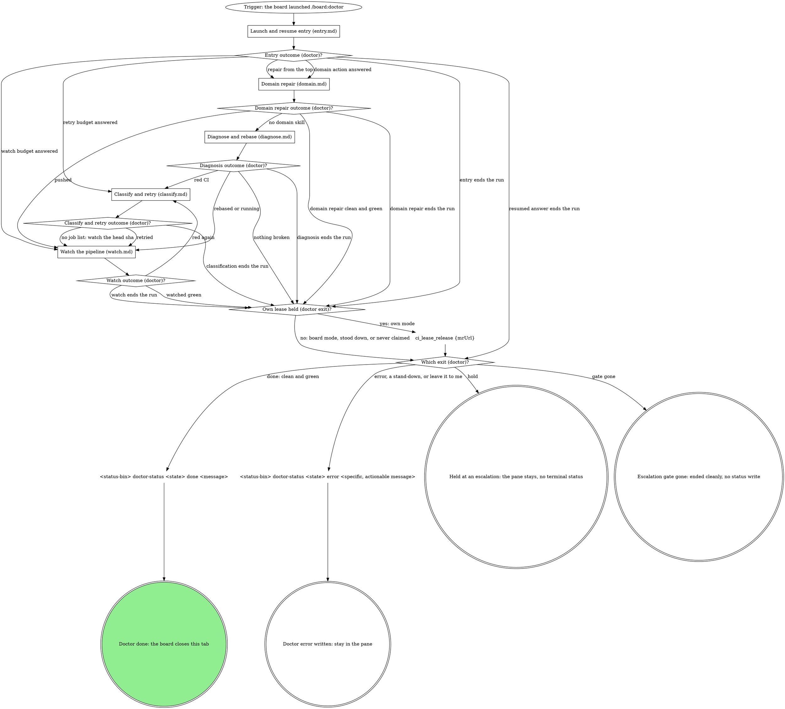
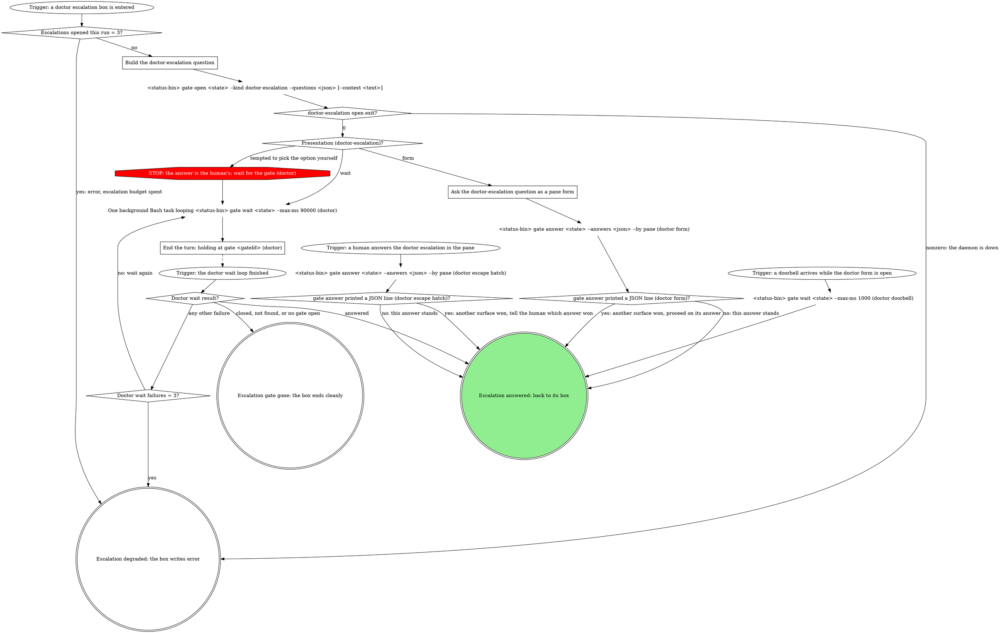

<!-- expanded by rt skills expand from the sources below; edits here are drift (edit the source dir and re-run) -->

<!-- part: step source=doctor/SKILL.md path=doctor/SKILL.md lines=16-566 -->
# mr-board doctor runner

The board launched this pane because an MR has mechanical breakage (CI red
and/or merge conflicts); it may be yours or a teammate's. The human is not
watching: finish unattended, and reach a human only through a
`doctor-escalation` gate or a terminal `error`. This wrapper carries **no**
repo- or CI-specific knowledge; the board injects it:

| flag | meaning |
|------|---------|
| `<mrUrl>` (positional) | the merge request to repair |
| `--state <handle>` | opaque board handle for this MR's repair. Pass it verbatim to `--status-bin`, `--draft-bin`, and the `gate` verbs; never read, stat, or write it. It looks like a `.json` path but no such file exists: board state lives in the board's database, and the path is only a key. Its absence on disk says nothing about whether the board is tracking this pass. |
| `--status-bin <path>` | absolute path to the board's status-writer CLI |
| `--skill <name>` | the domain skill that owns the actual repair (optional) |
| `--skill-path <path>` | absolute path to that skill's SKILL.md, when the board already resolved it (optional; see "Resolving the domain skill") |
| `--tier api` | API-only repair tier: no checkout, no worktree, no local commits. Absent = the historical checkout-tier behavior. |
| `--fix-classes <a,b>` | Comma-separated allowlist of fix classes the dispatching policy enabled (e.g. `retry-flake,inherited-note-draft`). Actions outside the list are escalations, not fixes. See "Fix classes" below for what each one licenses. |
| `--draft-bin <path>` | Absolute path to the board's draft-writer CLI. Any outbound MR note MUST be written through it as a held draft, passing this pane's own `--state` value through so the draft lands in the right board's db: `<draft-bin> doctor-draft <mrUrl> <iid> <kind> <body...> --state <state>`. Never post a note directly. |
| `--resumed-gate <gateId>` | this invocation is a parked-gate resume, not a fresh run (optional; see "Resumed entry" in `entry.md`) |
| `--resumed-gate-kind <kind>` | the `kind` of the gate `--resumed-gate` names (e.g. `doctor-escalation`). Present exactly when `--resumed-gate` is, and the only way to learn it: `--state` is an opaque handle and `gate wait` returns only the answer. |

Write status **only** by running the injected `--status-bin`:

```
<status-bin> doctor-status <state> <status> [message]
```

## State progression

The board owns `queued`. You emit the rest as you cross each milestone:

| Status | When to emit |
|--------|--------------|
| `diagnosing` | Immediately, before you know if it's conflicts, CI, or both. |
| `rebasing` | While a rebase/conflict resolution is running. |
| `fixing` | While implementing fixes for CI failures (or resolving conflicts), including while an escalation gate opened during a fix is being waited on; see "Escalation step" below. |
| `watching` | Post-push, while polling CI for green. |
| `done` | Terminal: clean + green, or fixes pushed and green. |
| `error` | Terminal: a non-enumerable failure needs a human to look directly, or an escalation answer is "leave it to me in the pane". |

## Flow

The graph is the map: start at the trigger and take only the edges it
draws. Each stage box is a file beside this one with its own graph and
sections; the exit at the end of the run (the lease release and the
terminal status) is drawn here.



A stage ends at a doublecircle that names where the map goes next, and
the stage's outcome diamond here takes the edge with that exit's name. A
stage entered at a named node (an answered domain action, a retry budget
answer, failed jobs from a watch) starts at its trigger for that entry.

What the graph cannot show:

- **The done write is the last call.** The board closes this pane's tab
  the moment `doctor-status <state> done` lands, which ends this session
  mid-batch. So the done write is a call of its own, sent only after every
  other write of the run has returned: `ci_lease_release`, and any push,
  rebase or retry the run made. A write sent in the same batch as the done
  write is lost.
- **Lease mode.** `Who holds the fresh lease (doctor)?` fixes the mode for
  the run: board mode (the board's `board:doctor:` owner holds it) or own
  mode (this session holds it). Every `Lease mode (...)?` diamond reads
  that mode. In board mode, a check that finds no fresh lease (null, or
  only a stale one) or another owner's lease is `another owner: stand
  down` at the `Lease check result (...)?` diamond: the board's lease is
  gone, and this pane never claims in its place. See "The CI lease".
- **Budgets.** Each `Fixed the <tool> call once already?` counter counts
  for the whole run. A guard STOP's re-entry passes the same counter as a
  tool error. None resets on an off-script iterate: a refusal after an
  iterate goes straight back to that tool's off-script escalation, and
  its `Off-script rounds = 2 (...)?` counter bounds the loop.
  `Old-lease waits = 2 (doctor)?` counts the waits a resumed pane has
  taken on its old lease: two at most, then it stands down naming the
  holder.
- **Exit messages.** `done` names what the run repaired (or "clean and green,
  nothing to repair"). `error` is specific and actionable (see "Escalation
  shapes and phrasing"); a stand-down's message is `another CI attendant
  holds !<iid>: <holder>`. Hold and gate gone write no status. Under
  `--tier api` every status write names the action and its fix class.

### Launch and resume entry (entry.md)

Writes the first status, resolves the domain skill, checks the tier, and
reads or claims the CI lease; a parked-gate resume reads its parked
answer first and routes on it.
Read `entry.md` now and follow its graph; its sections are there.

### Domain repair (domain.md)

Hands the repair to the resolved domain skill, escalates the enumerable
decisions it reports back, and takes a refused `git_push` through its
off-script escalation.
Read `domain.md` now and follow its graph; its sections are there.

### Diagnose and rebase (diagnose.md)

The generic path's first read: what is broken on the MR, and a
server-side rebase when it has conflicts.
Read `diagnose.md` now and follow its graph; its sections are there.

### Classify and retry (classify.md)

Reads the failed jobs, classifies each, and retries a flaky job or
drafts an inherited-failure note under the CI lease.
Read `classify.md` now and follow its graph; its sections are there.

### Watch the pipeline (watch.md)

Watches one sha with `ci_watch` to a verdict, re-claims a lost own-mode
lease, and escalates a watch that runs past its budget.
Read `watch.md` now and follow its graph; its sections are there.

## Escalation step

Every `doctor escalation: ...` and `doctor off-script escalation: ...` box,
in whichever stage file holds it, takes this step. The step writes no
status: keep the status the escalating node left (`fixing` during a fix, `diagnosing` or `watching`
when a lease, read or watch refusal escalates), including while waiting.
The box that entered reads the outcome:

- **Answered:** its outcome diamond reads `answers.action`.
- **Gone** (closed, not found, or no gate open): end cleanly, say so in the
  pane, and write no status: whatever superseded the gate already owns this
  MR's board state.
- **Degraded** (`gate open` exits nonzero, the escalation budget is spent,
  or the wait keeps failing): the box writes `error` with the actionable
  escalation message this gate would have asked, and never presents a
  form. Doctor panes are routinely auto-dispatched with no human watching,
  and a form there waits forever without a terminal status; the board
  (and, for auto dispatches, the escalation notifier) surfaces the error
  to a human.



### Build the doctor-escalation question

Exactly one question, id `action`. Its `label` states the situation in one
line, in the voice of "Escalation shapes and phrasing". Each option is an
object in the box's own wording:

```json
{"value": "retry job 812 once more on 4f2a9c1", "label": "Retry it once more", "description": "I retry job 812 one more time and watch the pipeline for 4f2a9c1 again."}
```

`value` is spelled in full, human-readable, never a bare index or a
one-word verb the resumed entry could not route; `label` is 2 to 6 words;
`description` is one sentence saying what happens on that answer. The
last option is always `leave it to me in the pane`, with the value exactly
that literal string.

The open prints one JSON line, `{"gateId": "...", "presentation":
"form"}` or `"wait"`. Keep both: `Presentation (doctor-escalation)?` reads
`presentation`, and `End the turn: holding at gate <gateId> (doctor)`
names `gateId`.

`--context` carries the situation line the escalation composes, with any
quoted errors. When it would exceed 8192 UTF-8 bytes, omit `--context`
entirely rather than trimming it.

`Escalations opened this run = 3?` counts enumerable and off-script
escalations together; a resumed pane counts from zero. Each dead end
opens a new gate; an answered gate is never re-opened.

### Ask the doctor-escalation question as a pane form

Follow the gate protocol included at the end of this skill: its "Present
the in-pane gate form" step and its "Answers are option values" and
"Doorbell" sections, for the mechanics. Where it records the pane's
answer with the `gate_answer` tool, a board gate records it with
`<status-bin> gate answer <state> --answers <json> --by pane` instead.

- Render this gate's one question with its label verbatim, and submit the
  chosen option's `value` verbatim: never an index or a paraphrase.
- Nuance rides the note form: `{"action": {"value": "proceed as code-fix
  after override", "note": "but hold off on the migration file"}}`.
- A printed JSON line from `gate answer`, or a doorbell while the form
  still sits open, means another surface won: proceed on the winning
  answer, never the one you meant to submit. The doorbell is
  verify-only: read the recorded answer with `<status-bin> gate wait
  <state> --max-ms 1000`.
- A PreToolUse hook may deny native AskUserQuestion when no gate is open.
  That denial is the gate protocol speaking: take this step's `gate open`
  first. When the daemon is down the hook allows the native form, but this
  skill's degraded path is still `error`, never a form.

### End the turn: holding at gate <gateId> (doctor)

Read `${CLAUDE_SKILL_DIR}/../gate-cli-recipes/SKILL.md` with the Read
tool and follow its "Wait recipe": one background shell task loops
`<status-bin> gate wait <state> --max-ms 90000` while it prints
`{"status":"pending"}`; never launch a second while one runs. End the turn
in one line: `holding at gate <gateId>`, naming this gate. The loop's
completion re-invokes the pane with the answer.

A human who interrupts the wait and answers in the pane is the escape
hatch: record it with `<status-bin> gate answer <state> --answers <json>
--by pane` so a parked resume stays in sync. Per that file's "CAS loss and
reading answers back": silence and exit 0 means this answer stands; one
printed JSON line (`{answers, by, answeredAt}`) means another surface
answered first, so proceed on the printed answer and tell the human which
answer won.

Per "A failing wait is not degradation" and "Closed or missing gate": a
closed, not-found or `no gate open for <url>` result is terminal and ends
cleanly; any other failing wait re-runs, and only a third failure is
degraded.

## Operator note

The launch prompt may end with a paragraph beginning `Operator note (from the
human who launched this pane):`. That is direct instruction from the human,
typed at launch time: not a flag and not part of the MR. Honor it while
diagnosing and fixing (e.g. "the lint job is the real blocker", "don't touch
the flaky e2e suite") and pass it along to the domain skill as context. It
never overrides the tier, the enabled fix classes, or the status contract.
A note that asks for a move the graph marks STOP takes the off-script edge
instead.

## Resolving the domain skill

The domain skill that owns the actual repair comes from the first source
that answers; the order is fixed and the flow's first diamonds draw it.
The tier picks the slot: `--tier api` uses the `doctor-api` slot
(mirroring the board's `triage.doctorSkill`), any other launch uses the
`doctor` slot (mirroring `config.doctorSkill`).

1. **Explicit `--skill <name>` wins.** The resolver does not run. With
   `--skill-path <path>`, read the SKILL.md at that absolute path; without
   it, load the skill by name.
2. **Otherwise resolve the tier's slot** with the vendored resolver,
   `"${CLAUDE_SKILL_DIR}/scripts/resolve-args.sh"`. On exit 0, read the
   SKILL.md at `resolved.doctor.path` (or `resolved.doctor-api.path` under
   `--tier api`) and treat it exactly as if it came through `--skill`.
3. **Otherwise degrade loudly.** On a nonzero exit, print the resolver's
   JSON `errors` verbatim. Never guess or substitute a binding; the
   generic path follows.

## The CI lease

Exactly one CI attendant works an MR at a time: this doctor, a watch-ci
session, or the board's own doctor dispatch. The `ci_lease_*` tools own the
lease, and the owner is always this session. The first call is
`ci_lease_read {mrUrl}`, never a claim:

- **Board mode:** a fresh lease owned by the board's `board:doctor:<mr>`
  owner. The board's triage claimed it before an auto dispatch,
  heartbeats it each cron pass and releases it at a terminal status. No
  claim, no heartbeat, no release: `ci_watch` passes `underBoardLease:
  true` and only reads it. Before each rebase, retry and push, read it
  again; a lease that is not the board's is a stand-down.
- **Own mode:** no fresh lease (null, or only a stale one), or `mine:
  true`. Claim with `ci_lease_claim {mrUrl, holder: doctor, branch?}`
  (`branch` the MR's source branch when the launch, an `mr_view` read or
  the domain skill names it; omit `branch` otherwise, since the tool takes
  a claim without it) before any repair, re-claim before
  each rebase, retry and push, heartbeat during a long domain fix, and
  release with `ci_lease_release {mrUrl}` at every exit except a
  stand-down.
- **Stand down:** any other owner. Write `doctor-status error "another CI
  attendant holds !<iid>: <holder>"`, never release (the lease is not
  yours), and stay in the pane.

A `lease_lost` watch result in own mode with no `holder` means no lease is
held at all: claim again, twice at most, and past that the lost-lease
escalation asks the human. With a holder named, or in board mode, it is a
stand-down.

A resumed pane (launched with `--resumed-gate`) is the one exception to
standing down on another owner's fresh `doctor` lease. `claude --resume`
may start this pane under a new session id, so the lease its earlier self
claimed reads as another session's, and `ci_lease_claim` refuses a fresh
lease another session owns. So the resumed pane waits the old lease out
and reads it again: a dead pane never heartbeats, so its lease goes stale
and the claim succeeds, while a live attendant heartbeats, so a moved
`heartbeatAt` is a stand-down. A fresh run never waits.

| Thought | Reality |
|---|---|
| "The board launched me, so I claim" | Board mode never claims. Read first; the board's lease covers this pane. |
| "Another session holds it but I can retry faster" | Stand down. Two attendants on one MR race each other's commits, pushes and retries. |
| "I claimed at the start, so the retry is mine" | The lease may have lapsed or moved. Check before every repair. |
| "The claim errored, so I skip the lease" | Fix the call once, then the off-script escalation. A repair never runs unleased. |

## Escalation shapes and phrasing

Escalate, don't speculate. A fix that needs product judgment or a
non-obvious semantic resolution takes one of two shapes:

- **Non-enumerable.** No small set of concrete choices exists: the
  diagnosis itself is unclear, or the fix is open-ended. Emit `error` with
  a specific, actionable message.
- **Enumerable.** The decision reduces to a short list of concrete,
  executable choices. Open a `doctor-escalation` gate instead of erroring.

The enumerable cases come in three shapes:

- **Conflict strategy:** both sides of a rebase conflict changed the same
  logic and there is a small set of concrete resolutions (keep one side,
  take the other, or a specific merge of both). Options are those
  resolutions.
- **Author-gate override:** safeguard 2 (`domain.md`) came back
  inconclusive or mismatched for a branch-writing fix class. Options are e.g. `"proceed as
  <fix class> after override"`. **The invariant survives this gate:** an
  answered override does **not** license skipping the independent check.
  Re-verify the author gate fresh, right before applying, exactly as the
  safeguard requires. If the fresh check still does not confirm the
  board's own identity, do not apply the fix; emit `error` with the
  concrete mismatch. A human overriding "proceed" without a match is
  exactly the ambiguity the safeguard exists to catch, so no pane answer
  resolves it.
- **Budget extension:** the fix or watch loop hit its budget without
  converging. Options are e.g. `"extend the fix budget by <n> more
  cycles"`. A
  granted extension that still does not converge is a fresh escalation,
  or `error` when nothing enumerable is left to offer.

### Non-enumerable (`error`)

No small set of concrete choices exists: emit `error` with a specific,
actionable message:

- `"no worktree available: the pool is full"`

Bad ones are vague: `"couldn't fix"`, `"needs human"`, `"CI still red"`.

### Enumerable (`doctor-escalation` gate)

A short list of concrete, executable choices exists: open the gate with
that list as `options`, e.g.:

- `"rebase conflict in app/routes/foo.ts: both sides modified handleSubmit"`
  with options:

  | Value | Label | Description |
  |---|---|---|
  | `keep the MR branch's handleSubmit` | Keep the MR's version | I resolve the conflict with the MR branch's handleSubmit and push. |
  | `keep main's handleSubmit` | Keep main's version | I resolve the conflict with main's handleSubmit and push. |
  | `leave it to me in the pane` | Leave it to me | I stop and write an error naming the conflict. |

- `"CI red after 3 cycles: 2 tests still failing (snapshot + business logic
  in Bar)"` with options:

  | Value | Label | Description |
  |---|---|---|
  | `extend the fix budget by 3 more cycles` | Try three more cycles | I keep fixing for up to three more fix and watch cycles. |
  | `leave it to me in the pane` | Leave it to me | I stop and write an error naming the failing tests. |

## API tier

When `--tier api` is present, the repair is checkout-free by contract:

- Never claim a worktree, never commit, never push. The only mutations
  allowed are job or pipeline retries (`mr_retry`), a server-side rebase
  (`mr_rebase`) when licensed, and held drafts via `--draft-bin`. The CI
  lease calls are bookkeeping, not repairs, and apply at this tier too.
- The `rebasing` and `fixing` milestones apply to their API-shaped
  equivalents (server-side rebase, retry); otherwise go straight from
  `diagnosing` to `watching`. Escalations apply unchanged at this tier: a
  retry loop that does not converge is a budget-extension escalation, as
  at the checkout tier.
- **Every autonomous action is reported as a status-bin write whose
  message names the action and fix class** (e.g. `fixing "retried job 812
  (retry-flake)"`, `rebasing "server-side rebase (clean-api-rebase)"`).
  For auto-dispatched doctors the status writer mirrors each of these into
  the audit log, one line per autonomous action, so an unreported action
  is an audit-trail violation, not a formality.
- Anything that would need a checkout is an `error` escalation whose
  message carries the diagnosis (failed job, one-line cause, why it is not
  yours to retry). The human is not watching; the escalation IS the
  handoff.

## Fix classes

`--fix-classes` is an allowlist, not a suggestion: a fix class not in the
list is out of scope, full stop, and the corresponding breakage is an
escalation instead.

- `retry-flake`: one retry of a flaky job (`mr_retry`).
- `inherited-note-draft`: a held draft through `--draft-bin` naming a
  failure inherited from the target branch.
- `clean-api-rebase`: a server-side rebase (`mr_rebase`).
  `Server-side rebase licensed?` answers yes when `--fix-classes` is
  absent or lists `clean-api-rebase`.
- **`mechanical-lint`** (checkout tier only): **behavior-neutral
  mechanical code fixes ONLY**... appending a required lint-disable reason
  suffix, formatting-only changes (whitespace, quote style, trailing
  commas), import ordering. Nothing that could alter runtime behavior
  qualifies; if a fix touches logic, changes a condition, adds or removes a
  code path, or you are not certain it's a no-op, it is **not**
  mechanical-lint... escalate it instead of guessing.
- **`code-fix`** (checkout tier only): **full repair authority on the
  board identity's OWN MRs**... real code fixes for red CI, semantic
  conflict resolution, committed and pushed to the MR branch. The
  dispatcher only ever includes this class when the MR author IS the
  board's own identity. Judgment line: `code-fix` licenses fixes a
  competent author would consider the obviously-intended change (a missing
  import, a type error with one evident correction, a broken test whose
  fixture drifted from sanctioned behavior). It does NOT license design
  decisions: when the fix would CHANGE sanctioned behavior, pick between
  plausible intents, or the loop is not converging, escalate with the
  options laid out.
- When both `mechanical-lint` and `code-fix` are present, the fix takes the
  narrowest class that covers it, and the commit message names that class.

## Rules

- No `--no-verify`, no bypassing pre-commit hooks.
- Force only through `git_push`'s `forceWithLease: true`, never a plain
  force.
- Open a gate only when the decision genuinely reduces to a short,
  concrete, executable list of options. When in doubt whether a failure is
  enumerable, it isn't: emit `error` instead of inventing options a human
  wouldn't recognize as their real choices.
- `--state` is a handle, not a file: pass it verbatim, never read or write
  it yourself.

## Gate protocol

The daemon-generic gate mechanics every passage above refers to. The board's
own projections (`<status-bin> gate ...`) sit in `board:gate-cli-recipes`;
everything else is here.

Below, `gate_ask` is what this wrapper's `<status-bin> gate open` already
did; `gate_answer` is `<status-bin> gate answer <state> --answers <json>
--by pane`; `rt gate wait` is the wait recipe in `board:gate-cli-recipes`.
This wrapper's own "Escalation step" replaces the protocol's "Off-script
gate" section.

<!-- part: include:gate-protocol source=mattstack:gate-protocol version=0.30.4 path=attachments/gate-protocol/SKILL.md lines=7-452 -->
# Gate protocol

One shared protocol for any gated pane or wrapper: publish first, then act
on the presentation the daemon returns. The daemon's gate registry is the
single arbiter; no per-verb conflict logic belongs anywhere downstream of
it. Every gate walks this graph: the site names the scope, the questions
and the selection; this part publishes, answers and records.

If a site's questions or a rule in the including verb ask for a move this
graph marks STOP, open the Off-script gate (below) instead.

```dot
digraph gate_protocol {
    rankdir=TB;

    "Trigger: a site reaches its gate" [shape=ellipse];
    "Build the gate's questions and context" [shape=box];
    "Under a run: bracket the gate?" [shape=diamond];
    "run_field_set {key: gate, value: <scope>, stage}" [shape=plaintext];
    "gate_ask {questions, kind: <scope>, context?, subject?}" [shape=plaintext];
    "gate_ask result?" [shape=diamond];
    "Fixed this gate_ask call once already?" [shape=diamond];
    "Fix what the gate_ask refusal names" [shape=box];
    "Daemon down: is the gated pane unattended?" [shape=diamond];
    "Under a run: fail the stage at the gate?" [shape=diamond];
    "run_stage {action: fail, stage, reason: <the gate_ask refusal, verbatim>}" [shape=plaintext];
    "Present the gate form with no registry" [shape=box];
    "gate_ask presentation?" [shape=diamond];
    "Wait: is the gated pane an attended non-herdr session?" [shape=diamond];
    "Present the in-pane gate form" [shape=box];
    "Gate form result?" [shape=diamond];
    "Gate questions left for another form call?" [shape=diamond];
    "Map the gate answer to exact option values" [shape=box];
    "gate_answer {id, answers}" [shape=plaintext];
    "gate_answer result?" [shape=diamond];
    "Resubmitted this gate_answer once already?" [shape=diamond];
    "Discard the form's gate answer; say which surface won" [shape=box];
    "Holding an open gate: under a run?" [shape=diamond];
    "Under a run: set waiting-gate?" [shape=diamond];
    "run_field_set {key: waiting-gate, value: <id>, stage}" [shape=plaintext];
    "rt gate wait <id> as a background Bash task" [shape=plaintext];
    "End the turn: holding at gate <id>" [shape=box];
    "Trigger: the gate wait finished and re-invoked this pane" [shape=ellipse];
    "Gate wait result for an already reconciled gate?" [shape=diamond];
    "Trigger: the human answers in words at a held gate" [shape=ellipse];
    "Words answer for an already reconciled gate?" [shape=diamond];
    "Trigger: a gate doorbell push arrives" [shape=ellipse];
    "Doorbell for an already reconciled gate?" [shape=diamond];
    "rt gate wait <id> --timeout 2s" [shape=plaintext];
    "waiting-gate set on this run?" [shape=diamond];
    "run_field_set {key: waiting-gate, value: -, stage}" [shape=plaintext];
    "Gate answer already in hand?" [shape=diamond];
    "Gate wait status?" [shape=diamond];
    "Take the winning gate answer and its by" [shape=box];
    "Under a run: record the gate decision?" [shape=diamond];
    "run_decision {contract: gate@1, scope, selection, decidedBy}" [shape=plaintext];
    "STOP: never invent an answer or re-ask a closed gate" [shape=octagon style=filled fillcolor=red fontcolor=white];
    "Gate stage failed" [shape=doublecircle];
    "Verb ends at the gate, quoting the refusal" [shape=doublecircle];
    "No run: held at the open gate, turn ends" [shape=doublecircle];
    "Late gate signal discarded" [shape=doublecircle];
    "Gate path ended per the verb's policy" [shape=doublecircle];
    "Act on the gate answer at the site" [shape=doublecircle style=filled fillcolor=lightgreen];

    "Trigger: a site reaches its gate" -> "Build the gate's questions and context";
    "Build the gate's questions and context" -> "Under a run: bracket the gate?";
    "Under a run: bracket the gate?" -> "run_field_set {key: gate, value: <scope>, stage}" [label="yes"];
    "Under a run: bracket the gate?" -> "gate_ask {questions, kind: <scope>, context?, subject?}" [label="no"];
    "run_field_set {key: gate, value: <scope>, stage}" -> "gate_ask {questions, kind: <scope>, context?, subject?}";
    "gate_ask {questions, kind: <scope>, context?, subject?}" -> "gate_ask result?";
    "gate_ask result?" -> "gate_ask presentation?" [label="ok: keep id and presentation"];
    "gate_ask result?" -> "Daemon down: is the gated pane unattended?" [label="refused: daemon unreachable"];
    "gate_ask result?" -> "Fixed this gate_ask call once already?" [label="refused: any other reason"];
    "Fixed this gate_ask call once already?" -> "Fix what the gate_ask refusal names" [label="no"];
    "Fixed this gate_ask call once already?" -> "Under a run: fail the stage at the gate?" [label="yes: budget spent"];
    "Fix what the gate_ask refusal names" -> "gate_ask {questions, kind: <scope>, context?, subject?}";
    "Daemon down: is the gated pane unattended?" -> "Present the gate form with no registry" [label="no: attended"];
    "Daemon down: is the gated pane unattended?" -> "Under a run: fail the stage at the gate?" [label="yes"];
    "Under a run: fail the stage at the gate?" -> "run_stage {action: fail, stage, reason: <the gate_ask refusal, verbatim>}" [label="yes"];
    "Under a run: fail the stage at the gate?" -> "Verb ends at the gate, quoting the refusal" [label="no"];
    "run_stage {action: fail, stage, reason: <the gate_ask refusal, verbatim>}" -> "Gate stage failed";
    "Present the gate form with no registry" -> "Under a run: record the gate decision?" [label="answered: decidedBy is pane"];
    "gate_ask presentation?" -> "Present the in-pane gate form" [label="form"];
    "gate_ask presentation?" -> "Wait: is the gated pane an attended non-herdr session?" [label="wait"];
    "Wait: is the gated pane an attended non-herdr session?" -> "Present the in-pane gate form" [label="yes: take the form anyway"];
    "Wait: is the gated pane an attended non-herdr session?" -> "Under a run: set waiting-gate?" [label="no: spawned, or any herdr pane"];
    "Present the in-pane gate form" -> "Gate form result?";
    "Gate form result?" -> "Gate questions left for another form call?" [label="answered"];
    "Gate form result?" -> "Trigger: a gate doorbell push arrives" [label="dismissed by the daemon: the doorbell is the next input" style=dashed];
    "Gate form result?" -> "Holding an open gate: under a run?" [label="cancelled by the human"];
    "Gate questions left for another form call?" -> "Present the in-pane gate form" [label="yes: the next chunk"];
    "Gate questions left for another form call?" -> "Map the gate answer to exact option values" [label="no: last chunk answered"];
    "Map the gate answer to exact option values" -> "gate_answer {id, answers}";
    "gate_answer {id, answers}" -> "gate_answer result?";
    "gate_answer result?" -> "Take the winning gate answer and its by" [label="recorded: this answer won"];
    "gate_answer result?" -> "Discard the form's gate answer; say which surface won" [label="conflict: true"];
    "gate_answer result?" -> "Resubmitted this gate_answer once already?" [label="refused: not an option value"];
    "gate_answer result?" -> "STOP: never invent an answer or re-ask a closed gate" [label="refused: gate closed or not found"];
    "Resubmitted this gate_answer once already?" -> "Map the gate answer to exact option values" [label="no"];
    "Resubmitted this gate_answer once already?" -> "Holding an open gate: under a run?" [label="yes: leave it open for another surface"];
    "Discard the form's gate answer; say which surface won" -> "Take the winning gate answer and its by";
    "Holding an open gate: under a run?" -> "run_field_set {key: waiting-gate, value: <id>, stage}" [label="yes"];
    "Holding an open gate: under a run?" -> "No run: held at the open gate, turn ends" [label="no"];
    "Under a run: set waiting-gate?" -> "run_field_set {key: waiting-gate, value: <id>, stage}" [label="yes"];
    "Under a run: set waiting-gate?" -> "rt gate wait <id> as a background Bash task" [label="no"];
    "run_field_set {key: waiting-gate, value: <id>, stage}" -> "rt gate wait <id> as a background Bash task";
    "rt gate wait <id> as a background Bash task" -> "End the turn: holding at gate <id>";
    "End the turn: holding at gate <id>" -> "Trigger: the gate wait finished and re-invoked this pane" [style=dashed];
    "Trigger: the gate wait finished and re-invoked this pane" -> "Gate wait result for an already reconciled gate?";
    "Gate wait result for an already reconciled gate?" -> "Late gate signal discarded" [label="yes"];
    "Gate wait result for an already reconciled gate?" -> "waiting-gate set on this run?" [label="no"];
    "Trigger: the human answers in words at a held gate" -> "Words answer for an already reconciled gate?";
    "Words answer for an already reconciled gate?" -> "Late gate signal discarded" [label="yes: say in one line which surface already decided it"];
    "Words answer for an already reconciled gate?" -> "waiting-gate set on this run?" [label="no"];
    "Trigger: a gate doorbell push arrives" -> "Doorbell for an already reconciled gate?";
    "Doorbell for an already reconciled gate?" -> "Late gate signal discarded" [label="yes"];
    "Doorbell for an already reconciled gate?" -> "rt gate wait <id> --timeout 2s" [label="no"];
    "rt gate wait <id> --timeout 2s" -> "waiting-gate set on this run?";
    "waiting-gate set on this run?" -> "run_field_set {key: waiting-gate, value: -, stage}" [label="yes: this pane armed it at a hold"];
    "waiting-gate set on this run?" -> "Gate answer already in hand?" [label="no: never armed for this gate (a form pane, or no run)"];
    "run_field_set {key: waiting-gate, value: -, stage}" -> "Gate answer already in hand?";
    "Gate answer already in hand?" -> "Map the gate answer to exact option values" [label="yes: the human answered in words"];
    "Gate answer already in hand?" -> "Gate wait status?" [label="no: a wait printed the row"];
    "Gate wait status?" -> "Take the winning gate answer and its by" [label="answered: row.answer"];
    "Gate wait status?" -> "STOP: never invent an answer or re-ask a closed gate" [label="closed or gate not found"];
    "Gate wait status?" -> "Holding an open gate: under a run?" [label="timed out: still open (the 2s re-read)"];
    "STOP: never invent an answer or re-ask a closed gate" -> "Gate path ended per the verb's policy";
    "Take the winning gate answer and its by" -> "Under a run: record the gate decision?";
    "Under a run: record the gate decision?" -> "run_decision {contract: gate@1, scope, selection, decidedBy}" [label="yes"];
    "Under a run: record the gate decision?" -> "Act on the gate answer at the site" [label="no"];
    "run_decision {contract: gate@1, scope, selection, decidedBy}" -> "Act on the gate answer at the site";
}
```



### Build the gate's questions and context

Open before anything that depends on the answer. `gate_ask` owns the whole
opening ceremony (subject resolution, presentation, nudge, origin, the
context size cap): `questions` (each `{"id", "label", "multi",
"options"}`), `kind` = the gate's scope, and optional `context` and
`subject`. Success returns `id` (`gt-...`), `presentation` (`form` or
`wait`), `subject`, and `supersededId` (null or the superseded gate's id).
Keep `id` and `presentation`: every node after it acts on them.

- **Subject.** The daemon resolves it; never build one by hand. Your
  session's running run wins (`run:<id>`), else your agent record (its
  launch subject when it carries one, else `agent:<id>`); with neither, a
  loud refusal, and a session with multiple running runs is refused naming
  the candidates. Pass `subject` only to open on a subject that is not your
  own. Opening where the subject already carries an open gate of the same
  kind supersedes the old one, so a relaunch after a crash is safe without
  a cleanup step.
- **Context.** A prose `context` is a VERBATIM QUOTE of the material the
  decision is about (the task summary from the brief, the plan section
  under decision, the failing check output), never a freshly composed
  summary; a structured one carries its shape's fields instead (Structured
  context below). A human-owned, non-exempt gate REFUSES on empty or
  whitespace-only context: give it real material or omit the field, never
  blank it. The gate context and every question's `context` share one
  8192-byte UTF-8 budget; over it, the daemon drops the question contexts,
  and the gate context too when it alone is over, loudly: the result
  carries `contextOmitted: true`. Do not measure or trim a prose context
  yourself; a structured open pre-flights instead.
- **Prose layout.** A prose `context` is Markdown that reads the same
  unrendered, since the console renders it and the pane form shows it as
  plain text. Its parts, in order: the one or two lines that frame the
  decision; then each group as a label line (`Important:`) followed by one
  `-` bullet per item (a finding, a step, a failing check); a blank line
  between blocks; file paths, symbols, commands and shas in backticks.
  Keep the material's own words and set them in this shape.
- **Where text goes.** Gate-level `context` is background every question
  shares. A question's own `context` is setup for that one question, when
  the gate asks several that need different framing. An option's
  `description` is the one-line why for that choice; the `label` already
  says what.
- **Options.** Emit labeled options whenever a site's option values are not
  already human-readable; the registry stores every option in that object
  form. Labels cap at 200 UTF-8 bytes and an oversized label REJECTS the
  open: middle-truncate a long path, never alter the value.
- **At most 4 options per question.** That is the native form's hard
  per-question limit, and the daemon presents the in-pane form only when
  EVERY question fits it, so one 5-option question sends the whole gate to
  the background wait queue. The navigation verbs a site lists (Iterate
  here, Go back to a stage, Hold, Abandon) are their own `next` question,
  never extra options folded into a decision question; a selection list
  larger than 4 splits into `<id>-1`, `<id>-2`, ... questions of up to 4
  options each, in order, whose answers read as one union.

```json
{"value": "redirect:implement", "label": "Redirect to implement", "description": "the failing check points at code, not the plan"}
```

Presentation is the daemon's, by one rule no caller computes; the nudge and
origin ride the same call, so there is nothing to stamp by hand. `rt gate
open` remains the raw primitive underneath; a gated verb never needs it.

### Fix what the gate_ask refusal names

A refusal that names a subject or question problem (a blank context, an
oversized label, several running runs) is not daemon-down: fix exactly what
it names and call `gate_ask` again, once. An oversized label is fixed by
middle-truncating that label (keep its start and its end, `...` between)
and nothing else: the option's `value` is sent exactly as it was in the
refused call, never rewritten to carry the label's text, and no whole end
of the label is dropped. A second refusal fails the stage under a run
with a `reason` that quotes the refusal text verbatim, or ends the verb
quoting it with no run. It does not go off-script: `gate_ask` is the
refused tool, and the off-script gate opens through `gate_ask` too.

### Present the gate form with no registry

`gate_ask` failed with a daemon-unreachable error, so the gate runs
form-only in the pane, exactly the pre-facility behavior: present the form
and act on its answer, with no `gate_ask`, `rt gate wait` or `gate_answer`
calls at all. With no registry there is no CAS: the form's answer is the
decision, and its record, when a run exists, carries `decidedBy` `pane`.
An unattended pane never presents this form; it fails the stage under a
run, or ends the verb.

### Present the in-pane gate form

This is the `presentation: "form"` branch; an attended non-herdr pane on
`wait` lands here too (Attendance, below). The native in-pane structured form is this
gate's registry face: where the launch-injected AskUserQuestion hook is
active, an open gate matching the pane's LAUNCH subject is what lets the
form through, and so is the pane's own worktree carrying its own open run:
gate. Render each option's `label` when it has one and its `description`
when it has one (the AskUserQuestion option's own description field). The
form never shows a structured context's JSON: flatten a structured context
to prose for the form's question text, and carry a prose context into it
as written.

When the gate carries more questions than one form call fits, ask them in
gate order, one chunk per call, and answer once after the last chunk; a
lost CAS at that point discards every chunk's answer together.

Dismissed by the daemon: another surface answered while the form was open,
the daemon injected a single Escape, and the doorbell is your next input.
Cancelled by the human: the gate stays open; never re-present it on your
own.

### Map the gate answer to exact option values

`gate_answer` takes `id` = the gate's id and `answers` = one object keyed by
question id, `{"<question id>": "<value>" | ["<value>", ...] | {"value":
..., "note": "..."}}`. Each value is the chosen option's `value` verbatim
(Answers are option values, below); a question with no options takes what
the human typed. An answer the human gave in words maps the same way, its
nuance in `note`. A value the daemon refuses is remapped once; a second
refusal leaves the gate open for another surface to answer.

### Discard the form's gate answer; say which surface won

A losing `gate_answer` is not an error: it returns a successful result
carrying `conflict: true` and the winner's `row`. Discard the form's
answer, say in the pane in one line which answer won and from where
(`row.answer.by`), and proceed on `row`'s recorded answer; no second read
is needed. On the words path the discarded answer is the human's words,
not a form's.

### End the turn: holding at gate <id>

The node before launched the one background `rt gate wait <id>` (the
shell tool's run-in-background mode; the wait is never a tool call, since
no tool blocks on a gate); never launch a second while one for this gate
runs. End the turn in one line: `holding at gate <id>`. The wait
loops internally around the daemon clamp, survives daemon restarts, and
exits only on answered or closed, printing
`{"ok":true,"status":"answered","row":{...}}` as its last stdout. The pane
is idle but armed: the wait's completion re-invokes this pane with the
answer as the tool result. Under a run a turn ends only with
`waiting-gate` or `hold` set; the pipeline gate stop hook blocks any other
ending, which is why every hold under a run arms the marker and the wait.

### Take the winning gate answer and its by

Read the answers at `row.answer.answers` (or the answer this pane just
recorded) and the deciding surface at `row.answer.by`. `decidedBy` names
the CAS WINNER, never `pane` when a different surface won, and a `gate@1`
record's `decidedBy` is a surface (`pane`, `board`, `console`,
`shepherd`), never a verb name.

## Attendance

Attendance comes from the invocation context, never from asking. Under a
run it is the run's `spawnedBy` (recorded as `spawned_by`): set means a
surface spawned the pane and it is unattended. A verb with no run has no
`spawnedBy`: one a surface launched in a pane (a board wrapper, a herd
brief) is unattended, and its launch instruction says so; one a human typed
is attended.

On `wait`, the branch turns on herdr as well as attendance: an attended
non-herdr session takes the plain in-pane form anyway, because the stamp
names what OTHER surfaces reconcile against, not a command to this pane,
and a non-herdr pane has no herdr PTY to receive the remote-answer Escape
that makes the idle wait safe. A spawned pane, or any herdr pane whether
attended or not, goes to the wait. The herdr bit is `HERDR_ENV=1` in the
pane's environment, read only to pick this `wait` branch, never to compute
presentation. A human who opens an unattended pane can interrupt the wait
and answer in words: the graph's words trigger, which first checks that
no surface already reconciled the gate.

Under a run, a cancelled form holds on the wait even outside herdr: no form
is open, so nothing needs the remote-answer Escape. With no run, a cancelled
form launches no wait: the human who cancelled is at the pane, the turn ends
held at the open gate, and the answer arrives later in words.

## Runs integration

A site that says "run gate-protocol's Runs integration with kind `<k>` and
these questions" enters the graph at its trigger and walks every branch;
it is not a list of steps to run in order. The site supplies `kind` (its
scope), the questions and its selection. Every `run_*` call passes the
run's `runDb`, which the verb holds. No `subject`: the daemon resolves this
session's running run. Include `context` only when the site has material to
quote; omit the field otherwise, never an empty string.

A site's own lines for the graph's run nodes are those nodes, not extra
steps: its `run_field_set` with `key` `gate` is the bracket node, and its
`run_decision` line is the `run_decision` node, filled with the site's
selection, never a second record.

## Off-script gate

Leaving a host's graph is legal when it is explicit. A host STOP that
routes here opens this gate through the graph above, scope
`off-script:<site>:<n>` (`n` counts from 1 within the site's attempt), with
`context` quoting the refusal or the line that asks for the move:

| Question | Options |
|---|---|
| `action` | **Take the proposed move** (the value spells the move in full) / **Hand back** |
| `next` | **Proceed** (Recommended) / **Iterate here** / **Hold** |

Selection: `{"move":"<the move>","why":"<the refusal or line>","action":"take|handback","next":"proceed|iterate|hold","note":"<their words or null>"}`,
recorded only under a run, like every `run_decision`. Take: make exactly
that move, once, then continue from the node the forbidden move would have
led to. Hand back: under a run, `run_stage {action: fail}` with the why as
the reason; with no run, end the verb quoting the why. A host graph draws
one off-script node per STOP origin, never one shared node: continuing
needs to know where the move came from, and a shared node cannot return to
the right place.

## Structured context (gate-ctx@1)

A context string may carry a JSON object instead of prose, for surfaces
that render it as cards. It is structured when it parses as an object
whose `"gate-ctx"` key names a known shape; anything else takes the prose
path. The key is both the discriminant and the version:

| Shape | Carried by | Required | Optional |
|---|---|---|---|
| `plan@1` | gate `context` | `reviewer`, `threads.total` | `round`, `threads.blocking` (absent reads 0), `adjudication` (display string) |
| `post@1` | gate `context` | `reviewer`, `replies` (count) | `round`, `fixes` (`[{"sha": ...}]`) |
| `thread@1` | a thread question's `context` | `author`, `severity`, `claim.summary`, `verdict.call`, `reply.kind`, `reply.text` unless `reply.kind` is `none` | `claim.points` (strings), `verdict.note` |
| `reply@1` | a respond-post thread question's `context` | `thread`, `file`, `verb`, `text` | `sha` |
| `replies@1` | a replies question's `context` (the retired respond-post shape; renderers still read gates opened with it) | `replies[]`, each `thread`, `file`, `verb`, `text` | `sha` per entry |
| `review@1` | a review-post gate's `context` | `readiness`, `summary`, `findings` (counts by severity) | `reviewer`, `round`, `re_review` (absent reads false), `prior` (`{addressed, still_open}`, both required) |
| `findings@1` | each `findings-*` question's `context` | `findings[]`, each `id`, `severity`, `title`, `body` | `file`, `fix`, `evidence`, `disposition` per entry |

- Enums: `severity` is `blocking | non-blocking | question | none`;
  `verdict.call` is `valid | valid-low-value | pushback |
  needs-clarification | no-ask`; `reply.kind` is `verbatim` (the exact
  text that will post), `direction` (intent only), or `none` (nothing
  posts); `verb` is `reply | fix`, and `sha` rides only a `fix`.
  `readiness` is `yes | no | with-fixes`, hyphenated; a `findings@1`
  entry's `severity` is `critical | important | minor` and its
  `disposition` (re-review only) is `new | still-open | addressed-check`;
  a severity with no findings may omit its count, and absent reads 0.
- A `thread@1` question's `label` is the thread's `file:line`, and its
  ordinal is its position among the gate's `thread-*` questions. The
  planned fix is not in the context: it is the `fix` option's
  `description`. A `reply@1` question is `multi`, with exactly two
  options, `post:<thread>` and `resolve:<thread>`, picked independently;
  its `label` is the thread's `file:line`. A `replies@1` entry joins its
  checkbox option by `thread` == option value.
- A `findings@1` entry joins its option ONE TO ONE: `id` == the option's
  `value`, every option with exactly one entry and every entry with one
  option; a mismatch either way sends the whole gate to the generic
  view. The options keep the degraded recipe older renderers parse:
  label `[Tier] title`, description `anchor · fix · kind:<word>`. `file`
  is a real `path:line` anchor, never the label of an unanchored
  finding. A `review@1` gate is structured only when EVERY `findings-*`
  question carries a `findings@1` context; otherwise it opens as prose.
- Unknown keys are ignored, and a new field never bumps the version; a
  changed meaning or type does. A missing or wrong-typed required field
  fails the WHOLE context, which then shows as raw JSON through the prose
  path: validate before opening, and omit an optional key rather than
  writing `null`.
- Size: pre-flight the whole open against the shared budget above,
  measuring the serialized strings. Over it, drop `claim.points` from the
  longest thread first, then `verdict.note` the same way; never trim
  `reply.text`, the reply is the thing being approved.
  In a `findings@1` open, drop `evidence` from the entry where it is
  largest first, then `fix` the same way, whole fields only; never
  `title`, `file`, or `body`. Still over: prose
  contexts for the whole gate, never a half-structured one.
- The in-pane form never shows the JSON: flatten each context to prose
  for the form's question text.

## Answers are option values

For a question with options, every answer value must exactly match one of
its option VALUES (multi = array, every element checked); the daemon
compares values only, never labels, and rejects anything else at record
time. Never an index or a paraphrase. Nuance rides the per-answer note
form:
`{"value": <verbatim value or array>, "note": "<free text>"}`.
A surface that lets the human replace text the gate offered (an edited
reply) sends it as `text` on the same object, beside any note:
`{"value": <verbatim value or array>, "text": "<replacement>"}`. The
in-pane form never sends `text`; a replacement for offered text that the
human types in the form's free-text field rides as a note. What a note or
`text` changes is each verb's own act step's call; the protocol swaps
neither in for offered text by itself.

## Closed gates, Hold / Iterate

`closed` means the decision site is abandoned: end that path cleanly per
the verb's own policy. Never invent an answer for a closed gate. Picking
Hold or Iterate is handled IN-PANE by the verb itself, not posted through
the registry as a terminal decision; a verb that re-asks after Hold or
Iterate opens a NEW gate rather than reusing the old one. Marking such
options pane-only (so remote cards render them disabled) rides `meta`,
which only the typed client and raw `rt gate open` carry; `gate_ask`
does not.

## Doorbell

The doorbell phrase is a VERIFY-ONLY signal: it never carries or implies
the answer, only "re-read the registry" (the 2s re-read node). With a form
open, the daemon dismisses it itself with a single Escape into the gate's
pane, so the doorbell arrives as your next input; for a pane the daemon
cannot reach, it queues behind the form until the human answers or cancels
it. The surface that recorded the answer never receives this push, and a
push for a gate already reconciled is discarded.

## Red flags

| Thought | Reality |
|---|---|
| "I'll compute presentation / build --origin myself" | The daemon owns the ceremony. `gate_ask` returns the presentation; act on it. |
| "The doorbell push tells me what they picked" | It's verify-only. It never carries or implies the answer: re-read the registry. |
| "`decidedBy` is whoever just submitted the form" | It names the CAS WINNER, which may be a different surface than the one that just submitted. |
| "I'll ask the human whether this pane is attended" | Attendance comes from the invocation context, never asked. |
| "The site's run_decision line is one more record after the graph's" | It is the graph's `run_decision` node, filled with the site's selection. |
