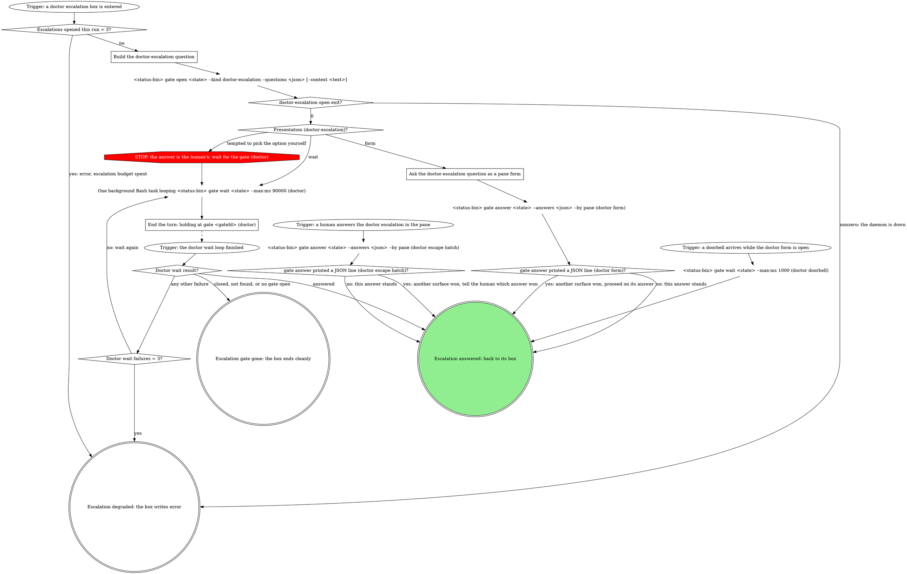

# mr-board doctor runner

The board launched this pane because an MR has mechanical breakage (CI red
and/or merge conflicts); it may be yours or a teammate's. The human is not
watching: finish unattended, and reach a human only through a
`doctor-escalation` gate or a terminal `error`. This wrapper carries **no**
repo- or CI-specific knowledge; the board injects it:

| flag | meaning |
|------|---------|
| `<mrUrl>` (positional) | the merge request to repair |
| `--state <handle>` | opaque board handle for this MR's repair. Pass it verbatim to `--status-bin`, `--draft-bin`, and the `gate` verbs; never read, stat, or write it. It looks like a `.json` path but no such file exists: board state lives in the board's database, and the path is only a key. Its absence on disk says nothing about whether the board is tracking this pass. |
| `--status-bin <path>` | absolute path to the board's status-writer CLI |
| `--skill <name>` | the domain skill that owns the actual repair (optional) |
| `--skill-path <path>` | absolute path to that skill's SKILL.md, when the board already resolved it (optional; see "Resolving the domain skill") |
| `--tier api` | API-only repair tier: no checkout, no worktree, no local commits. Absent = the historical checkout-tier behavior. |
| `--fix-classes <a,b>` | Comma-separated allowlist of fix classes the dispatching policy enabled (e.g. `retry-flake,inherited-note-draft`). Actions outside the list are escalations, not fixes. See "Fix classes" below for what each one licenses. |
| `--draft-bin <path>` | Absolute path to the board's draft-writer CLI. Any outbound MR note MUST be written through it as a held draft, passing this pane's own `--state` value through so the draft lands in the right board's db: `<draft-bin> doctor-draft <mrUrl> <iid> <kind> <body...> --state <state>`. Never post a note directly. |
| `--resumed-gate <gateId>` | this invocation is a parked-gate resume, not a fresh run (optional; see "Resumed entry" under Flow) |
| `--resumed-gate-kind <kind>` | the `kind` of the gate `--resumed-gate` names (e.g. `doctor-escalation`). Present exactly when `--resumed-gate` is, and the only way to learn it: `--state` is an opaque handle and `gate wait` returns only the answer. |

Write status **only** by running the injected `--status-bin`:

```
<status-bin> doctor-status <state> <status> [message]
```

## State progression

The board owns `queued`. You emit the rest as you cross each milestone:

| Status | When to emit |
|--------|--------------|
| `diagnosing` | Immediately, before you know if it's conflicts, CI, or both. |
| `rebasing` | While a rebase/conflict resolution is running. |
| `fixing` | While implementing fixes for CI failures (or resolving conflicts), including while an escalation gate opened during a fix is being waited on; see "Escalation step" below. |
| `watching` | Post-push, while polling CI for green. |
| `done` | Terminal: clean + green, or fixes pushed and green. |
| `error` | Terminal: a non-enumerable failure needs a human to look directly, or an escalation answer is "leave it to me in the pane". |

## Flow

The graph is the map: start at the trigger and take only the edges it
draws. Each box has its own section below the graph.

```dot
digraph doctor_flow {
    rankdir=TB;

    "Trigger: the board launched /board:doctor" [shape=ellipse];
    "--resumed-gate given (doctor)?" [shape=diamond];
    "<status-bin> doctor-status <state> fixing (resumed gate)" [shape=plaintext];
    "<status-bin> doctor-status <state> diagnosing" [shape=plaintext];
    "--skill given (doctor)?" [shape=diamond];
    "--skill-path given (doctor)?" [shape=diamond];
    "Read <--skill-path> (doctor)" [shape=plaintext];
    "Load the --skill domain skill by name (doctor)" [shape=box];
    "${CLAUDE_SKILL_DIR}/scripts/resolve-args.sh (doctor)" [shape=plaintext];
    "resolve-args.sh exit (doctor)?" [shape=diamond];
    "Read <the tier's resolved path> (doctor)" [shape=plaintext];
    "Print the resolver's errors verbatim (doctor)" [shape=box];
    "Branch-writing class under --tier api?" [shape=diamond];

    "ci_lease_read {mrUrl}" [shape=plaintext];
    "Who holds the fresh lease (doctor)?" [shape=diamond];
    "ci_lease_claim {mrUrl, holder: doctor, branch}" [shape=plaintext];
    "ci_lease_claim result (doctor)?" [shape=diamond];
    "Fixed the ci_lease_read call once already?" [shape=diamond];
    "Fix what the ci_lease_read error names" [shape=box];
    "Fixed the ci_lease_claim call once already?" [shape=diamond];
    "Fix what the ci_lease_claim error names" [shape=box];
    "STOP: while another attendant holds the lease, stand down; every commit, push and retry is theirs" [shape=octagon style=filled fillcolor=red fontcolor=white];
    "Which entry (doctor)?" [shape=diamond];

    "<status-bin> gate wait <state> (resumed escalation)" [shape=plaintext];
    "Resumed wait result (doctor)?" [shape=diamond];
    "Resumed wait failures = 3 (doctor)?" [shape=diamond];
    "Does the resumed answer end the run (doctor)?" [shape=diamond];
    "What does the resumed answer name (doctor)?" [shape=diamond];

    "Domain skill resolved (doctor)?" [shape=diamond];
    "Delegate the repair to the domain skill" [shape=box];
    "Domain skill result (doctor)?" [shape=diamond];
    "STOP: push only with git_push (doctor)" [shape=octagon style=filled fillcolor=red fontcolor=white];
    "STOP: ask only through a doctor-escalation gate" [shape=octagon style=filled fillcolor=red fontcolor=white];
    "doctor escalation: the domain skill's decision" [shape=box];
    "Escalation outcome (domain decision)?" [shape=diamond];
    "Hand the answered action to the domain skill" [shape=box];

    "mr_view {mrUrl, maxAgeMs: 5000}" [shape=plaintext];
    "mr_view result (doctor)?" [shape=diamond];
    "Fixed the mr_view call once already?" [shape=diamond];
    "Fix what the mr_view error names" [shape=box];
    "What is broken (doctor)?" [shape=diamond];

    "Server-side rebase licensed?" [shape=diamond];
    "Lease mode (before the rebase)?" [shape=diamond];
    "ci_lease_read {mrUrl} (before the rebase)" [shape=plaintext];
    "ci_lease_claim {mrUrl, holder: doctor, branch} (before the rebase)" [shape=plaintext];
    "Lease check result (before the rebase)?" [shape=diamond];
    "<status-bin> doctor-status <state> rebasing <message naming the rebase and its fix class>" [shape=plaintext];
    "mr_rebase {mrUrl}" [shape=plaintext];
    "mr_rebase result?" [shape=diamond];
    "STOP: rebases go through mr_rebase" [shape=octagon style=filled fillcolor=red fontcolor=white];
    "Fixed the mr_rebase call once already?" [shape=diamond];
    "Fix what the mr_rebase error names" [shape=box];
    "mr_view {mrUrl, maxAgeMs: 5000} (rebase poll)" [shape=plaintext];
    "Rebase state (doctor)?" [shape=diamond];
    "Rebase polls = 5?" [shape=diamond];

    "mr_pipeline {mrUrl}" [shape=plaintext];
    "mr_pipeline result (doctor)?" [shape=diamond];
    "Fixed the mr_pipeline call once already?" [shape=diamond];
    "Fix what the mr_pipeline error names" [shape=box];
    "Trace tails enough to classify (doctor)?" [shape=diamond];
    "mr_job_trace {mrUrl, jobId} per failed job" [shape=plaintext];
    "mr_job_trace result (doctor)?" [shape=diamond];
    "Fixed the mr_job_trace call once already?" [shape=diamond];
    "Fix what the mr_job_trace error names" [shape=box];
    "Classify each failed job (doctor)" [shape=box];
    "Classification (doctor)?" [shape=diamond];
    "<draft-bin> doctor-draft <mrUrl> <iid> <kind> <body...> --state <state>" [shape=plaintext];
    "<status-bin> doctor-status <state> fixing <message naming the draft and inherited-note-draft>" [shape=plaintext];

    "Lease mode (before the retry)?" [shape=diamond];
    "ci_lease_read {mrUrl} (before the retry)" [shape=plaintext];
    "ci_lease_claim {mrUrl, holder: doctor, branch} (before the retry)" [shape=plaintext];
    "Lease check result (before the retry)?" [shape=diamond];
    "mr_retry {mrUrl, jobId}" [shape=plaintext];
    "mr_retry result?" [shape=diamond];
    "STOP: retries go through mr_retry" [shape=octagon style=filled fillcolor=red fontcolor=white];
    "Fixed the mr_retry call once already?" [shape=diamond];
    "Fix what the mr_retry error names" [shape=box];
    "<status-bin> doctor-status <state> fixing <message naming the retried job and retry-flake>" [shape=plaintext];

    "<status-bin> doctor-status <state> watching" [shape=plaintext];
    "ci_watch {mrUrl, sha, underBoardLease: <true in board mode>}" [shape=plaintext];
    "ci_watch state (doctor)?" [shape=diamond];
    "STOP: CI watches go through ci_watch" [shape=octagon style=filled fillcolor=red fontcolor=white];
    "Watch calls = 9 (doctor)?" [shape=diamond];
    "Fixed the ci_watch call once already?" [shape=diamond];
    "Fix what the ci_watch error names" [shape=box];
    "Re-claims after a lost lease = 2 (doctor)?" [shape=diamond];
    "ci_lease_claim {mrUrl, holder: doctor, branch} (after a lost lease)" [shape=plaintext];
    "Re-claim result (after a lost lease)?" [shape=diamond];
    "Watch verdict the human reported (doctor)?" [shape=diamond];

    "Lease mode (before git_push)?" [shape=diamond];
    "ci_lease_read {mrUrl} (before git_push)" [shape=plaintext];
    "ci_lease_claim {mrUrl, holder: doctor, branch} (before git_push)" [shape=plaintext];
    "Lease check result (before git_push)?" [shape=diamond];
    "git_push {tree: <the domain skill's worktree root>, forceWithLease: true}" [shape=plaintext];
    "git_push result (doctor)?" [shape=diamond];
    "git rev-parse HEAD (the pushed sha, doctor)" [shape=plaintext];

    "doctor escalation: budget extension (retry)" [shape=box];
    "Escalation outcome (retry budget)?" [shape=diamond];
    "doctor escalation: budget extension (watch)" [shape=box];
    "Escalation outcome (watch budget)?" [shape=diamond];

    "doctor off-script escalation: ci_lease_read refused" [shape=box];
    "Off-script outcome (ci_lease_read)?" [shape=diamond];
    "Off-script rounds = 2 (ci_lease_read)?" [shape=diamond];
    "doctor off-script escalation: ci_lease_claim refused" [shape=box];
    "Off-script outcome (ci_lease_claim)?" [shape=diamond];
    "Off-script rounds = 2 (ci_lease_claim)?" [shape=diamond];
    "doctor off-script escalation: lease check refused before the rebase" [shape=box];
    "Off-script outcome (lease check before the rebase)?" [shape=diamond];
    "Off-script rounds = 2 (lease check before the rebase)?" [shape=diamond];
    "doctor off-script escalation: lease check refused before the retry" [shape=box];
    "Off-script outcome (lease check before the retry)?" [shape=diamond];
    "Off-script rounds = 2 (lease check before the retry)?" [shape=diamond];
    "doctor off-script escalation: lease check refused before git_push" [shape=box];
    "Off-script outcome (lease check before git_push)?" [shape=diamond];
    "Off-script rounds = 2 (lease check before git_push)?" [shape=diamond];
    "doctor off-script escalation: re-claim refused after a lost lease" [shape=box];
    "Off-script outcome (re-claim after a lost lease)?" [shape=diamond];
    "Off-script rounds = 2 (re-claim after a lost lease)?" [shape=diamond];
    "doctor off-script escalation: mr_view refused" [shape=box];
    "Off-script outcome (mr_view)?" [shape=diamond];
    "Off-script rounds = 2 (mr_view)?" [shape=diamond];
    "doctor off-script escalation: mr_rebase refused" [shape=box];
    "Off-script outcome (mr_rebase)?" [shape=diamond];
    "Off-script rounds = 2 (mr_rebase)?" [shape=diamond];
    "doctor off-script escalation: mr_pipeline refused" [shape=box];
    "Off-script outcome (mr_pipeline)?" [shape=diamond];
    "Off-script rounds = 2 (mr_pipeline)?" [shape=diamond];
    "doctor off-script escalation: mr_job_trace refused" [shape=box];
    "Off-script outcome (mr_job_trace)?" [shape=diamond];
    "Off-script rounds = 2 (mr_job_trace)?" [shape=diamond];
    "doctor off-script escalation: mr_retry refused" [shape=box];
    "Off-script outcome (mr_retry)?" [shape=diamond];
    "Off-script rounds = 2 (mr_retry)?" [shape=diamond];
    "doctor off-script escalation: ci_watch refused" [shape=box];
    "Off-script outcome (ci_watch)?" [shape=diamond];
    "Off-script rounds = 2 (ci_watch)?" [shape=diamond];
    "doctor off-script escalation: git_push refused" [shape=box];
    "Off-script outcome (git_push)?" [shape=diamond];
    "Off-script rounds = 2 (git_push)?" [shape=diamond];

    "Own lease held (doctor exit)?" [shape=diamond];
    "ci_lease_release {mrUrl}" [shape=plaintext];
    "Which exit (doctor)?" [shape=diamond];
    "<status-bin> doctor-status <state> done <message>" [shape=plaintext];
    "<status-bin> doctor-status <state> error <specific, actionable message>" [shape=plaintext];
    "Doctor error written: stay in the pane" [shape=doublecircle];
    "Held at an escalation: the pane stays, no terminal status" [shape=doublecircle];
    "Escalation gate gone: ended cleanly, no status write" [shape=doublecircle];
    "Doctor done: stay in the pane" [shape=doublecircle style=filled fillcolor=lightgreen];

    "Trigger: the board launched /board:doctor" -> "--resumed-gate given (doctor)?";
    "--resumed-gate given (doctor)?" -> "<status-bin> doctor-status <state> fixing (resumed gate)" [label="yes"];
    "--resumed-gate given (doctor)?" -> "<status-bin> doctor-status <state> diagnosing" [label="no: a fresh run"];
    "<status-bin> doctor-status <state> fixing (resumed gate)" -> "<status-bin> gate wait <state> (resumed escalation)";
    "<status-bin> doctor-status <state> diagnosing" -> "--skill given (doctor)?";
    "--skill given (doctor)?" -> "--skill-path given (doctor)?" [label="yes"];
    "--skill given (doctor)?" -> "${CLAUDE_SKILL_DIR}/scripts/resolve-args.sh (doctor)" [label="no"];
    "--skill-path given (doctor)?" -> "Read <--skill-path> (doctor)" [label="yes"];
    "--skill-path given (doctor)?" -> "Load the --skill domain skill by name (doctor)" [label="no"];
    "Read <--skill-path> (doctor)" -> "Branch-writing class under --tier api?";
    "Load the --skill domain skill by name (doctor)" -> "Branch-writing class under --tier api?";
    "${CLAUDE_SKILL_DIR}/scripts/resolve-args.sh (doctor)" -> "resolve-args.sh exit (doctor)?";
    "resolve-args.sh exit (doctor)?" -> "Read <the tier's resolved path> (doctor)" [label="0"];
    "resolve-args.sh exit (doctor)?" -> "Print the resolver's errors verbatim (doctor)" [label="nonzero: generic path"];
    "Read <the tier's resolved path> (doctor)" -> "Branch-writing class under --tier api?";
    "Print the resolver's errors verbatim (doctor)" -> "Branch-writing class under --tier api?";
    "Branch-writing class under --tier api?" -> "Own lease held (doctor exit)?" [label="yes: a dispatcher bug, error"];
    "Branch-writing class under --tier api?" -> "ci_lease_read {mrUrl}" [label="no"];

    "ci_lease_read {mrUrl}" -> "Who holds the fresh lease (doctor)?";
    "Who holds the fresh lease (doctor)?" -> "Which entry (doctor)?" [label="the board's board:doctor owner: board mode"];
    "Who holds the fresh lease (doctor)?" -> "Which entry (doctor)?" [label="mine: true: own mode"];
    "Who holds the fresh lease (doctor)?" -> "ci_lease_claim {mrUrl, holder: doctor, branch}" [label="nobody, or only a stale lease"];
    "Who holds the fresh lease (doctor)?" -> "Own lease held (doctor exit)?" [label="another owner: stand down, error naming the holder"];
    "Who holds the fresh lease (doctor)?" -> "Fixed the ci_lease_read call once already?" [label="tool error"];
    "Who holds the fresh lease (doctor)?" -> "STOP: while another attendant holds the lease, stand down; every commit, push and retry is theirs" [label="tempted to claim over the holder or work anyway"];
    "STOP: while another attendant holds the lease, stand down; every commit, push and retry is theirs" -> "Own lease held (doctor exit)?";
    "Fixed the ci_lease_read call once already?" -> "Fix what the ci_lease_read error names" [label="no"];
    "Fixed the ci_lease_read call once already?" -> "doctor off-script escalation: ci_lease_read refused" [label="yes"];
    "Fix what the ci_lease_read error names" -> "ci_lease_read {mrUrl}";
    "ci_lease_claim {mrUrl, holder: doctor, branch}" -> "ci_lease_claim result (doctor)?";
    "ci_lease_claim result (doctor)?" -> "Which entry (doctor)?" [label="claimed: true: own mode"];
    "ci_lease_claim result (doctor)?" -> "Own lease held (doctor exit)?" [label="claimed: false: stand down, error naming the holder"];
    "ci_lease_claim result (doctor)?" -> "Fixed the ci_lease_claim call once already?" [label="tool error"];
    "Fixed the ci_lease_claim call once already?" -> "Fix what the ci_lease_claim error names" [label="no"];
    "Fixed the ci_lease_claim call once already?" -> "doctor off-script escalation: ci_lease_claim refused" [label="yes"];
    "Fix what the ci_lease_claim error names" -> "ci_lease_claim {mrUrl, holder: doctor, branch}";

    "Which entry (doctor)?" -> "What does the resumed answer name (doctor)?" [label="resumed gate"];
    "Which entry (doctor)?" -> "Domain skill resolved (doctor)?" [label="fresh run"];
    "<status-bin> gate wait <state> (resumed escalation)" -> "Resumed wait result (doctor)?";
    "Resumed wait result (doctor)?" -> "Does the resumed answer end the run (doctor)?" [label="answered"];
    "Resumed wait result (doctor)?" -> "Own lease held (doctor exit)?" [label="closed, not found, or no gate open: gate gone"];
    "Resumed wait result (doctor)?" -> "Resumed wait failures = 3 (doctor)?" [label="any other failure"];
    "Resumed wait failures = 3 (doctor)?" -> "<status-bin> gate wait <state> (resumed escalation)" [label="no: wait again"];
    "Resumed wait failures = 3 (doctor)?" -> "Own lease held (doctor exit)?" [label="yes: degraded, error"];
    "Does the resumed answer end the run (doctor)?" -> "Which exit (doctor)?" [label="an off-script hold: nothing claimed"];
    "Does the resumed answer end the run (doctor)?" -> "Which exit (doctor)?" [label="leave it to me in the pane: error, nothing claimed"];
    "Does the resumed answer end the run (doctor)?" -> "--skill given (doctor)?" [label="no: take, iterate, retry, watch or a domain action"];
    "What does the resumed answer name (doctor)?" -> "Lease mode (before the retry)?" [label="a job retry on a sha (retry budget extension)"];
    "What does the resumed answer name (doctor)?" -> "<status-bin> doctor-status <state> watching" [label="more watch calls (watch budget extension)"];
    "What does the resumed answer name (doctor)?" -> "Hand the answered action to the domain skill" [label="a domain action: conflict strategy, override, budget extension"];
    "What does the resumed answer name (doctor)?" -> "Domain skill resolved (doctor)?" [label="an off-script take or iterate: repair again with its note"];

    "Domain skill resolved (doctor)?" -> "Delegate the repair to the domain skill" [label="yes"];
    "Domain skill resolved (doctor)?" -> "mr_view {mrUrl, maxAgeMs: 5000}" [label="no: generic path"];
    "Delegate the repair to the domain skill" -> "Domain skill result (doctor)?";
    "Hand the answered action to the domain skill" -> "Domain skill result (doctor)?";
    "Domain skill result (doctor)?" -> "Own lease held (doctor exit)?" [label="clean and green: done"];
    "Domain skill result (doctor)?" -> "doctor escalation: the domain skill's decision" [label="an enumerable decision"];
    "Domain skill result (doctor)?" -> "doctor off-script escalation: git_push refused" [label="its git_push was refused"];
    "Domain skill result (doctor)?" -> "Own lease held (doctor exit)?" [label="a non-enumerable failure: error"];
    "Domain skill result (doctor)?" -> "Own lease held (doctor exit)?" [label="its lease was lost to another owner: stand down"];
    "Domain skill result (doctor)?" -> "STOP: push only with git_push (doctor)" [label="tempted to push from the shell"];
    "Domain skill result (doctor)?" -> "STOP: ask only through a doctor-escalation gate" [label="tempted to ask in the pane"];
    "STOP: push only with git_push (doctor)" -> "doctor off-script escalation: git_push refused";
    "STOP: ask only through a doctor-escalation gate" -> "doctor escalation: the domain skill's decision";
    "doctor escalation: the domain skill's decision" -> "Escalation outcome (domain decision)?";
    "Escalation outcome (domain decision)?" -> "Hand the answered action to the domain skill" [label="an executable option"];
    "Escalation outcome (domain decision)?" -> "Own lease held (doctor exit)?" [label="leave it to me in the pane: error"];
    "Escalation outcome (domain decision)?" -> "Own lease held (doctor exit)?" [label="gate gone"];
    "Escalation outcome (domain decision)?" -> "Own lease held (doctor exit)?" [label="degraded: error"];

    "mr_view {mrUrl, maxAgeMs: 5000}" -> "mr_view result (doctor)?";
    "mr_view result (doctor)?" -> "What is broken (doctor)?" [label="ok"];
    "mr_view result (doctor)?" -> "Fixed the mr_view call once already?" [label="tool error"];
    "Fixed the mr_view call once already?" -> "Fix what the mr_view error names" [label="no"];
    "Fixed the mr_view call once already?" -> "doctor off-script escalation: mr_view refused" [label="yes"];
    "Fix what the mr_view error names" -> "mr_view {mrUrl, maxAgeMs: 5000}";
    "What is broken (doctor)?" -> "Own lease held (doctor exit)?" [label="nothing: clean and green, done"];
    "What is broken (doctor)?" -> "Server-side rebase licensed?" [label="merge conflicts, with or without red CI"];
    "What is broken (doctor)?" -> "mr_pipeline {mrUrl}" [label="red CI, no conflicts"];
    "What is broken (doctor)?" -> "<status-bin> doctor-status <state> watching" [label="pipeline running or pending, no conflicts: watch its head sha"];

    "Server-side rebase licensed?" -> "Lease mode (before the rebase)?" [label="yes"];
    "Server-side rebase licensed?" -> "Own lease held (doctor exit)?" [label="no: error, the conflicts need a checkout"];
    "Lease mode (before the rebase)?" -> "ci_lease_read {mrUrl} (before the rebase)" [label="board mode"];
    "Lease mode (before the rebase)?" -> "ci_lease_claim {mrUrl, holder: doctor, branch} (before the rebase)" [label="own mode"];
    "ci_lease_read {mrUrl} (before the rebase)" -> "Lease check result (before the rebase)?";
    "ci_lease_claim {mrUrl, holder: doctor, branch} (before the rebase)" -> "Lease check result (before the rebase)?";
    "Lease check result (before the rebase)?" -> "<status-bin> doctor-status <state> rebasing <message naming the rebase and its fix class>" [label="still the board's, or claimed: true"];
    "Lease check result (before the rebase)?" -> "Own lease held (doctor exit)?" [label="another owner: stand down"];
    "Lease check result (before the rebase)?" -> "doctor off-script escalation: lease check refused before the rebase" [label="tool error"];
    "<status-bin> doctor-status <state> rebasing <message naming the rebase and its fix class>" -> "mr_rebase {mrUrl}";
    "mr_rebase {mrUrl}" -> "mr_rebase result?";
    "mr_rebase result?" -> "mr_view {mrUrl, maxAgeMs: 5000} (rebase poll)" [label="accepted"];
    "mr_rebase result?" -> "Fixed the mr_rebase call once already?" [label="tool error"];
    "mr_rebase result?" -> "STOP: rebases go through mr_rebase" [label="tempted to rebase with the GitLab CLI or a checkout"];
    "STOP: rebases go through mr_rebase" -> "mr_rebase {mrUrl}";
    "Fixed the mr_rebase call once already?" -> "Fix what the mr_rebase error names" [label="no"];
    "Fixed the mr_rebase call once already?" -> "doctor off-script escalation: mr_rebase refused" [label="yes"];
    "Fix what the mr_rebase error names" -> "Lease mode (before the rebase)?";
    "mr_view {mrUrl, maxAgeMs: 5000} (rebase poll)" -> "Rebase state (doctor)?";
    "Rebase state (doctor)?" -> "<status-bin> doctor-status <state> watching" [label="rebased cleanly: a new sha"];
    "Rebase state (doctor)?" -> "Rebase polls = 5?" [label="still rebasing, or the poll errored"];
    "Rebase state (doctor)?" -> "Own lease held (doctor exit)?" [label="conflicts GitLab cannot rebase: error, needs a checkout"];
    "Rebase polls = 5?" -> "mr_view {mrUrl, maxAgeMs: 5000} (rebase poll)" [label="no: poll again"];
    "Rebase polls = 5?" -> "Own lease held (doctor exit)?" [label="yes: error with the rebase state"];

    "mr_pipeline {mrUrl}" -> "mr_pipeline result (doctor)?";
    "mr_pipeline result (doctor)?" -> "Trace tails enough to classify (doctor)?" [label="ok"];
    "mr_pipeline result (doctor)?" -> "Fixed the mr_pipeline call once already?" [label="tool error"];
    "Fixed the mr_pipeline call once already?" -> "Fix what the mr_pipeline error names" [label="no"];
    "Fixed the mr_pipeline call once already?" -> "doctor off-script escalation: mr_pipeline refused" [label="yes"];
    "Fix what the mr_pipeline error names" -> "mr_pipeline {mrUrl}";
    "Trace tails enough to classify (doctor)?" -> "Classify each failed job (doctor)" [label="yes"];
    "Trace tails enough to classify (doctor)?" -> "mr_job_trace {mrUrl, jobId} per failed job" [label="no"];
    "mr_job_trace {mrUrl, jobId} per failed job" -> "mr_job_trace result (doctor)?";
    "mr_job_trace result (doctor)?" -> "Classify each failed job (doctor)" [label="ok"];
    "mr_job_trace result (doctor)?" -> "Fixed the mr_job_trace call once already?" [label="tool error"];
    "Fixed the mr_job_trace call once already?" -> "Fix what the mr_job_trace error names" [label="no"];
    "Fixed the mr_job_trace call once already?" -> "doctor off-script escalation: mr_job_trace refused" [label="yes"];
    "Fix what the mr_job_trace error names" -> "mr_job_trace {mrUrl, jobId} per failed job";
    "Classify each failed job (doctor)" -> "Classification (doctor)?";
    "Classification (doctor)?" -> "Lease mode (before the retry)?" [label="flaky, retry licensed, not retried yet"];
    "Classification (doctor)?" -> "doctor escalation: budget extension (retry)" [label="flaky, retried once already"];
    "Classification (doctor)?" -> "<draft-bin> doctor-draft <mrUrl> <iid> <kind> <body...> --state <state>" [label="inherited from the target branch, inherited-note-draft licensed"];
    "Classification (doctor)?" -> "Own lease held (doctor exit)?" [label="real, or no licensed fix: error with the diagnosis"];
    "<draft-bin> doctor-draft <mrUrl> <iid> <kind> <body...> --state <state>" -> "<status-bin> doctor-status <state> fixing <message naming the draft and inherited-note-draft>";
    "<status-bin> doctor-status <state> fixing <message naming the draft and inherited-note-draft>" -> "Own lease held (doctor exit)?";

    "Lease mode (before the retry)?" -> "ci_lease_read {mrUrl} (before the retry)" [label="board mode"];
    "Lease mode (before the retry)?" -> "ci_lease_claim {mrUrl, holder: doctor, branch} (before the retry)" [label="own mode"];
    "ci_lease_read {mrUrl} (before the retry)" -> "Lease check result (before the retry)?";
    "ci_lease_claim {mrUrl, holder: doctor, branch} (before the retry)" -> "Lease check result (before the retry)?";
    "Lease check result (before the retry)?" -> "mr_retry {mrUrl, jobId}" [label="still the board's, or claimed: true"];
    "Lease check result (before the retry)?" -> "Own lease held (doctor exit)?" [label="another owner: stand down"];
    "Lease check result (before the retry)?" -> "doctor off-script escalation: lease check refused before the retry" [label="tool error"];
    "mr_retry {mrUrl, jobId}" -> "mr_retry result?";
    "mr_retry result?" -> "<status-bin> doctor-status <state> fixing <message naming the retried job and retry-flake>" [label="retried"];
    "mr_retry result?" -> "Fixed the mr_retry call once already?" [label="tool error"];
    "mr_retry result?" -> "STOP: retries go through mr_retry" [label="tempted to rerun the job with the GitLab CLI"];
    "STOP: retries go through mr_retry" -> "mr_retry {mrUrl, jobId}";
    "Fixed the mr_retry call once already?" -> "Fix what the mr_retry error names" [label="no"];
    "Fixed the mr_retry call once already?" -> "doctor off-script escalation: mr_retry refused" [label="yes"];
    "Fix what the mr_retry error names" -> "Lease mode (before the retry)?";
    "<status-bin> doctor-status <state> fixing <message naming the retried job and retry-flake>" -> "<status-bin> doctor-status <state> watching";

    "<status-bin> doctor-status <state> watching" -> "ci_watch {mrUrl, sha, underBoardLease: <true in board mode>}";
    "ci_watch {mrUrl, sha, underBoardLease: <true in board mode>}" -> "ci_watch state (doctor)?";
    "ci_watch state (doctor)?" -> "Own lease held (doctor exit)?" [label="success or success_with_warnings: done"];
    "ci_watch state (doctor)?" -> "Watch calls = 9 (doctor)?" [label="running or waiting"];
    "ci_watch state (doctor)?" -> "Classify each failed job (doctor)" [label="failed: classify its failedJobs"];
    "ci_watch state (doctor)?" -> "Own lease held (doctor exit)?" [label="canceled, skipped, manual, superseded or aborted: error"];
    "ci_watch state (doctor)?" -> "Own lease held (doctor exit)?" [label="lease_lost in board mode, or a holder named: stand down"];
    "ci_watch state (doctor)?" -> "Re-claims after a lost lease = 2 (doctor)?" [label="lease_lost in own mode, no holder"];
    "ci_watch state (doctor)?" -> "Fixed the ci_watch call once already?" [label="tool error"];
    "ci_watch state (doctor)?" -> "STOP: CI watches go through ci_watch" [label="tempted to poll with the GitLab CLI or a script"];
    "STOP: CI watches go through ci_watch" -> "ci_watch {mrUrl, sha, underBoardLease: <true in board mode>}";
    "Watch calls = 9 (doctor)?" -> "ci_watch {mrUrl, sha, underBoardLease: <true in board mode>}" [label="no: call again"];
    "Watch calls = 9 (doctor)?" -> "doctor escalation: budget extension (watch)" [label="yes"];
    "Fixed the ci_watch call once already?" -> "Fix what the ci_watch error names" [label="no"];
    "Fixed the ci_watch call once already?" -> "doctor off-script escalation: ci_watch refused" [label="yes"];
    "Fix what the ci_watch error names" -> "ci_watch {mrUrl, sha, underBoardLease: <true in board mode>}";
    "Re-claims after a lost lease = 2 (doctor)?" -> "ci_lease_claim {mrUrl, holder: doctor, branch} (after a lost lease)" [label="no: claim again"];
    "Re-claims after a lost lease = 2 (doctor)?" -> "Own lease held (doctor exit)?" [label="yes: error, the lease keeps vanishing"];
    "ci_lease_claim {mrUrl, holder: doctor, branch} (after a lost lease)" -> "Re-claim result (after a lost lease)?";
    "Re-claim result (after a lost lease)?" -> "ci_watch {mrUrl, sha, underBoardLease: <true in board mode>}" [label="claimed: true"];
    "Re-claim result (after a lost lease)?" -> "Own lease held (doctor exit)?" [label="claimed: false: stand down"];
    "Re-claim result (after a lost lease)?" -> "doctor off-script escalation: re-claim refused after a lost lease" [label="tool error"];

    "Lease mode (before git_push)?" -> "ci_lease_read {mrUrl} (before git_push)" [label="board mode"];
    "Lease mode (before git_push)?" -> "ci_lease_claim {mrUrl, holder: doctor, branch} (before git_push)" [label="own mode"];
    "ci_lease_read {mrUrl} (before git_push)" -> "Lease check result (before git_push)?";
    "ci_lease_claim {mrUrl, holder: doctor, branch} (before git_push)" -> "Lease check result (before git_push)?";
    "Lease check result (before git_push)?" -> "git_push {tree: <the domain skill's worktree root>, forceWithLease: true}" [label="still the board's, or claimed: true"];
    "Lease check result (before git_push)?" -> "Own lease held (doctor exit)?" [label="another owner: stand down"];
    "Lease check result (before git_push)?" -> "doctor off-script escalation: lease check refused before git_push" [label="tool error"];
    "git_push {tree: <the domain skill's worktree root>, forceWithLease: true}" -> "git_push result (doctor)?";
    "git_push result (doctor)?" -> "git rev-parse HEAD (the pushed sha, doctor)" [label="ok"];
    "git_push result (doctor)?" -> "doctor off-script escalation: git_push refused" [label="refused"];
    "git rev-parse HEAD (the pushed sha, doctor)" -> "<status-bin> doctor-status <state> watching";

    "doctor escalation: budget extension (retry)" -> "Escalation outcome (retry budget)?";
    "Escalation outcome (retry budget)?" -> "Lease mode (before the retry)?" [label="retry the job once more on its sha"];
    "Escalation outcome (retry budget)?" -> "Own lease held (doctor exit)?" [label="leave it to me in the pane: error"];
    "Escalation outcome (retry budget)?" -> "Own lease held (doctor exit)?" [label="gate gone"];
    "Escalation outcome (retry budget)?" -> "Own lease held (doctor exit)?" [label="degraded: error"];
    "doctor escalation: budget extension (watch)" -> "Escalation outcome (watch budget)?";
    "Escalation outcome (watch budget)?" -> "ci_watch {mrUrl, sha, underBoardLease: <true in board mode>}" [label="extend by <n> more watch calls"];
    "Escalation outcome (watch budget)?" -> "Own lease held (doctor exit)?" [label="leave it to me in the pane: error"];
    "Escalation outcome (watch budget)?" -> "Own lease held (doctor exit)?" [label="gate gone"];
    "Escalation outcome (watch budget)?" -> "Own lease held (doctor exit)?" [label="degraded: error"];

    "doctor off-script escalation: ci_lease_read refused" -> "Off-script outcome (ci_lease_read)?";
    "Off-script outcome (ci_lease_read)?" -> "Who holds the fresh lease (doctor)?" [label="take: the human reports who holds it"];
    "Off-script outcome (ci_lease_read)?" -> "Off-script rounds = 2 (ci_lease_read)?" [label="iterate: the cause is fixed"];
    "Off-script outcome (ci_lease_read)?" -> "Own lease held (doctor exit)?" [label="hold"];
    "Off-script outcome (ci_lease_read)?" -> "Own lease held (doctor exit)?" [label="leave it to me in the pane: error"];
    "Off-script outcome (ci_lease_read)?" -> "Own lease held (doctor exit)?" [label="gate gone"];
    "Off-script outcome (ci_lease_read)?" -> "Own lease held (doctor exit)?" [label="degraded: error"];
    "Off-script rounds = 2 (ci_lease_read)?" -> "ci_lease_read {mrUrl}" [label="no: read again"];
    "Off-script rounds = 2 (ci_lease_read)?" -> "Own lease held (doctor exit)?" [label="yes: error, the refusals are the reason"];

    "doctor off-script escalation: ci_lease_claim refused" -> "Off-script outcome (ci_lease_claim)?";
    "Off-script outcome (ci_lease_claim)?" -> "Which entry (doctor)?" [label="take: the human set the lease for this pane"];
    "Off-script outcome (ci_lease_claim)?" -> "Off-script rounds = 2 (ci_lease_claim)?" [label="iterate: the cause is fixed"];
    "Off-script outcome (ci_lease_claim)?" -> "Own lease held (doctor exit)?" [label="hold"];
    "Off-script outcome (ci_lease_claim)?" -> "Own lease held (doctor exit)?" [label="leave it to me in the pane: error"];
    "Off-script outcome (ci_lease_claim)?" -> "Own lease held (doctor exit)?" [label="gate gone"];
    "Off-script outcome (ci_lease_claim)?" -> "Own lease held (doctor exit)?" [label="degraded: error"];
    "Off-script rounds = 2 (ci_lease_claim)?" -> "ci_lease_claim {mrUrl, holder: doctor, branch}" [label="no: claim again"];
    "Off-script rounds = 2 (ci_lease_claim)?" -> "Own lease held (doctor exit)?" [label="yes: error, the refusals are the reason"];

    "doctor off-script escalation: lease check refused before the rebase" -> "Off-script outcome (lease check before the rebase)?";
    "Off-script outcome (lease check before the rebase)?" -> "<status-bin> doctor-status <state> rebasing <message naming the rebase and its fix class>" [label="take: the human confirms the lease"];
    "Off-script outcome (lease check before the rebase)?" -> "Off-script rounds = 2 (lease check before the rebase)?" [label="iterate: the cause is fixed"];
    "Off-script outcome (lease check before the rebase)?" -> "Own lease held (doctor exit)?" [label="hold"];
    "Off-script outcome (lease check before the rebase)?" -> "Own lease held (doctor exit)?" [label="leave it to me in the pane: error"];
    "Off-script outcome (lease check before the rebase)?" -> "Own lease held (doctor exit)?" [label="gate gone"];
    "Off-script outcome (lease check before the rebase)?" -> "Own lease held (doctor exit)?" [label="degraded: error"];
    "Off-script rounds = 2 (lease check before the rebase)?" -> "Lease mode (before the rebase)?" [label="no: check again"];
    "Off-script rounds = 2 (lease check before the rebase)?" -> "Own lease held (doctor exit)?" [label="yes: error, the refusals are the reason"];

    "doctor off-script escalation: lease check refused before the retry" -> "Off-script outcome (lease check before the retry)?";
    "Off-script outcome (lease check before the retry)?" -> "mr_retry {mrUrl, jobId}" [label="take: the human confirms the lease"];
    "Off-script outcome (lease check before the retry)?" -> "Off-script rounds = 2 (lease check before the retry)?" [label="iterate: the cause is fixed"];
    "Off-script outcome (lease check before the retry)?" -> "Own lease held (doctor exit)?" [label="hold"];
    "Off-script outcome (lease check before the retry)?" -> "Own lease held (doctor exit)?" [label="leave it to me in the pane: error"];
    "Off-script outcome (lease check before the retry)?" -> "Own lease held (doctor exit)?" [label="gate gone"];
    "Off-script outcome (lease check before the retry)?" -> "Own lease held (doctor exit)?" [label="degraded: error"];
    "Off-script rounds = 2 (lease check before the retry)?" -> "Lease mode (before the retry)?" [label="no: check again"];
    "Off-script rounds = 2 (lease check before the retry)?" -> "Own lease held (doctor exit)?" [label="yes: error, the refusals are the reason"];

    "doctor off-script escalation: lease check refused before git_push" -> "Off-script outcome (lease check before git_push)?";
    "Off-script outcome (lease check before git_push)?" -> "git_push {tree: <the domain skill's worktree root>, forceWithLease: true}" [label="take: the human confirms the lease"];
    "Off-script outcome (lease check before git_push)?" -> "Off-script rounds = 2 (lease check before git_push)?" [label="iterate: the cause is fixed"];
    "Off-script outcome (lease check before git_push)?" -> "Own lease held (doctor exit)?" [label="hold"];
    "Off-script outcome (lease check before git_push)?" -> "Own lease held (doctor exit)?" [label="leave it to me in the pane: error"];
    "Off-script outcome (lease check before git_push)?" -> "Own lease held (doctor exit)?" [label="gate gone"];
    "Off-script outcome (lease check before git_push)?" -> "Own lease held (doctor exit)?" [label="degraded: error"];
    "Off-script rounds = 2 (lease check before git_push)?" -> "Lease mode (before git_push)?" [label="no: check again"];
    "Off-script rounds = 2 (lease check before git_push)?" -> "Own lease held (doctor exit)?" [label="yes: error, the refusals are the reason"];

    "doctor off-script escalation: re-claim refused after a lost lease" -> "Off-script outcome (re-claim after a lost lease)?";
    "Off-script outcome (re-claim after a lost lease)?" -> "ci_watch {mrUrl, sha, underBoardLease: <true in board mode>}" [label="take: the human set the lease for this pane"];
    "Off-script outcome (re-claim after a lost lease)?" -> "Off-script rounds = 2 (re-claim after a lost lease)?" [label="iterate: the cause is fixed"];
    "Off-script outcome (re-claim after a lost lease)?" -> "Own lease held (doctor exit)?" [label="hold"];
    "Off-script outcome (re-claim after a lost lease)?" -> "Own lease held (doctor exit)?" [label="leave it to me in the pane: error"];
    "Off-script outcome (re-claim after a lost lease)?" -> "Own lease held (doctor exit)?" [label="gate gone"];
    "Off-script outcome (re-claim after a lost lease)?" -> "Own lease held (doctor exit)?" [label="degraded: error"];
    "Off-script rounds = 2 (re-claim after a lost lease)?" -> "ci_lease_claim {mrUrl, holder: doctor, branch} (after a lost lease)" [label="no: claim again"];
    "Off-script rounds = 2 (re-claim after a lost lease)?" -> "Own lease held (doctor exit)?" [label="yes: error, the refusals are the reason"];

    "doctor off-script escalation: mr_view refused" -> "Off-script outcome (mr_view)?";
    "Off-script outcome (mr_view)?" -> "What is broken (doctor)?" [label="take: the human reports the MR state"];
    "Off-script outcome (mr_view)?" -> "Off-script rounds = 2 (mr_view)?" [label="iterate: the cause is fixed"];
    "Off-script outcome (mr_view)?" -> "Own lease held (doctor exit)?" [label="hold"];
    "Off-script outcome (mr_view)?" -> "Own lease held (doctor exit)?" [label="leave it to me in the pane: error"];
    "Off-script outcome (mr_view)?" -> "Own lease held (doctor exit)?" [label="gate gone"];
    "Off-script outcome (mr_view)?" -> "Own lease held (doctor exit)?" [label="degraded: error"];
    "Off-script rounds = 2 (mr_view)?" -> "mr_view {mrUrl, maxAgeMs: 5000}" [label="no: read again"];
    "Off-script rounds = 2 (mr_view)?" -> "Own lease held (doctor exit)?" [label="yes: error, the refusals are the reason"];

    "doctor off-script escalation: mr_rebase refused" -> "Off-script outcome (mr_rebase)?";
    "Off-script outcome (mr_rebase)?" -> "mr_view {mrUrl, maxAgeMs: 5000} (rebase poll)" [label="take: the human rebased"];
    "Off-script outcome (mr_rebase)?" -> "Off-script rounds = 2 (mr_rebase)?" [label="iterate: the cause is fixed"];
    "Off-script outcome (mr_rebase)?" -> "Own lease held (doctor exit)?" [label="hold"];
    "Off-script outcome (mr_rebase)?" -> "Own lease held (doctor exit)?" [label="leave it to me in the pane: error"];
    "Off-script outcome (mr_rebase)?" -> "Own lease held (doctor exit)?" [label="gate gone"];
    "Off-script outcome (mr_rebase)?" -> "Own lease held (doctor exit)?" [label="degraded: error"];
    "Off-script rounds = 2 (mr_rebase)?" -> "Lease mode (before the rebase)?" [label="no: check the lease, rebase again"];
    "Off-script rounds = 2 (mr_rebase)?" -> "Own lease held (doctor exit)?" [label="yes: error, the refusals are the reason"];

    "doctor off-script escalation: mr_pipeline refused" -> "Off-script outcome (mr_pipeline)?";
    "Off-script outcome (mr_pipeline)?" -> "Trace tails enough to classify (doctor)?" [label="take: the human reports the failed jobs"];
    "Off-script outcome (mr_pipeline)?" -> "Off-script rounds = 2 (mr_pipeline)?" [label="iterate: the cause is fixed"];
    "Off-script outcome (mr_pipeline)?" -> "Own lease held (doctor exit)?" [label="hold"];
    "Off-script outcome (mr_pipeline)?" -> "Own lease held (doctor exit)?" [label="leave it to me in the pane: error"];
    "Off-script outcome (mr_pipeline)?" -> "Own lease held (doctor exit)?" [label="gate gone"];
    "Off-script outcome (mr_pipeline)?" -> "Own lease held (doctor exit)?" [label="degraded: error"];
    "Off-script rounds = 2 (mr_pipeline)?" -> "mr_pipeline {mrUrl}" [label="no: read again"];
    "Off-script rounds = 2 (mr_pipeline)?" -> "Own lease held (doctor exit)?" [label="yes: error, the refusals are the reason"];

    "doctor off-script escalation: mr_job_trace refused" -> "Off-script outcome (mr_job_trace)?";
    "Off-script outcome (mr_job_trace)?" -> "Classify each failed job (doctor)" [label="take: the human pastes the traces"];
    "Off-script outcome (mr_job_trace)?" -> "Off-script rounds = 2 (mr_job_trace)?" [label="iterate: the cause is fixed"];
    "Off-script outcome (mr_job_trace)?" -> "Own lease held (doctor exit)?" [label="hold"];
    "Off-script outcome (mr_job_trace)?" -> "Own lease held (doctor exit)?" [label="leave it to me in the pane: error"];
    "Off-script outcome (mr_job_trace)?" -> "Own lease held (doctor exit)?" [label="gate gone"];
    "Off-script outcome (mr_job_trace)?" -> "Own lease held (doctor exit)?" [label="degraded: error"];
    "Off-script rounds = 2 (mr_job_trace)?" -> "mr_job_trace {mrUrl, jobId} per failed job" [label="no: read again"];
    "Off-script rounds = 2 (mr_job_trace)?" -> "Own lease held (doctor exit)?" [label="yes: error, the refusals are the reason"];

    "doctor off-script escalation: mr_retry refused" -> "Off-script outcome (mr_retry)?";
    "Off-script outcome (mr_retry)?" -> "<status-bin> doctor-status <state> fixing <message naming the retried job and retry-flake>" [label="take: the human retried the job"];
    "Off-script outcome (mr_retry)?" -> "Off-script rounds = 2 (mr_retry)?" [label="iterate: the cause is fixed"];
    "Off-script outcome (mr_retry)?" -> "Own lease held (doctor exit)?" [label="hold"];
    "Off-script outcome (mr_retry)?" -> "Own lease held (doctor exit)?" [label="leave it to me in the pane: error"];
    "Off-script outcome (mr_retry)?" -> "Own lease held (doctor exit)?" [label="gate gone"];
    "Off-script outcome (mr_retry)?" -> "Own lease held (doctor exit)?" [label="degraded: error"];
    "Off-script rounds = 2 (mr_retry)?" -> "Lease mode (before the retry)?" [label="no: check the lease, retry again"];
    "Off-script rounds = 2 (mr_retry)?" -> "Own lease held (doctor exit)?" [label="yes: error, the refusals are the reason"];

    "doctor off-script escalation: ci_watch refused" -> "Off-script outcome (ci_watch)?";
    "Off-script outcome (ci_watch)?" -> "Watch verdict the human reported (doctor)?" [label="take: the human reads the pipeline"];
    "Off-script outcome (ci_watch)?" -> "Off-script rounds = 2 (ci_watch)?" [label="iterate: the cause is fixed"];
    "Off-script outcome (ci_watch)?" -> "Own lease held (doctor exit)?" [label="hold"];
    "Off-script outcome (ci_watch)?" -> "Own lease held (doctor exit)?" [label="leave it to me in the pane: error"];
    "Off-script outcome (ci_watch)?" -> "Own lease held (doctor exit)?" [label="gate gone"];
    "Off-script outcome (ci_watch)?" -> "Own lease held (doctor exit)?" [label="degraded: error"];
    "Off-script rounds = 2 (ci_watch)?" -> "ci_watch {mrUrl, sha, underBoardLease: <true in board mode>}" [label="no: watch again"];
    "Off-script rounds = 2 (ci_watch)?" -> "Own lease held (doctor exit)?" [label="yes: error, the refusals are the reason"];
    "Watch verdict the human reported (doctor)?" -> "Own lease held (doctor exit)?" [label="green for the watched sha: done"];
    "Watch verdict the human reported (doctor)?" -> "Classify each failed job (doctor)" [label="red: the failed jobs they named"];

    "doctor off-script escalation: git_push refused" -> "Off-script outcome (git_push)?";
    "Off-script outcome (git_push)?" -> "git rev-parse HEAD (the pushed sha, doctor)" [label="take: the human pushed"];
    "Off-script outcome (git_push)?" -> "Off-script rounds = 2 (git_push)?" [label="iterate: access fixed, push again"];
    "Off-script outcome (git_push)?" -> "Own lease held (doctor exit)?" [label="hold"];
    "Off-script outcome (git_push)?" -> "Own lease held (doctor exit)?" [label="leave it to me in the pane: error with sha, branch and reason"];
    "Off-script outcome (git_push)?" -> "Own lease held (doctor exit)?" [label="gate gone"];
    "Off-script outcome (git_push)?" -> "Own lease held (doctor exit)?" [label="degraded: error with sha, branch and reason"];
    "Off-script rounds = 2 (git_push)?" -> "Lease mode (before git_push)?" [label="no: check the lease, push again"];
    "Off-script rounds = 2 (git_push)?" -> "Own lease held (doctor exit)?" [label="yes: error with sha, branch and reason"];

    "Own lease held (doctor exit)?" -> "ci_lease_release {mrUrl}" [label="yes: own mode"];
    "Own lease held (doctor exit)?" -> "Which exit (doctor)?" [label="no: board mode, stood down, or never claimed"];
    "ci_lease_release {mrUrl}" -> "Which exit (doctor)?";
    "Which exit (doctor)?" -> "<status-bin> doctor-status <state> done <message>" [label="done: clean and green"];
    "Which exit (doctor)?" -> "<status-bin> doctor-status <state> error <specific, actionable message>" [label="error, a stand-down, or leave it to me"];
    "Which exit (doctor)?" -> "Held at an escalation: the pane stays, no terminal status" [label="hold"];
    "Which exit (doctor)?" -> "Escalation gate gone: ended cleanly, no status write" [label="gate gone"];
    "<status-bin> doctor-status <state> done <message>" -> "Doctor done: stay in the pane";
    "<status-bin> doctor-status <state> error <specific, actionable message>" -> "Doctor error written: stay in the pane";
}
```

What the graph cannot show:

- **Resumed entry.** `--resumed-gate <gateId>` means a human already
  answered a parked `doctor-escalation` gate and the board replayed that
  answer into this pane (`--resumed-gate-kind` is `doctor-escalation`).
  Write `fixing` first even though the board's resume plumbing lands the
  state there, so no stale write lingers and the status is this pane's
  own. Then read the parked answer with `gate wait` before anything else:
  it is registry-status-first, so on an answered gate it returns the
  recorded answer at once instead of blocking. Never run `gate open`
  before the parked answer is read: the gate lives in the rt daemon's
  registry, and a fresh open mints a new `gateId`, supersedes the parked
  one and orphans the answer recorded against it. `Does the resumed
  answer end the run (doctor)?` reads the answer next: an off-script hold
  ends the turn holding, with no status write, and `leave it to me in the
  pane` writes `error` naming the situation the gate described; both
  leave before the domain skill and every lease node, so nothing is
  claimed or released. Any other answer (a take, an iterate, a retry, a
  watch or a domain action) resolves the domain skill and the lease as a
  fresh run does, and any later escalation (an off-script refusal, a new
  dead end) opens a new `doctor-escalation` gate normally. A wait that
  fails or finds the gate gone also leaves before any lease node, so
  nothing is held to release.
- **Never re-diagnose before acting on the answer.** A retry, watch or
  domain answer acts from the value alone. An off-script take or iterate
  is the exception: it repairs again from the top with the answer's note,
  since this pane has no record of the refused step, and on the generic
  path that re-reads the MR state.
- **Reading an answer.** `gate wait`'s answered form is `{"answers": {...},
  "by": "...", "answeredAt": ...}`, keyed by the question id `action`. Read
  `answers.action`: a bare option string, or a `{value, note}` object whose
  `value` you read. `Does the resumed answer end the run (doctor)?` takes
  a value starting `hold:` or the literal `leave it to me in the pane` to
  its exit. `What does the resumed answer name (doctor)?` routes every
  other value on its prefix and reads its data from the value itself:
  `retry job <id> once more on <sha>` is the retry budget (the job id and
  the sha come from the value), `extend by <n> more watch calls on <sha>`
  is the watch budget (the count and sha come from the value), a value
  starting `take:` or `iterate:` is an off-script answer, and any other
  option value is a domain action.
- **Lease mode.** `Who holds the fresh lease (doctor)?` fixes the mode for
  the run: board mode (the board's `board:doctor:` owner holds it) or own
  mode (this session holds it). Every `Lease mode (...)?` diamond reads
  that mode. In board mode, a check that finds no fresh lease (null, or
  only a stale one) or another owner's lease is `another owner: stand
  down` at the `Lease check result (...)?` diamond: the board's lease is
  gone, and this pane never claims in its place. See "The CI lease".
- **Refusal budgets.** Each `Fixed the <tool> call once already?` counter
  counts for the whole run and does not reset on an off-script iterate: a
  refusal after an iterate goes straight back to that tool's off-script
  escalation, and its `Off-script rounds = 2 (...)?` counter bounds the
  loop.
- **What is broken.** `What is broken (doctor)?` reads the `mr_view`
  result: conflicts first, then the head pipeline's status. A pipeline
  that is running or pending with no conflicts is not a repair yet: watch
  its head sha, and `ci_watch` returns the verdict (green is done, red
  goes to classification). This is the usual state after an off-script
  take or iterate that retried, rebased or pushed, and after someone else
  retried before this launch. Never call a running or pending pipeline
  clean and green.
- **The watched sha.** `ci_watch` takes the sha to watch: after a rebase,
  the new head the rebase poll read; after a retry, the sha of the
  pipeline `mr_pipeline` or `ci_watch` returned for that job; after a
  resumed retry budget or watch budget, the sha in the answered value; on
  a running or pending pipeline, the head sha `mr_view` read; after a
  push, `git rev-parse HEAD` in the domain skill's worktree root. `Watch calls = 9`
  is 45 minutes of 300 second calls; it resets when the watched sha
  changes and after a job retry, and a granted watch extension raises its
  ceiling by the granted count.
- **Exit messages.** `done` names what the run repaired (or "clean and green,
  nothing to repair"). `error` is specific and actionable (see "Escalation
  shapes and phrasing"); a stand-down's message is `another CI attendant
  holds !<iid>: <holder>`. Hold and gate gone write no status. Under
  `--tier api` every status write names the action and its fix class.

### Load the --skill domain skill by name (doctor)

The board passed `--skill <name>` without `--skill-path`: load that skill
by name and treat it as the domain skill. The resolver does not run. When
`--skill-path` is also given, `Read <--skill-path> (doctor)` reads the
SKILL.md at that absolute path instead, and it is the same domain skill.

### Print the resolver's errors verbatim (doctor)

The resolver exited nonzero. Print its JSON `errors` verbatim in the pane.
Never guess or substitute a binding: the script is the only enforcement
point. The run continues on the generic path (`Domain skill resolved
(doctor)?` answers no), and the api-tier contract (no checkout, no
commits, held drafts only) binds the generic path too.

### Fix what the ci_lease_read error names

`ci_lease_read` refused its input. Correct what the error names (`mrUrl`
must be the MR's https URL, `.../-/merge_requests/<iid>`) and read again,
once. An error that names no input (no session id, the daemon down) has
nothing to correct: read again unchanged, once, and the off-script
escalation follows. An error is never a reason to skip the lease.

### Fix what the ci_lease_claim error names

`ci_lease_claim` refused its input (a tool error, never `claimed: false`,
which is a stand-down). Correct what the error names (`mrUrl` the MR's
https URL, `holder` exactly `doctor`, `branch` the MR's source branch, or
omitted when the launch or the domain skill named none) and claim again,
once. An error that names no input has nothing to correct:
claim again unchanged, once, and the off-script escalation follows.

### Fix what the mr_view error names

`mr_view` refused its input. Correct what the error names (`mrUrl` the
MR's https URL, `maxAgeMs` a number) and read again, once. An error that
names no input (the MR is not in the daemon's cache, the repo is not
registered with rt) has nothing to correct: read again unchanged, once,
and the off-script escalation follows. An error is never a reason to read
the MR with the GitLab CLI.

### Fix what the mr_rebase error names

`mr_rebase` refused. Correct what the error names (`mrUrl` the MR's https
URL) and go back through the lease check before rebasing again, once: the
lease may have moved while you fixed the call. An error that names no
input has nothing to correct: rebase again unchanged, once, and the
off-script escalation follows.

### Fix what the mr_pipeline error names

`mr_pipeline` refused its input. Correct what the error names (`mrUrl` the
MR's https URL, `jobId` the numeric part of a `gitlab:job:N` id when you
passed one) and read again, once. An error that names no input has nothing
to correct: read again unchanged, once, and the off-script escalation
follows.

### Fix what the mr_job_trace error names

`mr_job_trace` refused its input. Correct what the error names (`jobId`
the numeric part of a `gitlab:job:N` id from this MR's pipeline, `mrUrl`
the MR's https URL) and read again, once. An error that names no input has
nothing to correct: read again unchanged, once, and the off-script
escalation follows.

### Fix what the mr_retry error names

`mr_retry` refused its input. Correct what the error names (`jobId` the
numeric part of a `gitlab:job:N` id; pass exactly one of `jobId` or
`pipelineId`) and go back through the lease check before retrying again,
once. An error that names no input (a 403 scope error, for example) has
nothing to correct: retry again unchanged, once, and the off-script
escalation follows. An error is never a reason to rerun the job with the
GitLab CLI.

### Fix what the ci_watch error names

`ci_watch` refused its input. Correct what the error names (`sha` 7 to 40
hex characters, `mrUrl` the MR's https URL, `priorPipelineId` the number
`N` of a `gitlab:pipeline:N` id, `underBoardLease: true` only in board
mode, since it needs a fresh board doctor lease) and watch again, once. An
error that names no input has nothing to correct: watch again unchanged,
once, and the off-script escalation follows. An error is never a reason to
poll with the GitLab CLI or a script.

### Delegate the repair to the domain skill

If a rule in the domain skill asks for a move this graph marks STOP, take the off-script edge instead.

Hand the domain skill:

- **The MR** (`mrUrl`), the tier (`--tier api` or the checkout tier), the
  `--fix-classes` allowlist, and the operator note as context.
- **`--draft-bin`** and its exact call: `<draft-bin> doctor-draft <mrUrl>
  <iid> <kind> <body...> --state <state>`. Every outbound MR note is a
  held draft through it; never post a note directly.
- **The lease mode and its rules.** Board mode: pass `underBoardLease:
  true` to `ci_watch`, never claim, heartbeat or release, and check
  `ci_lease_read {mrUrl}` before each push or retry. Own mode: re-claim
  with `ci_lease_claim {mrUrl, holder: doctor, branch}` before each push
  or retry, and during a long fix call `ci_lease_heartbeat {mrUrl}` every
  five minutes, twelve at most; past twelve (an hour), report an
  enumerable budget decision back instead of fixing on. A lease that
  belongs to another owner at any check (`{ok: false, reason: "lost",
  holder}` from a heartbeat, `claimed: false`, another owner in a read) is
  a stand-down: stop and report it.
- **The push.** Push only with `git_push {tree: <worktree root>,
  forceWithLease: true}`; a refused push is reported back with the local
  commit sha, the branch (the MR's source branch it pushed), the worktree
  root and the refusal, never retried around.
- **The status milestones** it crosses: `rebasing`, `fixing`, `watching`,
  written through `<status-bin> doctor-status <state> <status> [message]`.
  The terminal `done` or `error` is this wrapper's.
- **The four safeguards** in "Safeguards for the branch-writing classes",
  plus no `--no-verify` and no bypassing pre-commit hooks.
- **The escalation contract.** It never opens or waits on a gate and never
  asks in the pane. A decision that would dead-end in `error` but reduces
  to a short list of concrete choices is reported back as that decision.

What it hands back, read at `Domain skill result (doctor)?`: clean and
green (done); an enumerable decision (the situation line and its options);
its `git_push` refused (sha, branch, worktree root, reason); a
non-enumerable failure (the specific, actionable message for `error`); or its lease lost to
another owner (the holder, for the stand-down).

### doctor escalation: the domain skill's decision

Take the escalation step ("Escalation step" below) with the decision the
domain skill reported: a conflict strategy, an author-gate override or a
budget extension ("Escalation shapes and phrasing"). The question's label
is the domain skill's situation line; its options are the domain skill's
concrete choices, each with a full value, a 2 to 6 word label and a
one-sentence description ("Build the doctor-escalation question"), then
`leave it to me in the pane`. An executable answer
goes to `Hand the answered action to the domain skill`. `leave it to me in
the pane` stops all mechanized action: say so in the pane, then `error`
naming the situation the gate described. Never re-open an answered gate:
a second dead end is a fresh escalation, and it counts toward
`Escalations opened this run = 3?`.

### Hand the answered action to the domain skill

If a rule in the domain skill asks for a move this graph marks STOP, take the off-script edge instead.

Hand the domain skill the answered value (and its note) with the same
framing as `Delegate the repair to the domain skill`, and have it perform
exactly that action, then continue toward green. An author-gate override
does not license skipping the independent check: the domain skill
re-verifies the author gate fresh, right before applying. A fresh check
that still does not confirm the board's own identity is a non-enumerable
failure: `error` with the concrete mismatch.

### Classify each failed job (doctor)

Read each failed job from `mr_pipeline` with its trace tail, from
`ci_watch`'s `failedJobs`, or from what the human reported; a tail too
short to classify is what `mr_job_trace` is for.

When the failed jobs fall in different classes, the first match in this
order decides the run: any real or unlicensed job (`real, or no licensed
fix`), then any inherited job, then flaky. Retrying a flaky job beside a
real failure only spends a watch before the same error.

- **Flaky:** unrelated to the change (a runner, network or dependency
  outage, a known flake). One retry per flaky job: a job retried once
  already goes to the retry budget extension. Retry one job per pass;
  `ci_watch` returns the others still failing, and they come back here.
- **Inherited:** the same failure is red on the target branch. The note
  goes out only as a held draft through `--draft-bin`, and the status
  write names the draft and `inherited-note-draft`; the run then ends in
  `error` with the diagnosis, since the fix is not this MR's.
- **Real:** the change broke it (a test, type or lint failure in touched
  code). Not the generic path's to fix: `error` with the diagnosis (failed
  job, one-line cause, why it is not yours to retry).

`--fix-classes` is an allowlist: a retry needs `retry-flake` listed, a
draft needs `inherited-note-draft` listed (and `--draft-bin`). No
`--fix-classes` means the historical unrestricted behavior: both are
licensed. A classification with no licensed fix is `real, or no licensed
fix`.

`ci_watch` details at most five blocking failures. When `blockingFailures`
is larger than the jobs in `failedJobs`, the rest are unclassified, so the
red is not flaky-only: take `real, or no licensed fix` and let the error
name the count.

### doctor escalation: budget extension (retry)

Take the escalation step with a flaky job that failed again after its one
retry. Label: `job <id> (<name>) failed again after one retry
(retry-flake)`.

| Value | Label | Description |
|---|---|---|
| `retry job <id> once more on <sha>` | Retry it once more | I retry job <id> one more time and watch the pipeline for <sha> again. |
| `leave it to me in the pane` | Leave it to me | I stop here and write an error naming the failing job. |

Spell the job id and the sha of its pipeline in the value (`retry job 812
once more on <sha>`); the value carries both, so a resumed pane retries
that job and watches that sha without another read. A granted retry that fails again is a fresh escalation,
never another silent retry.

### doctor escalation: budget extension (watch)

Take the escalation step after nine `ci_watch` calls (45 minutes) on one
sha without the pipeline settling. Label: `pipeline for <sha> still
running after 45 minutes of watching`.

| Value | Label | Description |
|---|---|---|
| `extend by <n> more watch calls on <sha>` | Keep watching longer | I watch the pipeline for <sha> for <n> more five-minute calls. |
| `leave it to me in the pane` | Leave it to me | I stop watching and write an error naming the pipeline still running. |

Pick the count and spell it in the value (`extend by 3 more watch calls on
<sha>`); the value carries the sha, so a resumed pane watches it without
another read. The extension raises `Watch calls = 9 (doctor)?`'s ceiling
by that count; reaching the new ceiling is a fresh escalation.

### doctor off-script escalation: ci_lease_read refused

Take the escalation step with this question. Label: `ci_lease_read refused
twice on !<iid>: <second error>`. Context: both `ci_lease_read` errors,
quoted.

| Value | Label | Description |
|---|---|---|
| `take: you read the CI lease and tell me who holds it (ci_lease_read refused)` | Tell me the holder | You check who holds the CI lease and I route on your answer. |
| `iterate: you fixed the cause, read the lease again (ci_lease_read refused)` | Fixed it, read again | You fixed what refused the read and I read the lease again. |
| `hold: keep this pane open with nothing moved (ci_lease_read refused)` | Hold this pane | I stop with nothing moved and the pane stays open. |
| `leave it to me in the pane` | Leave it to me | I write an error naming the refusal and you take over. |

Iterate passes `Off-script rounds = 2 (ci_lease_read)?` before reading
again. A take routes on the holder the human names, as a read would.

### doctor off-script escalation: ci_lease_claim refused

Take the escalation step with this question. Label: `ci_lease_claim
refused twice on !<iid>: <second error>`. Context: both `ci_lease_claim`
errors, quoted.

| Value | Label | Description |
|---|---|---|
| `take: you set the CI lease for this pane (ci_lease_claim refused)` | Set the lease yourself | You give this pane the CI lease and I start the repair. |
| `iterate: you fixed the cause, claim the lease again (ci_lease_claim refused)` | Fixed it, claim again | You fixed what refused the claim and I claim the lease again. |
| `hold: keep this pane open with nothing moved (ci_lease_claim refused)` | Hold this pane | I stop with nothing moved and the pane stays open. |
| `leave it to me in the pane` | Leave it to me | I write an error naming the refusal and you take over. |

Iterate passes `Off-script rounds = 2 (ci_lease_claim)?` before claiming
again.

### doctor off-script escalation: lease check refused before the rebase

Take the escalation step with this question. Only one of `ci_lease_read`
(board mode) or `ci_lease_claim` (own mode) runs at this site in a run, so
the site is one origin. Label: `lease check before the rebase refused on
!<iid>: <error>`. Context: the lease tool's error, quoted.

| Value | Label | Description |
|---|---|---|
| `take: you confirm this pane holds the lease, then rebase (lease check refused before the rebase)` | Lease is fine, rebase | You confirm this pane holds the lease and I run the rebase. |
| `iterate: you fixed the cause, check the lease again (lease check refused before the rebase)` | Fixed it, check again | You fixed what refused the check and I check the lease again. |
| `hold: keep this pane open with nothing moved (lease check refused before the rebase)` | Hold this pane | I stop before the rebase and the pane stays open. |
| `leave it to me in the pane` | Leave it to me | I write an error naming the refusal and you take over. |

Iterate passes `Off-script rounds = 2 (lease check before the rebase)?`
before checking again.

### doctor off-script escalation: lease check refused before the retry

Take the escalation step with this question. Only one of `ci_lease_read`
or `ci_lease_claim` runs at this site in a run, so the site is one origin.
Label: `lease check before retrying job <id> refused on !<iid>: <error>`.
Context: the lease tool's error, quoted.

| Value | Label | Description |
|---|---|---|
| `take: you confirm this pane holds the lease, then retry job <id> (lease check refused before the retry)` | Lease is fine, retry | You confirm this pane holds the lease and I retry job <id>. |
| `iterate: you fixed the cause, check the lease again (lease check refused before the retry)` | Fixed it, check again | You fixed what refused the check and I check the lease again. |
| `hold: keep this pane open with nothing moved (lease check refused before the retry)` | Hold this pane | I stop before the retry and the pane stays open. |
| `leave it to me in the pane` | Leave it to me | I write an error naming the refusal and you take over. |

Iterate passes `Off-script rounds = 2 (lease check before the retry)?`
before checking again.

### doctor off-script escalation: lease check refused before git_push

Take the escalation step with this question. Only one of `ci_lease_read`
or `ci_lease_claim` runs at this site in a run, so the site is one origin.
Label: `lease check before pushing <branch> refused on !<iid>: <error>`.
Context: the lease tool's error, quoted.

| Value | Label | Description |
|---|---|---|
| `take: you confirm this pane holds the lease, then push with git_push (lease check refused before git_push)` | Lease is fine, push | You confirm this pane holds the lease and I push with git_push. |
| `iterate: you fixed the cause, check the lease again (lease check refused before git_push)` | Fixed it, check again | You fixed what refused the check and I check the lease again. |
| `hold: keep this pane open with nothing moved (lease check refused before git_push)` | Hold this pane | I stop before the push and the local commit stays unpushed. |
| `leave it to me in the pane` | Leave it to me | I write an error with the sha, branch and refusal, and you take over. |

Iterate passes `Off-script rounds = 2 (lease check before git_push)?`
before checking again.

### doctor off-script escalation: re-claim refused after a lost lease

Take the escalation step with this question. Label: `re-claiming the lost
lease refused on !<iid>: <error>`. Context: the `lease_lost` watch result
and the `ci_lease_claim` error, quoted.

| Value | Label | Description |
|---|---|---|
| `take: you set the CI lease for this pane, keep watching (re-claim refused after a lost lease)` | Set the lease yourself | You give this pane the CI lease back and I keep watching. |
| `iterate: you fixed the cause, claim the lease again (re-claim refused after a lost lease)` | Fixed it, claim again | You fixed what refused the claim and I claim the lease again. |
| `hold: keep this pane open with nothing moved (re-claim refused after a lost lease)` | Hold this pane | I stop watching and the pane stays open. |
| `leave it to me in the pane` | Leave it to me | I write an error naming the refusal and you take over. |

Iterate passes `Off-script rounds = 2 (re-claim after a lost lease)?`
before claiming again.

### doctor off-script escalation: mr_view refused

Take the escalation step with this question. Label: `mr_view refused twice
on !<iid>: <second error>`. Context: both `mr_view` errors, quoted.

| Value | Label | Description |
|---|---|---|
| `take: you tell me the MR's state (conflicts, pipeline status) (mr_view refused)` | Tell me the MR state | You report conflicts and pipeline status and I diagnose from that. |
| `iterate: you fixed the cause, read the MR again (mr_view refused)` | Fixed it, read again | You fixed what refused the read and I read the MR again. |
| `hold: keep this pane open with nothing moved (mr_view refused)` | Hold this pane | I stop with nothing moved and the pane stays open. |
| `leave it to me in the pane` | Leave it to me | I write an error naming the refusal and you take over. |

Iterate passes `Off-script rounds = 2 (mr_view)?` before reading again.

### doctor off-script escalation: mr_rebase refused

Take the escalation step with this question. Label: `mr_rebase refused
twice on !<iid>: <second error>`. Context: both `mr_rebase` errors,
quoted.

| Value | Label | Description |
|---|---|---|
| `take: you rebase the MR yourself, I watch for the result (mr_rebase refused)` | Rebase it yourself | You rebase the MR and I poll it for the result. |
| `iterate: you fixed the cause, check the lease and rebase again (mr_rebase refused)` | Fixed it, rebase again | You fixed what refused the rebase and I check the lease and rebase again. |
| `hold: keep this pane open with nothing moved (mr_rebase refused)` | Hold this pane | I stop before rebasing and the pane stays open. |
| `leave it to me in the pane` | Leave it to me | I write an error naming the refusal and you take over. |

Iterate passes `Off-script rounds = 2 (mr_rebase)?` before the lease check
and the rebase.

### doctor off-script escalation: mr_pipeline refused

Take the escalation step with this question. Label: `mr_pipeline refused
twice on !<iid>: <second error>`. Context: both `mr_pipeline` errors,
quoted.

| Value | Label | Description |
|---|---|---|
| `take: you tell me which jobs failed and why (mr_pipeline refused)` | Tell me failed jobs | You name the failed jobs and their causes and I classify them. |
| `iterate: you fixed the cause, read the pipeline again (mr_pipeline refused)` | Fixed it, read again | You fixed what refused the read and I read the pipeline again. |
| `hold: keep this pane open with nothing moved (mr_pipeline refused)` | Hold this pane | I stop with nothing moved and the pane stays open. |
| `leave it to me in the pane` | Leave it to me | I write an error naming the refusal and you take over. |

Iterate passes `Off-script rounds = 2 (mr_pipeline)?` before reading
again.

### doctor off-script escalation: mr_job_trace refused

Take the escalation step with this question. Label: `mr_job_trace refused
twice for job <id> on !<iid>: <second error>`. Context: both
`mr_job_trace` errors, quoted.

| Value | Label | Description |
|---|---|---|
| `take: you paste the failed job traces (mr_job_trace refused)` | Paste the traces | You paste the failed job traces and I classify from them. |
| `iterate: you fixed the cause, read the traces again (mr_job_trace refused)` | Fixed it, read again | You fixed what refused the read and I read the traces again. |
| `hold: keep this pane open with nothing moved (mr_job_trace refused)` | Hold this pane | I stop with nothing moved and the pane stays open. |
| `leave it to me in the pane` | Leave it to me | I write an error naming the refusal and you take over. |

Iterate passes `Off-script rounds = 2 (mr_job_trace)?` before reading
again.

### doctor off-script escalation: mr_retry refused

Take the escalation step with this question. Label: `mr_retry refused
twice for job <id> on !<iid>: <second error>`. Context: both `mr_retry`
errors, quoted.

| Value | Label | Description |
|---|---|---|
| `take: you retry job <id> yourself, I watch for the result (mr_retry refused)` | Retry it yourself | You retry job <id> and I watch the pipeline for the result. |
| `iterate: you fixed the cause, check the lease and retry again (mr_retry refused)` | Fixed it, retry again | You fixed what refused the retry and I check the lease and retry again. |
| `hold: keep this pane open with nothing moved (mr_retry refused)` | Hold this pane | I stop before retrying and the pane stays open. |
| `leave it to me in the pane` | Leave it to me | I write an error naming the refusal and you take over. |

Iterate passes `Off-script rounds = 2 (mr_retry)?` before the lease check
and the retry.

### doctor off-script escalation: ci_watch refused

Take the escalation step with this question. Label: `ci_watch refused
twice for <sha> on !<iid>: <second error>`. Context: both `ci_watch`
errors, quoted.

| Value | Label | Description |
|---|---|---|
| `take: you read the pipeline for <sha> and tell me green or red (ci_watch refused)` | Tell me green or red | You read the pipeline for <sha> and I act on your verdict. |
| `iterate: you fixed the cause, watch again (ci_watch refused)` | Fixed it, watch again | You fixed what refused the watch and I watch the pipeline again. |
| `hold: keep this pane open with nothing moved (ci_watch refused)` | Hold this pane | I stop watching and the pane stays open. |
| `leave it to me in the pane` | Leave it to me | I write an error naming the refusal and you take over. |

Iterate passes `Off-script rounds = 2 (ci_watch)?` before watching again.
A take reads the human's verdict at `Watch verdict the human reported
(doctor)?`: green only for the watched sha.

### doctor off-script escalation: git_push refused

Take the escalation step with this question. Reached when the domain
skill reports its `git_push` refused, or when this wrapper's own push is
refused. Label: `push of <sha> to <branch> refused on !<iid>: <refusal>`.
Context: the refusal, quoted, with the local commit sha, the branch and
the worktree root. The branch comes from the domain skill's hand-back;
when it names none, use the MR's source branch from `mr_view` if this run
already read it, else leave the branch out of the label, context and
values. Never invent a branch name.

| Value | Label | Description |
|---|---|---|
| `take: you push <sha> to <branch> yourself (git_push refused)` | Push it yourself | You push the local commit and I watch the pipeline for it. |
| `iterate: you fixed push access, check the lease and push again with git_push (git_push refused)` | Fixed access, push again | You fixed push access and I check the lease and push again. |
| `hold: keep this pane open with the local commit unpushed (git_push refused)` | Hold this pane | I stop with the commit unpushed and the pane stays open. |
| `leave it to me in the pane` | Leave it to me | I write an error with the sha, branch and refusal, and you take over. |

Iterate passes `Off-script rounds = 2 (git_push)?` before the lease check
and the push, which runs `git_push {tree: <the domain skill's worktree
root>, forceWithLease: true}` from this wrapper; a take runs `git
rev-parse HEAD` in that same root. Every error this box writes carries
the sha, the branch and the refusal, so the human can push it or grant
access.

## Escalation step

Every `doctor escalation: ...` and `doctor off-script escalation: ...` box
takes this step. The step writes no status: keep the status the
escalating node left (`fixing` during a fix, `diagnosing` or `watching`
when a lease, read or watch refusal escalates), including while waiting.
The box that entered reads the outcome:

- **Answered:** its outcome diamond reads `answers.action`.
- **Gone** (closed, not found, or no gate open): end cleanly, say so in the
  pane, and write no status: whatever superseded the gate already owns this
  MR's board state.
- **Degraded** (`gate open` exits nonzero, the escalation budget is spent,
  or the wait keeps failing): the box writes `error` with the actionable
  escalation message this gate would have asked, and never presents a
  form. Doctor panes are routinely auto-dispatched with no human watching,
  and a form there waits forever without a terminal status; the board
  (and, for auto dispatches, the escalation notifier) surfaces the error
  to a human.



### Build the doctor-escalation question

Exactly one question, id `action`. Its `label` states the situation in one
line, in the voice of "Escalation shapes and phrasing". Each option is an
object in the box's own wording:

```json
{"value": "retry job 812 once more on 4f2a9c1", "label": "Retry it once more", "description": "I retry job 812 one more time and watch the pipeline for 4f2a9c1 again."}
```

`value` is spelled in full, human-readable, never a bare index or a
one-word verb the resumed entry could not route; `label` is 2 to 6 words;
`description` is one sentence saying what happens on that answer. The
last option is always `leave it to me in the pane`, with the value exactly
that literal string.

The open prints one JSON line, `{"gateId": "...", "presentation":
"form"}` or `"wait"`. Keep both: `Presentation (doctor-escalation)?` reads
`presentation`, and `End the turn: holding at gate <gateId> (doctor)`
names `gateId`.

`--context` carries the situation line the escalation composes, with any
quoted errors. When it would exceed 8192 UTF-8 bytes, omit `--context`
entirely rather than trimming it.

`Escalations opened this run = 3?` counts enumerable and off-script
escalations together; a resumed pane counts from zero. Each dead end
opens a new gate; an answered gate is never re-opened.

### Ask the doctor-escalation question as a pane form

Read `~/Documents/GitHub/mattstack-skills/attachments/gate-protocol/SKILL.md`
(the stable source checkout, machine-local by design) with the Read tool,
and follow its "Present the in-pane gate form", "Answers are option
values" and "Doorbell" sections for the mechanics. Its `rt gate answer
<id> --answers ... --by pane` is this CLI's `<status-bin> gate answer
<state> --answers <json> --by pane`, unchanged.

- Render this gate's one question with its label verbatim, and submit the
  chosen option's `value` verbatim: never an index or a paraphrase.
- Nuance rides the note form: `{"action": {"value": "proceed as code-fix
  after override", "note": "but hold off on the migration file"}}`.
- A printed JSON line from `gate answer`, or a doorbell while the form
  still sits open, means another surface won: proceed on the winning
  answer, never the one you meant to submit. The doorbell is
  verify-only: read the recorded answer with `<status-bin> gate wait
  <state> --max-ms 1000`.
- A PreToolUse hook may deny native AskUserQuestion when no gate is open.
  That denial is the gate protocol speaking: take this step's `gate open`
  first. When the daemon is down the hook allows the native form, but this
  skill's degraded path is still `error`, never a form.

### End the turn: holding at gate <gateId> (doctor)

Read `${CLAUDE_SKILL_DIR}/../gate-cli-recipes/SKILL.md` with the Read
tool and follow its "Wait recipe": one background shell task loops
`<status-bin> gate wait <state> --max-ms 90000` while it prints
`{"status":"pending"}`; never launch a second while one runs. End the turn
in one line: `holding at gate <gateId>`, naming this gate. The loop's
completion re-invokes the pane with the answer.

A human who interrupts the wait and answers in the pane is the escape
hatch: record it with `<status-bin> gate answer <state> --answers <json>
--by pane` so a parked resume stays in sync. Per that file's "CAS loss and
reading answers back": silence and exit 0 means this answer stands; one
printed JSON line (`{answers, by, answeredAt}`) means another surface
answered first, so proceed on the printed answer and tell the human which
answer won.

Per "A failing wait is not degradation" and "Closed or missing gate": a
closed, not-found or `no gate open for <url>` result is terminal and ends
cleanly; any other failing wait re-runs, and only a third failure is
degraded.

## Operator note

The launch prompt may end with a paragraph beginning `Operator note (from the
human who launched this pane):`. That is direct instruction from the human,
typed at launch time: not a flag and not part of the MR. Honor it while
diagnosing and fixing (e.g. "the lint job is the real blocker", "don't touch
the flaky e2e suite") and pass it along to the domain skill as context. It
never overrides the tier, the enabled fix classes, or the status contract.
A note that asks for a move the graph marks STOP takes the off-script edge
instead.

## Resolving the domain skill

The domain skill that owns the actual repair comes from the first source
that answers; the order is fixed and the flow's first diamonds draw it.
The tier picks the slot: `--tier api` uses the `doctor-api` slot
(mirroring the board's `triage.doctorSkill`), any other launch uses the
`doctor` slot (mirroring `config.doctorSkill`).

1. **Explicit `--skill <name>` wins.** The resolver does not run. With
   `--skill-path <path>`, read the SKILL.md at that absolute path; without
   it, load the skill by name.
2. **Otherwise resolve the tier's slot** with the vendored resolver,
   `"${CLAUDE_SKILL_DIR}/scripts/resolve-args.sh"`. On exit 0, read the
   SKILL.md at `resolved.doctor.path` (or `resolved.doctor-api.path` under
   `--tier api`) and treat it exactly as if it came through `--skill`.
3. **Otherwise degrade loudly.** On a nonzero exit, print the resolver's
   JSON `errors` verbatim. Never guess or substitute a binding; the
   generic path follows.

## The CI lease

Exactly one CI attendant works an MR at a time: this doctor, a watch-ci
session, or the board's own doctor dispatch. The `ci_lease_*` tools own the
lease, and the owner is always this session. The first call is
`ci_lease_read {mrUrl}`, never a claim:

- **Board mode:** a fresh lease owned by the board's `board:doctor:<mr>`
  owner. The board's triage claimed it before an auto dispatch,
  heartbeats it each cron pass and releases it at a terminal status. No
  claim, no heartbeat, no release: `ci_watch` passes `underBoardLease:
  true` and only reads it. Before each rebase, retry and push, read it
  again; a lease that is not the board's is a stand-down.
- **Own mode:** no fresh lease (null, or only a stale one), or `mine:
  true`. Claim with `ci_lease_claim {mrUrl, holder: doctor, branch}`
  (`branch` the MR's source branch when the launch or the domain skill
  names it; omit `branch` otherwise, since the tool takes a claim without
  it) before any repair, re-claim before
  each rebase, retry and push, heartbeat during a long domain fix, and
  release with `ci_lease_release {mrUrl}` at every exit except a
  stand-down.
- **Stand down:** any other owner. Write `doctor-status error "another CI
  attendant holds !<iid>: <holder>"`, never release (the lease is not
  yours), and stay in the pane.

A `lease_lost` watch result in own mode with no `holder` means no lease is
held at all: claim again, twice at most. With a holder named, or in board
mode, it is a stand-down.

| Thought | Reality |
|---|---|
| "The board launched me, so I claim" | Board mode never claims. Read first; the board's lease covers this pane. |
| "Another session holds it but I can retry faster" | Stand down. Two attendants on one MR race each other's commits, pushes and retries. |
| "I claimed at the start, so the retry is mine" | The lease may have lapsed or moved. Check before every repair. |
| "The claim errored, so I skip the lease" | Fix the call once, then the off-script escalation. A repair never runs unleased. |

## Escalation shapes and phrasing

Escalate, don't speculate. A fix that needs product judgment or a
non-obvious semantic resolution takes one of two shapes:

- **Non-enumerable.** No small set of concrete choices exists: the
  diagnosis itself is unclear, or the fix is open-ended. Emit `error` with
  a specific, actionable message.
- **Enumerable.** The decision reduces to a short list of concrete,
  executable choices. Open a `doctor-escalation` gate instead of erroring.

The enumerable cases come in three shapes:

- **Conflict strategy:** both sides of a rebase conflict changed the same
  logic and there is a small set of concrete resolutions (keep one side,
  take the other, or a specific merge of both). Options are those
  resolutions.
- **Author-gate override:** safeguard 2 came back inconclusive or
  mismatched for a branch-writing fix class. Options are e.g. `"proceed as
  <fix class> after override"`. **The invariant survives this gate:** an
  answered override does **not** license skipping the independent check.
  Re-verify the author gate fresh, right before applying, exactly as the
  safeguard requires. If the fresh check still does not confirm the
  board's own identity, do not apply the fix; emit `error` with the
  concrete mismatch. A human overriding "proceed" without a match is
  exactly the ambiguity the safeguard exists to catch, so no pane answer
  resolves it.
- **Budget extension:** the fix or watch loop hit its budget without
  converging. Options are e.g. `"extend the fix budget by <n> more
  cycles"`. A
  granted extension that still does not converge is a fresh escalation,
  or `error` when nothing enumerable is left to offer.

### Non-enumerable (`error`)

No small set of concrete choices exists: emit `error` with a specific,
actionable message:

- `"no worktree available: the pool is full"`

Bad ones are vague: `"couldn't fix"`, `"needs human"`, `"CI still red"`.

### Enumerable (`doctor-escalation` gate)

A short list of concrete, executable choices exists: open the gate with
that list as `options`, e.g.:

- `"rebase conflict in app/routes/foo.ts: both sides modified handleSubmit"`
  with options:

  | Value | Label | Description |
  |---|---|---|
  | `keep the MR branch's handleSubmit` | Keep the MR's version | I resolve the conflict with the MR branch's handleSubmit and push. |
  | `keep main's handleSubmit` | Keep main's version | I resolve the conflict with main's handleSubmit and push. |
  | `leave it to me in the pane` | Leave it to me | I stop and write an error naming the conflict. |

- `"CI red after 3 cycles: 2 tests still failing (snapshot + business logic
  in Bar)"` with options:

  | Value | Label | Description |
  |---|---|---|
  | `extend the fix budget by 3 more cycles` | Try three more cycles | I keep fixing for up to three more fix and watch cycles. |
  | `leave it to me in the pane` | Leave it to me | I stop and write an error naming the failing tests. |

## API tier

When `--tier api` is present, the repair is checkout-free by contract:

- Never claim a worktree, never commit, never push. The only mutations
  allowed are job or pipeline retries (`mr_retry`), a server-side rebase
  (`mr_rebase`) when licensed, and held drafts via `--draft-bin`. The CI
  lease calls are bookkeeping, not repairs, and apply at this tier too.
- The `rebasing` and `fixing` milestones apply to their API-shaped
  equivalents (server-side rebase, retry); otherwise go straight from
  `diagnosing` to `watching`. Escalations apply unchanged at this tier: a
  retry loop that does not converge is a budget-extension escalation, as
  at the checkout tier.
- **Every autonomous action is reported as a status-bin write whose
  message names the action and fix class** (e.g. `fixing "retried job 812
  (retry-flake)"`, `rebasing "server-side rebase (clean-api-rebase)"`).
  For auto-dispatched doctors the status writer mirrors each of these into
  the audit log, one line per autonomous action, so an unreported action
  is an audit-trail violation, not a formality.
- Anything that would need a checkout is an `error` escalation whose
  message carries the diagnosis (failed job, one-line cause, why it is not
  yours to retry). The human is not watching; the escalation IS the
  handoff.

## Fix classes

`--fix-classes` is an allowlist, not a suggestion: a fix class not in the
list is out of scope, full stop, and the corresponding breakage is an
escalation instead.

- `retry-flake`: one retry of a flaky job (`mr_retry`).
- `inherited-note-draft`: a held draft through `--draft-bin` naming a
  failure inherited from the target branch.
- `clean-api-rebase`: a server-side rebase (`mr_rebase`).
  `Server-side rebase licensed?` answers yes when `--fix-classes` is
  absent or lists `clean-api-rebase`.
- **`mechanical-lint`** (checkout tier only): **behavior-neutral
  mechanical code fixes ONLY**... appending a required lint-disable reason
  suffix, formatting-only changes (whitespace, quote style, trailing
  commas), import ordering. Nothing that could alter runtime behavior
  qualifies; if a fix touches logic, changes a condition, adds or removes a
  code path, or you are not certain it's a no-op, it is **not**
  mechanical-lint... escalate it instead of guessing.
- **`code-fix`** (checkout tier only): **full repair authority on the
  board identity's OWN MRs**... real code fixes for red CI, semantic
  conflict resolution, committed and pushed to the MR branch. The
  dispatcher only ever includes this class when the MR author IS the
  board's own identity. Judgment line: `code-fix` licenses fixes a
  competent author would consider the obviously-intended change (a missing
  import, a type error with one evident correction, a broken test whose
  fixture drifted from sanctioned behavior). It does NOT license design
  decisions: when the fix would CHANGE sanctioned behavior, pick between
  plausible intents, or the loop is not converging, escalate with the
  options laid out.
- When both `mechanical-lint` and `code-fix` are present, the fix takes the
  narrowest class that covers it, and the commit message names that class.

## Safeguards for the branch-writing classes

`mechanical-lint` and `code-fix` both commit and push to the MR branch. All
four safeguards below apply to both classes identically, and none of them
is optional.

1. **Never under `--tier api`.** These classes only ever apply without
   `--tier api`: the API tier's "never commit, never push" contract always
   wins, even if a branch-writing class is present in `--fix-classes`.
   That combination is a dispatcher bug: `error`, no commit
   (`Branch-writing class under --tier api?`).
2. **Re-verify the author gate before applying, every time.** The
   dispatcher only ever includes these classes for the board's own
   identity, but do not trust the flag alone: confirm independently (the
   author from `mr_view {mrUrl, maxAgeMs: 5000}`, compared against the
   authenticated GitLab identity for this checkout) that the MR author is
   genuinely the board's own identity before touching the branch. If that
   check is inconclusive or they don't match, escalate; never apply a
   branch-writing fix on that ambiguity. When the ambiguity itself is worth
   putting to a human (rather than a plain `error`), that is the
   author-gate override shape, and even then this independent re-check
   runs fresh right before applying, every time, whatever the gate answer.
3. **Commit message must self-identify.** Whatever the repo's own commit
   message convention is, the message must make clear this is a doctor fix
   of that class (e.g. a `doctor: mechanical-lint ...` or `doctor:
   code-fix ...` prefix or equivalent) so it reads unambiguously as an
   autonomous fix in `git log`, not a human commit.
4. **Push only with `git_push {tree, forceWithLease: true}`.** If the push
   is refused (no push access, protected branch, network or auth failure),
   keep the local commit, do not retry around the refusal, and report the
   exact state: the local commit sha, the branch and the specific refusal.
   The refusal is `doctor off-script escalation: git_push refused`, never a
   retry around it, so the human can push it themselves or grant access.

## Rules

- No `--no-verify`, no bypassing pre-commit hooks.
- Force only through `git_push`'s `forceWithLease: true`, never a plain
  force.
- Open a gate only when the decision genuinely reduces to a short,
  concrete, executable list of options. When in doubt whether a failure is
  enumerable, it isn't: emit `error` instead of inventing options a human
  wouldn't recognize as their real choices.
- `--state` is a handle, not a file: pass it verbatim, never read or write
  it yourself.
