# board:doctor: diagnose and rebase

This is a stage of the board:doctor skill. Every escalation box here
takes the "Escalation step" in its SKILL.md, and SKILL.md's "The CI
lease", "Fix classes", "API tier" and "What the graph cannot show" apply
here too.

The generic path's first read: what is broken on the MR, and a
server-side rebase when it has conflicts.

```dot
digraph doctor_diagnose_and_rebase {
    rankdir=TB;

    "Trigger: the map enters Diagnose and rebase" [shape=ellipse];
    "mr_view {mrUrl, maxAgeMs: 5000}" [shape=plaintext];
    "mr_view result (doctor)?" [shape=diamond];
    "Fixed the mr_view call once already?" [shape=diamond];
    "Fix what the mr_view error names" [shape=box];
    "What is broken (doctor)?" [shape=diamond];
    "Server-side rebase licensed?" [shape=diamond];
    "Lease mode (before the rebase)?" [shape=diamond];
    "ci_lease_read {mrUrl} (before the rebase)" [shape=plaintext];
    "ci_lease_claim {mrUrl, holder: doctor, branch?} (before the rebase)" [shape=plaintext];
    "Lease check result (before the rebase)?" [shape=diamond];
    "<status-bin> doctor-status <state> rebasing <message naming the rebase and its fix class>" [shape=plaintext];
    "mr_rebase {mrUrl}" [shape=plaintext];
    "mr_rebase result?" [shape=diamond];
    "STOP: rebases go through mr_rebase" [shape=octagon style=filled fillcolor=red fontcolor=white];
    "Fixed the mr_rebase call once already?" [shape=diamond];
    "Fix what the mr_rebase error names" [shape=box];
    "mr_view {mrUrl, maxAgeMs: 5000} (rebase poll)" [shape=plaintext];
    "Rebase state (doctor)?" [shape=diamond];
    "Rebase polls = 5?" [shape=diamond];
    "One background Bash task: sleep 20 (rebase poll)" [shape=plaintext];
    "Trigger: the rebase poll's sleep finished" [shape=ellipse];
    "doctor off-script escalation: lease check refused before the rebase" [shape=box];
    "Off-script outcome (lease check before the rebase)?" [shape=diamond];
    "Off-script rounds = 2 (lease check before the rebase)?" [shape=diamond];
    "doctor off-script escalation: mr_view refused" [shape=box];
    "Off-script outcome (mr_view)?" [shape=diamond];
    "Off-script rounds = 2 (mr_view)?" [shape=diamond];
    "doctor off-script escalation: mr_rebase refused" [shape=box];
    "Off-script outcome (mr_rebase)?" [shape=diamond];
    "Off-script rounds = 2 (mr_rebase)?" [shape=diamond];
    "Red CI: continue at Classify and retry" [shape=doublecircle];
    "Rebased or running: continue at Watch the pipeline" [shape=doublecircle];
    "Nothing broken: continue at the map's exit" [shape=doublecircle style=filled fillcolor=lightgreen];
    "Diagnosis ends the run: continue at the map's exit" [shape=doublecircle];

    "Trigger: the map enters Diagnose and rebase" -> "mr_view {mrUrl, maxAgeMs: 5000}";
    "mr_view {mrUrl, maxAgeMs: 5000}" -> "mr_view result (doctor)?";
    "mr_view result (doctor)?" -> "What is broken (doctor)?" [label="ok"];
    "mr_view result (doctor)?" -> "Fixed the mr_view call once already?" [label="tool error"];
    "Fixed the mr_view call once already?" -> "Fix what the mr_view error names" [label="no"];
    "Fixed the mr_view call once already?" -> "doctor off-script escalation: mr_view refused" [label="yes"];
    "Fix what the mr_view error names" -> "mr_view {mrUrl, maxAgeMs: 5000}";
    "What is broken (doctor)?" -> "Nothing broken: continue at the map's exit" [label="nothing: clean and green, done"];
    "What is broken (doctor)?" -> "Server-side rebase licensed?" [label="merge conflicts, with or without red CI"];
    "What is broken (doctor)?" -> "Red CI: continue at Classify and retry" [label="red CI, no conflicts"];
    "What is broken (doctor)?" -> "Rebased or running: continue at Watch the pipeline" [label="pipeline running or pending, no conflicts: watch its head sha"];
    "What is broken (doctor)?" -> "Diagnosis ends the run: continue at the map's exit" [label="pipeline canceled, skipped or manual, or no pipeline, no conflicts: error naming the state"];
    "Server-side rebase licensed?" -> "Lease mode (before the rebase)?" [label="yes"];
    "Server-side rebase licensed?" -> "Diagnosis ends the run: continue at the map's exit" [label="no: error, the conflicts need a checkout"];
    "Lease mode (before the rebase)?" -> "ci_lease_read {mrUrl} (before the rebase)" [label="board mode"];
    "Lease mode (before the rebase)?" -> "ci_lease_claim {mrUrl, holder: doctor, branch?} (before the rebase)" [label="own mode"];
    "ci_lease_read {mrUrl} (before the rebase)" -> "Lease check result (before the rebase)?";
    "ci_lease_claim {mrUrl, holder: doctor, branch?} (before the rebase)" -> "Lease check result (before the rebase)?";
    "Lease check result (before the rebase)?" -> "<status-bin> doctor-status <state> rebasing <message naming the rebase and its fix class>" [label="still the board's, or claimed: true"];
    "Lease check result (before the rebase)?" -> "Diagnosis ends the run: continue at the map's exit" [label="another owner: stand down"];
    "Lease check result (before the rebase)?" -> "doctor off-script escalation: lease check refused before the rebase" [label="tool error"];
    "<status-bin> doctor-status <state> rebasing <message naming the rebase and its fix class>" -> "mr_rebase {mrUrl}";
    "mr_rebase {mrUrl}" -> "mr_rebase result?";
    "mr_rebase result?" -> "mr_view {mrUrl, maxAgeMs: 5000} (rebase poll)" [label="accepted"];
    "mr_rebase result?" -> "Fixed the mr_rebase call once already?" [label="tool error"];
    "mr_rebase result?" -> "STOP: rebases go through mr_rebase" [label="tempted to rebase with the GitLab CLI or a checkout"];
    "STOP: rebases go through mr_rebase" -> "mr_rebase {mrUrl}";
    "Fixed the mr_rebase call once already?" -> "Fix what the mr_rebase error names" [label="no"];
    "Fixed the mr_rebase call once already?" -> "doctor off-script escalation: mr_rebase refused" [label="yes"];
    "Fix what the mr_rebase error names" -> "Lease mode (before the rebase)?";
    "mr_view {mrUrl, maxAgeMs: 5000} (rebase poll)" -> "Rebase state (doctor)?";
    "Rebase state (doctor)?" -> "Rebased or running: continue at Watch the pipeline" [label="rebased cleanly: a new sha"];
    "Rebase state (doctor)?" -> "Rebase polls = 5?" [label="still rebasing, or the poll errored"];
    "Rebase state (doctor)?" -> "Diagnosis ends the run: continue at the map's exit" [label="conflicts GitLab cannot rebase: error, needs a checkout"];
    "Rebase polls = 5?" -> "One background Bash task: sleep 20 (rebase poll)" [label="no: poll again"];
    "One background Bash task: sleep 20 (rebase poll)" -> "Trigger: the rebase poll's sleep finished" [style=dashed];
    "Trigger: the rebase poll's sleep finished" -> "mr_view {mrUrl, maxAgeMs: 5000} (rebase poll)";
    "Rebase polls = 5?" -> "Diagnosis ends the run: continue at the map's exit" [label="yes: error with the rebase state"];
    "doctor off-script escalation: lease check refused before the rebase" -> "Off-script outcome (lease check before the rebase)?";
    "Off-script outcome (lease check before the rebase)?" -> "<status-bin> doctor-status <state> rebasing <message naming the rebase and its fix class>" [label="take: the human confirms the lease"];
    "Off-script outcome (lease check before the rebase)?" -> "Off-script rounds = 2 (lease check before the rebase)?" [label="iterate: the cause is fixed"];
    "Off-script outcome (lease check before the rebase)?" -> "Diagnosis ends the run: continue at the map's exit" [label="hold"];
    "Off-script outcome (lease check before the rebase)?" -> "Diagnosis ends the run: continue at the map's exit" [label="leave it to me in the pane: error"];
    "Off-script outcome (lease check before the rebase)?" -> "Diagnosis ends the run: continue at the map's exit" [label="gate gone"];
    "Off-script outcome (lease check before the rebase)?" -> "Diagnosis ends the run: continue at the map's exit" [label="degraded: error"];
    "Off-script rounds = 2 (lease check before the rebase)?" -> "Lease mode (before the rebase)?" [label="no: check again"];
    "Off-script rounds = 2 (lease check before the rebase)?" -> "Diagnosis ends the run: continue at the map's exit" [label="yes: error, the refusals are the reason"];
    "doctor off-script escalation: mr_view refused" -> "Off-script outcome (mr_view)?";
    "Off-script outcome (mr_view)?" -> "What is broken (doctor)?" [label="take: the human reports the MR state"];
    "Off-script outcome (mr_view)?" -> "Off-script rounds = 2 (mr_view)?" [label="iterate: the cause is fixed"];
    "Off-script outcome (mr_view)?" -> "Diagnosis ends the run: continue at the map's exit" [label="hold"];
    "Off-script outcome (mr_view)?" -> "Diagnosis ends the run: continue at the map's exit" [label="leave it to me in the pane: error"];
    "Off-script outcome (mr_view)?" -> "Diagnosis ends the run: continue at the map's exit" [label="gate gone"];
    "Off-script outcome (mr_view)?" -> "Diagnosis ends the run: continue at the map's exit" [label="degraded: error"];
    "Off-script rounds = 2 (mr_view)?" -> "mr_view {mrUrl, maxAgeMs: 5000}" [label="no: read again"];
    "Off-script rounds = 2 (mr_view)?" -> "Diagnosis ends the run: continue at the map's exit" [label="yes: error, the refusals are the reason"];
    "doctor off-script escalation: mr_rebase refused" -> "Off-script outcome (mr_rebase)?";
    "Off-script outcome (mr_rebase)?" -> "mr_view {mrUrl, maxAgeMs: 5000} (rebase poll)" [label="take: the human rebased"];
    "Off-script outcome (mr_rebase)?" -> "Off-script rounds = 2 (mr_rebase)?" [label="iterate: the cause is fixed"];
    "Off-script outcome (mr_rebase)?" -> "Diagnosis ends the run: continue at the map's exit" [label="hold"];
    "Off-script outcome (mr_rebase)?" -> "Diagnosis ends the run: continue at the map's exit" [label="leave it to me in the pane: error"];
    "Off-script outcome (mr_rebase)?" -> "Diagnosis ends the run: continue at the map's exit" [label="gate gone"];
    "Off-script outcome (mr_rebase)?" -> "Diagnosis ends the run: continue at the map's exit" [label="degraded: error"];
    "Off-script rounds = 2 (mr_rebase)?" -> "Lease mode (before the rebase)?" [label="no: check the lease, rebase again"];
    "Off-script rounds = 2 (mr_rebase)?" -> "Diagnosis ends the run: continue at the map's exit" [label="yes: error, the refusals are the reason"];
}
```

What this graph cannot show:

- **What is broken.** `What is broken (doctor)?` reads the `mr_view`
  result: conflicts first, then the head pipeline's status. A pipeline
  that is running or pending with no conflicts is not a repair yet: watch
  its head sha, and `ci_watch` returns the verdict (green is done, red
  goes to classification). This is the usual state after an off-script
  take or iterate that retried, rebased or pushed, and after someone else
  retried before this launch. Never call a running or pending pipeline
  clean and green.
- **A pipeline with no verdict.** A head pipeline that is canceled,
  skipped or manual, or no head pipeline at all, with no conflicts, has
  nothing to classify and nothing to watch, and no fix class starts one:
  `error` naming the state (`head pipeline for <sha> is canceled`, or `no
  pipeline for <sha>`), so a human reruns or starts it.
- **The rebase poll.** `Rebase state (doctor)?` reads the poll's `mr`
  fields: `rebaseInProgress` true is still rebasing; `rebaseInProgress`
  false with a `sha` other than the one the diagnosis read is rebased
  cleanly; `rebaseInProgress` false with `conflicts` true or a
  `mergeError` set, and the `sha` unchanged, is conflicts GitLab cannot
  rebase (the error quotes `mergeError`). GitLab rebases asynchronously
  and `mr_view` takes no wait, so each re-read waits on one background
  Bash task (`sleep 20`) and the turn ends there; the task's finish wakes
  the pane for the next read. A foreground sleep is refused. Five reads
  span about 80 seconds.

### Fix what the mr_view error names

`mr_view` refused its input. Correct what the error names (`mrUrl` the
MR's https URL, `maxAgeMs` a number) and read again, once. An error that
names no input (the MR is not in the daemon's cache, the repo is not
registered with rt) has nothing to correct: read again unchanged, once,
and the off-script escalation follows. An error is never a reason to read
the MR with the GitLab CLI.

### Fix what the mr_rebase error names

`mr_rebase` refused. Correct what the error names (`mrUrl` the MR's https
URL) and go back through the lease check before rebasing again, once: the
lease may have moved while you fixed the call. An error that names no
input has nothing to correct: rebase again unchanged, once, and the
off-script escalation follows.

### doctor off-script escalation: lease check refused before the rebase

Take the escalation step with this question. Only one of `ci_lease_read`
(board mode) or `ci_lease_claim` (own mode) runs at this site in a run, so
the site is one origin. Label: `lease check before the rebase refused on
!<iid>: <error>`. Context: the lease tool's error, quoted.

| Value | Label | Description |
|---|---|---|
| `take: you confirm this pane holds the lease, then rebase (lease check refused before the rebase)` | Lease is fine, rebase | You confirm this pane holds the lease and I run the rebase. |
| `iterate: you fixed the cause, check the lease again (lease check refused before the rebase)` | Fixed it, check again | You fixed what refused the check and I check the lease again. |
| `hold: keep this pane open with nothing moved (lease check refused before the rebase)` | Hold this pane | I stop before the rebase and the pane stays open. |
| `leave it to me in the pane` | Leave it to me | I write an error naming the refusal and you take over. |

Iterate passes `Off-script rounds = 2 (lease check before the rebase)?`
before checking again.

### doctor off-script escalation: mr_view refused

Take the escalation step with this question. Label: `mr_view refused twice
on !<iid>: <second error>`. Context: both `mr_view` errors, quoted.

| Value | Label | Description |
|---|---|---|
| `take: you tell me the MR's state (conflicts, pipeline status) (mr_view refused)` | Tell me the MR state | You report conflicts and pipeline status and I diagnose from that. |
| `iterate: you fixed the cause, read the MR again (mr_view refused)` | Fixed it, read again | You fixed what refused the read and I read the MR again. |
| `hold: keep this pane open with nothing moved (mr_view refused)` | Hold this pane | I stop with nothing moved and the pane stays open. |
| `leave it to me in the pane` | Leave it to me | I write an error naming the refusal and you take over. |

Iterate passes `Off-script rounds = 2 (mr_view)?` before reading again.

### doctor off-script escalation: mr_rebase refused

Take the escalation step with this question. Label: `mr_rebase refused
twice on !<iid>: <second error>`. Context: both `mr_rebase` errors,
quoted.

| Value | Label | Description |
|---|---|---|
| `take: you rebase the MR yourself, I watch for the result (mr_rebase refused)` | Rebase it yourself | You rebase the MR and I poll it for the result. |
| `iterate: you fixed the cause, check the lease and rebase again (mr_rebase refused)` | Fixed it, rebase again | You fixed what refused the rebase and I check the lease and rebase again. |
| `hold: keep this pane open with nothing moved (mr_rebase refused)` | Hold this pane | I stop before rebasing and the pane stays open. |
| `leave it to me in the pane` | Leave it to me | I write an error naming the refusal and you take over. |

Iterate passes `Off-script rounds = 2 (mr_rebase)?` before the lease check
and the rebase.
