# board:doctor: domain repair

This is a stage of the board:doctor skill. Every escalation box here
takes the "Escalation step" in its SKILL.md, and SKILL.md's "The CI
lease", "Escalation shapes and phrasing", "Fix classes" and "What the
graph cannot show" apply here too.

Hands the repair to the resolved domain skill, escalates the enumerable
decisions it reports back, and takes a refused `git_push` through its
off-script escalation.

```dot
digraph doctor_domain_repair {
    rankdir=TB;

    "Trigger: the map enters Domain repair" [shape=ellipse];
    "Trigger: the map enters Domain repair with an answered domain action" [shape=ellipse];
    "Domain skill resolved (doctor)?" [shape=diamond];
    "Delegate the repair to the domain skill" [shape=box];
    "Domain skill result (doctor)?" [shape=diamond];
    "STOP: push only with git_push (doctor)" [shape=octagon style=filled fillcolor=red fontcolor=white];
    "STOP: ask only through a doctor-escalation gate" [shape=octagon style=filled fillcolor=red fontcolor=white];
    "doctor escalation: the domain skill's decision" [shape=box];
    "Escalation outcome (domain decision)?" [shape=diamond];
    "Hand the answered action to the domain skill" [shape=box];
    "Lease mode (before git_push)?" [shape=diamond];
    "ci_lease_read {mrUrl} (before git_push)" [shape=plaintext];
    "ci_lease_claim {mrUrl, holder: doctor, branch?} (before git_push)" [shape=plaintext];
    "Lease check result (before git_push)?" [shape=diamond];
    "git_push {tree: <the domain skill's worktree root>, forceWithLease: true}" [shape=plaintext];
    "git_push result (doctor)?" [shape=diamond];
    "git rev-parse HEAD (the pushed sha, doctor)" [shape=plaintext];
    "doctor off-script escalation: lease check refused before git_push" [shape=box];
    "Off-script outcome (lease check before git_push)?" [shape=diamond];
    "Off-script rounds = 2 (lease check before git_push)?" [shape=diamond];
    "doctor off-script escalation: git_push refused" [shape=box];
    "Off-script outcome (git_push)?" [shape=diamond];
    "Off-script rounds = 2 (git_push)?" [shape=diamond];
    "No domain skill: continue at Diagnose and rebase" [shape=doublecircle];
    "Pushed: continue at Watch the pipeline" [shape=doublecircle];
    "Domain repair clean and green: continue at the map's exit" [shape=doublecircle style=filled fillcolor=lightgreen];
    "Domain repair ends the run: continue at the map's exit" [shape=doublecircle];

    "Trigger: the map enters Domain repair" -> "Domain skill resolved (doctor)?";
    "Trigger: the map enters Domain repair with an answered domain action" -> "Hand the answered action to the domain skill";
    "Domain skill resolved (doctor)?" -> "Delegate the repair to the domain skill" [label="yes"];
    "Domain skill resolved (doctor)?" -> "No domain skill: continue at Diagnose and rebase" [label="no: generic path"];
    "Delegate the repair to the domain skill" -> "Domain skill result (doctor)?";
    "Hand the answered action to the domain skill" -> "Domain skill result (doctor)?";
    "Domain skill result (doctor)?" -> "Domain repair clean and green: continue at the map's exit" [label="clean and green: done"];
    "Domain skill result (doctor)?" -> "doctor escalation: the domain skill's decision" [label="an enumerable decision"];
    "Domain skill result (doctor)?" -> "doctor off-script escalation: git_push refused" [label="its git_push was refused"];
    "Domain skill result (doctor)?" -> "Domain repair ends the run: continue at the map's exit" [label="a non-enumerable failure: error"];
    "Domain skill result (doctor)?" -> "Domain repair ends the run: continue at the map's exit" [label="its lease was lost to another owner: stand down"];
    "Domain skill result (doctor)?" -> "STOP: push only with git_push (doctor)" [label="tempted to push from the shell"];
    "Domain skill result (doctor)?" -> "STOP: ask only through a doctor-escalation gate" [label="tempted to ask in the pane"];
    "STOP: push only with git_push (doctor)" -> "Lease mode (before git_push)?";
    "STOP: ask only through a doctor-escalation gate" -> "doctor escalation: the domain skill's decision";
    "doctor escalation: the domain skill's decision" -> "Escalation outcome (domain decision)?";
    "Escalation outcome (domain decision)?" -> "Hand the answered action to the domain skill" [label="an executable option"];
    "Escalation outcome (domain decision)?" -> "Domain repair ends the run: continue at the map's exit" [label="leave it to me in the pane: error"];
    "Escalation outcome (domain decision)?" -> "Domain repair ends the run: continue at the map's exit" [label="gate gone"];
    "Escalation outcome (domain decision)?" -> "Domain repair ends the run: continue at the map's exit" [label="degraded: error"];
    "Lease mode (before git_push)?" -> "ci_lease_read {mrUrl} (before git_push)" [label="board mode"];
    "Lease mode (before git_push)?" -> "ci_lease_claim {mrUrl, holder: doctor, branch?} (before git_push)" [label="own mode"];
    "ci_lease_read {mrUrl} (before git_push)" -> "Lease check result (before git_push)?";
    "ci_lease_claim {mrUrl, holder: doctor, branch?} (before git_push)" -> "Lease check result (before git_push)?";
    "Lease check result (before git_push)?" -> "git_push {tree: <the domain skill's worktree root>, forceWithLease: true}" [label="still the board's, or claimed: true"];
    "Lease check result (before git_push)?" -> "Domain repair ends the run: continue at the map's exit" [label="another owner: stand down"];
    "Lease check result (before git_push)?" -> "doctor off-script escalation: lease check refused before git_push" [label="tool error"];
    "git_push {tree: <the domain skill's worktree root>, forceWithLease: true}" -> "git_push result (doctor)?";
    "git_push result (doctor)?" -> "git rev-parse HEAD (the pushed sha, doctor)" [label="ok"];
    "git_push result (doctor)?" -> "doctor off-script escalation: git_push refused" [label="refused"];
    "git rev-parse HEAD (the pushed sha, doctor)" -> "Pushed: continue at Watch the pipeline";
    "doctor off-script escalation: lease check refused before git_push" -> "Off-script outcome (lease check before git_push)?";
    "Off-script outcome (lease check before git_push)?" -> "git_push {tree: <the domain skill's worktree root>, forceWithLease: true}" [label="take: the human confirms the lease"];
    "Off-script outcome (lease check before git_push)?" -> "Off-script rounds = 2 (lease check before git_push)?" [label="iterate: the cause is fixed"];
    "Off-script outcome (lease check before git_push)?" -> "Domain repair ends the run: continue at the map's exit" [label="hold"];
    "Off-script outcome (lease check before git_push)?" -> "Domain repair ends the run: continue at the map's exit" [label="leave it to me in the pane: error"];
    "Off-script outcome (lease check before git_push)?" -> "Domain repair ends the run: continue at the map's exit" [label="gate gone"];
    "Off-script outcome (lease check before git_push)?" -> "Domain repair ends the run: continue at the map's exit" [label="degraded: error"];
    "Off-script rounds = 2 (lease check before git_push)?" -> "Lease mode (before git_push)?" [label="no: check again"];
    "Off-script rounds = 2 (lease check before git_push)?" -> "Domain repair ends the run: continue at the map's exit" [label="yes: error, the refusals are the reason"];
    "doctor off-script escalation: git_push refused" -> "Off-script outcome (git_push)?";
    "Off-script outcome (git_push)?" -> "git rev-parse HEAD (the pushed sha, doctor)" [label="take: the human pushed"];
    "Off-script outcome (git_push)?" -> "Off-script rounds = 2 (git_push)?" [label="iterate: access fixed, push again"];
    "Off-script outcome (git_push)?" -> "Domain repair ends the run: continue at the map's exit" [label="hold"];
    "Off-script outcome (git_push)?" -> "Domain repair ends the run: continue at the map's exit" [label="leave it to me in the pane: error with sha, branch and reason"];
    "Off-script outcome (git_push)?" -> "Domain repair ends the run: continue at the map's exit" [label="gate gone"];
    "Off-script outcome (git_push)?" -> "Domain repair ends the run: continue at the map's exit" [label="degraded: error with sha, branch and reason"];
    "Off-script rounds = 2 (git_push)?" -> "Lease mode (before git_push)?" [label="no: check the lease, push again"];
    "Off-script rounds = 2 (git_push)?" -> "Domain repair ends the run: continue at the map's exit" [label="yes: error with sha, branch and reason"];
}
```

### Delegate the repair to the domain skill

If a rule in the domain skill asks for a move this graph marks STOP, take the off-script edge instead.

Hand the domain skill:

- **The MR** (`mrUrl`), the tier (`--tier api` or the checkout tier), the
  `--fix-classes` allowlist, and the operator note as context.
- **`--draft-bin`** and its exact call: `<draft-bin> doctor-draft <mrUrl>
  <iid> <kind> <body...> --state <state>`. Every outbound MR note is a
  held draft through it; never post a note directly.
- **The lease mode and its rules.** Board mode: pass `underBoardLease:
  true` to `ci_watch`, never claim, heartbeat or release, and check
  `ci_lease_read {mrUrl}` before each push or retry. Own mode: re-claim
  with `ci_lease_claim {mrUrl, holder: doctor, branch?}` before each push
  or retry, and during a long fix call `ci_lease_heartbeat {mrUrl}` every
  five minutes, twelve at most; past twelve (an hour), report an
  enumerable budget decision back instead of fixing on. A lease that
  belongs to another owner at any check (`{ok: false, reason: "lost",
  holder}` from a heartbeat, `claimed: false`, another owner in a read) is
  a stand-down: stop and report it.
- **The push.** Push only with `git_push {tree: <worktree root>,
  forceWithLease: true}`; a refused push is reported back with the local
  commit sha, the branch (the MR's source branch it pushed), the worktree
  root and the refusal, never retried around.
- **The status milestones** it crosses: `rebasing`, `fixing`, `watching`,
  written through `<status-bin> doctor-status <state> <status> [message]`.
  The terminal `done` or `error` is this wrapper's.
- **The four safeguards** in "Safeguards for the branch-writing classes",
  plus no `--no-verify` and no bypassing pre-commit hooks.
- **The escalation contract.** It never opens or waits on a gate and never
  asks in the pane. A decision that would dead-end in `error` but reduces
  to a short list of concrete choices is reported back as that decision.

What it hands back, read at `Domain skill result (doctor)?`: clean and
green (done); an enumerable decision (the situation line and its options);
its `git_push` refused (sha, branch, worktree root, reason); a
non-enumerable failure (the specific, actionable message for `error`); or its lease lost to
another owner (the holder, for the stand-down).

A local commit you are tempted to push from the shell goes out through
this wrapper instead: `STOP: push only with git_push (doctor)` takes the
lease check before `git_push {tree: <the domain skill's worktree root>,
forceWithLease: true}`, and only a refusal of that push reaches
`doctor off-script escalation: git_push refused`.

### doctor escalation: the domain skill's decision

Take the escalation step ("Escalation step" in SKILL.md) with the
decision the domain skill reported: a conflict strategy, an author-gate
override or a budget extension ("Escalation shapes and phrasing" in
SKILL.md). The question's label is the domain skill's situation line;
its options are the domain skill's concrete choices, each with a full
value, a 2 to 6 word label and a one-sentence description ("Build the
doctor-escalation question" in SKILL.md), then
`leave it to me in the pane`. An executable answer
goes to `Hand the answered action to the domain skill`. `leave it to me in
the pane` stops all mechanized action: say so in the pane, then `error`
naming the situation the gate described. Never re-open an answered gate:
a second dead end is a fresh escalation, and it counts toward
`Escalations opened this run = 3?`.

### Hand the answered action to the domain skill

If a rule in the domain skill asks for a move this graph marks STOP, take the off-script edge instead.

Hand the domain skill the answered value (and its note) with the same
framing as `Delegate the repair to the domain skill`, and have it perform
exactly that action, then continue toward green. An author-gate override
does not license skipping the independent check: the domain skill
re-verifies the author gate fresh, right before applying. A fresh check
that still does not confirm the board's own identity is a non-enumerable
failure: `error` with the concrete mismatch.

### doctor off-script escalation: lease check refused before git_push

Take the escalation step with this question. Only one of `ci_lease_read`
or `ci_lease_claim` runs at this site in a run, so the site is one origin.
Label: `lease check before pushing <branch> refused on !<iid>: <error>`.
Context: the lease tool's error, quoted.

| Value | Label | Description |
|---|---|---|
| `take: you confirm this pane holds the lease, then push with git_push (lease check refused before git_push)` | Lease is fine, push | You confirm this pane holds the lease and I push with git_push. |
| `iterate: you fixed the cause, check the lease again (lease check refused before git_push)` | Fixed it, check again | You fixed what refused the check and I check the lease again. |
| `hold: keep this pane open with nothing moved (lease check refused before git_push)` | Hold this pane | I stop before the push and the local commit stays unpushed. |
| `leave it to me in the pane` | Leave it to me | I write an error with the sha, branch and refusal, and you take over. |

Iterate passes `Off-script rounds = 2 (lease check before git_push)?`
before checking again.

### doctor off-script escalation: git_push refused

Take the escalation step with this question. Reached when the domain
skill reports its `git_push` refused, or when this wrapper's own push is
refused. Label: `push of <sha> to <branch> refused on !<iid>: <refusal>`.
Context: the refusal, quoted, with the local commit sha, the branch and
the worktree root. The branch comes from the domain skill's hand-back;
when it names none, use the MR's source branch from `mr_view` if this run
already read it, else leave the branch out of the label, context and
values. Never invent a branch name.

| Value | Label | Description |
|---|---|---|
| `take: you push <sha> to <branch> yourself (git_push refused)` | Push it yourself | You push the local commit and I watch the pipeline for it. |
| `iterate: you fixed push access, check the lease and push again with git_push (git_push refused)` | Fixed access, push again | You fixed push access and I check the lease and push again. |
| `hold: keep this pane open with the local commit unpushed (git_push refused)` | Hold this pane | I stop with the commit unpushed and the pane stays open. |
| `leave it to me in the pane` | Leave it to me | I write an error with the sha, branch and refusal, and you take over. |

Iterate passes `Off-script rounds = 2 (git_push)?` before the lease check
and the push, which runs `git_push {tree: <the domain skill's worktree
root>, forceWithLease: true}` from this wrapper; a take runs `git
rev-parse HEAD` in that same root. Every error this box writes carries
the sha, the branch and the refusal, so the human can push it or grant
access.

## Safeguards for the branch-writing classes

`mechanical-lint` and `code-fix` both commit and push to the MR branch. All
four safeguards below apply to both classes identically, and none of them
is optional.

1. **Never under `--tier api`.** These classes only ever apply without
   `--tier api`: the API tier's "never commit, never push" contract always
   wins, even if a branch-writing class is present in `--fix-classes`.
   That combination is a dispatcher bug: `error`, no commit
   (`Branch-writing class under --tier api?` in `entry.md`).
2. **Re-verify the author gate before applying, every time.** The
   dispatcher only ever includes these classes for the board's own
   identity, but do not trust the flag alone: confirm independently (the
   author from `mr_view {mrUrl, maxAgeMs: 5000}`, compared against the
   authenticated GitLab identity for this checkout) that the MR author is
   genuinely the board's own identity before touching the branch. If that
   check is inconclusive or they don't match, escalate; never apply a
   branch-writing fix on that ambiguity. When the ambiguity itself is worth
   putting to a human (rather than a plain `error`), that is the
   author-gate override shape, and even then this independent re-check
   runs fresh right before applying, every time, whatever the gate answer.
3. **Commit message must self-identify.** Whatever the repo's own commit
   message convention is, the message must make clear this is a doctor fix
   of that class (e.g. a `doctor: mechanical-lint ...` or `doctor:
   code-fix ...` prefix or equivalent) so it reads unambiguously as an
   autonomous fix in `git log`, not a human commit.
4. **Push only with `git_push {tree, forceWithLease: true}`.** If the push
   is refused (no push access, protected branch, network or auth failure),
   keep the local commit, do not retry around the refusal, and report the
   exact state: the local commit sha, the branch and the specific refusal.
   The refusal is `doctor off-script escalation: git_push refused`, never a
   retry around it, so the human can push it themselves or grant access.
