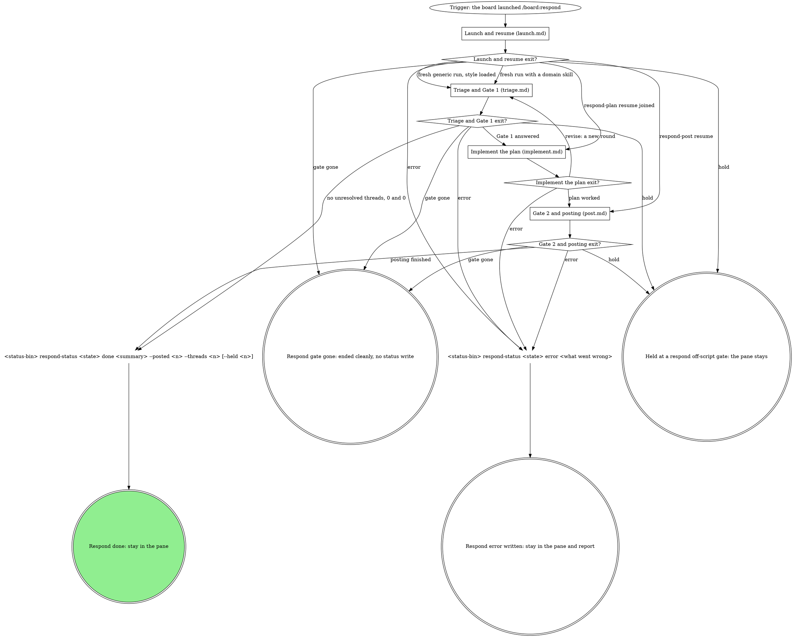
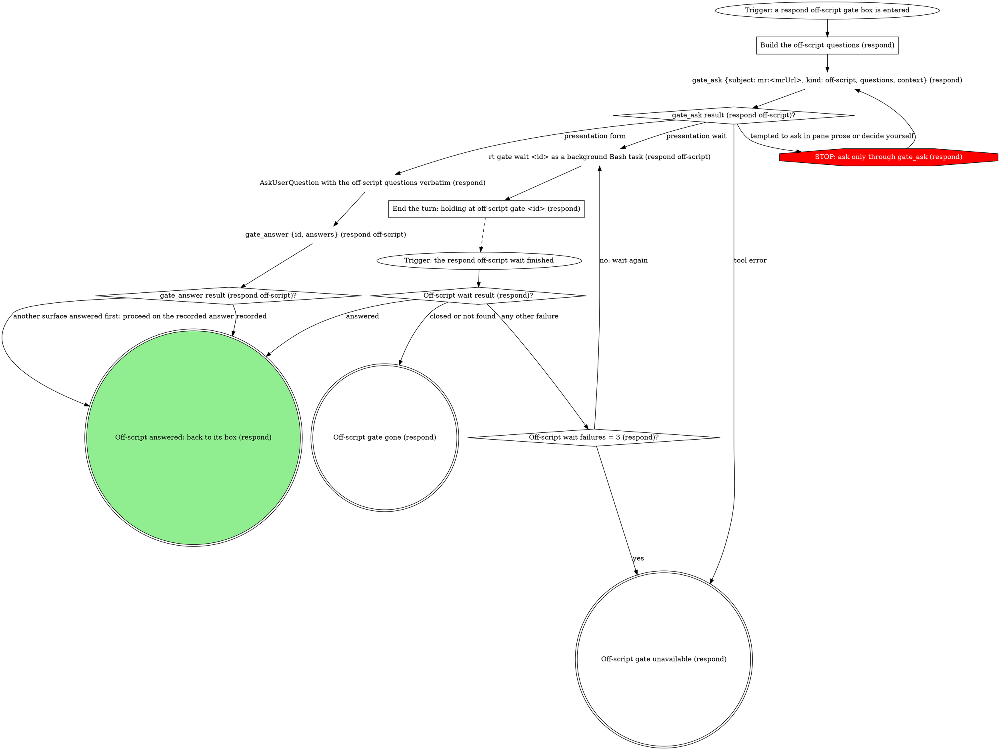

# mr-board respond runner

The mr-board spawned this pane to process the review feedback on ONE of your own
MRs and report status back to the board through its status CLI. A human
decides only at a gate. This wrapper carries **no** domain knowledge; the
board injects it:

| flag | meaning |
|------|---------|
| `<mrUrl>` (positional) | your merge request whose feedback to process |
| `--state <handle>` | opaque board handle for this MR's response. Pass it verbatim to `--status-bin` and the `gate` verbs; never read, stat, or write it. It looks like a `.json` path but no such file exists: board state lives in the board's database, and the path is only a key. Its absence on disk says nothing about whether the board is tracking this pass. |
| `--status-bin <path>` | absolute path to the board's status-writer CLI |
| `--report <path>` | where the fill saves the adjudication table and drafted/finalized replies; a resumed pane posts from it |
| `--skill <name>` | the domain skill that owns the actual work (optional) |
| `--skill-path <path>` | absolute path to that skill's SKILL.md, when the board already resolved it (optional; see "Resolving the domain skill") |
| `--resumed-gate <gateId>` | this invocation is a parked-gate resume, not a fresh run (optional; see "Resumed entry" in `launch.md`) |
| `--resumed-gate-kind <kind>` | the `kind` of the gate `--resumed-gate` names (e.g. `respond-post`). Present exactly when `--resumed-gate` is, and the only way to learn it: `--state` is an opaque handle and `gate wait` returns only the answer. |
| `--round <n>` | the round to delegate at, carried over from an earlier pane on this MR (recorded by the `--round` flag on `<status-bin> respond-status <state> drafting --round <n>`; see "Recover the round from --round (absent: 1)" in `launch.md`). Present on a parked-gate resume when a prior pane got as far as recording one, or on a fresh run when the board found a prior recorded round for this MR (a new run responding to a further round of review); absent means round 1, either because this is the MR's first round or because no earlier pane recorded a round. |

Write status **only** by running the injected `--status-bin`:

```
<status-bin> respond-status <state> <status> [message]
<status-bin> respond-status <state> done <message> --posted <n> --threads <n> [--held <n>]
```

The board tracks five in-flight statuses; emit each as you cross the milestone:

| Status | When to emit |
|--------|--------------|
| `triaging` | Immediately, before fetching threads. |
| `implementing` | Only after Gate 1's `code-changes` question comes back `approve`, before touching code. Skip when no threads need code changes. |
| `drafting` | When presenting the verdict table + drafted replies (before Gate 1), and again right before Gate 2 opens, on every path: after implementing, and after drafting a reply override with nothing implemented. |
| `done` | After the run finishes, zero threads included. REQUIRED: `--posted <n> --threads <n>`, plus `--held <n>` whenever a gate decision kept any reply from posting (see "Counts and the badge"). |
| `error` | Anything unrecoverable (bad MR, delegated skill failed). |

## Flow

The graph is the map: start at the trigger and take only the edges it
draws. Each stage box has its own section below the graph, which names the
stage file that holds the stage's graph and its step sections.



What the graph cannot show:

- **Thread ids.** On the generic path a thread's id is the discussion's
  `id` in the `mr_threads` result: the same string the gate option values
  carry (`reply:<threadId>`), the report rows key on, and
  `mr_reply_thread` and `mr_resolve_thread` take as `discussionId`.
- **Budgets.** Each `Fixed the <tool> call once already?` counter counts
  for the whole run, per thread for `mr_reply_thread` and
  `mr_resolve_thread`, and does not reset after an off-script iterate: a
  refusal after an iterate goes straight back to that origin's off-script
  gate, and its `Off-script rounds = 2 (...)?` counter (per thread for the
  two posting origins) bounds the loop. `Revise rounds = 3?` counts the
  `revise` answers this pane acted on; a resumed pane counts from zero.
  `Fix attempts = 3 (this thread)?` counts attempts per fix thread.
  `Resumed wait failures = 3 (respond)?` counts failing resumed waits;
  closed, not found and `no gate open` are terminal, never counted.
- **Exit messages.** `done` carries a short summary and the counts ("Counts
  and the badge"). `error` names what went wrong specifically: the bad MR,
  the refused tool with its error, the failed domain skill,
  `revise budget spent after 3 rounds; drafts kept in --report`, or the
  resumed wait's third failure. Gate gone writes no status: say so in the
  pane and stop, since whatever superseded the gate already owns this MR's
  board state.

### Launch and resume (launch.md)

The first acts of every launch: the status the entry implies, the domain
skill resolution, the writing style on the generic path, and on a parked-gate
resume the recorded answer read with `gate wait` before anything else, the
Posted already read and the join to `--report`.
Read `launch.md` now and follow its graph; its sections are there.

### Triage and Gate 1 (triage.md)

Adjudicate every unresolved human thread, through the domain skill or on the
generic path, write the verdict table and drafts to `--report`, and open Gate 1
with `<status-bin> gate open <state> --kind respond-plan` (or its fitted open
file), then wait for its answer.
Read `triage.md` now and follow its graph; its sections are there.

### Implement the plan (implement.md)

Record the Gate 1 answer, draft the reply overrides, and act on
`code-changes`: implement the fixes on `approve`, hand the plan over on
`skip`, or re-adjudicate at the next round on `revise`.
Read `implement.md` now and follow its graph; its sections are there.

### Gate 2 and posting (post.md)

When there are threads to offer, open Gate 2 with `<status-bin> gate open
<state> --kind respond-post` (or its fitted open file), push the fixes with
`git_push` after the two checks, then post and resolve as the answer picks,
the reply-only threads included.
Read `post.md` now and follow its graph; its sections are there.

## Gate step (gate-step.md)

Gate 1 and Gate 2 each take the shared gate step after their open. Its graph
and sections are in `gate-step.md`; each gate box says when to read it.

The gate step's pane forms follow `mattstack:gate-protocol`'s "Present the
in-pane gate form", "Answers are option values" and "Doorbell" sections
(an attachment of the mattstack plugin, read from this checkout: `cat ${CLAUDE_SKILL_DIR}/../../../../plugins/mattstack/attachments/gate-protocol/SKILL.md`)
for the rendering and conflict mechanics. Where it records the pane's
answer with the `gate_answer` tool, a board gate records it with
`<status-bin> gate answer <state> --answers <json> --by pane` instead.

## Off-script step

Every `respond off-script gate: ...` box takes this step. It is a daemon
gate opened with `gate_ask` on the MR's subject, not a board gate: no
`<status-bin> gate` verb touches it, and no parked resume exists for it.
The step writes no status. The box that entered reads the outcome:

- **Answered:** its outcome diamond reads `answers.action`'s value, which
  starts with `take:`, `iterate:`, `hold:` or `hand back:`. Hold ends the
  turn with the pane open and no terminal status.
- **Gone** (closed or not found): end cleanly, say so in the pane, and
  write no status.
- **Unavailable** (`gate_ask` errors, or the wait fails three times): the
  box's `gate unavailable` edge, which does what hand back does.



### Build the off-script questions (respond)

Exactly one question: id `action`, `multi: false`, its `label` the box's
situation line, and the four options the box's table gives, in order take,
iterate, hold, hand back. Each option is an object:

```json
{"value": "iterate: you fixed the cause, read the threads again (mr_threads refused)", "label": "Fixed it, read again", "description": "You fixed what refused the read and I read the threads again."}
```

`value` is spelled in full, starts with its verb, and names the proposed
move and the refused tool; `label` is 2 to 6 words; `description` is one
sentence saying what happens on that answer. Four options stay inside the
native form's per-question cap.

Call `gate_ask` with `subject: mr:<mrUrl>`, `kind: off-script`, that
question, and `context` quoting both errors verbatim (the first refusal
and the one after the fix) with the call that was refused. Never send an
empty context: a human-owned gate refuses it. Keep the result's `id` and
`presentation`. A `gate_ask` error is not itself an off-script origin: it
is `Off-script gate unavailable (respond)`.

On `form`, ask the question with AskUserQuestion verbatim (label, option
labels and descriptions), then record the pick with `gate_answer {id,
answers: {"action": "<the chosen value verbatim>"}}`, nuance in the
`{value, note}` form. A `conflict: true` result means another surface
answered first: proceed on its recorded answer and say in the pane which
answer won.

### End the turn: holding at off-script gate <id> (respond)

Launch one `rt gate wait <id>` as a background Bash task (the shell tool's
run-in-background mode; the wait is never a tool call), never a second
while one runs, and end the turn in one line: `holding at off-script gate
<id>`. The wait's completion re-invokes the pane; its last stdout is
`{"ok":true,"status":"answered","row":{...}}`, so read the answer at
`row.answer.answers.action` (a bare value or a `{value, note}` object) and
the decider at `row.answer.by`. Closed or not found is gone. Any other
failure re-runs the wait; the third failure is unavailable.

No parked resume exists for this kind: the board never replays an
off-script answer into a fresh pane, so this pane must stay to act on it.
A hold answer keeps the pane open with nothing moved and no terminal
status.

## Operator note

The launch prompt may end with a paragraph beginning `Operator note (from the
human who launched this pane):`. That is direct instruction from the human,
typed at launch time: not a flag and not part of the MR. Honor it while
processing the feedback (e.g. "push back on the naming comment", "only handle
thread 2") and pass it along to the domain skill as context. It never overrides
the status contract or either gate. A note that asks for a move the graph
marks STOP takes the off-script edge instead.

## Resolving the domain skill

The domain skill that owns the actual work comes from the first source that
answers; the order is fixed and the flow's first diamonds draw it:

1. **Explicit `--skill <name>` wins.** When the board passed it, use it and do
   not run the resolver. When the board also passed `--skill-path <path>`,
   read the SKILL.md at that absolute path directly and treat it exactly as
   the domain skill named by `--skill`.
2. **Otherwise resolve the `respond` slot** with the vendored resolver,
   `"${CLAUDE_SKILL_DIR}/scripts/resolve-args.sh"`. On exit 0, read the
   SKILL.md at `resolved.respond.path` and treat that skill exactly as if it
   had been passed via `--skill`.
3. **Otherwise degrade loudly.** On a nonzero exit, print the resolver's JSON
   `errors` verbatim in the pane. Never guess or substitute a binding; the
   script is the only enforcement point. The generic path follows.

## Gate 1 and Gate 2 shapes

**Fitted open files.** A domain skill may hand back a fitted open file for
either gate: `gate-ctx.sh fit` output whose `.questions` already have the
shape below, each thread's structured context on its question (and, for
Gate 1, the planned fix on its `fix` option). That file IS the gate: open
it with `open-gate.sh` and the gate's kind, never rebuilt, re-ordered,
trimmed or hand-edited. The script prints the same JSON line as `gate
open`, with `"contextOmitted": true` added when the daemon dropped the
question contexts, and exits with its status. A `fits: false` file is
still over the shared context budget; the script drops whole question
contexts, largest first, until it fits, so the file goes in untouched. A
Gate 2 file ends with a pane-only `next` navigation question this wrapper
does not ask; the script drops it.

**Gate 1 (`respond-plan`).** ONE single-select question per unresolved
thread, in verdict-table order, plus one `code-changes` question. A thread
question's id is `thread-<n>` by 1-based position, its label that thread's
`<file>:<line>`, and its three options carry the verb plus the thread id
VERBATIM in the value (the ids shown are placeholders; substitute the real
ones):

```json
[
  {"id": "thread-1", "label": "<file>:<line>", "multi": false,
   "context": "<this thread's reviewer comment quoted verbatim, then the drafted reply or fix summary for it>",
   "options": [{"value": "reply:<threadId>", "label": "Reply only", "description": "Post the drafted reply and change no code."},
               {"value": "fix:<threadId>", "label": "Fix the code", "description": "Implement the proposed fix, then offer its reply at Gate 2."},
               {"value": "skip:<threadId>", "label": "Skip this thread", "description": "Post nothing and change nothing for this thread."}]},
  {"id": "thread-2", "label": "<file>:<line>", "multi": false,
   "context": "<thread 2's own quote + draft>",
   "options": ["... the next thread's reply/fix/skip triple, its own id and context verbatim; one such question per thread"]},
  {"id": "code-changes", "label": "Approve the proposed code changes?", "multi": false,
   "options": [{"value": "approve", "label": "Approve the changes", "description": "Implement every thread answered fix this round."},
               {"value": "revise", "label": "Revise the proposal", "description": "Implement nothing and re-adjudicate at the next round."},
               {"value": "skip", "label": "Skip code changes", "description": "Implement nothing this round while the replies still go ahead."}]}
]
```

One question per thread keeps every question at three options, under the
native form's per-question cap, so `gate open` stamps `form` for any thread
count; never fold several threads into one multi-select. It also makes
reply, fix and skip mutually exclusive per thread by construction, so no
contradictory selection can arrive.

The thread id lives in the option VALUE, never in the question id: every
consumer of the answer (this wrapper, a `--resumed-gate` pane, the board
card, the console card) reads every `answers` key other than
`code-changes`, unwraps a `{value, note, text}` object to its `value`,
splits at the first `:`, and joins the thread id to the report row. The
`thread-<n>` id is a container; nothing keys on it.

`skip` is the no-code-changes sentinel: surfaces hide the code-changes
question until a `fix:` value is selected and submit `skip` for it while
hidden, so it must always be present in the options.

**Gate 2 (`respond-post`).** ONE multi-select question per offered thread,
in verdict-table order (a reply-only or `skip:` thread gets none). Its id
is `thread-<n>` by 1-based position among these threads, its label the
thread's `<file>:<line>`, and its two options `post:<threadId>` and
`resolve:<threadId>`, thread id VERBATIM:

```json
[
  {"id": "thread-1", "label": "<file>:<line>", "multi": true,
   "context": "<this thread's file:line, then the reply text that will post>",
   "options": [{"value": "post:<threadId>", "label": "Post this reply", "recommended": true, "description": "Post this reply to the thread."},
               {"value": "resolve:<threadId>", "label": "Resolve the thread", "recommended": true, "description": "Resolve the thread after its reply."}]},
  {"id": "thread-2", "label": "<file>:<line>", "multi": true,
   "context": "<thread 2's file:line and reply>",
   "options": [{"value": "post:<threadId>", "label": "Post this reply", "recommended": true, "description": "Post this reply to the thread."},
               {"value": "resolve:<threadId>", "label": "Resolve the thread", "description": "Resolve the thread after its reply."}]}
]
```

`post` is recommended on every offered thread; `resolve` only on a thread
whose reply finalizes a fix, so a reply override stays open for the
reviewer unless the human ticks it. Post and resolve are independent:
both, either one, or neither.

**Labels.** Option labels cap at 200 UTF-8 bytes (these sit far under it).
Keep a question label to the thread's path and line; when a path is long,
middle-truncate the path portion (keep the filename and line). Never alter
a value string.

**Byte budget.** Each thread's material rides its own question's `context`,
so every surface shows the quote and draft WITH the question it belongs
to. `--context` carries only what is shared across threads (the MR and
round, one or two lines). `--context` plus every question `context` share
one 8192 UTF-8 byte budget. Send them whole: an oversized context is
dropped loudly by the daemon, not by you, and the open's output then
carries `"contextOmitted": true`. Never pre-trim or drop a context
yourself.

**Legacy Gate 2 shape.** A Gate 2 opened before this shape (a `replies`
multi, or its `replies-1`, `replies-2`, ... chunks, of bare thread ids plus
`disposition`) still reads as it did: post the union of the selected
replies, and resolve them only on `resolve-addressed`.

## Reading answers

`gate wait`'s answered form is `{"answers": {...}, "by": "...",
"answeredAt": ...}`, keyed by that gate's own question ids: for Gate 1,
one `thread-<n>` id per unresolved thread plus `code-changes`; for Gate 2,
one `thread-<n>` id per offered thread, each an array of `post:<threadId>`
and/or `resolve:<threadId>`.

- **Thread answers.** Iterate every key other than `code-changes`, unwrap a
  `{value, note, text}` object to its `value`, and split each value at the
  first `:` into the verb and the thread id. The thread id is in the
  value; the `thread-<n>` key is never a join key.
- **`text` versus `note`.** A Gate 1 `reply:` answer's or a Gate 2
  answer's `text`, when present, is the reply to post for that thread; the
  note never is. The pane form never sends `text`.
- **Note form.** Nuance rides a `{value, note}` object, e.g.
  `{"code-changes": {"value": "approve", "note": "approve but hold off on
  thread 3"}}`. A Gate 2 thread's explicit empty array (`{"thread-2": []}`)
  is valid too, recording the decision to neither post its reply nor
  resolve it.
- **Strict membership.** Every answer value must match one of its
  question's option values exactly (gate-protocol's "Answers are option
  values"): never an index or a paraphrase.
- **`by`.** The deciding surface. Pass it on with `{plan}` and `{post}`, so
  the domain skill's decision record names who decided.

## Reply overrides

A `reply:` answer that carries `text` posts that text, note or not: the
human wrote the exact words. A `reply:` answer with no `text` is a **reply
override** when its Gate 1 card did not show its reply word for word, or
when the answer carries a `note` (in the pane form a note is the only place
a typed replacement can go).

A card did not show its reply when:

- the verdict table recommended `fix` or `skip` (the card showed a fix
  direction or nothing);
- its question context never reached the gate: the open was a `fits:
  false` file or its output flagged `contextOmitted` (then count every
  question's context as dropped);
- on a resume, `--report` carries the line `gate-1-context: dropped`
  (count every question's context as dropped).

This holds whoever answered, the pane included. An override's reply is
drafted after Gate 1, with its note when it has one, written into its row,
and the row set to `gate-1: override` (the domain skill does this on its
path). Gate 2 offers it.

## Counts and the badge

`<status-bin> respond-status <state> done "<one-line summary>" --posted <n>
--threads <n> [--held <n>]` reports what actually happened to the replies:

- `--threads` is the number of unresolved human threads the run set out to
  answer, i.e. the rows in the verdict table.
- `--posted` is how many of those actually received a posted reply: every
  thread that got a reply, i.e. each reply-only thread whose reply went up
  plus each Gate 2 thread (fixed or override) whose answer carries `post:`,
  a thread the Posted already read found up included. Resolving counts
  toward neither number.
- `--held` is how many of those deliberately got NO posted reply because a
  gate decided so: a `skip:` thread, a `fix:` thread held out under
  `code-changes: skip`, a Gate 2 thread (fixed or override) answered without
  `post:`, or a `gate-1: reply` thread an older Gate 2's answer kept down (a
  retired `replies` list that leaves it out, or an answer that names it
  without `post:`). Count a thread here only when a gate answer settled it
  without a reply going up; a thread the run simply never got to is neither
  posted nor held.
- A thread held by a failed push (`respond-post-held:`), a fix thread
  recorded unfixed, and a thread handed back at a reply refusal are
  neither posted nor held.
- A resolve refusal changes no count: a thread whose reply posted still
  counts as posted, since `--posted` counts replies. Name the unresolved
  thread in the `done` message.

The board derives the badge from these counts, so a wrong count is a wrong
badge:

| Counts | Badge |
|---|---|
| `3/3` | "replies posted" |
| `2/3` | "2 of 3 posted", and nags with a resume offer |
| `2/3 + 1 held` | "replies posted, 1 held", and finishes clean |
| `0/3` | "replies drafted, not posted" |

Omitting `--held` for a gate-held reply leaves the board offering a
pointless resume forever on a thread the human already settled. Keep the
message short, e.g. `"3 threads: 2 fixed, 1 pushback"` or `"2 threads: 1
fixed, 1 reply held per gate"`.

## Rules

- The board owns `queued`; this pane owns every status between it and the
  terminal write.
- `--state` is a handle, not a file: pass it verbatim, never read or write
  it yourself. Status goes only through `--status-bin`, and drafted and
  finalized replies only to `--report`.
- Both gates are non-negotiable. Never implement a fix or post a reply
  without the human's answer at the relevant gate (Gate 1's `reply:` for a
  reply-only thread, Gate 2 for a fixed thread or a reply override), even
  to hurry the badge to `done`. `done` follows the human's gate answers,
  not your own call: `--posted` counts what actually went up, never what
  you drafted, and `--held` counts only what a gate answer kept down.
