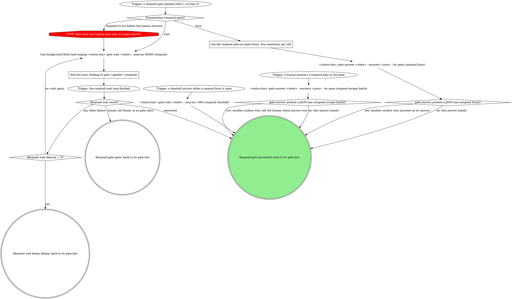
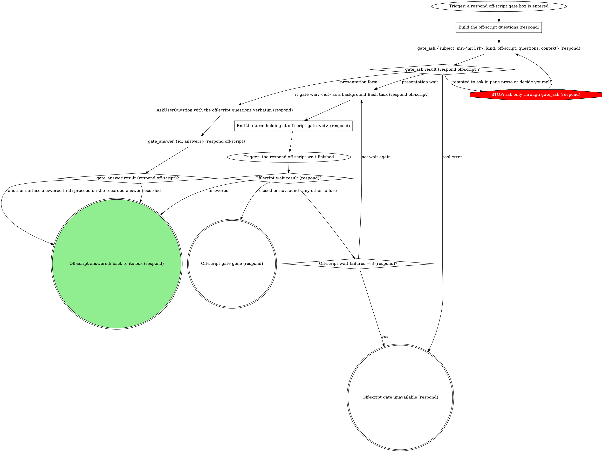

# mr-board respond runner

The mr-board spawned this pane to process the review feedback on ONE of your own
MRs and report status back to the board through its status CLI. A human
decides only at a gate. This wrapper carries **no** domain knowledge; the
board injects it:

| flag | meaning |
|------|---------|
| `<mrUrl>` (positional) | your merge request whose feedback to process |
| `--state <handle>` | opaque board handle for this MR's response. Pass it verbatim to `--status-bin` and the `gate` verbs; never read, stat, or write it. It looks like a `.json` path but no such file exists: board state lives in the board's database, and the path is only a key. Its absence on disk says nothing about whether the board is tracking this pass. |
| `--status-bin <path>` | absolute path to the board's status-writer CLI |
| `--report <path>` | where the fill saves the adjudication table and drafted/finalized replies; a resumed pane posts from it |
| `--skill <name>` | the domain skill that owns the actual work (optional) |
| `--skill-path <path>` | absolute path to that skill's SKILL.md, when the board already resolved it (optional; see "Resolving the domain skill") |
| `--resumed-gate <gateId>` | this invocation is a parked-gate resume, not a fresh run (optional; see "Resumed entry" under Flow) |
| `--resumed-gate-kind <kind>` | the `kind` of the gate `--resumed-gate` names (e.g. `respond-post`). Present exactly when `--resumed-gate` is, and the only way to learn it: `--state` is an opaque handle and `gate wait` returns only the answer. |
| `--round <n>` | the round to delegate at, carried over from an earlier pane on this MR (recorded by the `--round` flag on `<status-bin> respond-status <state> drafting --round <n>`, see "Write the verdict table and drafts to --report"). Present on a parked-gate resume when a prior pane got as far as recording one, or on a fresh run when the board found a prior recorded round for this MR (a new run responding to a further round of review); absent means round 1, either because this is the MR's first round or because no earlier pane recorded a round. |

Write status **only** by running the injected `--status-bin`:

```
<status-bin> respond-status <state> <status> [message]
<status-bin> respond-status <state> done <message> --posted <n> --threads <n> [--held <n>]
```

The board tracks five in-flight statuses; emit each as you cross the milestone:

| Status | When to emit |
|--------|--------------|
| `triaging` | Immediately, before fetching threads. |
| `implementing` | Only after Gate 1's `code-changes` question comes back `approve`, before touching code. Skip when no threads need code changes. |
| `drafting` | When presenting the verdict table + drafted replies (before Gate 1), and again right before Gate 2 opens, on every path: after implementing, and after drafting a reply override with nothing implemented. |
| `done` | After the run finishes, zero threads included. REQUIRED: `--posted <n> --threads <n>`, plus `--held <n>` whenever a gate decision kept any reply from posting (see "Counts and the badge"). |
| `error` | Anything unrecoverable (bad MR, delegated skill failed). |

## Flow

The graph is the map: start at the trigger and take only the edges it
draws. Each box has its own section below the graph.

```dot
digraph respond_flow {
    rankdir=TB;

    "Trigger: the board launched /board:respond" [shape=ellipse];
    "--resumed-gate given (respond)?" [shape=diamond];
    "--resumed-gate-kind (respond)?" [shape=diamond];
    "<status-bin> respond-status <state> implementing (resumed respond-plan)" [shape=plaintext];
    "<status-bin> respond-status <state> drafting (resumed respond-post)" [shape=plaintext];
    "<status-bin> respond-status <state> triaging" [shape=plaintext];
    "--skill given (respond)?" [shape=diamond];
    "--skill-path given (respond)?" [shape=diamond];
    "Read <--skill-path> (respond)" [shape=plaintext];
    "Load the --skill domain skill by name (respond)" [shape=box];
    "${CLAUDE_SKILL_DIR}/scripts/resolve-args.sh (respond)" [shape=plaintext];
    "resolve-args.sh exit (respond)?" [shape=diamond];
    "Read <resolved.respond.path>" [shape=plaintext];
    "Print the resolver's errors verbatim (respond)" [shape=box];
    "Which entry (respond)?" [shape=diamond];

    "Recover the round from --round (absent: 1)" [shape=box];
    "<status-bin> gate wait <state> (resumed respond gate)" [shape=plaintext];
    "Resumed wait result (respond)?" [shape=diamond];
    "Resumed wait failures = 3 (respond)?" [shape=diamond];
    "Read <--report> (resumed respond)" [shape=plaintext];
    "Domain skill resolved (respond resume)?" [shape=diamond];

    "rt_verb {args: [skills, writing-style, show]} (respond)" [shape=plaintext];
    "rt_verb named a style skill (respond)?" [shape=diamond];
    "Load the named writing-style skill (respond)" [shape=box];
    "Load the preferences.md style, else conversational (respond)" [shape=box];
    "Which entry (respond writing style)?" [shape=diamond];

    "mr_threads {mrUrl, refresh: true} (posted already)" [shape=plaintext];
    "mr_threads result (posted already)?" [shape=diamond];
    "Fixed the posted-already mr_threads call once already?" [shape=diamond];
    "Fix what the posted-already mr_threads error names" [shape=box];
    "Mark the threads that already carry this run's reply" [shape=box];
    "Resumed kind (act)?" [shape=diamond];
    "Join the plan answers to report rows by thread id" [shape=box];
    "--report carries respond-post-held (resume)?" [shape=diamond];
    "Narrow this pass to the held threads" [shape=box];

    "Domain skill resolved (respond)?" [shape=diamond];
    "Delegate adjudication to the domain skill" [shape=box];
    "Domain adjudication result?" [shape=diamond];
    "mr_view {mrUrl} (respond source branch)" [shape=plaintext];
    "mr_view result (respond)?" [shape=diamond];
    "STOP: MR reads go through mr_view (respond)" [shape=octagon style=filled fillcolor=red fontcolor=white];
    "Fixed the mr_view call once already (respond)?" [shape=diamond];
    "Fix what the mr_view error names (respond)" [shape=box];
    "mr_threads {mrUrl, refresh: true} (fetch)" [shape=plaintext];
    "mr_threads result (fetch)?" [shape=diamond];
    "STOP: threads are read with mr_threads" [shape=octagon style=filled fillcolor=red fontcolor=white];
    "Fixed the fetch mr_threads call once already?" [shape=diamond];
    "Fix what the fetch mr_threads error names" [shape=box];
    "Adjudicate each unresolved thread" [shape=box];
    "Unresolved human threads = 0?" [shape=diamond];
    "Write the verdict table and drafts to --report" [shape=box];
    "<status-bin> respond-status <state> drafting --round <n>" [shape=plaintext];

    "Fitted respond-plan open file handed back?" [shape=diamond];
    "${CLAUDE_SKILL_DIR}/scripts/open-gate.sh <status-bin> <state> respond-plan <open-file>" [shape=plaintext];
    "Build the Gate 1 questions" [shape=box];
    "<status-bin> gate open <state> --kind respond-plan --questions <json> [--context <text>]" [shape=plaintext];
    "respond-plan open exit?" [shape=diamond];
    "Gate 1 context dropped?" [shape=diamond];
    "Write gate-1-context: dropped into --report" [shape=box];
    "Gate 1: take the respond gate step" [shape=box];
    "Gate 1 step outcome?" [shape=diamond];
    "Ask Gate 1 as native forms (degraded)" [shape=box];

    "Record the Gate 1 answer in --report" [shape=box];
    "Reply overrides among the Gate 1 answers?" [shape=diamond];
    "Draft each override and mark it gate-1: override" [shape=box];
    "code-changes answer?" [shape=diamond];
    "<status-bin> respond-status <state> implementing" [shape=plaintext];
    "Domain skill resolved (approve)?" [shape=diamond];
    "Domain skill resolved (skip)?" [shape=diamond];
    "Hand {plan, by} to the domain skill" [shape=box];
    "Domain plan result (respond)?" [shape=diamond];
    "Fix threads left to implement?" [shape=diamond];
    "Implement and verify the next fix thread" [shape=box];
    "Fix verified (this thread)?" [shape=diamond];
    "Fix attempts = 3 (this thread)?" [shape=diamond];
    "Record the thread unfixed in --report" [shape=box];
    "Update --report with the finalized replies" [shape=box];
    "Revise rounds = 3?" [shape=diamond];
    "Domain skill resolved (revise)?" [shape=diamond];
    "Ask the domain skill to revise at round n+1" [shape=box];
    "Fresh adjudication table handed back?" [shape=diamond];
    "Revise the proposal yourself at round n+1" [shape=box];

    "Threads to offer at Gate 2?" [shape=diamond];
    "Domain skill resolved (reply-only)?" [shape=diamond];
    "<status-bin> respond-status <state> drafting (before Gate 2)" [shape=plaintext];
    "Fitted respond-post open file handed back?" [shape=diamond];
    "${CLAUDE_SKILL_DIR}/scripts/open-gate.sh <status-bin> <state> respond-post <open-file>" [shape=plaintext];
    "Build the Gate 2 questions" [shape=box];
    "<status-bin> gate open <state> --kind respond-post --questions <json> [--context <text>]" [shape=plaintext];
    "respond-post open exit?" [shape=diamond];
    "Gate 2: take the respond gate step" [shape=box];
    "Gate 2 step outcome?" [shape=diamond];
    "Ask Gate 2 as native forms (degraded)" [shape=box];

    "Domain skill resolved (Gate 2 act)?" [shape=diamond];
    "Hand {post, by} to the domain skill" [shape=box];
    "Domain posting result (respond)?" [shape=diamond];
    "A fixed thread picked to post or resolve?" [shape=diamond];
    "git branch --show-current" [shape=plaintext];
    "On the MR's source branch?" [shape=diamond];
    "git rev-parse --abbrev-ref @{push}" [shape=plaintext];
    "Push target is origin/<source branch>?" [shape=diamond];
    "git_push {tree: <root>}" [shape=plaintext];
    "git_push result (respond)?" [shape=diamond];
    "STOP: push only with git_push (respond)" [shape=octagon style=filled fillcolor=red fontcolor=white];
    "Fixed the git_push call once already (respond)?" [shape=diamond];
    "Fix what the git_push error names (respond)" [shape=box];
    "Hold the fixed threads: write respond-post-held into --report" [shape=box];

    "Threads left to post (respond)?" [shape=diamond];
    "Post this thread's reply?" [shape=diamond];
    "mr_reply_thread {mrUrl, discussionId, body}" [shape=plaintext];
    "mr_reply_thread result?" [shape=diamond];
    "STOP: replies post with mr_reply_thread" [shape=octagon style=filled fillcolor=red fontcolor=white];
    "Fixed the mr_reply_thread call once already?" [shape=diamond];
    "Fix what the mr_reply_thread error names" [shape=box];
    "Resolve this thread?" [shape=diamond];
    "mr_resolve_thread {mrUrl, discussionId}" [shape=plaintext];
    "mr_resolve_thread result?" [shape=diamond];
    "Fixed the mr_resolve_thread call once already?" [shape=diamond];
    "Fix what the mr_resolve_thread error names" [shape=box];
    "Held threads from a respond-post-held line posted this pass?" [shape=diamond];
    "Delete the respond-post-held line from --report" [shape=box];

    "respond off-script gate: mr_view refused" [shape=box];
    "Off-script outcome (mr_view, respond)?" [shape=diamond];
    "Off-script rounds = 2 (mr_view, respond)?" [shape=diamond];
    "respond off-script gate: mr_threads refused (fetch)" [shape=box];
    "Off-script outcome (fetch mr_threads)?" [shape=diamond];
    "Off-script rounds = 2 (fetch mr_threads)?" [shape=diamond];
    "respond off-script gate: mr_threads refused (posted already)" [shape=box];
    "Off-script outcome (posted-already mr_threads)?" [shape=diamond];
    "Off-script rounds = 2 (posted-already mr_threads)?" [shape=diamond];
    "respond off-script gate: git_push refused" [shape=box];
    "Off-script outcome (git_push, respond)?" [shape=diamond];
    "Off-script rounds = 2 (git_push, respond)?" [shape=diamond];
    "respond off-script gate: mr_reply_thread refused" [shape=box];
    "Off-script outcome (mr_reply_thread)?" [shape=diamond];
    "Off-script rounds = 2 (mr_reply_thread)?" [shape=diamond];
    "respond off-script gate: mr_resolve_thread refused" [shape=box];
    "Off-script outcome (mr_resolve_thread)?" [shape=diamond];
    "Off-script rounds = 2 (mr_resolve_thread)?" [shape=diamond];

    "<status-bin> respond-status <state> done <summary> --posted <n> --threads <n> [--held <n>]" [shape=plaintext];
    "<status-bin> respond-status <state> error <what went wrong>" [shape=plaintext];
    "Respond error written: stay in the pane and report" [shape=doublecircle];
    "Respond gate gone: ended cleanly, no status write" [shape=doublecircle];
    "Held at a respond off-script gate: the pane stays" [shape=doublecircle];
    "Respond done: stay in the pane" [shape=doublecircle style=filled fillcolor=lightgreen];

    "Trigger: the board launched /board:respond" -> "--resumed-gate given (respond)?";
    "--resumed-gate given (respond)?" -> "--resumed-gate-kind (respond)?" [label="yes"];
    "--resumed-gate given (respond)?" -> "<status-bin> respond-status <state> triaging" [label="no: a fresh run"];
    "--resumed-gate-kind (respond)?" -> "<status-bin> respond-status <state> implementing (resumed respond-plan)" [label="respond-plan"];
    "--resumed-gate-kind (respond)?" -> "<status-bin> respond-status <state> drafting (resumed respond-post)" [label="respond-post"];
    "<status-bin> respond-status <state> implementing (resumed respond-plan)" -> "--skill given (respond)?";
    "<status-bin> respond-status <state> drafting (resumed respond-post)" -> "--skill given (respond)?";
    "<status-bin> respond-status <state> triaging" -> "--skill given (respond)?";
    "--skill given (respond)?" -> "--skill-path given (respond)?" [label="yes"];
    "--skill given (respond)?" -> "${CLAUDE_SKILL_DIR}/scripts/resolve-args.sh (respond)" [label="no"];
    "--skill-path given (respond)?" -> "Read <--skill-path> (respond)" [label="yes"];
    "--skill-path given (respond)?" -> "Load the --skill domain skill by name (respond)" [label="no"];
    "Read <--skill-path> (respond)" -> "Which entry (respond)?";
    "Load the --skill domain skill by name (respond)" -> "Which entry (respond)?";
    "${CLAUDE_SKILL_DIR}/scripts/resolve-args.sh (respond)" -> "resolve-args.sh exit (respond)?";
    "resolve-args.sh exit (respond)?" -> "Read <resolved.respond.path>" [label="0"];
    "resolve-args.sh exit (respond)?" -> "Print the resolver's errors verbatim (respond)" [label="nonzero: generic path"];
    "Read <resolved.respond.path>" -> "Which entry (respond)?";
    "Print the resolver's errors verbatim (respond)" -> "Which entry (respond)?";
    "Which entry (respond)?" -> "Recover the round from --round (absent: 1)" [label="resumed gate"];
    "Which entry (respond)?" -> "Domain skill resolved (respond)?" [label="fresh run"];

    "Recover the round from --round (absent: 1)" -> "<status-bin> gate wait <state> (resumed respond gate)";
    "<status-bin> gate wait <state> (resumed respond gate)" -> "Resumed wait result (respond)?";
    "Resumed wait result (respond)?" -> "Read <--report> (resumed respond)" [label="answered"];
    "Resumed wait result (respond)?" -> "Respond gate gone: ended cleanly, no status write" [label="closed, not found, or no gate open"];
    "Resumed wait result (respond)?" -> "Resumed wait failures = 3 (respond)?" [label="any other failure"];
    "Resumed wait failures = 3 (respond)?" -> "<status-bin> gate wait <state> (resumed respond gate)" [label="no: wait again"];
    "Resumed wait failures = 3 (respond)?" -> "<status-bin> respond-status <state> error <what went wrong>" [label="yes"];
    "Read <--report> (resumed respond)" -> "Domain skill resolved (respond resume)?";
    "Domain skill resolved (respond resume)?" -> "Resumed kind (act)?" [label="yes: it runs its own Posted already read"];
    "Domain skill resolved (respond resume)?" -> "rt_verb {args: [skills, writing-style, show]} (respond)" [label="no"];

    "rt_verb {args: [skills, writing-style, show]} (respond)" -> "rt_verb named a style skill (respond)?";
    "rt_verb named a style skill (respond)?" -> "Load the named writing-style skill (respond)" [label="yes"];
    "rt_verb named a style skill (respond)?" -> "Load the preferences.md style, else conversational (respond)" [label="no: refused, failed or unavailable"];
    "Load the named writing-style skill (respond)" -> "Which entry (respond writing style)?";
    "Load the preferences.md style, else conversational (respond)" -> "Which entry (respond writing style)?";
    "Which entry (respond writing style)?" -> "mr_view {mrUrl} (respond source branch)" [label="fresh run"];
    "Which entry (respond writing style)?" -> "mr_threads {mrUrl, refresh: true} (posted already)" [label="resumed gate"];

    "mr_threads {mrUrl, refresh: true} (posted already)" -> "mr_threads result (posted already)?";
    "mr_threads result (posted already)?" -> "Mark the threads that already carry this run's reply" [label="ok"];
    "mr_threads result (posted already)?" -> "Fixed the posted-already mr_threads call once already?" [label="tool error"];
    "Fixed the posted-already mr_threads call once already?" -> "Fix what the posted-already mr_threads error names" [label="no"];
    "Fixed the posted-already mr_threads call once already?" -> "respond off-script gate: mr_threads refused (posted already)" [label="yes"];
    "Fix what the posted-already mr_threads error names" -> "mr_threads {mrUrl, refresh: true} (posted already)";
    "Mark the threads that already carry this run's reply" -> "Resumed kind (act)?";
    "Resumed kind (act)?" -> "Join the plan answers to report rows by thread id" [label="respond-plan"];
    "Resumed kind (act)?" -> "--report carries respond-post-held (resume)?" [label="respond-post"];
    "Join the plan answers to report rows by thread id" -> "Record the Gate 1 answer in --report";
    "--report carries respond-post-held (resume)?" -> "Narrow this pass to the held threads" [label="yes"];
    "--report carries respond-post-held (resume)?" -> "Domain skill resolved (Gate 2 act)?" [label="no"];
    "Narrow this pass to the held threads" -> "Domain skill resolved (Gate 2 act)?";

    "Domain skill resolved (respond)?" -> "Delegate adjudication to the domain skill" [label="yes"];
    "Domain skill resolved (respond)?" -> "rt_verb {args: [skills, writing-style, show]} (respond)" [label="no: generic path"];
    "Delegate adjudication to the domain skill" -> "Domain adjudication result?";
    "Domain adjudication result?" -> "Unresolved human threads = 0?" [label="a verdict table handed back"];
    "Domain adjudication result?" -> "<status-bin> respond-status <state> error <what went wrong>" [label="failed"];
    "mr_view {mrUrl} (respond source branch)" -> "mr_view result (respond)?";
    "mr_view result (respond)?" -> "mr_threads {mrUrl, refresh: true} (fetch)" [label="ok: keep sourceBranch"];
    "mr_view result (respond)?" -> "Fixed the mr_view call once already (respond)?" [label="tool error"];
    "mr_view result (respond)?" -> "STOP: MR reads go through mr_view (respond)" [label="tempted to read the MR with the GitLab CLI"];
    "STOP: MR reads go through mr_view (respond)" -> "mr_view {mrUrl} (respond source branch)";
    "Fixed the mr_view call once already (respond)?" -> "Fix what the mr_view error names (respond)" [label="no"];
    "Fixed the mr_view call once already (respond)?" -> "respond off-script gate: mr_view refused" [label="yes"];
    "Fix what the mr_view error names (respond)" -> "mr_view {mrUrl} (respond source branch)";
    "mr_threads {mrUrl, refresh: true} (fetch)" -> "mr_threads result (fetch)?";
    "mr_threads result (fetch)?" -> "Adjudicate each unresolved thread" [label="ok"];
    "mr_threads result (fetch)?" -> "Fixed the fetch mr_threads call once already?" [label="tool error"];
    "mr_threads result (fetch)?" -> "STOP: threads are read with mr_threads" [label="tempted to read them with the GitLab CLI"];
    "STOP: threads are read with mr_threads" -> "mr_threads {mrUrl, refresh: true} (fetch)";
    "Fixed the fetch mr_threads call once already?" -> "Fix what the fetch mr_threads error names" [label="no"];
    "Fixed the fetch mr_threads call once already?" -> "respond off-script gate: mr_threads refused (fetch)" [label="yes"];
    "Fix what the fetch mr_threads error names" -> "mr_threads {mrUrl, refresh: true} (fetch)";
    "Adjudicate each unresolved thread" -> "Unresolved human threads = 0?";
    "Unresolved human threads = 0?" -> "<status-bin> respond-status <state> done <summary> --posted <n> --threads <n> [--held <n>]" [label="yes: no unresolved threads, 0 and 0"];
    "Unresolved human threads = 0?" -> "Write the verdict table and drafts to --report" [label="no"];
    "Write the verdict table and drafts to --report" -> "<status-bin> respond-status <state> drafting --round <n>";

    "<status-bin> respond-status <state> drafting --round <n>" -> "Fitted respond-plan open file handed back?";
    "Fitted respond-plan open file handed back?" -> "${CLAUDE_SKILL_DIR}/scripts/open-gate.sh <status-bin> <state> respond-plan <open-file>" [label="yes"];
    "Fitted respond-plan open file handed back?" -> "Build the Gate 1 questions" [label="no"];
    "Build the Gate 1 questions" -> "<status-bin> gate open <state> --kind respond-plan --questions <json> [--context <text>]";
    "${CLAUDE_SKILL_DIR}/scripts/open-gate.sh <status-bin> <state> respond-plan <open-file>" -> "respond-plan open exit?";
    "<status-bin> gate open <state> --kind respond-plan --questions <json> [--context <text>]" -> "respond-plan open exit?";
    "respond-plan open exit?" -> "Gate 1 context dropped?" [label="0"];
    "respond-plan open exit?" -> "Ask Gate 1 as native forms (degraded)" [label="nonzero: the daemon is down"];
    "Gate 1 context dropped?" -> "Write gate-1-context: dropped into --report" [label="yes: fits false, contextOmitted, or dropped for the budget"];
    "Gate 1 context dropped?" -> "Gate 1: take the respond gate step" [label="no"];
    "Write gate-1-context: dropped into --report" -> "Gate 1: take the respond gate step";
    "Gate 1: take the respond gate step" -> "Gate 1 step outcome?";
    "Gate 1 step outcome?" -> "Record the Gate 1 answer in --report" [label="answered"];
    "Gate 1 step outcome?" -> "Respond gate gone: ended cleanly, no status write" [label="gate gone"];
    "Gate 1 step outcome?" -> "Ask Gate 1 as native forms (degraded)" [label="the wait keeps failing"];
    "Ask Gate 1 as native forms (degraded)" -> "Record the Gate 1 answer in --report";

    "Record the Gate 1 answer in --report" -> "Reply overrides among the Gate 1 answers?";
    "Reply overrides among the Gate 1 answers?" -> "Draft each override and mark it gate-1: override" [label="yes"];
    "Reply overrides among the Gate 1 answers?" -> "code-changes answer?" [label="no"];
    "Draft each override and mark it gate-1: override" -> "code-changes answer?";
    "code-changes answer?" -> "<status-bin> respond-status <state> implementing" [label="approve"];
    "code-changes answer?" -> "Domain skill resolved (skip)?" [label="skip, or hidden with no fix picked"];
    "code-changes answer?" -> "Revise rounds = 3?" [label="revise"];
    "<status-bin> respond-status <state> implementing" -> "Domain skill resolved (approve)?";
    "Domain skill resolved (approve)?" -> "Hand {plan, by} to the domain skill" [label="yes"];
    "Domain skill resolved (approve)?" -> "Fix threads left to implement?" [label="no"];
    "Domain skill resolved (skip)?" -> "Hand {plan, by} to the domain skill" [label="yes"];
    "Domain skill resolved (skip)?" -> "Threads to offer at Gate 2?" [label="no"];
    "Hand {plan, by} to the domain skill" -> "Domain plan result (respond)?";
    "Domain plan result (respond)?" -> "Threads to offer at Gate 2?" [label="handed back"];
    "Domain plan result (respond)?" -> "<status-bin> respond-status <state> error <what went wrong>" [label="failed"];
    "Fix threads left to implement?" -> "Implement and verify the next fix thread" [label="yes"];
    "Fix threads left to implement?" -> "Update --report with the finalized replies" [label="no"];
    "Implement and verify the next fix thread" -> "Fix verified (this thread)?";
    "Fix verified (this thread)?" -> "Fix threads left to implement?" [label="yes"];
    "Fix verified (this thread)?" -> "Fix attempts = 3 (this thread)?" [label="no"];
    "Fix attempts = 3 (this thread)?" -> "Implement and verify the next fix thread" [label="no: try again"];
    "Fix attempts = 3 (this thread)?" -> "Record the thread unfixed in --report" [label="yes"];
    "Record the thread unfixed in --report" -> "Fix threads left to implement?";
    "Update --report with the finalized replies" -> "Threads to offer at Gate 2?";
    "Revise rounds = 3?" -> "Domain skill resolved (revise)?" [label="no"];
    "Revise rounds = 3?" -> "<status-bin> respond-status <state> error <what went wrong>" [label="yes: error, drafts kept in --report"];
    "Domain skill resolved (revise)?" -> "Ask the domain skill to revise at round n+1" [label="yes"];
    "Domain skill resolved (revise)?" -> "Revise the proposal yourself at round n+1" [label="no"];
    "Ask the domain skill to revise at round n+1" -> "Fresh adjudication table handed back?";
    "Fresh adjudication table handed back?" -> "Write the verdict table and drafts to --report" [label="yes: a new round"];
    "Fresh adjudication table handed back?" -> "Domain skill resolved (skip)?" [label="no: nothing implemented this round, the skip hand-off"];
    "Revise the proposal yourself at round n+1" -> "Write the verdict table and drafts to --report";

    "Threads to offer at Gate 2?" -> "Domain skill resolved (reply-only)?" [label="none: no fixed thread, no override"];
    "Threads to offer at Gate 2?" -> "<status-bin> respond-status <state> drafting (before Gate 2)" [label="some"];
    "Domain skill resolved (reply-only)?" -> "<status-bin> respond-status <state> done <summary> --posted <n> --threads <n> [--held <n>]" [label="yes: it posted them on {plan}"];
    "Domain skill resolved (reply-only)?" -> "Threads left to post (respond)?" [label="no: post the reply-only threads"];
    "<status-bin> respond-status <state> drafting (before Gate 2)" -> "Fitted respond-post open file handed back?";
    "Fitted respond-post open file handed back?" -> "${CLAUDE_SKILL_DIR}/scripts/open-gate.sh <status-bin> <state> respond-post <open-file>" [label="yes"];
    "Fitted respond-post open file handed back?" -> "Build the Gate 2 questions" [label="no"];
    "Build the Gate 2 questions" -> "<status-bin> gate open <state> --kind respond-post --questions <json> [--context <text>]";
    "${CLAUDE_SKILL_DIR}/scripts/open-gate.sh <status-bin> <state> respond-post <open-file>" -> "respond-post open exit?";
    "<status-bin> gate open <state> --kind respond-post --questions <json> [--context <text>]" -> "respond-post open exit?";
    "respond-post open exit?" -> "Gate 2: take the respond gate step" [label="0"];
    "respond-post open exit?" -> "Ask Gate 2 as native forms (degraded)" [label="nonzero: the daemon is down"];
    "Gate 2: take the respond gate step" -> "Gate 2 step outcome?";
    "Gate 2 step outcome?" -> "Domain skill resolved (Gate 2 act)?" [label="answered"];
    "Gate 2 step outcome?" -> "Respond gate gone: ended cleanly, no status write" [label="gate gone"];
    "Gate 2 step outcome?" -> "Ask Gate 2 as native forms (degraded)" [label="the wait keeps failing"];
    "Ask Gate 2 as native forms (degraded)" -> "Domain skill resolved (Gate 2 act)?";

    "Domain skill resolved (Gate 2 act)?" -> "Hand {post, by} to the domain skill" [label="yes"];
    "Domain skill resolved (Gate 2 act)?" -> "A fixed thread picked to post or resolve?" [label="no"];
    "Hand {post, by} to the domain skill" -> "Domain posting result (respond)?";
    "Domain posting result (respond)?" -> "<status-bin> respond-status <state> done <summary> --posted <n> --threads <n> [--held <n>]" [label="posted: its counts"];
    "Domain posting result (respond)?" -> "<status-bin> respond-status <state> error <what went wrong>" [label="failed"];
    "A fixed thread picked to post or resolve?" -> "git branch --show-current" [label="yes"];
    "A fixed thread picked to post or resolve?" -> "Threads left to post (respond)?" [label="no: push nothing"];
    "git branch --show-current" -> "On the MR's source branch?";
    "On the MR's source branch?" -> "git rev-parse --abbrev-ref @{push}" [label="yes"];
    "On the MR's source branch?" -> "Hold the fixed threads: write respond-post-held into --report" [label="no, or an error: never switch branches"];
    "git rev-parse --abbrev-ref @{push}" -> "Push target is origin/<source branch>?";
    "Push target is origin/<source branch>?" -> "git_push {tree: <root>}" [label="yes"];
    "Push target is origin/<source branch>?" -> "Hold the fixed threads: write respond-post-held into --report" [label="no, or an error"];
    "git_push {tree: <root>}" -> "git_push result (respond)?";
    "git_push result (respond)?" -> "Threads left to post (respond)?" [label="ok"];
    "git_push result (respond)?" -> "Fixed the git_push call once already (respond)?" [label="refused"];
    "git_push result (respond)?" -> "STOP: push only with git_push (respond)" [label="tempted to push from the shell or force past it"];
    "STOP: push only with git_push (respond)" -> "git_push {tree: <root>}";
    "Fixed the git_push call once already (respond)?" -> "Fix what the git_push error names (respond)" [label="no"];
    "Fixed the git_push call once already (respond)?" -> "respond off-script gate: git_push refused" [label="yes"];
    "Fix what the git_push error names (respond)" -> "git_push {tree: <root>}";
    "Hold the fixed threads: write respond-post-held into --report" -> "Threads left to post (respond)?";

    "Threads left to post (respond)?" -> "Post this thread's reply?" [label="yes"];
    "Threads left to post (respond)?" -> "Held threads from a respond-post-held line posted this pass?" [label="no"];
    "Post this thread's reply?" -> "mr_reply_thread {mrUrl, discussionId, body}" [label="yes: picked post, or reply-only; not held, not posted already"];
    "Post this thread's reply?" -> "Resolve this thread?" [label="no"];
    "mr_reply_thread {mrUrl, discussionId, body}" -> "mr_reply_thread result?";
    "mr_reply_thread result?" -> "Resolve this thread?" [label="posted"];
    "mr_reply_thread result?" -> "Fixed the mr_reply_thread call once already?" [label="tool error"];
    "mr_reply_thread result?" -> "STOP: replies post with mr_reply_thread" [label="tempted to post with the GitLab CLI or the API"];
    "STOP: replies post with mr_reply_thread" -> "mr_reply_thread {mrUrl, discussionId, body}";
    "Fixed the mr_reply_thread call once already?" -> "Fix what the mr_reply_thread error names" [label="no"];
    "Fixed the mr_reply_thread call once already?" -> "respond off-script gate: mr_reply_thread refused" [label="yes"];
    "Fix what the mr_reply_thread error names" -> "mr_reply_thread {mrUrl, discussionId, body}";
    "Resolve this thread?" -> "mr_resolve_thread {mrUrl, discussionId}" [label="yes: resolve picked, not held"];
    "Resolve this thread?" -> "Threads left to post (respond)?" [label="no"];
    "mr_resolve_thread {mrUrl, discussionId}" -> "mr_resolve_thread result?";
    "mr_resolve_thread result?" -> "Threads left to post (respond)?" [label="resolved"];
    "mr_resolve_thread result?" -> "Fixed the mr_resolve_thread call once already?" [label="tool error"];
    "Fixed the mr_resolve_thread call once already?" -> "Fix what the mr_resolve_thread error names" [label="no"];
    "Fixed the mr_resolve_thread call once already?" -> "respond off-script gate: mr_resolve_thread refused" [label="yes"];
    "Fix what the mr_resolve_thread error names" -> "mr_resolve_thread {mrUrl, discussionId}";
    "Held threads from a respond-post-held line posted this pass?" -> "Delete the respond-post-held line from --report" [label="yes: its threads posted"];
    "Held threads from a respond-post-held line posted this pass?" -> "<status-bin> respond-status <state> done <summary> --posted <n> --threads <n> [--held <n>]" [label="no"];
    "Delete the respond-post-held line from --report" -> "<status-bin> respond-status <state> done <summary> --posted <n> --threads <n> [--held <n>]";

    "respond off-script gate: mr_view refused" -> "Off-script outcome (mr_view, respond)?";
    "Off-script outcome (mr_view, respond)?" -> "mr_threads {mrUrl, refresh: true} (fetch)" [label="take: the human names the source branch"];
    "Off-script outcome (mr_view, respond)?" -> "Off-script rounds = 2 (mr_view, respond)?" [label="iterate: the cause is fixed"];
    "Off-script outcome (mr_view, respond)?" -> "Held at a respond off-script gate: the pane stays" [label="hold"];
    "Off-script outcome (mr_view, respond)?" -> "mr_threads {mrUrl, refresh: true} (fetch)" [label="hand back: source branch unknown, fixed threads held"];
    "Off-script outcome (mr_view, respond)?" -> "Respond gate gone: ended cleanly, no status write" [label="gate gone"];
    "Off-script outcome (mr_view, respond)?" -> "mr_threads {mrUrl, refresh: true} (fetch)" [label="gate unavailable: source branch unknown, fixed threads held"];
    "Off-script rounds = 2 (mr_view, respond)?" -> "mr_view {mrUrl} (respond source branch)" [label="no: read again"];
    "Off-script rounds = 2 (mr_view, respond)?" -> "mr_threads {mrUrl, refresh: true} (fetch)" [label="yes: source branch unknown, fixed threads held"];

    "respond off-script gate: mr_threads refused (fetch)" -> "Off-script outcome (fetch mr_threads)?";
    "Off-script outcome (fetch mr_threads)?" -> "Adjudicate each unresolved thread" [label="take: the human supplies the threads"];
    "Off-script outcome (fetch mr_threads)?" -> "Off-script rounds = 2 (fetch mr_threads)?" [label="iterate: the cause is fixed"];
    "Off-script outcome (fetch mr_threads)?" -> "Held at a respond off-script gate: the pane stays" [label="hold"];
    "Off-script outcome (fetch mr_threads)?" -> "<status-bin> respond-status <state> error <what went wrong>" [label="hand back"];
    "Off-script outcome (fetch mr_threads)?" -> "Respond gate gone: ended cleanly, no status write" [label="gate gone"];
    "Off-script outcome (fetch mr_threads)?" -> "<status-bin> respond-status <state> error <what went wrong>" [label="gate unavailable"];
    "Off-script rounds = 2 (fetch mr_threads)?" -> "mr_threads {mrUrl, refresh: true} (fetch)" [label="no: read again"];
    "Off-script rounds = 2 (fetch mr_threads)?" -> "<status-bin> respond-status <state> error <what went wrong>" [label="yes: the refusals are the reason"];

    "respond off-script gate: mr_threads refused (posted already)" -> "Off-script outcome (posted-already mr_threads)?";
    "Off-script outcome (posted-already mr_threads)?" -> "Mark the threads that already carry this run's reply" [label="take: the human names the threads already answered"];
    "Off-script outcome (posted-already mr_threads)?" -> "Off-script rounds = 2 (posted-already mr_threads)?" [label="iterate: the cause is fixed"];
    "Off-script outcome (posted-already mr_threads)?" -> "Held at a respond off-script gate: the pane stays" [label="hold"];
    "Off-script outcome (posted-already mr_threads)?" -> "<status-bin> respond-status <state> error <what went wrong>" [label="hand back"];
    "Off-script outcome (posted-already mr_threads)?" -> "Respond gate gone: ended cleanly, no status write" [label="gate gone"];
    "Off-script outcome (posted-already mr_threads)?" -> "<status-bin> respond-status <state> error <what went wrong>" [label="gate unavailable"];
    "Off-script rounds = 2 (posted-already mr_threads)?" -> "mr_threads {mrUrl, refresh: true} (posted already)" [label="no: read again"];
    "Off-script rounds = 2 (posted-already mr_threads)?" -> "<status-bin> respond-status <state> error <what went wrong>" [label="yes: the refusals are the reason"];

    "respond off-script gate: git_push refused" -> "Off-script outcome (git_push, respond)?";
    "Off-script outcome (git_push, respond)?" -> "Threads left to post (respond)?" [label="take: the human pushed"];
    "Off-script outcome (git_push, respond)?" -> "Off-script rounds = 2 (git_push, respond)?" [label="iterate: the cause is fixed"];
    "Off-script outcome (git_push, respond)?" -> "Held at a respond off-script gate: the pane stays" [label="hold"];
    "Off-script outcome (git_push, respond)?" -> "Hold the fixed threads: write respond-post-held into --report" [label="hand back"];
    "Off-script outcome (git_push, respond)?" -> "Respond gate gone: ended cleanly, no status write" [label="gate gone"];
    "Off-script outcome (git_push, respond)?" -> "Hold the fixed threads: write respond-post-held into --report" [label="gate unavailable"];
    "Off-script rounds = 2 (git_push, respond)?" -> "git branch --show-current" [label="no: check the target, push again"];
    "Off-script rounds = 2 (git_push, respond)?" -> "Hold the fixed threads: write respond-post-held into --report" [label="yes"];

    "respond off-script gate: mr_reply_thread refused" -> "Off-script outcome (mr_reply_thread)?";
    "Off-script outcome (mr_reply_thread)?" -> "Resolve this thread?" [label="take: the human posted it"];
    "Off-script outcome (mr_reply_thread)?" -> "Off-script rounds = 2 (mr_reply_thread)?" [label="iterate: the cause is fixed"];
    "Off-script outcome (mr_reply_thread)?" -> "Held at a respond off-script gate: the pane stays" [label="hold"];
    "Off-script outcome (mr_reply_thread)?" -> "Threads left to post (respond)?" [label="hand back: this thread stays unposted"];
    "Off-script outcome (mr_reply_thread)?" -> "Respond gate gone: ended cleanly, no status write" [label="gate gone"];
    "Off-script outcome (mr_reply_thread)?" -> "Threads left to post (respond)?" [label="gate unavailable: this thread stays unposted"];
    "Off-script rounds = 2 (mr_reply_thread)?" -> "mr_reply_thread {mrUrl, discussionId, body}" [label="no: post again"];
    "Off-script rounds = 2 (mr_reply_thread)?" -> "Threads left to post (respond)?" [label="yes: this thread stays unposted"];

    "respond off-script gate: mr_resolve_thread refused" -> "Off-script outcome (mr_resolve_thread)?";
    "Off-script outcome (mr_resolve_thread)?" -> "Threads left to post (respond)?" [label="take: the human resolved it"];
    "Off-script outcome (mr_resolve_thread)?" -> "Off-script rounds = 2 (mr_resolve_thread)?" [label="iterate: the cause is fixed"];
    "Off-script outcome (mr_resolve_thread)?" -> "Held at a respond off-script gate: the pane stays" [label="hold"];
    "Off-script outcome (mr_resolve_thread)?" -> "Threads left to post (respond)?" [label="hand back: this thread stays open"];
    "Off-script outcome (mr_resolve_thread)?" -> "Respond gate gone: ended cleanly, no status write" [label="gate gone"];
    "Off-script outcome (mr_resolve_thread)?" -> "Threads left to post (respond)?" [label="gate unavailable: this thread stays open"];
    "Off-script rounds = 2 (mr_resolve_thread)?" -> "mr_resolve_thread {mrUrl, discussionId}" [label="no: resolve again"];
    "Off-script rounds = 2 (mr_resolve_thread)?" -> "Threads left to post (respond)?" [label="yes: this thread stays open"];

    "<status-bin> respond-status <state> done <summary> --posted <n> --threads <n> [--held <n>]" -> "Respond done: stay in the pane";
    "<status-bin> respond-status <state> error <what went wrong>" -> "Respond error written: stay in the pane and report";
}
```

What the graph cannot show:

- **Resumed entry.** `--resumed-gate <gateId>` means a human already
  answered one of the two gates an earlier pane on this MR opened, and the
  board is replaying that answer into this pane. The board's resume
  plumbing lands the state at `implementing` whichever gate resumed it, so
  the first act re-emits the status the gate's kind implies, read from
  `--resumed-gate-kind` and never guessed from context: `respond-plan`
  writes `implementing` (already correct, written anyway so a stale write
  never lingers) and `respond-post` writes `drafting` (finalized replies
  waiting to post, not code waiting to be written). Then read the parked
  answer with `gate wait` before anything else: it is
  registry-status-first, so on an answered gate it returns the recorded
  answer at once instead of blocking. Never re-adjudicate, never
  re-implement from scratch, and never run `gate open` before the parked
  answer is read: the gate lives in the rt daemon's registry, and a fresh
  open mints a new `gateId` and orphans the answer recorded against the
  old one. No node between the trigger and that wait opens a gate. Once
  the answer is read, later gates open normally: a fresh Gate 2 over the
  threads a `respond-plan` resume offers, a new Gate 1 after a `revise`, an
  off-script gate at a refusal. This invocation supersedes any earlier gate
  contract remembered in the conversation.
- **What a resumed pane carries.** From the resumed wait: `answers`, `by`
  and `answeredAt`. From `--report`: the verdict rows keyed by thread id
  (each row's recommendation, `gate-1` field and draft or finalized
  reply), the `source-branch:` line, and any `gate-1-context: dropped` or
  `respond-post-held:` line. From the launch: `--round`. Nothing else
  survives the earlier pane. On a `respond-post` resume, the Gate 2
  threads and their finalized replies come from `--report` and the picks
  from the resumed wait; a thread answer's `text` replaces that thread's
  report reply.
- **Thread ids.** On the generic path a thread's id is the discussion's
  `id` in the `mr_threads` result: the same string the gate option values
  carry (`reply:<threadId>`), the report rows key on, and
  `mr_reply_thread` and `mr_resolve_thread` take as `discussionId`.
- **The push.** Only when Gate 2's picks post or resolve at least one
  fixed thread (a `gate-1: fix` row) does anything push; otherwise push
  nothing. Gate 2's answer is the authorization: ask nothing more. The
  MR's source branch is the `sourceBranch` that `mr_view {mrUrl} (respond
  source branch)` returns on a fresh generic run, kept in the report as
  `source-branch: <branch>`, where a resumed pane reads it; with no known
  source branch (the read refused past its off-script gate, or a report
  without the line), `On the MR's source branch?` answers `no, or an
  error` and the fixed threads are held. `<root>` is the
  absolute top level of the checkout this pane runs in (the board's
  configured respond checkout), where the generic path commits its fixes
  and where both git checks read; a resumed pane launches in the same
  checkout and finds the same root. `git_push` pushes exactly the current
  branch as one ref to its same-named upstream, so no other ref can go up
  with it. Never switch branches, force, rebase or merge to make a check
  pass.
- **Posting.** `Threads left to post (respond)?` walks the Gate 2 threads
  in verdict order, then each reply-only thread (a `gate-1: reply` row)
  that Gate 2 neither offered nor named; a `respond-post-held:` resume
  walks only the listed threads. A picked `post:` posts the answer's
  `text` when it carries one, else the report's finalized reply; a
  reply-only thread posts the reply its row records (Gate 1's `text` when
  present, the draft otherwise) and is never resolved, so the reviewer can
  answer. `resolve:` runs after the reply when both are picked. An empty
  array leaves the thread untouched. A held thread posts and resolves
  nothing. A thread marked posted already never posts its reply again,
  though its `resolve:` pick still runs. When Gate 2 offered a `gate-1:
  reply` thread, or an answer value names one (a gate opened before this
  rule), that thread's answer decides it instead, an empty array included,
  and no reply posts twice.
- **Budgets.** Each `Fixed the <tool> call once already?` counter counts
  for the whole run, per thread for `mr_reply_thread` and
  `mr_resolve_thread`, and does not reset after an off-script iterate: a
  refusal after an iterate goes straight back to that origin's off-script
  gate, and its `Off-script rounds = 2 (...)?` counter (per thread for the
  two posting origins) bounds the loop. `Revise rounds = 3?` counts the
  `revise` answers this pane acted on; a resumed pane counts from zero.
  `Fix attempts = 3 (this thread)?` counts attempts per fix thread.
  `Resumed wait failures = 3 (respond)?` counts failing resumed waits;
  closed, not found and `no gate open` are terminal, never counted.
- **Exit messages.** `done` carries a short summary and the counts ("Counts
  and the badge"). `error` names what went wrong specifically: the bad MR,
  the refused tool with its error, the failed domain skill,
  `revise budget spent after 3 rounds; drafts kept in --report`, or the
  resumed wait's third failure. Gate gone writes no status: say so in the
  pane and stop, since whatever superseded the gate already owns this MR's
  board state.

### Load the --skill domain skill by name (respond)

The board passed `--skill <name>` without `--skill-path`: load that skill
by name and treat it as the domain skill. The resolver does not run. When
`--skill-path` is also given, `Read <--skill-path> (respond)` reads the
SKILL.md at that absolute path instead, and it is the same domain skill.

### Print the resolver's errors verbatim (respond)

The resolver exited nonzero. Print its JSON `errors` verbatim in the pane.
Never guess or substitute a binding: the script is the only enforcement
point. The run continues on the generic path: every `Domain skill resolved
(...)?` diamond answers no.

### Recover the round from --round (absent: 1)

Read `--round <n>`; absent means round 1. This pane's conversation has no
memory of the round an earlier pane was on, so the flag is the only way to
know it. It is the current round for everything after: the round the
domain skill hears when handed the resumed answer, and the base for round
`n+1` on a further `revise`, recorded as `<status-bin> respond-status
<state> drafting --round <n+1>` before that round's Gate 1 opens.

### Load the named writing-style skill (respond)

`rt_verb` answered with the resolved style skill in its `skill` field.
Load that skill before drafting anything: compose in its voice from the
first word, never as a pass over a finished draft. It governs every reply
this pane drafts, reply overrides and finalized fix replies included.

### Load the preferences.md style, else conversational (respond)

`rt_verb` is unavailable, refused, or failed. Read
`~/.mattstack/user/skills/preferences.md` with the Read tool and load the
skill its `writing-style:` line names, if it has one. If the line is
missing, or that skill will not load, load
`mattstack:writing-style-conversational`. The load still comes before the
first drafted word. This fallback chain is the defined path, not an
off-script origin.

### Fix what the posted-already mr_threads error names

`mr_threads` refused its input on the Posted already read. Correct what
the error names (`mrUrl` the MR's https URL,
`.../-/merge_requests/<iid>`, whose project is registered with rt;
`refresh` a boolean) and read again, once. An error that names no input
(the daemon down, a GitLab fetch failure) has nothing to correct: read
again unchanged, once, and the off-script gate follows. An error is never
a reason to skip the read and post anyway: a reply posted twice is what
this read prevents.

### Mark the threads that already carry this run's reply

The Posted already rule. Before any reply posts on this resume, or a fresh
Gate 2 offers a thread, read each thread this pass could post (Gate 2's
threads and the reply-only rows) in the `mr_threads` result, its full note
chain. A thread already carries this run's reply when it holds either:

- a note whose text is the reply due to post, or
- any note by the account this pane posts as, dated after the resumed
  gate's `answeredAt` (from the resumed wait).

Such a thread is posted: it counts toward `--posted`, it is never offered
at a fresh Gate 2, and its reply is never posted again, whatever
`--report` says of it, though a `resolve:` pick on it still runs. Keep the
list of these thread ids for the posting walk and the counts. One read
covers every thread. After an off-script take, the threads the human names
are the list.

With a domain skill this box never runs: the domain skill runs its own
Posted already read when told the pass is a resume, and hands back which
replies posted, the ones it found already up included.

### Join the plan answers to report rows by thread id

A `respond-plan` resume: the resumed wait's `answers` are Gate 1's plan,
and they select among the report's threads. Join each answer to its report
row by the thread id inside the option VALUE: every `answers` key other
than `code-changes` holds one `<verb>:<threadId>`, or a `{value, note,
text}` object around it; unwrap `value` first, then split at the first
`:` ("Reading answers"). Never join by the `thread-<n>` question id, which
is only a container. A report carrying the line `gate-1-context: dropped`
counts every question's context as dropped, so every `reply:` answer with
no `text` is a reply override ("Reply overrides"). An answer whose thread
id has no report row is named in the pane and counts neither posted nor
held.

The joined answers continue at `Record the Gate 1 answer in --report`,
exactly as a fresh Gate 1 answer does: Gate 2 opens fresh over only the
threads `Threads to offer at Gate 2?` finds (even with nothing
implemented, such as `code-changes: skip` with a reply override), and the
reply-only threads post as the posting walk says.

### Narrow this pass to the held threads

A `respond-post` resume whose report carries `respond-post-held:
<threadId>[, <threadId>...]`: an earlier pass posted every other reply and
held these fixed threads when its push failed. This pass acts only on the
listed threads: the push checks and `git_push` run for them, then they
post and resolve as the resumed Gate 2 answer picks. Every other reply
already went up. With a domain skill, hand it the narrowed list with
`{post, by}`. On the generic path, once the listed threads post, `Delete
the respond-post-held line from --report` removes the line.

### Delegate adjudication to the domain skill

If a rule in the domain skill asks for a move this graph marks STOP, take the off-script edge instead.

Tell the domain skill these four things:

- the MR url;
- the `--report <path>`;
- the round: `1` on the first delegation, one more for each `revise`
  re-adjudication, unless this launch carries `--round <n>` (a fresh run
  the board started for an MR with a prior recorded round, such as a
  further round of review), in which case `<n>` is this run's round;
- that this wrapper owns both gates, so it opens neither: it hands back
  instead, including the path of each fitted open file it builds.

Pass the operator note along as context when the launch carries one.

The domain skill owns the real work: resolving the MR and ticket, fetching
the unresolved human threads, adjudicating each one, drafting replies and
proposed fixes, and writing `--report` with the thread ids verbatim as row
keys. It hands back the adjudication: a verdict table (one row per thread,
with its recommended reply, fix or skip), whether it proposes code
changes, and the absolute path of a fitted Gate 1 open file when it built
one. It never presents a gate or decides what gets implemented or posted.
A verdict table with no rows is zero unresolved threads. A failure it
reports is `error` with its message.

### Fix what the mr_view error names (respond)

`mr_view` refused its input. Correct what the error names (`mrUrl` the
MR's https URL, `.../-/merge_requests/<iid>`, whose project is registered
with rt; `maxAgeMs` a number when you pass it) and read again, once. An
error that names no input (the MR is not in the daemon's cache, the repo
is not registered with rt) has nothing to correct: read again unchanged,
once, and the off-script gate follows. An error is never a reason to read
the MR with the GitLab CLI.

### Fix what the fetch mr_threads error names

`mr_threads` refused its input on the fetch. Correct what the error names
(`mrUrl` the MR's https URL, `.../-/merge_requests/<iid>`, whose project
is registered with rt; `refresh` a boolean) and read again, once. An
error that names no input (the daemon down, a GitLab fetch failure) has
nothing to correct: read again unchanged, once, and the off-script gate
follows. An error is never a reason to read the threads with the GitLab
CLI or the API.

### Adjudicate each unresolved thread

The generic path, in the loaded voice. The MR record `mr_view` returned
gives the title and description for context. From the `mr_threads`
result keep the unresolved threads a human opened: no resolved threads,
no system notes, no bot threads.

Judge each thread on its merits and pick one verdict:

- **fix:** the reviewer is right and the code should change. Draft the fix
  direction for the card and the reply that will post once it lands.
- **reply:** answer, explain or push back with no code change. Draft the
  exact reply.
- **skip:** nothing to say and nothing to change.

Honor the operator note (for example "push back on the naming comment",
"only handle thread 2"). Zero unresolved threads is not an error:
`Unresolved human threads = 0?` writes `done "no unresolved threads"
--posted 0 --threads 0` and neither gate opens.

### Write the verdict table and drafts to --report

Before Gate 1 opens, `--report <path>` holds, as Markdown:

- a `source-branch: <branch>` line (generic path, when `mr_view` gave it);
- the verdict table: one row per unresolved thread in verdict order, keyed
  by its thread id VERBATIM (the same `<threadId>` the gate's
  `reply:<threadId>`, `fix:<threadId>` and `skip:<threadId>` values carry),
  with its `<file>:<line>`, the recommendation, and the drafted reply or
  fix direction.

A resumed pane has no other way to recover them once this pane's session
ends, and it joins the gate's answers to the rows by that key. Whoever
produces the adjudication writes the file: on the domain path the domain
skill wrote it, so confirm it holds the table and drafts keyed by thread
id and write only what is missing. On a new round after `revise`, replace
the table and drafts and drop any earlier `gate-1-context: dropped` line;
the new Gate 1 records its own.

### Build the Gate 1 questions

No fitted open file came back, so build Gate 1 yourself: one single-select
question per unresolved thread, in verdict-table order, plus one
`code-changes` question, exactly as "Gate 1 and Gate 2 shapes" draws them.
Each thread's reviewer quote and draft ride its own question's `context`;
`--context` carries only the shared frame (the MR and the round, one or
two lines). Apply the byte budget there before opening, dropping whole
question contexts first and noting each one you drop: any drop is
`Gate 1 context dropped?` answering yes. The open prints one JSON line
(see "Gate step"); keep `gateId` and `presentation`.

### Write gate-1-context: dropped into --report

The open came from a `fits: false` file, its output carried `"contextOmitted":
true`, or you dropped a question context for the byte budget. Write one
line, `gate-1-context: dropped`, into `--report` right after the open and
before waiting on any answer. A resumed pane has no other way to know
those cards never showed their drafts, and the line turns every `reply:`
answer with no `text` into a reply override.

### Gate 1: take the respond gate step

Take "Gate step" with Gate 1's `gateId` and `presentation`. Its outcome
comes back here: answered (the answers and `by`, from the pane form's
`gate answer`, its CAS-loss line, or the wait), gate gone (end cleanly with
no status write), or the wait keeps failing (the degraded native forms).
Nothing is implemented and no reply posts before the answer.

### Ask Gate 1 as native forms (degraded)

The daemon is down at open time (`gate open` or `open-gate.sh` exits
nonzero), or the wait failed three times. Present Gate 1 as native forms
alone, chunked exactly as the form branch does: the thread questions in
order, up to four per call, then `code-changes` in one more call only when
some thread's answer is a `fix:` value, otherwise fill `code-changes:
"skip"` without asking. Proceed on the combined answers with `by: pane`.
When the daemon is down the PreToolUse hook allows the native form.

### Record the Gate 1 answer in --report

Read each thread's disposition off its answer value (`reply:<id>`,
`fix:<id>` or `skip:<id>`, per "Reading answers") and the `code-changes`
answer, which decides whether anything is implemented this round. Each
row gains a `gate-1` field: `reply`, `fix` or `skip` (a reply override
turns into `override` at the next box). A `reply:` answer's `text`, when
present, replaces the draft in its row. Posting, a resume included, reads
which threads are reply-only (`gate-1: reply`) from these rows, never from
the recommendation.

On the domain path the domain skill writes these fields when it is handed
`{plan, by}`; here, read the answer only.

### Draft each override and mark it gate-1: override

For each reply override ("Reply overrides"), draft its reply after Gate 1
in the loaded voice, folding in its note when it has one, write that reply
into its row, and set the row to `gate-1: override`. On the domain path
the domain skill drafts and records overrides when handed `{plan, by}`.
Gate 2 offers every override: the human has not yet seen its words.

### Hand {plan, by} to the domain skill

If a rule in the domain skill asks for a move this graph marks STOP, take the off-script edge instead.

Hand the domain skill `{plan: <answers>, by: <by>}`, the `--report` path
and the current round. `by` is the wait's own decider field, so the
domain skill's decision record names who decided instead of guessing. On
a resume, tell it this is a resume (the resumed `gateId` and
`answeredAt`), so its own Posted already rule runs.

- **`approve`:** it implements the `fix:` threads one at a time, verified,
  updates `--report` with the finalized replies, and hands back the threads
  to offer at Gate 2 plus the path of a fitted `respond-post` open file
  when it builds one. A thread it could not implement comes back unfixed:
  not offered at Gate 2, counted neither posted nor held.
- **`skip`:** nothing is implemented; it hands back the reply overrides to
  offer at Gate 2, with a fitted open file when it builds one.
- **Nothing to offer.** On either answer, when no fixed thread and no
  reply override is left for Gate 2, it posts the reply-only threads on
  `{plan}` and hands back which posted and its counts, with no Gate 2
  file; post nothing yourself.

It records the Gate 1 answer and drafts overrides in `--report` itself.
`Domain plan result (respond)?` reads what comes back: anything above is
`handed back`; a failure it reports (it could not work the plan at all) is
`failed`, which writes `error` with its message.

### Implement and verify the next fix thread

The generic path under `code-changes: approve`. Take the next `fix:`
thread in verdict order and make the change its fix direction describes,
in the checkout at `<root>`, on the branch it is on: never switch
branches here, since the push check decides whether the fix can go up.
Verify it: the change answers the reviewer's point and the repo's checks
for the touched code (tests, types, lint) pass. Commit the verified change
with a message naming the thread's `<file>:<line>`. A failed verification
is one attempt; fix what failed and try again.

### Record the thread unfixed in --report

Three attempts on this thread failed verification. Revert the attempt so
no half-applied change stays in the checkout, and mark its row `unfixed`
with one line naming the check that kept failing. It gets no finalized
reply, is never offered at Gate 2, and counts neither posted nor held.
Name it in the `done` summary.

### Update --report with the finalized replies

Every fix is implemented or recorded unfixed. Rewrite each fixed thread's
reply to what will actually post, e.g. `"Fixed: src/cart.ts:40"`. Before
Gate 2 opens, the report holds what will post, never the earlier draft.

### Ask the domain skill to revise at round n+1

If a rule in the domain skill asks for a move this graph marks STOP, take the off-script edge instead.

`code-changes: revise`, under the budget. Nothing is implemented this
round. Tell the domain skill the next round number (the current round
plus one; on a resume, the current round is the recovered one) and hand it
the Gate 1 answers with their notes: the revise note is the human's steer.
A fresh adjudication table it hands back is a new round: the report is
rewritten for it, `drafting --round <n+1>` records it through the drafting
node on the loop, and a new `respond-plan` Gate 1 opens, from its fresh
open file when it hands one back. No fresh table means nothing changed
this round: the edge goes to `Domain skill resolved (skip)?` and takes the
skip branch's hand-off, so `Hand {plan, by} to the domain skill` hands it
the Gate 1 answers with nothing to implement, and it records them, drafts
any overrides and, when Gate 2 has nothing to offer, posts the reply-only
threads.

### Revise the proposal yourself at round n+1

The generic path under `code-changes: revise`. Nothing is implemented this
round. Re-adjudicate with the Gate 1 answers and their notes as the
human's steer, redraft in the loaded voice, and continue at the report
write, which records round `n+1` through `drafting --round <n+1>` before
the new Gate 1 opens.

### Build the Gate 2 questions

No fitted open file came back, so build Gate 2 yourself from the finalized
replies: one multi-select question per offered thread (each fixed thread
and each reply override, in verdict-table order; never a reply-only,
`skip:`, unfixed or posted-already thread), exactly as "Gate 1 and Gate 2
shapes" draws them. Each thread's `<file>:<line>` and finalized reply ride
its own question's `context`; `--context` carries only the shared frame,
under the same byte budget. The open prints one JSON line (see "Gate
step"); keep `gateId` and `presentation`.

### Gate 2: take the respond gate step

Take "Gate step" with Gate 2's `gateId` and `presentation`. Its outcome
comes back here: answered, gate gone (end cleanly with no status write),
or the wait keeps failing (the degraded native forms). The reply-only
threads wait for this answer too, then post with its picks.

### Ask Gate 2 as native forms (degraded)

The daemon is down at open time, or the wait failed three times. Present
Gate 2 as native forms alone, chunked exactly as the form branch does: its
thread questions in order, up to four per call, each a multi-select of
post and resolve. Proceed on the combined answers with `by: pane`.

### Hand {post, by} to the domain skill

If a rule in the domain skill asks for a move this graph marks STOP, take the off-script edge instead.

Hand the domain skill `{post: <answers>, by: <by>}`, the `--report` path
and the round, so it executes the posting, the reply-only threads
included (unresolved). On a resume, tell it this is a resume, so its own
Posted already rule runs, and hand it the narrowed list when the report
carried `respond-post-held:`. Its push before any Fixed reply runs only
after the source-branch and push-target checks, only with `git_push
{tree: <root>}`, never from the shell; a failed check or a refused push
holds those fixed threads and every other reply posts. It hands back
which replies posted (the ones already up included), which it held, and
its counts; a failure is `error` with its message.

### Fix what the git_push error names (respond)

`git_push` refused. Correct what the error names: `tree` must be the
absolute top level of a checkout or worktree registered with rt (`git
rev-parse --show-toplevel` in this pane's checkout prints it), never a
subdirectory. A refusal about the branch itself (a detached HEAD, a
protected or default branch, no upstream, an upstream with a different
branch name) has nothing to correct in the call: push again unchanged,
once, and the off-script gate follows. Never add `forceWithLease` or
`setUpstream` to get past a refusal.

### Hold the fixed threads: write respond-post-held into --report

A push check failed (not on the source branch, a push target other than
`origin/<source branch>`, an error, or no known source branch), or the
`git_push` off-script gate handed back. Post and resolve none of the fixed
threads Gate 2 picked, report the mismatch or the refusal verbatim in the
pane, and never force, rebase, merge or switch branches past it. Write one
line, `respond-post-held: <threadId>[, <threadId>...]`, into `--report`,
replacing any earlier one. Every other reply still posts as decided. The
run still marks `done`, counting each held thread as neither posted nor
held: that partial badge is what leaves the run open, since the board then
offers a resume, and the resume acts only on the listed threads.

### Fix what the mr_reply_thread error names

`mr_reply_thread` refused. Correct what the error names: `mrUrl` the MR's
https URL, `discussionId` the thread id from its report row exactly as
`mr_threads` gave it, `body` the non-empty reply text. A "discussion not
found" error with the id already matching the row, or an error that names
no input, has nothing to correct: post again unchanged, once, and the
off-script gate follows. An error is never a reason to post with the
GitLab CLI or the API.

### Fix what the mr_resolve_thread error names

`mr_resolve_thread` refused. Correct what the error names: `mrUrl` the
MR's https URL, `discussionId` the thread id from its report row exactly
as `mr_threads` gave it. An error that names no input has nothing to
correct: resolve again unchanged, once, and the off-script gate follows.
An error is never a reason to resolve with the GitLab CLI or the API.

### Delete the respond-post-held line from --report

This pass posted the threads a `respond-post-held:` line listed: the push
went up and their replies posted. Delete the line from `--report`, so a
later resume never acts on those threads again.

### respond off-script gate: mr_view refused

Take "Off-script step" with this question. Label: `mr_view refused twice
on !<iid>: <second error>`. Context: both `mr_view` errors, quoted, and
that the push check needs the MR's source branch.

| Value | Label | Description |
|---|---|---|
| `take: you tell me the MR's source branch (mr_view refused)` | Tell me the branch | You name the MR's source branch and I use it for the push check. |
| `iterate: you fixed the cause, read the MR again (mr_view refused)` | Fixed it, read again | You fixed what refused the read and I read the MR again. |
| `hold: keep this pane open with nothing moved (mr_view refused)` | Hold this pane | I stop before reading the threads and the pane stays open. |
| `hand back: carry on without the source branch, fixed replies held (mr_view refused)` | Carry on without it | I carry on without the branch and hold any fixed thread at the push. |

A take keeps the branch the human names as the source branch. Iterate
passes `Off-script rounds = 2 (mr_view, respond)?` before reading again.
Hand back, gate unavailable and a spent round budget carry on to
`mr_threads` with the source branch unknown: the report gets no
`source-branch:` line, and the push check later holds every fixed thread
rather than pushing it.

### respond off-script gate: mr_threads refused (fetch)

Take "Off-script step" with this question. Label: `mr_threads refused
twice on !<iid>: <second error>`. Context: both `mr_threads` errors,
quoted.

| Value | Label | Description |
|---|---|---|
| `take: you paste the unresolved threads with their discussion ids (mr_threads refused)` | Paste the threads | You paste each unresolved thread with its discussion id and I adjudicate them. |
| `iterate: you fixed the cause, read the threads again (mr_threads refused)` | Fixed it, read again | You fixed what refused the read and I read the threads again. |
| `hold: keep this pane open with nothing moved (mr_threads refused)` | Hold this pane | I stop before adjudicating and the pane stays open. |
| `hand back: write an error naming the refusal (mr_threads refused)` | Hand it back | I write an error naming the refusal and you take over. |

A take adjudicates the threads the human pasted, keyed by the discussion
ids they give. Iterate passes `Off-script rounds = 2 (fetch mr_threads)?`
before reading again. Hand back, gate unavailable and a spent round budget
write `error` naming the refusal.

### respond off-script gate: mr_threads refused (posted already)

Take "Off-script step" with this question. Label: `mr_threads refused
twice on the Posted already read for !<iid>: <second error>`. Context:
both `mr_threads` errors, quoted, and the thread ids this pass could post.

| Value | Label | Description |
|---|---|---|
| `take: you name the threads that already carry this run's reply (mr_threads refused on the Posted already read)` | Name answered threads | You name the threads already answered and I post only the rest. |
| `iterate: you fixed the cause, read the threads again (mr_threads refused on the Posted already read)` | Fixed it, read again | You fixed what refused the read and I read the threads again. |
| `hold: keep this pane open with nothing posted (mr_threads refused on the Posted already read)` | Hold this pane | I stop before posting anything and the pane stays open. |
| `hand back: write an error naming the refusal, nothing posted (mr_threads refused on the Posted already read)` | Hand it back | I write an error naming the refusal and post nothing. |

A take marks exactly the threads the human names as posted already.
Iterate passes `Off-script rounds = 2 (posted-already mr_threads)?`
before reading again. Hand back, gate unavailable and a spent round
budget write `error` naming the refusal; no reply posts unchecked.

### respond off-script gate: git_push refused

Take "Off-script step" with this question. Label: `push of <branch> refused
on !<iid>: <second refusal>`. Context: both `git_push` refusals, quoted,
with the branch, `<root>` and the fixed thread ids waiting on the push.

| Value | Label | Description |
|---|---|---|
| `take: you push <branch> yourself, then I post the fixed replies (git_push refused)` | Push it yourself | You push the fixed commits and I post their replies. |
| `iterate: you fixed the cause, check the target and push again with git_push (git_push refused)` | Fixed it, push again | You fixed what refused the push and I check the target and push again. |
| `hold: keep this pane open with the fixes unpushed and nothing posted (git_push refused)` | Hold this pane | I stop with the fixes unpushed and no reply posted. |
| `hand back: hold the fixed threads and post the other replies (git_push refused)` | Hold the fixed replies | I hold the fixed threads unposted and post every other reply. |

A take continues to the posting walk as if the push went up. Iterate
passes `Off-script rounds = 2 (git_push, respond)?`, then runs both push
checks again before `git_push`. Hand back, gate unavailable and a spent
round budget take the held path: `respond-post-held:` for the fixed
threads, every other reply posted.

### respond off-script gate: mr_reply_thread refused

Take "Off-script step" with this question. Label: `reply to thread
<threadId> refused twice on !<iid>: <second error>`. Context: both
`mr_reply_thread` errors, quoted, and the reply text.

| Value | Label | Description |
|---|---|---|
| `take: you post the reply to thread <threadId> yourself (mr_reply_thread refused)` | Post it yourself | You post this reply and I continue with its resolve pick and the next thread. |
| `iterate: you fixed the cause, post the reply to thread <threadId> again (mr_reply_thread refused)` | Fixed it, post again | You fixed what refused the reply and I post it again. |
| `hold: keep this pane open with the remaining replies unposted (mr_reply_thread refused)` | Hold this pane | I stop here and the replies not yet posted stay unposted. |
| `hand back: leave thread <threadId> unposted and post the rest (mr_reply_thread refused)` | Skip this reply | I leave this thread unposted and carry on with the rest. |

A take counts the reply as posted and runs the thread's `resolve:` pick.
Iterate passes `Off-script rounds = 2 (mr_reply_thread)?` for this
thread before posting again. Hand back, gate unavailable and a spent
round budget leave this thread unposted and unresolved and move to the
next thread; it counts neither posted nor held.

### respond off-script gate: mr_resolve_thread refused

Take "Off-script step" with this question. Label: `resolving thread
<threadId> refused twice on !<iid>: <second error>`. Context: both
`mr_resolve_thread` errors, quoted.

| Value | Label | Description |
|---|---|---|
| `take: you resolve thread <threadId> yourself (mr_resolve_thread refused)` | Resolve it yourself | You resolve this thread and I carry on with the next one. |
| `iterate: you fixed the cause, resolve thread <threadId> again (mr_resolve_thread refused)` | Fixed it, resolve again | You fixed what refused the resolve and I resolve it again. |
| `hold: keep this pane open with the remaining threads untouched (mr_resolve_thread refused)` | Hold this pane | I stop here and the threads not yet handled stay untouched. |
| `hand back: leave thread <threadId> open and carry on (mr_resolve_thread refused)` | Leave it open | I leave this thread unresolved and carry on with the rest. |

Iterate passes `Off-script rounds = 2 (mr_resolve_thread)?` for this
thread before resolving again. Hand back, gate unavailable and a spent
round budget leave the thread open and move to the next one. A resolve
refusal changes no count: a thread whose reply posted still counts as
posted, since `--posted` counts replies. Name the unresolved thread in the
`done` message.


## Gate step

Gate 1 (`respond-plan`) and Gate 2 (`respond-post`) each take this step
after their open. Either open, `gate open` or `open-gate.sh`, prints one
JSON line, `{"gateId": "...", "presentation": "form"}` or `"wait"`, with
`"contextOmitted": true` added when the daemon dropped the question
contexts. Keep both: `Presentation (respond gate)?` reads `presentation`,
and `End the turn: holding at gate <gateId> (respond)` names `gateId`. The
step writes no status. The gate box that entered reads the outcome:

- **Answered:** the answers and `by` go back to the box.
- **Gone** (closed, not found, or `no gate open`): end cleanly, say so in
  the pane, write neither `done` nor `error`: whatever superseded the gate
  already owns this MR's board state.
- **Wait keeps failing:** the box presents its degraded native forms.



### Ask the respond gate as pane forms, four questions per call

Read `~/Documents/GitHub/mattstack-skills/attachments/gate-protocol/SKILL.md`
(the stable source checkout, machine-local by design) with the Read tool,
and follow its "Present the in-pane gate form", "Answers are option
values" and "Doorbell" sections for the rendering and conflict mechanics.
Where it records the pane's answer with the `gate_answer` tool, a board
gate records it with `<status-bin> gate answer <state> --answers <json>
--by pane` instead.
Three things stay local: your framing and reasoning go in the pane prose
or option descriptions, never into rewritten question or option text; no
option ever folds another question's answer in; and each gate's own
chunking below.

- **Gate 1.** Each thread's form question: header `Thread <n>`; question
  text its label, a newline, its prose context, then `Reply, fix, or
  skip?`; options with the gate's labels and descriptions. The form tool
  takes at most four questions per call, so ask the thread questions in
  order, up to four per call, until every thread is asked. Then, if any
  thread's answer is a `fix:` value, ask `code-changes` in one more call;
  otherwise fill `code-changes: "skip"` without asking (the same hide rule
  the board and console cards apply).
- **Gate 2.** Each thread's form question: header `Thread <n>`; question
  text its label, a newline, its prose context, then `Post, resolve, both,
  or neither?`; a multi-select with the gate's labels and descriptions,
  four questions per call. A thread with neither picked is its question
  answered as an explicit empty array, which the daemon records.
- **One answer.** Submit exactly one `<status-bin> gate answer <state>
  --answers <json> --by pane` after the LAST call, carrying every thread
  question's answer (plus `code-changes` for Gate 1); never one per chunk.
  Each value is the chosen option's value verbatim.
- **Never `text`.** Whatever the human types in the form's free-text
  field, a full replacement reply included, rides as `note`: at Gate 1 that
  makes a `reply:` pick a reply override; at Gate 2 the report's finalized
  reply posts.
- **Fitted files.** A gate opened from a fitted file never shows its JSON
  in the form. Run the `gate-ctx.sh` the domain skill fitted it with in
  `prose` mode on the source file beside it (`sh <gate-ctx.sh> prose <
  <dir>/respond-plan.source.json`, or `respond-post.source.json` for Gate
  2), take each thread's prose context from that output, and print its
  `.context` as one pane line before the first form call. A Gate 2 prose
  line reads `<file> FIX · <sha>: <text>` or `<file> REPLY: <text>`. Leave
  Gate 2's pane-only `next` question out.
- **Another surface won.** A JSON line printed by `gate answer`, or a
  doorbell while a form still sits open, means another surface answered
  first: proceed on the winning answer, never the one you meant to submit.
  The doorbell is verify-only: read the recorded answer with `<status-bin>
  gate wait <state> --max-ms 1000`.
- **The hook.** A PreToolUse hook may deny native AskUserQuestion when no
  gate is open; that denial is the gate protocol speaking: the gate opens
  first, through its gate node. When the daemon is down the hook allows the
  native form, which is the degraded path.

### End the turn: holding at gate <gateId> (respond)

Read `${CLAUDE_SKILL_DIR}/../gate-cli-recipes/SKILL.md` with the Read
tool and follow its "Wait recipe": one background shell task loops
`<status-bin> gate wait <state> --max-ms 90000` while it prints
`{"status":"pending"}`; never launch a second while one runs. End the turn
in one line, `holding at gate <gateId>`, naming this gate (Gate 1's or
Gate 2's). The loop's completion re-invokes the pane with the answer.

A human who interrupts the wait and answers in the pane is the escape
hatch: record it with `<status-bin> gate answer <state> --answers <json>
--by pane` so a parked resume stays in sync. Per that file's "CAS loss and
reading answers back": silence and exit 0 means this answer stands; one
printed JSON line (`{answers, by, answeredAt}`) means another surface
answered first, so proceed on the printed answer and tell the human which
answer won.

Per "Closed or missing gate" and "A failing wait is not degradation": a
`gate <id> closed (<reason>)`, not-found or `no gate open for <url>`
result is terminal, so end cleanly without re-running it; any other
failing wait re-runs, and only the third failure falls through to the
degraded native forms, saying why.


## Off-script step

Every `respond off-script gate: ...` box takes this step. It is a daemon
gate opened with `gate_ask` on the MR's subject, not a board gate: no
`<status-bin> gate` verb touches it, and no parked resume exists for it.
The step writes no status. The box that entered reads the outcome:

- **Answered:** its outcome diamond reads `answers.action`'s value, which
  starts with `take:`, `iterate:`, `hold:` or `hand back:`. Hold ends the
  turn with the pane open and no terminal status.
- **Gone** (closed or not found): end cleanly, say so in the pane, and
  write no status.
- **Unavailable** (`gate_ask` errors, or the wait fails three times): the
  box's `gate unavailable` edge, which does what hand back does.



### Build the off-script questions (respond)

Exactly one question: id `action`, `multi: false`, its `label` the box's
situation line, and the four options the box's table gives, in order take,
iterate, hold, hand back. Each option is an object:

```json
{"value": "iterate: you fixed the cause, read the threads again (mr_threads refused)", "label": "Fixed it, read again", "description": "You fixed what refused the read and I read the threads again."}
```

`value` is spelled in full, starts with its verb, and names the proposed
move and the refused tool; `label` is 2 to 6 words; `description` is one
sentence saying what happens on that answer. Four options stay inside the
native form's per-question cap.

Call `gate_ask` with `subject: mr:<mrUrl>`, `kind: off-script`, that
question, and `context` quoting both errors verbatim (the first refusal
and the one after the fix) with the call that was refused. Never send an
empty context: a human-owned gate refuses it. Keep the result's `id` and
`presentation`. A `gate_ask` error is not itself an off-script origin: it
is `Off-script gate unavailable (respond)`.

On `form`, ask the question with AskUserQuestion verbatim (label, option
labels and descriptions), then record the pick with `gate_answer {id,
answers: {"action": "<the chosen value verbatim>"}}`, nuance in the
`{value, note}` form. A `conflict: true` result means another surface
answered first: proceed on its recorded answer and say in the pane which
answer won.

### End the turn: holding at off-script gate <id> (respond)

Launch one `rt gate wait <id>` as a background Bash task (the shell tool's
run-in-background mode; the wait is never a tool call), never a second
while one runs, and end the turn in one line: `holding at off-script gate
<id>`. The wait's completion re-invokes the pane; its last stdout is
`{"ok":true,"status":"answered","row":{...}}`, so read the answer at
`row.answer.answers.action` (a bare value or a `{value, note}` object) and
the decider at `row.answer.by`. Closed or not found is gone. Any other
failure re-runs the wait; the third failure is unavailable.

No parked resume exists for this kind: the board never replays an
off-script answer into a fresh pane, so this pane must stay to act on it.
A hold answer keeps the pane open with nothing moved and no terminal
status.

## Operator note

The launch prompt may end with a paragraph beginning `Operator note (from the
human who launched this pane):`. That is direct instruction from the human,
typed at launch time: not a flag and not part of the MR. Honor it while
processing the feedback (e.g. "push back on the naming comment", "only handle
thread 2") and pass it along to the domain skill as context. It never overrides
the status contract or either gate. A note that asks for a move the graph
marks STOP takes the off-script edge instead.

## Resolving the domain skill

The domain skill that owns the actual work comes from the first source that
answers; the order is fixed and the flow's first diamonds draw it:

1. **Explicit `--skill <name>` wins.** When the board passed it, use it and do
   not run the resolver. When the board also passed `--skill-path <path>`,
   read the SKILL.md at that absolute path directly and treat it exactly as
   the domain skill named by `--skill`.
2. **Otherwise resolve the `respond` slot** with the vendored resolver,
   `"${CLAUDE_SKILL_DIR}/scripts/resolve-args.sh"`. On exit 0, read the
   SKILL.md at `resolved.respond.path` and treat that skill exactly as if it
   had been passed via `--skill`.
3. **Otherwise degrade loudly.** On a nonzero exit, print the resolver's JSON
   `errors` verbatim in the pane. Never guess or substitute a binding; the
   script is the only enforcement point. The generic path follows.

## Gate 1 and Gate 2 shapes

**Fitted open files.** A domain skill may hand back a fitted open file for
either gate: `gate-ctx.sh fit` output whose `.questions` already have the
shape below, each thread's structured context on its question (and, for
Gate 1, the planned fix on its `fix` option). That file IS the gate: open
it with `open-gate.sh` and the gate's kind, never rebuilt, re-ordered,
trimmed or hand-edited. The script prints the same JSON line as `gate
open`, with `"contextOmitted": true` added when the daemon dropped the
question contexts, and exits with its status. A `fits: false` file is
still over the shared context budget; the script drops whole question
contexts, largest first, until it fits, so the file goes in untouched. A
Gate 2 file ends with a pane-only `next` navigation question this wrapper
does not ask; the script drops it.

**Gate 1 (`respond-plan`).** ONE single-select question per unresolved
thread, in verdict-table order, plus one `code-changes` question. A thread
question's id is `thread-<n>` by 1-based position, its label that thread's
`<file>:<line>`, and its three options carry the verb plus the thread id
VERBATIM in the value (the ids shown are placeholders; substitute the real
ones):

```json
[
  {"id": "thread-1", "label": "<file>:<line>", "multi": false,
   "context": "<this thread's reviewer comment quoted verbatim, then the drafted reply or fix summary for it>",
   "options": [{"value": "reply:<threadId>", "label": "Reply only", "description": "Post the drafted reply and change no code."},
               {"value": "fix:<threadId>", "label": "Fix the code", "description": "Implement the proposed fix, then offer its reply at Gate 2."},
               {"value": "skip:<threadId>", "label": "Skip this thread", "description": "Post nothing and change nothing for this thread."}]},
  {"id": "thread-2", "label": "<file>:<line>", "multi": false,
   "context": "<thread 2's own quote + draft>",
   "options": ["... the next thread's reply/fix/skip triple, its own id and context verbatim; one such question per thread"]},
  {"id": "code-changes", "label": "Approve the proposed code changes?", "multi": false,
   "options": [{"value": "approve", "label": "Approve the changes", "description": "Implement every thread answered fix this round."},
               {"value": "revise", "label": "Revise the proposal", "description": "Implement nothing and re-adjudicate at the next round."},
               {"value": "skip", "label": "Skip code changes", "description": "Implement nothing this round while the replies still go ahead."}]}
]
```

One question per thread keeps every question at three options, under the
native form's per-question cap, so `gate open` stamps `form` for any thread
count; never fold several threads into one multi-select. It also makes
reply, fix and skip mutually exclusive per thread by construction, so no
contradictory selection can arrive.

The thread id lives in the option VALUE, never in the question id: every
consumer of the answer (this wrapper, a `--resumed-gate` pane, the board
card, the console card) reads every `answers` key other than
`code-changes`, unwraps a `{value, note, text}` object to its `value`,
splits at the first `:`, and joins the thread id to the report row. The
`thread-<n>` id is a container; nothing keys on it.

`skip` is the no-code-changes sentinel: surfaces hide the code-changes
question until a `fix:` value is selected and submit `skip` for it while
hidden, so it must always be present in the options.

**Gate 2 (`respond-post`).** ONE multi-select question per offered thread,
in verdict-table order (a reply-only or `skip:` thread gets none). Its id
is `thread-<n>` by 1-based position among these threads, its label the
thread's `<file>:<line>`, and its two options `post:<threadId>` and
`resolve:<threadId>`, thread id VERBATIM:

```json
[
  {"id": "thread-1", "label": "<file>:<line>", "multi": true,
   "context": "<this thread's file:line, then the reply text that will post>",
   "options": [{"value": "post:<threadId>", "label": "Post this reply", "recommended": true, "description": "Post this reply to the thread."},
               {"value": "resolve:<threadId>", "label": "Resolve the thread", "recommended": true, "description": "Resolve the thread after its reply."}]},
  {"id": "thread-2", "label": "<file>:<line>", "multi": true,
   "context": "<thread 2's file:line and reply>",
   "options": [{"value": "post:<threadId>", "label": "Post this reply", "recommended": true, "description": "Post this reply to the thread."},
               {"value": "resolve:<threadId>", "label": "Resolve the thread", "description": "Resolve the thread after its reply."}]}
]
```

`post` is recommended on every offered thread; `resolve` only on a thread
whose reply finalizes a fix, so a reply override stays open for the
reviewer unless the human ticks it. Post and resolve are independent:
both, either one, or neither.

**Labels.** Option labels cap at 200 UTF-8 bytes (these sit far under it).
Keep a question label to the thread's path and line; when a path is long,
middle-truncate the path portion (keep the filename and line). Never alter
a value string.

**Byte budget.** Each thread's material rides its own question's `context`,
so every surface shows the quote and draft WITH the question it belongs
to. `--context` carries only what is shared across threads (the MR and
round, one or two lines). `--context` plus every question `context` share
one 8192 UTF-8 byte budget; when the total would exceed it, drop question
`context` fields first, then `--context`, never trimming any of them
mid-text.

**Legacy Gate 2 shape.** A Gate 2 opened before this shape (a `replies`
multi, or its `replies-1`, `replies-2`, ... chunks, of bare thread ids plus
`disposition`) still reads as it did: post the union of the selected
replies, and resolve them only on `resolve-addressed`.

## Reading answers

`gate wait`'s answered form is `{"answers": {...}, "by": "...",
"answeredAt": ...}`, keyed by that gate's own question ids: for Gate 1,
one `thread-<n>` id per unresolved thread plus `code-changes`; for Gate 2,
one `thread-<n>` id per offered thread, each an array of `post:<threadId>`
and/or `resolve:<threadId>`.

- **Thread answers.** Iterate every key other than `code-changes`, unwrap a
  `{value, note, text}` object to its `value`, and split each value at the
  first `:` into the verb and the thread id. The thread id is in the
  value; the `thread-<n>` key is never a join key.
- **`text` versus `note`.** A Gate 1 `reply:` answer's or a Gate 2
  answer's `text`, when present, is the reply to post for that thread; the
  note never is. The pane form never sends `text`.
- **Note form.** Nuance rides a `{value, note}` object, e.g.
  `{"code-changes": {"value": "approve", "note": "approve but hold off on
  thread 3"}}`. A Gate 2 thread's explicit empty array (`{"thread-2": []}`)
  is valid too, recording the decision to neither post its reply nor
  resolve it.
- **Strict membership.** Every answer value must match one of its
  question's option values exactly (gate-protocol's "Answers are option
  values"): never an index or a paraphrase.
- **`by`.** The deciding surface. Pass it on with `{plan}` and `{post}`, so
  the domain skill's decision record names who decided.

## Reply overrides

A `reply:` answer that carries `text` posts that text, note or not: the
human wrote the exact words. A `reply:` answer with no `text` is a **reply
override** when its Gate 1 card did not show its reply word for word, or
when the answer carries a `note` (in the pane form a note is the only place
a typed replacement can go).

A card did not show its reply when:

- the verdict table recommended `fix` or `skip` (the card showed a fix
  direction or nothing);
- its question context never reached the gate: you dropped it for the byte
  budget, or the open was a `fits: false` file or its output flagged
  `contextOmitted` (then count every question's context as dropped);
- on a resume, `--report` carries the line `gate-1-context: dropped`
  (count every question's context as dropped).

This holds whoever answered, the pane included. An override's reply is
drafted after Gate 1, with its note when it has one, written into its row,
and the row set to `gate-1: override` (the domain skill does this on its
path). Gate 2 offers it.

## Counts and the badge

`<status-bin> respond-status <state> done "<one-line summary>" --posted <n>
--threads <n> [--held <n>]` reports what actually happened to the replies:

- `--threads` is the number of unresolved human threads the run set out to
  answer, i.e. the rows in the verdict table.
- `--posted` is how many of those actually received a posted reply: every
  thread that got a reply, i.e. each reply-only thread whose reply went up
  plus each Gate 2 thread (fixed or override) whose answer carries `post:`,
  a thread the Posted already read found up included. Resolving counts
  toward neither number.
- `--held` is how many of those deliberately got NO posted reply because a
  gate decided so: a `skip:` thread, a `fix:` thread held out under
  `code-changes: skip`, a Gate 2 thread (fixed or override) answered without
  `post:`, or a `gate-1: reply` thread an older Gate 2's answer kept down (a
  retired `replies` list that leaves it out, or an answer that names it
  without `post:`). Count a thread here only when a gate answer settled it
  without a reply going up; a thread the run simply never got to is neither
  posted nor held.
- A thread held by a failed push (`respond-post-held:`), a fix thread
  recorded unfixed, and a thread handed back at a reply refusal are
  neither posted nor held.
- A resolve refusal changes no count: a thread whose reply posted still
  counts as posted, since `--posted` counts replies. Name the unresolved
  thread in the `done` message.

The board derives the badge from these counts, so a wrong count is a wrong
badge:

| Counts | Badge |
|---|---|
| `3/3` | "replies posted" |
| `2/3` | "2 of 3 posted", and nags with a resume offer |
| `2/3 + 1 held` | "replies posted, 1 held", and finishes clean |
| `0/3` | "replies drafted, not posted" |

Omitting `--held` for a gate-held reply leaves the board offering a
pointless resume forever on a thread the human already settled. Keep the
message short, e.g. `"3 threads: 2 fixed, 1 pushback"` or `"2 threads: 1
fixed, 1 reply held per gate"`.

## Rules

- The board owns `queued`; this pane owns every status between it and the
  terminal write.
- `--state` is a handle, not a file: pass it verbatim, never read or write
  it yourself. Status goes only through `--status-bin`, and drafted and
  finalized replies only to `--report`.
- Both gates are non-negotiable. Never implement a fix or post a reply
  without the human's answer at the relevant gate (Gate 1's `reply:` for a
  reply-only thread, Gate 2 for a fixed thread or a reply override), even
  to hurry the badge to `done`. `done` follows the human's gate answers,
  not your own call: `--posted` counts what actually went up, never what
  you drafted, and `--held` counts only what a gate answer kept down.
