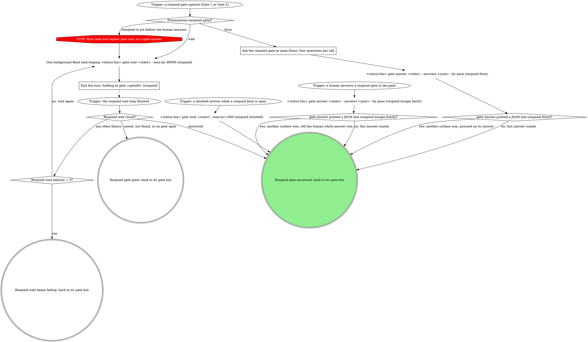

# board:respond: Gate step

This is the shared gate step of the board:respond skill: the Gate 1 box in
`triage.md` and the Gate 2 box in `post.md` send you here. Its SKILL.md holds
"Gate 1 and Gate 2 shapes" and "Reading answers".

Gate 1 (`respond-plan`) and Gate 2 (`respond-post`) each take this step
after their open. Either open, `gate open` or `open-gate.sh`, prints one
JSON line, `{"gateId": "...", "presentation": "form"}` or `"wait"`, with
`"contextOmitted": true` added when the daemon dropped the question
contexts. Keep both: `Presentation (respond gate)?` reads `presentation`,
and `End the turn: holding at gate <gateId> (respond)` names `gateId`. The
step writes no status. The gate box that entered reads the outcome:

- **Answered:** the answers and `by` go back to the box.
- **Gone** (closed, not found, or `no gate open`): end cleanly, say so in
  the pane, write neither `done` nor `error`: whatever superseded the gate
  already owns this MR's board state.
- **Wait keeps failing:** the box presents its degraded native forms.

### Ask the respond gate as pane forms, four questions per call

Read `~/Documents/GitHub/mattstack-skills/attachments/gate-protocol/SKILL.md`
(the stable source checkout, machine-local by design) with the Read tool,
and follow its "Present the in-pane gate form", "Answers are option
values" and "Doorbell" sections for the rendering and conflict mechanics.
Where it records the pane's answer with the `gate_answer` tool, a board
gate records it with `<status-bin> gate answer <state> --answers <json>
--by pane` instead.
Three things stay local: your framing and reasoning go in the pane prose
or option descriptions, never into rewritten question or option text; no
option ever folds another question's answer in; and each gate's own
chunking below.

- **Gate 1.** Each thread's form question: header `Thread <n>`; question
  text its label, a newline, its prose context, then `Reply, fix, or
  skip?`; options with the gate's labels and descriptions. The form tool
  takes at most four questions per call, so ask the thread questions in
  order, up to four per call, until every thread is asked. Then, if any
  thread's answer is a `fix:` value, ask `code-changes` in one more call;
  otherwise fill `code-changes: "skip"` without asking (the same hide rule
  the board and console cards apply).
- **Gate 2.** Each thread's form question: header `Thread <n>`; question
  text its label, a newline, its prose context, then `Post, resolve, both,
  or neither?`; a multi-select with the gate's labels and descriptions,
  four questions per call. A thread with neither picked is its question
  answered as an explicit empty array, which the daemon records.
- **One answer.** Submit exactly one `<status-bin> gate answer <state>
  --answers <json> --by pane` after the LAST call, carrying every thread
  question's answer (plus `code-changes` for Gate 1); never one per chunk.
  Each value is the chosen option's value verbatim.
- **Never `text`.** Whatever the human types in the form's free-text
  field, a full replacement reply included, rides as `note`: at Gate 1 that
  makes a `reply:` pick a reply override; at Gate 2 the report's finalized
  reply posts.
- **Fitted files.** A gate opened from a fitted file never shows its JSON
  in the form. Run the `gate-ctx.sh` the domain skill fitted it with in
  `prose` mode on the source file beside it (`sh <gate-ctx.sh> prose <
  <dir>/respond-plan.source.json`, or `respond-post.source.json` for Gate
  2), take each thread's prose context from that output, and print its
  `.context` as one pane line before the first form call. A Gate 2 prose
  line reads `<file> FIX · <sha>: <text>` or `<file> REPLY: <text>`. Leave
  Gate 2's pane-only `next` question out.
- **Another surface won.** A JSON line printed by `gate answer`, or a
  doorbell while a form still sits open, means another surface answered
  first: proceed on the winning answer, never the one you meant to submit.
  The doorbell is verify-only: read the recorded answer with `<status-bin>
  gate wait <state> --max-ms 1000`.
- **The hook.** A PreToolUse hook may deny native AskUserQuestion when no
  gate is open; that denial is the gate protocol speaking: the gate opens
  first, through its gate node. When the daemon is down the hook allows the
  native form, which is the degraded path.

### End the turn: holding at gate <gateId> (respond)

Read `${CLAUDE_SKILL_DIR}/../gate-cli-recipes/SKILL.md` with the Read
tool and follow its "Wait recipe": one background shell task loops
`<status-bin> gate wait <state> --max-ms 90000` while it prints
`{"status":"pending"}`; never launch a second while one runs. End the turn
in one line, `holding at gate <gateId>`, naming this gate (Gate 1's or
Gate 2's). The loop's completion re-invokes the pane with the answer.

A human who interrupts the wait and answers in the pane is the escape
hatch: record it with `<status-bin> gate answer <state> --answers <json>
--by pane` so a parked resume stays in sync. Per that file's "CAS loss and
reading answers back": silence and exit 0 means this answer stands; one
printed JSON line (`{answers, by, answeredAt}`) means another surface
answered first, so proceed on the printed answer and tell the human which
answer won.

Per "Closed or missing gate" and "A failing wait is not degradation": a
`gate <id> closed (<reason>)`, not-found or `no gate open for <url>`
result is terminal, so end cleanly without re-running it; any other
failing wait re-runs, and only the third failure falls through to the
degraded native forms, saying why.
