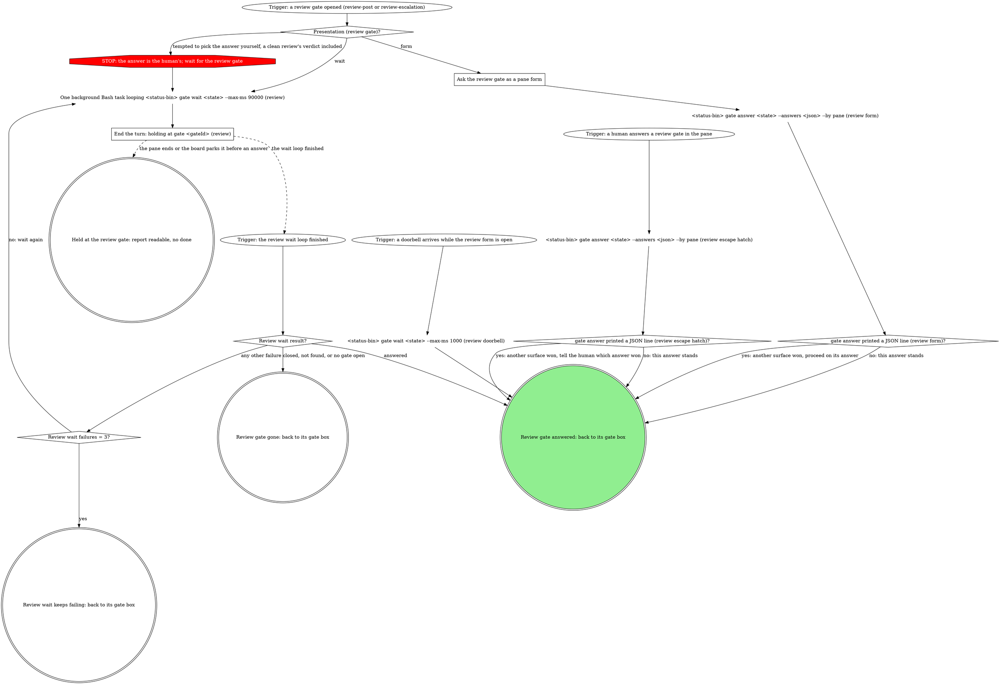
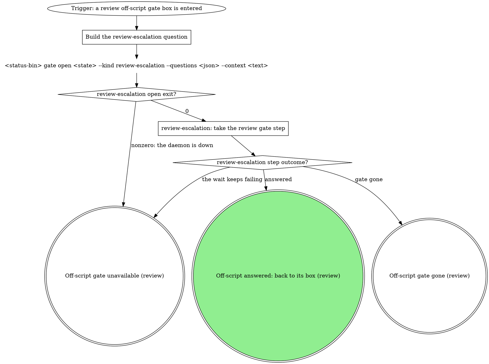

<!-- expanded by rt skills expand from the sources below; edits here are drift (edit the source dir and re-run) -->

<!-- part: step source=review/SKILL.md path=review/SKILL.md lines=20-2098 -->
# mr-board review runner

The mr-board spawned this pane to review one MR and report status back to the
board through its status CLI. A human decides the verdict only at a gate. This
wrapper carries **no** repo-, team-, or tool-specific knowledge: the board
injects everything it needs as flags:

| flag | meaning |
|------|---------|
| `<mrUrl>` (positional) | the merge request to review |
| `--state <handle>` | opaque board handle for this MR's review. Pass it verbatim to `--status-bin` and the `gate` verbs; never read, stat, or write it. It looks like a `.json` path but no such file exists: board state lives in the board's database, and the path is only a key. Its absence on disk says nothing about whether the board is tracking this pass. |
| `--status-bin <path>` | absolute path to the board's status-writer CLI; run it to emit status |
| `--report <path>` | where to save the written review the board shows in a modal |
| `--skill <name>` | the domain skill that owns the actual review (optional) |
| `--skill-path <path>` | absolute path to that skill's SKILL.md, when the board already resolved it (optional; see "Resolving the domain skill") |
| `--re-review` | this is a re-review of an already-reviewed MR (optional; see "Re-review mode") |
| `--resumed-gate <gateId>` | this invocation is a parked-gate resume, not a fresh review (optional; see "Resumed entry" under Flow) |
| `--resumed-gate-kind <kind>` | the `kind` of the gate `--resumed-gate` names (`review-post` or `review-escalation`). Present exactly when `--resumed-gate` is, and the only way to learn it: `--state` is an opaque handle and `gate wait` returns only the answer. |

Write status **only** by running the injected `--status-bin`:

```
<status-bin> review-status <state> <status> [message] [--outcome <comment|approve>]
```

## Flow

The graph is the map: start at the trigger and take only the edges it
draws. Each box has its own section below the graph.

```dot
digraph review_flow {
    rankdir=TB;

    "Trigger: the board launched /board:review" [shape=ellipse];
    "--resumed-gate given (review)?" [shape=diamond];
    "--re-review given?" [shape=diamond];
    "Print the RE-REVIEW banner as the first output" [shape=box];
    "<status-bin> review-status <state> reviewing" [shape=plaintext];
    "--skill given (review)?" [shape=diamond];
    "--skill-path given (review)?" [shape=diamond];
    "Read <--skill-path> (review)" [shape=plaintext];
    "Load the --skill domain skill by name (review)" [shape=box];
    "${CLAUDE_SKILL_DIR}/scripts/resolve-args.sh (review)" [shape=plaintext];
    "resolve-args.sh exit (review)?" [shape=diamond];
    "Read <resolved.review.path>" [shape=plaintext];
    "Print the resolver's errors verbatim (review)" [shape=box];
    "Which entry (review)?" [shape=diamond];

    "<status-bin> gate wait <state> (resumed review gate)" [shape=plaintext];
    "Resumed wait result (review)?" [shape=diamond];
    "Resumed wait failures = 3 (review)?" [shape=diamond];
    "Resumed kind (review)?" [shape=diamond];
    "Read <--report> and its json sibling (resumed review)" [shape=plaintext];
    "Report fits the resumed answer (review)?" [shape=diamond];
    "Route the resumed escalation by its origin (review)" [shape=box];
    "Resumed escalation origin (review)?" [shape=diamond];
    "Read <--report>, its verdict line and json sibling (resumed escalation)" [shape=plaintext];
    "Verdict line present (review)?" [shape=diamond];
    "Read <--report> (prior review, resumed re-review)" [shape=plaintext];

    "Prior review at --report (re-review)?" [shape=diamond];
    "Read <--report> (prior review)" [shape=plaintext];
    "<status-bin> review-ledger read <state>" [shape=plaintext];
    "Old review to rebuild as round 1?" [shape=diamond];
    "Build the round-1 skipped list from the prior review" [shape=box];
    "<status-bin> review-ledger record <state> --round 1 --sha unknown --outcome <the prior verdict's outcome> --skipped <json>" [shape=plaintext];
    "<status-bin> review-ledger read <state> (after rebuilding round 1)" [shape=plaintext];
    "Domain skill resolved (review)?" [shape=diamond];
    "Delegate the review to the domain skill" [shape=box];
    "Domain review result?" [shape=diamond];
    "rt_verb {args: [skills, writing-style, show]} (review)" [shape=plaintext];
    "rt_verb named a style skill (review)?" [shape=diamond];
    "Load the named writing-style skill (review)" [shape=box];
    "Load the preferences.md style, else conversational (review)" [shape=box];
    "Which entry (review writing style)?" [shape=diamond];
    "mr_view {mrUrl} (review)" [shape=plaintext];
    "mr_view result (review)?" [shape=diamond];
    "STOP: MR reads go through mr_view (review)" [shape=octagon style=filled fillcolor=red fontcolor=white];
    "Fixed the mr_view call once already (review)?" [shape=diamond];
    "Fix what the mr_view error names (review)" [shape=box];
    "review off-script gate: mr_view refused" [shape=box];
    "Off-script outcome (mr_view, review)?" [shape=diamond];
    "Off-script rounds = 2 (mr_view, review)?" [shape=diamond];
    "--re-review given (thread read)?" [shape=diamond];
    "mr_threads {mrUrl, refresh: true} (re-review)" [shape=plaintext];
    "mr_threads result (re-review)?" [shape=diamond];
    "STOP: threads are read with mr_threads (review)" [shape=octagon style=filled fillcolor=red fontcolor=white];
    "Fixed the re-review mr_threads call once already?" [shape=diamond];
    "Fix what the re-review mr_threads error names" [shape=box];
    "review off-script gate: mr_threads refused (re-review)" [shape=box];
    "Off-script outcome (re-review mr_threads)?" [shape=diamond];
    "Off-script rounds = 2 (re-review mr_threads)?" [shape=diamond];
    "Review the MR yourself" [shape=box];
    "Generic review result?" [shape=diamond];
    "Write the review report to --report" [shape=box];
    "Append the review-round line to --report" [shape=box];

    "Fitted review-post open file handed back?" [shape=diamond];
    "${CLAUDE_SKILL_DIR}/scripts/open-gate.sh <status-bin> <state> review-post <open-file>" [shape=plaintext];
    "Report json sibling (review)?" [shape=diamond];
    "Build the per-finding questions (findings-N, outcome)" [shape=box];
    "Build the outcome-only question (clean review)" [shape=box];
    "Print the tier-fallback line in the pane" [shape=box];
    "Build the tier-fallback questions (tiers, outcome)" [shape=box];
    "<status-bin> gate open <state> --kind review-post --questions <json> --context <text>" [shape=plaintext];
    "review-post open exit?" [shape=diamond];
    "review-post: take the review gate step" [shape=box];
    "review-post step outcome?" [shape=diamond];
    "Ask the review questions as one combined native form (degraded)" [shape=box];
    "Record the verdict answer in --report" [shape=box];
    "<status-bin> review-ledger record <state> --round <n> --sha <sha> --outcome <comment|approve> --skipped <json> --restored <json> --confirmed <json>" [shape=plaintext];

    "Domain skill resolved (review act)?" [shape=diamond];
    "Hand the answer to the domain skill to post" [shape=box];
    "Domain posting result (review)?" [shape=diamond];
    "Writing style loaded (review act)?" [shape=diamond];
    "Record the resumed take's mark in --report (review)" [shape=box];
    "Resumed pane (review posting)?" [shape=diamond];
    "mr_threads {mrUrl, refresh: true} (review posted already)" [shape=plaintext];
    "mr_threads result (review posted already)?" [shape=diamond];
    "STOP: the Posted already read goes through mr_threads (review)" [shape=octagon style=filled fillcolor=red fontcolor=white];
    "Fixed the posted-already mr_threads call once already (review)?" [shape=diamond];
    "Fix what the posted-already mr_threads error names (review)" [shape=box];
    "Mark the review already posted" [shape=box];
    "review off-script gate: mr_threads refused (posted already)" [shape=box];
    "Off-script outcome (review posted-already mr_threads)?" [shape=diamond];
    "Off-script rounds = 2 (review posted-already mr_threads)?" [shape=diamond];
    "Review already posted (review)?" [shape=diamond];
    "Compose the submitted review (review)" [shape=box];
    "mr_review_submit {mrUrl, outcome, summary, comments, replies} (review)" [shape=plaintext];
    "mr_review_submit result (review)?" [shape=diamond];
    "STOP: a review posts whole through mr_review_submit" [shape=octagon style=filled fillcolor=red fontcolor=white];
    "Fixed the mr_review_submit call once already?" [shape=diamond];
    "Fix what the mr_review_submit error names" [shape=box];
    "Bad anchors moved once already (review)?" [shape=diamond];
    "Move the bad-anchor findings into the summary (review)" [shape=box];
    "Outcome is approve?" [shape=diamond];
    "mr_approve {mrUrl}" [shape=plaintext];
    "mr_approve result?" [shape=diamond];
    "STOP: the approval goes through mr_approve" [shape=octagon style=filled fillcolor=red fontcolor=white];
    "Fixed the mr_approve call once already?" [shape=diamond];
    "Fix what the mr_approve error names" [shape=box];

    "review off-script gate: mr_review_submit refused" [shape=box];
    "Off-script outcome (mr_review_submit)?" [shape=diamond];
    "Off-script rounds = 2 (mr_review_submit)?" [shape=diamond];
    "review off-script gate: pending comments on the MR" [shape=box];
    "Off-script outcome (pending comments)?" [shape=diamond];
    "Off-script rounds = 2 (pending comments)?" [shape=diamond];
    "review off-script gate: mr_approve refused" [shape=box];
    "Off-script outcome (mr_approve)?" [shape=diamond];
    "Off-script rounds = 2 (mr_approve)?" [shape=diamond];
    "Record the round again with nothing restored (review)" [shape=box];

    "<status-bin> review-status <state> done <summary> --outcome <comment|approve>" [shape=plaintext];
    "<status-bin> review-status <state> error <what went wrong>" [shape=plaintext];
    "Review error written: stay in the pane and report" [shape=doublecircle];
    "Review gate gone: ended cleanly, no status write" [shape=doublecircle];
    "Held at a review off-script gate: the pane stays" [shape=doublecircle];
    "Review done: the board closes this tab" [shape=doublecircle style=filled fillcolor=lightgreen];

    "Trigger: the board launched /board:review" -> "--resumed-gate given (review)?";
    "--resumed-gate given (review)?" -> "<status-bin> review-status <state> reviewing" [label="yes"];
    "--resumed-gate given (review)?" -> "--re-review given?" [label="no: a fresh review"];
    "--re-review given?" -> "Print the RE-REVIEW banner as the first output" [label="yes"];
    "--re-review given?" -> "<status-bin> review-status <state> reviewing" [label="no"];
    "Print the RE-REVIEW banner as the first output" -> "<status-bin> review-status <state> reviewing";
    "<status-bin> review-status <state> reviewing" -> "--skill given (review)?";
    "--skill given (review)?" -> "--skill-path given (review)?" [label="yes"];
    "--skill given (review)?" -> "${CLAUDE_SKILL_DIR}/scripts/resolve-args.sh (review)" [label="no"];
    "--skill-path given (review)?" -> "Read <--skill-path> (review)" [label="yes"];
    "--skill-path given (review)?" -> "Load the --skill domain skill by name (review)" [label="no"];
    "Read <--skill-path> (review)" -> "Which entry (review)?";
    "Load the --skill domain skill by name (review)" -> "Which entry (review)?";
    "${CLAUDE_SKILL_DIR}/scripts/resolve-args.sh (review)" -> "resolve-args.sh exit (review)?";
    "resolve-args.sh exit (review)?" -> "Read <resolved.review.path>" [label="0"];
    "resolve-args.sh exit (review)?" -> "Print the resolver's errors verbatim (review)" [label="nonzero: generic path"];
    "Read <resolved.review.path>" -> "Which entry (review)?";
    "Print the resolver's errors verbatim (review)" -> "Which entry (review)?";
    "Which entry (review)?" -> "<status-bin> gate wait <state> (resumed review gate)" [label="resumed gate"];
    "Which entry (review)?" -> "Prior review at --report (re-review)?" [label="fresh review"];

    "<status-bin> gate wait <state> (resumed review gate)" -> "Resumed wait result (review)?";
    "Resumed wait result (review)?" -> "Resumed kind (review)?" [label="answered"];
    "Resumed wait result (review)?" -> "Review gate gone: ended cleanly, no status write" [label="closed, not found, or no gate open"];
    "Resumed wait result (review)?" -> "Resumed wait failures = 3 (review)?" [label="any other failure"];
    "Resumed wait failures = 3 (review)?" -> "<status-bin> gate wait <state> (resumed review gate)" [label="no: wait again"];
    "Resumed wait failures = 3 (review)?" -> "<status-bin> review-status <state> error <what went wrong>" [label="yes"];
    "Resumed kind (review)?" -> "Read <--report> and its json sibling (resumed review)" [label="review-post"];
    "Resumed kind (review)?" -> "Route the resumed escalation by its origin (review)" [label="review-escalation"];
    "Read <--report> and its json sibling (resumed review)" -> "Report fits the resumed answer (review)?";
    "Report fits the resumed answer (review)?" -> "Record the verdict answer in --report" [label="yes, or the answer is outcome alone"];
    "Report fits the resumed answer (review)?" -> "<status-bin> review-status <state> error <what went wrong>" [label="no: missing or malformed for the answer's shape"];
    "Route the resumed escalation by its origin (review)" -> "Resumed escalation origin (review)?";
    "Resumed escalation origin (review)?" -> "<status-bin> review-status <state> error <what went wrong>" [label="iterate at round 2, any other origin: the refusals are the reason"];
    "Resumed escalation origin (review)?" -> "Record the round again with nothing restored (review)" [label="hand back, or iterate at round 2, at mr_review_submit refused or pending comments on the MR"];
    "Resumed escalation origin (review)?" -> "Delegate the review to the domain skill" [label="mr_view, not on a re-review: take or iterate at round 1, a domain skill resolved on this resume: it reviews afresh"];
    "Resumed escalation origin (review)?" -> "rt_verb {args: [skills, writing-style, show]} (review)" [label="generic path, mr_view, not on a re-review: take with branches, or iterate at round 1"];
    "Resumed escalation origin (review)?" -> "Read <--report> (prior review, resumed re-review)" [label="a re-review origin: take, or iterate at round 1"];
    "Resumed escalation origin (review)?" -> "Read <--report>, its verdict line and json sibling (resumed escalation)" [label="a posting origin: take, or iterate at round 1"];
    "Resumed escalation origin (review)?" -> "Held at a review off-script gate: the pane stays" [label="hold"];
    "Resumed escalation origin (review)?" -> "<status-bin> review-status <state> error <what went wrong>" [label="hand back at any other origin, or a generic-path take at mr_view with no branches"];
    "Read <--report> (prior review, resumed re-review)" -> "<status-bin> review-ledger read <state>";
    "Read <--report>, its verdict line and json sibling (resumed escalation)" -> "Verdict line present (review)?";
    "Verdict line present (review)?" -> "Domain skill resolved (review act)?" [label="yes, and the report fits its answer"];
    "Verdict line present (review)?" -> "<status-bin> review-status <state> error <what went wrong>" [label="no, or the report does not fit its answer"];

    "Prior review at --report (re-review)?" -> "Read <--report> (prior review)" [label="yes, and --re-review given"];
    "Prior review at --report (re-review)?" -> "<status-bin> review-ledger read <state>" [label="no file, and --re-review given"];
    "Prior review at --report (re-review)?" -> "Domain skill resolved (review)?" [label="not a re-review"];
    "Read <--report> (prior review)" -> "<status-bin> review-ledger read <state>";
    "<status-bin> review-ledger read <state>" -> "Old review to rebuild as round 1?";
    "Old review to rebuild as round 1?" -> "Build the round-1 skipped list from the prior review" [label="yes: the read printed round 0, and --report carries a verdict line and a json sibling that parses"];
    "Old review to rebuild as round 1?" -> "Domain skill resolved (review)?" [label="no: a recorded round, a failed read, or nothing to rebuild from"];
    "Build the round-1 skipped list from the prior review" -> "<status-bin> review-ledger record <state> --round 1 --sha unknown --outcome <the prior verdict's outcome> --skipped <json>";
    "<status-bin> review-ledger record <state> --round 1 --sha unknown --outcome <the prior verdict's outcome> --skipped <json>" -> "<status-bin> review-ledger read <state> (after rebuilding round 1)";
    "<status-bin> review-ledger read <state> (after rebuilding round 1)" -> "Domain skill resolved (review)?";
    "Domain skill resolved (review)?" -> "Delegate the review to the domain skill" [label="yes"];
    "Domain skill resolved (review)?" -> "rt_verb {args: [skills, writing-style, show]} (review)" [label="no: generic path"];
    "Delegate the review to the domain skill" -> "Domain review result?";
    "Domain review result?" -> "Append the review-round line to --report" [label="report written, severity levels handed back"];
    "Domain review result?" -> "<status-bin> review-status <state> error <what went wrong>" [label="failed: bad MR, mismatched ticket, fetch failure"];
    "rt_verb {args: [skills, writing-style, show]} (review)" -> "rt_verb named a style skill (review)?";
    "rt_verb named a style skill (review)?" -> "Load the named writing-style skill (review)" [label="yes"];
    "rt_verb named a style skill (review)?" -> "Load the preferences.md style, else conversational (review)" [label="no: refused, failed or unavailable"];
    "Load the named writing-style skill (review)" -> "Which entry (review writing style)?";
    "Load the preferences.md style, else conversational (review)" -> "Which entry (review writing style)?";
    "Which entry (review writing style)?" -> "mr_view {mrUrl} (review)" [label="fresh review"];
    "Which entry (review writing style)?" -> "Resumed pane (review posting)?" [label="posting the answer, not a resumed take"];
    "Which entry (review writing style)?" -> "Record the resumed take's mark in --report (review)" [label="posting the answer, a resumed take at a posting origin or the Posted already read"];
    "Record the resumed take's mark in --report (review)" -> "Resumed pane (review posting)?";
    "Which entry (review writing style)?" -> "mr_view {mrUrl} (review)" [label="resumed escalation, pre-verdict origin, not a take at mr_view"];
    "Which entry (review writing style)?" -> "--re-review given (thread read)?" [label="resumed escalation, take at mr_view: branches from its note"];
    "mr_view {mrUrl} (review)" -> "mr_view result (review)?";
    "mr_view result (review)?" -> "--re-review given (thread read)?" [label="ok: keep title, description, branches"];
    "mr_view result (review)?" -> "Fixed the mr_view call once already (review)?" [label="tool error"];
    "mr_view result (review)?" -> "STOP: MR reads go through mr_view (review)" [label="tempted to read the MR with the GitLab CLI or the API"];
    "STOP: MR reads go through mr_view (review)" -> "Fixed the mr_view call once already (review)?";
    "Fixed the mr_view call once already (review)?" -> "Fix what the mr_view error names (review)" [label="no"];
    "Fixed the mr_view call once already (review)?" -> "review off-script gate: mr_view refused" [label="yes"];
    "Fix what the mr_view error names (review)" -> "mr_view {mrUrl} (review)";
    "review off-script gate: mr_view refused" -> "Off-script outcome (mr_view, review)?";
    "Off-script outcome (mr_view, review)?" -> "--re-review given (thread read)?" [label="take: the human gave the branches in the note"];
    "Off-script outcome (mr_view, review)?" -> "Off-script rounds = 2 (mr_view, review)?" [label="iterate: the cause is fixed"];
    "Off-script outcome (mr_view, review)?" -> "Held at a review off-script gate: the pane stays" [label="hold"];
    "Off-script outcome (mr_view, review)?" -> "<status-bin> review-status <state> error <what went wrong>" [label="hand back"];
    "Off-script outcome (mr_view, review)?" -> "Review gate gone: ended cleanly, no status write" [label="gate gone"];
    "Off-script outcome (mr_view, review)?" -> "<status-bin> review-status <state> error <what went wrong>" [label="gate unavailable"];
    "Off-script rounds = 2 (mr_view, review)?" -> "mr_view {mrUrl} (review)" [label="no: read again"];
    "Off-script rounds = 2 (mr_view, review)?" -> "<status-bin> review-status <state> error <what went wrong>" [label="yes: the refusals are the reason"];
    "--re-review given (thread read)?" -> "mr_threads {mrUrl, refresh: true} (re-review)" [label="yes, or a resumed re-review origin other than a re-review mr_threads take"];
    "--re-review given (thread read)?" -> "Review the MR yourself" [label="no, or a resumed re-review mr_threads take"];
    "mr_threads {mrUrl, refresh: true} (re-review)" -> "mr_threads result (re-review)?";
    "mr_threads result (re-review)?" -> "Review the MR yourself" [label="ok"];
    "mr_threads result (re-review)?" -> "Fixed the re-review mr_threads call once already?" [label="tool error"];
    "mr_threads result (re-review)?" -> "STOP: threads are read with mr_threads (review)" [label="tempted to read them with the GitLab CLI or the API"];
    "STOP: threads are read with mr_threads (review)" -> "Fixed the re-review mr_threads call once already?";
    "Fixed the re-review mr_threads call once already?" -> "Fix what the re-review mr_threads error names" [label="no"];
    "Fixed the re-review mr_threads call once already?" -> "review off-script gate: mr_threads refused (re-review)" [label="yes"];
    "Fix what the re-review mr_threads error names" -> "mr_threads {mrUrl, refresh: true} (re-review)";
    "review off-script gate: mr_threads refused (re-review)" -> "Off-script outcome (re-review mr_threads)?";
    "Off-script outcome (re-review mr_threads)?" -> "Review the MR yourself" [label="take: a full review without the thread history"];
    "Off-script outcome (re-review mr_threads)?" -> "Off-script rounds = 2 (re-review mr_threads)?" [label="iterate: the cause is fixed"];
    "Off-script outcome (re-review mr_threads)?" -> "Held at a review off-script gate: the pane stays" [label="hold"];
    "Off-script outcome (re-review mr_threads)?" -> "<status-bin> review-status <state> error <what went wrong>" [label="hand back"];
    "Off-script outcome (re-review mr_threads)?" -> "Review gate gone: ended cleanly, no status write" [label="gate gone"];
    "Off-script outcome (re-review mr_threads)?" -> "<status-bin> review-status <state> error <what went wrong>" [label="gate unavailable"];
    "Off-script rounds = 2 (re-review mr_threads)?" -> "mr_threads {mrUrl, refresh: true} (re-review)" [label="no: read again"];
    "Off-script rounds = 2 (re-review mr_threads)?" -> "<status-bin> review-status <state> error <what went wrong>" [label="yes: the refusals are the reason"];
    "Review the MR yourself" -> "Generic review result?";
    "Generic review result?" -> "Write the review report to --report" [label="findings produced"];
    "Generic review result?" -> "<status-bin> review-status <state> error <what went wrong>" [label="failed: bad MR link or diff unreadable"];
    "Write the review report to --report" -> "Append the review-round line to --report";
    "Append the review-round line to --report" -> "Fitted review-post open file handed back?";

    "Fitted review-post open file handed back?" -> "${CLAUDE_SKILL_DIR}/scripts/open-gate.sh <status-bin> <state> review-post <open-file>" [label="yes"];
    "Fitted review-post open file handed back?" -> "Report json sibling (review)?" [label="no"];
    "${CLAUDE_SKILL_DIR}/scripts/open-gate.sh <status-bin> <state> review-post <open-file>" -> "review-post open exit?";
    "Report json sibling (review)?" -> "Build the per-finding questions (findings-N, outcome)" [label="valid, findings present"];
    "Report json sibling (review)?" -> "Build the outcome-only question (clean review)" [label="valid, findings is an empty array"];
    "Report json sibling (review)?" -> "Print the tier-fallback line in the pane" [label="absent or malformed"];
    "Print the tier-fallback line in the pane" -> "Build the tier-fallback questions (tiers, outcome)";
    "Build the per-finding questions (findings-N, outcome)" -> "<status-bin> gate open <state> --kind review-post --questions <json> --context <text>";
    "Build the outcome-only question (clean review)" -> "<status-bin> gate open <state> --kind review-post --questions <json> --context <text>";
    "Build the tier-fallback questions (tiers, outcome)" -> "<status-bin> gate open <state> --kind review-post --questions <json> --context <text>";
    "<status-bin> gate open <state> --kind review-post --questions <json> --context <text>" -> "review-post open exit?";
    "review-post open exit?" -> "review-post: take the review gate step" [label="0"];
    "review-post open exit?" -> "Ask the review questions as one combined native form (degraded)" [label="nonzero: the daemon is down"];
    "review-post: take the review gate step" -> "review-post step outcome?";
    "review-post step outcome?" -> "Record the verdict answer in --report" [label="answered"];
    "review-post step outcome?" -> "Review gate gone: ended cleanly, no status write" [label="gate gone"];
    "review-post step outcome?" -> "Ask the review questions as one combined native form (degraded)" [label="the wait keeps failing"];
    "Ask the review questions as one combined native form (degraded)" -> "Record the verdict answer in --report";
    "Record the verdict answer in --report" -> "<status-bin> review-ledger record <state> --round <n> --sha <sha> --outcome <comment|approve> --skipped <json> --restored <json> --confirmed <json>";
    "<status-bin> review-ledger record <state> --round <n> --sha <sha> --outcome <comment|approve> --skipped <json> --restored <json> --confirmed <json>" -> "Domain skill resolved (review act)?";

    "Domain skill resolved (review act)?" -> "Hand the answer to the domain skill to post" [label="yes"];
    "Domain skill resolved (review act)?" -> "Writing style loaded (review act)?" [label="no"];
    "Hand the answer to the domain skill to post" -> "Domain posting result (review)?";
    "Domain posting result (review)?" -> "<status-bin> review-status <state> done <summary> --outcome <comment|approve>" [label="posted"];
    "Domain posting result (review)?" -> "Record the round again with nothing restored (review)" [label="failed"];
    "Writing style loaded (review act)?" -> "Resumed pane (review posting)?" [label="yes"];
    "Writing style loaded (review act)?" -> "rt_verb {args: [skills, writing-style, show]} (review)" [label="no: a resumed pane"];
    "Resumed pane (review posting)?" -> "mr_threads {mrUrl, refresh: true} (review posted already)" [label="yes"];
    "Resumed pane (review posting)?" -> "Review already posted (review)?" [label="no: this pane opened the gate, or a resumed posted-already take"];
    "mr_threads {mrUrl, refresh: true} (review posted already)" -> "mr_threads result (review posted already)?";
    "mr_threads result (review posted already)?" -> "Mark the review already posted" [label="ok"];
    "mr_threads result (review posted already)?" -> "Fixed the posted-already mr_threads call once already (review)?" [label="tool error"];
    "mr_threads result (review posted already)?" -> "STOP: the Posted already read goes through mr_threads (review)" [label="tempted to skip the read and post anyway"];
    "STOP: the Posted already read goes through mr_threads (review)" -> "Fixed the posted-already mr_threads call once already (review)?";
    "Fixed the posted-already mr_threads call once already (review)?" -> "Fix what the posted-already mr_threads error names (review)" [label="no"];
    "Fixed the posted-already mr_threads call once already (review)?" -> "review off-script gate: mr_threads refused (posted already)" [label="yes"];
    "Fix what the posted-already mr_threads error names (review)" -> "mr_threads {mrUrl, refresh: true} (review posted already)";
    "Mark the review already posted" -> "Review already posted (review)?";
    "review off-script gate: mr_threads refused (posted already)" -> "Off-script outcome (review posted-already mr_threads)?";
    "Off-script outcome (review posted-already mr_threads)?" -> "Mark the review already posted" [label="take: the human says whether the review is up, marked in --report"];
    "Off-script outcome (review posted-already mr_threads)?" -> "Off-script rounds = 2 (review posted-already mr_threads)?" [label="iterate: the cause is fixed"];
    "Off-script outcome (review posted-already mr_threads)?" -> "Held at a review off-script gate: the pane stays" [label="hold"];
    "Off-script outcome (review posted-already mr_threads)?" -> "<status-bin> review-status <state> error <what went wrong>" [label="hand back: nothing posts unchecked"];
    "Off-script outcome (review posted-already mr_threads)?" -> "Review gate gone: ended cleanly, no status write" [label="gate gone"];
    "Off-script outcome (review posted-already mr_threads)?" -> "<status-bin> review-status <state> error <what went wrong>" [label="gate unavailable"];
    "Off-script rounds = 2 (review posted-already mr_threads)?" -> "mr_threads {mrUrl, refresh: true} (review posted already)" [label="no: read again"];
    "Off-script rounds = 2 (review posted-already mr_threads)?" -> "<status-bin> review-status <state> error <what went wrong>" [label="yes: the refusals are the reason"];
    "Review already posted (review)?" -> "Outcome is approve?" [label="yes: its summary note is up, or a mark says the human posted it"];
    "Review already posted (review)?" -> "Compose the submitted review (review)" [label="no: nothing landed"];
    "Compose the submitted review (review)" -> "mr_review_submit {mrUrl, outcome, summary, comments, replies} (review)";
    "mr_review_submit {mrUrl, outcome, summary, comments, replies} (review)" -> "mr_review_submit result (review)?";
    "mr_review_submit result (review)?" -> "<status-bin> review-status <state> done <summary> --outcome <comment|approve>" [label="published, approved as asked"];
    "mr_review_submit result (review)?" -> "Fixed the mr_approve call once already?" [label="published, approved: false on an approve"];
    "mr_review_submit result (review)?" -> "Bad anchors moved once already (review)?" [label="published: false, bad-anchors"];
    "mr_review_submit result (review)?" -> "review off-script gate: pending comments on the MR" [label="published: false, pending-drafts"];
    "mr_review_submit result (review)?" -> "review off-script gate: mr_review_submit refused" [label="tool error saying it timed out, the outcome is unknown, or it only partly landed"];
    "mr_review_submit result (review)?" -> "Fixed the mr_review_submit call once already?" [label="any other tool error"];
    "mr_review_submit result (review)?" -> "STOP: a review posts whole through mr_review_submit" [label="tempted to post the pieces with mr_comment_inline, mr_comment, mr_reply_thread or mr_resolve_thread, or with the GitLab CLI or the API"];
    "STOP: a review posts whole through mr_review_submit" -> "Fixed the mr_review_submit call once already?";
    "Fixed the mr_review_submit call once already?" -> "Fix what the mr_review_submit error names" [label="no"];
    "Fixed the mr_review_submit call once already?" -> "review off-script gate: mr_review_submit refused" [label="yes"];
    "Fix what the mr_review_submit error names" -> "mr_review_submit {mrUrl, outcome, summary, comments, replies} (review)";
    "Bad anchors moved once already (review)?" -> "Move the bad-anchor findings into the summary (review)" [label="no"];
    "Bad anchors moved once already (review)?" -> "review off-script gate: mr_review_submit refused" [label="yes"];
    "Move the bad-anchor findings into the summary (review)" -> "mr_review_submit {mrUrl, outcome, summary, comments, replies} (review)";
    "Outcome is approve?" -> "mr_approve {mrUrl}" [label="yes, not marked approved"];
    "Outcome is approve?" -> "<status-bin> review-status <state> done <summary> --outcome <comment|approve>" [label="no: comment, or --report marks it approved by hand"];
    "mr_approve {mrUrl}" -> "mr_approve result?";
    "mr_approve result?" -> "<status-bin> review-status <state> done <summary> --outcome <comment|approve>" [label="approved, or already approved by this account"];
    "mr_approve result?" -> "Fixed the mr_approve call once already?" [label="tool error"];
    "mr_approve result?" -> "STOP: the approval goes through mr_approve" [label="tempted to approve with the GitLab CLI or the API"];
    "STOP: the approval goes through mr_approve" -> "Fixed the mr_approve call once already?";
    "Fixed the mr_approve call once already?" -> "Fix what the mr_approve error names" [label="no"];
    "Fixed the mr_approve call once already?" -> "review off-script gate: mr_approve refused" [label="yes"];
    "Fix what the mr_approve error names" -> "mr_approve {mrUrl}";

    "review off-script gate: mr_review_submit refused" -> "Off-script outcome (mr_review_submit)?";
    "Off-script outcome (mr_review_submit)?" -> "Outcome is approve?" [label="take: the review is up, marked in --report"];
    "Off-script outcome (mr_review_submit)?" -> "Off-script rounds = 2 (mr_review_submit)?" [label="iterate: the cause is fixed and nothing from this review is up"];
    "Off-script outcome (mr_review_submit)?" -> "Held at a review off-script gate: the pane stays" [label="hold"];
    "Off-script outcome (mr_review_submit)?" -> "Record the round again with nothing restored (review)" [label="hand back"];
    "Off-script outcome (mr_review_submit)?" -> "Review gate gone: ended cleanly, no status write" [label="gate gone"];
    "Off-script outcome (mr_review_submit)?" -> "Record the round again with nothing restored (review)" [label="gate unavailable"];
    "Off-script rounds = 2 (mr_review_submit)?" -> "mr_review_submit {mrUrl, outcome, summary, comments, replies} (review)" [label="no: submit again"];
    "Off-script rounds = 2 (mr_review_submit)?" -> "Record the round again with nothing restored (review)" [label="yes: the refusals are the reason"];

    "review off-script gate: pending comments on the MR" -> "Off-script outcome (pending comments)?";
    "Off-script outcome (pending comments)?" -> "Outcome is approve?" [label="take: the human posted the review with their pending comments, marked in --report"];
    "Off-script outcome (pending comments)?" -> "Off-script rounds = 2 (pending comments)?" [label="iterate: the human cleared their pending comments"];
    "Off-script outcome (pending comments)?" -> "Held at a review off-script gate: the pane stays" [label="hold"];
    "Off-script outcome (pending comments)?" -> "Record the round again with nothing restored (review)" [label="hand back"];
    "Off-script outcome (pending comments)?" -> "Review gate gone: ended cleanly, no status write" [label="gate gone"];
    "Off-script outcome (pending comments)?" -> "Record the round again with nothing restored (review)" [label="gate unavailable"];
    "Off-script rounds = 2 (pending comments)?" -> "mr_review_submit {mrUrl, outcome, summary, comments, replies} (review)" [label="no: submit again"];
    "Off-script rounds = 2 (pending comments)?" -> "Record the round again with nothing restored (review)" [label="yes: the pending comments are the reason"];

    "review off-script gate: mr_approve refused" -> "Off-script outcome (mr_approve)?";
    "Off-script outcome (mr_approve)?" -> "<status-bin> review-status <state> done <summary> --outcome <comment|approve>" [label="take: the human approved it, marked in --report"];
    "Off-script outcome (mr_approve)?" -> "Off-script rounds = 2 (mr_approve)?" [label="iterate: the cause is fixed"];
    "Off-script outcome (mr_approve)?" -> "Held at a review off-script gate: the pane stays" [label="hold"];
    "Off-script outcome (mr_approve)?" -> "<status-bin> review-status <state> error <what went wrong>" [label="hand back"];
    "Off-script outcome (mr_approve)?" -> "Review gate gone: ended cleanly, no status write" [label="gate gone"];
    "Off-script outcome (mr_approve)?" -> "<status-bin> review-status <state> error <what went wrong>" [label="gate unavailable"];
    "Off-script rounds = 2 (mr_approve)?" -> "mr_approve {mrUrl}" [label="no: approve again"];
    "Off-script rounds = 2 (mr_approve)?" -> "<status-bin> review-status <state> error <what went wrong>" [label="yes: the refusals are the reason"];

    "<status-bin> review-status <state> done <summary> --outcome <comment|approve>" -> "Review done: the board closes this tab";
    "Record the round again with nothing restored (review)" -> "<status-bin> review-status <state> error <what went wrong>";
    "<status-bin> review-status <state> error <what went wrong>" -> "Review error written: stay in the pane and report";
}
```

What the graph cannot show:

- **The done write is the last call.** The board closes this pane's tab
  the moment `review-status <state> done` lands, which ends this session
  mid-batch. So the done write is a call of its own, sent only after every
  other write of the run has returned: the posting (the domain skill's, or
  this skill's own one `mr_review_submit`, and `mr_approve` alone after a
  refused approval), the `--report` write, and under a run the domain
  skill's `run_stage` done and `run_status` done. A write sent in the same
  batch as the done write is lost.
- **Resumed entry.** `--resumed-gate <gateId>` means a human answered a
  gate an earlier pane on this MR opened and the board parked, and the
  board is replaying that answer into this pane. `--resumed-gate-kind`
  names one of the two kinds this wrapper parks: `review-post` (the
  verdict) or `review-escalation` (an off-script gate). Write `reviewing`,
  resolve the domain skill, then read the parked answer with `gate wait`
  before anything else: it is registry-status-first, so on an answered
  gate it returns the recorded answer at once instead of blocking. No node
  between the trigger and that wait opens a gate, and never run `gate
  open` for the resumed gate: it lives in the rt daemon's registry, and a
  fresh open mints a new `gateId` and orphans the answer recorded against
  the old one. `Resumed kind (review)?` then routes by the kind. On
  `review-post`, never re-review and never rewrite the report: `Read
  <--report> and its json sibling (resumed review)` loads the findings it
  picked, and `Record the verdict answer in --report` records it before
  anything posts. On `review-escalation`, `Route the resumed escalation by
  its origin (review)` reads where the earlier pane stopped. Either way
  the Posted already read (`Mark the review already posted` on the
  generic path, the domain skill's own otherwise) finds what an earlier
  pane already put up, and an off-script gate at a read or
  posting refusal opens normally. This invocation supersedes any earlier
  gate contract remembered in the conversation.
- **What a resumed pane carries.** On a `review-post` resume, from the
  resumed wait: `answers`, `by` and `answeredAt`. On a `review-escalation`
  resume, the wait returns the escalation's answer, and the verdict's
  `{answers, by, answeredAt}` comes from the `review-post-answer:` line in
  `--report`. The verdict's keys name its shape: `findings-N` keys plus
  `outcome` are the per-finding path, `tiers` plus `outcome` the tier
  fallback, and `outcome` alone a clean review; `thread-N` and
  `skipped-N` keys ride beside any of them on a re-review. From
  `--report`'s json
  sibling (the stem swap in "Building the review-post questions"): each
  finding by its `id`, with its `tier`, `title`, `file`, `line`, `fix` and
  `kind`. From `--report` itself on the tier fallback: the findings under
  each tier. The earlier threads, each by its `discussionId` with its
  `call` and drafted `reply`: the json sibling's `threads` on the domain
  path, `--report`'s Earlier threads section on the generic path. The
  skipped findings, each by its round-qualified `id` with its `title`,
  `file`, `line`, recorded `excerpt` and `changed`: the json sibling's
  `skipped` on the domain path, `--report`'s Skipped earlier section on
  the generic path. From
  `--report`'s `review-round:` line: the round and the sha it reviewed.
  From the launch: `<mrUrl>`. Nothing else survives the earlier pane.
- **Finding ids.** A per-finding option's value is the finding's `id` from
  the json sibling, verbatim. The same string keys the finding in the json,
  so a picked value joins its finding with no renumbering.
- **Posting.** On the generic path the whole review posts in one
  `mr_review_submit` call, built at `Compose the submitted review
  (review)` from the picked findings. On the per-finding path they are
  the union of every `findings-N` answer array; on the tier fallback,
  every finding in the report whose tier the `tiers` answer picked; on a
  clean review, none. An explicit empty array posts nothing from that
  question. On a re-review the same call carries `replies`, one per
  earlier thread whose `thread-N` answer picked anything, and every
  restored finding (a `restore:<id>` picked in a `skipped-N` answer),
  posted like a picked one with its recorded text, except that one with
  `changed` true posts in the summary, never inline. A finding is
  anchored when it has both a `file` and a `line`:
  its comment's `path` is the finding's `file` and its `line` the
  finding's `line`, always both, never a `position` object; for a line the
  diff removed, add `oldPath` and `oldLine` as well. The daemon re-fetches
  the diff refs and checks every placement itself, so no sha is needed.
  Every comment body and the summary are written in the loaded voice,
  except a restored finding's text: it posts as recorded, in a comment or
  in the summary.
  `mr_approve` runs on its own only after the submit came back `approved:
  false`, or when the review was already up or posted by hand and the
  outcome is `approve`; approval has no read, so a resumed pane approves
  again unless `--report` marks it approved by hand ("Escalation marks"),
  and a refusal saying this account already approved counts as approved.
  Read each answer's `value` (an answer may be a `{value, note}` object); a
  note is the human's steer on the wording of what posts. No review posts
  twice: a resumed pane reads what is already up with `mr_threads {mrUrl,
  refresh: true} (review posted already)` before anything posts.
- **Escalation marks.** An off-script take at a posting origin, or at the
  Posted already read, writes a mark line into `--report` before the walk
  moves on, whether this pane or a resumed one acts on it. Each mark is
  one line with the fixed prefix `review-escalation-mark:`:
  `review-escalation-mark: review posted by hand` (a take at
  `mr_review_submit refused` or `pending comments on the MR`, or a Posted
  already read take whose note says the review is up) and
  `review-escalation-mark: approved by hand` (an `mr_approve` take). A
  take at a posting origin writes one mark for the review, never one per
  finding. The walk reads them back: a review marked posted by hand is
  never submitted, and an approval marked by hand never runs. A pane
  resumed on a later escalation has lost
  every earlier answer but these, so they are what keeps a taken call from
  running twice.
- **Budgets.** The `mr_review_submit` and `mr_approve` fix-once counters,
  `Bad anchors moved once already (review)?`, and the three read counters
  (`mr_view`, the re-review `mr_threads` and the posted-already
  `mr_threads`) count for the whole run. A resumed pane counts them from
  zero, except that a resumed iterate seeds its origin's fix-once counter
  as spent, as a live iterate leaves it. A guard STOP's re-entry passes
  the same counter as a tool error. None resets after an off-script
  iterate: a refusal after an iterate goes straight back to that origin's
  off-script gate, and its `Off-script rounds = 2 (...)?` counter bounds
  the loop. The round rides in the gate's
  option values, so the budget holds across a park: a resumed pane seeds
  the counter from it, and an iterate at round 2 is spent. `Resumed wait
  failures = 3 (review)?` counts failing resumed waits; closed, not found
  and `no gate open` are terminal, never counted.
- **Exit messages.** `done` carries a short summary, the same one-liner as
  the report's summary line, e.g. `"2 issues: 1 critical, 1 minor"` or
  `"looks solid"`, and `--outcome` is the human's pick. `error` names what
  went wrong specifically: the bad MR link, the mismatched MR and ticket,
  the fetch failure, the failed domain skill, the refused read or post
  tool with its error and what already posted, or the resumed wait's
  third failure. Gate gone writes no status: say so in the pane and stop,
  since whatever superseded the gate (a re-review relaunch, a fresh pane)
  already owns this MR's board state.

### Print the RE-REVIEW banner as the first output

`--re-review` was passed. Print this line, verbatim, as your first output:

```
=== RE-REVIEW !<iid>: prior review exists; scrollback above is history ===
```

REQUIRED. It is the only marker that separates this pass from the replayed
original above it (see "Re-review mode"). Print it before any tool call,
including the `reviewing` status write.

### Load the --skill domain skill by name (review)

The board passed `--skill <name>` without `--skill-path`: load that skill
by name and treat it as the domain skill. The resolver does not run. When
`--skill-path` is also given, `Read <--skill-path> (review)` reads the
SKILL.md at that absolute path instead, and it is the same domain skill.

### Print the resolver's errors verbatim (review)

The resolver exited nonzero. Print its JSON `errors` verbatim in the pane.
Never guess or substitute a binding: the script is the only enforcement
point. The review continues on the generic path: every `Domain skill
resolved (...)?` diamond answers no, so an unbound board still gets a
review, never a silently mis-bound one.

### Read <--report> and its json sibling (resumed review)

A resumed pane has no findings of its own: the earlier pane wrote them.
Read `--report` and its json sibling (the stem swap in "The json sibling"
under "Building the review-post questions") with the Read tool before
anything posts. The answer's keys say which file it needs:

- `findings-N` plus `outcome`: the json sibling. Join each picked value to
  the finding with that `id` for its `tier`, `title`, `file`, `line`,
  `fix` and `kind`.
- `tiers` plus `outcome`: `--report` itself, for the findings listed under
  each picked tier.
- `outcome` alone: neither. A clean review posts no findings.
- `thread-N` keys, beside any of these: the earlier threads, each joined
  by its `discussionId` (the option value after `post:` or `resolve:`)
  for its `call` and drafted `reply`. They come from the json sibling's
  `threads` when a domain skill resolved, else from `--report`'s Earlier
  threads section.
- `skipped-N` keys, beside any of these: each restored finding, joined
  by its `id` (the option value after `restore:`) for its `title`,
  `file`, `line`, recorded `excerpt` and `changed`. They come from the
  json sibling's `skipped` when a domain skill resolved, else from
  `--report`'s Skipped earlier section.

Every shape also reads `--report`'s `review-round:` line, for the round
and sha `Record the verdict answer in --report` records.

Missing or malformed means what it means for the tier fallback: no
sibling `.json`, unparseable json, or a parsed report whose `findings` is
missing, not an array, or holds entries that don't fit the schema. On a
resume it is never a reason to fall back, because the gate is answered
and its shape is fixed. A per-finding answer whose json sibling is missing
or malformed, a picked value no finding's `id` matches, a `thread-N`
value whose `discussionId` its source does not carry, a `restore:<id>`
value whose `id` its source does not carry, or a tier answer
whose `--report` is missing or unreadable cannot be posted as answered:
`Report fits the resumed answer (review)?` answers no, and the `error`
names the file and which case it was. Never rebuild the findings by
reviewing again, and never post a picked finding from memory.

### Route the resumed escalation by its origin (review)

The resumed wait returned a `review-escalation` answer: an off-script
gate an earlier pane opened on this MR. Read `answers.action`'s value (a
bare value or a `{value, note}` object). It starts with its verb (`take:`,
`iterate:`, `hold:` or `hand back:`) and ends `(<origin>, round <k>)`,
the origin being the refused call the table names. Check the round first:
an iterate at round 2 is that origin's second iterate, which the live
pane's `Off-script rounds = 2 (...)?` answers yes to, so it writes
`error` naming the refusals and never retries. Otherwise round `k` seeds
that origin's `Off-script rounds = 2 (...)?` counter, and a later iterate
at the same origin counts on from it. An iterate also seeds that origin's
fix-once counter as spent, as a live iterate leaves it: a refusal after
the retry goes straight back to the off-script gate.

- **Pre-verdict origins** (`mr_view refused`, `mr_view refused on a
  re-review`, `mr_threads refused on the re-review read`): no verdict
  exists yet, so the review runs from the refused read on, exactly as the
  fresh take and iterate edges do. The writing style loads first. A take
  at `mr_view` continues with the branches its note gives and skips the
  read; a note with no branches takes the `hand back` edge. An iterate at
  `mr_view` reads the MR again. Every pre-verdict escalation opened on the
  generic path; when this resume resolves a domain skill after all, a take
  or round-1 iterate delegates the review afresh (on a re-review origin,
  after the round read below), and the domain skill makes its own reads.
- **Re-review origins** (`mr_view refused on a re-review`, `mr_threads
  refused on the re-review read`) make this pass a re-review, though the
  launch carries no `--re-review`. `--report` still holds the prior
  review, since this pass has not written one: `Read <--report> (prior
  review, resumed re-review)` loads it, and a missing file means no prior
  review, as "Re-review mode" says. `<status-bin> review-ledger read
  <state>` then reads the round, before the writing style on the generic
  path or the delegation on the domain path. The threads are then read
  again, except after a take at the re-review `mr_threads` read, which
  reviews the whole MR without them.
- **Posting origins** (`mr_review_submit refused`, `pending comments on
  the MR`, `mr_approve refused`, `mr_threads refused on the Posted already
  read`):
  the verdict was answered and recorded before the escalation opened.
  `Read <--report>, its verdict line and json sibling (resumed
  escalation)` loads the `review-post-answer:` line and the files that
  answer's shape needs, the same files `Read <--report> and its json
  sibling (resumed review)` names. `Verdict line present (review)?`
  answers no when the line is missing or unparseable, or when the report
  does not fit its answer by that section's rules; the `error` names the
  file and which case it was. Never rebuild the verdict from memory or
  from the conversation. The same read loads every
  `review-escalation-mark:` line an earlier pane wrote ("Escalation
  marks"), and the walk honours them.
- **A take at a posting origin** writes its mark before the walk
  (`Record the resumed take's mark in --report (review)`): the review
  posted (`mr_review_submit refused` or `pending comments on the MR`), or
  the approval done (`mr_approve refused`). The Posted already read then
  runs as for any resumed pane. A take at the Posted already read itself
  marks the review posted when its note says the review is up, and skips
  the read, since that read is what refused.
- **An iterate at a posting origin** walks the posting again from the
  top; the Posted already read finds whether the review is up, so the
  refused call is the first to run.
- **Hold** keeps the pane open with nothing more posted and no terminal
  status. **Hand back** writes `error` naming the refusal the value names.
  At `mr_review_submit refused` or `pending comments on the MR`, a hand
  back or an iterate at round 2 first takes `Record the round again with
  nothing restored (review)`.

### Build the round-1 skipped list from the prior review

The board has no round for this MR, yet `--report` holds a prior review
and the verdict it got (its `review-post-answer:` line): an MR reviewed
before the board kept rounds. Rebuild it as round 1 before this pass
reviews anything, so its skipped findings are known.

Its skipped findings are the prior json sibling's `findings` whose `id`
is in no `findings-N` value of that answer (a `{value, note}` answer
unwrapped to its value), each `{id, title, severity, file, line,
excerpt}`: `id` and `title` are the json's, `severity` its `tier`
lowercased, `file` and `line` its own (left out when it has none), and
`excerpt` its `body` verbatim (its `title` when it has no `body`), then,
when it has a `fix`, a blank line and `Fix: <fix>`. An
answer that carried `tiers` in place of `findings-N` keys gives `[]`:
that pass's gate could not read the json finding by finding, so its
picks name no finding ids to compare against.

Record it as round 1 with `--sha unknown`, since that review's commit is
not known (with no snippets recorded either, none of its skipped findings
ever reads as `changed`), and
`--outcome` the answer's `outcome` value, the `--skipped` json quoted as
`Record the verdict answer in --report` says. Then read the ledger again:
its `round` is now 1, so this pass is round 2, and its `skipped` holds
the rebuilt list. A record that exits nonzero does not stop the review:
quote its stderr in the pane and go on, and the read after it still
prints `round: 0`.

### Delegate the review to the domain skill

If a rule in the domain skill asks for a move this graph marks STOP, take the off-script edge instead.

Here that means the STOP's redirect: the move passes the same fix-once counter and goes through the tool the STOP names. On the domain path, a move the domain skill cannot make that way is its reported failure, which takes the `error` exit.

Tell the domain skill these things:

- the MR url;
- the `--report <path>`;
- that this wrapper owns the gate, so it opens nothing: it hands back
  instead, including the absolute paths of the fitted `review-post` open
  file and of the `gate-ctx.sh` that fitted it, when it builds one;
- under `--re-review`, the round ("Re-review mode"): the round number,
  `reviewedSha` as the commit the last round reviewed, the prior review
  read at `Read <--report> (prior review)` (or that none was found), and
  the framing "judge each earlier thread, then find what is new". It
  reads the threads itself, so it gets the rule that picks them in place
  of the threads: Re-review mode's step 3, with the `rounds` list and the
  `confirmed` ids from the round read. It also gets the round read's
  `skipped` list, every entry whole plus a `sha`: the `reviewedSha` of
  that entry's round in `rounds`. A resumed re-review origin gets
  the same, with the prior review still at `--report`;
- on a resumed pre-verdict escalation, that it reviews afresh: the
  escalation's take or iterate belonged to the generic path's own read.

Pass the operator note along as context when the launch carries one.

The domain skill owns the actual review: resolving the MR and ticket,
producing the draft, and writing the report to `--report` (the Markdown
and its json sibling). It hands back the severity levels present in its
findings, the two paths when it built a fitted open file, and the MR
head sha it reviewed. Carry them all to the gate: the paths decide
`Fitted review-post open file handed back?`, the levels are the tier
fallback's options, and the sha goes in the review-round line. It never
presents posting gates or decides disposition; this wrapper opens the
one event gate and later hands it the human's answer to post.

A failure it reports (a bad MR link, a mismatched MR and ticket, a fetch
failure) is `error` with its message.

### Load the named writing-style skill (review)

`rt_verb` answered with the resolved style skill in its `skill` field.
Load that skill before drafting anything: compose in its voice from the
first word, never as a pass over a finished draft. It governs every
finding and comment this pane writes.

### Load the preferences.md style, else conversational (review)

`rt_verb` is unavailable, refused, or failed. Read
`~/.mattstack/user/skills/preferences.md` with the Read tool and load the
skill its `writing-style:` line names, if it has one. If the line is
missing, or that skill will not load, load
`mattstack:writing-style-conversational`. The load still comes before the
first drafted word. This fallback chain is the defined path, not an
off-script origin.

### Review the MR yourself

The generic path, in the loaded voice. The MR record is already read:
`mr_view {mrUrl} (review)` gave its title, description, source and target
branches, or after that read's off-script take, the human's note gave the
branches. Under `--re-review` the threads are already read too, at
`mr_threads {mrUrl, refresh: true} (re-review)`. Read the diff in the
checkout this pane runs in (the board's configured review checkout): fetch
both branches from `origin`, then read the diff of the target branch to
the source branch with read-only git. A failed read is never a reason to
read with the GitLab CLI or the API.

`Generic review result?` answers failed when the MR link is bad or the
diff cannot be read, and the review writes `error` naming which. A source
branch this checkout's `origin` cannot reach (an MR from another project,
or from a fork) is a failed read.

Read the diff critically and produce findings. Each finding has:

- a severity tier: `Critical`, `Important` or `Minor`, the report's fixed
  tier vocabulary;
- its anchor, `file:line` (or `file` alone when no single line fits);
- what is wrong;
- what to change: its fix.

Honor the operator note (for example "focus on the migration files", "skip
the vendored code").

On a re-review (`--re-review` given, or a resumed re-review origin),
"Re-review mode" hands this review the round. A re-review judges two
things, in this order: what became of the reviewer's earlier threads,
then what is new. Re-review mode hands in the earlier threads (each with
its `discussionId`, anchor, `round`, the reviewer's first note and the
author's replies), the commit the last round reviewed, and the round
number. For each thread, read the code at the MR head and make one of
the four calls, with a one-line note of what was checked and a reply to
post:

- `fixed`: the code now does what the thread asked;
- `not-fixed`: it does not, and the author gave no reason that holds;
- `pushback-accepted`: the author declined and their reason holds;
- `pushback-rejected`: the author declined and their reason does not
  hold.

Then hunt for new issues, weighting the diff since the last reviewed
commit (`git diff <last reviewed sha>..origin/<source branch>`) while
still reading the whole change; with no last reviewed commit, a last
reviewed commit of `unknown` (a round rebuilt from an old report), or one
the fetch does not have, the whole change is what changed. An issue an
earlier thread already raises lives on its thread and is never a
finding: the findings are new issues only. Each reply is in the loaded
voice and never empty. With no earlier threads handed in, the pass is a
full review framed as a re-review, and its summary line says so, e.g.
`"no earlier threads; full review"`. **No thread history** (the
re-review read's off-script take): a full review of the whole MR, its
summary line saying the threads could not be read, e.g. `"threads
unreadable; full review"`.

Re-review mode also hands in the skipped findings: the ones the human
chose not to raise in earlier rounds, each with its round-qualified `id`,
`round`, `title`, `severity`, `file`, `line`, `excerpt`, `snippet` and
the `reviewedSha` of its round. A would-be finding that says what a
skipped one says, about the same code, is that skipped finding: it stays
out of the findings, so out of `tiers` too, and the gate offers it back
on its own. For each skipped finding work out `changed`: true when `git
diff <its round's sha>..origin/<source branch> -- <file>` touches its
`line` (any hunk in the file, when it has a `file` and no `line`), or its
`snippet`, when non-empty, is no longer in the file at `origin/<source
branch>`. When its round's sha is `unknown` or not in this checkout (`git
cat-file -e <sha>^{commit}` fails: the MR was rebased or force-pushed),
the snippet test alone decides, and with no snippet `changed` is false.
It is false when the finding has no `file`.

### Write the review report to --report

Save the review to `--report <path>` as Markdown: a short summary line,
then the findings, grouped by tier, each led by a short label (its
title), then its anchor and what is wrong, then a `Fix:` line saying
what to change. Write it before the gate opens, so the board makes the
"reviewing..." badge clickable to open the review modal while you hold at
the gate. On the domain path the domain skill wrote the report itself;
this box is the generic path's. Either way the file exists before `done`.

On a re-review, an Earlier threads section sits between the summary line
and the findings: one entry per earlier thread, in the order Re-review
mode handed them in. A resumed pane posts the replies from it, so each
entry carries the thread's id, its call and the reply verbatim:

```markdown
## Earlier threads

- `<discussionId>` · `<file:line>` · round <k> · <call>
  - Checked: <the one-line note>
  - Reply: <the reply to post, verbatim>
```

The angle-bracketed parts are placeholders: fill each from its thread.
An unanchored thread reads `General thread` in place of its anchor, and
`<call>` is one of the four calls as spelled above. The section is not a
tier, so no thread is ever read as a finding.

With skipped findings handed in, a Skipped earlier section follows, still
ahead of the findings: one entry per skipped finding, in the order
Re-review mode handed them in. A resumed pane posts a restored finding
from it, so each entry carries its id, anchor, round, tier, title,
`changed` and recorded text:

```markdown
## Skipped earlier

- `<id>` · `<file:line>` · round <k> · <Tier> · <title>
  - Changed: <yes or no>
  - Recorded: <its excerpt, verbatim>
```

Fill the placeholders from the skipped entry: `<Tier>` is its severity
capitalised, the anchor is the file alone when it has no line, or `no
anchor` when it has no file, and `Changed` is the `changed` you worked
out for it. Each line of the excerpt after its first sits under
`Recorded:`, indented four spaces (a blank line stays blank), so the
entry stays one list item and its `Fix:` line survives. This section is
not a tier either: no skipped finding is ever read as one of this round's
findings or numbered with them.

The generic path writes the Markdown only. The json sibling is the domain
skill's structured report, so without one the gate takes the tier
fallback, built from your own findings' tiers. On the generic path a json
sibling this pass did not write is stale: treat it as absent at `Report
json sibling (review)?`.

### Append the review-round line to --report

The report is written, on either path. Before the gate opens, append one
line to `--report` naming the round this pass is and the commit it
reviewed:

`review-round: {"round": <n>, "sha": "<sha>"}`

`<n>` is 1 on a first review, else the round "Re-review mode" worked
out. `<sha>` is the MR head this pass reviewed: on the generic path
`mr_view`'s `mr.sha` (after a take at `mr_view`, which read no MR, `git
rev-parse origin/<source branch>` from the fetch), on the domain path
the sha the domain skill handed back. Never a guess: a domain skill that
handed back no sha gets no line, and neither does a re-review whose
ledger read exited nonzero, since its round number is a guess and a
record of it could overwrite a round the board already holds. `Record
the verdict answer in --report` reads the line back, so a pane resumed
on the verdict records the round this pass reviewed.

### Build the per-finding questions (findings-N, outcome)

The json sibling parsed and its `findings` is a non-empty array. Build the
`findings-1..N` questions and the `outcome` question exactly as "Building
the review-post questions" draws them: ordered by tier, chunked four
options per question, the pinned option recipe, the composed verdict
label, and the recommended outcome first. `--context` is the readiness
line plus the tier-counts line (`review-post: take the review gate step`).

### Build the outcome-only question (clean review)

The json sibling parsed and its `findings` is a valid empty array: a clean
review. Omit every `findings-N` question and open the gate with `outcome`
alone, so a clean review is approvable in one click. The recommended
outcome is still listed first, and the human still picks it: a clean
review makes Approve the sensible pick to offer, never a pick you make.
Only the empty array means clean ("Building the review-post questions",
"Clean review").

### Print the tier-fallback line in the pane

The json sibling is absent or malformed (no sibling `.json`, unparseable
json, or a parsed report whose `findings` is missing, not an array, or
holds entries that don't fit the schema).
Print one line in the pane naming which case it was, for example:

- `report.json not found; falling back to tier-level options`
- `report.json has no findings array; falling back to tier-level options`
- `report.json has earlier threads or skipped findings but no fitted open came back; falling back to tier-level options`

A human watching then knows posting will be tier-grained instead of
per-finding.

### Build the tier-fallback questions (tiers, outcome)

Build the `tiers` and `outcome` questions exactly as "Building the
review-post questions" draws them under "Tier fallback". The levels are
the ones the domain skill handed back as present, or your own findings'
tiers on the generic path. Add `tiers` only when at least one level is
present; with none, `outcome` alone. The finding titles ride the `tiers`
question's own `context`, one line per finding, verbatim from the report
file. `--context` is the tier-counts line alone, under a round line on a
re-review.

On a re-review with earlier threads, one hand-built `thread-<n>`
question per thread comes first, ahead of `tiers`, in the order the
threads were handed in. On a re-review with skipped findings, hand-built
`skipped-<n>` questions follow `tiers`, ahead of `outcome`, four
findings per question in the order they were handed in. "Tier fallback"
under "Building the review-post questions" draws both. With no levels
present the gate carries the thread and skipped questions and `outcome`.

What they are built from depends on the path:

- **Generic path:** the threads you judged, and the skipped list
  Re-review mode handed in with the `changed` you worked out for each.
- **Domain path, json sibling parses:** its `threads` and its `skipped`,
  as the domain skill reported them.
- **Domain path, json sibling absent or unparseable:** no thread
  questions and no skipped questions, since there are no discussion ids
  or reported skipped entries to build them from. The earlier threads
  stay on the MR as they are, and the skipped findings stay in the
  board's record for the next round.

### review-post: take the review gate step

Take "Gate step" with the open's `gateId` and `presentation`. Its outcome
comes back here: answered (the answers and `by`, from the pane form's
`gate answer`, its CAS-loss line, or the wait), gate gone (end cleanly
with no status write), or the wait keeps failing (the degraded combined
form). Nothing posts before the answer.

**`--context`.** The built gate's `--context` is its only shared context
carrier:

- **Per-finding path** (a clean review included): the readiness line
  (`summary.readiness` plus `summary.reasoning`, verbatim) and a
  tier-counts line, e.g. "Critical (1), Important (3), Minor (2)". Finding
  titles ride the `findings-N` options, never question `context`.
- **Tier fallback:** there is no `summary` to read a readiness line from,
  so `--context` carries only the tier-counts line; the `tiers` question
  carries the finding titles in its own `context`. On a re-review a first
  line `Round <n> · <k> earlier threads` sits above it.
- **Either way,** `--context` fits inside the gate's 8192 UTF-8 byte
  budget; an oversized one is dropped loudly by the daemon, not by you:
  never pre-trim it yourself.

A fitted open file carries its own `.context` (the review's structured
summary); `open-gate.sh` opens it as it stands.

### Ask the review questions as one combined native form (degraded)

The daemon was down at open time (`gate open` or `open-gate.sh` exited
nonzero), or the gate step's wait failed three times ("A failing wait is
not degradation" in `board:gate-cli-recipes`). Ask one combined native
form carrying the same questions the gate would have: every `thread-N`
question first on a re-review, then every `findings-N` chunk when the
json has findings or the fallback's `tiers` on the json-absent path,
then every `skipped-N` chunk on a re-review, then `outcome`; `outcome`
alone on a clean review with nothing skipped.
Past four questions, chunk it across AskUserQuestion calls in gate
order, as the pane form does, and proceed only on the answers from every
call. It is still one form, never two gates. Render it by the same rules
as the pane form (`Ask the review gate as a pane form`), a fitted file
flattened to prose exactly as that section describes. When the daemon is
down the PreToolUse hook allows the native form.

### Record the verdict answer in --report

The verdict is in hand: from the gate step, the degraded form, or a
resumed `review-post` wait. Before anything posts, append one final line
to `--report`:

`review-post-answer: <{answers, by, answeredAt} as one-line JSON>`

It is the whole answer envelope, not just `answers`. When `--report`
already ends in a `review-post-answer:` line, replace it; never write a
second. `answeredAt` is always epoch milliseconds, as the wait returns
it. When the answer came with no `answeredAt` (this pane's own `gate
answer` stood, or the degraded form), write the current time in epoch
milliseconds as you write the line, and `by` is `pane`: nothing has
posted yet, so no note from this pass predates it.

The verdict starts a new posting pass: delete every
`review-escalation-mark:` line from `--report` ("Escalation marks"). What
an earlier pass posted by hand the Posted already read finds.

The line exists because an off-script gate moves the state's gate id to
the escalation, and `gate wait` can then no longer return the verdict. A
pane resumed on that escalation reads the verdict from this line, and
`Mark the review already posted` dates the summary note against its
`answeredAt`.

Then record the round, before anything posts:

`<status-bin> review-ledger record <state> --round <n> --sha <the MR
head sha this pass reviewed> --outcome <comment|approve> --skipped
'<json array>' --restored '<json array>' --confirmed '<json array>'`

`--skipped` is this round's findings the human left unticked, one object
each, with this round's own bare `id` (the record round-qualifies it):

- **Per-finding path** (`findings-N` keys): every entry of the report
  json's `findings` array whose `id` no `findings-N` answer picked, never
  one of its `skipped` entries (those already carry round-qualified ids),
  as `{id, title, severity, file, line, excerpt, snippet}`. `id` and
  `title` are the entry's; `severity` is its `tier` lowercased; `file`
  and `line` are its own, left out when it has none; `excerpt` is its
  `body` verbatim (its `title` when it carries no `body`), then, when it
  carries a `fix`, a blank line and `Fix: <fix>`; `snippet` is
  the code at its anchor at the reviewed sha (`git show <sha>:<file>`,
  its `line` and up to two lines either side), left out when it has no
  `line` or that read fails.
- **Tier fallback** (a `tiers` key): the findings under every tier the
  `tiers` answer left unticked (every finding, for `{"tiers": []}`), on
  either path. Where they are read from:
  - **Domain path, json sibling with a `findings` array that fits the
    schema** (no fitted open came back): each entry of that array whose
    `tier` was left unticked, built exactly as on the per-finding path,
    with its own `id`, `body` and anchor.
  - **Generic path, or a domain json absent or malformed:** each
    finding listed in `--report` under such a tier, as `{id, title,
    severity, file, line, excerpt}`. `id` numbers the findings under
    `--report`'s tier headings in the order they appear there (`f1`,
    `f2`, ...), never an Earlier threads or Skipped earlier entry, the
    same on every pass that reads that report; `title` is the finding's
    short label as `--report` writes it (its leading words when the entry
    has no separate label), never empty, since the record refuses an
    empty title; `severity` is the tier lowercased; `file` and `line` are
    its anchor, left out when it has none; `excerpt` is the finding's
    text from `--report` without its `Fix:` line, then, when its entry
    there has one, a blank line and that `Fix:` line as written.
- **Clean review** (neither key): `[]`.

`--restored` is every `skipped-N` answer value with its `restore:`
prefix removed, already round-qualified; `[]` when no `skipped-N`
question picked anything. For example, with an invented finding left
unticked and one invented skipped finding brought back:

`--skipped '[{"id":"f3","title":"Example retry limit ignores the config","severity":"important","file":"lib/example/retry.ts","line":14,"excerpt":"<that finding's body, verbatim>\n\nFix: <that finding's fix>","snippet":"<lines 12 to 16 of lib/example/retry.ts at the reviewed sha>"}]' --restored '["r1-f4"]'`

Every value there is invented: fill each from this round's own findings
and answers, and never copy the example.

Each of `--skipped`, `--restored` and `--confirmed` rides as one
single-quoted shell argument. A single quote inside a title, body or
snippet is written `'\''` (close the quote, an escaped quote, reopen it),
so the argument reaches the record whole. A line break inside a JSON
string is `\n`, so the blank line before `Fix:` is `\n\n`.

`<n>` is 1 on a first review and the re-review's round otherwise.
`--confirmed` lists the `discussionId` of every thread whose call is
`fixed` or `pushback-accepted` where the answer picked `post:<id>` and
not `resolve:<id>`: the reviewer said so and left resolving to the
author, and no later round asks about it again. A resumed pane that
finds the round already recorded records it again; the write replaces.
The MR head sha is `mr_view`'s `mr.sha` (the source branch head as
GitLab reports it; the field is on glance's `PullRequest`), read in the
same pass as the review; never a guess.

Both `<n>` and the sha are read from `--report`'s `review-round:` line
(`Append the review-round line to --report`), which the pass that
reviewed wrote, so a resumed pane records the same values. `--outcome`
is the verdict's `outcome`. A report with no `review-round:` line
records nothing: say so in the pane and go on. A record that exits
nonzero does not stop the posting either: quote its stderr in the pane
and go on, since the verdict is answered. A run that then ends without
posting this review records the round again with nothing restored or
confirmed (`Record the round again with nothing restored (review)`).

### Hand the answer to the domain skill to post

If a rule in the domain skill asks for a move this graph marks STOP, take the off-script edge instead.

Here that means the STOP's redirect: the move passes the same fix-once counter and goes through the tool the STOP names. On the domain path, a move the domain skill cannot make that way is its reported failure, which takes the `error` exit.

Hand the domain skill the human's answer, the MR url and the `--report`
path, so it executes the posting:

- **Per-finding path:** `{findings: [ids], outcome, replies}`, where
  `ids` is the union of every `findings-N` question's answer array, and
  empty when the gate carried `outcome` alone, since a clean review has
  no findings to post. `replies` is built from the `thread-N` answers by
  the rule in `Compose the submitted review (review)`, each drafted
  `reply` read from the json sibling's `threads`; it is empty when the
  gate carried no `thread-N` question.
- **Tier fallback:** `{tiers, outcome}`, plus `replies` built the same
  way when the gate carried `thread-N` questions.

Either way, a gate that carried `skipped-N` questions adds `restored`:
one `{id, title, body, file, line, changed}` per `restore:<id>` value
picked, its `id` as picked and the rest from the skipped entry with that
`id` (`body` is the entry's `excerpt`; `file` and `line` left out when it
has none). The entries come from the ledger read this pass made at the
start of the re-review. A pane resumed on the verdict or at a posting
origin holds no such read, and a read made after the record leaves every
restored finding out, so it takes them from the json sibling's `skipped`
instead. `changed` always comes from the json sibling's `skipped` entry
with that `id`, since the ledger keeps none: true sends the finding to
the summary's issue list with its recorded `file:line`, never inline.
`restored` is empty when nothing was brought back.

Pass each answer's notes along with it. On a resumed pane
(`--resumed-gate` given), tell the domain skill the pass is a resume, so
it runs its own Posted already read before anything posts and hands back
what it found already up. On a posting-origin escalation resume the
answer comes from the report's `review-post-answer:` line, and hand it too every
`review-escalation-mark:` line in `--report` plus the resumed answer's own
take (at a posting origin or the Posted already read, which a
domain-path resume has not recorded), so it skips what the human already
posted or approved. The domain skill posts through the mr_* tools
and hands back what posted, the findings it found already up included; a
failure it reports takes `Record the round again with nothing restored
(review)`, then writes `error` with its message.

### Add the finding to the summary note

The finding has no `file` and `line` to anchor to (its option's anchor was
the json's `fileLabel`, or `file` alone). It posts in the review's summary
comment instead of an inline thread. Add it to the summary note: its tier
and title, what to change, and its `fileLabel` or `file` when it has one.
A restored finding with no anchor, or with `changed` true, adds its
recorded title and text as written, never put into the loaded voice,
then its recorded `file:line` (its `file` alone when it has no `line`)
when it has a `file`. The summary posts once, as the `summary` of the
one `mr_review_submit` call.

### Fix what the mr_view error names (review)

`mr_view` refused. Correct what the error names: `mrUrl` the MR's https
URL, `.../-/merge_requests/<iid>`, whose project is registered with rt.
An error that names no input (the daemon down, a GitLab fetch failure)
has nothing to correct: read again unchanged, once, and the off-script
gate follows. An error is never a reason to read the MR with the GitLab
CLI or the API.

### Fix what the re-review mr_threads error names

`mr_threads` refused the re-review read. Correct what the error names:
`mrUrl` the MR's https URL, whose project is registered with rt;
`refresh` a boolean. An error that names no input has nothing to correct:
read again unchanged, once, and the off-script gate follows. An error is
never a reason to read the threads with the GitLab CLI or the API.

### Fix what the posted-already mr_threads error names (review)

`mr_threads` refused the Posted already read. Correct what the error
names: `mrUrl` the MR's https URL, whose project is registered with rt;
`refresh` a boolean. An error that names no input (the daemon down, a
GitLab fetch failure) has nothing to correct: read again unchanged, once,
and the off-script gate follows. An error is never a reason to skip the
read and post anyway: a review posted twice is what this read prevents.

### Mark the review already posted

The Posted already rule, on a resumed pane (`--resumed-gate` given) before
anything posts. One check settles it: in the `mr_threads` result, a
top-level note carrying this review's summary, written by the account
this pane posts as after the verdict's `answeredAt` (from the resumed
wait on a `review-post` resume, from the verdict line on an escalation
resume). When it is there the review landed: skip the submit and go on to
the approval check. A `review-escalation-mark:` line in `--report` saying
the human posted the review counts the same as the note, including the
mark a take writes after a partly landed refusal, where the human
finished the review by hand. With no such mark and no summary note, the
pane submits. Approval has no read: on an approve verdict `mr_approve`
runs unless a mark says it was approved by hand; approving an approved MR
is harmless.

### Review already posted (review)?

Yes when `Mark the review already posted` found the summary note, or
`--report` carries `review-escalation-mark: review posted by hand`. A
pane that opened the verdict gate itself has neither (recording the
verdict deleted every mark), so it answers no and submits.

### Record the resumed take's mark in --report (review)

The generic path, before the Posted already read. A refusal at that read
opens a second escalation, which moves the state's gate id, and a pane
resumed on it could then no longer learn this answer. So a resumed take
writes its mark now, as "Escalation marks" spells it: the same mark the
live pane writes when it acts on that take. A take at `mr_review_submit
refused` or `pending comments on the MR` writes the review mark, and one
at `mr_approve refused` the approval mark; a take at the Posted already
read writes the review mark when its note says the review is up. The
marks outlive this pane: a pane resumed on a later escalation reads them
back, and the posting walk honours them.

### Compose the submitted review (review)

One `mr_review_submit` call carries the whole review, in the loaded
voice. `comments` is one entry per picked finding anchored to a diff line
("Posting" under Flow): `{body, path, line}`, plus `oldPath` and `oldLine`
for a line the diff removed, `body` the tier and title and what to
change. `summary` is the review's summary note: the report's summary
line, then every picked finding with no anchor, each added as `Add the
finding to the summary note` says. It is never empty: a review with
nothing picked still carries its summary line. `outcome` is the verdict's
`outcome` value, `comment` or `approve`. A review carries at most 100
comments and replies in total; past that, the lowest-tier anchored
findings go in the summary instead.

`replies` is built from the gate's `thread-N` answers, one entry per
thread whose answer picked anything: `discussionId` from the option
value after `post:` or `resolve:`; `resolve` true when `resolve:<id>`
was picked; `body` present only when `post:<id>` was picked, and then
the answer's `text` when it carries one (the human edited the reply),
else the drafted reply (the `Reply:` line of that thread's entry in
`--report`'s Earlier threads section). A thread whose answer picked
neither option gets no entry. With no `thread-N` question, `replies` is
empty.

A restored finding (a `restore:<id>` picked in a `skipped-N` answer)
posts like a picked one: a comment at its recorded `file` and `line`,
`body` its recorded `title` and then its `excerpt` verbatim, or in the
summary note (`Add the finding to the summary note`) when it lacks a
`file` or a `line`, or when its `changed` is true: its code moved since
the round that skipped it, so its recorded line may now hold other code.
Its text is the board's record of it, never rewritten: from the ledger
read this pass made at the start of the re-review, or on a pane resumed
on the verdict or at a posting origin, from `--report`'s Skipped earlier
section. Its `changed` is the one the reviewing pass worked out, as that
entry's `Changed:` line in `--report`'s Skipped earlier section records
it.

### Move the bad-anchor findings into the summary (review)

The result's `badAnchors` names comments by `index`, the zero-based
position in the `comments` array that was sent. Nothing posted. Take each
named finding out of `comments` and add it to the summary as `Add the
finding to the summary note` says, with its `file:line` in the text, as a
finding with no anchor. Call again with the
rest unchanged. This happens once: a second bad-anchors result goes to
`review off-script gate: mr_review_submit refused`.

### Fix what the mr_review_submit error names

`mr_review_submit` refused the call itself. Correct what the error names:
`mrUrl` the MR's https URL, whose project is registered with rt; `outcome`
exactly `comment` or `approve`; `summary` non-empty; each comment a
`body`, a `path` and a positive integer `line`; each reply a
`discussionId` and a boolean `resolve`, with a `body` or `resolve: true`;
at most 100 comments and replies together. An error that names no input
has nothing to correct: call again unchanged, once, and the off-script
gate follows. An error that says the call timed out, that the outcome is
unknown, or that the review only partly landed, is never retried: it goes
straight to the off-script gate. An error is never a reason to post the
findings one by one, or with the GitLab CLI or the API.

### Fix what the mr_approve error names

`mr_approve` refused, or the submitted review came back `approved: false`
with its `approveError`. Correct what the error names: `mrUrl` the MR's
https URL, whose project is registered with rt. A refusal about the approval
itself (the token's user may not approve this MR) has nothing to correct
in the call: approve again unchanged, once, and the off-script gate
follows. A refusal saying this account already approved is not an error:
it counts as approved. An error is never a reason to approve with the
GitLab CLI or the API.

### review off-script gate: mr_view refused

Take "Off-script step" with this question. Label: `mr_view refused twice
on !<iid>: <second error>`. Context: both `mr_view` errors, quoted, with
the MR url.

| Value | Label | Description |
|---|---|---|
| `take: you give the source and target branches in a note (mr_view refused, round <k>)` | Give the branches | You name both branches in a note and I review the diff between them. |
| `iterate: you fixed the cause, read the MR again (mr_view refused, round <k>)` | Fixed it, read again | You fixed what refused the read and I read the MR again. |
| `hold: keep this pane open with the review not started (mr_view refused, round <k>)` | Hold this pane | I stop here before reviewing anything and the pane stays open. |
| `hand back: write an error naming the refusal, nothing reviewed (mr_view refused, round <k>)` | Hand it back | I write an error naming the refusal and you take over. |

A take reads the source and target branches from the answer's note and
continues without the title and description; a take with no branches in
its note takes the `hand back` edge. Iterate passes `Off-script rounds =
2 (mr_view, review)?` before reading again. Hand back, gate unavailable
and a spent round budget write `error` naming the refusal.

When this pass is a re-review (`--re-review` was given, or the pane
resumed on a re-review origin), every value's origin reads `mr_view
refused on a re-review` in place of `mr_view refused`.

### review off-script gate: mr_threads refused (re-review)

Take "Off-script step" with this question. Label: `mr_threads refused
twice on the re-review read for !<iid>: <second error>`. Context: both
`mr_threads` errors, quoted, and whether a prior review was found at
`--report`.

| Value | Label | Description |
|---|---|---|
| `take: review the whole MR without the thread history, saying so in the summary (mr_threads refused on the re-review read, round <k>)` | Full review instead | I review the whole MR without the threads and the summary says so. |
| `iterate: you fixed the cause, read the threads again (mr_threads refused on the re-review read, round <k>)` | Fixed it, read again | You fixed what refused the read and I read the threads again. |
| `hold: keep this pane open with the re-review not started (mr_threads refused on the re-review read, round <k>)` | Hold this pane | I stop here before reviewing anything and the pane stays open. |
| `hand back: write an error naming the refusal, nothing reviewed (mr_threads refused on the re-review read, round <k>)` | Hand it back | I write an error naming the refusal and you take over. |

A take continues at `Review the MR yourself` as a full review with no
thread history. Iterate passes `Off-script rounds = 2 (re-review
mr_threads)?` before reading again. Hand back, gate unavailable and a
spent round budget write `error` naming the refusal.

### review off-script gate: mr_threads refused (posted already)

Take "Off-script step" with this question. Label: `mr_threads refused
twice on the Posted already read for !<iid>: <second error>`. Context:
both `mr_threads` errors, quoted, and the summary this pass would post.

| Value | Label | Description |
|---|---|---|
| `take: you say whether this review is already on the MR (mr_threads refused on the Posted already read, round <k>)` | Say if it is up | You say whether the review is already up and I submit it only if not. |
| `iterate: you fixed the cause, read the threads again (mr_threads refused on the Posted already read, round <k>)` | Fixed it, read again | You fixed what refused the read and I read the threads again. |
| `hold: keep this pane open with nothing posted (mr_threads refused on the Posted already read, round <k>)` | Hold this pane | I stop before posting anything and the pane stays open. |
| `hand back: write an error naming the refusal, nothing posted (mr_threads refused on the Posted already read, round <k>)` | Hand it back | I write an error naming the refusal and post nothing. |

A take writes `review-escalation-mark: review posted by hand` into
`--report` ("Escalation marks") when the note says the review is up, and
nothing when it says it is not, before the walk moves on.
Iterate passes `Off-script rounds = 2 (review posted-already
mr_threads)?` before reading again. Hand back, gate unavailable and a
spent round budget write `error` naming the refusal; nothing posts
unchecked.

### review off-script gate: mr_review_submit refused

Take "Off-script step" with this question. Label: `review submit refused
on !<iid>: <last error>`. Context: every `mr_review_submit` error and
bad-anchors result this pass got, quoted, then the summary and every
comment in full. An error that says the call timed out, that the outcome
is unknown, or that the review only partly landed may have left some or
all of this review on the MR; any other error means nothing from it is
up:

- **Timed out, or outcome unknown:** the context says first that some or
  all of this review may already be on the MR, and the human looks for
  the summary on the MR before answering.
- **Only partly landed:** the context says first that some of this
  review's comments may be on the MR without its summary, and that the
  human checks the MR's threads. The move is take only: the human
  finishes the review in GitLab (what is missing, the summary included).

After any of these errors the context also says that iterate is only for
a human who has confirmed nothing from this review is on the MR; it is
never a blind resubmit.

| Value | Label | Description |
|---|---|---|
| `take: the review is up, posted or finished by you or by the failed call, then I apply the verdict (mr_review_submit refused, round <k>)` | Review is up | You post or finish the review yourself, or find the failed call already posted it, and I carry on to the verdict. |
| `iterate: you fixed the cause and nothing from this review is on the MR, submit it again (mr_review_submit refused, round <k>)` | Nothing up, post again | You confirmed nothing from this review is on the MR and I submit it again. |
| `hold: keep this pane open and post nothing more (mr_review_submit refused, round <k>)` | Hold this pane | I stop here and post nothing more. |
| `hand back: write an error naming the refusal (mr_review_submit refused, round <k>)` | Hand it back | I write an error naming the refusal and you take over. |

A take writes `review-escalation-mark: review posted by hand` into
`--report` and continues to `Outcome is approve?`. Iterate passes
`Off-script rounds = 2 (mr_review_submit)?` before submitting again. Hand
back, gate unavailable and a spent round budget take `Record the round
again with nothing restored (review)`, then write `error` naming the
refusal and what the MR shows.

### review off-script gate: pending comments on the MR

Take "Off-script step" with this question. Label: `pending comments block
the review of !<iid>: <count> pending`. Context: the count and the first
lines the result gave, quoted, and that these pending comments are this
account's own, started in GitLab or left by an earlier submit that
failed, which a submit would publish along with the review. Then the
summary and every comment in full, for a take.

| Value | Label | Description |
|---|---|---|
| `take: you post this review yourself together with your pending comments, then I apply the verdict (pending comments on the MR, round <k>)` | Post it yourself | You post this review along with your pending comments and I carry on to the verdict. |
| `iterate: you submitted or discarded your pending comments, submit the review again (pending comments on the MR, round <k>)` | Cleared them, post again | You submit or discard your pending comments in GitLab and I submit the review again. |
| `hold: keep this pane open with nothing posted (pending comments on the MR, round <k>)` | Hold this pane | I stop here with nothing posted. |
| `hand back: write an error naming the pending comments, nothing posted (pending comments on the MR, round <k>)` | Hand it back | I write an error naming the pending comments and you take over. |

Iterate is the usual answer: the human submits or discards those pending
comments in GitLab, and iterate passes `Off-script rounds = 2 (pending
comments)?` before submitting the same review again. A take writes
`review-escalation-mark: review posted by hand` into `--report` and
continues to `Outcome is approve?`. Hand back, gate unavailable and a
spent round budget take `Record the round again with nothing restored
(review)`, then write `error` naming the pending comments; nothing
posted.

### review off-script gate: mr_approve refused

Take "Off-script step" with this question. Label: `approval of !<iid>
refused twice: <second error>`. Context: both refusals, quoted: the
submit's `approveError` or the first `mr_approve` error, then the second.
The review is posted; only the approval failed.

| Value | Label | Description |
|---|---|---|
| `take: you approve !<iid> yourself, then I mark the review done (mr_approve refused, round <k>)` | Approve it yourself | You approve the MR and I mark the review done as approve. |
| `iterate: you fixed the cause, approve !<iid> again (mr_approve refused, round <k>)` | Fixed it, approve again | You fixed what refused the approval and I approve again. |
| `hold: keep this pane open with the review posted and no approval (mr_approve refused, round <k>)` | Hold this pane | I stop here with the review posted and no approval. |
| `hand back: write an error naming the refusal, the review stays posted (mr_approve refused, round <k>)` | Hand it back | I write an error naming the refusal and you take over. |

A take writes `review-escalation-mark: approved by hand` into `--report`
and marks the review `done` with `--outcome approve`. Iterate passes
`Off-script rounds = 2 (mr_approve)?` before running `mr_approve` alone
again, never the review. Hand back, gate unavailable and a spent round
budget write `error` naming the refusal; the posted review stays.

### Record the round again with nothing restored (review)

The run is ending without posting this review, but `Record the verdict
answer in --report` already recorded the round with the human's
`--restored` and `--confirmed`. Left that way, a brought-back finding
drops off the skipped list without ever posting, and a confirmed thread
is hidden from every later round. So, before the `error` write, record
the round again:

`<status-bin> review-ledger record <state> --round <n> --sha <sha>
--outcome <comment|approve> --skipped '<json array>' --restored '[]'
--confirmed '[]'`

`--round`, `--sha`, `--outcome` and `--skipped` are exactly what the
verdict's record sent; the write replaces that round's row. A resumed
pane builds them the way `Record the verdict answer in --report` does,
from `--report`'s `review-round:` and `review-post-answer:` lines and the
json sibling.

Record again only when nothing from this review reached the MR:

- **`pending comments on the MR`:** always; nothing was published.
- **`mr_review_submit refused`:** always, unless an error this pass got
  said the call timed out, that the outcome is unknown, or that the
  review only partly landed. After timed out or outcome unknown, record
  again only when the human's answer says nothing from this review is on
  the MR: an iterate says so, a hand back only when its note does. After
  only partly landed, never. A resumed pane holds none of the earlier
  pane's errors, so at this origin it records again only on that same
  answer.
- **The domain skill's failure:** only when its report says nothing from
  this review posted.

Otherwise go straight to the `error` write. A report with no
`review-round:` line records nothing, as at the verdict, and a record
that exits nonzero is quoted in the pane; the `error` write follows
either way.

## Gate step

Both kinds of board gate this wrapper opens take this step after their
open: `review-post` from `review-post: take the review gate step`, and
every `review-escalation` from `review-escalation: take the review gate
step`. `<status-bin> gate open` prints one JSON line, `{"gateId": "...",
"presentation": "form"}` or `"wait"`; `open-gate.sh` prints the same line
and exits with the open's status. Keep both: `Presentation (review gate)?`
reads `presentation`, and `End the turn: holding at gate <gateId>
(review)` names `gateId`. The step writes no status. The gate box that
entered reads the outcome:

- **Answered:** the answers and `by` go back to the box.
- **Gone** (closed, not found, or `no gate open`): end cleanly, say so in
  the pane, write neither `done` nor `error`: whatever superseded the gate
  already owns this MR's board state.
- **Wait keeps failing:** `review-post`'s box asks the degraded combined
  form; an escalation's box takes `gate unavailable`.



### Ask the review gate as a pane form

Follow the gate protocol included at the end of this skill: its "Present
the in-pane gate form" step and its "Answers are option values" and
"Doorbell" sections, for the rendering and conflict mechanics:
one form question per gate question in gate order, labels and values
verbatim, chunked when the gate carries more questions than one form call
fits, and one answer after the last chunk. Where it records the pane's
answer with the `gate_answer` tool, a board gate records it with
`<status-bin> gate answer <state> --answers <json> --by pane` instead.

A `review-escalation` gate carries its one `action` question: render its
label and the four options verbatim and submit the chosen value verbatim,
nuance in the `{value, note}` form. Five things stay specific to
`review-post`, which the included gate protocol does not cover:

1. A label's " (recommended)" suffix becomes the form's own (Recommended)
   affordance.
2. Your framing and reasoning go in the pane prose or option descriptions,
   never into rewritten question or option text.
3. The question order is fixed: earlier threads, then findings, then
   skipped findings, then outcome, since the human weighs them all before
   choosing a verdict.
4. Never an option that folds another question's answer in: there is
   never a "skip and approve clean" combo option, since "post nothing" is
   every `findings-N` question answered as an explicit empty array, which
   the daemon records.
5. A `skipped-N` question has no recommended option: each skipped
   finding is offered unticked, and only the human's tick brings one
   back. Left alone, its answer is an explicit empty array.

- **Fitted files.** A gate opened from a fitted file never shows its JSON
  in the form: run the `gate-ctx.sh`
  whose path the domain skill handed back with the open file,
  in `prose` mode on the source file beside it
  (the open file's name with `.open.json` swapped for `.source.json`: `sh
  <gate-ctx.sh> prose < <dir>/review-post.source.json`), print its
  `.context` as one pane line before the form call, and make each
  `thread-N`, `findings-N` and `skipped-N` question's form text its
  label, a newline, then its prose `context`. Options keep the gate's
  labels and descriptions.
- **Hand-built thread and skipped questions.** Their `context` is prose
  already: the form text is the label, a newline, then that `context` as
  written.
- **Answers.** Each value is the chosen option's value verbatim, never an
  index or a paraphrase; nuance rides the note form, e.g. `{"outcome":
  {"value": "comment", "note": "approve once CI is green"}}`. A
  `findings-N` question's explicit empty array (`{"findings-1": []}`) is
  valid, recording the decision to post none of that chunk's findings:
  one chunk empty and another picked is a normal partial post. On the
  tier fallback this is `{"tiers": []}`.
- **Another surface won.** A JSON line printed by `gate answer`, or a
  doorbell while the form still sits open, means another surface answered
  first: proceed on the winning answer, never the one you meant to submit.
  The doorbell is verify-only: read the recorded answer with `<status-bin>
  gate wait <state> --max-ms 1000`.
- **The hook.** A PreToolUse hook may deny native AskUserQuestion when no
  gate is open; that denial is the gate protocol speaking: the gate opens
  first, through its gate node. When the daemon is down the hook allows the
  native form, which is the degraded path.

### End the turn: holding at gate <gateId> (review)

Read `${CLAUDE_SKILL_DIR}/../gate-cli-recipes/SKILL.md` with the Read
tool and follow its "Wait recipe": one background shell task loops
`<status-bin> gate wait <state> --max-ms 90000` while it prints
`{"status":"pending"}`; never launch a second while one runs. End the turn
in one line, `holding at gate <gateId>`, naming this gate. The loop's
completion re-invokes the pane with the answer.

If the human ends the pane, or the board parks it, before the gate is
answered, leave it there: `Held at the review gate: report readable, no
done`. The report is written and readable from the badge, with no `done`
and no outcome. An unanswered verdict is not an approve. The board parks a
pane that holds past its grace window, and a later answer to the same
gate resumes it in a fresh invocation with `--resumed-gate` (Resumed
entry under Flow), for `review-post` and `review-escalation` alike. A
pre-verdict escalation (`mr_view`, the re-review `mr_threads`) holds
before the report is written, so the badge has nothing to open yet.

A human who interrupts the wait and answers in the pane is the escape
hatch: record it with `<status-bin> gate answer <state> --answers <json>
--by pane` so a parked resume stays in sync, under the same answer rules
as the pane form. Per that file's "CAS loss and reading answers back":
silence and exit 0 means this answer stands; one printed JSON line
(`{answers, by, answeredAt}`) means another surface answered first, so
proceed on the printed answer and tell the human which answer won.

Per "Closed or missing gate" and "A failing wait is not degradation": a
`gate <id> closed (<reason>)`, not-found or `no gate open for <url>`
result is terminal, so end cleanly without re-running it; any other
failing wait re-runs, and only the third failure falls through, saying
why: to the degraded combined form for `review-post`, to `gate
unavailable` for an escalation.

## Off-script step

Every `review off-script gate: ...` box takes this step. It is a board
gate of kind `review-escalation`, opened through the status-bin on this
MR's review state, and it runs through "Gate step" like `review-post`.
The step writes no status: `reviewing` stands while it waits. Opening it
moves the state's gate id to the escalation, which is why `Record the
verdict answer in --report` runs before anything posts. The box that
entered reads the outcome:

- **Answered:** its outcome diamond reads `answers.action`'s value, which
  starts with `take:`, `iterate:`, `hold:` or `hand back:`. A hold answer
  ends the turn with the pane open and no terminal status.
- **Unanswered:** the turn ends at `End the turn: holding at gate
  <gateId> (review)` with no terminal status. The board parks the pane
  after its grace window and resumes it on the answer, and `Route the
  resumed escalation by its origin (review)` picks up where this pane
  stopped.
- **Gone** (closed, not found, or `no gate open`): end cleanly, say so in
  the pane, and write no status.
- **Unavailable** (the open exits nonzero, or the wait fails three times):
  the box's `gate unavailable` edge, which writes `error` as hand back
  does.



### Build the review-escalation question

Exactly one question: id `action`, `multi: false`, its `label` the box's
situation line, and the four options the box's table gives, in order take,
iterate, hold, hand back. Each option is an object:

```json
{"value": "iterate: you fixed the cause and nothing from this review is on the MR, submit it again (mr_review_submit refused, round 1)", "label": "Nothing up, post again", "description": "You confirmed nothing from this review is on the MR and I submit it again."}
```

`value` is spelled in full, starts with its verb, names the proposed move,
and ends `(<refused tool or origin>, round <k>)`, where `k` is this
origin's current off-script round: 1 at its first gate, 2 at the gate
after one iterate. A resumed pane reads the origin and the round back
from the value, so both are spelled exactly as the box's table gives
them. `label` is 2 to 6 words; `description` is one sentence saying what
happens on that answer. Four options stay inside the native form's
per-question cap.

At round 2 the iterate cannot retry: `Off-script rounds = 2 (...)?`
answers yes, and in every review table that exit writes `error` as the
hand back row does. Keep the iterate's `value` exactly as the table
spells it, so a resumed pane still routes it as an iterate at round 2,
and give it the label `No retry: ` plus the hand back row's label (its
first letter lowercased) and the description `Retries are spent, so `
plus the hand back row's description:

```json
{"value": "iterate: you fixed the cause and nothing from this review is on the MR, submit it again (mr_review_submit refused, round 2)", "label": "No retry: hand it back", "description": "Retries are spent, so I write an error naming the refusal and you take over."}
```

`--context` is what the box's section names: for a refused call, the
errors verbatim (the first refusal and the one after the fix) with the
call that was refused. Never send an empty context. It fits inside the gate's 8192 UTF-8 byte budget like
`review-post`'s; an oversized one is dropped loudly by the daemon, so
never pre-trim it yourself. A nonzero open exit is not itself an
off-script origin: it is `Off-script gate unavailable (review)`.

### review-escalation: take the review gate step

Take "Gate step" with the open's `gateId` and `presentation`. Its outcome
comes back here: answered (`answers.action` and `by`, from the pane
form's `gate answer`, its CAS-loss line, or the wait), gate gone (end
cleanly with no status write), or the wait keeps failing (`gate
unavailable`, never a native form). Nothing moves before the answer.

## Operator note

The launch prompt may end with a paragraph beginning `Operator note (from the
human who launched this pane):`. That is direct instruction from the human,
typed at launch time: not a flag and not part of the MR. Honor it throughout
the review (e.g. "focus on the migration files", "skip the vendored code") and
pass it along to the domain skill as context. It never overrides the gate
protocol or the status contract. A note that asks for a move the graph marks
STOP takes the off-script edge instead.

## Resolving the domain skill

The domain skill that owns the actual review comes from the first source that
answers; the order is fixed and the flow's first diamonds draw it:

1. **Explicit `--skill <name>` wins.** When the board passed it, use it and do
   not run the resolver. When the board also passed `--skill-path <path>`,
   read the SKILL.md at that absolute path directly and treat it exactly as
   the domain skill named by `--skill`.
2. **Otherwise resolve the `review` slot** with the vendored resolver,
   `"${CLAUDE_SKILL_DIR}/scripts/resolve-args.sh"`. On exit 0, read the
   SKILL.md at `resolved.review.path` and treat that skill exactly as if it
   had been passed via `--skill`.
3. **Otherwise degrade loudly.** On a nonzero exit, print the resolver's JSON
   `errors` verbatim in the pane. Never guess or substitute a binding; the
   script is the only enforcement point. The generic review follows, so an
   unbound board still gets a review, never a silently mis-bound one.

## Building the review-post questions

**One event gate.** This wrapper presents exactly one event gate,
`review-post`, carrying `outcome` and, when the report has findings, one
option per finding chunked into `findings-1..N`: never a "disposition
gate" and a "severity gate" as two separate gates. This is the gate
contract for this invocation; it supersedes any two-gate or per-skill
posting-gate protocol you might recall from an earlier transcript or
session.

**Fitted open file.** When the domain skill hands back a fitted open file,
that file IS this gate: `gate-ctx.sh fit` output whose `.context` carries
the review's structured summary and whose `findings-N` questions each
carry their findings' structured context, with options already in the
recipe below. On a re-review its `thread-N` questions come first, one
per earlier thread, each in the gate protocol's `carryover@1` shape, and
its `skipped-N` questions follow the findings, each in the `skipped@1`
shape with its options unticked. Open it with:

```bash
"${CLAUDE_SKILL_DIR}/scripts/open-gate.sh" <status-bin> <state> review-post <open-file>
```

A `fits: false` file is still over the shared context budget; the script
drops whole question contexts, largest first, until it fits, so the file
goes in untouched: never rebuilt, re-ordered, trimmed, or hand-edited.
Nothing below is built for it.

**The json sibling.** Otherwise build the questions yourself from the json
sibling of `--report`: swap the trailing `.md` for `.json`, or append
`.json` when `--report`'s path doesn't end in `.md`: a stem swap, never an
append onto the md path. That's the same derivation the board's own
`readReviewReportJson` uses server-side; the wrapper just reads the file
itself.

The hand-built per-finding recipe below covers first reviews only. A
report json whose `threads` or `skipped` array is non-empty reaches the
gate through the domain skill's fitted open file (`review-source.sh`,
then `gate-ctx.sh fit`, with `round` in the extras), which carries the
`thread-N` and `skipped-N` questions. Handed such a json with no fitted
open file, treat it as malformed at `Report json sibling (review)?`: the
tier fallback, with the earlier threads as hand-built `thread-N`
questions and the skipped findings as hand-built `skipped-N` questions.

**Per-finding questions.** When the json exists and its `findings` is a
non-empty array, build one multi-select option per finding from that
array, plus always one `outcome` question:

```json
[
  {"id": "findings-1", "label": "Post which findings to !<iid>?", "multi": true,
   "options": [
     {"value": "f1", "label": "[Critical] Example finding title",
      "description": "path/to/file.ts:12 · one-line fix gist"},
     {"value": "f2", "label": "[Minor] Another example finding",
      "description": "path/to/other.ts · one-line fix gist · kind:nitpick"},
     {"value": "f3", "label": "[Minor] Non-anchorable example finding",
      "description": "not inline-anchorable · one-line fix gist"}
   ]},
  {"id": "outcome", "label": "Verdict on !<iid>: <readiness clause>", "multi": false,
   "options": [
     {"value": "approve", "label": "approve (recommended)",
      "description": "no blocking issues; ready to merge"},
     {"value": "comment", "label": "comment",
      "description": "post the picked findings, no merge decision yet"}
   ]}
]
```

`f1`/`f2`/`f3` and every string above are invented placeholders:
substitute the report's real `id`/`tier`/`title`/`file`/`line`/`fix`/
`kind` values. Don't copy the example verbatim.

- **Ordering and chunking.** Order the whole `findings` array by tier
  first (`Critical`, then `Important`, then `Minor`: the report's fixed
  tier vocabulary), keeping each tier's own report order within it. Chunk
  that ordered list into 4-option questions `findings-1`, `findings-2`,
  ... `findings-N`, running straight across tier boundaries (a chunk mixes
  tiers when a tier's count isn't a multiple of 4). Answers read back as
  one union, the gate protocol's chunk convention (see `Hand the answer to
  the domain skill to post` and "Posting" under Flow).
- **Option shape.** `value` is the finding's `id` verbatim (never
  re-derive or renumber it). `label` is `[Tier] title`; if that would
  exceed the option label's 200 UTF-8 byte cap, middle-truncate the title
  only, keeping the `[Tier] ` prefix and the value untouched: an oversized
  label rejects the `gate open` outright, so size it before calling out.
  `description` is the anchor plus the fix gist, joined by " · ": the
  anchor is `file:line` when both are present, `file` alone when there's
  no `line`, or the json's `fileLabel` verbatim when the finding has
  neither (a finding with no anchor at all posts to the review's summary
  comment downstream, not an inline thread). When the finding carries a
  `kind`, append " · kind:<word>" to the very end of the description,
  `<word>` being the report's `kind` value verbatim. `<word>` must be
  lowercase and hyphens only, the pinned format's whole vocabulary for it,
  so normalize anything else (case, spaces, underscores) to that shape
  before it rides the description. Descriptions cap at 1024 UTF-8 bytes;
  if one would run over, shorten the fix gist, never the anchor and never
  the trailing kind suffix, which the pinned format keeps at the literal
  end of the string. This option recipe is pinned: a fitted open's options
  carry the same one, and surfaces without a card renderer read it, so it
  never changes shape.
- **Verdict label.** Compose `<readiness clause>` from the json's
  `summary.readiness` and `summary.reasoning`, not a copy of either field
  verbatim: readiness `yes` reads as "ready to merge"; `with-fixes` or `no`
  reads as "not ready" or "ready once <the gist of the reasoning>", tuned
  to what the reasoning actually says. For example, readiness `with-fixes`
  with reasoning "One example concern remains; the rest looks solid."
  becomes the clause "ready once the example concern is addressed". Keep
  the whole label tight: shorten the clause first, never the `!<iid>`
  prefix.
- **Outcome options.** Exactly two values, `approve` and `comment`: the
  only values `review-status --outcome` accepts (see the status contract).
  Each option carries a `description`: a short one-liner of what picking
  it *does* for this review, not a restatement of the label. The
  recommended-first rule below applies.
- **Clean review** (`findings` is present and a valid empty array): omit
  every `findings-N` question and open the gate with `outcome` alone, so a
  clean review is approvable in one click. Only the empty array means
  clean: a report whose `findings` field is missing, not an array, or holds
  entries that don't fit the schema is a malformed report, not a clean
  one. Treating it as clean would let an approve go out with the omitted
  findings unseen, so take the tier fallback for it. Never map a clean
  review to Approve on your own: a clean review just means Approve is the
  sensible pick to *offer*.

**Tier fallback.** When the json is absent or malformed (no sibling
`.json`, unparseable json, or a parsed report whose `findings` is missing,
not an array, or holds entries that don't fit the schema), fall back to
tier-level options and print the pane line
(`Print the tier-fallback line in the pane`). Posting accepts this
`{tiers, outcome}` shape. Add a `tiers` question (multi-select over the
severity levels the domain skill reported present, or your own findings'
levels on the generic path) only when at least one level is present:

```json
[
  {"id": "tiers", "label": "Post which findings?", "multi": true,
   "context": "<one line per finding title, verbatim from the report, grouped by tier>",
   "options": [<levels present>]},
  {"id": "outcome", "label": "Verdict", "multi": false, "options": ["comment", "approve"]}
]
```

`<levels present>` is a placeholder: substitute the actual tier objects,
e.g. on the generic path `[{"value":"Critical","label":"Critical (1)"},
{"value":"Minor","label":"Minor (2)"}]`. Don't copy it verbatim. Each
`value` is the tier exactly as the report spells it, so posting matches
the `tiers` answer to the report's tiers verbatim. The finding
titles ride this `tiers` question's own `context` (one line per finding,
verbatim from the report file, never re-summarized).

On a re-review with earlier threads, one hand-built question per thread
goes before `tiers`, numbered `thread-1`, `thread-2`, ... in the order
the threads were handed in:

```json
{"id": "thread-1", "label": "lib/example/parse.ts:30", "multi": true,
 "context": "lib/example/parse.ts:30 · round 1 · fixed by author\nYou wrote: this parser drops the trailing field\nAuthor replied: kept it in the latest push\nChecked: the parser now returns all four fields\nWill post as reply: Thanks, the trailing field comes through now.",
 "options": [
   {"value": "post:<discussionId>", "label": "Post reply (recommended)"},
   {"value": "resolve:<discussionId>", "label": "Resolve thread (recommended)"}
 ]}
```

Every string above is an invented placeholder: substitute the thread's
real anchor, round, notes and `discussionId`, and don't copy the
example verbatim.

- **Label.** The thread's `file:line`, the file alone when it has no
  line, or `General thread` when it has no anchor.
- **Options.** Exactly two, `post:<discussionId>` and
  `resolve:<discussionId>`, the thread's id verbatim in both. `Post
  reply` always carries ` (recommended)`; `Resolve thread` carries it
  only for the calls `fixed` and `pushback-accepted`, and reads plain
  `Resolve thread` otherwise.
- **Context.** Prose, its lines joined by newlines, in this order: the
  anchor (as the label), `round <k>` and the call's words joined by
  " · ", where `fixed` reads "fixed by author", `not-fixed` "waiting on
  author", `pushback-accepted` "author pushed back, accept" and
  `pushback-rejected` "author pushed back, hold firm"; then `You wrote:
  ` and the reviewer's first note; then `Author replied: ` and the
  author's latest note, or `The author has not replied in this thread.`
  when they wrote none; then `Checked: ` and the note, when there is
  one; then `Will post as reply: ` and the drafted reply. This is the
  same prose the gate protocol's `carryover@1` flattens to, so every
  surface reads one wording.

On a re-review with skipped findings, hand-built questions follow
`tiers`, ahead of `outcome`, numbered `skipped-1`, `skipped-2`, ...,
four findings per question in the order they were handed in:

```json
{"id": "skipped-1", "label": "Bring back a finding you skipped earlier?", "multi": true,
 "context": "[IMPORTANT] Example cache key ignores the locale (lib/example/cache.ts:18) · skipped in round 2 · code changed since\n[MINOR] Example log line names the wrong field · skipped in round 1",
 "options": [
   {"value": "restore:r2-f1", "label": "[Important] Example cache key ignores the locale",
    "description": "lib/example/cache.ts:18 · skipped in round 2 · code changed since"},
   {"value": "restore:r1-f5", "label": "[Minor] Example log line names the wrong field",
    "description": "skipped in round 1"}
 ]}
```

Every string above is an invented placeholder: substitute each skipped
finding's real id, severity, title, anchor, round and `changed`, and
don't copy the example verbatim.

- **Options.** One per skipped finding. `value` is `restore:<id>`, its
  round-qualified `id` verbatim. `label` is `[<Tier>] <title>`, `<Tier>`
  its severity capitalised, the title middle-truncated past the 200-byte
  cap as for findings. `description` joins with " · " its anchor
  (`file:line`, or the file alone when it has no line), `skipped in
  round <k>`, and `code changed since` when `changed` is true, leaving
  out the parts that do not apply. No label carries ` (recommended)`.
- **Context.** Prose, one line per option in option order:
  `[<SEVERITY>] <title>`, then ` (<anchor>)` when it has a `file`, then
  ` · skipped in round <k>`, then ` · code changed since` when `changed`
  is true, `<SEVERITY>` being the severity in capitals. This is the line
  the gate protocol's `skipped@1` flattens to.

A domain-path re-review whose json sibling is absent or unparseable
carries no thread questions and no skipped questions: there are no
discussion ids or reported skipped entries to build them from.

When no levels are present here either (a clean review with no findings,
and no json to confirm it), omit the `tiers` question the same way as the
per-finding path and open the gate with `outcome` after any thread and
skipped questions (alone on a first review), so a clean review is
approvable in one click on this branch too:

```json
[{"id": "outcome", "label": "Verdict", "multi": false, "options": ["comment", "approve"]}]
```

**Recommended outcome first.** On every branch above, unconditionally,
list the recommended outcome FIRST and give it a label ending in "
(recommended)", e.g. `[{"value": "approve", "label": "approve
(recommended)"}, "comment"]`: the other option can stay a bare string. The
outcome question's shape doesn't change between branches; only whether a
`findings-N` or `tiers` question sits alongside it does.

## Re-review mode

Only when `--re-review` was passed. This MR was reviewed before and the author
should have responded to that feedback: replied to or resolved comment
threads, and/or pushed new commits. Your job is to re-review with that in
mind, not to start from a blank slate.

A resumed pane replays the whole prior session above your first message, so the
top of this pane shows the ORIGINAL review's prompt and transcript. That
scrollback is history, not your instructions. `--re-review` on THIS invocation
is what governs, and a reader scrolling from the top has no way to tell the two
apart, which is why `Print the RE-REVIEW banner as the first output` comes
before anything else.

1. **Read the round record.** Run `<status-bin> review-ledger read
   <state>`. It prints one line of JSON: `round` (the last round the
   board recorded; this pass is `round + 1`), `reviewedSha` (the commit
   that round reviewed, null when there is none), `rounds` (each round's
   `round`, `reviewedSha` and `recordedAt`), `skipped` (every finding a
   human left unticked in an earlier round and no round has brought back
   since, each with its round-qualified `id` such as `r1-f2`, its
   `round`, `title`, `severity`, `file`, `line`, `excerpt` and `snippet`)
   and `confirmed`. `round: 0` means the board has no record of an
   earlier round: this pass is round 2 when a file exists at `--report`,
   since a prior review is in hand, else round 1.
2. **Rebuild round 1 for a review the board never recorded.** When the
   read printed `round: 0` and `--report` holds a prior review carrying a
   `review-post-answer:` line, with a json sibling that parses, rebuild
   that review as round 1 before reviewing (`Build the round-1 skipped
   list from the prior review`), record it, and read the ledger again.
   With no such json sibling, record nothing: there is no list to
   rebuild.
3. **Collect your earlier threads.** From the `mr_threads {mrUrl,
   refresh: true} (re-review)` result (the domain skill reads them
   itself), keep every thread that can be resolved, is not resolved, and
   whose first note this pane's account wrote. Leave out the board's own
   latch thread (its first note's first line is an HTML comment naming
   `mattstack:board re-review-latch`), other reviewers' threads, and any
   thread whose id is in `confirmed`. Each thread's `round` is
   the highest `rounds` entry whose `recordedAt` is at or before the
   thread's first note; 1 when none is.
4. **Hand the round to the review.** Give the review (the domain skill,
   or `Review the MR yourself`) the earlier threads, `reviewedSha`, the
   round number and the read's `skipped` list, each entry with the
   `reviewedSha` of its round in `rounds`, with the framing: judge each
   earlier thread, then find what is new, and raise no skipped finding
   again. A `reviewedSha` of `unknown` (a round rebuilt from an old
   report) is handed on as it is: the whole change is what changed. With
   no earlier threads, say so explicitly in the report's summary line;
   the pass is then a full review.

A read that exits nonzero (no board db, no state row for `<state>`)
reads as `round: 0` with nothing confirmed and nothing skipped: quote its
stderr in the pane and go on. It rebuilds nothing, and this pass writes
no `review-round:` line (`Append the review-round line to --report`), so
no round is recorded for it: a guessed round number must never replace
one the board holds. On the domain path the domain skill makes the
thread read, so step 3 travels to it as the rule that picks the threads,
with the `rounds` list and the `confirmed` ids (`Delegate the review to
the domain skill`).

Everything else (status writes, saving the report to `--report`, the gate)
is the same: a re-review is still a review.

## Rules

- The board turns your status writes into the slack reactions on this MR's
  review-request message: 👀 when you mark `reviewing`, 💬 or ✅ when you
  mark `done` with an outcome. You never react in slack yourself.
- `--state` is a handle, not a file: pass it verbatim, never read or write
  it yourself. `--report` is a real file you write. Status goes only
  through `--status-bin`, and the review Markdown only to `--report`.
- The verdict is the human's. Never mark `done` without the gate's answer,
  and never pick the outcome yourself, a clean review included.

## Gate protocol

The daemon-generic gate mechanics every passage above refers to. The board's
own projections (`<status-bin> gate ...`) sit in `board:gate-cli-recipes`;
everything else is here.

Below, `gate_ask` is what this wrapper's `<status-bin> gate open` already
did; `gate_answer` is `<status-bin> gate answer <state> --answers <json>
--by pane`; `rt gate wait` is the wait recipe in `board:gate-cli-recipes`.
This wrapper's own "Off-script step" replaces the protocol's "Off-script
gate" section.

<!-- part: include:gate-protocol source=mattstack:gate-protocol version=0.30.15 path=attachments/gate-protocol/SKILL.md lines=7-456 -->
# Gate protocol

One shared protocol for any gated pane or wrapper: publish first, then act
on the presentation the daemon returns. The daemon's gate registry is the
single arbiter; no per-verb conflict logic belongs anywhere downstream of
it. Every gate walks this graph: the site names the scope, the questions
and the selection; this part publishes, answers and records.

If a site's questions or a rule in the including verb ask for a move this
graph marks STOP, open the Off-script gate (below) instead.

```dot
digraph gate_protocol {
    rankdir=TB;

    "Trigger: a site reaches its gate" [shape=ellipse];
    "Build the gate's questions and context" [shape=box];
    "Under a run: bracket the gate?" [shape=diamond];
    "run_field_set {key: gate, value: <scope>, stage}" [shape=plaintext];
    "gate_ask {questions, kind: <scope>, context?, subject?}" [shape=plaintext];
    "gate_ask result?" [shape=diamond];
    "Fixed this gate_ask call once already?" [shape=diamond];
    "Fix what the gate_ask refusal names" [shape=box];
    "Daemon down: is the gated pane unattended?" [shape=diamond];
    "Under a run: fail the stage at the gate?" [shape=diamond];
    "run_stage {action: fail, stage, reason: <the gate_ask refusal, verbatim>}" [shape=plaintext];
    "Present the gate form with no registry" [shape=box];
    "gate_ask presentation?" [shape=diamond];
    "Wait: is the gated pane an attended non-herdr session?" [shape=diamond];
    "Present the in-pane gate form" [shape=box];
    "Gate form result?" [shape=diamond];
    "Gate questions left for another form call?" [shape=diamond];
    "Map the gate answer to exact option values" [shape=box];
    "gate_answer {id, answers}" [shape=plaintext];
    "gate_answer result?" [shape=diamond];
    "Resubmitted this gate_answer once already?" [shape=diamond];
    "Discard the form's gate answer; say which surface won" [shape=box];
    "Holding an open gate: under a run?" [shape=diamond];
    "Under a run: set waiting-gate?" [shape=diamond];
    "run_field_set {key: waiting-gate, value: <id>, stage}" [shape=plaintext];
    "rt gate wait <id> as a background Bash task" [shape=plaintext];
    "End the turn: holding at gate <id>" [shape=box];
    "Trigger: the gate wait finished and re-invoked this pane" [shape=ellipse];
    "Gate wait result for an already reconciled gate?" [shape=diamond];
    "Trigger: the human answers in words at a held gate" [shape=ellipse];
    "Words answer for an already reconciled gate?" [shape=diamond];
    "Trigger: a gate doorbell push arrives" [shape=ellipse];
    "Doorbell for an already reconciled gate?" [shape=diamond];
    "rt gate wait <id> --timeout 2s" [shape=plaintext];
    "waiting-gate set on this run?" [shape=diamond];
    "run_field_set {key: waiting-gate, value: -, stage}" [shape=plaintext];
    "Gate answer already in hand?" [shape=diamond];
    "Gate wait status?" [shape=diamond];
    "Take the winning gate answer and its by" [shape=box];
    "Under a run: record the gate decision?" [shape=diamond];
    "run_decision {contract: gate@1, scope, selection, decidedBy}" [shape=plaintext];
    "STOP: never invent an answer or re-ask a closed gate" [shape=octagon style=filled fillcolor=red fontcolor=white];
    "Gate stage failed" [shape=doublecircle];
    "Verb ends at the gate, quoting the refusal" [shape=doublecircle];
    "No run: held at the open gate, turn ends" [shape=doublecircle];
    "Late gate signal discarded" [shape=doublecircle];
    "Gate path ended per the verb's policy" [shape=doublecircle];
    "Act on the gate answer at the site" [shape=doublecircle style=filled fillcolor=lightgreen];

    "Trigger: a site reaches its gate" -> "Build the gate's questions and context";
    "Build the gate's questions and context" -> "Under a run: bracket the gate?";
    "Under a run: bracket the gate?" -> "run_field_set {key: gate, value: <scope>, stage}" [label="yes"];
    "Under a run: bracket the gate?" -> "gate_ask {questions, kind: <scope>, context?, subject?}" [label="no"];
    "run_field_set {key: gate, value: <scope>, stage}" -> "gate_ask {questions, kind: <scope>, context?, subject?}";
    "gate_ask {questions, kind: <scope>, context?, subject?}" -> "gate_ask result?";
    "gate_ask result?" -> "gate_ask presentation?" [label="ok: keep id and presentation"];
    "gate_ask result?" -> "Daemon down: is the gated pane unattended?" [label="refused: daemon unreachable"];
    "gate_ask result?" -> "Fixed this gate_ask call once already?" [label="refused: any other reason"];
    "Fixed this gate_ask call once already?" -> "Fix what the gate_ask refusal names" [label="no"];
    "Fixed this gate_ask call once already?" -> "Under a run: fail the stage at the gate?" [label="yes: budget spent"];
    "Fix what the gate_ask refusal names" -> "gate_ask {questions, kind: <scope>, context?, subject?}";
    "Daemon down: is the gated pane unattended?" -> "Present the gate form with no registry" [label="no: attended"];
    "Daemon down: is the gated pane unattended?" -> "Under a run: fail the stage at the gate?" [label="yes"];
    "Under a run: fail the stage at the gate?" -> "run_stage {action: fail, stage, reason: <the gate_ask refusal, verbatim>}" [label="yes"];
    "Under a run: fail the stage at the gate?" -> "Verb ends at the gate, quoting the refusal" [label="no"];
    "run_stage {action: fail, stage, reason: <the gate_ask refusal, verbatim>}" -> "Gate stage failed";
    "Present the gate form with no registry" -> "Under a run: record the gate decision?" [label="answered: decidedBy is pane"];
    "gate_ask presentation?" -> "Present the in-pane gate form" [label="form"];
    "gate_ask presentation?" -> "Wait: is the gated pane an attended non-herdr session?" [label="wait"];
    "Wait: is the gated pane an attended non-herdr session?" -> "Present the in-pane gate form" [label="yes: take the form anyway"];
    "Wait: is the gated pane an attended non-herdr session?" -> "Under a run: set waiting-gate?" [label="no: spawned, or any herdr pane"];
    "Present the in-pane gate form" -> "Gate form result?";
    "Gate form result?" -> "Gate questions left for another form call?" [label="answered"];
    "Gate form result?" -> "Trigger: a gate doorbell push arrives" [label="dismissed by the daemon: the doorbell is the next input" style=dashed];
    "Gate form result?" -> "Holding an open gate: under a run?" [label="cancelled by the human"];
    "Gate questions left for another form call?" -> "Present the in-pane gate form" [label="yes: the next chunk"];
    "Gate questions left for another form call?" -> "Map the gate answer to exact option values" [label="no: last chunk answered"];
    "Map the gate answer to exact option values" -> "gate_answer {id, answers}";
    "gate_answer {id, answers}" -> "gate_answer result?";
    "gate_answer result?" -> "Take the winning gate answer and its by" [label="recorded: this answer won"];
    "gate_answer result?" -> "Discard the form's gate answer; say which surface won" [label="conflict: true"];
    "gate_answer result?" -> "Resubmitted this gate_answer once already?" [label="refused: not an option value"];
    "gate_answer result?" -> "STOP: never invent an answer or re-ask a closed gate" [label="refused: gate closed or not found"];
    "Resubmitted this gate_answer once already?" -> "Map the gate answer to exact option values" [label="no"];
    "Resubmitted this gate_answer once already?" -> "Holding an open gate: under a run?" [label="yes: leave it open for another surface"];
    "Discard the form's gate answer; say which surface won" -> "Take the winning gate answer and its by";
    "Holding an open gate: under a run?" -> "run_field_set {key: waiting-gate, value: <id>, stage}" [label="yes"];
    "Holding an open gate: under a run?" -> "No run: held at the open gate, turn ends" [label="no"];
    "Under a run: set waiting-gate?" -> "run_field_set {key: waiting-gate, value: <id>, stage}" [label="yes"];
    "Under a run: set waiting-gate?" -> "rt gate wait <id> as a background Bash task" [label="no"];
    "run_field_set {key: waiting-gate, value: <id>, stage}" -> "rt gate wait <id> as a background Bash task";
    "rt gate wait <id> as a background Bash task" -> "End the turn: holding at gate <id>";
    "End the turn: holding at gate <id>" -> "Trigger: the gate wait finished and re-invoked this pane" [style=dashed];
    "Trigger: the gate wait finished and re-invoked this pane" -> "Gate wait result for an already reconciled gate?";
    "Gate wait result for an already reconciled gate?" -> "Late gate signal discarded" [label="yes"];
    "Gate wait result for an already reconciled gate?" -> "waiting-gate set on this run?" [label="no"];
    "Trigger: the human answers in words at a held gate" -> "Words answer for an already reconciled gate?";
    "Words answer for an already reconciled gate?" -> "Late gate signal discarded" [label="yes: say in one line which surface already decided it"];
    "Words answer for an already reconciled gate?" -> "waiting-gate set on this run?" [label="no"];
    "Trigger: a gate doorbell push arrives" -> "Doorbell for an already reconciled gate?";
    "Doorbell for an already reconciled gate?" -> "Late gate signal discarded" [label="yes"];
    "Doorbell for an already reconciled gate?" -> "rt gate wait <id> --timeout 2s" [label="no"];
    "rt gate wait <id> --timeout 2s" -> "waiting-gate set on this run?";
    "waiting-gate set on this run?" -> "run_field_set {key: waiting-gate, value: -, stage}" [label="yes: this pane armed it at a hold"];
    "waiting-gate set on this run?" -> "Gate answer already in hand?" [label="no: never armed for this gate (a form pane, or no run)"];
    "run_field_set {key: waiting-gate, value: -, stage}" -> "Gate answer already in hand?";
    "Gate answer already in hand?" -> "Map the gate answer to exact option values" [label="yes: the human answered in words"];
    "Gate answer already in hand?" -> "Gate wait status?" [label="no: a wait printed the row"];
    "Gate wait status?" -> "Take the winning gate answer and its by" [label="answered: row.answer"];
    "Gate wait status?" -> "STOP: never invent an answer or re-ask a closed gate" [label="closed or gate not found"];
    "Gate wait status?" -> "Holding an open gate: under a run?" [label="timed out: still open (the 2s re-read)"];
    "STOP: never invent an answer or re-ask a closed gate" -> "Gate path ended per the verb's policy";
    "Take the winning gate answer and its by" -> "Under a run: record the gate decision?";
    "Under a run: record the gate decision?" -> "run_decision {contract: gate@1, scope, selection, decidedBy}" [label="yes"];
    "Under a run: record the gate decision?" -> "Act on the gate answer at the site" [label="no"];
    "run_decision {contract: gate@1, scope, selection, decidedBy}" -> "Act on the gate answer at the site";
}
```



### Build the gate's questions and context

Open before anything that depends on the answer. `gate_ask` owns the whole
opening ceremony (subject resolution, presentation, nudge, origin, the
context size cap): `questions` (each `{"id", "label", "multi",
"options"}`), `kind` = the gate's scope, and optional `context` and
`subject`. Success returns `id` (`gt-...`), `presentation` (`form` or
`wait`), `subject`, and `supersededId` (null or the superseded gate's id).
Keep `id` and `presentation`: every node after it acts on them.

- **Subject.** The daemon resolves it; never build one by hand. Your
  session's running run wins (`run:<id>`), else your agent record (its
  launch subject when it carries one, else `agent:<id>`); with neither, a
  loud refusal, and a session with multiple running runs is refused naming
  the candidates. Pass `subject` only to open on a subject that is not your
  own. Opening where the subject already carries an open gate of the same
  kind supersedes the old one, so a relaunch after a crash is safe without
  a cleanup step.
- **Context.** A prose `context` is a VERBATIM QUOTE of the material the
  decision is about (the task summary from the brief, the plan section
  under decision, the failing check output), never a freshly composed
  summary; a structured one carries its shape's fields instead (Structured
  context below). A human-owned, non-exempt gate REFUSES on empty or
  whitespace-only context: give it real material or omit the field, never
  blank it. The gate context and every question's `context` share one
  8192-byte UTF-8 budget; over it, the daemon drops the question contexts,
  and the gate context too when it alone is over, loudly: the result
  carries `contextOmitted: true`. Do not measure or trim a prose context
  yourself; a structured open pre-flights instead.
- **Prose layout.** A prose `context` is Markdown that reads the same
  unrendered, since the console renders it and the pane form shows it as
  plain text. Its parts, in order: the one or two lines that frame the
  decision; then each group as a label line (`Important:`) followed by one
  `-` bullet per item (a finding, a step, a failing check); a blank line
  between blocks; file paths, symbols, commands and shas in backticks.
  Keep the material's own words and set them in this shape.
- **Where text goes.** Gate-level `context` is background every question
  shares. A question's own `context` is setup for that one question, when
  the gate asks several that need different framing. An option's
  `description` is the one-line why for that choice; the `label` already
  says what.
- **Options.** Emit labeled options whenever a site's option values are not
  already human-readable; the registry stores every option in that object
  form. Labels cap at 200 UTF-8 bytes and an oversized label REJECTS the
  open: middle-truncate a long path, never alter the value.
- **At most 4 options per question.** That is the native form's hard
  per-question limit, and the daemon presents the in-pane form only when
  EVERY question fits it, so one 5-option question sends the whole gate to
  the background wait queue. The navigation verbs a site lists (Iterate
  here, Go back to a stage, Hold, Abandon) are their own `next` question,
  never extra options folded into a decision question; a selection list
  larger than 4 splits into `<id>-1`, `<id>-2`, ... questions of up to 4
  options each, in order, whose answers read as one union.

```json
{"value": "redirect:implement", "label": "Redirect to implement", "description": "the failing check points at code, not the plan"}
```

Presentation is the daemon's, by one rule no caller computes; the nudge and
origin ride the same call, so there is nothing to stamp by hand. `rt gate
open` remains the raw primitive underneath; a gated verb never needs it.

### Fix what the gate_ask refusal names

A refusal that names a subject or question problem (a blank context, an
oversized label, several running runs) is not daemon-down: fix exactly what
it names and call `gate_ask` again, once. An oversized label is fixed by
middle-truncating that label (keep its start and its end, `...` between)
and nothing else: the option's `value` is sent exactly as it was in the
refused call, never rewritten to carry the label's text, and no whole end
of the label is dropped. A second refusal fails the stage under a run
with a `reason` that quotes the refusal text verbatim, or ends the verb
quoting it with no run. It does not go off-script: `gate_ask` is the
refused tool, and the off-script gate opens through `gate_ask` too.

### Present the gate form with no registry

`gate_ask` failed with a daemon-unreachable error, so the gate runs
form-only in the pane, exactly the pre-facility behavior: present the form
and act on its answer, with no `gate_ask`, `rt gate wait` or `gate_answer`
calls at all. With no registry there is no CAS: the form's answer is the
decision, and its record, when a run exists, carries `decidedBy` `pane`.
An unattended pane never presents this form; it fails the stage under a
run, or ends the verb.

### Present the in-pane gate form

This is the `presentation: "form"` branch; an attended non-herdr pane on
`wait` lands here too (Attendance, below). The native in-pane structured form is this
gate's registry face: where the launch-injected AskUserQuestion hook is
active, an open gate matching the pane's LAUNCH subject is what lets the
form through, and so is the pane's own worktree carrying its own open run:
gate. Render each option's `label` when it has one and its `description`
when it has one (the AskUserQuestion option's own description field). The
form never shows a structured context's JSON: flatten a structured context
to prose for the form's question text, and carry a prose context into it
as written.

When the gate carries more questions than one form call fits, ask them in
gate order, one chunk per call, and answer once after the last chunk; a
lost CAS at that point discards every chunk's answer together.

Dismissed by the daemon: another surface answered while the form was open,
the daemon injected a single Escape, and the doorbell is your next input.
Cancelled by the human: the gate stays open; never re-present it on your
own.

### Map the gate answer to exact option values

`gate_answer` takes `id` = the gate's id and `answers` = one object keyed by
question id, `{"<question id>": "<value>" | ["<value>", ...] | {"value":
..., "note": "..."}}`. Each value is the chosen option's `value` verbatim
(Answers are option values, below); a question with no options takes what
the human typed. An answer the human gave in words maps the same way, its
nuance in `note`. A value the daemon refuses is remapped once; a second
refusal leaves the gate open for another surface to answer.

### Discard the form's gate answer; say which surface won

A losing `gate_answer` is not an error: it returns a successful result
carrying `conflict: true` and the winner's `row`. Discard the form's
answer, say in the pane in one line which answer won and from where
(`row.answer.by`), and proceed on `row`'s recorded answer; no second read
is needed. On the words path the discarded answer is the human's words,
not a form's.

### End the turn: holding at gate <id>

The node before launched the one background `rt gate wait <id>` (the
shell tool's run-in-background mode; the wait is never a tool call, since
no tool blocks on a gate); never launch a second while one for this gate
runs. End the turn in one line: `holding at gate <id>`. The wait
loops internally around the daemon clamp, survives daemon restarts, and
exits only on answered or closed, printing
`{"ok":true,"status":"answered","row":{...}}` as its last stdout. The pane
is idle but armed: the wait's completion re-invokes this pane with the
answer as the tool result. Under a run a turn ends only with
`waiting-gate` or `hold` set; the pipeline gate stop hook blocks any other
ending, which is why every hold under a run arms the marker and the wait.

### Take the winning gate answer and its by

Read the answers at `row.answer.answers` (or the answer this pane just
recorded) and the deciding surface at `row.answer.by`. `decidedBy` names
the CAS WINNER, never `pane` when a different surface won, and a `gate@1`
record's `decidedBy` is a surface (`pane`, `board`, `console`,
`shepherd`), never a verb name.

## Attendance

Attendance comes from the invocation context, never from asking. Under a
run it is the run's `spawnedBy` (recorded as `spawned_by`): set means a
surface spawned the pane and it is unattended. A verb with no run has no
`spawnedBy`: one a surface launched in a pane (a board wrapper, a herd
brief) is unattended, and its launch instruction says so; one a human typed
is attended.

On `wait`, the branch turns on herdr as well as attendance: an attended
non-herdr session takes the plain in-pane form anyway, because the stamp
names what OTHER surfaces reconcile against, not a command to this pane,
and a non-herdr pane has no herdr PTY to receive the remote-answer Escape
that makes the idle wait safe. A spawned pane, or any herdr pane whether
attended or not, goes to the wait. The herdr bit is `HERDR_ENV=1` in the
pane's environment, read only to pick this `wait` branch, never to compute
presentation. A human who opens an unattended pane can interrupt the wait
and answer in words: the graph's words trigger, which first checks that
no surface already reconciled the gate.

Under a run, a cancelled form holds on the wait even outside herdr: no form
is open, so nothing needs the remote-answer Escape. With no run, a cancelled
form launches no wait: the human who cancelled is at the pane, the turn ends
held at the open gate, and the answer arrives later in words.

## Runs integration

A site that says "run gate-protocol's Runs integration with kind `<k>` and
these questions" enters the graph at its trigger and walks every branch;
it is not a list of steps to run in order. The site supplies `kind` (its
scope), the questions and its selection. Every `run_*` call passes the
run's `runDb`, which the verb holds. No `subject`: the daemon resolves this
session's running run. Include `context` only when the site has material to
quote; omit the field otherwise, never an empty string.

A site's own lines for the graph's run nodes are those nodes, not extra
steps: its `run_field_set` with `key` `gate` is the bracket node, and its
`run_decision` line is the `run_decision` node, filled with the site's
selection, never a second record.

## Off-script gate

Leaving a host's graph is legal when it is explicit. A host STOP that
routes here opens this gate through the graph above, scope
`off-script:<site>:<n>` (`n` counts from 1 within the site's attempt), with
`context` quoting the refusal or the line that asks for the move:

| Question | Options |
|---|---|
| `action` | **Take the proposed move** (the value spells the move in full) / **Hand back** |
| `next` | **Proceed** (Recommended) / **Iterate here** / **Hold** |

Selection: `{"move":"<the move>","why":"<the refusal or line>","action":"take|handback","next":"proceed|iterate|hold","note":"<their words or null>"}`,
recorded only under a run, like every `run_decision`. Take: make exactly
that move, once, then continue from the node the forbidden move would have
led to. Hand back: under a run, `run_stage {action: fail}` with the why as
the reason; with no run, end the verb quoting the why. A host graph draws
one off-script node per STOP origin, never one shared node: continuing
needs to know where the move came from, and a shared node cannot return to
the right place.

## Structured context (gate-ctx@1)

A context string may carry a JSON object instead of prose, for surfaces
that render it as cards. It is structured when it parses as an object
whose `"gate-ctx"` key names a known shape; anything else takes the prose
path. The key is both the discriminant and the version:

| Shape | Carried by | Required | Optional |
|---|---|---|---|
| `plan@1` | gate `context` | `reviewer`, `threads.total` | `round`, `threads.blocking` (absent reads 0), `adjudication` (display string) |
| `post@1` | gate `context` | `reviewer`, `replies` (count) | `round`, `fixes` (`[{"sha": ...}]`) |
| `thread@1` | a thread question's `context` | `author`, `severity`, `claim.summary`, `verdict.call`, `reply.kind`, `reply.text` unless `reply.kind` is `none` | `claim.points` (strings), `verdict.note` |
| `reply@1` | a respond-post thread question's `context` | `thread`, `file`, `verb`, `text` | `sha` |
| `replies@1` | a replies question's `context` (the retired respond-post shape; renderers still read gates opened with it) | `replies[]`, each `thread`, `file`, `verb`, `text` | `sha` per entry |
| `review@1` | a review-post gate's `context` | `readiness`, `summary`, `findings` (counts by severity) | `reviewer`, `round`, `re_review` (absent reads false), `prior` (`{addressed, still_open}`, both required) |
| `findings@1` | each `findings-*` question's `context` | `findings[]`, each `id`, `severity`, `title`, `body` | `file`, `fix`, `evidence`, `disposition` per entry |
| `carryover@1` | a review-post gate's `thread-<n>` question's `context`, one question per earlier thread, each its own question and never a chunk of one. The question is `multi` with exactly two options, `post:<thread>` and `resolve:<thread>`; an option label ending ` (recommended)` is a default. An answer is the picked values, or `{value: [...], text}` when the human edited the reply, and `text` replaces `reply` | `thread`, `round`, `call` (`fixed`, `not-fixed`, `pushback-accepted` or `pushback-rejected`), `original`, `reply` | `file` (the thread's anchor), `authorReply`, `note` |
| `skipped@1` | a review-post gate's `skipped-<n>` questions' `context`, chunked at four after the findings questions. Each question is `multi` with one option per entry, its value `restore:<id>`, joined one to one like `findings@1`. Nothing is recommended: a skipped finding comes back only when the human ticks it. Answers read back as one union across the chunks | `skipped[]`, each `id`, `round`, `severity`, `title`, `changed` (boolean: the code it pointed at moved since that round) | `file` per entry (the finding's `path:line` anchor) |

- Enums: `severity` is `blocking | non-blocking | question | none`;
  `verdict.call` is `valid | valid-low-value | pushback |
  needs-clarification | no-ask`; `reply.kind` is `verbatim` (the exact
  text that will post), `direction` (intent only), or `none` (nothing
  posts); `verb` is `reply | fix`, and `sha` rides only a `fix`.
  `readiness` is `yes | no | with-fixes`, hyphenated; a `skipped@1`
  entry's `severity` is `critical | important | minor`, as is a
  `findings@1` entry's, and a `findings@1` entry's
  `disposition` is `new` on a re-review, or absent (`still-open` and
  `addressed-check` are read, never written);
  a severity with no findings may omit its count, and absent reads 0.
- A `thread@1` question's `label` is the thread's `file:line`, and its
  ordinal is its position among the gate's `thread-*` questions. The
  planned fix is not in the context: it is the `fix` option's
  `description`. A `reply@1` question is `multi`, with exactly two
  options, `post:<thread>` and `resolve:<thread>`, picked independently;
  its `label` is the thread's `file:line`. A `replies@1` entry joins its
  checkbox option by `thread` == option value.
- A `findings@1` entry joins its option ONE TO ONE: `id` == the option's
  `value`, every option with exactly one entry and every entry with one
  option; a mismatch either way sends the whole gate to the generic
  view. The options keep the degraded recipe older renderers parse:
  label `[Tier] title`, description `anchor · fix · kind:<word>`. `file`
  is a real `path:line` anchor, never the label of an unanchored
  finding. A `review@1` gate is structured only when EVERY `findings-*`
  question carries a `findings@1` context; otherwise it opens as prose.
- Unknown keys are ignored, and a new field never bumps the version; a
  changed meaning or type does. A missing or wrong-typed required field
  fails the WHOLE context, which then shows as raw JSON through the prose
  path: validate before opening, and omit an optional key rather than
  writing `null`.
- Size: pre-flight the whole open against the shared budget above,
  measuring the serialized strings. Over it, drop `claim.points` from the
  longest thread first, then `verdict.note` the same way; never trim
  `reply.text`, the reply is the thing being approved.
  In a `findings@1` open, drop `evidence` from the entry where it is
  largest first, then `fix` the same way, whole fields only; never
  `title`, `file`, or `body`. Still over: prose
  contexts for the whole gate, never a half-structured one.
- The in-pane form never shows the JSON: flatten each context to prose
  for the form's question text.

## Answers are option values

For a question with options, every answer value must exactly match one of
its option VALUES (multi = array, every element checked); the daemon
compares values only, never labels, and rejects anything else at record
time. Never an index or a paraphrase. Nuance rides the per-answer note
form:
`{"value": <verbatim value or array>, "note": "<free text>"}`.
A surface that lets the human replace text the gate offered (an edited
reply) sends it as `text` on the same object, beside any note:
`{"value": <verbatim value or array>, "text": "<replacement>"}`. The
in-pane form never sends `text`; a replacement for offered text that the
human types in the form's free-text field rides as a note. What a note or
`text` changes is each verb's own act step's call; the protocol swaps
neither in for offered text by itself.

## Closed gates, Hold / Iterate

`closed` means the decision site is abandoned: end that path cleanly per
the verb's own policy. Never invent an answer for a closed gate. Picking
Hold or Iterate is handled IN-PANE by the verb itself, not posted through
the registry as a terminal decision; a verb that re-asks after Hold or
Iterate opens a NEW gate rather than reusing the old one. Marking such
options pane-only (so remote cards render them disabled) rides `meta`,
which only the typed client and raw `rt gate open` carry; `gate_ask`
does not.

## Doorbell

The doorbell phrase is a VERIFY-ONLY signal: it never carries or implies
the answer, only "re-read the registry" (the 2s re-read node). With a form
open, the daemon dismisses it itself with a single Escape into the gate's
pane, so the doorbell arrives as your next input; for a pane the daemon
cannot reach, it queues behind the form until the human answers or cancels
it. The surface that recorded the answer never receives this push, and a
push for a gate already reconciled is discarded.

## Red flags

| Thought | Reality |
|---|---|
| "I'll compute presentation / build --origin myself" | The daemon owns the ceremony. `gate_ask` returns the presentation; act on it. |
| "The doorbell push tells me what they picked" | It's verify-only. It never carries or implies the answer: re-read the registry. |
| "`decidedBy` is whoever just submitted the form" | It names the CAS WINNER, which may be a different surface than the one that just submitted. |
| "I'll ask the human whether this pane is attended" | Attendance comes from the invocation context, never asked. |
| "The site's run_decision line is one more record after the graph's" | It is the graph's `run_decision` node, filled with the site's selection. |
