# Gate protocol

One shared protocol for any gated pane or wrapper: publish first, then act
on the presentation the daemon returns. The daemon's gate registry is the
single arbiter; no per-verb conflict logic belongs anywhere downstream of
it. Every gate walks this graph: the site names the scope, the questions
and the selection; this part publishes, answers and records.

If a site's questions or a rule in the including verb ask for a move this
graph marks STOP, open the Off-script gate (below) instead.

```dot
digraph gate_protocol {
    rankdir=TB;

    "Trigger: a site reaches its gate" [shape=ellipse];
    "Build the gate's questions and context" [shape=box];
    "Under a run: bracket the gate?" [shape=diamond];
    "run_field_set {key: gate, value: <scope>, stage}" [shape=plaintext];
    "gate_ask {questions, kind: <scope>, context?, subject?}" [shape=plaintext];
    "gate_ask result?" [shape=diamond];
    "Fixed this gate_ask call once already?" [shape=diamond];
    "Fix what the gate_ask refusal names" [shape=box];
    "Daemon down: is the gated pane unattended?" [shape=diamond];
    "Under a run: fail the stage at the gate?" [shape=diamond];
    "Present the gate form with no registry" [shape=box];
    "gate_ask presentation?" [shape=diamond];
    "Act on the presentation" [shape=box];
    "Record the answer" [shape=box];
    "Gate closed" [shape=doublecircle];

    "Trigger: a site reaches its gate" -> "Build the gate's questions and context";
    "Build the gate's questions and context" -> "Under a run: bracket the gate?";
    "gate_ask presentation?" -> "Act on the presentation" [label="form"];
    "Act on the presentation" -> "Record the answer";
    "Record the answer" -> "Gate closed";
}
```

### Before you start

Name the file and the line when you point at something in the code. Use
the read tools for reads, and keep them out of the move count. A stage
that cannot finish says so plainly and names the field it is missing.

### Reading the ticket

A failing check is evidence, not a verdict; read it before you retry. The
evidence plan names what you will capture and where it will live. Keep
every write inside the worktree the run provisioned for this ticket.

### Writing fields

The orchestrator decides when a stage starts and when it is done. Small
changes ship sooner and review faster than large ones. When two rules
disagree, the stricter one wins and the plan says which.

### When something fails

If the ticket changes under you, re-read it and say what moved. When a
tool refuses, report the refusal and the input that caused it. Prefer a
short note in the run log over a long explanation in the chat.

### Handing back

Leave the branch in a state another agent could pick up cold. Keep the
summary to what changed, what was checked and what is left. Nothing here
pushes on its own; the ship stage owns every push.

### Notes for reviewers

Record what you decided and why in the field this stage produces. Treat a
skipped step as a decision and write down who made it. Every question to a
person goes through a gate, one question per gate.

### Keeping the log short

A retry that changes nothing is a loop; stop and ask instead. Read the run
state before you act, and write each field the moment it exists. Name the
file and the line when you point at something in the code.

### Edge cases

Use the read tools for reads, and keep them out of the move count. A stage
that cannot finish says so plainly and names the field it is missing. A
failing check is evidence, not a verdict; read it before you retry.

### Before you start

The evidence plan names what you will capture and where it will live. Keep
every write inside the worktree the run provisioned for this ticket. The
orchestrator decides when a stage starts and when it is done.

### Reading the ticket

Small changes ship sooner and review faster than large ones. When two
rules disagree, the stricter one wins and the plan says which. If the
ticket changes under you, re-read it and say what moved.

### Writing fields

When a tool refuses, report the refusal and the input that caused it.
Prefer a short note in the run log over a long explanation in the chat.
Leave the branch in a state another agent could pick up cold.

### When something fails

Keep the summary to what changed, what was checked and what is left.
Nothing here pushes on its own; the ship stage owns every push. Record
what you decided and why in the field this stage produces.

### Handing back

Treat a skipped step as a decision and write down who made it. Every
question to a person goes through a gate, one question per gate. A retry
that changes nothing is a loop; stop and ask instead.

### Notes for reviewers

Read the run state before you act, and write each field the moment it
exists. Name the file and the line when you point at something in the
code. Use the read tools for reads, and keep them out of the move count.

### Keeping the log short

A stage that cannot finish says so plainly and names the field it is
missing. A failing check is evidence, not a verdict; read it before you
retry. The evidence plan names what you will capture and where it will
live.

Keep every write inside the worktree the run provisioned for this ticket.
The orchestrator decides when a stage starts and when it is done. Small
changes ship sooner and review faster than large ones.

When two rules disagree, the stricter one wins and the plan says which. If
the ticket changes under you, re-read it and say what moved. When a tool
refuses, report the refusal and the input that caused it.

### Edge cases

Prefer a short note in the run log over a long explanation in the chat.
Leave the branch in a state another agent could pick up cold. Keep the
summary to what changed, what was checked and what is left.

### Before you start

Nothing here pushes on its own; the ship stage owns every push. Record
what you decided and why in the field this stage produces. Treat a skipped
step as a decision and write down who made it.

### Reading the ticket

Every question to a person goes through a gate, one question per gate. A
retry that changes nothing is a loop; stop and ask instead. Read the run
state before you act, and write each field the moment it exists.

### Writing fields

Name the file and the line when you point at something in the code. Use
the read tools for reads, and keep them out of the move count. A stage
that cannot finish says so plainly and names the field it is missing.

### When something fails

A failing check is evidence, not a verdict; read it before you retry. The
evidence plan names what you will capture and where it will live. Keep
every write inside the worktree the run provisioned for this ticket.

### Handing back

The orchestrator decides when a stage starts and when it is done. Small
changes ship sooner and review faster than large ones. When two rules
disagree, the stricter one wins and the plan says which.

### Notes for reviewers

If the ticket changes under you, re-read it and say what moved. When a
tool refuses, report the refusal and the input that caused it. Prefer a
short note in the run log over a long explanation in the chat.

### Keeping the log short

Leave the branch in a state another agent could pick up cold. Keep the
summary to what changed, what was checked and what is left. Nothing here
pushes on its own; the ship stage owns every push.

### Edge cases

Record what you decided and why in the field this stage produces. Treat a
skipped step as a decision and write down who made it. Every question to a
person goes through a gate, one question per gate.

### Before you start

A retry that changes nothing is a loop; stop and ask instead. Read the run
state before you act, and write each field the moment it exists. Name the
file and the line when you point at something in the code.

### Reading the ticket

Use the read tools for reads, and keep them out of the move count. A stage
that cannot finish says so plainly and names the field it is missing. A
failing check is evidence, not a verdict; read it before you retry.

### Writing fields

The evidence plan names what you will capture and where it will live. Keep
every write inside the worktree the run provisioned for this ticket. The
orchestrator decides when a stage starts and when it is done.

### When something fails

Small changes ship sooner and review faster than large ones. When two
rules disagree, the stricter one wins and the plan says which. If the
ticket changes under you, re-read it and say what moved.

### Handing back

When a tool refuses, report the refusal and the input that caused it.
Prefer a short note in the run log over a long explanation in the chat.
Leave the branch in a state another agent could pick up cold.

### Notes for reviewers

Keep the summary to what changed, what was checked and what is left.
Nothing here pushes on its own; the ship stage owns every push. Record
what you decided and why in the field this stage produces.

### Keeping the log short

Treat a skipped step as a decision and write down who made it. Every
question to a person goes through a gate, one question per gate. A retry
that changes nothing is a loop; stop and ask instead.

### Edge cases

Read the run state before you act, and write each field the moment it
exists. Name the file and the line when you point at something in the
code. Use the read tools for reads, and keep them out of the move count.

### Before you start

A stage that cannot finish says so plainly and names the field it is
missing. A failing check is evidence, not a verdict; read it before you
retry. The evidence plan names what you will capture and where it will
live.

Keep every write inside the worktree the run provisioned for this ticket.
The orchestrator decides when a stage starts and when it is done. Small
changes ship sooner and review faster than large ones.

When two rules disagree, the stricter one wins and the plan says which. If
the ticket changes under you, re-read it and say what moved. When a tool
refuses, report the refusal and the input that caused it.

### Reading the ticket

Prefer a short note in the run log over a long explanation in the chat.
Leave the branch in a state another agent could pick up cold. Keep the
summary to what changed, what was checked and what is left.

### Writing fields

Nothing here pushes on its own; the ship stage owns every push. Record
what you decided and why in the field this stage produces. Treat a skipped
step as a decision and write down who made it.

### When something fails

Every question to a person goes through a gate, one question per gate. A
retry that changes nothing is a loop; stop and ask instead. Read the run
state before you act, and write each field the moment it exists.

### Handing back

Name the file and the line when you point at something in the code. Use
the read tools for reads, and keep them out of the move count. A stage
that cannot finish says so plainly and names the field it is missing.

### Notes for reviewers

A failing check is evidence, not a verdict; read it before you retry. The
evidence plan names what you will capture and where it will live. Keep
every write inside the worktree the run provisioned for this ticket.

### Keeping the log short

The orchestrator decides when a stage starts and when it is done. Small
changes ship sooner and review faster than large ones. When two rules
disagree, the stricter one wins and the plan says which.

### Edge cases

If the ticket changes under you, re-read it and say what moved. When a
tool refuses, report the refusal and the input that caused it. Prefer a
short note in the run log over a long explanation in the chat.

### Before you start

Leave the branch in a state another agent could pick up cold. Keep the
summary to what changed, what was checked and what is left. Nothing here
pushes on its own; the ship stage owns every push.

### Reading the ticket

Record what you decided and why in the field this stage produces. Treat a
skipped step as a decision and write down who made it. Every question to a
person goes through a gate, one question per gate.

### Writing fields

A retry that changes nothing is a loop; stop and ask instead. Read the run
state before you act, and write each field the moment it exists. Name the
file and the line when you point at something in the code.

### When something fails

Use the read tools for reads, and keep them out of the move count. A stage
that cannot finish says so plainly and names the field it is missing. A
failing check is evidence, not a verdict; read it before you retry.

### Handing back

The evidence plan names what you will capture and where it will live. Keep
every write inside the worktree the run provisioned for this ticket. The
orchestrator decides when a stage starts and when it is done.

### Notes for reviewers

Small changes ship sooner and review faster than large ones. When two
rules disagree, the stricter one wins and the plan says which. If the
ticket changes under you, re-read it and say what moved.

### Keeping the log short

When a tool refuses, report the refusal and the input that caused it.
Prefer a short note in the run log over a long explanation in the chat.
Leave the branch in a state another agent could pick up cold.

### Edge cases

Keep the summary to what changed, what was checked and what is left.
Nothing here pushes on its own; the ship stage owns every push. Record
what you decided and why in the field this stage produces.

### Before you start

Treat a skipped step as a decision and write down who made it. Every
question to a person goes through a gate, one question per gate. A retry
that changes nothing is a loop; stop and ask instead.

### Reading the ticket

Read the run state before you act, and write each field the moment it
exists. Name the file and the line when you point at something in the
code. Use the read tools for reads, and keep them out of the move count.

### Writing fields

A stage that cannot finish says so plainly and names the field it is
missing. A failing check is evidence, not a verdict; read it before you
retry. The evidence plan names what you will capture and where it will
live.

Keep every write inside the worktree the run provisioned for this ticket.
The orchestrator decides when a stage starts and when it is done. Small
changes ship sooner and review faster than large ones.

When two rules disagree, the stricter one wins and the plan says which. If
the ticket changes under you, re-read it and say what moved. When a tool
refuses, report the refusal and the input that caused it.

### When something fails

Prefer a short note in the run log over a long explanation in the chat.
Leave the branch in a state another agent could pick up cold. Keep the
summary to what changed, what was checked and what is left.

### Handing back

Nothing here pushes on its own; the ship stage owns every push. Record
what you decided and why in the field this stage produces. Treat a skipped
step as a decision and write down who made it.

### Notes for reviewers

Every question to a person goes through a gate, one question per gate. A
retry that changes nothing is a loop; stop and ask instead. Read the run
state before you act, and write each field the moment it exists.

### Keeping the log short

Name the file and the line when you point at something in the code. Use
the read tools for reads, and keep them out of the move count. A stage
that cannot finish says so plainly and names the field it is missing.

### Edge cases

A failing check is evidence, not a verdict; read it before you retry. The
evidence plan names what you will capture and where it will live. Keep
every write inside the worktree the run provisioned for this ticket.

### Before you start

The orchestrator decides when a stage starts and when it is done. Small
changes ship sooner and review faster than large ones. When two rules
disagree, the stricter one wins and the plan says which.

### Reading the ticket

If the ticket changes under you, re-read it and say what moved. When a
tool refuses, report the refusal and the input that caused it. Prefer a
short note in the run log over a long explanation in the chat.

### Writing fields

Leave the branch in a state another agent could pick up cold. Keep the
summary to what changed, what was checked and what is left. Nothing here
pushes on its own; the ship stage owns every push.

### When something fails

Record what you decided and why in the field this stage produces. Treat a
skipped step as a decision and write down who made it. Every question to a
person goes through a gate, one question per gate.

### Handing back

A retry that changes nothing is a loop; stop and ask instead. Read the run
state before you act, and write each field the moment it exists. Name the
file and the line when you point at something in the code.

### Notes for reviewers

Use the read tools for reads, and keep them out of the move count. A stage
that cannot finish says so plainly and names the field it is missing. A
failing check is evidence, not a verdict; read it before you retry.

### Keeping the log short

The evidence plan names what you will capture and where it will live. Keep
every write inside the worktree the run provisioned for this ticket. The
orchestrator decides when a stage starts and when it is done.

Small changes ship sooner and review faster than large ones. When two
rules disagree, the stricter one wins and the plan says which. If the
