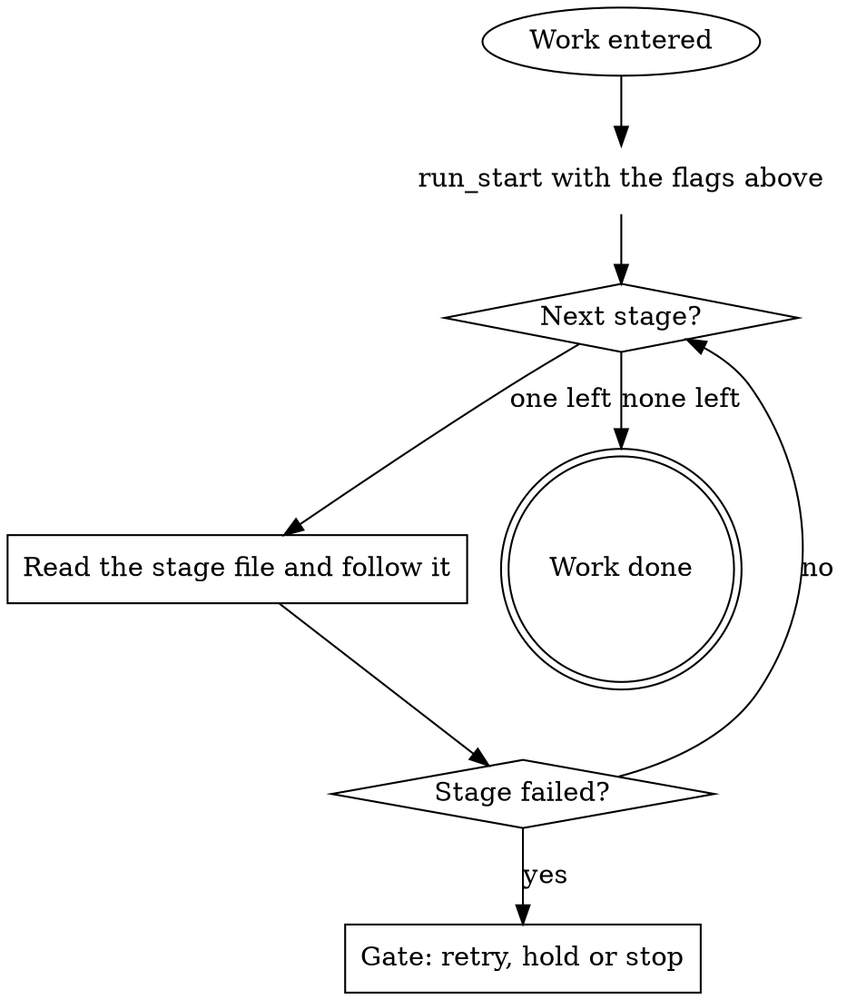

# work -- the pipeline orchestrator

You run one unit of work through eight stages. The graph below is the run:
follow its edges, and treat a move it does not show as a question for a
gate, never as a judgment call. Reads through the read tools and
`gitlab_get` are part of the step that needs them, not moves. Every `run_*`
call passes `runDb`.

## Stages

Walk them in this order. Each file sits beside this one; read it when its
stage starts, and follow it.

| Stage | Read | Consumes | Produces |
|---|---|---|---|
| `provision` | `${CLAUDE_SKILL_DIR}/{{verb.path:stage-provision}}` | `ticket` `repo` | `branch`
| `plan` | `${CLAUDE_SKILL_DIR}/{{verb.path:stage-plan}}` | `ticket` | `approach` `evidence-plan
| `gates` | `${CLAUDE_SKILL_DIR}/{{verb.path:stage-gates}}` | `approach` `worktree` | nothing |
| `evidence` | `${CLAUDE_SKILL_DIR}/{{verb.path:stage-evidence}}` | `evidence-plan` `worktree` |
| `implement` | `${CLAUDE_SKILL_DIR}/{{verb.path:stage-implement}}` | `approach` `branch` `workt
| `self-review` | `${CLAUDE_SKILL_DIR}/{{verb.path:stage-self-review}}` | `commits` | `review` |
| `ship` | `${CLAUDE_SKILL_DIR}/{{verb.path:stage-ship}}` | `commits` `ticket` | `mr` |
| `watch-ci` | `${CLAUDE_SKILL_DIR}/{{verb.path:stage-watch-ci}}` | `mr` `branch` | `ci` |

`run_start` takes these flags verbatim:

{{run-start.flags:work}}

## Running a stage

Stop at the first stage that fails and gate before you retry it.

### Edge cases

The orchestrator decides when a stage starts and when it is done. Small
changes ship sooner and review faster than large ones. When two rules
disagree, the stricter one wins and the plan says which.

### Before you start

If the ticket changes under you, re-read it and say what moved. When a
tool refuses, report the refusal and the input that caused it. Prefer a
short note in the run log over a long explanation in the chat.

### Reading the ticket

Leave the branch in a state another agent could pick up cold. Keep the
summary to what changed, what was checked and what is left. Nothing here
pushes on its own; the ship stage owns every push.

### Writing fields

Record what you decided and why in the field this stage produces. Treat a
skipped step as a decision and write down who made it. Every question to a
person goes through a gate, one question per gate.

### When something fails

A retry that changes nothing is a loop; stop and ask instead. Read the run
state before you act, and write each field the moment it exists. Name the
file and the line when you point at something in the code.

### Handing back

Use the read tools for reads, and keep them out of the move count. A stage
that cannot finish says so plainly and names the field it is missing. A
failing check is evidence, not a verdict; read it before you retry.

### Notes for reviewers

The evidence plan names what you will capture and where it will live. Keep
every write inside the worktree the run provisioned for this ticket. The
orchestrator decides when a stage starts and when it is done.

### Keeping the log short

Small changes ship sooner and review faster than large ones. When two
rules disagree, the stricter one wins and the plan says which. If the
ticket changes under you, re-read it and say what moved.

### Edge cases

When a tool refuses, report the refusal and the input that caused it.
Prefer a short note in the run log over a long explanation in the chat.
Leave the branch in a state another agent could pick up cold.

### Before you start

Keep the summary to what changed, what was checked and what is left.
Nothing here pushes on its own; the ship stage owns every push. Record
what you decided and why in the field this stage produces.

### Reading the ticket

Treat a skipped step as a decision and write down who made it. Every
question to a person goes through a gate, one question per gate. A retry
that changes nothing is a loop; stop and ask instead.

### Writing fields

Read the run state before you act, and write each field the moment it
exists. Name the file and the line when you point at something in the
code. Use the read tools for reads, and keep them out of the move count.

### When something fails

A stage that cannot finish says so plainly and names the field it is
missing. A failing check is evidence, not a verdict; read it before you
retry. The evidence plan names what you will capture and where it will
live.

Keep every write inside the worktree the run provisioned for this ticket.
The orchestrator decides when a stage starts and when it is done. Small
changes ship sooner and review faster than large ones.

When two rules disagree, the stricter one wins and the plan says which. If
the ticket changes under you, re-read it and say what moved. When a tool
refuses, report the refusal and the input that caused it.

### Handing back

Prefer a short note in the run log over a long explanation in the chat.
Leave the branch in a state another agent could pick up cold. Keep the
summary to what changed, what was checked and what is left.

### Notes for reviewers

Nothing here pushes on its own; the ship stage owns every push. Record
what you decided and why in the field this stage produces. Treat a skipped
step as a decision and write down who made it.

### Keeping the log short

Every question to a person goes through a gate, one question per gate. A
retry that changes nothing is a loop; stop and ask instead. Read the run
state before you act, and write each field the moment it exists.

### Edge cases

Name the file and the line when you point at something in the code. Use
the read tools for reads, and keep them out of the move count. A stage
that cannot finish says so plainly and names the field it is missing.

### Before you start

A failing check is evidence, not a verdict; read it before you retry. The
evidence plan names what you will capture and where it will live. Keep
every write inside the worktree the run provisioned for this ticket.

### Reading the ticket

The orchestrator decides when a stage starts and when it is done. Small
changes ship sooner and review faster than large ones. When two rules
disagree, the stricter one wins and the plan says which.

### Writing fields

If the ticket changes under you, re-read it and say what moved. When a
tool refuses, report the refusal and the input that caused it. Prefer a
short note in the run log over a long explanation in the chat.

### When something fails

Leave the branch in a state another agent could pick up cold. Keep the
summary to what changed, what was checked and what is left. Nothing here
pushes on its own; the ship stage owns every push.

### Handing back

Record what you decided and why in the field this stage produces. Treat a
skipped step as a decision and write down who made it. Every question to a
person goes through a gate, one question per gate.

### Notes for reviewers

A retry that changes nothing is a loop; stop and ask instead. Read the run
state before you act, and write each field the moment it exists. Name the
file and the line when you point at something in the code.

### Keeping the log short

Use the read tools for reads, and keep them out of the move count. A stage
that cannot finish says so plainly and names the field it is missing. A
failing check is evidence, not a verdict; read it before you retry.

### Edge cases

The evidence plan names what you will capture and where it will live. Keep
every write inside the worktree the run provisioned for this ticket. The
orchestrator decides when a stage starts and when it is done.

### Before you start

Small changes ship sooner and review faster than large ones. When two
rules disagree, the stricter one wins and the plan says which. If the
ticket changes under you, re-read it and say what moved.

### Reading the ticket

When a tool refuses, report the refusal and the input that caused it.
Prefer a short note in the run log over a long explanation in the chat.
Leave the branch in a state another agent could pick up cold.

## Model tiering

{{slot:tiering}}

## Gates

{{include:gate-protocol}}

## Wrap up

{{include:wrap-up-form}}
