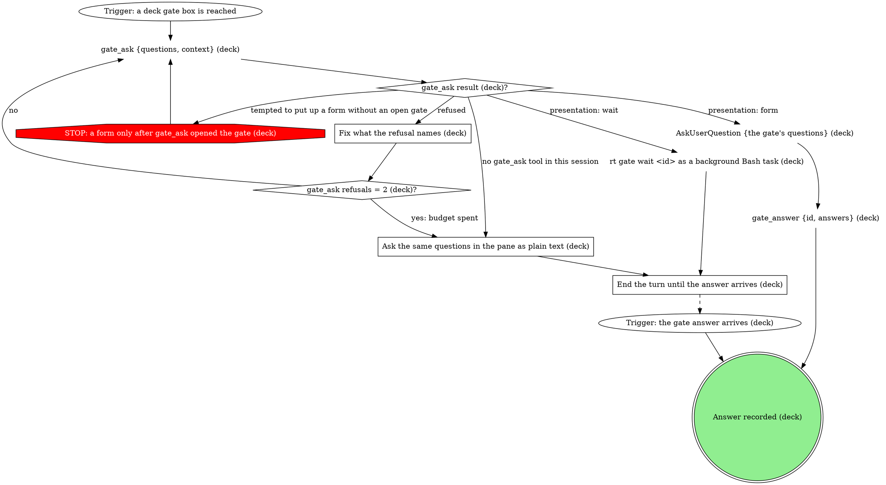

# Add your app to Deck

Deck is the local-app supervisor that owns this machine's launchd plists,
ports, and `<name>.localhost` / `<name>.mattstack` routes, and `deck` is the
sole writer of all of them. Deck does the mechanics: registering, supervising,
routing, the public edge. You own the judgment: which move the user wants,
what the manifest says, what the logs mean, and when a refusal goes to the
user through a gate.

## Flow

```dot
digraph deck_add_app {
    rankdir=TB;

    "Trigger: /deck:add-app, the user wants a local web app under deck" [shape=ellipse];
    "deck --version" [shape=plaintext];
    "deck installed (deck)?" [shape=diamond];
    "STOP: without deck, offer the installer; never hand-write plists" [shape=octagon style=filled fillcolor=red fontcolor=white];
    "Offer the deck installer and portless setup (deck)" [shape=box];
    "deck missing: installer offered (deck)" [shape=doublecircle];
    "What does the user want (deck)?" [shape=diamond];

    "mattstack.deck.json in the app (deck)?" [shape=diamond];
    "Manifest or quick add (deck)?" [shape=diamond];
    "STOP: deck is the only writer of plists, ports and routes" [shape=octagon style=filled fillcolor=red fontcolor=white];
    "deck config init" [shape=plaintext];
    "Edit the manifest (deck)" [shape=box];
    "deck register --dir <appDir>" [shape=plaintext];
    "deck register result (deck)?" [shape=diamond];
    "STOP: a refused register goes to its gate, never to a hand-written plist" [shape=octagon style=filled fillcolor=red fontcolor=white];
    "deck off-script gate: deck register refused" [shape=box];
    "Register answer (deck)?" [shape=diamond];
    "Register rounds = 2 (deck)?" [shape=diamond];
    "Supervised or routed (deck)?" [shape=diamond];
    "deck add <name> --cmd \"<start>\" --dir <path>" [shape=plaintext];
    "deck add <name> --port <N>" [shape=plaintext];
    "deck add result (deck)?" [shape=diamond];
    "STOP: a refused deck add goes to its gate, never to a hand-written plist" [shape=octagon style=filled fillcolor=red fontcolor=white];
    "deck off-script gate: deck add refused" [shape=box];
    "Add answer (deck)?" [shape=diamond];
    "Add rounds = 2 (deck)?" [shape=diamond];

    "deck status" [shape=plaintext];
    "Row up (deck)?" [shape=diamond];
    "deck url <name>" [shape=plaintext];
    "curl -s -o /dev/null -w '%{http_code}' <url>" [shape=plaintext];
    "Serves (deck)?" [shape=diamond];
    "Repair attempts = 2 (deck)?" [shape=diamond];
    "deck logs <name> --lines 100" [shape=plaintext];
    "Fix what the logs name (deck)" [shape=box];
    "Fix changed the manifest (deck)?" [shape=diamond];
    "deck restart <name>" [shape=plaintext];
    "deck gate: app will not come up" [shape=box];
    "Come-up answer (deck)?" [shape=diamond];
    "Come-up rounds = 2 (deck)?" [shape=diamond];
    "Come-up takes = 2 (deck)?" [shape=diamond];
    "Apply the human's fix (deck)" [shape=box];
    "Held (deck): app not serving, waiting on the user" [shape=doublecircle];
    "App registered and serving (deck)" [shape=doublecircle style=filled fillcolor=lightgreen];

    "Visibility move (deck)?" [shape=diamond];
    "deck publish <name> off" [shape=plaintext];
    "deck publish <name> on" [shape=plaintext];
    "Hand the deck password command to the user (deck)" [shape=box];
    "Password step handed to the user (deck)" [shape=doublecircle];
    "deck password <name> --clear" [shape=plaintext];
    "deck domain (check before access)" [shape=plaintext];
    "Domain bound for access (deck)?" [shape=diamond];
    "Access move (deck)?" [shape=diamond];
    "deck access <name> emails <a,b>" [shape=plaintext];
    "deck access <name> domains <c,d>" [shape=plaintext];
    "deck access <name> off" [shape=plaintext];
    "Visibility move result (deck)?" [shape=diamond];
    "Visibility set (deck)" [shape=doublecircle];
    "deck off-script gate: visibility move refused" [shape=box];
    "Visibility answer (deck)?" [shape=diamond];
    "Visibility rounds = 2 (deck)?" [shape=diamond];

    "deck domain" [shape=plaintext];
    "Domain move (deck)?" [shape=diamond];
    "Bound domain and edge health reported (deck)" [shape=doublecircle];
    "Check the Cloudflare prereqs (deck)" [shape=box];
    "Prereqs in place (deck)?" [shape=diamond];
    "STOP: the user sets the deck Cloudflare secrets" [shape=octagon style=filled fillcolor=red fontcolor=white];
    "Hand the prereq steps to the user (deck)" [shape=box];
    "Prereqs handed to the user (deck)" [shape=doublecircle];
    "STOP: the machine-wide domain binds only after the bind gate" [shape=octagon style=filled fillcolor=red fontcolor=white];
    "deck gate: bind the machine-wide domain" [shape=box];
    "Bind answer (deck)?" [shape=diamond];
    "Bind rounds = 2 (deck)?" [shape=diamond];
    "Held (deck): domain not bound" [shape=doublecircle];
    "deck domain <domain>" [shape=plaintext];
    "deck domain (verify the bind)" [shape=plaintext];
    "Bound with the edge healthy (deck)?" [shape=diamond];
    "Edge checks = 3 (deck)?" [shape=diamond];
    "Machine-wide domain bound (deck)" [shape=doublecircle];
    "deck off-script gate: domain bind failed" [shape=box];
    "Bind-failure answer (deck)?" [shape=diamond];
    "Bind-failure rounds = 2 (deck)?" [shape=diamond];
    "Bind runs after the failure = 2 (deck)?" [shape=diamond];
    "deck domain unbind" [shape=plaintext];
    "deck domain unbind result (deck)?" [shape=diamond];
    "STOP: --force only on the user's word (deck domain unbind)" [shape=octagon style=filled fillcolor=red fontcolor=white];
    "deck off-script gate: deck domain unbind refused" [shape=box];
    "Unbind answer (deck)?" [shape=diamond];
    "Unbind rounds = 2 (deck)?" [shape=diamond];
    "deck domain unbind --force" [shape=plaintext];
    "Forced unbind result (deck)?" [shape=diamond];
    "Public edge torn down (deck)" [shape=doublecircle];

    "deck status (teardown)" [shape=plaintext];
    "deck gate: confirm the teardown" [shape=box];
    "Teardown answer (deck)?" [shape=diamond];
    "Teardown rounds = 2 (deck)?" [shape=diamond];
    "Held (deck): the teardown waits on the user" [shape=doublecircle];
    "Row to remove (deck)?" [shape=diamond];
    "STOP: never remove deck's own row; it stops the platform" [shape=octagon style=filled fillcolor=red fontcolor=white];
    "Tell the user this row is never removed (deck)" [shape=box];
    "deck remove <name>" [shape=plaintext];
    "deck remove result (deck)?" [shape=diamond];
    "STOP: a 409 is relayed verbatim, never forced" [shape=octagon style=filled fillcolor=red fontcolor=white];
    "Relay the 409 message verbatim (deck)" [shape=box];
    "deck off-script gate: deck remove refused" [shape=box];
    "Remove answer (deck)?" [shape=diamond];
    "Remove rounds = 2 (deck)?" [shape=diamond];
    "deck remove <name> --force" [shape=plaintext];
    "Forced remove result (deck)?" [shape=diamond];
    "Rows left to remove (deck)?" [shape=diamond];
    "Domain listed for unbind (deck)?" [shape=diamond];
    "Unbind was part of a teardown (deck)?" [shape=diamond];
    "Report the teardown (deck)" [shape=box];
    "Teardown finished (deck)" [shape=doublecircle];

    "Held (deck): nothing changed after the refusal" [shape=doublecircle];
    "Report the refusal to the user (deck)" [shape=box];
    "Handed back to the user (deck)" [shape=doublecircle];

    "Trigger: /deck:add-app, the user wants a local web app under deck" -> "deck --version";
    "deck --version" -> "deck installed (deck)?";
    "deck installed (deck)?" -> "What does the user want (deck)?" [label="yes"];
    "deck installed (deck)?" -> "Offer the deck installer and portless setup (deck)" [label="no"];
    "deck installed (deck)?" -> "STOP: without deck, offer the installer; never hand-write plists" [label="tempted to hand-install the plists without deck"];
    "STOP: without deck, offer the installer; never hand-write plists" -> "Offer the deck installer and portless setup (deck)";
    "Offer the deck installer and portless setup (deck)" -> "deck missing: installer offered (deck)";

    "What does the user want (deck)?" -> "mattstack.deck.json in the app (deck)?" [label="register"];
    "What does the user want (deck)?" -> "Visibility move (deck)?" [label="visibility"];
    "What does the user want (deck)?" -> "deck domain" [label="public domain"];
    "What does the user want (deck)?" -> "deck status" [label="something wrong"];
    "What does the user want (deck)?" -> "deck status (teardown)" [label="teardown"];

    "mattstack.deck.json in the app (deck)?" -> "deck register --dir <appDir>" [label="yes"];
    "mattstack.deck.json in the app (deck)?" -> "Manifest or quick add (deck)?" [label="no"];
    "Manifest or quick add (deck)?" -> "deck config init" [label="manifest: preferred for anything kept"];
    "Manifest or quick add (deck)?" -> "Supervised or routed (deck)?" [label="quick add: no manifest"];
    "Manifest or quick add (deck)?" -> "STOP: deck is the only writer of plists, ports and routes" [label="tempted to hand-write a plist, alias or launchd entry"];
    "STOP: deck is the only writer of plists, ports and routes" -> "deck config init";
    "deck config init" -> "Edit the manifest (deck)";
    "Edit the manifest (deck)" -> "deck register --dir <appDir>";
    "deck register --dir <appDir>" -> "deck register result (deck)?";
    "deck register result (deck)?" -> "deck status" [label="registered"];
    "deck register result (deck)?" -> "deck off-script gate: deck register refused" [label="refused or errored"];
    "deck register result (deck)?" -> "STOP: a refused register goes to its gate, never to a hand-written plist" [label="tempted to write the plist deck refused to write"];
    "STOP: a refused register goes to its gate, never to a hand-written plist" -> "deck off-script gate: deck register refused";
    "deck off-script gate: deck register refused" -> "Register answer (deck)?";
    "Register answer (deck)?" -> "Register rounds = 2 (deck)?" [label="take: the human fixed it, register again"];
    "Register answer (deck)?" -> "Register rounds = 2 (deck)?" [label="iterate: a note to try again"];
    "Register answer (deck)?" -> "Held (deck): nothing changed after the refusal" [label="hold"];
    "Register answer (deck)?" -> "Report the refusal to the user (deck)" [label="hand back"];
    "Register rounds = 2 (deck)?" -> "Edit the manifest (deck)" [label="no: apply the note, if any, then register again"];
    "Register rounds = 2 (deck)?" -> "Report the refusal to the user (deck)" [label="yes: budget spent"];

    "Supervised or routed (deck)?" -> "deck add <name> --cmd \"<start>\" --dir <path>" [label="supervised: deck runs the start command"];
    "Supervised or routed (deck)?" -> "deck add <name> --port <N>" [label="routed: the user already runs it"];
    "deck add <name> --cmd \"<start>\" --dir <path>" -> "deck add result (deck)?";
    "deck add <name> --port <N>" -> "deck add result (deck)?";
    "deck add result (deck)?" -> "deck status" [label="added"];
    "deck add result (deck)?" -> "deck off-script gate: deck add refused" [label="refused or errored"];
    "deck add result (deck)?" -> "STOP: a refused deck add goes to its gate, never to a hand-written plist" [label="tempted to write the plist or route deck refused to write"];
    "STOP: a refused deck add goes to its gate, never to a hand-written plist" -> "deck off-script gate: deck add refused";
    "deck off-script gate: deck add refused" -> "Add answer (deck)?";
    "Add answer (deck)?" -> "Add rounds = 2 (deck)?" [label="take: the human fixed it, add again"];
    "Add answer (deck)?" -> "Add rounds = 2 (deck)?" [label="iterate: a note to try again"];
    "Add answer (deck)?" -> "Held (deck): nothing changed after the refusal" [label="hold"];
    "Add answer (deck)?" -> "Report the refusal to the user (deck)" [label="hand back"];
    "Add rounds = 2 (deck)?" -> "Manifest or quick add (deck)?" [label="no: choose again with the note"];
    "Add rounds = 2 (deck)?" -> "Report the refusal to the user (deck)" [label="yes: budget spent"];

    "deck status" -> "Row up (deck)?";
    "Row up (deck)?" -> "deck url <name>" [label="yes"];
    "Row up (deck)?" -> "Repair attempts = 2 (deck)?" [label="no"];
    "deck url <name>" -> "curl -s -o /dev/null -w '%{http_code}' <url>";
    "curl -s -o /dev/null -w '%{http_code}' <url>" -> "Serves (deck)?";
    "Serves (deck)?" -> "App registered and serving (deck)" [label="yes: a 2xx or 3xx status"];
    "Serves (deck)?" -> "Repair attempts = 2 (deck)?" [label="no: 000, 4xx or 5xx"];
    "Repair attempts = 2 (deck)?" -> "deck logs <name> --lines 100" [label="no"];
    "Repair attempts = 2 (deck)?" -> "deck gate: app will not come up" [label="yes: budget spent"];
    "deck logs <name> --lines 100" -> "Fix what the logs name (deck)";
    "Fix what the logs name (deck)" -> "Fix changed the manifest (deck)?";
    "Fix changed the manifest (deck)?" -> "deck register --dir <appDir>" [label="yes"];
    "Fix changed the manifest (deck)?" -> "deck restart <name>" [label="no"];
    "deck restart <name>" -> "deck status";
    "deck gate: app will not come up" -> "Come-up answer (deck)?";
    "Come-up answer (deck)?" -> "Come-up takes = 2 (deck)?" [label="take: the human names the fix"];
    "Come-up takes = 2 (deck)?" -> "Apply the human's fix (deck)" [label="no"];
    "Come-up takes = 2 (deck)?" -> "Report the refusal to the user (deck)" [label="yes: budget spent"];
    "Come-up answer (deck)?" -> "Come-up rounds = 2 (deck)?" [label="iterate: a note to try again"];
    "Come-up answer (deck)?" -> "Held (deck): app not serving, waiting on the user" [label="hold"];
    "Come-up answer (deck)?" -> "Report the refusal to the user (deck)" [label="hand back"];
    "Come-up rounds = 2 (deck)?" -> "deck logs <name> --lines 100" [label="no: repair again with the note"];
    "Come-up rounds = 2 (deck)?" -> "Report the refusal to the user (deck)" [label="yes: budget spent"];
    "Apply the human's fix (deck)" -> "Fix changed the manifest (deck)?";

    "Visibility move (deck)?" -> "deck publish <name> off" [label="hide from the public edge"];
    "Visibility move (deck)?" -> "deck publish <name> on" [label="re-expose on the public edge"];
    "Visibility move (deck)?" -> "Hand the deck password command to the user (deck)" [label="gate behind a password"];
    "Hand the deck password command to the user (deck)" -> "Password step handed to the user (deck)";
    "Visibility move (deck)?" -> "deck password <name> --clear" [label="remove the password"];
    "Visibility move (deck)?" -> "deck domain (check before access)" [label="Google sign-in gate"];
    "deck domain (check before access)" -> "Domain bound for access (deck)?";
    "Domain bound for access (deck)?" -> "Access move (deck)?" [label="yes"];
    "Domain bound for access (deck)?" -> "deck domain" [label="no: bind a domain first"];
    "Access move (deck)?" -> "deck access <name> emails <a,b>" [label="allow these emails"];
    "Access move (deck)?" -> "deck access <name> domains <c,d>" [label="allow these email domains"];
    "Access move (deck)?" -> "deck access <name> off" [label="remove the sign-in gate"];
    "deck publish <name> off" -> "Visibility move result (deck)?";
    "deck publish <name> on" -> "Visibility move result (deck)?";
    "deck password <name> --clear" -> "Visibility move result (deck)?";
    "deck access <name> emails <a,b>" -> "Visibility move result (deck)?";
    "deck access <name> domains <c,d>" -> "Visibility move result (deck)?";
    "deck access <name> off" -> "Visibility move result (deck)?";
    "Visibility move result (deck)?" -> "Visibility set (deck)" [label="applied"];
    "Visibility move result (deck)?" -> "Report the refusal to the user (deck)" [label="applied, but deck access warned the Cloudflare sync failed"];
    "Visibility move result (deck)?" -> "deck off-script gate: visibility move refused" [label="refused or errored"];
    "deck off-script gate: visibility move refused" -> "Visibility answer (deck)?";
    "Visibility answer (deck)?" -> "Visibility rounds = 2 (deck)?" [label="take: the human fixed it, move again"];
    "Visibility answer (deck)?" -> "Visibility rounds = 2 (deck)?" [label="iterate: a note to try again"];
    "Visibility answer (deck)?" -> "Held (deck): nothing changed after the refusal" [label="hold"];
    "Visibility answer (deck)?" -> "Report the refusal to the user (deck)" [label="hand back"];
    "Visibility rounds = 2 (deck)?" -> "Visibility move (deck)?" [label="no: choose again with the note"];
    "Visibility rounds = 2 (deck)?" -> "Report the refusal to the user (deck)" [label="yes: budget spent"];

    "deck domain" -> "Domain move (deck)?";
    "Domain move (deck)?" -> "Bound domain and edge health reported (deck)" [label="show only"];
    "Domain move (deck)?" -> "Check the Cloudflare prereqs (deck)" [label="bind or rebind"];
    "Domain move (deck)?" -> "deck domain unbind" [label="unbind"];
    "Check the Cloudflare prereqs (deck)" -> "Prereqs in place (deck)?";
    "Prereqs in place (deck)?" -> "Hand the prereq steps to the user (deck)" [label="no"];
    "Prereqs in place (deck)?" -> "deck gate: bind the machine-wide domain" [label="yes"];
    "Prereqs in place (deck)?" -> "STOP: the user sets the deck Cloudflare secrets" [label="tempted to set the Cloudflare secrets yourself"];
    "Prereqs in place (deck)?" -> "STOP: the machine-wide domain binds only after the bind gate" [label="tempted to bind before the user confirms the domain"];
    "STOP: the user sets the deck Cloudflare secrets" -> "Hand the prereq steps to the user (deck)";
    "STOP: the machine-wide domain binds only after the bind gate" -> "deck gate: bind the machine-wide domain";
    "Hand the prereq steps to the user (deck)" -> "Prereqs handed to the user (deck)";
    "deck gate: bind the machine-wide domain" -> "Bind answer (deck)?";
    "Bind answer (deck)?" -> "deck domain <domain>" [label="take: the user confirmed the domain"];
    "Bind answer (deck)?" -> "Bind rounds = 2 (deck)?" [label="iterate: a different domain or a note"];
    "Bind answer (deck)?" -> "Held (deck): domain not bound" [label="hold"];
    "Bind answer (deck)?" -> "Report the refusal to the user (deck)" [label="hand back"];
    "Bind rounds = 2 (deck)?" -> "deck gate: bind the machine-wide domain" [label="no: ask again with the note"];
    "Bind rounds = 2 (deck)?" -> "Report the refusal to the user (deck)" [label="yes: budget spent"];
    "deck domain <domain>" -> "deck domain (verify the bind)";
    "deck domain (verify the bind)" -> "Bound with the edge healthy (deck)?";
    "Bound with the edge healthy (deck)?" -> "Machine-wide domain bound (deck)" [label="yes"];
    "Bound with the edge healthy (deck)?" -> "deck off-script gate: domain bind failed" [label="no: the bind errored"];
    "Bound with the edge healthy (deck)?" -> "Edge checks = 3 (deck)?" [label="not yet: the connector is still starting or the edge is not ready"];
    "Edge checks = 3 (deck)?" -> "deck domain (verify the bind)" [label="no: wait, then check again"];
    "Edge checks = 3 (deck)?" -> "deck off-script gate: domain bind failed" [label="yes: budget spent"];
    "Bound with the edge healthy (deck)?" -> "STOP: the user sets the deck Cloudflare secrets" [label="tempted to fix a missing secret yourself"];
    "deck off-script gate: domain bind failed" -> "Bind-failure answer (deck)?";
    "Bind-failure answer (deck)?" -> "Bind runs after the failure = 2 (deck)?" [label="take: the user fixed the prereq, bind again"];
    "Bind runs after the failure = 2 (deck)?" -> "deck domain <domain>" [label="no: bind again"];
    "Bind runs after the failure = 2 (deck)?" -> "Report the refusal to the user (deck)" [label="yes: budget spent"];
    "Bind-failure answer (deck)?" -> "Bind-failure rounds = 2 (deck)?" [label="iterate: a note to try again"];
    "Bind-failure answer (deck)?" -> "Held (deck): domain not bound" [label="hold"];
    "Bind-failure answer (deck)?" -> "Report the refusal to the user (deck)" [label="hand back"];
    "Bind-failure rounds = 2 (deck)?" -> "Check the Cloudflare prereqs (deck)" [label="no: recheck the prereqs with the note"];
    "Bind-failure rounds = 2 (deck)?" -> "Report the refusal to the user (deck)" [label="yes: budget spent"];

    "deck domain unbind" -> "deck domain unbind result (deck)?";
    "deck domain unbind result (deck)?" -> "Unbind was part of a teardown (deck)?" [label="torn down"];
    "deck domain unbind result (deck)?" -> "deck off-script gate: deck domain unbind refused" [label="refused or errored"];
    "deck domain unbind result (deck)?" -> "STOP: --force only on the user's word (deck domain unbind)" [label="tempted to add --force unasked"];
    "STOP: --force only on the user's word (deck domain unbind)" -> "deck off-script gate: deck domain unbind refused";
    "deck off-script gate: deck domain unbind refused" -> "Unbind answer (deck)?";
    "Unbind answer (deck)?" -> "deck domain unbind --force" [label="take: the user asked for --force"];
    "Unbind answer (deck)?" -> "Unbind rounds = 2 (deck)?" [label="iterate: a note to try again"];
    "Unbind answer (deck)?" -> "Held (deck): nothing changed after the refusal" [label="hold"];
    "Unbind answer (deck)?" -> "Report the refusal to the user (deck)" [label="hand back"];
    "Unbind rounds = 2 (deck)?" -> "deck domain unbind" [label="no: unbind again with the note"];
    "Unbind rounds = 2 (deck)?" -> "Report the refusal to the user (deck)" [label="yes: budget spent"];
    "deck domain unbind --force" -> "Forced unbind result (deck)?";
    "Forced unbind result (deck)?" -> "Unbind was part of a teardown (deck)?" [label="torn down"];
    "Forced unbind result (deck)?" -> "Report the refusal to the user (deck)" [label="refused or errored"];
    "Unbind was part of a teardown (deck)?" -> "Report the teardown (deck)" [label="yes: reached from Domain listed for unbind"];
    "Unbind was part of a teardown (deck)?" -> "Public edge torn down (deck)" [label="no"];

    "deck status (teardown)" -> "deck gate: confirm the teardown";
    "deck gate: confirm the teardown" -> "Teardown answer (deck)?";
    "Teardown answer (deck)?" -> "Rows left to remove (deck)?" [label="take: remove exactly the listed rows and unbind the listed domain"];
    "Teardown answer (deck)?" -> "Teardown rounds = 2 (deck)?" [label="iterate: the user edits the list"];
    "Teardown answer (deck)?" -> "Held (deck): the teardown waits on the user" [label="hold"];
    "Teardown answer (deck)?" -> "Report the refusal to the user (deck)" [label="hand back"];
    "Teardown rounds = 2 (deck)?" -> "deck gate: confirm the teardown" [label="no"];
    "Teardown rounds = 2 (deck)?" -> "Report the refusal to the user (deck)" [label="yes: budget spent"];

    "Row to remove (deck)?" -> "deck remove <name>" [label="the user's app"];
    "Row to remove (deck)?" -> "Tell the user this row is never removed (deck)" [label="deck's own row, or a row managed by rt"];
    "Row to remove (deck)?" -> "STOP: never remove deck's own row; it stops the platform" [label="tempted to remove deck's own row anyway"];
    "STOP: never remove deck's own row; it stops the platform" -> "Tell the user this row is never removed (deck)";
    "Tell the user this row is never removed (deck)" -> "Rows left to remove (deck)?";
    "deck remove <name>" -> "deck remove result (deck)?";
    "deck remove result (deck)?" -> "Rows left to remove (deck)?" [label="removed"];
    "deck remove result (deck)?" -> "Relay the 409 message verbatim (deck)" [label="409: another registrar owns the app"];
    "deck remove result (deck)?" -> "deck off-script gate: deck remove refused" [label="any other refusal or error"];
    "deck remove result (deck)?" -> "STOP: a 409 is relayed verbatim, never forced" [label="tempted to force past the 409"];
    "STOP: a 409 is relayed verbatim, never forced" -> "Relay the 409 message verbatim (deck)";
    "Relay the 409 message verbatim (deck)" -> "Rows left to remove (deck)?";
    "deck off-script gate: deck remove refused" -> "Remove answer (deck)?";
    "Remove answer (deck)?" -> "deck remove <name> --force" [label="take: the user asked for --force"];
    "Remove answer (deck)?" -> "Remove rounds = 2 (deck)?" [label="iterate: a note to try again"];
    "Remove answer (deck)?" -> "Held (deck): nothing changed after the refusal" [label="hold"];
    "Remove answer (deck)?" -> "Report the refusal to the user (deck)" [label="hand back"];
    "Remove rounds = 2 (deck)?" -> "deck remove <name>" [label="no: remove again with the note"];
    "Remove rounds = 2 (deck)?" -> "Report the refusal to the user (deck)" [label="yes: budget spent"];
    "deck remove <name> --force" -> "Forced remove result (deck)?";
    "Forced remove result (deck)?" -> "Rows left to remove (deck)?" [label="removed"];
    "Forced remove result (deck)?" -> "Relay the 409 message verbatim (deck)" [label="409: another registrar owns the app"];
    "Forced remove result (deck)?" -> "Report the refusal to the user (deck)" [label="refused or errored"];
    "Rows left to remove (deck)?" -> "Row to remove (deck)?" [label="yes: a confirmed row not yet walked"];
    "Rows left to remove (deck)?" -> "Domain listed for unbind (deck)?" [label="no: every confirmed row walked"];
    "Domain listed for unbind (deck)?" -> "deck domain unbind" [label="yes"];
    "Domain listed for unbind (deck)?" -> "Report the teardown (deck)" [label="no"];
    "Report the teardown (deck)" -> "Teardown finished (deck)";

    "Report the refusal to the user (deck)" -> "Handed back to the user (deck)";
}
```

## Asking the human

Every gate box below is walked through this graph, and its answer diamond in
the flow graph branches on the recorded answer.



Pass each gate's questions as `{id, label, multi: false, options}` with
`{value, label, description}` options, set `recommended: true` on the option
each table lists first, and put the quoted material in `context`, never
trimmed. Each option's `value` is its edge keyword (`take`, `iterate`,
`hold`, `hand back`), so the answer maps straight onto the gate's answer
diamond. An answer that carries a fix, a domain or a note brings it in the
answer's `note` or `text`.

The presentation comes from `gate_ask`'s result alone: `gate_ask result (deck)?`
branches on the `presentation` it returns, never on your own choice or on
the launch flags. On `form`, put up the AskUserQuestion form and call
`gate_answer {id, answers}` with its answers in the same turn, back to
back: the answer is not recorded until `gate_answer` runs, so a turn that
ends between the two leaves the gate open and unanswered.

### End the turn until the answer arrives (deck)

End the turn with one line naming the gate and what it asks. Do not poll, do
not guess the answer, and do not keep changing deck state: the next turn
starts when the background wait finishes or the user replies in the pane, and
it reads that answer as the gate's.

### Fix what the refusal names (deck)

`gate_ask` refuses a malformed ask, most often a missing `context` on a
human-owned gate or a missing required field. Fix exactly what the refusal
names and ask once more with the same questions and options. A question over
4 options is not a refusal: the gate opens as `wait` and reports
`formCapExceeded`, so keep every question at 4 options or fewer.

### Ask the same questions in the pane as plain text (deck)

Write the gate's context, then each question with its options and their
one-sentence descriptions, as plain text in the reply. Never put up an
AskUserQuestion form here: no gate is open, so the pane's hook refuses it.

## Steps

### Offer the deck installer and portless setup (deck)

Say plainly that `deck` is not installed, then offer the two installs for
the user to run:

- deck itself: `curl -fsSL deck.mattstack.dev | sh`
- portless, which deck routes through: `npm install -g portless`, then
  `portless trust`, then `portless service install`

Nothing else happens this run. Without deck there is no supervisor to own
the service, so a plist, a portless alias or a launchd entry written by hand
is exactly what deck's `migrate` later has to clean up.

### Edit the manifest (deck)

`deck config init` scaffolds `mattstack.deck.json` in the app directory. The
minimum is `name` plus `commands.start`, the supervised service:

```json
{
  "name": "notes",
  "displayName": "Notes",
  "icon": "📝",
  "commands": { "start": "bun run start" },
  "env": { "NODE_ENV": "production" }
}
```

- `commands.start` is the supervised service. Every other `commands.<key>`
  (`build`, `deploy`, ...) becomes a dev-mode action button on the board,
  run as `deck cmd <app> <key>`; keys must match `[a-z0-9-]`.
- Never hand-set `port` for a supervised app: deck allocates one in
  11000 to 11999 and injects it into the service as `$PORT`. Set `port` only
  for a route-only app deck merely routes to, one with no `commands.start`.
- `env` is the service environment; deck layers `PORT` on top of it.

Manifest-first is preferred for anything the user keeps: it is reproducible,
travels with the app in git, and is what puts action buttons on the board.
On an iterate answer from the register gate, change what the note names and
keep the rest.

### deck off-script gate: deck register refused

Opens when `deck register --dir <appDir>` exits non-zero or prints an error,
and whenever you are tempted to write the plist deck refused to write.
Refusals that reach it include a port another process holds, a name another
row already has, and a manifest deck rejects (a bad `commands` key).

Context, quoted and never trimmed: deck's refusal text and the manifest it
read.

Take and iterate share one budget: both pass `Register rounds = 2 (deck)?`,
and the second spent round is reported instead of retried.

| Question                          | Options (recommended first)                                                                                                                                                                                                                                                                                                                                           |
| --------------------------------- | --------------------------------------------------------------------------------------------------------------------------------------------------------------------------------------------------------------------------------------------------------------------------------------------------------------------------------------------------------------------- |
| deck register refused. What next? | `take: fixed it, register again`: you fixed what the refusal names (freed the port, renamed the app), and I run deck register again. `iterate: try again with a note`: I edit the manifest with your note, then register again. `hold: leave it with you`: this run ends with nothing changed. `hand back: stop and report`: I report the refusal and what was tried. |

### Supervised or routed (deck)?

`deck add --cmd` splits its value on whitespace and runs the words directly,
with no shell, so `--cmd` takes a plain argv only (`bun run start`). A start
command with shell syntax (a pipe, `&&`, a redirect, quoting, `$VAR`, a
leading `FOO=bar` assignment) does not survive that split. It goes through
the manifest path instead, where deck runs a `commands.start` that needs a
shell under `sh -c`: decide this before choosing quick add: anything
shell-shaped needs the manifest path.

### deck off-script gate: deck add refused

Opens when a quick `deck add` exits non-zero or prints an error, and whenever
you are tempted to write the plist or route deck refused to write.

Context, quoted and never trimmed: deck's refusal text and the exact flags
passed (`--cmd` and `--dir`, or `--port`).

Take and iterate share one budget: both pass `Add rounds = 2 (deck)?`.

| Question                     | Options (recommended first)                                                                                                                                                                                                                                                                                                                                            |
| ---------------------------- | ---------------------------------------------------------------------------------------------------------------------------------------------------------------------------------------------------------------------------------------------------------------------------------------------------------------------------------------------------------------------- |
| deck add refused. What next? | `take: fixed it, add again`: you fixed what the refusal names, and I choose supervised or routed again and rerun deck add. `iterate: try again with a note`: I choose between a manifest and a quick add again, using your note. `hold: leave it with you`: this run ends with nothing changed. `hand back: stop and report`: I report the refusal and what was tried. |

### Fix what the logs name (deck)

Read the stderr `deck logs <name> --lines 100` tailed and fix the cause it
names in the app itself: a wrong start command, a missing env var, a build
that was never run, a server bound to a fixed port instead of `$PORT`. A fix
to `mattstack.deck.json` (a start command, an env var) goes through
`deck register --dir <appDir>` so deck syncs it; any other fix goes straight
to the restart.

An app added with `deck add` has no manifest. When its fix is a start
command or an env var, scaffold one with `deck config init` in the app
directory, give it the row's exact `name`, and take the manifest edge:
`deck register --dir <appDir>` re-syncs the existing record rather than
adding a second one. Never touch the plist or the route: those are deck's, and
`deck restart <name>` is the only kickstart.

### deck gate: app will not come up

Opens when two repair rounds have not brought the row `up` and serving.

Context, quoted and never trimmed: the app's `deck status` row, the last
`deck logs <name> --lines 100` output, and each of the two repairs tried
with what it changed.

Take passes `Come-up takes = 2 (deck)?`, iterate passes
`Come-up rounds = 2 (deck)?`; either one spent goes to the report.

| Question                             | Options (recommended first)                                                                                                                                                                                                                                                                                                                                                                                  |
| ------------------------------------ | ------------------------------------------------------------------------------------------------------------------------------------------------------------------------------------------------------------------------------------------------------------------------------------------------------------------------------------------------------------------------------------------------------------ |
| The app will not come up. What next? | `take: apply your named fix`: you name the fix, and I apply exactly that, register if it changed the manifest, and restart through deck. `iterate: repair again with a note`: I run another logs, fix and restart round using your note. `hold: leave it with you`: this run ends with the app registered but not serving. `hand back: stop and report`: I report the status row, the logs and both repairs. |

### Apply the human's fix (deck)

Apply exactly the fix the user named, nothing more. A manifest change then
syncs through `deck register --dir <appDir>`; anything else goes straight to
`deck restart <name>`. For an app added with `deck add`, a start command or
env fix means scaffolding a manifest with the row's exact `name`, as
`Fix what the logs name (deck)` describes, then registering it. A fix that means writing a plist, a route or a port by
hand is not one this skill applies: quote it back at the gate instead.

### Hand the deck password command to the user (deck)

`deck password <name>` prompts for the password on stdin, and an empty answer
clears it, so run by you it would clear the gate instead of setting one. Hand
the user `deck password <name>` to run in their own terminal, where they type
the password. You never choose, echo or store one.

### deck off-script gate: visibility move refused

Opens when a `deck publish`, `deck password <name> --clear` or `deck access`
call exits non-zero or prints an error, for example an access gate asked for
on a machine with no bound domain.

Context, quoted and never trimmed: deck's refusal text and the exact move
tried.

Take and iterate share one budget: both pass `Visibility rounds = 2 (deck)?`.

| Question                                      | Options (recommended first)                                                                                                                                                                                                                                                                                               |
| --------------------------------------------- | ------------------------------------------------------------------------------------------------------------------------------------------------------------------------------------------------------------------------------------------------------------------------------------------------------------------------- |
| The visibility change was refused. What next? | `take: fixed it, move again`: you fixed what the refusal names, and I pick the visibility move again. `iterate: try again with a note`: I pick the move again using your note. `hold: leave it with you`: this run ends with visibility unchanged. `hand back: stop and report`: I report the refusal and what was tried. |

### Check the Cloudflare prereqs (deck)

The public edge needs four things in place before `deck domain <domain>`
can bind:

1. `cloudflared` installed.
2. A one-time `cloudflared tunnel login`, which writes
   `~/.cloudflared/cert.pem`.
3. The domain's DNS zone on Cloudflare.
4. The deck secrets `cfZoneId` and `cfDnsToken`, the second a Cloudflare
   token with Zone.DNS:Edit.

The tunnel is one wildcard per domain, so a request for `notes.example.dev`
binds the wildcard on `example.dev`, never the full hostname.

Check each one you can read: `cloudflared` on PATH, the cert file for the
login, and `rt secrets list deck` for the two secret names (it prints names
only, never values). Treat the zone as present unless the user says
otherwise; a zone deck cannot find lands at the bind-failure gate.

### Hand the prereq steps to the user (deck)

List each missing prereq with the command the user runs:

- `brew install cloudflared`
- `cloudflared tunnel login` (opens a browser)
- move the domain's DNS zone to Cloudflare in its dashboard
- `rt secrets set deck cfZoneId` and `rt secrets set deck cfDnsToken`

The user runs every one, the secrets above all. A token pasted into chat is
never passed to any command: say so, and suggest rotating it since it sat in
the transcript. Running this skill again once the prereqs are in place picks
up at the bind gate.

### deck gate: bind the machine-wide domain

Opens once every prereq is in place, and again after each iterate round.
`deck domain` governs one wildcard Cloudflare tunnel for the whole machine:
`deck domain <domain>` routes `*.<domain>` at the gateway, so every published
app is then reachable at `https://<name>.<domain>`. Binding or rebinding
moves every published app's public hostname at once, so the domain is the
user's to confirm.

Context: the domain to bind (for example `example.dev`), what bare
`deck domain` showed (the bound domain or none, the tunnel identity, the
edge health), and every published app whose public hostname moves.

| Question                                | Options (recommended first)                                                                                                                                                                                                                                                                              |
| --------------------------------------- | -------------------------------------------------------------------------------------------------------------------------------------------------------------------------------------------------------------------------------------------------------------------------------------------------------- |
| Bind this domain for the whole machine? | `take: bind this domain`: I run deck domain with it and verify the edge. `iterate: a different domain`: you name another domain or add a note, and I ask again. `hold: leave it with you`: this run ends with no domain bound. `hand back: stop and report`: I report what was checked and bind nothing. |

### Edge checks = 3 (deck)?

A bind that succeeded can print "connector still starting, check deck domain
in a moment", and the verifying `deck domain` then shows the edge not ready
yet. That is not a failure until it outlasts the checks: wait about 10
seconds, then run `deck domain` again. Three checks spend the budget, and
an edge still not ready then goes to the bind-failure gate.

### deck off-script gate: domain bind failed

Opens when `deck domain <domain>` errors, or the verifying `deck domain`
still shows the edge not ready after three edge checks, and whenever you are tempted to fix a missing
secret yourself. A bind that asks for one step first (the tunnel login)
prints that command; a missing secret, a zone deck cannot find, and a
connector still not ready after three edge checks land here too. A rebind that deck refuses
because it would move live apps asks for `--force`: the forced rebind is the
user's to run, so quote it and let them run it or hand back.

Context, quoted and never trimmed: the bind's error text, or the verify's
edge line.

Take passes `Bind runs after the failure = 2 (deck)?`, iterate passes
`Bind-failure rounds = 2 (deck)?`; either one spent goes to the report.

| Question                           | Options (recommended first)                                                                                                                                                                                                                                                                                              |
| ---------------------------------- | ------------------------------------------------------------------------------------------------------------------------------------------------------------------------------------------------------------------------------------------------------------------------------------------------------------------------ |
| The domain bind failed. What next? | `take: fixed it, bind again`: you fixed the prereq the error names, and I run deck domain again. `iterate: recheck with a note`: I recheck the Cloudflare prereqs using your note. `hold: leave it with you`: this run ends with no domain bound. `hand back: stop and report`: I report the error and what was checked. |

### deck off-script gate: deck domain unbind refused

Opens when `deck domain unbind` exits non-zero, most often because
unbinding takes published apps offline, and whenever you are tempted to add
`--force` unasked. `--force` runs only when the user asks for it at this
gate.

Context, quoted and never trimmed: deck's refusal text, including every app
it names as going offline.

| Question                               | Options (recommended first)                                                                                                                                                                                                                                                                                                 |
| -------------------------------------- | --------------------------------------------------------------------------------------------------------------------------------------------------------------------------------------------------------------------------------------------------------------------------------------------------------------------------- |
| deck domain unbind refused. What next? | `hold: leave it with you`: this run ends with the edge still up. `take: force the unbind`: you ask for it, and I run deck domain unbind with --force. `iterate: unbind again with a note`: I act on your note, then run deck domain unbind again. `hand back: stop and report`: I report the refusal and the apps it names. |

### deck gate: confirm the teardown

Opens once `deck status (teardown)` runs, before any row is touched, and
again after each iterate round.

Context, quoted and never trimmed: every row `deck status` shows except
deck's own rows `deck` and `local` and every row whose managed-by column
(the fourth) is `rt`,
the bound domain `deck domain` reports
(or none), and what each removal does: `deck remove <name>` unregisters
that row, and `deck domain unbind` tears down the public edge and takes
every published app offline. The context also says, in these words:
"deck's own rows stay; removing deck itself is your `deck uninstall`, run
after this teardown finishes".

Recommended is `take` when the user's request already named the exact
rows and domain to remove; otherwise it is `iterate`, since a broad
request like "everything" needs the edited, confirmed list before
anything is removed.

Take and iterate share one budget: both pass `Teardown rounds = 2 (deck)?`,
and the second spent round is reported instead of retried.

| Question                                  | Options (recommended first)                                                                                                                                                                                                                                                                                                                                                                       |
| ----------------------------------------- | ------------------------------------------------------------------------------------------------------------------------------------------------------------------------------------------------------------------------------------------------------------------------------------------------------------------------------------------------------------------------------------------------- |
| Remove these rows and unbind this domain? | `take: remove the listed rows`: I run deck remove on exactly the rows named and deck domain unbind for exactly the domain named, nothing else. `iterate: edit the list`: you add, drop or correct a row or the domain, and I gate again with the updated list. `hold: leave it with you`: this run ends with nothing removed. `hand back: stop and report`: I report the list and remove nothing. |

### Tell the user this row is never removed (deck)

Two kinds of row are never removed here, and neither goes on the confirmed
list; one the user adds anyway reaches this box.

- Deck's own rows, `deck` and the legacy `local`. Each shares the
  supervisor's launchd label, so removing it stops the platform. Say that
  the row stays and why: removing deck itself is the user's own step,
  `deck uninstall` in their own terminal, which refuses while other records
  exist and so comes only after this teardown finishes. The agent never
  runs it.
- A row whose managed-by column (the fourth) in `deck status` is `rt`: a mattstack app deck
  manages for the mattstack install, not an app the user registered. Say
  that the row stays because the mattstack install owns it, and that a
  bundled app's row comes back on deck's next start anyway.

### Relay the 409 message verbatim (deck)

A 409 from `deck remove` means another registrar owns the app. The CLI shows
it only as the message naming the app's owner, with no status code, so
recognize it by that message. Relay it word for word, since it names the
command that owner uses, and never retry with `--force`. The row stays
registered, and the teardown moves on to the next confirmed row.

### deck off-script gate: deck remove refused

Opens when `deck remove <name>` fails with anything but a 409, including a
partial teardown that kept the record. `--force` runs only on the user's
word here.

Context, quoted and never trimmed: deck's refusal text.

| Question                        | Options (recommended first)                                                                                                                                                                                                                                                                                       |
| ------------------------------- | ----------------------------------------------------------------------------------------------------------------------------------------------------------------------------------------------------------------------------------------------------------------------------------------------------------------- |
| deck remove refused. What next? | `hold: leave it with you`: this run ends with the app still registered. `take: force the remove`: you ask for it, and I run deck remove with --force. `iterate: remove again with a note`: I act on your note, then run deck remove again. `hand back: stop and report`: I report the refusal and what was tried. |

### Report the teardown (deck)

Reached once the confirmed list has no rows left and names no domain to
unbind, or once the listed domain is unbound. The per-row loop is bounded
by that list: `Rows left to remove (deck)?` answers yes only for a
confirmed row not yet walked, so each row is walked once and nothing
outside the list is touched.

Report each confirmed row and what happened to it: removed, kept as deck's
own row or an rt row, or kept because another registrar owns it (with the 409 message
verbatim). Then restate that deck's own rows stay, and that removing deck
itself is the user's `deck uninstall`, run in their own terminal now that
this teardown has finished.

### Report the refusal to the user (deck)

The shared hand-back report: which deck command ran, what deck said
(verbatim), what was tried and how many times, and the state now. Nothing
changed beyond what the report names.

After a `deck access` move, read its stderr even on exit 0: "warning:
Cloudflare sync failed, see the app's row on the board" means deck saved
the access rule but Cloudflare did not take it. Quote that warning, say the
sign-in gate may not be enforced at the public edge yet, and point at the
app's row on the board. Never report it as visibility set.

## What the graph cannot show

- Every deck write changes state: run it against the user's actual app,
  its real directory, name and port, never a guess.
- `deck config init` and a bare `deck register` act on the current
  directory, so run `deck config init` from the app directory. This skill
  always passes `--dir <appDir>` to register, so it works from anywhere.
- Apps are published by default. Publish controls visibility only at the
  bound public domain; `<name>.localhost` and `<name>.mattstack` are always
  local to this machine, so a teammate on another machine reaches an app
  only once a domain is bound.
- Deck's `migrate` exists to clean up hand-written plists and portless
  aliases. That is why none are ever written, even when deck refuses or is
  missing.
- A teardown walks `Row to remove (deck)?` once per row on the confirmed
  list, and `Rows left to remove (deck)?` ends the loop when the list is
  used up, so the list bounds it. A list that names the domain then walks
  the unbind branch once. Deck's own rows and rt rows always reach the tell
  box, never `deck remove`.
- When `Domain bound for access (deck)?` answers no, the run binds a domain
  first and ends in the domain flow. Its closing message tells the user to
  ask for the access move again once the domain is bound.
- A registered supervised app already starts at login: the plists deck
  writes carry `RunAtLoad`, so nothing more is needed for that.
- The serve check reads the HTTP status of the URL `deck url <name>`
  printed: a 2xx or 3xx serves; `000` (nothing answered), a 4xx or a 5xx
  does not.
- Each counter counts per run (repair attempts, each gate's rounds, the
  take counters), except the edge checks, which restart with each bind. A
  counter diamond's `yes` edge is taken once its count has
  reached the number.

## Rationalizations

| Thought                                                                              | Reality                                                                                                                                                        |
| ------------------------------------------------------------------------------------ | -------------------------------------------------------------------------------------------------------------------------------------------------------------- |
| "removing it is the one fix the skill actually authorizes"                           | A refused register opens `deck off-script gate: deck register refused`. Removing another app to free its port is a teardown the user asks for, never a repair. |
| "the skill gives no troubleshooting path for a registration-time allocator conflict" | The register gate is that path: quote the refusal, and the user frees the port or answers iterate.                                                             |
| "the one-time, browser-based login the skill lists as a prereq for the tunnel"       | The tunnel login is the user's step, in the prereq hand-over list.                                                                                             |
| "Reply to [the user] in chat, not as a command"                                      | The prereq hand-over is the reply. A token pasted in chat is never passed to `rt secrets set`; the user runs it.                                               |
| "to tear it down"                                                                    | Teardown is the confirm gate, then `Row to remove (deck)?` once per confirmed row. Deck's own row reaches the tell box, never `deck remove`.                   |
| "rather than have me guess"                                                          | Keeping deck's row is settled, not an open question: the tell box says so and the loop moves on. A refused remove goes to its gate.                            |
| "pending the human's confirmation on how to proceed"                                 | A question to the user is `gate_ask`, per `Asking the human`, never a prose "pending confirmation".                                                            |
| "The request says everything, so I remove every row now."                            | The confirm gate lists the rows and the domain first; the user answers before anything is removed.                                                             |
