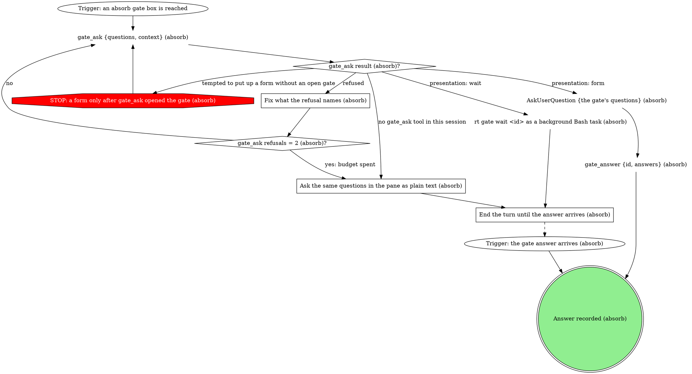

# gitq absorb runner

Take the dirty worktree and fold each change into the stack branch whose
commits own the edited lines, then restack so every branch sees the update.
A file no branch's commits own is left alone, still uncommitted in the
worktree. The `gitq` CLI owns the attribution, the commits and the cascade;
you own the judgment (whether each attribution is right, and what a
conflicted file should look like after the merge), and every question to the
human goes through a gate.

| flag | meaning |
|------|---------|
| `<repoPath>` (positional) | absolute path of the repo checkout |
| `<stackName>` (positional) | the tracked stack to absorb into |
| `--state <path>` | lifecycle status file the board polls (optional) |
| `--status-bin <path>` | absolute path to the gitq executable, called as `<status-bin> job-status` (optional) |

The `<repoPath>` positional may be any worktree of the repo, not just the
primary checkout: the board passes the dirty worktree picked in its absorb
menu, and absorb sources the uncommitted changes from that directory. Run
every command against the given `<repoPath>` as is.

## Flow

```dot
digraph gitq_absorb {
    rankdir=TB;

    "<status-bin> job-status <state> working \"absorbing into <stackName>\"" [shape=plaintext];
    "Trigger: /gitq:absorb <repoPath> <stackName> [--state <path> --status-bin <path>]" [shape=ellipse];
    "gitq --version (absorb)" [shape=plaintext];
    "gitq on PATH (absorb)?" [shape=diamond];
    "<status-bin> job-status <state> error \"gitq not on PATH\" (absorb)" [shape=plaintext];
    "gitq missing: told the human to run bun link in the gitq checkout (absorb)" [shape=doublecircle];
    "<status-bin> job-status <state> error \"<reason>\" (absorb)" [shape=plaintext];
    "Report the failure to the human (absorb)" [shape=box];
    "absorb failed: reported" [shape=doublecircle];
    "Held (absorb): cascade paused for the human" [shape=doublecircle];
    "<status-bin> job-status <state> done \"absorbed <n> files into <m> branches\"" [shape=plaintext];
    "Report what landed where (absorb)" [shape=box];
    "Changes absorbed (absorb)" [shape=doublecircle style=filled fillcolor=lightgreen];
    "Human asked for --at (absorb)?" [shape=diamond];
    "gitq -C <repoPath> absorb --stack <stackName> --preview --json" [shape=plaintext];
    "gitq -C <repoPath> absorb --stack <stackName> --at <branch> --preview --json" [shape=plaintext];
    "Preview result (absorb)?" [shape=diamond];
    "<status-bin> job-status <state> done \"nothing to absorb\"" [shape=plaintext];
    "<status-bin> job-status <state> done \"nothing attributable\"" [shape=plaintext];
    "Nothing absorbed: reported (absorb)" [shape=doublecircle];
    "STOP: an unapplied edit is reported, never re-aimed by a rerun" [shape=octagon style=filled fillcolor=red fontcolor=white];
    "Name the unattributed files to the human (absorb)" [shape=box];
    "Sanity-check each attributed file's branch (absorb)" [shape=box];
    "Attribution looks right (absorb)?" [shape=diamond];
    "STOP: --at names only a branch the human asked for" [shape=octagon style=filled fillcolor=red fontcolor=white];
    "absorb gate: surprising attribution" [shape=box];
    "Surprising attribution answer (absorb)?" [shape=diamond];
    "Attribution rounds = 2 (absorb)?" [shape=diamond];
    "Held (absorb): nothing committed" [shape=doublecircle];
    "gitq -C <repoPath> absorb --stack <stackName> --json" [shape=plaintext];
    "gitq -C <repoPath> absorb --stack <stackName> --at <branch> --json" [shape=plaintext];
    "Apply exit (absorb)?" [shape=diamond];
    "gitq -C <repoPath> sync --stack <stackName> --json (absorb restack)" [shape=plaintext];
    "Restack exit (absorb)?" [shape=diamond];
    "Held (absorb): the refusal waits on the human" [shape=doublecircle];
    "absorb off-script gate: gitq absorb refused" [shape=box];
    "Answer to \"gitq absorb refused\" (absorb)?" [shape=diamond];
    "Runs after \"gitq absorb refused\" = 2 (absorb)?" [shape=diamond];
    "<status-bin> job-status <state> conflict \"<n> conflicts on <branch> (commit <i>/<total>)\" (absorb)" [shape=plaintext];
    "Resolve the next conflicted file in <rebaseDir> (absorb)" [shape=box];
    "Resolution for this file (absorb)?" [shape=diamond];
    "STOP: every conflicted file is read and merged by hand (absorb)" [shape=octagon style=filled fillcolor=red fontcolor=white];
    "git -C <rebaseDir> add <file> (absorb)" [shape=plaintext];
    "git -C <rebaseDir> rm <file> (absorb)" [shape=plaintext];
    "Conflicted files left on this pause (absorb)?" [shape=diamond];
    "git -C <rebaseDir> status --porcelain (absorb)" [shape=plaintext];
    "Unmerged paths left (absorb)?" [shape=diamond];
    "gitq -C <repoPath> continue --stack <stackName> --json (absorb)" [shape=plaintext];
    "gitq continue exit (absorb)?" [shape=diamond];
    "STOP: the cascade moves only through gitq continue and gitq abort (absorb)" [shape=octagon style=filled fillcolor=red fontcolor=white];
    "Same pause as before (absorb)?" [shape=diamond];
    "Resolve attempts on this pause = 3 (absorb)?" [shape=diamond];
    "Conflict pauses = 20 (absorb)?" [shape=diamond];
    "gitq -C <repoPath> abort --stack <stackName> (absorb)" [shape=plaintext];
    "absorb gate: conflict needs human judgment" [shape=box];
    "absorb gate: this pause will not clear" [shape=box];
    "absorb gate: 20 conflict pauses this run" [shape=box];
    "Judgment answer (absorb)?" [shape=diamond];
    "Judgment rounds = 2 (absorb)?" [shape=diamond];
    "Apply the human's resolution (absorb judgment gate)" [shape=box];
    "Human kept or deleted the file (absorb judgment gate)?" [shape=diamond];
    "Pause answer (absorb)?" [shape=diamond];
    "Pause rounds = 2 (absorb)?" [shape=diamond];
    "Apply the human's resolution (absorb pause gate)" [shape=box];
    "Human kept or deleted the file (absorb pause gate)?" [shape=diamond];
    "Twenty-pause answer (absorb)?" [shape=diamond];
    "Twenty-pause rounds = 2 (absorb)?" [shape=diamond];
    "absorb off-script gate: gitq continue refused" [shape=box];
    "Answer to \"gitq continue refused\" (absorb)?" [shape=diamond];
    "Runs after \"gitq continue refused\" = 2 (absorb)?" [shape=diamond];
    "Held (absorb): the restack refusal waits on the human" [shape=doublecircle];
    "absorb off-script gate: the restack refused" [shape=box];
    "Answer to \"the restack refused\" (absorb)?" [shape=diamond];
    "Runs after \"the restack refused\" = 2 (absorb)?" [shape=diamond];
    "gitq absorb preview exit (absorb)?" [shape=diamond];
    "absorb off-script gate: the preview refused" [shape=box];
    "Answer to \"the preview refused\" (absorb)?" [shape=diamond];
    "Runs after \"the preview refused\" = 2 (absorb)?" [shape=diamond];
    "Held (absorb): the preview refusal waits on the human" [shape=doublecircle];

    "Trigger: /gitq:absorb <repoPath> <stackName> [--state <path> --status-bin <path>]" -> "gitq --version (absorb)";
    "gitq --version (absorb)" -> "gitq on PATH (absorb)?";
    "gitq on PATH (absorb)?" -> "<status-bin> job-status <state> working \"absorbing into <stackName>\"" [label="yes"];
    "gitq on PATH (absorb)?" -> "<status-bin> job-status <state> error \"gitq not on PATH\" (absorb)" [label="no"];
    "<status-bin> job-status <state> error \"gitq not on PATH\" (absorb)" -> "gitq missing: told the human to run bun link in the gitq checkout (absorb)";
    "<status-bin> job-status <state> error \"<reason>\" (absorb)" -> "Report the failure to the human (absorb)";
    "Report the failure to the human (absorb)" -> "absorb failed: reported";
    "<status-bin> job-status <state> done \"absorbed <n> files into <m> branches\"" -> "Report what landed where (absorb)";
    "Report what landed where (absorb)" -> "Changes absorbed (absorb)";
    "<status-bin> job-status <state> working \"absorbing into <stackName>\"" -> "Human asked for --at (absorb)?";
    "Human asked for --at (absorb)?" -> "gitq -C <repoPath> absorb --stack <stackName> --preview --json" [label="no"];
    "Human asked for --at (absorb)?" -> "gitq -C <repoPath> absorb --stack <stackName> --at <branch> --preview --json" [label="yes: the human named the branch"];
    "gitq -C <repoPath> absorb --stack <stackName> --preview --json" -> "gitq absorb preview exit (absorb)?";
    "gitq -C <repoPath> absorb --stack <stackName> --at <branch> --preview --json" -> "gitq absorb preview exit (absorb)?";
    "gitq absorb preview exit (absorb)?" -> "Preview result (absorb)?" [label="0"];
    "gitq absorb preview exit (absorb)?" -> "absorb off-script gate: the preview refused" [label="1 with a gitq: line"];
    "absorb off-script gate: the preview refused" -> "Answer to \"the preview refused\" (absorb)?";
    "Answer to \"the preview refused\" (absorb)?" -> "Runs after \"the preview refused\" = 2 (absorb)?" [label="take: the human fixed it, run it again"];
    "Answer to \"the preview refused\" (absorb)?" -> "Runs after \"the preview refused\" = 2 (absorb)?" [label="iterate: run it again with the note"];
    "Answer to \"the preview refused\" (absorb)?" -> "Held (absorb): the preview refusal waits on the human" [label="hold"];
    "Answer to \"the preview refused\" (absorb)?" -> "<status-bin> job-status <state> error \"<reason>\" (absorb)" [label="hand back"];
    "Runs after \"the preview refused\" = 2 (absorb)?" -> "Human asked for --at (absorb)?" [label="no"];
    "Runs after \"the preview refused\" = 2 (absorb)?" -> "<status-bin> job-status <state> error \"<reason>\" (absorb)" [label="yes: budget spent"];
    "Preview result (absorb)?" -> "<status-bin> job-status <state> done \"nothing to absorb\"" [label="attributed and unattributed both empty"];
    "Preview result (absorb)?" -> "<status-bin> job-status <state> error \"<reason>\" (absorb)" [label="unapplied not empty"];
    "Preview result (absorb)?" -> "STOP: an unapplied edit is reported, never re-aimed by a rerun" [label="tempted to rerun with or without --at so it lands somewhere"];
    "STOP: an unapplied edit is reported, never re-aimed by a rerun" -> "<status-bin> job-status <state> error \"<reason>\" (absorb)";
    "Preview result (absorb)?" -> "<status-bin> job-status <state> done \"nothing attributable\"" [label="attributed empty, unattributed not"];
    "Preview result (absorb)?" -> "Name the unattributed files to the human (absorb)" [label="something attributed"];
    "<status-bin> job-status <state> done \"nothing to absorb\"" -> "Nothing absorbed: reported (absorb)";
    "<status-bin> job-status <state> done \"nothing attributable\"" -> "Nothing absorbed: reported (absorb)";
    "Name the unattributed files to the human (absorb)" -> "Sanity-check each attributed file's branch (absorb)";
    "Sanity-check each attributed file's branch (absorb)" -> "Attribution looks right (absorb)?";
    "Attribution looks right (absorb)?" -> "gitq -C <repoPath> absorb --stack <stackName> --json" [label="yes"];
    "Attribution looks right (absorb)?" -> "gitq -C <repoPath> absorb --stack <stackName> --at <branch> --json" [label="the human already asked for --at <branch>"];
    "Attribution looks right (absorb)?" -> "absorb gate: surprising attribution" [label="a row looks wrong, or an unattributed file looks owned"];
    "Attribution looks right (absorb)?" -> "STOP: --at names only a branch the human asked for" [label="tempted to pick an --at target yourself"];
    "STOP: --at names only a branch the human asked for" -> "absorb gate: surprising attribution";
    "absorb gate: surprising attribution" -> "Surprising attribution answer (absorb)?";
    "Surprising attribution answer (absorb)?" -> "gitq -C <repoPath> absorb --stack <stackName> --json" [label="take: apply as previewed"];
    "Surprising attribution answer (absorb)?" -> "gitq -C <repoPath> absorb --stack <stackName> --at <branch> --json" [label="take: --at the branch the human named"];
    "Surprising attribution answer (absorb)?" -> "Attribution rounds = 2 (absorb)?" [label="iterate: preview again with the note"];
    "Surprising attribution answer (absorb)?" -> "Held (absorb): nothing committed" [label="hold"];
    "Surprising attribution answer (absorb)?" -> "<status-bin> job-status <state> error \"<reason>\" (absorb)" [label="hand back"];
    "Attribution rounds = 2 (absorb)?" -> "Human asked for --at (absorb)?" [label="no"];
    "Attribution rounds = 2 (absorb)?" -> "<status-bin> job-status <state> error \"<reason>\" (absorb)" [label="yes: budget spent"];
    "gitq -C <repoPath> absorb --stack <stackName> --json" -> "Apply exit (absorb)?";
    "gitq -C <repoPath> absorb --stack <stackName> --at <branch> --json" -> "Apply exit (absorb)?";
    "Apply exit (absorb)?" -> "<status-bin> job-status <state> done \"absorbed <n> files into <m> branches\"" [label="0"];
    "Apply exit (absorb)?" -> "gitq -C <repoPath> sync --stack <stackName> --json (absorb restack)" [label="1 asking for gitq sync: committed, restack backed out"];
    "Apply exit (absorb)?" -> "absorb off-script gate: gitq absorb refused" [label="1, any other reason"];
    "absorb off-script gate: gitq absorb refused" -> "Answer to \"gitq absorb refused\" (absorb)?";
    "Answer to \"gitq absorb refused\" (absorb)?" -> "Runs after \"gitq absorb refused\" = 2 (absorb)?" [label="take: the human fixed it, run it again"];
    "Answer to \"gitq absorb refused\" (absorb)?" -> "Runs after \"gitq absorb refused\" = 2 (absorb)?" [label="iterate: run it again with the note"];
    "Answer to \"gitq absorb refused\" (absorb)?" -> "Held (absorb): the refusal waits on the human" [label="hold"];
    "Answer to \"gitq absorb refused\" (absorb)?" -> "<status-bin> job-status <state> error \"<reason>\" (absorb)" [label="hand back"];
    "Runs after \"gitq absorb refused\" = 2 (absorb)?" -> "Human asked for --at (absorb)?" [label="no"];
    "Runs after \"gitq absorb refused\" = 2 (absorb)?" -> "<status-bin> job-status <state> error \"<reason>\" (absorb)" [label="yes: budget spent"];
    "gitq -C <repoPath> sync --stack <stackName> --json (absorb restack)" -> "Restack exit (absorb)?";
    "<status-bin> job-status <state> conflict \"<n> conflicts on <branch> (commit <i>/<total>)\" (absorb)" -> "Resolve the next conflicted file in <rebaseDir> (absorb)";
    "Resolve the next conflicted file in <rebaseDir> (absorb)" -> "Resolution for this file (absorb)?";
    "Resolution for this file (absorb)?" -> "git -C <rebaseDir> add <file> (absorb)" [label="merged both intents, or kept the file"];
    "Resolution for this file (absorb)?" -> "git -C <rebaseDir> rm <file> (absorb)" [label="honour a one-side deletion"];
    "Resolution for this file (absorb)?" -> "absorb gate: conflict needs human judgment" [label="the merged behavior cannot be inferred"];
    "Resolution for this file (absorb)?" -> "STOP: every conflicted file is read and merged by hand (absorb)" [label="tempted to take one side wholesale or strip the markers"];
    "STOP: every conflicted file is read and merged by hand (absorb)" -> "Resolve the next conflicted file in <rebaseDir> (absorb)";
    "git -C <rebaseDir> add <file> (absorb)" -> "Conflicted files left on this pause (absorb)?";
    "git -C <rebaseDir> rm <file> (absorb)" -> "Conflicted files left on this pause (absorb)?";
    "Conflicted files left on this pause (absorb)?" -> "Resolve the next conflicted file in <rebaseDir> (absorb)" [label="yes"];
    "Conflicted files left on this pause (absorb)?" -> "git -C <rebaseDir> status --porcelain (absorb)" [label="no"];
    "git -C <rebaseDir> status --porcelain (absorb)" -> "Unmerged paths left (absorb)?";
    "Unmerged paths left (absorb)?" -> "gitq -C <repoPath> continue --stack <stackName> --json (absorb)" [label="no"];
    "Unmerged paths left (absorb)?" -> "Resolve attempts on this pause = 3 (absorb)?" [label="yes"];
    "gitq -C <repoPath> continue --stack <stackName> --json (absorb)" -> "gitq continue exit (absorb)?";
    "gitq continue exit (absorb)?" -> "<status-bin> job-status <state> done \"absorbed <n> files into <m> branches\"" [label="0"];
    "gitq continue exit (absorb)?" -> "Same pause as before (absorb)?" [label="2"];
    "gitq continue exit (absorb)?" -> "absorb off-script gate: gitq continue refused" [label="1 with a gitq: line"];
    "gitq continue exit (absorb)?" -> "<status-bin> job-status <state> error \"<reason>\" (absorb)" [label="1 after JSON: the cascade ended with a failed branch"];
    "gitq continue exit (absorb)?" -> "STOP: the cascade moves only through gitq continue and gitq abort (absorb)" [label="tempted to drive the rebase with git directly"];
    "STOP: the cascade moves only through gitq continue and gitq abort (absorb)" -> "gitq -C <repoPath> continue --stack <stackName> --json (absorb)";
    "Same pause as before (absorb)?" -> "Resolve attempts on this pause = 3 (absorb)?" [label="yes: same branch and commit"];
    "Same pause as before (absorb)?" -> "Conflict pauses = 20 (absorb)?" [label="no: a new pause"];
    "Resolve attempts on this pause = 3 (absorb)?" -> "<status-bin> job-status <state> conflict \"<n> conflicts on <branch> (commit <i>/<total>)\" (absorb)" [label="no"];
    "Resolve attempts on this pause = 3 (absorb)?" -> "absorb gate: this pause will not clear" [label="yes: budget spent"];
    "Conflict pauses = 20 (absorb)?" -> "<status-bin> job-status <state> conflict \"<n> conflicts on <branch> (commit <i>/<total>)\" (absorb)" [label="no"];
    "Conflict pauses = 20 (absorb)?" -> "absorb gate: 20 conflict pauses this run" [label="yes: budget spent"];
    "absorb gate: conflict needs human judgment" -> "Judgment answer (absorb)?";
    "Judgment answer (absorb)?" -> "Apply the human's resolution (absorb judgment gate)" [label="take: the human names the resolution"];
    "Judgment answer (absorb)?" -> "Judgment rounds = 2 (absorb)?" [label="iterate: a note to try again"];
    "Judgment answer (absorb)?" -> "Held (absorb): cascade paused for the human" [label="hold"];
    "Judgment answer (absorb)?" -> "gitq -C <repoPath> abort --stack <stackName> (absorb)" [label="hand back"];
    "Judgment rounds = 2 (absorb)?" -> "Resolve the next conflicted file in <rebaseDir> (absorb)" [label="no: resolve again with the note"];
    "Judgment rounds = 2 (absorb)?" -> "gitq -C <repoPath> abort --stack <stackName> (absorb)" [label="yes: budget spent"];
    "Apply the human's resolution (absorb judgment gate)" -> "Human kept or deleted the file (absorb judgment gate)?";
    "Human kept or deleted the file (absorb judgment gate)?" -> "git -C <rebaseDir> add <file> (absorb)" [label="kept"];
    "Human kept or deleted the file (absorb judgment gate)?" -> "git -C <rebaseDir> rm <file> (absorb)" [label="deleted"];
    "absorb gate: this pause will not clear" -> "Pause answer (absorb)?";
    "Pause answer (absorb)?" -> "Apply the human's resolution (absorb pause gate)" [label="take: the human names the resolution"];
    "Pause answer (absorb)?" -> "Pause rounds = 2 (absorb)?" [label="iterate: a note to try again"];
    "Pause answer (absorb)?" -> "Held (absorb): cascade paused for the human" [label="hold"];
    "Pause answer (absorb)?" -> "gitq -C <repoPath> abort --stack <stackName> (absorb)" [label="hand back"];
    "Pause rounds = 2 (absorb)?" -> "Resolve the next conflicted file in <rebaseDir> (absorb)" [label="no: resolve again with the note"];
    "Pause rounds = 2 (absorb)?" -> "gitq -C <repoPath> abort --stack <stackName> (absorb)" [label="yes: budget spent"];
    "Apply the human's resolution (absorb pause gate)" -> "Human kept or deleted the file (absorb pause gate)?";
    "Human kept or deleted the file (absorb pause gate)?" -> "git -C <rebaseDir> add <file> (absorb)" [label="kept"];
    "Human kept or deleted the file (absorb pause gate)?" -> "git -C <rebaseDir> rm <file> (absorb)" [label="deleted"];
    "absorb gate: 20 conflict pauses this run" -> "Twenty-pause answer (absorb)?";
    "Twenty-pause answer (absorb)?" -> "<status-bin> job-status <state> conflict \"<n> conflicts on <branch> (commit <i>/<total>)\" (absorb)" [label="take: keep going for another 20"];
    "Twenty-pause answer (absorb)?" -> "Twenty-pause rounds = 2 (absorb)?" [label="iterate: keep going with a note"];
    "Twenty-pause answer (absorb)?" -> "Held (absorb): cascade paused for the human" [label="hold"];
    "Twenty-pause answer (absorb)?" -> "gitq -C <repoPath> abort --stack <stackName> (absorb)" [label="hand back"];
    "Twenty-pause rounds = 2 (absorb)?" -> "<status-bin> job-status <state> conflict \"<n> conflicts on <branch> (commit <i>/<total>)\" (absorb)" [label="no"];
    "Twenty-pause rounds = 2 (absorb)?" -> "gitq -C <repoPath> abort --stack <stackName> (absorb)" [label="yes: budget spent"];
    "absorb off-script gate: gitq continue refused" -> "Answer to \"gitq continue refused\" (absorb)?";
    "Answer to \"gitq continue refused\" (absorb)?" -> "Runs after \"gitq continue refused\" = 2 (absorb)?" [label="take: the human fixed it, run it again"];
    "Answer to \"gitq continue refused\" (absorb)?" -> "Runs after \"gitq continue refused\" = 2 (absorb)?" [label="iterate: run it again with the note"];
    "Answer to \"gitq continue refused\" (absorb)?" -> "Held (absorb): cascade paused for the human" [label="hold"];
    "Answer to \"gitq continue refused\" (absorb)?" -> "gitq -C <repoPath> abort --stack <stackName> (absorb)" [label="hand back"];
    "Runs after \"gitq continue refused\" = 2 (absorb)?" -> "gitq -C <repoPath> continue --stack <stackName> --json (absorb)" [label="no"];
    "Runs after \"gitq continue refused\" = 2 (absorb)?" -> "gitq -C <repoPath> abort --stack <stackName> (absorb)" [label="yes: budget spent"];
    "gitq -C <repoPath> abort --stack <stackName> (absorb)" -> "<status-bin> job-status <state> error \"<reason>\" (absorb)";
    "Restack exit (absorb)?" -> "<status-bin> job-status <state> done \"absorbed <n> files into <m> branches\"" [label="0"];
    "Restack exit (absorb)?" -> "<status-bin> job-status <state> conflict \"<n> conflicts on <branch> (commit <i>/<total>)\" (absorb)" [label="2: paused on a conflict"];
    "Restack exit (absorb)?" -> "absorb off-script gate: the restack refused" [label="1"];
    "absorb off-script gate: the restack refused" -> "Answer to \"the restack refused\" (absorb)?";
    "Answer to \"the restack refused\" (absorb)?" -> "Runs after \"the restack refused\" = 2 (absorb)?" [label="take: the human fixed it, run it again"];
    "Answer to \"the restack refused\" (absorb)?" -> "Runs after \"the restack refused\" = 2 (absorb)?" [label="iterate: run it again with the note"];
    "Answer to \"the restack refused\" (absorb)?" -> "Held (absorb): the restack refusal waits on the human" [label="hold"];
    "Answer to \"the restack refused\" (absorb)?" -> "<status-bin> job-status <state> error \"<reason>\" (absorb)" [label="hand back"];
    "Runs after \"the restack refused\" = 2 (absorb)?" -> "gitq -C <repoPath> sync --stack <stackName> --json (absorb restack)" [label="no"];
    "Runs after \"the restack refused\" = 2 (absorb)?" -> "<status-bin> job-status <state> error \"<reason>\" (absorb)" [label="yes: budget spent"];
}
```

Every `<status-bin> job-status` node is skipped when `--state` and
`--status-bin` were not given (a manual launch), and a hold writes nothing,
so the board badge keeps `conflict` or `working` while the pane waits.

## Asking the human

Every gate box below is walked through this graph, and its answer diamond in
the flow graph branches on the recorded answer.



Pass each gate's questions as `{id, label, multi: false, options}` with
`{value, label, description}` options, and put the quoted material in
`context`, never trimmed. Each first-question option's `value` is its edge
keyword (`take`, `iterate`, `hold`, `hand back`), so the answer maps
straight onto the gate's answer diamond; the one second question, at
`absorb gate: surprising attribution`, says how its values map. An answer
that carries a branch, a resolution or a note brings it in the answer's
`note` or `text`.

The presentation comes from `gate_ask`'s result alone: `gate_ask result (absorb)?`
branches on the `presentation` it returns, never on your own choice or on
the launch flags. On `form`, put up the AskUserQuestion form and call
`gate_answer {id, answers}` with its answers in the same turn, back to
back: the answer is not recorded until `gate_answer` runs, so a turn that
ends between the two leaves the gate open and unanswered.

### End the turn until the answer arrives (absorb)

End the turn with one line saying what the gate asks. Do not poll, do not
guess the answer, and do not keep working on the stack: the next turn starts
when the background wait finishes or the human replies in the pane, and it
reads that answer as the gate's.

### Fix what the refusal names (absorb)

`gate_ask` refuses a malformed ask, such as no `context` on a human-owned
gate or a missing required field. Fix exactly what the refusal names and ask
again with the same questions and options. A question over 4 options is not
a refusal: the gate opens as `wait` and reports `formCapExceeded`, so keep
every question at 4 options or fewer.

### Ask the same questions in the pane as plain text (absorb)

Write the gate's context, then each question with its options and their
one-sentence descriptions, as plain text in the reply. Never put up an
AskUserQuestion form here: no gate is open, so the pane's hook refuses it.

## Steps

### absorb off-script gate: the preview refused

Opens when the preview exits 1 with a `gitq:` line on stderr and nothing on
stdout: a stack name gitq does not track, or an `--at` that is malformed or
names a branch outside the stack. Nothing has been committed. Fixing what
the refusal names is the human's call; an `--at` target stays theirs to
correct, never yours to pick.

Context: the `gitq:` stderr line verbatim, plus the `--at` the preview
carried, if any.

| Question | Options (recommended first) |
|---|---|
| The absorb preview refused. What next? | `take: fixed it, run again`: you fixed what the refusal names, and I run the preview again. `iterate: run again with a note`: I act on your note, then run the preview again. `hold: leave it with you`: nothing is committed, and this run ends with no status written. `hand back: stop with an error`: I mark the run failed with the refusal as the reason. |

### Name the unattributed files to the human (absorb)

Read the preview's `result`: `attributed` maps each branch to the files it
owns, `unattributed` lists the files absorb will leave in the worktree, and
`unapplied` (a subset of `unattributed`) lists files whose edit does not
replay onto the branch it was attributed to: the `--at` target, or the
branch line attribution picked. Absorb commits the
attributed files and nothing else; the rest stay in the worktree,
uncommitted, exactly as found.

Before anything is applied, name every `unattributed` file to the human, by
path. This is the moment they can act on it; the done report is too late. A
file they expected absorbed showing up here usually means no branch's
commits touch its lines yet: a new file, or the wrong branch doing that
work. With `unattributed` empty, say so in one line.

### Sanity-check each attributed file's branch (absorb)

Attribution goes by the lines the edit is on, not just by which branch
touched the file, so a fix to an ancestor's lines lands on the ancestor even
when a later branch edited elsewhere in the same file. For each `attributed`
row, ask whether the change belongs to that branch's work, reading the
branch's own commits when the answer is not obvious.

Trust the engine on clean, boring mappings: that is the `yes` edge. A
surprising row (a file headed to a branch whose work has nothing to do with
it), or an unattributed file that looks like a branch owns it, is the gate
edge: ask before committing anything.

The `--at <branch>` edge is taken only when the human asked for `--at` on
this absorb, naming the branch, and the preview ran with that same `--at`.
The human asks for it when they already know where a fix belongs (usually a
branch's pipeline is red on exactly that line), and it sends everything
there. A remark about another file or an earlier fix is not that request.
Never pick an `--at` target yourself to make an attribution look tidier, and
never redirect a file by hand: gitq's preview is the mapping, your job is to
veto surprising rows, and moving a change to a different branch is
gitq:restructure's job or the human's.

### absorb gate: surprising attribution

Opens when a previewed row looks wrong or an unattributed file looks owned,
and whenever you are tempted to choose an `--at` target yourself. Nothing is
committed while it waits.

Context, quoted and never trimmed: the preview's `attributed` rows and
`unattributed` list verbatim, and for each flagged file one sentence on why
it looks wrong (what the branch's own commits are about).

| Question | Options (recommended first) |
|---|---|
| This attribution looks off. What next? | `take: go ahead and apply`: I apply to the target you pick in the next question. `iterate: preview again with a note`: I act on your note, then preview and check the attribution again. `hold: leave it uncommitted`: nothing is committed, and this run ends with no status written. `hand back: stop with an error`: nothing is committed, and I mark the run failed as declined at the attribution gate. |
| On take, where do the changes go? | `as previewed`: every file goes where gitq's preview put it, row for row. `--at the branch I name`: every change goes to the one branch you name in your answer's note. |

The second question splits take onto its two edges: `as previewed` is
`take: apply as previewed`, and `--at the branch I name` is
`take: --at the branch the human named`, with the branch taken from the
answer's `note` or `text`. When the answer picks `--at the branch I name`
but names no branch, never infer one: count the answer as an iterate round
and ask again. An iterate note steers the next preview; it never licenses
redirecting a file yourself.

After two iterate rounds the budget is spent: the next iterate answer writes
the error "attribution not settled after 2 rounds". On hand back the reason
is "attribution declined: <file> headed to <branch>".

### absorb off-script gate: gitq absorb refused

Opens when the apply exits 1 for anything but the restack ask. A hard
refusal prints a `gitq:` line on stderr with nothing on stdout: the stack
has a paused cascade, or an attributed branch is checked out in another
worktree. Otherwise the normal
JSON comes first: attributions with `success: false`, or a
`result.recovery` naming where the human's work now sits (a stash absorb
kept, a branch it could not leave). Fixing any of it is the human's call.
The take and iterate answers run the preview again, not the apply, since
the refusal may have changed what is left to absorb.

Context: the `gitq:` stderr line verbatim, or the failing JSON entries and
the `recovery` text verbatim.

| Question | Options (recommended first) |
|---|---|
| gitq absorb refused. What next? | `take: fixed it, run again`: you fixed what the refusal names, and I preview again and carry on. `iterate: run again with a note`: I act on your note, then preview again and carry on. `hold: leave it with you`: this run ends and writes no status. `hand back: stop with an error`: I mark the run failed with the refusal as the reason. |

### absorb off-script gate: the restack refused

Opens when the restack's `gitq sync` exits 1. The absorbed commits are
already on their branches; only the restack is outstanding. A hard failure
prints a `gitq:` line on stderr with nothing on stdout; a per-branch failure
emits the normal JSON first, and the failing entry's `success: false` says
what broke.

Context: the `gitq:` stderr line verbatim, or the failing JSON entry, plus
the branches the absorb committed to.

| Question | Options (recommended first) |
|---|---|
| The restack refused. What next? | `take: fixed it, run again`: you fixed what the refusal names, and I run the restack again. `iterate: run again with a note`: I run the restack again after acting on your note. `hold: leave it with you`: the commits stay on their branches without a restack, and this run ends with no status written. `hand back: stop with an error`: I mark the run failed with the refusal as the reason. |

### Resolve the next conflicted file in <rebaseDir> (absorb)

`<rebaseDir>` is `pauseInfo.worktreePath` (a gitq work slot), else
`pauseInfo.treePath`, else `<repoPath>` only when both are absent. The
launch worktree is not where the rebase is; never resolve there.

`pauseInfo` says where the cascade stopped: `currentBranch`,
`commitIndex`/`commitTotal`, `conflictFiles` (always present) and
`conflictTypes` (when present, a two-letter porcelain code per file: `UU`
both modified, `AA` both added, `DU`/`UD` deleted on one side).

For the file at hand, read its conflict markers, get both sides' intent
from `git -C <rebaseDir> log --oneline --merge` and the surrounding code,
then edit the file to the content that preserves both intents. A `DU`/`UD`
file is a deliberate call between keeping it and honouring the deletion.
When both sides rewrote the same logic to different ends and the merged
behavior cannot be read from the code, that is the judgment gate, never a
guess and never an abort.

When a gate's take answer named this file's content, or keeping or
deleting it, that is the resolution: write it as given and go straight to
staging, without merging on top of it. A note from a gate's iterate answer
steers the next attempt on the files it names.

### absorb gate: conflict needs human judgment

Opens when both sides rewrote the same logic to different ends and the right
merged behavior is not inferable from the code.

Context: the file path and the conflicted hunk with both sides verbatim,
each side's commit from `git -C <rebaseDir> log --oneline --merge`, and one
sentence on why the merge cannot be inferred.

| Question | Options (recommended first) |
|---|---|
| How should this conflict resolve? | `take: I name the resolution`: you give the merged content, or keep or delete the file, and I apply it. `iterate: try again with a note`: I resolve the file again, steered by your note. `hold: leave the cascade paused`: the pause stays for you and this run ends with the badge on conflict. `hand back: abort the cascade`: I abort the rebase for this stack and mark the run failed. |

On hand back the error reason is "conflict on <file> needs human judgment:
<why>". Two iterate rounds spend the budget: the next iterate answer aborts
the cascade and writes "conflict on <file> not settled after 2 rounds".

### Apply the human's resolution (absorb judgment gate)

Write exactly what the human named into the file in `<rebaseDir>`, or
follow their keep or delete. Do not re-merge on top of their answer.

### absorb gate: this pause will not clear

Opens when `gitq continue` re-paused on the same `currentBranch` and
`commitIndex`, or unmerged paths survived staging, three times on one pause.

Context: the latest `pauseInfo.conflictFiles` and the unmerged lines of
`git -C <rebaseDir> status --porcelain`, quoted, plus one line per attempt
on what was tried.

| Question | Options (recommended first) |
|---|---|
| This pause keeps coming back. What next? | `take: I name the resolution`: you give the content for the files still conflicted, and I apply it. `iterate: try again with a note`: I resolve the files again, steered by your note. `hold: leave the cascade paused`: the pause stays for you and this run ends with the badge on conflict. `hand back: abort the cascade`: I abort the rebase for this stack and mark the run failed. |

An iterate does not restart the resolve-attempt count: this pause's count
stays at 3, so when the next continue re-pauses on the same branch and
commit, or unmerged paths survive staging again, the run comes straight back
to this gate, and `Pause rounds = 2 (absorb)?` bounds how often. A new pause
starts its own count.

On hand back the error reason is "pause on <branch> (commit <i>/<total>)
will not clear: <files still conflicted>". Two iterate rounds spend the
budget: the next iterate answer aborts the cascade and writes "pause on
<branch> (commit <i>/<total>) not settled after 2 rounds".

### Apply the human's resolution (absorb pause gate)

Write exactly what the human named into each file it covers in
`<rebaseDir>`, or follow their keep or delete, one file at a time. Do not
re-merge on top of their answer.

### absorb gate: 20 conflict pauses this run

Opens on the twentieth distinct pause this run (a new `currentBranch` or
`commitIndex` each time). Take restarts the count; iterate restarts it too
and carries the note into the next resolutions.

Context: the stack name, the branch and commit of each pause so far with one
line on how each resolved, and the current `pauseInfo`.

| Question | Options (recommended first) |
|---|---|
| Twenty conflict pauses so far. Keep going? | `take: keep going for another 20`: I carry on resolving and ask again after 20 more pauses. `iterate: keep going with a note`: I carry on, steered by your note. `hold: leave the cascade paused`: the pause stays for you and this run ends with the badge on conflict. `hand back: abort the cascade`: I abort the rebase for this stack and mark the run failed. |

On hand back the error reason is "stopped after <n> conflict pauses". Two
iterate rounds spend the budget: the next iterate answer aborts the cascade
and writes "conflict pauses past 20 not settled after 2 rounds".

### absorb off-script gate: gitq continue refused

Opens when `gitq continue` exits 1 with a `gitq:` line on stderr: a
refusal, with the lease still parked and the pause intact. Fixing what the
refusal names is the human's call, not this run's.

An exit 1 after the normal JSON is not this gate. It means the rebase's
continue failed with no conflicted files: the failing `results` entry has
`success: false` and the error "rebase --continue failed", and gitq has
already ended the cascade, cleared its pause and released the lease. There
is nothing left to continue or abort, so that edge writes the error "gitq
continue failed on <branch>: rebase --continue failed" and reports.

Context: the `gitq:` stderr line verbatim.

| Question | Options (recommended first) |
|---|---|
| gitq continue refused. What next? | `take: fixed it, run again`: you fixed what the refusal names, and I run the continue again. `iterate: run again with a note`: I run the continue again after acting on your note. `hold: leave the cascade paused`: the pause stays for you and this run ends with the badge on conflict. `hand back: abort the cascade`: I abort the rebase for this stack and mark the run failed. |

A hold reaches `Held (absorb): cascade paused for the human`: the pause
stays in `<rebaseDir>` for the human. On hand back the error reason is "gitq
continue refused on <branch>: <the gitq: line>".

### Report the failure to the human (absorb)

Say why the run stopped, in the words of the reason just written. The
error write's reason is the string the board shows:

- An unapplied edit, reason "<files> will not replay onto <branch>", where
  `<branch>` is the branch each file was attributed to: name each
  `unapplied` file and that branch. Nothing was committed. The fix is the
  human's to choose and relaunch with. When the preview carried `--at`: a
  different `--at` target, or splitting the edit. When line attribution
  picked the branch: splitting the edit so each part replays where it
  belongs, or an `--at` naming a branch it does replay onto.
- A hand back at the attribution gate, reason "attribution declined: <file>
  headed to <branch>", or its budget spent, reason "attribution not settled
  after 2 rounds": nothing was committed; quote the rows in question.
- A refusal handed back or its budget spent: quote the `gitq:` line, or the
  failing entries and the `recovery` text. After a preview refusal, nothing
  was committed. After a restack refusal, say the absorbed commits are on
  their branches and gitq:sync restacks them.
- A hand back at the continue-refused gate, reason "gitq continue refused
  on <branch>: <the gitq: line>": quote the line.
- A continue that ended the cascade with a failed branch, reason "gitq
  continue failed on <branch>: rebase --continue failed": gitq released the
  lease, but the rebase may still be in progress in the slot
  (`<rebaseDir>`). Name the slot and the branch so the human can look there
  before running gitq:sync.
- A hand back at the judgment gate, reason "conflict on <file> needs human
  judgment: <why>", or its budget spent, reason "conflict on <file> not
  settled after 2 rounds": lay out the conflict and both sides so the human
  can resolve it by hand.
- A hand back at the pause gate, reason "pause on <branch> (commit
  <i>/<total>) will not clear: <files still conflicted>", or its budget
  spent, reason "pause on <branch> (commit <i>/<total>) not settled after 2
  rounds": list each attempt and what it tried.
- A hand back at the twenty-pause gate, reason "stopped after <n> conflict
  pauses", or its budget spent, reason "conflict pauses past 20 not settled
  after 2 rounds": name the pauses so far.
- After any conflict or continue-refused gate, the absorbed commits stay on
  their branches, and gitq:sync restacks them once the conflict is settled.

### Report what landed where (absorb)

Tell the human what landed where, file to branch, then which files are
still dirty in the worktree, then each conflict resolved on the restack
with one line on how.

The dirty set is the preview's `unattributed` list. The restack route exits
1 before printing a result document, so there is no apply-side list to read
on that path; the preview's is the one list every path has. When the apply
carried an `--at` the preview did not (the attribution gate's `--at` take),
read `result.unattributed` from an exit 0 apply instead, and on the restack
route list what `git -C <repoPath> status --porcelain` still shows.

When an exit 0 apply's `result.unapplied` is non-empty (the gate's `--at`
take skipped a preview with that `--at`, and gitq exits 0 when the target
does not replay), name each of those files as not replaying onto the `--at`
branch and still dirty, and give the `--at` fixes for the human to choose:
a different `--at` target, or splitting the edit.

## What the graph cannot show

- Every gitq call runs as `gitq -C <repoPath> ...`; conflicted files are
  read, edited and staged in `<rebaseDir>`, never the launch worktree.
- Status is written only through the injected bin, as
  `<status-bin> job-status <state> <status> [detail]`, with status one of
  `working`, `conflict`, `done` or `error`; the board writes `starting` at
  spawn.
- `Human asked for --at (absorb)?` answers yes only when the human asked
  for `--at <branch>` on this absorb, naming the branch; that preview then
  carries the same `--at` as the apply. `unapplied` can be non-empty on any
  preview: a file whose edit will not replay onto its attributed branch,
  whether `--at` or line attribution picked it.
  `Preview result (absorb)?` reads `unapplied` first: a non-empty
  `unapplied` is the error edge even when other files were attributed.
- The report that ends at `Nothing absorbed: reported (absorb)` names every
  `unattributed` file after `nothing attributable`, so the human sees what
  stayed in the worktree; after `nothing to absorb` there is none to name.
- `gitq continue` and `gitq abort` always carry `--stack <stackName>`.
  Without it gitq refuses when several stacks are parked, and acts on
  another stack's lease when that is the only one parked.
- The rebase moves only through `gitq continue` and `gitq abort`. git's own
  rebase continue, abort and skip leave gitq's stack bookkeeping stale.
- The trunk branch (the branch the stack root sits on) is never rebased or
  touched; gitq never rebases it and neither do you.
- A pause is one `currentBranch` plus `commitIndex`. Resolve attempts count
  per pause and restart on a new one; conflict pauses count per run. Each
  gate's rounds and each `Runs after` counter count per gate. A counter
  diamond's `yes` edge is taken once its count has reached the number.
- Every path but a hold ends through a `done` or `error` write, the
  missing-gitq stop included, so the board badge never sticks. On a hold,
  tell the human in the pane what is waiting on them. At the attribution
  gate nothing is committed and the worktree is as found, and after a
  preview refusal the same holds. After a refusal, quote it. When a cascade
  is paused, that is where it sits (`<rebaseDir>`, branch, conflicted
  files), and gitq:sync reaches its take-over gate and resumes it.

## Rationalizations

| Thought | Reality |
|---|---|
| "the skill's 'always end with a terminal done or error' rule refers to eventual completion, not to this mid-preview pause" | A mid-preview question is `absorb gate: surprising attribution`, asked through `gate_ask`. Only a gate may wait without a write, and every answer but hold then ends through one. |
| "the status stays at `working` until the human resolves the question" | A question to the human is a gate, never prose. The badge stays `working` only while that gate waits. |
| "since this run cannot complete as requested" | A non-empty `unapplied` is the graph's error edge: write the error, name each file and the branch it was attributed to, and give the human the fixes. |
| "I would treat it as an error rather than a done, as my own judgment call filling the gap" | There is no gap: the `unapplied not empty` edge writes the error. Rerunning with or without `--at` is the STOP on the same diamond. |
| "They said keep it moving, I'm in a meeting, so I answer the gate for them" | A remark in the pane before any gate opened is not an answer to a gate. Open it through `gate_ask` and act only on the answer it records. |
