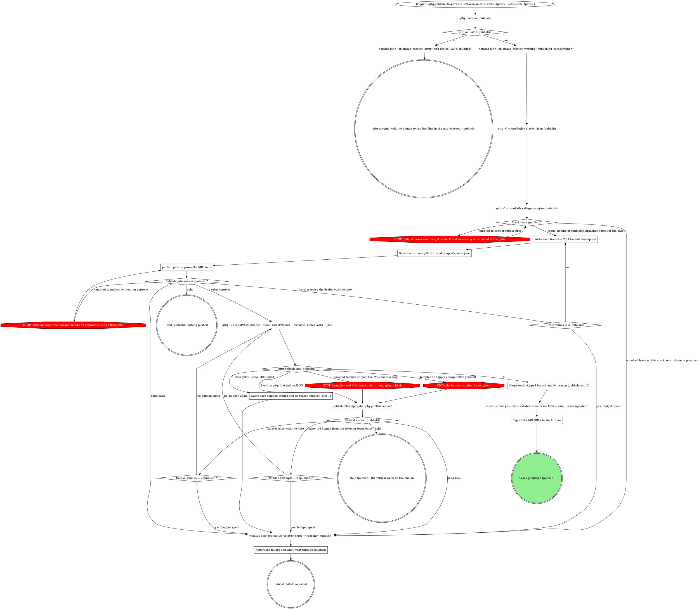
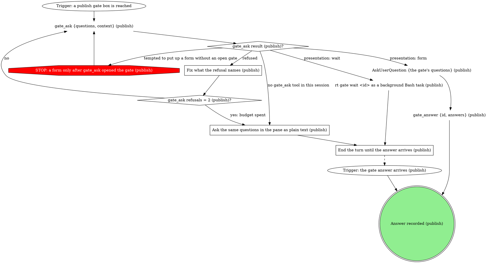

# gitq publish runner

Push the stack's not-yet-published branches (gitq pushes with
force-with-lease) and open or retarget its MR chain on the repo's forge. gitq
reads which forge that is from the git remote's host, so the same command
covers GitLab and GitHub, self-hosted included. gitq does the pushing and MR
plumbing; you write the MR prose, and nothing leaves the machine until the
human approves at the publish gate.

| flag | meaning |
|------|---------|
| `<repoPath>` (positional) | absolute path of the repo checkout |
| `<stackName>` (positional) | the tracked stack to publish |
| `--state <path>` | lifecycle status file the board polls (optional) |
| `--status-bin <path>` | absolute path to the gitq executable, called as `<status-bin> job-status` (optional) |

## What gitq publish does per branch

So the gate can say it accurately:

- **No MR yet**: the branch is pushed and a draft MR is opened against its
  target, titled and described from your `--mr-meta`.
- **Already has an open MR**: the branch is **not** pushed. Its MR is
  retargeted if it no longer points at the branch's target, and its title
  and description are overwritten **only if your `--mr-meta` names that
  branch**. An MR that needs neither is left untouched and does not appear in
  the results.
- **Published, but its MR is merged, closed, unreadable, or belongs to another
  branch**: nothing is written. The branch comes back under `skipped` with a
  reason.

A branch's **target** is the branch below it in the stack, skipping any that
have already merged: gitq keeps merged branches in the tree, the forge deletes
them on merge, so publish targets the nearest one still alive. Locally merged
branches are left alone and appear in neither list.

## Flow



Every `<status-bin> job-status` node is skipped when `--state` and
`--status-bin` were not given (a manual launch), and a hold writes nothing,
so the board badge keeps `working` while the pane waits.

## Asking the human

Every gate box below is walked through this graph, and its answer diamond in
the flow graph branches on the recorded answer.



Pass each gate's questions as `{id, label, multi: false, options}` with
`{value, label, description}` options, and put the quoted material in
`context`, never trimmed. Each option's `value` is its edge keyword
(`take`, `iterate`, `hold`, `hand back`), so the answer maps straight onto
the gate's answer diamond. An answer that carries a note brings it in the
answer's `note` or `text`.

The presentation comes from `gate_ask`'s result alone: `gate_ask result (publish)?`
branches on the `presentation` it returns, never on your own choice or on
the launch flags. On `form`, put up the AskUserQuestion form and call
`gate_answer {id, answers}` with its answers in the same turn, back to
back: the answer is not recorded until `gate_answer` runs, so a turn that
ends between the two leaves the gate open and unanswered.

### End the turn until the answer arrives (publish)

End the turn with one line saying what the gate asks. Do not poll, do not
guess the answer, and do not keep working on the stack: the next turn starts
when the background wait finishes or the human replies in the pane, and it
reads that answer as the gate's. A human who never answers leaves the pane
holding: nothing is published and nothing is written.

### Fix what the refusal names (publish)

`gate_ask` refuses a malformed ask, such as no `context` on a human-owned
gate or a missing required field. Fix exactly what the refusal names and ask
again with the same questions and options. A question over 4 options is not
a refusal: the gate opens as `wait` and reports `formCapExceeded`, so keep
every question at 4 options or fewer.

### Ask the same questions in the pane as plain text (publish)

Write the gate's context, then each question with its options and their
one-sentence descriptions, as plain text in the reply. Never put up an
AskUserQuestion form here: no gate is open, so the pane's hook refuses it.

## Steps

### Write each branch's MR title and description

`gitq -C <repoPath> stacks --json` gives the chain: find the stack by
`stackName` in `stacks[]`; each node carries its `branch`, its `parent`, and
`mrIid`/`mrUrl` (null when the branch has no MR yet). For each branch being
published, read its commits with
`git -C <repoPath> log --oneline <parent>..<branch>` and its diff, then
write a title and a description.

- Follow the MR-writing rules the user's own rules define. Absent those, the
  title is the branch's main change, and the description is 1 to 2
  sentences of framing plus action-first bullets.
- Write an entry for every branch with no MR yet. Include a branch that
  already has an open MR only when you mean to overwrite that MR's title and
  description: the entry replaces whatever is on the forge, including edits
  made in the forge's own UI.
- Both fields are required and non-empty in every entry. An empty string
  means "leave that one alone" to gitq, so an entry with a blank field does
  not write what the gate showed.
- `--mr-meta` cannot blank an MR body. If the human wants one emptied, say
  that it has to happen in the forge's own UI.

On an iterate answer from the publish gate, rewrite the drafts the note
names and keep the rest as drafted.

### Save the mr-meta JSON to <mktemp -d>/meta.json

BSD `mktemp` only fills an X run at the end of its template, so a `.json`
suffix does not work. Create a directory with `mktemp -d` and write
`meta.json` inside it, in gitq's mr-meta shape, keyed by branch name:

```json
{ "<branch>": { "title": "...", "description": "..." } }
```

`<mktemp -d>/meta.json` is `<tempPath>` in the publish call. After an iterate
round, overwrite that same file so the gate and the publish read one
version.

### publish gate: approve the MR chain

Opens once the drafts are saved, and again after each iterate round. The
go or no-go is the human's; a clean diagnose, an earlier "go ahead" or a
"no need to show me" never stands in for the take answer.

Context, quoted and never trimmed:

- the branch chain in stack order, each branch with its target;
- for each branch, new MR or update, and for an update whether it is a
  retarget, a title and description rewrite, or both (per
  `What gitq publish does per branch`);
- each title and description exactly as saved in `<tempPath>`;
- any branch diagnose shows as behind or conflicted, with a note that
  syncing first is an option: the human answers hand back, and running
  gitq:sync and then this publish again is the human's next move.

| Question | Options (recommended first) |
|---|---|
| Publish this MR chain? | `take: approve and publish`: I run gitq publish with these drafts, pushing new branches and opening or updating their MRs. `iterate: revise the drafts`: I rewrite the titles and descriptions with your note and ask again. `hold: leave it with you`: this run ends with nothing pushed and writes no status. `hand back: do not publish`: nothing is pushed and I mark the run failed as declined at the publish gate; pick this to sync first yourself. |

When `gate_ask` returns `contextOmitted: true`, the drafts did not reach
the human through the gate, so write every title and description in the
pane before ending the turn.

Three revision rounds spend the budget: the next iterate answer is written
as an error ("publish drafts not settled after 3 rounds") and reported.

### publish off-script gate: gitq publish refused

Opens when `gitq publish` exits 1 with a `gitq:` line on stderr and no JSON
on stdout, and whenever you are tempted to push the branches or open the
MRs some other way, or to supply a token yourself. Refusals that reach it
include a missing token, an unknown self-hosted host, a stack that is busy
or parked, a stack gitq cannot find, and a malformed mr-meta file. The
commonest is a missing token for the repo's forge. gitq reads the remote's
host to decide which it needs:

- `GITLAB_TOKEN` for GitLab, `GITHUB_TOKEN` for GitHub;
- else a grant-gated token from the rt daemon, which needs the repo tracked
  (`rt daemon track <repo> live branches`);
- a self-hosted host needs a `gitq.forges` entry naming its provider, and
  the error says so.

The human supplies every token and every forge entry. Setting a variable,
tracking the repo, adding the entry or freeing the stack is the human's
move; this gate hands it over with the run still alive, and the take answer
runs the publish again. An `invalid --mr-meta` refusal is this run's own
file: say so. An iterate answer then lets you fix only the JSON shape or
escaping; the approved titles and descriptions stay verbatim, so no text
the human never saw ships.

Context: the `gitq:` stderr line verbatim and, when the refusal is a token
refusal, the remote's host and which of the token sources above it points
at.

| Question | Options (recommended first) |
|---|---|
| gitq publish refused. What next? | `take: fixed it, publish again`: you fixed what the refusal names (a token, a forge entry, the stack), and I run gitq publish again. `iterate: publish again with a note`: I act on your note, then run gitq publish again. `hold: leave it with you`: this run ends with nothing published and writes no status. `hand back: fail on the refusal`: I mark the run failed with the refusal as the reason. |

### Name each skipped branch and its reason (publish, exit 0)

Exit 0 means every MR gitq acted on was created or updated. Each `results`
entry carries `action` (`created` or `updated`), `mrUrl`, and for an update
`changes` (`target`, `metadata`, or both). A branch in neither `results` nor
`skipped` needed nothing.

For every `skipped` entry, read its `reason` and `detail` and name the
branch and why: gitq wrote nothing for it. Never report a skipped branch as
published, and never let a run of nothing but skips pass as "nothing needed
doing". The done write's `<n>` and `<m>` count the `created` and `updated`
results.

### Name each skipped branch and its reason (publish, exit 1)

Exit 1 after normal JSON means some `results` entries have
`success: false`, each with its `error`. Name every failed branch and its
error, and every `skipped` branch with its `reason` and `detail`, exactly as
at exit 0. The error write's reason names the failed branches.

### Report the MR URLs in stack order

Give the human each MR's `mrUrl` from the publish JSON in stack order, with
created or updated (and what changed), then every skipped branch and its
reason.

### Report the failure and what went through (publish)

Say why the run stopped, in the words of the reason just written:

| Path | Reason written, and what the report adds |
|---|---|
| a parked lease or a rebase in progress | "cascade paused; finish or abort it first"; suggest gitq:sync |
| hand back at the publish gate | "declined at the publish gate"; when the note asked to sync first, point at gitq:sync |
| draft rounds spent | "publish drafts not settled after 3 rounds"; the last drafts and the last note |
| refusal handed back or its budget spent | the `gitq:` stderr line; which token or forge entry it needs |
| exit 1 after JSON | the failed branches; which MRs went through, with their URLs, and the skipped branches |

After per-MR failures, a failed create stops the walk at that branch; a
failed update does not, so branches after it may still have been published.
Report every branch that went through.

## What the graph cannot show

- Every gitq call runs as `gitq -C <repoPath> ...`, and the git reads for
  the drafts as `git -C <repoPath> ...`.
- Status is written only through the injected bin, as
  `<status-bin> job-status <state> <status> [detail]`; the board writes
  `starting` at spawn.
- `Stack state (publish)?` reads two sources. The parked lease is the
  `worktrees[]` entry in the stacks output whose `lease.stackId` equals this
  stack's `id` from `stacks[]` and whose `lease.state` is `parked`. A rebase
  in progress is the `Rebase in progress` line in diagnose's
  `diagnostics.globalBlocks`. diagnose takes no `--stack`: find this stack
  by `stackName` in its `stacks` array, where each node's `situation` shows
  a behind or conflicted branch. gitq refuses every mutating command while a
  cascade is paused.
- Publish never edits branches, rebases or otherwise mutates git. A stack
  that needs a rebase is gitq:sync's job, named at the gate.
- Every path but a hold ends through a `done` or `error` write, the
  missing-gitq stop included, so the board badge never sticks. A hold, and a
  pane parked at a gate the human has not answered, writes no `done`. On a
  hold, tell the human in the pane what is waiting on them: after a publish
  gate hold, the drafts saved at `<tempPath>`; after a refusal gate hold,
  the quoted `gitq:` line. Nothing was pushed either way, and running the
  publish again starts fresh.
- Each counter counts per run: draft rounds across the publish gate,
  attempts and rounds across the refusal gate. A counter diamond's `yes`
  edge is taken once its count has reached the number.

## Rationalizations

| Thought | Reality |
|---|---|
| "the skill has no path for the runner to obtain a token or retry on its own, so it stops there and waits on the human" | A refusal opens `publish off-script gate: gitq publish refused`. The human supplies the token and answers take; I publish again. |
| "the skill authorizes only 'mark error with the stderr text' here" | The refusal gate comes first. The error is written only on hand back or a spent budget. |
| "status is already terminal (`error`, written in step 2), so no further status write is owed" | The error write is the end of a path, not a checkpoint. A refusal waits at its gate with no write. |
| "Setting `GITHUB_TOKEN` or running `rt daemon track` are actions outside this runner's scope" | Right, they are the human's. The refusal gate hands them over and keeps the run alive. |
| "I can't tell from here which one applies" (then asking in prose) | For a token refusal, the gate's context names the host and every token source; the human answers through `gate_ask`. |
| "The human said there is no need to show them, so a prose check will do." | Behind branches and a waived preview still go through the publish gate. The plain-text pane ask is only for a session with no `gate_ask` tool. |
| "I can export a token from another CLI's login and retry." | The human supplies forge tokens. Take the refusal gate. |
| "The stack is behind, so I sync it before publishing." | Publish never rewrites git. Behind branches are named at the gate, and sync first is the hand back answer. |
