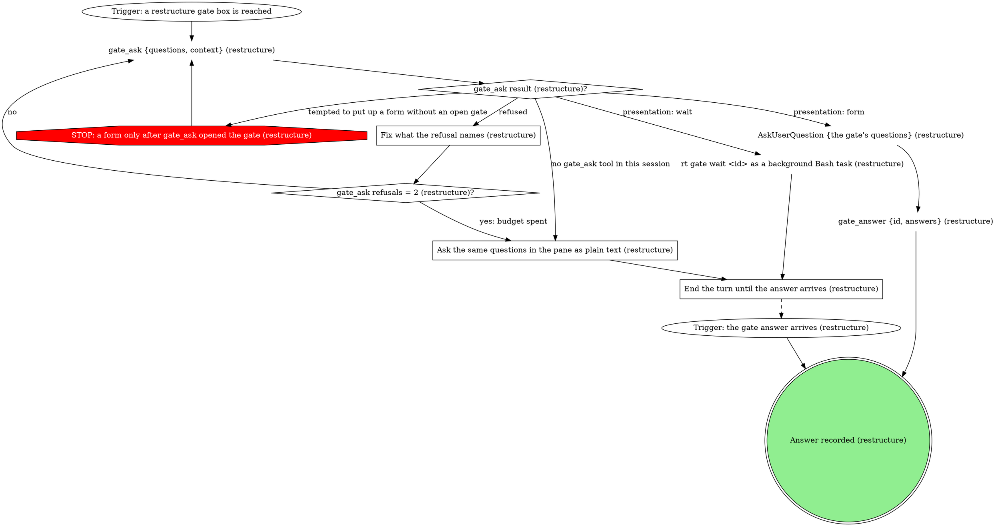

# gitq restructure runner

Turn "move the api branch onto main" or "split the ui work out of
feature-x" into concrete gitq surgery, get the human's yes at a gate, and
execute it. gitq does the git surgery; you own the mapping from intent to
operations and any conflict resolution along the way, and every question to
the human goes through a gate.

| flag | meaning |
|------|---------|
| `<repoPath>` (positional) | absolute path of the repo checkout |
| `<stackName>` (positional) | the tracked stack to reshape |
| `[instruction]` (positional, optional) | what the human wants, in their words |
| `--state <path>` | lifecycle status file the board polls (optional) |
| `--status-bin <path>` | absolute path to the gitq executable, called as `<status-bin> job-status` (optional) |

## Flow

```dot
digraph gitq_restructure {
    rankdir=TB;

    "Instruction clear enough to act on (restructure)?" [shape=diamond];
    "Trigger: /gitq:restructure <repoPath> <stackName> [instruction] [--state <path> --status-bin <path>]" [shape=ellipse];
    "gitq --version (restructure)" [shape=plaintext];
    "gitq on PATH (restructure)?" [shape=diamond];
    "<status-bin> job-status <state> error \"gitq not on PATH\" (restructure)" [shape=plaintext];
    "gitq missing: told the human to run rt deps link gitq (restructure)" [shape=doublecircle];
    "<status-bin> job-status <state> error \"<reason>\" (restructure)" [shape=plaintext];
    "Report the failure to the human (restructure)" [shape=box];
    "restructure failed: reported" [shape=doublecircle];
    "Held (restructure): cascade paused for the human" [shape=doublecircle];
    "<status-bin> job-status <state> working \"planning restructure\"" [shape=plaintext];
    "restructure gate: what should change" [shape=box];
    "Instruction answer (restructure)?" [shape=diamond];
    "Instruction rounds = 2 (restructure)?" [shape=diamond];
    "Held (restructure): waiting on the instruction" [shape=doublecircle];
    "gitq -C <repoPath> stacks --json (restructure)" [shape=plaintext];
    "gitq -C <repoPath> diagnose --json (restructure plan)" [shape=plaintext];
    "Map the instruction to surgery operations (restructure)" [shape=box];
    "restructure gate: approve the plan" [shape=box];
    "Plan answer (restructure)?" [shape=diamond];
    "Plan rounds = 3 (restructure)?" [shape=diamond];
    "Held (restructure): the plan waits on the human" [shape=doublecircle];
    "Next approved operation (restructure)?" [shape=diamond];
    "STOP: surgery runs only through gitq operations the plan approved" [shape=octagon style=filled fillcolor=red fontcolor=white];
    "Operation exit (restructure)?" [shape=diamond];
    "gitq -C <repoPath> diagnose --json (restructure verify)" [shape=plaintext];
    "<status-bin> job-status <state> done \"<summary>\"" [shape=plaintext];
    "Report the new tree shape (restructure)" [shape=box];
    "gitq -C <repoPath> split <branch> --at <sha> --name <newBranch> [--stack <stackName>] --json" [shape=plaintext];
    "gitq -C <repoPath> split <branch> --files <glob[,glob...]> --name <newBranch> [--stack <stackName>] --json" [shape=plaintext];
    "gitq -C <repoPath> fold <branch> [--stack <stackName>] --json" [shape=plaintext];
    "gitq -C <repoPath> reparent <branch> --onto <newParent> [--stack <stackName>] --json" [shape=plaintext];
    "gitq -C <repoPath> rename <old> <new> [--stack <stackName>] --json" [shape=plaintext];
    "gitq -C <repoPath> reset <branch> [--stack <stackName>] --json" [shape=plaintext];
    "Stack restructured (restructure)" [shape=doublecircle style=filled fillcolor=lightgreen];
    "<status-bin> job-status <state> conflict \"<n> conflicts on <branch> (commit <i>/<total>)\" (restructure)" [shape=plaintext];
    "Resolve the next conflicted file in <rebaseDir> (restructure)" [shape=box];
    "Resolution for this file (restructure)?" [shape=diamond];
    "STOP: every conflicted file is read and merged by hand (restructure)" [shape=octagon style=filled fillcolor=red fontcolor=white];
    "git -C <rebaseDir> add <file> (restructure)" [shape=plaintext];
    "git -C <rebaseDir> rm <file> (restructure)" [shape=plaintext];
    "Conflicted files left on this pause (restructure)?" [shape=diamond];
    "git -C <rebaseDir> status --porcelain (restructure)" [shape=plaintext];
    "Unmerged paths left (restructure)?" [shape=diamond];
    "gitq -C <repoPath> continue --stack <stackName> --json (restructure)" [shape=plaintext];
    "gitq continue exit (restructure)?" [shape=diamond];
    "STOP: the cascade moves only through gitq continue and gitq abort (restructure)" [shape=octagon style=filled fillcolor=red fontcolor=white];
    "Same pause as before (restructure)?" [shape=diamond];
    "Resolve attempts on this pause = 3 (restructure)?" [shape=diamond];
    "Conflict pauses = 20 (restructure)?" [shape=diamond];
    "gitq -C <repoPath> abort --stack <stackName> (restructure)" [shape=plaintext];
    "restructure gate: conflict needs human judgment" [shape=box];
    "restructure gate: this pause will not clear" [shape=box];
    "restructure gate: 20 conflict pauses this run" [shape=box];
    "Judgment answer (restructure)?" [shape=diamond];
    "Judgment rounds = 2 (restructure)?" [shape=diamond];
    "Apply the human's resolution (restructure judgment gate)" [shape=box];
    "Human kept or deleted the file (restructure judgment gate)?" [shape=diamond];
    "Pause answer (restructure)?" [shape=diamond];
    "Pause rounds = 2 (restructure)?" [shape=diamond];
    "Apply the human's resolution (restructure pause gate)" [shape=box];
    "Human kept or deleted the file (restructure pause gate)?" [shape=diamond];
    "Twenty-pause answer (restructure)?" [shape=diamond];
    "Twenty-pause rounds = 2 (restructure)?" [shape=diamond];
    "restructure off-script gate: gitq continue refused" [shape=box];
    "Answer to \"gitq continue refused\" (restructure)?" [shape=diamond];
    "Runs after \"gitq continue refused\" = 2 (restructure)?" [shape=diamond];
    "Held (restructure): the refusal waits on the human" [shape=doublecircle];
    "restructure off-script gate: a gitq operation refused" [shape=box];
    "Answer to \"a gitq operation refused\" (restructure)?" [shape=diamond];
    "Runs after \"a gitq operation refused\" = 2 (restructure)?" [shape=diamond];

    "Trigger: /gitq:restructure <repoPath> <stackName> [instruction] [--state <path> --status-bin <path>]" -> "gitq --version (restructure)";
    "gitq --version (restructure)" -> "gitq on PATH (restructure)?";
    "gitq on PATH (restructure)?" -> "<status-bin> job-status <state> working \"planning restructure\"" [label="yes"];
    "gitq on PATH (restructure)?" -> "<status-bin> job-status <state> error \"gitq not on PATH\" (restructure)" [label="no"];
    "<status-bin> job-status <state> error \"gitq not on PATH\" (restructure)" -> "gitq missing: told the human to run rt deps link gitq (restructure)";
    "<status-bin> job-status <state> working \"planning restructure\"" -> "Instruction clear enough to act on (restructure)?";
    "<status-bin> job-status <state> error \"<reason>\" (restructure)" -> "Report the failure to the human (restructure)";
    "Report the failure to the human (restructure)" -> "restructure failed: reported";
    "Instruction clear enough to act on (restructure)?" -> "gitq -C <repoPath> stacks --json (restructure)" [label="yes"];
    "Instruction clear enough to act on (restructure)?" -> "restructure gate: what should change" [label="missing, too vague, or two plausible readings"];
    "restructure gate: what should change" -> "Instruction answer (restructure)?";
    "Instruction answer (restructure)?" -> "gitq -C <repoPath> stacks --json (restructure)" [label="take: the human's instruction"];
    "Instruction answer (restructure)?" -> "Instruction rounds = 2 (restructure)?" [label="iterate: ask again with the note"];
    "Instruction answer (restructure)?" -> "Held (restructure): waiting on the instruction" [label="hold"];
    "Instruction answer (restructure)?" -> "<status-bin> job-status <state> error \"<reason>\" (restructure)" [label="hand back"];
    "Instruction rounds = 2 (restructure)?" -> "Instruction clear enough to act on (restructure)?" [label="no"];
    "Instruction rounds = 2 (restructure)?" -> "<status-bin> job-status <state> error \"<reason>\" (restructure)" [label="yes: budget spent"];
    "gitq -C <repoPath> stacks --json (restructure)" -> "gitq -C <repoPath> diagnose --json (restructure plan)";
    "gitq -C <repoPath> diagnose --json (restructure plan)" -> "Map the instruction to surgery operations (restructure)";
    "Map the instruction to surgery operations (restructure)" -> "restructure gate: approve the plan";
    "restructure gate: approve the plan" -> "Plan answer (restructure)?";
    "Plan answer (restructure)?" -> "Next approved operation (restructure)?" [label="take: approve the plan"];
    "Plan answer (restructure)?" -> "Plan rounds = 3 (restructure)?" [label="iterate: revise the plan with the note"];
    "Plan answer (restructure)?" -> "Held (restructure): the plan waits on the human" [label="hold"];
    "Plan answer (restructure)?" -> "<status-bin> job-status <state> error \"<reason>\" (restructure)" [label="hand back"];
    "Plan rounds = 3 (restructure)?" -> "Map the instruction to surgery operations (restructure)" [label="no"];
    "Plan rounds = 3 (restructure)?" -> "<status-bin> job-status <state> error \"<reason>\" (restructure)" [label="yes: budget spent"];
    "Next approved operation (restructure)?" -> "gitq -C <repoPath> split <branch> --at <sha> --name <newBranch> [--stack <stackName>] --json" [label="split at a commit"];
    "gitq -C <repoPath> split <branch> --at <sha> --name <newBranch> [--stack <stackName>] --json" -> "Operation exit (restructure)?";
    "Next approved operation (restructure)?" -> "gitq -C <repoPath> split <branch> --files <glob[,glob...]> --name <newBranch> [--stack <stackName>] --json" [label="split by files"];
    "gitq -C <repoPath> split <branch> --files <glob[,glob...]> --name <newBranch> [--stack <stackName>] --json" -> "Operation exit (restructure)?";
    "Next approved operation (restructure)?" -> "gitq -C <repoPath> fold <branch> [--stack <stackName>] --json" [label="fold"];
    "gitq -C <repoPath> fold <branch> [--stack <stackName>] --json" -> "Operation exit (restructure)?";
    "Next approved operation (restructure)?" -> "gitq -C <repoPath> reparent <branch> --onto <newParent> [--stack <stackName>] --json" [label="reparent"];
    "gitq -C <repoPath> reparent <branch> --onto <newParent> [--stack <stackName>] --json" -> "Operation exit (restructure)?";
    "Next approved operation (restructure)?" -> "gitq -C <repoPath> rename <old> <new> [--stack <stackName>] --json" [label="rename"];
    "gitq -C <repoPath> rename <old> <new> [--stack <stackName>] --json" -> "Operation exit (restructure)?";
    "Next approved operation (restructure)?" -> "gitq -C <repoPath> reset <branch> [--stack <stackName>] --json" [label="reset"];
    "gitq -C <repoPath> reset <branch> [--stack <stackName>] --json" -> "Operation exit (restructure)?";
    "Next approved operation (restructure)?" -> "gitq -C <repoPath> diagnose --json (restructure verify)" [label="none left"];
    "Next approved operation (restructure)?" -> "STOP: surgery runs only through gitq operations the plan approved" [label="tempted to do surgery with git, or an operation the plan did not list"];
    "STOP: surgery runs only through gitq operations the plan approved" -> "restructure gate: approve the plan";
    "gitq -C <repoPath> diagnose --json (restructure verify)" -> "<status-bin> job-status <state> done \"<summary>\"";
    "<status-bin> job-status <state> done \"<summary>\"" -> "Report the new tree shape (restructure)";
    "Report the new tree shape (restructure)" -> "Stack restructured (restructure)";
    "<status-bin> job-status <state> conflict \"<n> conflicts on <branch> (commit <i>/<total>)\" (restructure)" -> "Resolve the next conflicted file in <rebaseDir> (restructure)";
    "Resolve the next conflicted file in <rebaseDir> (restructure)" -> "Resolution for this file (restructure)?";
    "Resolution for this file (restructure)?" -> "git -C <rebaseDir> add <file> (restructure)" [label="merged both intents, or kept the file"];
    "Resolution for this file (restructure)?" -> "git -C <rebaseDir> rm <file> (restructure)" [label="honour a one-side deletion"];
    "Resolution for this file (restructure)?" -> "restructure gate: conflict needs human judgment" [label="the merged behavior cannot be inferred"];
    "Resolution for this file (restructure)?" -> "STOP: every conflicted file is read and merged by hand (restructure)" [label="tempted to take one side wholesale or strip the markers"];
    "STOP: every conflicted file is read and merged by hand (restructure)" -> "Resolve the next conflicted file in <rebaseDir> (restructure)";
    "git -C <rebaseDir> add <file> (restructure)" -> "Conflicted files left on this pause (restructure)?";
    "git -C <rebaseDir> rm <file> (restructure)" -> "Conflicted files left on this pause (restructure)?";
    "Conflicted files left on this pause (restructure)?" -> "Resolve the next conflicted file in <rebaseDir> (restructure)" [label="yes"];
    "Conflicted files left on this pause (restructure)?" -> "git -C <rebaseDir> status --porcelain (restructure)" [label="no"];
    "git -C <rebaseDir> status --porcelain (restructure)" -> "Unmerged paths left (restructure)?";
    "Unmerged paths left (restructure)?" -> "gitq -C <repoPath> continue --stack <stackName> --json (restructure)" [label="no"];
    "Unmerged paths left (restructure)?" -> "Resolve attempts on this pause = 3 (restructure)?" [label="yes"];
    "gitq -C <repoPath> continue --stack <stackName> --json (restructure)" -> "gitq continue exit (restructure)?";
    "gitq continue exit (restructure)?" -> "Next approved operation (restructure)?" [label="0"];
    "gitq continue exit (restructure)?" -> "Same pause as before (restructure)?" [label="2"];
    "gitq continue exit (restructure)?" -> "restructure off-script gate: gitq continue refused" [label="1 with a gitq: line"];
    "gitq continue exit (restructure)?" -> "<status-bin> job-status <state> error \"<reason>\" (restructure)" [label="1 after JSON: the cascade ended with a failed branch"];
    "gitq continue exit (restructure)?" -> "STOP: the cascade moves only through gitq continue and gitq abort (restructure)" [label="tempted to drive the rebase with git directly"];
    "STOP: the cascade moves only through gitq continue and gitq abort (restructure)" -> "gitq -C <repoPath> continue --stack <stackName> --json (restructure)";
    "Same pause as before (restructure)?" -> "Resolve attempts on this pause = 3 (restructure)?" [label="yes: same branch and commit"];
    "Same pause as before (restructure)?" -> "Conflict pauses = 20 (restructure)?" [label="no: a new pause"];
    "Resolve attempts on this pause = 3 (restructure)?" -> "<status-bin> job-status <state> conflict \"<n> conflicts on <branch> (commit <i>/<total>)\" (restructure)" [label="no"];
    "Resolve attempts on this pause = 3 (restructure)?" -> "restructure gate: this pause will not clear" [label="yes: budget spent"];
    "Conflict pauses = 20 (restructure)?" -> "<status-bin> job-status <state> conflict \"<n> conflicts on <branch> (commit <i>/<total>)\" (restructure)" [label="no"];
    "Conflict pauses = 20 (restructure)?" -> "restructure gate: 20 conflict pauses this run" [label="yes: budget spent"];
    "restructure gate: conflict needs human judgment" -> "Judgment answer (restructure)?";
    "Judgment answer (restructure)?" -> "Apply the human's resolution (restructure judgment gate)" [label="take: the human names the resolution"];
    "Judgment answer (restructure)?" -> "Judgment rounds = 2 (restructure)?" [label="iterate: a note to try again"];
    "Judgment answer (restructure)?" -> "Held (restructure): cascade paused for the human" [label="hold"];
    "Judgment answer (restructure)?" -> "gitq -C <repoPath> abort --stack <stackName> (restructure)" [label="hand back"];
    "Judgment rounds = 2 (restructure)?" -> "Resolve the next conflicted file in <rebaseDir> (restructure)" [label="no: resolve again with the note"];
    "Judgment rounds = 2 (restructure)?" -> "gitq -C <repoPath> abort --stack <stackName> (restructure)" [label="yes: budget spent"];
    "Apply the human's resolution (restructure judgment gate)" -> "Human kept or deleted the file (restructure judgment gate)?";
    "Human kept or deleted the file (restructure judgment gate)?" -> "git -C <rebaseDir> add <file> (restructure)" [label="kept"];
    "Human kept or deleted the file (restructure judgment gate)?" -> "git -C <rebaseDir> rm <file> (restructure)" [label="deleted"];
    "restructure gate: this pause will not clear" -> "Pause answer (restructure)?";
    "Pause answer (restructure)?" -> "Apply the human's resolution (restructure pause gate)" [label="take: the human names the resolution"];
    "Pause answer (restructure)?" -> "Pause rounds = 2 (restructure)?" [label="iterate: a note to try again"];
    "Pause answer (restructure)?" -> "Held (restructure): cascade paused for the human" [label="hold"];
    "Pause answer (restructure)?" -> "gitq -C <repoPath> abort --stack <stackName> (restructure)" [label="hand back"];
    "Pause rounds = 2 (restructure)?" -> "Resolve the next conflicted file in <rebaseDir> (restructure)" [label="no: resolve again with the note"];
    "Pause rounds = 2 (restructure)?" -> "gitq -C <repoPath> abort --stack <stackName> (restructure)" [label="yes: budget spent"];
    "Apply the human's resolution (restructure pause gate)" -> "Human kept or deleted the file (restructure pause gate)?";
    "Human kept or deleted the file (restructure pause gate)?" -> "git -C <rebaseDir> add <file> (restructure)" [label="kept"];
    "Human kept or deleted the file (restructure pause gate)?" -> "git -C <rebaseDir> rm <file> (restructure)" [label="deleted"];
    "restructure gate: 20 conflict pauses this run" -> "Twenty-pause answer (restructure)?";
    "Twenty-pause answer (restructure)?" -> "<status-bin> job-status <state> conflict \"<n> conflicts on <branch> (commit <i>/<total>)\" (restructure)" [label="take: keep going for another 20"];
    "Twenty-pause answer (restructure)?" -> "Twenty-pause rounds = 2 (restructure)?" [label="iterate: keep going with a note"];
    "Twenty-pause answer (restructure)?" -> "Held (restructure): cascade paused for the human" [label="hold"];
    "Twenty-pause answer (restructure)?" -> "gitq -C <repoPath> abort --stack <stackName> (restructure)" [label="hand back"];
    "Twenty-pause rounds = 2 (restructure)?" -> "<status-bin> job-status <state> conflict \"<n> conflicts on <branch> (commit <i>/<total>)\" (restructure)" [label="no"];
    "Twenty-pause rounds = 2 (restructure)?" -> "gitq -C <repoPath> abort --stack <stackName> (restructure)" [label="yes: budget spent"];
    "restructure off-script gate: gitq continue refused" -> "Answer to \"gitq continue refused\" (restructure)?";
    "Answer to \"gitq continue refused\" (restructure)?" -> "Runs after \"gitq continue refused\" = 2 (restructure)?" [label="take: the human fixed it, run it again"];
    "Answer to \"gitq continue refused\" (restructure)?" -> "Runs after \"gitq continue refused\" = 2 (restructure)?" [label="iterate: run it again with the note"];
    "Answer to \"gitq continue refused\" (restructure)?" -> "Held (restructure): cascade paused for the human" [label="hold"];
    "Answer to \"gitq continue refused\" (restructure)?" -> "gitq -C <repoPath> abort --stack <stackName> (restructure)" [label="hand back"];
    "Runs after \"gitq continue refused\" = 2 (restructure)?" -> "gitq -C <repoPath> continue --stack <stackName> --json (restructure)" [label="no"];
    "Runs after \"gitq continue refused\" = 2 (restructure)?" -> "gitq -C <repoPath> abort --stack <stackName> (restructure)" [label="yes: budget spent"];
    "gitq -C <repoPath> abort --stack <stackName> (restructure)" -> "<status-bin> job-status <state> error \"<reason>\" (restructure)";
    "Operation exit (restructure)?" -> "Next approved operation (restructure)?" [label="0"];
    "Operation exit (restructure)?" -> "<status-bin> job-status <state> conflict \"<n> conflicts on <branch> (commit <i>/<total>)\" (restructure)" [label="2: a reparent's descendant paused"];
    "Operation exit (restructure)?" -> "restructure off-script gate: a gitq operation refused" [label="1"];
    "restructure off-script gate: a gitq operation refused" -> "Answer to \"a gitq operation refused\" (restructure)?";
    "Answer to \"a gitq operation refused\" (restructure)?" -> "Runs after \"a gitq operation refused\" = 2 (restructure)?" [label="take: the human fixed it, run the operation again"];
    "Answer to \"a gitq operation refused\" (restructure)?" -> "Runs after \"a gitq operation refused\" = 2 (restructure)?" [label="iterate: run it again with the note"];
    "Answer to \"a gitq operation refused\" (restructure)?" -> "Held (restructure): the refusal waits on the human" [label="hold"];
    "Answer to \"a gitq operation refused\" (restructure)?" -> "<status-bin> job-status <state> error \"<reason>\" (restructure)" [label="hand back"];
    "Runs after \"a gitq operation refused\" = 2 (restructure)?" -> "Next approved operation (restructure)?" [label="no"];
    "Runs after \"a gitq operation refused\" = 2 (restructure)?" -> "<status-bin> job-status <state> error \"<reason>\" (restructure)" [label="yes: budget spent"];
}
```

Every `<status-bin> job-status` node is skipped when `--state` and
`--status-bin` were not given (a manual launch), and a hold writes nothing,
so the board badge keeps `working` or `conflict` while the pane waits.

## Asking the human

Every gate box below is walked through this graph, and its answer diamond in
the flow graph branches on the recorded answer.



Pass each gate's questions as `{id, label, multi: false, options}` with
`{value, label, description}` options, and put the quoted material in
`context`, never trimmed. Each option's `value` is its edge keyword
(`take`, `iterate`, `hold`, `hand back`), so the answer maps straight onto
the gate's answer diamond. An answer that carries an instruction, a
resolution or a note brings it in the answer's `note` or `text`.

The presentation comes from `gate_ask`'s result alone: `gate_ask result (restructure)?`
branches on the `presentation` it returns, never on your own choice or on
the launch flags. On `form`, put up the AskUserQuestion form and call
`gate_answer {id, answers}` with its answers in the same turn, back to
back: the answer is not recorded until `gate_answer` runs, so a turn that
ends between the two leaves the gate open and unanswered.

### End the turn until the answer arrives (restructure)

End the turn with one line saying what the gate asks. Do not poll, do not
guess the answer, and do not keep working on the stack: the next turn starts
when the background wait finishes or the human replies in the pane, and it
reads that answer as the gate's. A human who is away or never answers
leaves the pane holding at the gate: no further operation runs and nothing
is written.

### Fix what the refusal names (restructure)

`gate_ask` refuses a malformed ask, such as no `context` on a human-owned
gate or a missing required field. Fix exactly what the refusal names and ask
again with the same questions and options. A question over 4 options is not
a refusal: the gate opens as `wait` and reports `formCapExceeded`, so keep
every question at 4 options or fewer.

### Ask the same questions in the pane as plain text (restructure)

Write the gate's context, then each question with its options and their
one-sentence descriptions, as plain text in the reply. Never put up an
AskUserQuestion form here: no gate is open, so the pane's hook refuses it.

## Steps

### restructure gate: what should change

Opens when the instruction positional is missing, too vague to act on
("clean this up"), or has two plausible readings. Two readings is a
question, never a coin flip: nothing is read, planned or run until the
instruction is clear.

Context: the instruction as given, verbatim (or "none given"), the stack's
branches in order, and, for two readings, each reading in one sentence with
the surgery it would lead to.

| Question | Options (recommended first) |
|---|---|
| What should this restructure do? | `take: here is the instruction`: you give the instruction, or pick a reading, and I plan the surgery from it. `iterate: a note to narrow it`: I re-read the instruction with your note and ask again if it is still unclear. `hold: leave it with you`: this run ends with nothing changed and writes no status. `hand back: stop with an error`: nothing changes and I mark the run failed as "no clear restructure instruction". |

Two iterate rounds spend the budget: the next iterate answer is written as
an error ("restructure instruction still unclear after 2 rounds").

### Map the instruction to surgery operations (restructure)

Learn the current shape first. In `gitq -C <repoPath> stacks --json`, find
the stack by `stackName` in `stacks[]`; each node carries its `branch` and
`parent`. `gitq -C <repoPath> diagnose --json` takes no `--stack`: find the
stack by `stackName` in its `stacks` array. For each branch the instruction
touches, read `git -C <repoPath> log --oneline <parent>..<branch>`.

Then choose from the surgery set, one node in the graph per operation:

| Operation | Call (as `gitq -C <repoPath> ...`, with `[--stack <stackName>] --json`) | What it does to the tree |
|---|---|---|
| tail split | `split <branch> --at <sha> --name <newBranch>` | everything from `<sha>` onward moves to a new child of `<branch>` |
| file split | `split <branch> --files <glob[,glob...]> --name <newBranch>` | the files matching the globs move to a new branch |
| fold | `fold <branch>` | folds the branch into its parent, deletes it, and reparents its children onto that parent |
| reparent | `reparent <branch> --onto <newParent>` | moves the branch, with its descendants, onto a new parent |
| rename | `rename <old> <new>` | renames a branch |
| reset | `reset <branch>` | makes the branch match `origin/<branch>` again |

- A sequence of operations is fine. Order it so each operation sees the tree
  state it expects: an operation names branches as they stand after the
  operations before it.
- Add `--stack <stackName>` to every operation when the repo tracks more
  than one stack (`stacks[]` has more than one entry).
- Surgery never moves the launch worktree's checkout: split, fold and
  reparent do their git work in a gitq-owned work slot or as pure ref
  surgery, and refuse cleanly when a branch sits dirty in some worktree.
  Plan for the tree as it is; clearing a worktree is the human's move.
- Write the done summary as you plan, one clause per operation, like "split
  feature-x at abc1234 into feature-x-ui, reparented api onto main". After
  a mid-run re-plan or a refusal, revise it to match the operations that
  actually ran.

When the stack shows the instruction has two plausible readings after all,
plan neither guess: lay out both readings at the plan gate with the
operations each needs, set `recommended: true` on iterate, and let the
human's note pick. On an iterate answer from the plan gate, revise the
operations the note names and keep the rest as planned.

### restructure gate: approve the plan

Opens once the plan is drafted, again after each iterate round, and when you
reach for a move the plan did not list (through
`STOP: surgery runs only through gitq operations the plan approved`): a move
off the plan needs its own approval. No surgery runs before the take answer,
and an earlier "go ahead" in the launch message never stands in for it.

Context, quoted and never trimmed:

- each operation in order, with its exact gitq call and what it does to the
  tree (which branches move, which appear, which are deleted);
- the `git log --oneline <parent>..<branch>` lines that ground each one;
- the caveats: of these operations only `reparent` can be undone by
  `gitq undo`, and not one whose cascade paused on a conflict; `split`,
  `fold` and `rename` are one-way; `reset` is not recorded in the operation
  log at all. Treat every approved operation as irreversible.
- when a STOP brought you here, the move you reached for and why;
- when the gate reopens mid-run, the operations already run, which stay
  applied whatever the answer.

| Question | Options (recommended first) |
|---|---|
| Run this restructure plan? | `take: approve the plan`: I run the operations in order, each one irreversible in practice. `iterate: revise the plan`: I rework the operations with your note and ask again. `hold: leave it with you`: this run ends with no further operation run and no done write; any operations already run stay applied. `hand back: do not restructure`: no further operation runs, any already run stay applied, and I mark the run failed as declined at the plan gate. |

Three revision rounds spend the budget: the next iterate answer is written
as an error ("restructure plan not settled after 3 rounds").

### restructure off-script gate: a gitq operation refused

Opens when a surgery operation exits 1. A refusal prints a `gitq:` line on
stderr and changes nothing; the shapes that reach this gate include:

- a reparent refused upfront because the branch itself cannot be replayed
  onto the new parent: nothing moved, and the stack needs a sync first.
  gitq:sync is the human's next move, so for this shape set
  `recommended: true` on hand back and list it first;
- a branch dirty or checked out in another worktree, or held by a gitq
  slot: freeing it (commit, stash, switch away) is the human's move, never
  this run's;
- a stack that is busy or has a paused cascade;
- a branch or stack gitq cannot find, often a missing `--stack`;
- a reparent that landed but whose descendant cascade had a non-conflict
  failure: it exits 1 after its JSON, and the failing entry's
  `success: false` says what broke.

An operation counts as run once gitq applied it: exit 0, exit 0 from the
continue after its pause, or exit 1 after JSON that shows it landed.
`Next approved operation (restructure)?` always takes the first approved
operation not yet run, so take and iterate run the refused one again and
never repeat one that ran. For a reparent that landed with a failed
cascade, that means take and iterate move on to the next operation: say so
in the context, and the fix the human makes is to the failed descendant.

Context: the `gitq:` stderr line verbatim (or the failing JSON entry), the
refused operation's call, the operations that ran, and the ones that did not.

| Question | Options (recommended first) |
|---|---|
| A gitq operation refused. What next? | `take: fixed it, run again`: you fixed what the refusal names, and I run that operation again (or the next one, when it landed), then the rest of the plan. `iterate: run again with a note`: I act on your note, then run that operation again (or the next one, when it landed). `hold: leave it with you`: this run ends here, the operations that ran stay applied, and no status is written. `hand back: stop with an error`: the rest of the plan does not run and I mark the run failed with the refusal as the reason. |

A note that adds, drops or reorders operations is a move off the plan: it
goes back through the plan gate.

### Resolve the next conflicted file in <rebaseDir> (restructure)

A reparent moves its descendants in a follow-up cascade, and a descendant
that conflicts pauses it with exit 2, exactly like sync. `<rebaseDir>` is
`pauseInfo.worktreePath` (a gitq work slot), else `pauseInfo.treePath`,
else `<repoPath>` only when both are absent. The launch worktree is not
where the rebase is; never resolve there.

`pauseInfo`, in the reparent's JSON or the continue's, says where the
cascade stopped: `currentBranch`, `commitIndex`/`commitTotal`,
`conflictFiles` (always present) and `conflictTypes` (when present, a
two-letter porcelain code per file: `UU` both modified, `AA` both added,
`DU`/`UD` deleted on one side).

For the file at hand, read its conflict markers, get both sides' intent
from `git -C <rebaseDir> log --oneline --merge` and the surrounding code,
then edit the file to the content that preserves both intents. A `DU`/`UD`
file is a deliberate call between keeping it and honouring the deletion.
When both sides rewrote the same logic to different ends and the merged
behavior cannot be read from the code, that is the judgment gate, never a
guess and never an abort.

When a gate's take answer named this file's content, or keeping or
deleting it, that is the resolution: write it as given and go straight to
staging, without merging on top of it. A note from a gate's iterate answer
steers the next attempt on the files it names.

### restructure gate: conflict needs human judgment

Opens when both sides rewrote the same logic to different ends and the right
merged behavior is not inferable from the code.

Context: the file path and the conflicted hunk with both sides verbatim,
each side's commit from `git -C <rebaseDir> log --oneline --merge`, the
reparent that started the cascade, and one sentence on why the merge cannot
be inferred.

| Question | Options (recommended first) |
|---|---|
| How should this conflict resolve? | `take: I name the resolution`: you give the merged content, or keep or delete the file, and I apply it. `iterate: try again with a note`: I resolve the file again, steered by your note. `hold: leave the cascade paused`: the pause stays for you and this run ends with the badge on conflict. `hand back: abort the cascade`: I abort the rebase for this stack, skip the rest of the plan and mark the run failed. |

On hand back the error reason is "conflict on <file> needs human judgment:
<why>". Two iterate rounds spend the budget: the next iterate answer aborts
the cascade, skips the rest of the plan and writes "conflict on <file> not
settled after 2 rounds".

### Apply the human's resolution (restructure judgment gate)

Write exactly what the human named into the file in `<rebaseDir>`, or
follow their keep or delete. Do not re-merge on top of their answer.

### restructure gate: this pause will not clear

Opens when `gitq continue` re-paused on the same `currentBranch` and
`commitIndex`, or unmerged paths survived staging, three times on one pause.

Context: the latest `pauseInfo.conflictFiles` and the unmerged lines of
`git -C <rebaseDir> status --porcelain`, quoted, plus one line per attempt
on what was tried.

| Question | Options (recommended first) |
|---|---|
| This pause keeps coming back. What next? | `take: I name the resolution`: you give the content for the files still conflicted, and I apply it. `iterate: try again with a note`: I resolve the files again, steered by your note. `hold: leave the cascade paused`: the pause stays for you and this run ends with the badge on conflict. `hand back: abort the cascade`: I abort the rebase for this stack, skip the rest of the plan and mark the run failed. |

An iterate does not restart the resolve-attempt count: this pause's count
stays at 3, so when the next continue re-pauses on the same branch and
commit, or unmerged paths survive staging again, the run comes straight back
to this gate, and `Pause rounds = 2 (restructure)?` bounds how often. A new
pause starts its own count.

On hand back the error reason is "pause on <branch> (commit <i>/<total>)
will not clear: <files still conflicted>". Two iterate rounds spend the
budget: the next iterate answer aborts the cascade, skips the rest of the
plan and writes "pause on <branch> (commit <i>/<total>) not settled after 2
rounds".

### Apply the human's resolution (restructure pause gate)

Write exactly what the human named into each file it covers in
`<rebaseDir>`, or follow their keep or delete, one file at a time. Do not
re-merge on top of their answer.

### restructure gate: 20 conflict pauses this run

Opens on the twentieth distinct pause this run (a new `currentBranch` or
`commitIndex` each time). Take restarts the count; iterate restarts it too
and carries the note into the next resolutions.

Context: the stack name, the reparent being cascaded, the branch and commit
of each pause so far with one line on how each resolved, and the current
`pauseInfo`.

| Question | Options (recommended first) |
|---|---|
| Twenty conflict pauses so far. Keep going? | `take: keep going for another 20`: I carry on resolving and ask again after 20 more pauses. `iterate: keep going with a note`: I carry on, steered by your note. `hold: leave the cascade paused`: the pause stays for you and this run ends with the badge on conflict. `hand back: abort the cascade`: I abort the rebase for this stack, skip the rest of the plan and mark the run failed. |

On hand back the error reason is "stopped after <n> conflict pauses". Two
iterate rounds spend the budget: the next iterate answer aborts the cascade,
skips the rest of the plan and writes "conflict pauses past 20 not settled
after 2 rounds".

### restructure off-script gate: gitq continue refused

Opens when `gitq continue` exits 1 with a `gitq:` line on stderr: a
refusal, with the lease still parked and the pause intact. Fixing what the
refusal names is the human's call, not this run's.

An exit 1 after the normal JSON is not this gate. It means the rebase's
continue failed with no conflicted files: the failing `results` entry has
`success: false` and the error "rebase --continue failed", and gitq has
already ended the cascade, cleared its pause and released the lease. There
is nothing left to continue or abort, so that edge writes the error "gitq
continue failed on <branch>: rebase --continue failed", skips the rest of
the plan and reports.

Context: the `gitq:` stderr line verbatim.

| Question | Options (recommended first) |
|---|---|
| gitq continue refused. What next? | `take: fixed it, run again`: you fixed what the refusal names, and I run the continue again. `iterate: run again with a note`: I run the continue again after acting on your note. `hold: leave the cascade paused`: the pause stays for you and this run ends with the badge on conflict. `hand back: abort the cascade`: I abort the rebase for this stack, skip the rest of the plan and mark the run failed. |

A hold reaches `Held (restructure): cascade paused for the human`: the pause
stays in `<rebaseDir>` for the human, and the operations after it do not
run. On hand back the error reason is "gitq continue refused on <branch>:
<the gitq: line>".

### Report the new tree shape (restructure)

From the verify diagnose, give the stack's branches in order, each with its
parent, then the done summary, each conflict resolved on the way with one
line on how, and anything diagnose flags on this stack (a branch behind or
conflicted), named rather than glossed over.

### Report the failure to the human (restructure)

Say why the run stopped, in the words of the reason just written, and name
which operations ran and which did not. Applied operations stay applied;
only a logged `reparent` can be walked back with `gitq undo`.

| Path | Reason written, and what the report adds |
|---|---|
| hand back at the instruction gate, or its rounds spent | "no clear restructure instruction", or "restructure instruction still unclear after 2 rounds"; nothing ran |
| hand back at the plan gate, or its rounds spent | "declined at the plan gate", or "restructure plan not settled after 3 rounds"; the last plan, and, when the gate reopened mid-run, the operations already run, which stay applied |
| refusal handed back, or its budget spent | the `gitq:` stderr line; for an upfront reparent refusal, that the stack needs a sync first (gitq:sync) |
| hand back at the judgment gate, or its rounds spent | "conflict on <file> needs human judgment: <why>", or "conflict on <file> not settled after 2 rounds"; the conflict and both sides, so the human can resolve it by hand |
| hand back at the pause gate, or its rounds spent | "pause on <branch> (commit <i>/<total>) will not clear: <files still conflicted>", or "pause on <branch> (commit <i>/<total>) not settled after 2 rounds"; each attempt and what it tried |
| hand back at the twenty-pause gate, or its rounds spent | "stopped after <n> conflict pauses", or "conflict pauses past 20 not settled after 2 rounds"; the pauses so far |
| continue refused, handed back or budget spent | "gitq continue refused on <branch>: <the gitq: line>" on hand back; the `gitq:` stderr line |
| continue ended the cascade with a failed branch | "gitq continue failed on <branch>: rebase --continue failed"; gitq released the lease, but the rebase may still be in progress in the slot (`<rebaseDir>`), so name the slot and the branch for the human to look at |

After an abort, the reparent that paused is started but not finished: its
cascade stopped at the paused branch, and a paused reparent is not in the
operation log, so `gitq undo` cannot walk it back.

## What the graph cannot show

- Every gitq call runs as `gitq -C <repoPath> ...`; conflicted files are
  read, edited and staged in `<rebaseDir>`, never the launch worktree.
- Status is written only through the injected bin, as
  `<status-bin> job-status <state> <status> [detail]`; the board writes
  `starting` at spawn.
- `gitq continue` and `gitq abort` always carry `--stack <stackName>`.
  Without it gitq refuses when several stacks are parked, and acts on
  another stack's lease when that is the only one parked. Every surgery
  operation carries `--stack <stackName>` when the repo tracks more than one
  stack.
- The rebase moves only through `gitq continue` and `gitq abort`. git's own
  rebase continue, abort and skip leave gitq's stack bookkeeping stale.
- A pause is one `currentBranch` plus `commitIndex`. Resolve attempts count
  per pause and restart on a new one; conflict pauses count per run. Each
  gate's rounds and each `Runs after` counter count per gate. A counter
  diamond's `yes` edge is taken once its count has reached the number.
- Every path but a hold ends through a `done` or `error` write, the
  missing-gitq stop included, so the board badge never sticks. On a hold,
  tell the human in the pane what is waiting on them and which operations
  ran. At the instruction gate nothing ran; at the plan gate nothing ran
  unless it reopened mid-run, and then the operations already run stay
  applied. At the refusal gate, quote the `gitq:` line. When a cascade is
  paused, say where it sits (`<rebaseDir>`, branch, conflicted files) and
  that the operations after it did not run; gitq:sync takes over a parked
  pause on this stack.

## Rationalizations

| Thought | Reality |
|---|---|
| "the human stepping away does not block this report or the status write" | An exit 1 opens `restructure off-script gate: a gitq operation refused`. A human who is away leaves the pane holding at that gate; the error is written only on hand back or a spent budget. |
| "this is a plain status report, not a gate question, so it does not require the human to be present to answer anything" | Whether to fix and run again or stop is the human's question, asked with `gate_ask`. The refused operation and the rest of the plan wait at the gate. |
| "They said keep it moving, I'm in a meeting, so I answer the gate for them" | A remark in the pane before any gate opened is not an answer to a gate. Open it through `gate_ask` and act only on the answer it records. |
