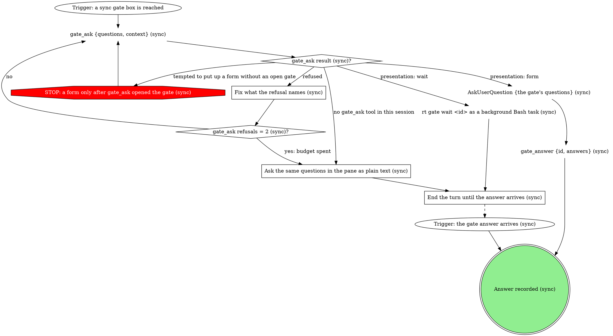

# gitq sync runner

Rebase every branch of one tracked stack onto its parent's new head, and
resolve any conflicts along the way. The `gitq` CLI owns the mechanics (the
cascade, the pause, the bookkeeping); you own the judgment (what a conflicted
file should look like after the merge) and every question to the human goes
through a gate.

| flag | meaning |
|------|---------|
| `<repoPath>` (positional) | absolute path of the repo checkout |
| `<stackName>` (positional) | the tracked stack to sync |
| `--state <path>` | lifecycle status file the board polls (optional) |
| `--status-bin <path>` | absolute path to the gitq executable, called as `<status-bin> job-status` (optional) |

## Flow

```dot
digraph gitq_sync {
    rankdir=TB;

    "<status-bin> job-status <state> working \"syncing <stackName>\"" [shape=plaintext];
    "Trigger: /gitq:sync <repoPath> <stackName> [--state <path> --status-bin <path>]" [shape=ellipse];
    "gitq --version (sync)" [shape=plaintext];
    "gitq on PATH (sync)?" [shape=diamond];
    "<status-bin> job-status <state> error \"gitq not on PATH\" (sync)" [shape=plaintext];
    "gitq missing: told the human to run rt deps link gitq (sync)" [shape=doublecircle];
    "<status-bin> job-status <state> error \"<reason>\" (sync)" [shape=plaintext];
    "Report the failure to the human (sync)" [shape=box];
    "sync failed: reported" [shape=doublecircle];
    "Held (sync): cascade paused for the human" [shape=doublecircle];
    "<status-bin> job-status <state> done \"rebased <n> branches, resolved <m> conflicts\"" [shape=plaintext];
    "Launch asked for the MRs to be updated (sync)?" [shape=diamond];
    "Report the rebased branches and each resolution (sync)" [shape=box];
    "Stack rebased (sync)" [shape=doublecircle style=filled fillcolor=lightgreen];
    "gitq -C <repoPath> stacks --json (sync)" [shape=plaintext];
    "Parked lease on this stack (sync)?" [shape=diamond];
    "sync gate: take over the parked pause" [shape=box];
    "Take-over answer (sync)?" [shape=diamond];
    "Take-over rounds = 2 (sync)?" [shape=diamond];
    "Recover the pause from the parked lease" [shape=box];
    "Unmerged paths in the parked slot (sync)?" [shape=diamond];
    "Held (sync): the pause belongs to another pane" [shape=doublecircle];
    "gitq -C <repoPath> preflight --json" [shape=plaintext];
    "Preflight for <stackName> (sync)?" [shape=diamond];
    "STOP: sync never stashes or commits; a dirty tree is reported" [shape=octagon style=filled fillcolor=red fontcolor=white];
    "gitq -C <repoPath> sync --stack <stackName> --json" [shape=plaintext];
    "gitq sync exit (sync)?" [shape=diamond];
    "STOP: sync never pushes; the report names gitq push for the human" [shape=octagon style=filled fillcolor=red fontcolor=white];
    "<status-bin> job-status <state> conflict \"<n> conflicts on <branch> (commit <i>/<total>)\" (sync)" [shape=plaintext];
    "Resolve the next conflicted file in <rebaseDir> (sync)" [shape=box];
    "Resolution for this file (sync)?" [shape=diamond];
    "STOP: every conflicted file is read and merged by hand (sync)" [shape=octagon style=filled fillcolor=red fontcolor=white];
    "git -C <rebaseDir> add <file> (sync)" [shape=plaintext];
    "git -C <rebaseDir> rm <file> (sync)" [shape=plaintext];
    "Conflicted files left on this pause (sync)?" [shape=diamond];
    "git -C <rebaseDir> status --porcelain (sync)" [shape=plaintext];
    "Unmerged paths left (sync)?" [shape=diamond];
    "gitq -C <repoPath> continue --stack <stackName> --json (sync)" [shape=plaintext];
    "gitq continue exit (sync)?" [shape=diamond];
    "STOP: the cascade moves only through gitq continue and gitq abort (sync)" [shape=octagon style=filled fillcolor=red fontcolor=white];
    "Same pause as before (sync)?" [shape=diamond];
    "Resolve attempts on this pause = 3 (sync)?" [shape=diamond];
    "Conflict pauses = 20 (sync)?" [shape=diamond];
    "gitq -C <repoPath> abort --stack <stackName> (sync)" [shape=plaintext];
    "sync gate: conflict needs human judgment" [shape=box];
    "sync gate: this pause will not clear" [shape=box];
    "sync gate: 20 conflict pauses this run" [shape=box];
    "Judgment answer (sync)?" [shape=diamond];
    "Judgment rounds = 2 (sync)?" [shape=diamond];
    "Apply the human's resolution (sync judgment gate)" [shape=box];
    "Human kept or deleted the file (sync judgment gate)?" [shape=diamond];
    "Pause answer (sync)?" [shape=diamond];
    "Pause rounds = 2 (sync)?" [shape=diamond];
    "Apply the human's resolution (sync pause gate)" [shape=box];
    "Human kept or deleted the file (sync pause gate)?" [shape=diamond];
    "Twenty-pause answer (sync)?" [shape=diamond];
    "Twenty-pause rounds = 2 (sync)?" [shape=diamond];
    "sync off-script gate: gitq continue refused" [shape=box];
    "Answer to \"gitq continue refused\" (sync)?" [shape=diamond];
    "Runs after \"gitq continue refused\" = 2 (sync)?" [shape=diamond];
    "Held (sync): the refusal waits on the human" [shape=doublecircle];
    "sync off-script gate: gitq sync refused" [shape=box];
    "Answer to \"gitq sync refused\" (sync)?" [shape=diamond];
    "Runs after \"gitq sync refused\" = 2 (sync)?" [shape=diamond];

    "Trigger: /gitq:sync <repoPath> <stackName> [--state <path> --status-bin <path>]" -> "gitq --version (sync)";
    "gitq --version (sync)" -> "gitq on PATH (sync)?";
    "gitq on PATH (sync)?" -> "<status-bin> job-status <state> working \"syncing <stackName>\"" [label="yes"];
    "gitq on PATH (sync)?" -> "<status-bin> job-status <state> error \"gitq not on PATH\" (sync)" [label="no"];
    "<status-bin> job-status <state> error \"gitq not on PATH\" (sync)" -> "gitq missing: told the human to run rt deps link gitq (sync)";
    "<status-bin> job-status <state> error \"<reason>\" (sync)" -> "Report the failure to the human (sync)";
    "Report the failure to the human (sync)" -> "sync failed: reported";
    "<status-bin> job-status <state> done \"rebased <n> branches, resolved <m> conflicts\"" -> "Launch asked for the MRs to be updated (sync)?";
    "Launch asked for the MRs to be updated (sync)?" -> "Report the rebased branches and each resolution (sync)" [label="no"];
    "Launch asked for the MRs to be updated (sync)?" -> "Report the rebased branches and each resolution (sync)" [label="yes: the report names gitq push as the human's move"];
    "Launch asked for the MRs to be updated (sync)?" -> "STOP: sync never pushes; the report names gitq push for the human" [label="tempted to push the restacked branches"];
    "STOP: sync never pushes; the report names gitq push for the human" -> "Report the rebased branches and each resolution (sync)";
    "Report the rebased branches and each resolution (sync)" -> "Stack rebased (sync)";
    "<status-bin> job-status <state> working \"syncing <stackName>\"" -> "gitq -C <repoPath> stacks --json (sync)";
    "gitq -C <repoPath> stacks --json (sync)" -> "Parked lease on this stack (sync)?";
    "Parked lease on this stack (sync)?" -> "sync gate: take over the parked pause" [label="yes"];
    "Parked lease on this stack (sync)?" -> "gitq -C <repoPath> preflight --json" [label="no"];
    "sync gate: take over the parked pause" -> "Take-over answer (sync)?";
    "Take-over answer (sync)?" -> "Recover the pause from the parked lease" [label="take: the earlier pane is gone, resume here"];
    "Take-over answer (sync)?" -> "Take-over rounds = 2 (sync)?" [label="iterate: check the lease again"];
    "Take-over answer (sync)?" -> "Held (sync): the pause belongs to another pane" [label="hold"];
    "Take-over answer (sync)?" -> "<status-bin> job-status <state> error \"<reason>\" (sync)" [label="hand back"];
    "Take-over rounds = 2 (sync)?" -> "gitq -C <repoPath> stacks --json (sync)" [label="no"];
    "Take-over rounds = 2 (sync)?" -> "<status-bin> job-status <state> error \"<reason>\" (sync)" [label="yes: budget spent"];
    "gitq -C <repoPath> preflight --json" -> "Preflight for <stackName> (sync)?";
    "Preflight for <stackName> (sync)?" -> "<status-bin> job-status <state> error \"<reason>\" (sync)" [label="dirty launch worktree"];
    "Preflight for <stackName> (sync)?" -> "STOP: sync never stashes or commits; a dirty tree is reported" [label="tempted to stash or commit the changes"];
    "STOP: sync never stashes or commits; a dirty tree is reported" -> "<status-bin> job-status <state> error \"<reason>\" (sync)";
    "Preflight for <stackName> (sync)?" -> "gitq -C <repoPath> sync --stack <stackName> --json" [label="clean; predicted conflicts are only noted"];
    "gitq -C <repoPath> sync --stack <stackName> --json" -> "gitq sync exit (sync)?";
    "<status-bin> job-status <state> conflict \"<n> conflicts on <branch> (commit <i>/<total>)\" (sync)" -> "Resolve the next conflicted file in <rebaseDir> (sync)";
    "Resolve the next conflicted file in <rebaseDir> (sync)" -> "Resolution for this file (sync)?";
    "Resolution for this file (sync)?" -> "git -C <rebaseDir> add <file> (sync)" [label="merged both intents, or kept the file"];
    "Resolution for this file (sync)?" -> "git -C <rebaseDir> rm <file> (sync)" [label="honour a one-side deletion"];
    "Resolution for this file (sync)?" -> "sync gate: conflict needs human judgment" [label="the merged behavior cannot be inferred"];
    "Resolution for this file (sync)?" -> "STOP: every conflicted file is read and merged by hand (sync)" [label="tempted to take one side wholesale or strip the markers"];
    "STOP: every conflicted file is read and merged by hand (sync)" -> "Resolve the next conflicted file in <rebaseDir> (sync)";
    "git -C <rebaseDir> add <file> (sync)" -> "Conflicted files left on this pause (sync)?";
    "git -C <rebaseDir> rm <file> (sync)" -> "Conflicted files left on this pause (sync)?";
    "Conflicted files left on this pause (sync)?" -> "Resolve the next conflicted file in <rebaseDir> (sync)" [label="yes"];
    "Conflicted files left on this pause (sync)?" -> "git -C <rebaseDir> status --porcelain (sync)" [label="no"];
    "git -C <rebaseDir> status --porcelain (sync)" -> "Unmerged paths left (sync)?";
    "Unmerged paths left (sync)?" -> "gitq -C <repoPath> continue --stack <stackName> --json (sync)" [label="no"];
    "Unmerged paths left (sync)?" -> "Resolve attempts on this pause = 3 (sync)?" [label="yes"];
    "gitq -C <repoPath> continue --stack <stackName> --json (sync)" -> "gitq continue exit (sync)?";
    "gitq continue exit (sync)?" -> "<status-bin> job-status <state> done \"rebased <n> branches, resolved <m> conflicts\"" [label="0"];
    "gitq continue exit (sync)?" -> "Same pause as before (sync)?" [label="2"];
    "gitq continue exit (sync)?" -> "sync off-script gate: gitq continue refused" [label="1 with a gitq: line"];
    "gitq continue exit (sync)?" -> "<status-bin> job-status <state> error \"<reason>\" (sync)" [label="1 after JSON: the cascade ended with a failed branch"];
    "gitq continue exit (sync)?" -> "STOP: the cascade moves only through gitq continue and gitq abort (sync)" [label="tempted to drive the rebase with git directly"];
    "STOP: the cascade moves only through gitq continue and gitq abort (sync)" -> "gitq -C <repoPath> continue --stack <stackName> --json (sync)";
    "Same pause as before (sync)?" -> "Resolve attempts on this pause = 3 (sync)?" [label="yes: same branch and commit"];
    "Same pause as before (sync)?" -> "Conflict pauses = 20 (sync)?" [label="no: a new pause"];
    "Resolve attempts on this pause = 3 (sync)?" -> "<status-bin> job-status <state> conflict \"<n> conflicts on <branch> (commit <i>/<total>)\" (sync)" [label="no"];
    "Resolve attempts on this pause = 3 (sync)?" -> "sync gate: this pause will not clear" [label="yes: budget spent"];
    "Conflict pauses = 20 (sync)?" -> "<status-bin> job-status <state> conflict \"<n> conflicts on <branch> (commit <i>/<total>)\" (sync)" [label="no"];
    "Conflict pauses = 20 (sync)?" -> "sync gate: 20 conflict pauses this run" [label="yes: budget spent"];
    "sync gate: conflict needs human judgment" -> "Judgment answer (sync)?";
    "Judgment answer (sync)?" -> "Apply the human's resolution (sync judgment gate)" [label="take: the human names the resolution"];
    "Judgment answer (sync)?" -> "Judgment rounds = 2 (sync)?" [label="iterate: a note to try again"];
    "Judgment answer (sync)?" -> "Held (sync): cascade paused for the human" [label="hold"];
    "Judgment answer (sync)?" -> "gitq -C <repoPath> abort --stack <stackName> (sync)" [label="hand back"];
    "Judgment rounds = 2 (sync)?" -> "Resolve the next conflicted file in <rebaseDir> (sync)" [label="no: resolve again with the note"];
    "Judgment rounds = 2 (sync)?" -> "gitq -C <repoPath> abort --stack <stackName> (sync)" [label="yes: budget spent"];
    "Apply the human's resolution (sync judgment gate)" -> "Human kept or deleted the file (sync judgment gate)?";
    "Human kept or deleted the file (sync judgment gate)?" -> "git -C <rebaseDir> add <file> (sync)" [label="kept"];
    "Human kept or deleted the file (sync judgment gate)?" -> "git -C <rebaseDir> rm <file> (sync)" [label="deleted"];
    "sync gate: this pause will not clear" -> "Pause answer (sync)?";
    "Pause answer (sync)?" -> "Apply the human's resolution (sync pause gate)" [label="take: the human names the resolution"];
    "Pause answer (sync)?" -> "Pause rounds = 2 (sync)?" [label="iterate: a note to try again"];
    "Pause answer (sync)?" -> "Held (sync): cascade paused for the human" [label="hold"];
    "Pause answer (sync)?" -> "gitq -C <repoPath> abort --stack <stackName> (sync)" [label="hand back"];
    "Pause rounds = 2 (sync)?" -> "Resolve the next conflicted file in <rebaseDir> (sync)" [label="no: resolve again with the note"];
    "Pause rounds = 2 (sync)?" -> "gitq -C <repoPath> abort --stack <stackName> (sync)" [label="yes: budget spent"];
    "Apply the human's resolution (sync pause gate)" -> "Human kept or deleted the file (sync pause gate)?";
    "Human kept or deleted the file (sync pause gate)?" -> "git -C <rebaseDir> add <file> (sync)" [label="kept"];
    "Human kept or deleted the file (sync pause gate)?" -> "git -C <rebaseDir> rm <file> (sync)" [label="deleted"];
    "sync gate: 20 conflict pauses this run" -> "Twenty-pause answer (sync)?";
    "Twenty-pause answer (sync)?" -> "<status-bin> job-status <state> conflict \"<n> conflicts on <branch> (commit <i>/<total>)\" (sync)" [label="take: keep going for another 20"];
    "Twenty-pause answer (sync)?" -> "Twenty-pause rounds = 2 (sync)?" [label="iterate: keep going with a note"];
    "Twenty-pause answer (sync)?" -> "Held (sync): cascade paused for the human" [label="hold"];
    "Twenty-pause answer (sync)?" -> "gitq -C <repoPath> abort --stack <stackName> (sync)" [label="hand back"];
    "Twenty-pause rounds = 2 (sync)?" -> "<status-bin> job-status <state> conflict \"<n> conflicts on <branch> (commit <i>/<total>)\" (sync)" [label="no"];
    "Twenty-pause rounds = 2 (sync)?" -> "gitq -C <repoPath> abort --stack <stackName> (sync)" [label="yes: budget spent"];
    "sync off-script gate: gitq continue refused" -> "Answer to \"gitq continue refused\" (sync)?";
    "Answer to \"gitq continue refused\" (sync)?" -> "Runs after \"gitq continue refused\" = 2 (sync)?" [label="take: the human fixed it, run it again"];
    "Answer to \"gitq continue refused\" (sync)?" -> "Runs after \"gitq continue refused\" = 2 (sync)?" [label="iterate: run it again with the note"];
    "Answer to \"gitq continue refused\" (sync)?" -> "Held (sync): cascade paused for the human" [label="hold"];
    "Answer to \"gitq continue refused\" (sync)?" -> "gitq -C <repoPath> abort --stack <stackName> (sync)" [label="hand back"];
    "Runs after \"gitq continue refused\" = 2 (sync)?" -> "gitq -C <repoPath> continue --stack <stackName> --json (sync)" [label="no"];
    "Runs after \"gitq continue refused\" = 2 (sync)?" -> "gitq -C <repoPath> abort --stack <stackName> (sync)" [label="yes: budget spent"];
    "gitq -C <repoPath> abort --stack <stackName> (sync)" -> "<status-bin> job-status <state> error \"<reason>\" (sync)";
    "Recover the pause from the parked lease" -> "Unmerged paths in the parked slot (sync)?";
    "Unmerged paths in the parked slot (sync)?" -> "<status-bin> job-status <state> conflict \"<n> conflicts on <branch> (commit <i>/<total>)\" (sync)" [label="yes"];
    "Unmerged paths in the parked slot (sync)?" -> "git -C <rebaseDir> status --porcelain (sync)" [label="no: no unmerged paths remain"];
    "gitq sync exit (sync)?" -> "<status-bin> job-status <state> done \"rebased <n> branches, resolved <m> conflicts\"" [label="0"];
    "gitq sync exit (sync)?" -> "<status-bin> job-status <state> conflict \"<n> conflicts on <branch> (commit <i>/<total>)\" (sync)" [label="2: paused on a conflict"];
    "gitq sync exit (sync)?" -> "sync gate: take over the parked pause" [label="1 naming a parked lease"];
    "gitq sync exit (sync)?" -> "sync off-script gate: gitq sync refused" [label="1, any other reason"];
    "sync off-script gate: gitq sync refused" -> "Answer to \"gitq sync refused\" (sync)?";
    "Answer to \"gitq sync refused\" (sync)?" -> "Runs after \"gitq sync refused\" = 2 (sync)?" [label="take: the human fixed it, run it again"];
    "Answer to \"gitq sync refused\" (sync)?" -> "Runs after \"gitq sync refused\" = 2 (sync)?" [label="iterate: run it again with the note"];
    "Answer to \"gitq sync refused\" (sync)?" -> "Held (sync): the refusal waits on the human" [label="hold"];
    "Answer to \"gitq sync refused\" (sync)?" -> "<status-bin> job-status <state> error \"<reason>\" (sync)" [label="hand back"];
    "Runs after \"gitq sync refused\" = 2 (sync)?" -> "gitq -C <repoPath> sync --stack <stackName> --json" [label="no"];
    "Runs after \"gitq sync refused\" = 2 (sync)?" -> "<status-bin> job-status <state> error \"<reason>\" (sync)" [label="yes: budget spent"];
}
```

Every `<status-bin> job-status` node is skipped when `--state` and
`--status-bin` were not given (a manual launch), and a hold writes nothing,
so the board badge keeps `conflict` or `working` while the pane waits.

## Asking the human

Every gate box below is walked through this graph, and its answer diamond in
the flow graph branches on the recorded answer.



Pass each gate's questions as `{id, label, multi: false, options}` with
`{value, label, description}` options, and put the quoted material in
`context`, never trimmed. Each option's `value` is its edge keyword
(`take`, `iterate`, `hold`, `hand back`), so the answer maps straight onto
the gate's answer diamond. An answer that carries a resolution or a note
brings it in the answer's `note` or `text`.

The presentation comes from `gate_ask`'s result alone: `gate_ask result (sync)?`
branches on the `presentation` it returns, never on your own choice or on
the launch flags. On `form`, put up the AskUserQuestion form and call
`gate_answer {id, answers}` with its answers in the same turn, back to
back: the answer is not recorded until `gate_answer` runs, so a turn that
ends between the two leaves the gate open and unanswered.

### End the turn until the answer arrives (sync)

End the turn with one line saying what the gate asks. Do not poll, do not
guess the answer, and do not keep working on the stack: the next turn starts
when the background wait finishes or the human replies in the pane, and it
reads that answer as the gate's.

### Fix what the refusal names (sync)

`gate_ask` refuses a malformed ask, such as no `context` on a human-owned
gate or a missing required field. Fix exactly what the refusal names and ask
again with the same questions and options. A question over 4 options is not
a refusal: the gate opens as `wait` and reports `formCapExceeded`, so keep
every question at 4 options or fewer.

### Ask the same questions in the pane as plain text (sync)

Write the gate's context, then each question with its options and their
one-sentence descriptions, as plain text in the reply. Never put up an
AskUserQuestion form here: no gate is open, so the pane's hook refuses it.

## Steps

### sync gate: take over the parked pause

Opens when the stack already has a parked lease (matched as
`Recover the pause from the parked lease` describes), or when `gitq sync`
exits 1 naming one. A parked lease is either a crashed run or a pane holding
at one of its own gates, and the lease cannot tell which. A held pause
belongs to the pane that asked, so this run never takes it without an
answer.

Context: the lease's worktree `path`, its paused `branch`, its
`lease.action` (the gitq command that parked it: `sync`, `absorb`, `split`,
`fold` or `reparent`), the unmerged lines from
`git -C <path> status --porcelain`, and any open gate on this stack from
`gate_list {open: true}`, quoted.

Set `recommended: true` on hold and list hold first when `gate_list` shows
an open gate on this stack, or when `lease.action` is not `sync`: a pause
another command parked belongs to the run that started it. Otherwise set it
on take and list take first.

| Question | Options (recommended first) |
|---|---|
| This stack has a parked cascade. Resume it here? | `hold: leave it paused`: another pane owns the pause; this run ends without touching it. `take: resume it here`: the earlier pane is gone; I recover the pause and resolve its conflicts. `iterate: check the lease again`: I re-read the stacks and ask again with your note. `hand back: stop with an error`: I mark the run failed with "stack has a parked cascade owned elsewhere". |

Two iterate rounds spend the budget: the next iterate answer writes the
error "take-over of the parked cascade not settled after 2 rounds".

### Recover the pause from the parked lease

Find the stack by `stackName` in `gitq -C <repoPath> stacks --json`'s
`stacks[]` and take its `id`. The parked lease is the `worktrees[]` entry
whose `lease.stackId` equals that `id` and whose `lease.state` is `parked`.
Preflight's output carries no stack id and diagnose's `globalBlocks` does
not show a lease parked in a work slot, so neither can answer this.

From that entry: `<rebaseDir>` is its `path`, the paused branch is its
`branch`, and the conflicted files are the unmerged lines of
`git -C <rebaseDir> status --porcelain`. When no unmerged lines remain,
the earlier pane staged every file before it stopped, so go straight to the
porcelain check and the continue. The lease carries no commit position, so the first conflict write names the branch and writes the commit
as `?/?`, and `Same pause as before (sync)?` compares on the branch alone
until `gitq continue` returns a `pauseInfo`.

### Resolve the next conflicted file in <rebaseDir> (sync)

After `Recover the pause from the parked lease`, `<rebaseDir>` is the
lease's `path` until `gitq continue` returns a `pauseInfo`. Otherwise
`<rebaseDir>` is `pauseInfo.worktreePath` (a gitq work slot), else
`pauseInfo.treePath`, else `<repoPath>` only when both are absent. The
launch worktree is not where the rebase is; never resolve there.

`pauseInfo` says where the cascade stopped: `currentBranch`,
`commitIndex`/`commitTotal`, `conflictFiles` (always present) and
`conflictTypes` (when present, a two-letter porcelain code per file: `UU`
both modified, `AA` both added, `DU`/`UD` deleted on one side).

For the file at hand, read its conflict markers, get both sides' intent
from `git -C <rebaseDir> log --oneline --merge` and the surrounding code,
then edit the file to the content that preserves both intents. A `DU`/`UD`
file is a deliberate call between keeping it and honouring the deletion.
When both sides rewrote the same logic to different ends and the merged
behavior cannot be read from the code, that is the judgment gate, never a
guess and never an abort.

When a gate's take answer named this file's content, or keeping or
deleting it, that is the resolution: write it as given and go straight to
staging, without merging on top of it. A note from a gate's iterate answer
steers the next attempt on the files it names.

### sync gate: conflict needs human judgment

Opens when both sides rewrote the same logic to different ends and the right
merged behavior is not inferable from the code.

Context: the file path and the conflicted hunk with both sides verbatim,
each side's commit from `git -C <rebaseDir> log --oneline --merge`, and one
sentence on why the merge cannot be inferred.

| Question | Options (recommended first) |
|---|---|
| How should this conflict resolve? | `take: I name the resolution`: you give the merged content, or keep or delete the file, and I apply it. `iterate: try again with a note`: I resolve the file again, steered by your note. `hold: leave the cascade paused`: the pause stays for you and this run ends with the badge on conflict. `hand back: abort the cascade`: I abort the rebase for this stack and mark the run failed. |

On hand back the error reason is "conflict on <file> needs human judgment:
<why>". Two iterate rounds spend the budget: the next iterate answer aborts
the cascade and writes "conflict on <file> not settled after 2 rounds".

### Apply the human's resolution (sync judgment gate)

Write exactly what the human named into the file in `<rebaseDir>`, or
follow their keep or delete. Do not re-merge on top of their answer.

### sync gate: this pause will not clear

Opens when `gitq continue` re-paused on the same `currentBranch` and
`commitIndex`, or unmerged paths survived staging, three times on one pause.

Context: the latest `pauseInfo.conflictFiles` and the unmerged lines of
`git -C <rebaseDir> status --porcelain`, quoted, plus one line per attempt
on what was tried.

| Question | Options (recommended first) |
|---|---|
| This pause keeps coming back. What next? | `take: I name the resolution`: you give the content for the files still conflicted, and I apply it. `iterate: try again with a note`: I resolve the files again, steered by your note. `hold: leave the cascade paused`: the pause stays for you and this run ends with the badge on conflict. `hand back: abort the cascade`: I abort the rebase for this stack and mark the run failed. |

An iterate does not restart the resolve-attempt count: this pause's count
stays at 3, so when the next continue re-pauses on the same branch and
commit, or unmerged paths survive staging again, the run comes straight back
to this gate, and `Pause rounds = 2 (sync)?` bounds how often. A new pause
starts its own count.

On hand back the error reason is "pause on <branch> (commit <i>/<total>)
will not clear: <files still conflicted>". Two iterate rounds spend the
budget: the next iterate answer aborts the cascade and writes "pause on
<branch> (commit <i>/<total>) not settled after 2 rounds".

### Apply the human's resolution (sync pause gate)

Write exactly what the human named into each file it covers in
`<rebaseDir>`, or follow their keep or delete, one file at a time. Do not
re-merge on top of their answer.

### sync gate: 20 conflict pauses this run

Opens on the twentieth distinct pause this run (a new `currentBranch` or
`commitIndex` each time). Take restarts the count; iterate restarts it too
and carries the note into the next resolutions.

Context: the stack name, the branch and commit of each pause so far with one
line on how each resolved, and the current `pauseInfo`.

| Question | Options (recommended first) |
|---|---|
| Twenty conflict pauses so far. Keep going? | `take: keep going for another 20`: I carry on resolving and ask again after 20 more pauses. `iterate: keep going with a note`: I carry on, steered by your note. `hold: leave the cascade paused`: the pause stays for you and this run ends with the badge on conflict. `hand back: abort the cascade`: I abort the rebase for this stack and mark the run failed. |

On hand back the error reason is "stopped after <n> conflict pauses". Two
iterate rounds spend the budget: the next iterate answer aborts the cascade
and writes "conflict pauses past 20 not settled after 2 rounds".

### sync off-script gate: gitq continue refused

Opens when `gitq continue` exits 1 with a `gitq:` line on stderr: a
refusal, with the lease still parked and the pause intact. Fixing what the
refusal names is the human's call, not this run's.

An exit 1 after the normal JSON is not this gate. It means the rebase's
continue failed with no conflicted files: the failing `results` entry has
`success: false` and the error "rebase --continue failed", and gitq has
already ended the cascade, cleared its pause and released the lease. There
is nothing left to continue or abort, so that edge writes the error "gitq
continue failed on <branch>: rebase --continue failed" and reports.

Context: the `gitq:` stderr line verbatim.

| Question | Options (recommended first) |
|---|---|
| gitq continue refused. What next? | `take: fixed it, run again`: you fixed what the refusal names, and I run the continue again. `iterate: run again with a note`: I run the continue again after acting on your note. `hold: leave the cascade paused`: the pause stays for you and this run ends with the badge on conflict. `hand back: abort the cascade`: I abort the rebase for this stack and mark the run failed. |

A hold reaches `Held (sync): cascade paused for the human`: the pause stays
in `<rebaseDir>` for the human. On hand back the error reason is "gitq
continue refused on <branch>: <the gitq: line>".

### sync off-script gate: gitq sync refused

Opens when `gitq sync` exits 1 for any reason but a parked lease: a fetch
failure, an unresolvable `origin/<trunk>`, a missing branch, or a leased or
busy slot. A hard failure prints a `gitq:` line on
stderr with nothing on stdout; a per-branch failure emits the normal JSON
first, and the failing entry's `success: false` says what broke.

Context: the `gitq:` stderr line verbatim, or the failing JSON entry.

| Question | Options (recommended first) |
|---|---|
| gitq sync refused. What next? | `take: fixed it, run again`: you fixed what the refusal names, and I run gitq sync again. `iterate: run again with a note`: I run gitq sync again after acting on your note. `hold: leave it with you`: this run ends and writes no status. `hand back: stop with an error`: I mark the run failed with the refusal as the reason. |

### Report the failure to the human (sync)

Say why the run stopped, in the words of the reason just written. The
error write's reason is the string the board shows:

- A dirty launch worktree, reason "worktree has uncommitted changes": list
  the modified paths, then tell the human to commit or stash first, or run
  gitq:absorb, which exists for exactly this. Preflight's `report.dirty` is
  only a flag, so read the paths from `git -C <repoPath> status --porcelain`.
- A hand back at the judgment gate, reason "conflict on <file> needs human
  judgment: <why>", or its budget spent, reason "conflict on <file> not
  settled after 2 rounds": lay out the conflict and both sides so the human
  can resolve it by hand.
- A hand back at the pause gate, reason "pause on <branch> (commit
  <i>/<total>) will not clear: <files still conflicted>", or its budget
  spent, reason "pause on <branch> (commit <i>/<total>) not settled after 2
  rounds": list each attempt and what it tried.
- A hand back at the twenty-pause gate, reason "stopped after <n> conflict
  pauses", or its budget spent, reason "conflict pauses past 20 not settled
  after 2 rounds": name the pauses so far.
- A hand back at the continue-refused gate, reason "gitq continue refused
  on <branch>: <the gitq: line>": quote the line.
- A continue that ended the cascade with a failed branch, reason "gitq
  continue failed on <branch>: rebase --continue failed": gitq released the
  lease, but the rebase may still be in progress in the slot
  (`<rebaseDir>`). Name the slot and the branch so the human can look there
  before running the sync again.
- A hand back at the take-over gate, reason "stack has a parked cascade
  owned elsewhere", or its budget spent, reason "take-over of the parked
  cascade not settled after 2 rounds": quote the lease.
- A refusal: quote the `gitq:` line.

### Report the rebased branches and each resolution (sync)

List the branches rebased, each conflict with one line on how it was
resolved, and anything worth flagging. End with the human's next move:
`gitq push` brings already-published branches up to their restacked heads,
and opening MRs for branches that have none is gitq:publish. Both are the
human's to run, even when the launch message asked for the open PRs to be
updated.

## What the graph cannot show

- Every gitq call runs as `gitq -C <repoPath> ...`; conflicted files are
  read, edited and staged in `<rebaseDir>`, never the launch worktree.
- `gitq continue` and `gitq abort` always carry `--stack <stackName>`.
  Without it gitq refuses when several stacks are parked, and acts on
  another stack's lease when that is the only one parked.
- The rebase moves only through `gitq continue` and `gitq abort`. git's own
  rebase continue, abort and skip leave gitq's stack bookkeeping stale.
- The trunk branch (the branch the stack root sits on) is never rebased or
  touched; gitq never rebases it and neither do you.
- `gitq preflight --json` takes no `--stack`: it reports every tracked
  stack, so find this stack's entry by `stackName` in its `stacks` array.
  That entry's `report.dirty` is the dirty launch worktree edge. Predicted
  conflicts are information only.
- A pause is one `currentBranch` plus `commitIndex`. Resolve attempts count
  per pause and restart on a new one; conflict pauses count per run. Each
  gate's rounds and each `Runs after` counter count per gate. A counter
  diamond's `yes` edge is taken once its count has reached the number.
- Every path but a hold ends through a `done` or `error` write, the
  missing-gitq stop included, so the board badge never sticks. On a hold,
  tell the human in the pane what is waiting on them. When a cascade is
  paused, that is where it sits (`<rebaseDir>`, branch, conflicted files),
  and running the sync again reaches the take-over gate and resumes it. When
  `gitq sync` itself refused, no cascade exists: quote the refusal, and
  running the sync again starts fresh once it is fixed.

## Rationalizations

| Thought | Reality |
|---|---|
| "abort the rebase and clear the pause instead of forcing a guessed merge" | An uninferable conflict opens `sync gate: conflict needs human judgment`. The abort runs only on the human's hand back. |
| "I ran gitq abort rather than guess" | Abort is not the only alternative to guessing: the judgment gate keeps the pause while the human decides. |
| "the skill requires stopping and asking rather than guessing" | Asking is `gate_ask`, with the pause intact, never a prose ask after an abort. |
| "skill has no rule for a pre-existing parked lease" | A parked lease on this stack opens `sync gate: take over the parked pause`. |
| "I'd expect gitq to report this as its own pause state" | The lease is checked with `gitq stacks` before any sync; `gitq sync` over a parked lease refuses. |
| "never do so for a rebase I did not pause and do not own" | Who owns the pause is the take-over gate's question, and the human answers it. |
| "I would treat that as consent to proceed rather than stop and re-ask" | Sync never pushes, whatever the launch message asked. The report names `gitq push` as the human's next move. |
| "the skill's exit-1 handling only calls for marking error and reporting" | A refusal opens its own off-script gate; the human fixes it and answers take. |
| "fixing application/lint issues is outside what this skill's steps describe" | Right, you do not fix it: the continue-refused gate hands the fix to the human and keeps the cascade. |
| "The tools being present is a distractor" | Every question to the human is `gate_ask`, per `Asking the human`. |
| "They said keep it moving, I'm in a meeting, so I answer the gate for them" | A remark in the pane before any gate opened is not an answer to a gate. Open it through `gate_ask` and act only on the answer it records. |
