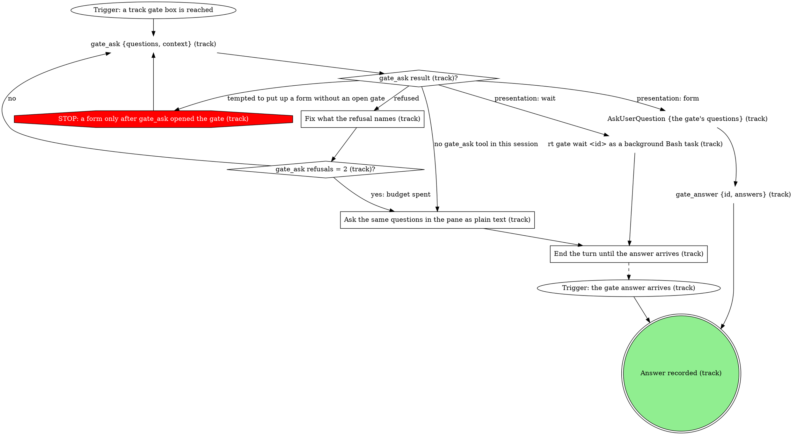

# gitq track

Turn a set of branches into a tracked gitq stack. gitq owns the mechanics
(`track`, `add`, `import`, `stacks`); you own the assessment in front of
them. The commands are trivial. The assessment is the whole job, and getting
it wrong is what opens duplicate MRs.

| argument | meaning |
|----------|---------|
| `[repoPath]` (positional, optional) | repo checkout to work in; default the cwd |

## Paths

`Path (track)?` reads slots 3 and 4 of the Step 1 block (the four slots in
`Fill the Root and Members slots (track)`) against this table.
Import is usable only when the repo tracks nothing else, because it is not
scoped to one stack.

| Published | Repo already tracks other stacks | Path |
|-----------|----------------------------------|------|
| none | either | track + add |
| all of them | no | import |
| all of them | yes | track + add, then the 5b hand back |
| some, or unknown | either | track + add, then the 5b hand back |

The 5b rows need no edge of their own: after track and add,
`Any member published or unknown (track)?` sends them to the 5b hand back.

## Flow

```dot
digraph gitq_track {
    rankdir=TB;

    "Trigger: /gitq:track [repoPath]" [shape=ellipse];
    "gitq --version (track)" [shape=plaintext];
    "gitq on PATH (track)?" [shape=diamond];
    "gitq missing: told the human to run bun link in the gitq checkout (track)" [shape=doublecircle];

    "Fill the Root and Members slots (track)" [shape=box];
    "Forge (track)?" [shape=diamond];
    "STOP: Published comes from the forge or reads unknown" [shape=octagon style=filled fillcolor=red fontcolor=white];
    "mr_for_branch {repoName: <repoPath>, branches: [<branch>]}" [shape=plaintext];
    "gh pr list --head <branch> --state open" [shape=plaintext];
    "Forge answered for <branch> (track)?" [shape=diamond];
    "Write unknown in Published for <branch> and say why (track)" [shape=box];
    "Branches left to check (track)?" [shape=diamond];
    "gitq -C <repoPath> stacks (track)" [shape=plaintext];

    "Two branches could each be the other's parent (track)?" [shape=diamond];
    "STOP: no gitq write before the parents are confirmed" [shape=octagon style=filled fillcolor=red fontcolor=white];
    "track gate: confirm the parents" [shape=box];
    "Parents answer (track)?" [shape=diamond];
    "Parents rounds = 2 (track)?" [shape=diamond];
    "Path (track)?" [shape=diamond];

    "gitq -C <repoPath> import" [shape=plaintext];
    "gitq import exit (track)?" [shape=diamond];
    "STOP: --replace only after the human hears what it discards" [shape=octagon style=filled fillcolor=red fontcolor=white];
    "STOP: the human supplies forge tokens (import)" [shape=octagon style=filled fillcolor=red fontcolor=white];
    "track gate: replace every tracked stack" [shape=box];
    "Replace answer (track)?" [shape=diamond];
    "Replace rounds = 2 (track)?" [shape=diamond];
    "gitq -C <repoPath> import --replace" [shape=plaintext];
    "gitq import --replace exit (track)?" [shape=diamond];
    "STOP: the human supplies forge tokens (import --replace)" [shape=octagon style=filled fillcolor=red fontcolor=white];
    "track gate: gitq import --replace refused" [shape=box];
    "Replace refused answer (track)?" [shape=diamond];
    "Replace attempts = 2 (track)?" [shape=diamond];
    "Replace refused rounds = 2 (track)?" [shape=diamond];
    "track gate: gitq import refused" [shape=box];
    "Import refused answer (track)?" [shape=diamond];
    "Import attempts = 2 (track)?" [shape=diamond];
    "Import refused rounds = 2 (track)?" [shape=diamond];
    "gitq -C <repoPath> stacks (after import)" [shape=plaintext];
    "Imported chain matches, nothing excluded came along (track)?" [shape=diamond];
    "STOP: tracking is read-only on git; gitq stacks is the check (after import)" [shape=octagon style=filled fillcolor=red fontcolor=white];
    "track gate: imported chain differs" [shape=box];
    "Imported chain answer (track)?" [shape=diamond];
    "Imported chain rounds = 2 (track)?" [shape=diamond];

    "Pick the stack name (track)" [shape=box];
    "gitq -C <repoPath> track <stackName> --root <root>" [shape=plaintext];
    "gitq track exit (track)?" [shape=diamond];
    "track gate: gitq track refused" [shape=box];
    "Track refused answer (track)?" [shape=diamond];
    "Track attempts = 2 (track)?" [shape=diamond];
    "Track refused rounds = 2 (track)?" [shape=diamond];
    "gitq -C <repoPath> add <branch> --parent <parent>" [shape=plaintext];
    "gitq add exit (track)?" [shape=diamond];
    "track gate: gitq add refused" [shape=box];
    "Add refused answer (track)?" [shape=diamond];
    "Add attempts on this member = 2 (track)?" [shape=diamond];
    "Add refused rounds = 2 (track)?" [shape=diamond];
    "Recheck this member's parent with the human's note (track)" [shape=box];
    "Members left to add (track)?" [shape=diamond];
    "gitq -C <repoPath> stacks (verify)" [shape=plaintext];
    "Chain matches the Members slot (track)?" [shape=diamond];
    "STOP: tracking is read-only on git; gitq stacks is the check" [shape=octagon style=filled fillcolor=red fontcolor=white];
    "track gate: tracked chain differs" [shape=box];
    "Tracked chain answer (track)?" [shape=diamond];
    "Chain rebuilds = 2 (track)?" [shape=diamond];
    "Tracked chain rounds = 2 (track)?" [shape=diamond];
    "gitq -C <repoPath> untrack <stackName>" [shape=plaintext];
    "gitq untrack exit (track)?" [shape=diamond];
    "track gate: gitq untrack refused" [shape=box];
    "Untrack refused answer (track)?" [shape=diamond];
    "Untrack attempts = 2 (track)?" [shape=diamond];
    "Untrack refused rounds = 2 (track)?" [shape=diamond];

    "Any member published or unknown (track)?" [shape=diamond];
    "STOP: 5b never publishes or guesses iids; the ways out are the human's" [shape=octagon style=filled fillcolor=red fontcolor=white];
    "Reproduce the Step 1 block, report the chain and exclusions (track 5a)" [shape=box];
    "Stack tracked (track)" [shape=doublecircle style=filled fillcolor=lightgreen];
    "Reproduce the Step 1 block, name the duplicate-MR risk (track 5b)" [shape=box];
    "Tracked with the duplicate-MR risk handed to the human (track 5b)" [shape=doublecircle];
    "Held (track): the turn ends naming the open gate" [shape=doublecircle];
    "Reproduce the Step 1 block and say why the run stopped (track)" [shape=box];
    "Handed back (track): the run stopped before a clean hand back" [shape=doublecircle];

    "Trigger: /gitq:track [repoPath]" -> "gitq --version (track)";
    "gitq --version (track)" -> "gitq on PATH (track)?";
    "gitq on PATH (track)?" -> "Fill the Root and Members slots (track)" [label="yes"];
    "gitq on PATH (track)?" -> "gitq missing: told the human to run bun link in the gitq checkout (track)" [label="no"];

    "Fill the Root and Members slots (track)" -> "Forge (track)?" [label="first member"];
    "Forge (track)?" -> "mr_for_branch {repoName: <repoPath>, branches: [<branch>]}" [label="GitLab"];
    "Forge (track)?" -> "gh pr list --head <branch> --state open" [label="GitHub"];
    "Forge (track)?" -> "Write unknown in Published for <branch> and say why (track)" [label="forge unreachable"];
    "Forge (track)?" -> "STOP: Published comes from the forge or reads unknown" [label="tempted to write none without asking the forge"];
    "STOP: Published comes from the forge or reads unknown" -> "Forge (track)?";
    "mr_for_branch {repoName: <repoPath>, branches: [<branch>]}" -> "Forge answered for <branch> (track)?";
    "gh pr list --head <branch> --state open" -> "Forge answered for <branch> (track)?";
    "Forge answered for <branch> (track)?" -> "Branches left to check (track)?" [label="yes: Published takes the open iid, or none"];
    "Forge answered for <branch> (track)?" -> "Write unknown in Published for <branch> and say why (track)" [label="no: an error or no answer"];
    "Write unknown in Published for <branch> and say why (track)" -> "Branches left to check (track)?";
    "Branches left to check (track)?" -> "Forge (track)?" [label="yes: next member"];
    "Branches left to check (track)?" -> "gitq -C <repoPath> stacks (track)" [label="no: slot 3 is full"];

    "gitq -C <repoPath> stacks (track)" -> "Two branches could each be the other's parent (track)?";
    "Two branches could each be the other's parent (track)?" -> "Path (track)?" [label="no"];
    "Two branches could each be the other's parent (track)?" -> "track gate: confirm the parents" [label="yes"];
    "Two branches could each be the other's parent (track)?" -> "STOP: no gitq write before the parents are confirmed" [label="tempted to track now and fix the parents later"];
    "STOP: no gitq write before the parents are confirmed" -> "track gate: confirm the parents";
    "track gate: confirm the parents" -> "Parents answer (track)?";
    "Parents answer (track)?" -> "Path (track)?" [label="take: the human confirms or names the parents"];
    "Parents answer (track)?" -> "Parents rounds = 2 (track)?" [label="iterate: a note to reassess"];
    "Parents answer (track)?" -> "Held (track): the turn ends naming the open gate" [label="hold"];
    "Parents answer (track)?" -> "Reproduce the Step 1 block and say why the run stopped (track)" [label="hand back"];
    "Parents rounds = 2 (track)?" -> "Fill the Root and Members slots (track)" [label="no: reassess with the note"];
    "Parents rounds = 2 (track)?" -> "Reproduce the Step 1 block and say why the run stopped (track)" [label="yes: budget spent"];

    "Path (track)?" -> "gitq -C <repoPath> import" [label="import: every member has an open MR/PR and Tracking is none"];
    "Path (track)?" -> "Pick the stack name (track)" [label="track + add: any member none, some or unknown, or other stacks tracked"];

    "gitq -C <repoPath> import" -> "gitq import exit (track)?";
    "gitq import exit (track)?" -> "gitq -C <repoPath> stacks (after import)" [label="0"];
    "gitq import exit (track)?" -> "track gate: replace every tracked stack" [label="refused: stacks exist, pass --replace"];
    "gitq import exit (track)?" -> "track gate: gitq import refused" [label="refused: token, forge host or project"];
    "gitq import exit (track)?" -> "STOP: --replace only after the human hears what it discards" [label="tempted to pass --replace unasked"];
    "gitq import exit (track)?" -> "STOP: the human supplies forge tokens (import)" [label="tempted to supply a forge token yourself"];
    "STOP: --replace only after the human hears what it discards" -> "track gate: replace every tracked stack";
    "STOP: the human supplies forge tokens (import)" -> "track gate: gitq import refused";

    "track gate: replace every tracked stack" -> "Replace answer (track)?";
    "Replace answer (track)?" -> "gitq -C <repoPath> import --replace" [label="take: the human approves discarding the named stacks"];
    "Replace answer (track)?" -> "Replace rounds = 2 (track)?" [label="iterate: a note on the path"];
    "Replace answer (track)?" -> "Held (track): the turn ends naming the open gate" [label="hold"];
    "Replace answer (track)?" -> "Reproduce the Step 1 block and say why the run stopped (track)" [label="hand back"];
    "Replace rounds = 2 (track)?" -> "Path (track)?" [label="no: pick the path again with the note"];
    "Replace rounds = 2 (track)?" -> "Reproduce the Step 1 block and say why the run stopped (track)" [label="yes: budget spent"];

    "gitq -C <repoPath> import --replace" -> "gitq import --replace exit (track)?";
    "gitq import --replace exit (track)?" -> "gitq -C <repoPath> stacks (after import)" [label="0"];
    "gitq import --replace exit (track)?" -> "track gate: gitq import --replace refused" [label="refused"];
    "gitq import --replace exit (track)?" -> "STOP: the human supplies forge tokens (import --replace)" [label="tempted to supply a forge token yourself"];
    "STOP: the human supplies forge tokens (import --replace)" -> "track gate: gitq import --replace refused";
    "track gate: gitq import --replace refused" -> "Replace refused answer (track)?";
    "Replace refused answer (track)?" -> "Replace attempts = 2 (track)?" [label="take: the human fixed the cause, retry"];
    "Replace refused answer (track)?" -> "Replace refused rounds = 2 (track)?" [label="iterate: a note on the path"];
    "Replace refused answer (track)?" -> "Held (track): the turn ends naming the open gate" [label="hold"];
    "Replace refused answer (track)?" -> "Reproduce the Step 1 block and say why the run stopped (track)" [label="hand back"];
    "Replace attempts = 2 (track)?" -> "gitq -C <repoPath> import --replace" [label="no"];
    "Replace attempts = 2 (track)?" -> "Reproduce the Step 1 block and say why the run stopped (track)" [label="yes: budget spent"];
    "Replace refused rounds = 2 (track)?" -> "Path (track)?" [label="no: pick the path again with the note"];
    "Replace refused rounds = 2 (track)?" -> "Reproduce the Step 1 block and say why the run stopped (track)" [label="yes: budget spent"];

    "track gate: gitq import refused" -> "Import refused answer (track)?";
    "Import refused answer (track)?" -> "Import attempts = 2 (track)?" [label="take: the human fixed the token or forge host, retry"];
    "Import refused answer (track)?" -> "Import refused rounds = 2 (track)?" [label="iterate: a note on the path"];
    "Import refused answer (track)?" -> "Held (track): the turn ends naming the open gate" [label="hold"];
    "Import refused answer (track)?" -> "Reproduce the Step 1 block and say why the run stopped (track)" [label="hand back"];
    "Import attempts = 2 (track)?" -> "gitq -C <repoPath> import" [label="no"];
    "Import attempts = 2 (track)?" -> "Reproduce the Step 1 block and say why the run stopped (track)" [label="yes: budget spent"];
    "Import refused rounds = 2 (track)?" -> "Path (track)?" [label="no: pick the path again with the note"];
    "Import refused rounds = 2 (track)?" -> "Reproduce the Step 1 block and say why the run stopped (track)" [label="yes: budget spent"];

    "gitq -C <repoPath> stacks (after import)" -> "Imported chain matches, nothing excluded came along (track)?";
    "Imported chain matches, nothing excluded came along (track)?" -> "Reproduce the Step 1 block, report the chain and exclusions (track 5a)" [label="yes"];
    "Imported chain matches, nothing excluded came along (track)?" -> "track gate: imported chain differs" [label="no"];
    "Imported chain matches, nothing excluded came along (track)?" -> "STOP: tracking is read-only on git; gitq stacks is the check (after import)" [label="tempted to sync, push or publish to check the tracking"];
    "STOP: tracking is read-only on git; gitq stacks is the check (after import)" -> "gitq -C <repoPath> stacks (after import)";
    "track gate: imported chain differs" -> "Imported chain answer (track)?";
    "Imported chain answer (track)?" -> "Reproduce the Step 1 block, report the chain and exclusions (track 5a)" [label="take: the human accepts the imported chain"];
    "Imported chain answer (track)?" -> "Imported chain rounds = 2 (track)?" [label="iterate: the human changed it, check again"];
    "Imported chain answer (track)?" -> "Held (track): the turn ends naming the open gate" [label="hold"];
    "Imported chain answer (track)?" -> "Reproduce the Step 1 block and say why the run stopped (track)" [label="hand back"];
    "Imported chain rounds = 2 (track)?" -> "gitq -C <repoPath> stacks (after import)" [label="no"];
    "Imported chain rounds = 2 (track)?" -> "Reproduce the Step 1 block and say why the run stopped (track)" [label="yes: budget spent"];

    "Pick the stack name (track)" -> "gitq -C <repoPath> track <stackName> --root <root>";
    "gitq -C <repoPath> track <stackName> --root <root>" -> "gitq track exit (track)?";
    "gitq track exit (track)?" -> "gitq -C <repoPath> add <branch> --parent <parent>" [label="0: add the first member"];
    "gitq track exit (track)?" -> "track gate: gitq track refused" [label="non-zero"];
    "track gate: gitq track refused" -> "Track refused answer (track)?";
    "Track refused answer (track)?" -> "Track attempts = 2 (track)?" [label="take: the human fixed the cause, retry"];
    "Track refused answer (track)?" -> "Track refused rounds = 2 (track)?" [label="iterate: a note on the name or root"];
    "Track refused answer (track)?" -> "Held (track): the turn ends naming the open gate" [label="hold"];
    "Track refused answer (track)?" -> "Reproduce the Step 1 block and say why the run stopped (track)" [label="hand back"];
    "Track attempts = 2 (track)?" -> "gitq -C <repoPath> track <stackName> --root <root>" [label="no"];
    "Track attempts = 2 (track)?" -> "Reproduce the Step 1 block and say why the run stopped (track)" [label="yes: budget spent"];
    "Track refused rounds = 2 (track)?" -> "Pick the stack name (track)" [label="no: pick again with the note"];
    "Track refused rounds = 2 (track)?" -> "Reproduce the Step 1 block and say why the run stopped (track)" [label="yes: budget spent"];

    "gitq -C <repoPath> add <branch> --parent <parent>" -> "gitq add exit (track)?";
    "gitq add exit (track)?" -> "Members left to add (track)?" [label="0"];
    "gitq add exit (track)?" -> "track gate: gitq add refused" [label="non-zero"];
    "track gate: gitq add refused" -> "Add refused answer (track)?";
    "Add refused answer (track)?" -> "Add attempts on this member = 2 (track)?" [label="take: the human fixed the cause, retry"];
    "Add refused answer (track)?" -> "Add refused rounds = 2 (track)?" [label="iterate: a note on this member's parent"];
    "Add refused answer (track)?" -> "Held (track): the turn ends naming the open gate" [label="hold"];
    "Add refused answer (track)?" -> "Reproduce the Step 1 block and say why the run stopped (track)" [label="hand back"];
    "Add attempts on this member = 2 (track)?" -> "gitq -C <repoPath> add <branch> --parent <parent>" [label="no"];
    "Add attempts on this member = 2 (track)?" -> "Reproduce the Step 1 block and say why the run stopped (track)" [label="yes: budget spent"];
    "Add refused rounds = 2 (track)?" -> "Recheck this member's parent with the human's note (track)" [label="no"];
    "Add refused rounds = 2 (track)?" -> "Reproduce the Step 1 block and say why the run stopped (track)" [label="yes: budget spent"];
    "Recheck this member's parent with the human's note (track)" -> "gitq -C <repoPath> add <branch> --parent <parent>";
    "Members left to add (track)?" -> "gitq -C <repoPath> add <branch> --parent <parent>" [label="yes: next member, parents first"];
    "Members left to add (track)?" -> "gitq -C <repoPath> stacks (verify)" [label="no"];

    "gitq -C <repoPath> stacks (verify)" -> "Chain matches the Members slot (track)?";
    "Chain matches the Members slot (track)?" -> "Any member published or unknown (track)?" [label="yes"];
    "Chain matches the Members slot (track)?" -> "track gate: tracked chain differs" [label="no (an empty chain means --root was a member)"];
    "Chain matches the Members slot (track)?" -> "STOP: tracking is read-only on git; gitq stacks is the check" [label="tempted to sync, push or publish to check the tracking"];
    "STOP: tracking is read-only on git; gitq stacks is the check" -> "gitq -C <repoPath> stacks (verify)";
    "track gate: tracked chain differs" -> "Tracked chain answer (track)?";
    "Tracked chain answer (track)?" -> "Chain rebuilds = 2 (track)?" [label="take: untrack and rebuild the chain the human confirmed"];
    "Tracked chain answer (track)?" -> "Tracked chain rounds = 2 (track)?" [label="iterate: the human changed it, check again"];
    "Tracked chain answer (track)?" -> "Held (track): the turn ends naming the open gate" [label="hold"];
    "Tracked chain answer (track)?" -> "Reproduce the Step 1 block and say why the run stopped (track)" [label="hand back"];
    "Chain rebuilds = 2 (track)?" -> "gitq -C <repoPath> untrack <stackName>" [label="no"];
    "Chain rebuilds = 2 (track)?" -> "Reproduce the Step 1 block and say why the run stopped (track)" [label="yes: budget spent"];
    "Tracked chain rounds = 2 (track)?" -> "gitq -C <repoPath> stacks (verify)" [label="no"];
    "Tracked chain rounds = 2 (track)?" -> "Reproduce the Step 1 block and say why the run stopped (track)" [label="yes: budget spent"];

    "gitq -C <repoPath> untrack <stackName>" -> "gitq untrack exit (track)?";
    "gitq untrack exit (track)?" -> "Pick the stack name (track)" [label="0: rebuild"];
    "gitq untrack exit (track)?" -> "track gate: gitq untrack refused" [label="non-zero"];
    "track gate: gitq untrack refused" -> "Untrack refused answer (track)?";
    "Untrack refused answer (track)?" -> "Untrack attempts = 2 (track)?" [label="take: the human fixed the cause, retry"];
    "Untrack refused answer (track)?" -> "Untrack refused rounds = 2 (track)?" [label="iterate: the human changed it, check again"];
    "Untrack refused answer (track)?" -> "Held (track): the turn ends naming the open gate" [label="hold"];
    "Untrack refused answer (track)?" -> "Reproduce the Step 1 block and say why the run stopped (track)" [label="hand back"];
    "Untrack attempts = 2 (track)?" -> "gitq -C <repoPath> untrack <stackName>" [label="no"];
    "Untrack attempts = 2 (track)?" -> "Reproduce the Step 1 block and say why the run stopped (track)" [label="yes: budget spent"];
    "Untrack refused rounds = 2 (track)?" -> "gitq -C <repoPath> stacks (verify)" [label="no"];
    "Untrack refused rounds = 2 (track)?" -> "Reproduce the Step 1 block and say why the run stopped (track)" [label="yes: budget spent"];

    "Any member published or unknown (track)?" -> "Reproduce the Step 1 block, report the chain and exclusions (track 5a)" [label="no: 5a"];
    "Any member published or unknown (track)?" -> "Reproduce the Step 1 block, name the duplicate-MR risk (track 5b)" [label="yes: 5b"];
    "Any member published or unknown (track)?" -> "STOP: 5b never publishes or guesses iids; the ways out are the human's" [label="tempted to publish, or to write iids into the state file"];
    "STOP: 5b never publishes or guesses iids; the ways out are the human's" -> "Reproduce the Step 1 block, name the duplicate-MR risk (track 5b)";
    "Reproduce the Step 1 block, report the chain and exclusions (track 5a)" -> "Stack tracked (track)";
    "Reproduce the Step 1 block, name the duplicate-MR risk (track 5b)" -> "Tracked with the duplicate-MR risk handed to the human (track 5b)";
    "Reproduce the Step 1 block and say why the run stopped (track)" -> "Handed back (track): the run stopped before a clean hand back";
}
```

Track writes no board status: it is launched by hand only, with no
`--state` or `--status-bin` flags.

## Asking the human

Every gate box below is walked through this graph, and its answer diamond in
the flow graph branches on the recorded answer.



Pass each gate's questions as `{id, label, multi: false, options}` with
`{value, label, description}` options, at most 4 options per question, and
put the quoted material in `context`, never trimmed. Each option's `value`
is its edge keyword (`take`, `iterate`, `hold`, `hand back`), so the answer
maps straight onto the gate's answer diamond. Set `recommended: true` on the
option each table lists first, unless the gate's section names another. An
answer that carries a note brings it in the answer's `note` or `text`.

### End the turn until the answer arrives (track)

End the turn with one line saying what the gate asks. Do not poll, do not
guess the answer, and do not run another gitq command: the next turn starts
when the background wait finishes or the human replies in the pane, and it
reads that answer as the gate's.

### Fix what the refusal names (track)

`gate_ask` refuses a malformed ask, such as no `context` on a human-owned
gate or a missing required field. Fix exactly what the refusal names and ask
again with the same questions and options. A question over 4 options is not
a refusal: the gate opens as `wait` and reports `formCapExceeded`, so keep
every question at 4 options or fewer.

### Ask the same questions in the pane as plain text (track)

Write the gate's context, then each question with its options and their
one-sentence descriptions, as plain text in the reply. Never put up an
AskUserQuestion form here: no gate is open, so the pane's hook refuses it.

## Steps

### Fill the Root and Members slots (track)

Fill in all four slots below. This box fills Root and Members; the forge
loop that follows fills Published, and `gitq -C <repoPath> stacks (track)`
fills Tracking. Slot 3 is the one that gets skipped, and skipping it is what
duplicates MRs.

```text
Root:      <trunk branch the stack sits on>
Members:   <branch> <- <parent>   (one line per branch, parents first)
Published: <per branch: open MR/PR iid, or "none", or "unknown">
Tracking:  <stacks already tracked in this repo, or "none">
```

The filled block is the Step 1 block. Every hand back reproduces it
verbatim, as a block. Prose covering the same facts is not a substitute: the
human scans it to catch a wrong root or a wrong parent, and they cannot scan
what is scattered through a paragraph.

**Root.** `--root` names the trunk the stack sits *on*, and the root is not a
member. `gitq track s --root <first feature branch>` is the common misread:
it succeeds, and leaves a stack with no branches in it. For a chain off
`main`, the root is `main` and every feature branch is a node.

**Members and parents.** A branch's parent is the *nearest* branch whose
history contains that branch's fork point:
`git merge-base <branch> <candidate>`. Do not reach for
`git branch --contains <parent>`: a child cut before its parent's latest
commit is not listed by it, and that child is a normal stale child, not a
sibling. Leave out branches that merely share the trunk (spikes, unrelated
work); say which ones you excluded.

**Published.** Ask the forge, per branch, whether an open MR/PR already
exists. `Forge (track)?` reads the forge from the remote's host: GitLab is
`mr_for_branch` with this repo's path as `repoName`, GitHub is
`gh pr list --head <branch> --state open`. An open MR/PR gives its iid; an
answer that lists none gives "none".

On an iterate answer from `track gate: confirm the parents`, reassess with
the human's note and fill the block again.

### Write unknown in Published for <branch> and say why (track)

Reached when the forge could not be asked (no forge tool, no forge CLI, a
host that is neither forge) or answered with an error or not at all. Write
"unknown" for that branch, never "none", and say which forge call failed and
how. A branch pushed to a remote is not evidence either way. An unknown
routes the run to the 5b hand back.

### track gate: confirm the parents

Opens when two branches could each plausibly be the other's parent. It runs
before any state-writing gitq call; the `gitq stacks` read that filled slot 4
has already run. An "unknown" in slot 3 needs no gate here: track and add are
reversible with `untrack`, and the 5b hand back is where that one bites.

Context: the Step 1 block as a block, the two branches, why each could be
the other's parent (the merge-base reading for each), and the stack name
`Pick the stack name (track)` would take.

| Question | Options (recommended first) |
|---|---|
| Are these parents right? | `take: parents confirmed or named`: you confirm the block or name the parents, and I pick the path with them. `iterate: reassess with a note`: I fill the block again, steered by your note, and check the parents again. `hold: leave it with you`: this run ends with nothing tracked. `hand back: stop here`: I reproduce the Step 1 block and say why the run stopped. |

### track gate: replace every tracked stack

Opens when `gitq import` refuses because stacks already exist, and whenever
you are tempted to pass `--replace` without asking. `--replace` discards
*every* tracked stack in the repo, not only the one being adopted, and
rebuilds the whole store for the repo, re-minting stack ids. It runs only on
this gate's take, after the human has heard what it destroys.

Context: the `gitq:` refusal line verbatim, every stack slot 4 names and any
further stack the refusal names, each marked as discarded, and one line
saying the stack ids are re-minted for the whole repo.

Set `recommended: true` on iterate and list it first: track and add leaves
every other stack alone.

| Question | Options (recommended first) |
|---|---|
| Import needs --replace. Discard these stacks? | `iterate: pick the path again`: I pick the path again with your note, for example track and add, which keeps every other stack. `take: discard them and import`: I run gitq import with --replace, discarding the named stacks. `hold: leave it with you`: this run ends with nothing imported. `hand back: stop here`: I reproduce the Step 1 block and say why the run stopped. |

### track gate: gitq import --replace refused

Opens when `gitq import --replace` exits non-zero, and whenever you are
tempted to supply a forge token yourself. Import needs a forge token and a
forge host in the remote. The human supplies every token.

Context: the `gitq:` stderr line verbatim and the remote's host.

| Question | Options (recommended first) |
|---|---|
| gitq import --replace refused. What next? | `take: fixed it, retry`: you fixed what the refusal names, and I run the import with --replace again. `iterate: pick the path again`: I pick the path again with your note. `hold: leave it with you`: this run ends with what is tracked now. `hand back: stop here`: I reproduce the Step 1 block and say why the run stopped. |

### track gate: gitq import refused

Opens when `gitq import` refuses for a token, a forge host, or a remote that
names another project, and whenever you are tempted to supply a forge token
yourself. The human supplies every token. An iterate answer can move the
path to track + add.

Context: the `gitq:` stderr line verbatim and the remote's host.

| Question | Options (recommended first) |
|---|---|
| gitq import refused. What next? | `take: fixed it, retry`: you fixed the token or forge host, and I run gitq import again. `iterate: pick the path again`: I pick the path again with your note, for example track and add. `hold: leave it with you`: this run ends with nothing imported. `hand back: stop here`: I reproduce the Step 1 block and say why the run stopped. |

### track gate: imported chain differs

Opens when the chain `gitq stacks` prints after an import differs from slot
2, or a branch you meant to exclude came along. Import reads each branch's
parent from its MR target, so a difference is either a stale MR target or a
wrong slot 2.

Context: the imported chain and slot 2 side by side, and every branch that
came along though you meant to exclude it.

When an excluded branch came along, set `recommended: true` on iterate and
list it first; otherwise take stays first.

| Question | Options (recommended first) |
|---|---|
| The imported chain differs. Accept it? | `take: accept the imported chain`: I hand back with the chain as imported. `iterate: changed it, check again`: you changed the tracking, and I read gitq stacks again. `hold: leave it with you`: this run ends with the chain as imported. `hand back: stop here`: I reproduce the Step 1 block and say why the run stopped. |

### Pick the stack name (track)

The stack name is a local label. There is no rename-stack command
(`gitq rename` renames a *branch*), so a name you regret costs an `untrack`
plus the `add`s again. Use the name the human gave, in the launch message or
a gate answer. Otherwise take it from the shared branch prefix and say that
you did in the hand back.

On an iterate answer from `track gate: gitq track refused`, pick again with
the note on the name or the root.

### track gate: gitq track refused

Opens when `gitq track` exits non-zero.

Context: the `gitq:` stderr line verbatim, the stack name and the root.

| Question | Options (recommended first) |
|---|---|
| gitq track refused. What next? | `take: fixed it, retry`: you fixed what the refusal names, and I run gitq track again. `iterate: change the name or root`: I pick the name and root again with your note. `hold: leave it with you`: this run ends with what is tracked now. `hand back: stop here`: I reproduce the Step 1 block and say why the run stopped. |

### track gate: gitq add refused

Opens when `gitq add` exits non-zero. Members go in parent-before-child
order, since adding a child before its parent fails. `gitq add` accepts a
branch git does not have yet, so a missing branch is not the cause.

Context: the `gitq:` stderr line verbatim, the member and the parent it was
added under, and the members added so far.

| Question | Options (recommended first) |
|---|---|
| gitq add refused. What next? | `take: fixed it, retry`: you fixed what the refusal names, and I add this member again. `iterate: recheck this parent`: I recheck this member's parent with your note and add it again. `hold: leave it with you`: this run ends with the members added so far. `hand back: stop here`: I reproduce the Step 1 block and say why the run stopped. |

### Recheck this member's parent with the human's note (track)

Re-run the merge-base reasoning from `Fill the Root and Members slots
(track)` for this one member, steered by the note, and update its line in
slot 2. Keep parent-before-child order: the new parent is the root or a
member already added.

### track gate: tracked chain differs

Opens when the chain `gitq stacks` prints after track and add differs from
slot 2. An empty chain means `--root` named a member branch. The fix is
`untrack`, then track and add again (take), and rebuilds are bounded by
`Chain rebuilds = 2 (track)?`.

Context: the printed chain and slot 2 side by side, and, for an empty
chain, the root that was passed.

| Question | Options (recommended first) |
|---|---|
| The tracked chain differs. Rebuild it? | `take: untrack and rebuild`: I untrack the stack and track and add the chain you confirmed. `iterate: changed it, check again`: you changed the tracking, and I read gitq stacks again. `hold: leave it with you`: this run ends with the chain as tracked. `hand back: stop here`: I reproduce the Step 1 block and say why the run stopped. |

### track gate: gitq untrack refused

Opens when `gitq untrack` exits non-zero. The stack stays tracked as it is.

Context: the `gitq:` stderr line verbatim and the stack name.

| Question | Options (recommended first) |
|---|---|
| gitq untrack refused. What next? | `take: fixed it, retry`: you fixed what the refusal names, and I run gitq untrack again. `iterate: changed it, check again`: you changed the tracking, and I read gitq stacks again. `hold: leave it with you`: this run ends with the stack tracked as it is. `hand back: stop here`: I reproduce the Step 1 block and say why the run stopped. |

### Reproduce the Step 1 block, report the chain and exclusions (track 5a)

The clean case. Open with the Step 1 block as a block, then report the
tracked chain, the branches you excluded and why, and stop. A branch
reported behind its parent is a finding for this report, not a task to fix.

### Reproduce the Step 1 block, name the duplicate-MR risk (track 5b)

Published branches that import did not link. Open with the Step 1 block as a
block. Every node added by track and add carries `mrIid: null`.
`gitq publish` decides create-versus-update on that field alone and never
looks an MR up by source branch, so publishing one of these branches opens a
**second** MR alongside the one that is already open, and a branch whose
Published reads "unknown" may be one of them.

Say exactly that, name the affected branches, and stop. Do not publish, and
do not guess iids into the state file. The ways out are the human's call:
`gitq import --replace` (naming what it discards first), or hand-editing
`mrIid`/`mrUrl`/`status` in `$GITQ_CONFIG_DIR/stacks/<hash>.json`, default
`~/.mattstack/gitq/stacks/`, keyed by the realpath of the repo's git common dir.

### Reproduce the Step 1 block and say why the run stopped (track)

Open with the Step 1 block as a block, then name the gate answer or the
spent budget that ended the run, quote any refusal, and say what is tracked
right now as `gitq stacks` last printed it.

## What the graph cannot show

- Every gitq call runs as `gitq -C <repoPath> ...`, and `[repoPath]`
  defaults to the cwd.
- `gitq track` and `gitq add` write gitq's state and nothing else: no branch
  is created, moved, checked out, or rebased, and `gitq add` accepts a
  branch that does not exist in git yet. So adopting an existing chain and
  setting up a new one run the *same* commands.
- Tracking is read-only on git. No sync, push or publish runs as part of it,
  even when `diagnose` reports a branch behind its parent, even when
  `preflight` predicts no conflicts, and even to "verify tracking worked":
  `gitq stacks` is the verification. Sync rewrites branches that are already
  pushed and may already be under review; that is a separate decision the
  human makes with the facts you just gave them.
- `gitq import` rebuilds the whole store for the repo from the forge's open
  MRs, reading each branch's parent from its MR target, and links every MR
  to its node. It needs a forge token and a forge host in the remote.
- On a hold, tell the human in the pane which gate is open and what is
  tracked right now; running the skill again starts a fresh assessment.
- Each counter counts per run and per gate, except
  `Add attempts on this member = 2 (track)?`, which restarts for each
  member. A counter diamond's `yes` edge is taken once its count has reached
  the number.

## Rationalizations

| Thought | Reality |
|---|---|
| "`<branch-3>` and `<branch-4>` were added with `mrIid: null` because the forge timed out" | A timed-out forge writes "unknown" in Published for those branches, never "none", and the run ends at the 5b hand back naming them. |
| "the skill requires stopping and naming the branches rather than guessing or forcing `import --replace` past it" | With another stack in slot 4 the path is track + add. A stacks-exist refusal opens `track gate: replace every tracked stack`, never a prose stop. |
| "picking between the two 5b remediation paths is the human's call once they have the assessment, not mine to make unasked" | Right: the 5b hand back names both ways out and ends. Neither runs from this skill. |
| "get it tracked, and make sure it works" means a sync to prove it | Tracking is read-only on git. `gitq stacks` is the check. |
