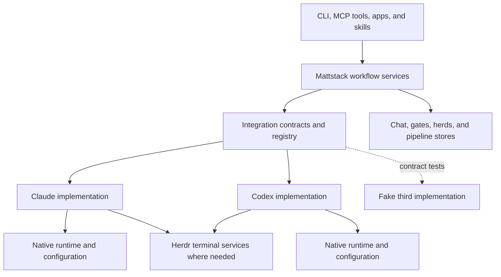

# Mattstack harness integrations and full Codex support

Date: 2026-10-04

Status: approved for implementation planning on 2026-10-04. The user approved
the written specification by requesting the implementation plan. Implementation
has not started. Updated 2026-10-05 after the approved F1 and focused hook
spikes; the user requested the corresponding spec and package re-plan.

Implementation tasks are in the [plan index](../plans/2026-10-04-harness-integrations.md).
The [F1 gating spike](../plans/2026-10-05-harness-integrations-0-gate-spike.md)
is complete. Its runtime gates pass with the focused hook follow-up; the
revised package plans incorporate that evidence and retain release acceptance
gaps. This revision does not authorize implementing those packages.

## Purpose and success criteria

Mattstack will support Claude Code and Codex through a shared integration
architecture. Either harness can run ordinary Mattstack workflows, shepherdr,
or workers. Claude is optional on a Codex installation. A shepherd can manage
workers using either harness, including both in one herd.

This is also an architectural change: Mattstack owns workflow semantics,
while registered integrations implement the native mechanisms. Adding a third
harness should require implementing and registering an integration, with its
tests and packaging, rather than modifying chat, gate, or herd algorithms.
Herdr's integrations and the user's analogy to database connectors describe
this software philosophy. They do not require dependence on Herdr's internal
integration APIs. Herdr remains the terminal surface.

Current Claude behavior is the compatibility reference, particularly for chat
and gates. The project must preserve working Claude installations while
bringing Codex to the same required Mattstack behavior. Matching native tool
names, CLI flags, or proprietary account features is not the definition of
parity.

Full support means a clean Codex-only installation can install Mattstack,
load its skills and tools, exchange chat, complete gates, run a pipeline,
run shepherdr and workers, use Board and gitq agent actions, recover from
interruptions, update, restore, and uninstall. The applicable workflows must
also pass on Claude-only and mixed-harness installations.

## Basis and scope

The [dependency audit](../spikes/2026-10-04-codex-dependency-audit.md) records
the source inventory at `7538cfe5c`, including existing abstractions and 28
dependency areas. The [runtime spike](../spikes/2026-10-04-codex-compatibility-spike.md)
and its [evidence](../spikes/2026-10-04-codex-compatibility-evidence.json)
establish feasibility for specific delivery, question, chat, and resume paths.
They do not establish production readiness or complete behavioral coverage.

### Evidence adopted on October 5

The [F1 report](../spikes/2026-10-05-harness-gate-spike-report.md) and
[hook follow-up](../spikes/2026-10-05-codex-hooks-followup.md) supplement,
rather than replace, the October 4 evidence. Tested Codex CLI/server 0.160.0
is one evidence point, not a supported version range.

| Boundary | Contract the implementation may rely on | Remaining acceptance |
| --- | --- | --- |
| Caller identity | CLI `CODEX_THREAD_ID`; MCP host `tools/call.params._meta.threadId`, scoped by native profile and resolved against a binding | Reject argument-supplied authority, wrong-profile metadata and stale attachments; host metadata is not a cryptographic credential |
| Synchronous questions | `item/tool/requestUserInput` with thread/turn/item identity; replay after controller reconnect, answer on the current connection, then `serverRequest/resolved` | Multiple questions, competing answer surfaces, cancellation and disconnect after response; all-client and service restart recovery |
| Hook policy | Trusted project PreToolUse can refuse `request_user_input`; Stop exit 2 can cause same-turn continuation, followed by an allowed stop | Actual Mattstack policy, failure/timeout paths, trust lifecycle, tampering and every admitted launch mode |
| Consumption | `thread/queue/add.clientUserMessageId` matches consumed `userMessage.clientId` plus thread/turn/item | Native restart survival, queue deduplication and replay; consumption is not completed work |
| Socket access | Host MCP reaches rt while worker remains workspaceWrite with network disabled | Real rt MCP grants and confinement, distributed setup and supported permission modes |

The original F1 terminals were not verified attached; their evidence describes
API-driven threads. The follow-up verified explicit remote CLI attachment.
Ordinary default-CLI equivalence remains acceptance work. Native async question
emission was observed, but no correlated answer-completion path was proved.

This design extends the existing
[agent provider design](2026-09-15-rt-agent-codex-provider-design.md) beyond
launching. It preserves the identity and continuation rules in the
[chat identity design](2026-09-27-chat-identity-design.md), generalizing their
session bindings. The current
[socket-first chat design](2026-08-28-rt-chat-delivery-v2-design.md) and current
implementation take precedence over historical tail/Monitor instructions.

The governing suite architecture remains in the documents linked from
[architecture.md](../../architecture.md). This specification does not change
rt's substrate role, suite distribution, the app catalog, or repo identity.
The "Claude Code mods" project (RT-384) plans an in-session Claude Code mod
with its own daemon link:
[RT-405](https://linear.app/mattstack/issue/RT-405) (`session:*` daemon
handlers), [RT-406](https://linear.app/mattstack/issue/RT-406) (a session
context record) and [RT-408](https://linear.app/mattstack/issue/RT-408) (an
incoming delivery router). Those are Claude-native mechanisms, not the
harness-neutral services this design adds. The mod becomes part of the Claude
integration: its daemon link reports Claude session bindings and attribution
into the shared session store and caller-context resolver, and its delivery
router is a Claude messaging mechanism. There is one session registry and one
caller-context record in the daemon, owned by the shared services here. The
mods tickets are rescoped to say so before either project implements them.
The same rule covers the project's other tickets that implement a shared
contract on Claude (the session state feed, tool-call policy, gate form,
wait gates, presence, run tracking, relocation and board status): the
daemon-side feed, store or policy is shared, and the mod is the Claude producer
or enforcer behind it. Claude adapters first wrap today's mechanisms, so this
project never waits on the early-access mods API. The plan index carries the
ticket-by-ticket mapping.

The scope includes first-party runtime code, bundled skills, setup and
maintenance, application entry points, and release verification. Required
external plugin connections must work on each supported installation profile.
Arbitrary third-party skill content is not automatically portable: discovery,
validation, and actionable incompatibility reporting are required, and packs
used in acceptance workflows must be exercised explicitly.

Independent connector processes, independently installed third-party
integrations, another production harness, cross-harness transcript conversion,
and redesigning current chat behavior are outside this release. Integrations
initially ship as modules maintained with Mattstack.

## Architecture and ownership

Use a registered integration composed of focused interfaces. One monolithic
adapter would couple setup, skill compilation, and live connections; separate
connector services would add a deployment and protocol lifecycle before it is
needed. Focused modules give each responsibility a testable boundary while
allowing both implementations to share ordinary utilities.

Mattstack owns chat membership/history, recipient selection, gate decisions,
workflow authorization, herd scheduling, pipeline state, and retry policy.
Integrations supply operations and observations; they do not become separate
owners of those stores or policy rules.

| Component | Contract responsibility | Native implementation examples |
| --- | --- | --- |
| Sessions | Prepare launch, bind the actual session, discover, resume, observe, and detach | CLI arguments, registry reads, native events, process observations |
| Messaging | Submit peer input and report the strength of available delivery evidence | Claude inbox frames; Codex native control transport |
| Questions | Identify a native question and complete or dismiss it in accordance with the stored gate decision | Claude form handling; Codex question request completion |
| Execution policy | Apply required gate, continuation, and access constraints | Hooks, supported tool mediation, native policy configuration |
| Skills and tools | Discover resources and supply validated instructions and artifacts for the harness | Tool vocabulary, delegation, wait instructions, skill paths |
| Installation | Inspect prerequisites; install, verify, update, restore, and uninstall owned integration configuration | Host settings, plugin/MCP registration, authentication checks |

Runtime modules must not load setup dependencies merely to deliver a message.
Skill compilation must not require a running agent. Herdr transport utilities
can be shared by implementations; native integration details stay behind
these contracts.

Extend the existing `lib/agent-argv` and agent launch seams rather than add
a second launcher. Shared runtime contracts and implementations belong in a
dedicated `lib/agent-integrations/` module family. Public metadata and wire
types belong in rt-client so apps consume the same contract without importing
daemon code. Existing modules can remain as forwarding facades during a
bounded migration; each facade is removed after its callers migrate.

Registration defines a stable harness identifier, display metadata, option
validation, and implementations of the component contracts. Per-harness
settings keys (today `agent.claude.*` and `agent.codex.*`) are part of
registering a harness: a third harness adds its own registry rows, and no
generic consumer reads them by name. The registry is
the authority for available integrations; generic consumers must not keep a
second exhaustive Claude/Codex switch. Provider-specific branching remains
valid inside integrations, registration, and legacy-data migration.

## Capabilities and compatibility

Distinguish four facts: an integration is registered; the user enabled it;
its prerequisites are currently ready; it supports a particular operation in
the current mode. An installed binary alone establishes none of the latter
three.

Capabilities describe behavior and evidence. Delivery to idle sessions,
delivery during work, handling a pending question, observing background work,
enforcing unattended gates, and resuming a session are distinct capabilities.
Interactive and headless modes may expose different capabilities. Model and
account choices are scoped to an integration; a harness is not a model vendor.

Host readiness and session readiness are separate. Inspecting an enabled,
trusted hook inventory is preflight evidence only. Managed launch holds the
assignment inactive until the actual bound session has exercised the required
hook entry points and produced correlated readiness evidence. A changed hook
revision, native version/profile or attachment invalidates that evidence.
Runtime policy errors withdraw readiness; they do not silently grant workflow
authority. Interactive unmanaged use may remain available with fewer capabilities.

Each workflow declares its required capabilities. Admission checks them
before launch or assignment, and operations recheck transient readiness.
An unsupported optional native feature is reported as such. Missing a required
capability blocks that workflow with a useful reason; it does not silently
weaken policy or select Claude. Both initial integrations must satisfy the
full Mattstack workflow profile before full Codex support is released.

Version checks combine a tested compatibility range with relevant runtime
probes. Experimental APIs are contained in the integration and their use is
reported in diagnostic metadata. Codex delivery currently depends on the
experimental `thread/queue/*` methods; that dependency is the largest release
risk, and the version matrix must re-verify it on every supported version. The spike versions are evidence points,
not a promised future support range. Selecting and testing release-supported
versions is part of the acceptance work, not an assumption this spec makes.

## Identity and lifecycle

Retain existing Mattstack agent/chat identities and distinguish them from
native sessions and runtime attachments.

| Record | Meaning |
| --- | --- |
| Mattstack identity | Existing logical identity and associated chat/workflow ownership |
| Native session reference | Harness ID, installation/profile scope when needed, and opaque native reference |
| Runtime attachment | Current process/connection and optional Herdr pane/socket, with a generation |
| Job attempt | Assignment, selected harness/options, native binding, and replacement history |

Native references may be IDs or paths according to the integration. Core code
does not assume UUID syntax or use arbitrary native references as filenames.
Harness and profile scope prevent collisions between otherwise equal native
references. Pane IDs, process IDs, names, and working directories are not
identities.

| Event | Identity and ownership rule |
| --- | --- |
| Fresh session | Fresh identity, or the identity explicitly reserved for this launch |
| Resume the same native session | Same identity, including resume in another pane |
| Repeated sign-in | Same identity for the same verified native session |
| Clear or fork into a new native session | Fresh identity unless an authorized continuation explicitly applies |
| Compaction retaining the native session | Retain identity; refresh attachment/context as needed |
| Explicit herd worker replacement | Mint a fresh worker identity as Claude does today, keeping predecessor DMs separate; retain job history and invalidate predecessor assignment authority |
| Explicit harness switch for a job | New attempt, native session and worker identity; preserve job history and invalidate predecessor authority, without implicitly inheriting predecessor DMs |
| Daemon restart | Reload bindings and reconcile; unresolved observations remain unknown |
| Sign-out or confirmed session end | Update presence and detach delivery using the existing ownership rules |

An existing native session must have at most one authoritative assignment
attachment for a job attempt. Replacement advances the attachment generation.
Delayed events and reports are checked against the current attempt/generation
before they mutate job state. A replacement does not transfer native question
request IDs or a conversation transcript into a different session.

All CLI and MCP paths use one session-context resolver. Its result identifies
the caller, verified native binding, current assignment, and authorized scope.
Native environment values can assist discovery, but an inherited pane ID or
an agent-supplied job ID alone cannot grant assignment authority. Missing or
ambiguous attribution refuses ownership-sensitive operations; it never picks
the latest run in the working directory.

Managed launches reserve the logical identity and attempt before spawn, then
bind the real native session through a correlated integration observation.
A timed-out binding remains an unresolved launch that can be reconciled; it
must not be treated as a ready worker or retried blindly into a second worker.
Manually started sessions can discover and sign into Mattstack through their
integration without inheriting a managed assignment.

The Codex spike observed correct thread IDs with incorrect inherited pane
variables. Codex CLI correlation uses `CODEX_THREAD_ID`; the MCP adapter reads
host `_meta.threadId` at the server request boundary, never from tool arguments
or the shared MCP process environment. Both references require profile scope
and a current binding. A metadata string alone is not assignment authority. Per-request CLI and MCP attribution under shared-server execution
is therefore a mandatory integration test. The implementation must establish
the binding through supported session/transport correlation before enabling
assignment-sensitive tools. This spec does not treat an environment-variable
rename as a solution to that issue.

## Messaging and delivery

The behavior contract is today's Claude behavior:

1. Persist the chat message and compute eligible recipients using existing
   membership, wake preferences, mention, DM, and human-message rules.
2. Attempt delivery immediately. Deliver message bodies with sender identity
   and the existing reply-channel guidance.
3. An idle recipient starts a turn. A working recipient receives input at the
   harness's supported boundary during work, as Claude does between tool calls.
4. Preserve batching, catch-up, read/mark behavior, acknowledgements, claims,
   and sender attribution. Agents do not need to arm a watcher or poll chat.

There is no new user preference choosing queueing versus interruption. Native
queueing or steering is an implementation mechanism selected to reproduce this
contract. Ordinary messages do not become permission grants or gate answers.
Peer-message provenance must survive translation into native input.

Keep logical delivery IDs stable across retries. Integrations report only what
they can establish: not submitted, submitted to the transport, acknowledged
by a native queue when available, or observed as consumed when available.
Transport submission is not proof of consumption or action. Missing evidence
remains unknown. Agent acknowledgements in chat remain a separate concept.

The current Claude inbox writer reports success after writing the frame and
does not await a receiver acknowledgement. Preserve its existing visible
cursor behavior while recording that weaker evidence accurately internally.
Codex must not claim stronger semantics merely because a queue call succeeds.
The stored room log remains the recovery source, including when native input
is blocked or its delivery outcome is ambiguous.

A definitely failed submission can enter bounded retry with backoff. An
ambiguous submission is reconciled before retry where the native API permits;
otherwise any redelivery retains the logical ID and cannot be claimed as
exactly-once delivery. Neither integration promises exactly-once model action.
Delivery failure must not undo the persisted chat message.

Claude retains its inbox transport and envelope handling. Codex uses the
native control path established by the spike, isolated behind the messaging
implementation and compatibility checks. Herdr prompting is a possible
capability-limited mechanism, not a universal fallback: the spike observed
it refusing input while a question was pending. A fallback is admitted only
when it preserves the required behavior for the observed state.

## Questions and gates

The gate store remains authoritative. Preserve existing gate ownership,
presentation routing, answer validation, first-answer-wins behavior, and
explicit authorized override semantics. A transport callback cannot invent
an answer or bypass gate authorization.

Each native presentation binds a gate to a native session, attachment
generation, and native request/question reference where that harness has one.
Unattended workflows continue to use Mattstack gates. Attended native forms
may be connected to the same gate decision through the integration.

For an external answer:

1. Validate and commit the answer through the existing gate service.
2. Read the authoritative resulting row, including the winner of a race.
3. Complete the matching native request, or notify and dismiss the matching
   form using the integration's supported mechanism.
4. Record the completion outcome separately from the gate's answer state.

Claude keeps the existing conditional behavior: a form is dismissed only
when the matching pane was observed blocked and the notification submission
succeeded. An idle or working pane is not sent Escape. Self-answers do not
create redundant notifications. Notifications instruct agents to read the
gate store; they do not substitute a copied answer as authority.

Codex initially advertises synchronous native form completion only in the
tested collaboration mode (plan mode). Unattended workflows use Mattstack
gates and their existing wait/subscription path. Default-mode native async
forms are not a substitute for that path and do not advertise form/recovery
capabilities until separately proved. This optional native limitation does
not waive any required Mattstack gate workflow.

For a synchronous form, persist thread/turn/item and question IDs with the
gate binding. Keep the current connection and inbound request handle in
memory. On reconnect, resume the same thread and match the replay by durable
identity before replacing the transient handle. A numeric request ID is
connection-local, may be zero or reused, and is never sufficient to select
an answer target. A matched `serverRequest/resolved` confirms that request
resolved, not which surface won an answer race; keep answer provenance and
report a conflict rather than overwrite an authoritative gate answer.

Codex can complete a correlated native question with the stored answer when
that question mechanism supports it. A steering message that wakes an async
wait is not proof that the native question was completed or dismissed. Each
supported question mode requires its own verified completion path.

If the native connection fails after the answer commits, the gate stays
answered and completion enters recovery. Reconnect must reconcile whether
the original request is still pending, already completed, or no longer
belongs to the current session. An old request ID is never answered against
a replacement session. A closed or cancelled gate must not be presented as
answered. Existing subscription and wait paths continue through the same
gate service.

Question presentation and policy enforcement are separate contracts. Port
the Claude question hook and pipeline Stop enforcement to equivalent
supported mechanisms. Required checks must be enforced at the appropriate
tool or state-transition boundary; prompting the model to obey them is not
sufficient. If an integration cannot enforce a required rule, that workflow
is unavailable and the full-support acceptance profile has not passed.

### Policy loading, enforcement and readiness

Native installation belongs to the integration. The proven Codex arrangement
uses hooks in an active trusted project `.codex` layer and separately trusted
exact hook hashes. Production uses the real project's native trust boundary;
it never creates a nested Git repository to make trust work. If that boundary
would require broader trust than the operator approved, setup reports not-ready.
User/plugin hook loading may be adopted only with equivalent acceptance evidence;
it is not inferred from the project-hook result.

Setup presents the exact project boundary, definitions and native hashes for
review. Runtime launch never grants trust, changes global sandbox policy or
restarts a shared daemon. Install/update/restore owns only its exact entries;
user edits and unrelated settings are preserved. A changed native hook hash
requires review again. Stable versioned executable paths and an owned artifact
fingerprint additionally detect script-content changes the native definition
hash may not cover. Native trust is not a general anti-tampering guarantee.

A fresh worker after installation is the proven loading path. Resume alone
was insufficient in the follow-up. New managed launches prepare configuration,
create the native thread with its intended sandbox, bind it without activating
the job, exercise correlated hook checks, activate the reserved assignment, and
only then submit actual work. Failed activation submits nothing; work submission
rechecks the current assignment immediately before its native side effect.
Existing sessions that cannot establish current policy readiness stay
unavailable for managed work; never silently replace their conversation.

Native hooks translate tool/event names and exact session/turn context into
shared policy decisions. Shared gate/run state determines whether a native
question is allowed and whether a running pipeline may stop. Preserve current
Claude cases: an owned running/open stage requests continuation; a current
hold or armed gate wait permits the turn to end without completing the run;
no owned running pipeline is not a continuation obligation. Extract the actual
fork-check rules rather than replacing them with a blanket ban on all questions.

Characterize current Claude failure and timeout escape paths and retain them.
An unavailable policy service must not trap an interactive agent forever, but
an allowed native stop caused by failure is not a successful workflow result.
Withdraw managed readiness and retain pending run/gate state with a recoverable
attention reason. A final-looking message is never completion evidence: observe
native turn completion and then apply existing Mattstack result checks. Test
repeated Stop refusals and cancellation explicitly before advertising continuation
policy; the one-shot spike does not establish loop limits or tamper resistance.

## Shepherdr and workflow supervision

Shepherdr may choose each worker's harness from the user's enabled, ready
integrations. An explicit user assignment wins. The selected integration must
support the job's required capabilities, and its model/account/options must
validate before launch. Use the configured default when no explicit
assignment or shepherd selection is provided.

Persist selection before launch and display harness and model in herd status.
Retries and resumes retain that selection. A harness change requires an
explicit replacement attempt with recorded history; it is not an invisible
fallback. A capability loss or unavailable integration surfaces a recoverable
condition without reassigning work silently.

The shepherd's harness does not constrain its workers. Both Claude and Codex
shepherds must be able to assign, monitor, receive reports from, retry, and
close mixed workers. Native subagents used inside one session are distinct
from Mattstack herd workers; skill instructions must preserve that distinction.

Supervision uses normalized observations with their freshness and source.
Track connectivity separately from execution state and background activity:
an idle foreground with live background work is not dead, and a disconnected
observation channel does not prove process death. Unknown state must remain
unknown. The existing non-Claude-is-dead branches and Claude footer parsing
move out of generic watchdog and herd handlers.

Pipeline ownership, CI leases, chat reporting, and gate operations use the
same context resolver and assignment checks. Persisted progress and gate
state remain in their existing stores. A native agent's statement that work
is complete is not a replacement for Mattstack's existing result checks.

## Skills and tool adaptation

Keep one canonical workflow source and extend the existing attachment and
compilation system with integration-specific fragments. Shared sources
describe the workflow and its required decisions. Integration fragments
describe native tools, questions, waiting, delegation, model/effort selection,
account handling, and resource paths.

Tool adaptation is not a global string replacement. Different harnesses may
require different sequences to implement the same step. Compilation validates
the selected integration's capabilities and emitted references and refuses an
artifact that cannot uphold its required workflow. Ordinary shared Markdown
can remain shared when no adaptation is needed.

Discovery, init, list, sync, update, linking, writing-style resolution, and
skill auditing must run without Claude on a Codex-only machine. Source
inventory and resource resolution come through the integration rather than
hardcoded Claude cache paths or CLI calls. Preserve formats already supported
by both hosts; a `.claude-plugin` filename alone does not require replacement.

Canonical sources remain authoritative. Regenerate compiled plugin and Board
copies through the existing build paths, including gate-protocol expansion.
Validation covers artifacts for both initial integrations and the actual tool
instructions used during live workflows, not just successful Markdown output.

MCP tool semantics and grants remain shared. Adapt host configuration and
caller attribution without broadening the agent-safe command set, file roots,
or permissions merely to make Codex work. New valid temporary and installed
resource roots must be explicitly scoped and validated, retaining traversal
and symlink protections. Uploads continue through the existing confinement
and configured-root mechanisms.

## Setup and application adoption

Setup configures enabled integrations and requires their applicable
prerequisites. A Codex-only machine must not require the Claude executable,
authentication, cache, or configuration. Each integration supplies its own
validation and owned configuration operations for plugins, skills, external
tools, MCP, permissions, and required lifecycle mechanisms.

Enabling and readiness are separate. Shepherdr selects only ready integrations
that satisfy the job. Setup reports what is missing and a supported remedy.
Missing socket access is not solved by a prompt or silently disabling a
sandbox; use an explicitly configured supported transport/access arrangement.
The exact Codex arrangement must pass the CLI and MCP acceptance scenarios.

Settings continue through the suite resolver and registry under the
[settings architecture](../../settings-architecture.md). Preserve existing
`agent.provider` and provider-specific configuration through registered
migrations where shapes change. `agent.provider` only chooses the `rt agent`
default; on an existing installation Claude also runs herds, chat, gates and
Board regardless of it. An upgrade therefore enables Claude plus the configured
`agent.provider`, written once by a dated migration, never `agent.provider`
alone. Team convention, user preference, and
machine-specific intent retain their existing scope rules. Observed versions,
session bindings, and readiness are runtime data, not synchronized settings.
Secrets retain the suite's encrypted storage and existing auth ownership.

Existing installations retain their configured behavior. Setup update remains
idempotent and respects user changes, including disabled or removed plugins.
Track integration-owned configuration so uninstall or disabling an integration
does not delete unrelated user settings. Disabling excludes new assignments;
it does not kill active sessions. Existing session bindings remain usable for
completion and reconciliation while the runtime is available.

Board, Chat, Console, gitq, and tray surfaces use shared integration metadata,
option validation, launch, and session APIs. Remove Claude-only pane filters,
direct launches, skill lookup, session capture, model lists, and copy from
generic flows. Preserve Board's existing shared fresh-launch path and
Console's existing provider support. Herdr chat inherits correct behavior
through rt's pane and chat APIs; absence of Claude literals in its own code
is not sufficient verification.

The worktree pool remains shared infrastructure. Native create/remove hooks,
relocation notification, and required directory access belong to integrations.
Both must respect rt's worktree ownership and lifecycle. This project does
not redesign pool hydration or introduce a second worktree manager.

## Migration and errors

For each boundary, characterize existing required behavior, wrap or extract
the Claude implementation, migrate callers, implement Codex against the same
contract, and remove superseded direct paths. Exercise both implementations
early so the interface is not frozen around Claude's transport or hooks.

Existing shared code remains shared. Claude inbox frames, session discovery,
form parsing, cswap, and hooks remain useful inside its implementation.
Mixed handlers are split at responsibility boundaries rather than rewritten
wholesale. Claude-specific native features remain explicit capabilities.

Use additive runtime schema migrations and compatibility readers for legacy
session fields such as `claude-session`. Infer Claude only where the old
record's provenance establishes it; preserve an existing explicit Codex
provider. Unresolvable records remain unbound and require reconciliation,
never a guess based on the newest worktree run. Preserve chat IDs, message
history, gate decisions, assignments, and explicit configured defaults.

Legacy readers cannot safely supervise new mixed-harness state. Downgrades
must follow the state schema/version contract and refuse unsupported records;
do not advertise rollback by relabeling Codex records as Claude. Settings
changes follow the existing versioned migration mechanism. Exact table and
wire changes are implementation-plan details subject to those contracts.

Classify integration outcomes so callers can distinguish unsupported behavior,
missing configuration/authentication, policy refusal, transient transport
failure, stale binding, and ambiguous submission. Preserve existing public
output contracts, including frozen chat output and JSON shapes unless an
explicit contract migration accompanies the change. Human diagnostics use
the existing output and logging seams, with integration/version/operation
context where useful; do not log credentials or full message bodies by default.

## Audit coverage register

The table assigns every dependency area in the audit a disposition and an
acceptance obligation. It is a coverage plan, not a claim that tests have run.
The source audit contains the corresponding file references.

| ID | Audit area | Disposition | Required evidence |
| --- | --- | --- | --- |
| A01 | Existing agent abstraction | Extend shared launch; registered session implementations | Launch/resume in supported interactive and headless modes; resolve native identity |
| A02 | Launch permissions and context | Integration launch/policy plus shared context resolver | Required directory/socket access and isolation between simultaneous workers |
| A03 | Shepherd ownership and worker reporting | Shared identity and attempt authority | Both shepherd harnesses; stale/foreign reports refused |
| A04 | Herd spawn and persistence | Shared selection and stored attempt metadata | Mixed assignment, retries, resume, explicit replacement |
| A05 | Watchdog and death detection | Shared supervision; integration observations | Codex never classified dead because of its harness; unknown/dead distinguished |
| A06 | Background activity and recovery | Integration observations and native dialog handling | Background work, blocked questions, trust/relocation states without inappropriate keystrokes |
| A07 | Session registry and identity | Shared binding model; integration discovery; migration | Fresh/resume/fork/clear, simultaneous sessions, reused panes, manual sign-in |
| A08 | Chat presence and continuity | Shared identities and presence; integration lifecycle | Sign-in/out, reconnect, compaction, continuation and catch-up |
| A09 | Inbox delivery and pane injection | Shared message policy; integration transport | Idle/busy/blocked delivery, batching, failure recovery, reply attribution |
| A10 | Pane discovery and creation | Shared registry and launch API | Both harnesses visible and correctly created by pane consumers |
| A11 | Gate identity and presentation | Shared gates; integration question binding | External/pane answers, native forms and unattended waits |
| A12 | Gate enforcement | Shared policy; integration enforcement | Ownership/fork checks and refusal before unauthorized workflow progress |
| A13 | Pipeline ownership and attention | Shared resolver; legacy field migration | Correct concurrent run attribution; old state preserved without newest-run guessing |
| A14 | Pipeline continuation policy | Shared progress policy; integration enforcement | Native stop/continuation behavior cannot bypass required pipeline gates |
| A15 | CI lease ownership | Shared context and assignment authority | Acquire/release and replacement behavior under either harness |
| A16 | MCP file and upload confinement | Shared guards; validated integration resource roots | Valid inputs accepted; foreign paths/traversal/symlinks still refused |
| A17 | Skill discovery and compilation | Shared compiler; integration inventory/fragments | Compile and resolve resources for both hosts with no Claude dependency on Codex-only |
| A18 | Skill authoring and maintenance | Shared maintenance commands; integration operations | Init/list/sync/update/link/audit and writing-style workflows |
| A19 | Skill behavior and delegation | Shared workflow; native instruction fragments | Actual question/wait/delegation execution and valid model/effort/account choices |
| A20 | Installation and authentication | Shared setup; integration prerequisite/install operations | Clean Codex-only and Claude-only installation and mixed setup |
| A21 | Permissions and external tools | Shared grant policy; integration configuration | Required MCP/browser/Linear access without widening unrelated grants |
| A22 | Settings, team restore and uninstall | Shared settings and ownership; migrations | Update/restore/uninstall preserve user choices and unrelated configuration |
| A23 | Board workflows | Shared launches retained; remaining consumers migrated | Review/respond/doctor, skill lookup, status, gates and resume with either harness |
| A24 | Chat app and Herdr chat plugin | Shared pane/chat APIs; metadata-driven choices | Discover, create, invite, jump and message sessions of both harnesses |
| A25 | Gitq agent actions | Shared launch/context and adapted skills | Agent action and job reporting with Claude absent |
| A26 | Console, tray and onboarding | Shared metadata/options and setup state | Correct choices, readiness, labels, defaults and process identification |
| A27 | Worktree hooks | Shared pool; integration lifecycle/access | Enter/create/remove/relocate with correct ownership and access |
| A28 | Release and clean-room verification | Shared release checks and profile matrix | Distributed bundle and actual lifecycle pass all supported profiles |

## Verification and release criteria

Before production extraction, establish the mandatory [B0 regression baseline](../plans/2026-10-05-harness-integrations-0-regression-baseline.md).
Characterization tests must first pass against the existing implementation and
then remain unchanged through extraction. Record actual assertions and runs
for every audited surface; distinguish mocks, compiled-daemon tests, native
workflows and distributed lifecycle evidence. Root-suite success alone is
insufficient. Existing failures, flaky affected tests and missing required
behavioral evidence block admission under B0; frozen fixtures cannot be updated
to hide a regression. New policy guarantees get separate tests and explicit
migration decisions rather than being mislabeled as existing protection.

Use three layers of evidence. Contract tests run against both integrations
with controlled transports and event fixtures. A small fake third integration
then exercises registration, capability admission, identity, messaging, gates,
and worker selection without adding harness-name branches to core consumers.
This checks the extension boundary without promising a third production host.

Recovery tests deliberately cover answer-before-wait, competing answers,
disconnect before and after native submission, unknown acknowledgement,
backpressure, reconnect with a pending question, duplicate events, expired
observations, stale attachments, and worker replacement. Restart rt, replace
the CLI pane, and restart the native service as separate scenarios; success
in one does not establish the others.

Live acceptance uses the actual distributed artifacts in three profiles:

| Profile | Required workflows |
| --- | --- |
| Claude only | Existing behavior preserved across setup, skills, chat, gates, pipelines, shepherd/workers, apps and lifecycle maintenance |
| Codex only, Claude absent | The same required Mattstack workflows, with no hidden Claude CLI/cache/auth dependency |
| Mixed | Each harness acting as shepherd with both worker types; bidirectional chat, gates, reports, retry/resume and teardown |

For runtime workflows cover idle, working, question-blocked, foreground-idle
with background activity, disconnected, resumed, and confirmed-dead states.
Click through the relevant app flows, including external gate answers, rather
than treating a successful daemon call as UI verification. Validate supported
headless operations separately from Herdr interactive sessions.

The October 4/5 evidence proves the specific native boundaries listed above,
including concurrent caller attribution, synchronous controller reconnect and
synthetic question/Stop enforcement. It does not prove production policy,
all-consumer disconnect, native-service restart, async answer completion,
mixed-herd supervision, complete UI behavior or clean-machine installation.
Required product workflows retain those acceptance obligations; unsupported
optional native async forms stay explicitly unavailable. Source tests or a
synthetic hook success never substitute for the distributed workflow matrix.

Tests that redirect HOME keep the repository's isolation rules. Live harness
tests may use the user's normal authenticated home, as authorized for the
spike, while keeping disposable workers and test runtime state isolated.
Verification must not reconfigure unrelated production sessions or treat
successful login as proof of workflow compatibility.

Release requires evidence for A01 through A28, successful required workflows
for both initial integrations, and an explicit tested version matrix. Optional
native features can differ; missing core workflow capabilities cannot be
waived by calling the integration fully supported. Re-run the source audit
after migration and classify remaining Claude/Codex references as integration
code, compatibility migration, intentional native features, tests, or docs.
Keyword absence alone is not acceptance.

## Delivery sequence and planning handoff

The overall design is delivered through four coordinated implementation
packages, each with its own concrete tasks and checks:

1. Contracts, registry, session identity, caller context, and state migration.
2. Messaging, native question completion, gate enforcement, and recovery.
3. Mixed shepherdr selection/supervision, pipeline ownership, and CI leases.
4. Skill compilation/maintenance, setup lifecycle, application adoption, and
   distributed acceptance.

Each package extracts Claude behavior and exercises Codex against the same
boundary. Skill and setup work needed to test earlier packages is brought
forward as a dependency; the sequence is not a reason to defer authentication,
tool access, or enforceable policy until the end. Partial internal migrations
can land while incomplete workflows remain unavailable. No partial package
alone constitutes full Codex support.

The implementation plan must assign every audit row to a package and test,
specify concrete interface/schema changes and compatibility removals, and
reconcile the existing Linear work. It must resolve the remaining runtime
questions through explicit probes or failing acceptance cases before enabling
dependent workflows. The completed gating spike and hook follow-up settle the native
caller, synchronous recovery and policy mechanism choices. The revised plans
use those contracts explicitly. Native restart and async answer completion
remain unproved and must not be described as completed spike results. If evidence requires changing the agreed behavior or
boundaries, revise this design for review rather than silently reducing scope.

The revised implementation plans remain a separate execution handoff. This
document authorizes no implementation, deployment, or external publication.
