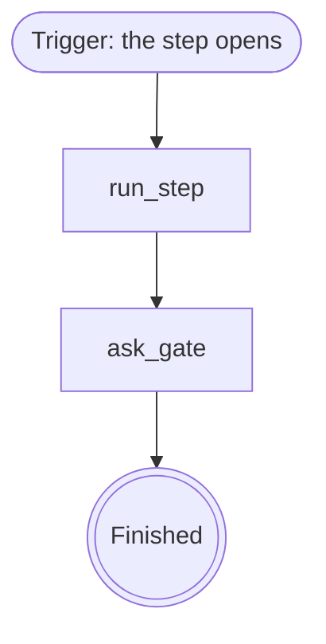

# mini

Runs the step, then asks for a decision.

```mermaid
flowchart TB
  start([Trigger: the step opens])
  run_step
  ask_gate
  finish(((Finished))):::done
  start --> run_step --> ask_gate --> finish
```

{{props.rules}}
