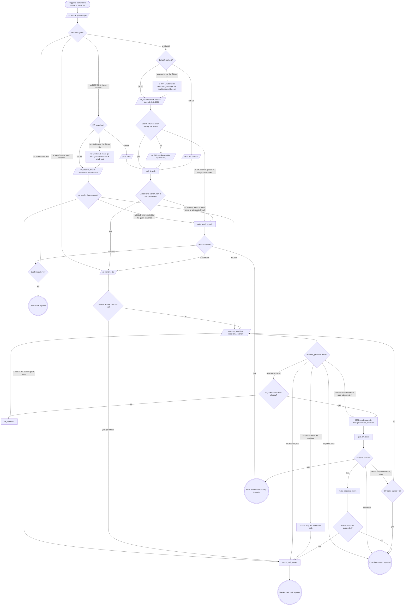

# checkout

Get a teammate's branch into a local worktree so you can read or test it --
this is a review checkout, not the start of your own work.

```mermaid
flowchart TB
%% name: checkout
    teammate_branch([Trigger: a teammate's branch to check out])
    git_remote_origin[/git remote get-url origin/]
    what_given{What was given?}
    mr_forge_host{MR forge host?}
    mr_resolve_branch[/"mr_resolve_branch {repoName, mrUrl or iid}"/]
    pick_branch
    mr_resolve_result{mr_resolve_branch result?}
    gh_pr_view[/gh pr view <ref>/]
    ticket_forge_host{Ticket forge host?}
    mr_list_search[/"mr_list {repoName, search: <ticket id>, state: all, limit: 200}"/]
    gh_pr_list_search[/gh pr list --search <id>/]
    search_names_ticket{Search returned a row naming the ticket?}
    mr_list_all[/"mr_list {repoName, state: all, limit: 200}"/]
    stop_gitlab_shell_reads[STOP: GitLab reads go through the read tools or gitlab_get]:::stop
    stop_gitlab_shell_search[STOP: GitLab ticket searches go through the read tools or gitlab_get]:::stop
    one_branch{Exactly one branch, from a complete read?}
    gate_which_branch
    branch_answer{branch answer?}
    clarify_rounds_spent{Clarify rounds = 2?}
    git_worktree_list[/git worktree list/]
    already_checked_out{Branch already checked out?}
    worktree_provision[/"worktree_provision {repoName, branch}"/]
    provision_result{worktree_provision result?}
    argument_fixed{Argument fixed once already?}
    fix_argument
    stop_hand_rolled_worktree[STOP: worktrees only through worktree_provision]:::stop
    stop_move_into_tree[STOP: stay put; report the path]:::stop
    gate_off_script
    off_script_answer{off-script answer?}
    make_recorded_move
    recorded_move_succeeded{Recorded move succeeded?}
    off_script_rounds_spent{Off-script rounds = 2?}
    report_path_owner
    unresolved(((Unresolved: reported)))
    provision_refused(((Provision refused: reported)))
    held_end_turn(((Held: end the turn naming the gate)))
    checked_out(((Checked out: path reported))):::done
    teammate_branch --> git_remote_origin
    git_remote_origin --> what_given
    what_given -->|a branch name: use it verbatim| git_worktree_list
    what_given -->|an MR/PR link, !iid, or number| mr_forge_host
    what_given -->|a ticket id| ticket_forge_host
    mr_forge_host -->|GitLab| mr_resolve_branch
    mr_forge_host -->|GitHub| gh_pr_view
    mr_forge_host -->|tempted to use the GitLab CLI| stop_gitlab_shell_reads
    stop_gitlab_shell_reads --> mr_resolve_branch
    ticket_forge_host -->|GitLab| mr_list_search
    ticket_forge_host -->|GitHub| gh_pr_list_search
    ticket_forge_host -->|tempted to use the GitLab CLI| stop_gitlab_shell_search
    stop_gitlab_shell_search --> mr_list_search
    mr_resolve_branch --> mr_resolve_result
    mr_resolve_result -->|a GitLab error: quoted in the gate's sentence| gate_which_branch
    mr_resolve_result -->|a tree on the branch: point there| report_path_owner
    mr_resolve_result -->|no tree| worktree_provision
    gh_pr_view --> pick_branch
    mr_list_search --> search_names_ticket
    search_names_ticket -->|yes| pick_branch
    search_names_ticket -->|no| mr_list_all
    search_names_ticket -->|a GitLab error: quoted in the gate's sentence| gate_which_branch
    mr_list_all --> pick_branch
    gh_pr_list_search --> pick_branch
    pick_branch --> one_branch
    one_branch -->|yes| git_worktree_list
    one_branch -->|no: several, none, a GitLab error, or a truncated read| gate_which_branch
    gate_which_branch --> branch_answer
    branch_answer -->|a candidate| git_worktree_list
    branch_answer -->|their text| clarify_rounds_spent
    branch_answer -->|hold| held_end_turn
    clarify_rounds_spent -->|no: resolve their text| what_given
    clarify_rounds_spent -->|yes| unresolved
    git_worktree_list --> already_checked_out
    already_checked_out -->|yes: point there| report_path_owner
    already_checked_out -->|no| worktree_provision
    worktree_provision --> provision_result
    provision_result -->|ok: keep its path| report_path_owner
    provision_result -->|an argument error| argument_fixed
    provision_result -->|daemon unreachable, or repo unknown to rt| stop_hand_rolled_worktree
    provision_result -->|tempted to enter the worktree| stop_move_into_tree
    provision_result -->|any other error| provision_refused
    stop_move_into_tree --> report_path_owner
    argument_fixed -->|no| fix_argument
    argument_fixed -->|yes| stop_hand_rolled_worktree
    fix_argument --> worktree_provision
    stop_hand_rolled_worktree --> gate_off_script
    gate_off_script --> off_script_answer
    off_script_answer -->|take| make_recorded_move
    off_script_answer -->|iterate: the human fixed it, retry| off_script_rounds_spent
    off_script_answer -->|hand back| provision_refused
    off_script_answer -->|hold| held_end_turn
    off_script_rounds_spent -->|no| worktree_provision
    off_script_rounds_spent -->|yes| provision_refused
    make_recorded_move --> recorded_move_succeeded
    recorded_move_succeeded -->|yes| report_path_owner
    recorded_move_succeeded -->|no| provision_refused
    report_path_owner --> checked_out
```
