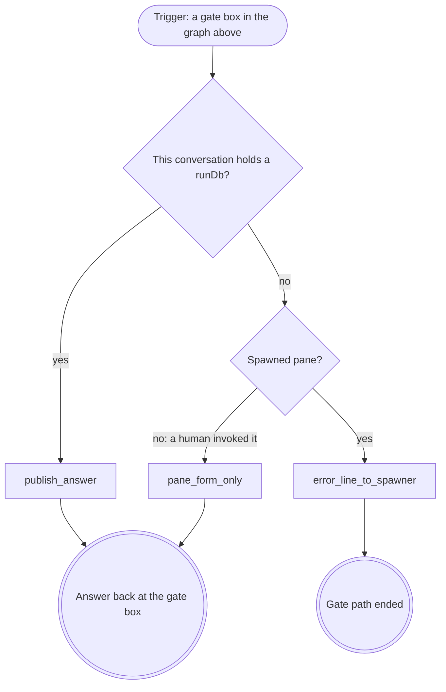

# Gates

Every gate box runs this graph.

```mermaid
flowchart TB
%% name: gate_steps
    trigger_gate_box([Trigger: a gate box in the graph above])
    holds_rundb{This conversation holds a runDb?}
    publish_answer
    spawned_pane{Spawned pane?}
    error_line_to_spawner
    pane_form_only
    gate_path_ended(((Gate path ended)))
    answer_back(((Answer back at the gate box))):::done
    trigger_gate_box --> holds_rundb
    holds_rundb -->|yes| publish_answer
    holds_rundb -->|no| spawned_pane
    publish_answer --> answer_back
    spawned_pane -->|yes| error_line_to_spawner
    spawned_pane -->|no: a human invoked it| pane_form_only
    error_line_to_spawner --> gate_path_ended
    pane_form_only --> answer_back
```
