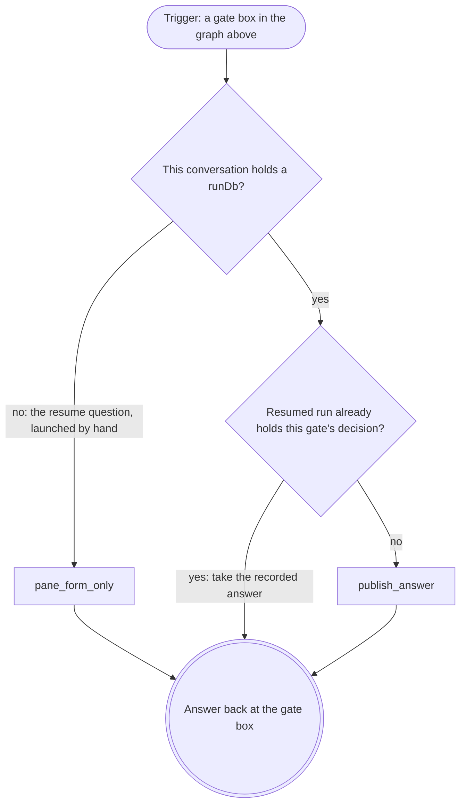

# Gates

Every gate box above runs this graph.

```mermaid
flowchart TB
%% name: gate_steps
    trigger_gate_box([Trigger: a gate box in the graph above])
    holds_rundb{This conversation holds a runDb?}
    pane_form_only
    resumed_holds_decision{Resumed run already holds this gate's decision?}
    publish_answer
    answer_back(((Answer back at the gate box))):::done
    trigger_gate_box --> holds_rundb
    holds_rundb -->|yes| resumed_holds_decision
    holds_rundb -->|no: the resume question, launched by hand| pane_form_only
    pane_form_only --> answer_back
    resumed_holds_decision -->|yes: take the recorded answer| answer_back
    resumed_holds_decision -->|no| publish_answer
    publish_answer --> answer_back
```
