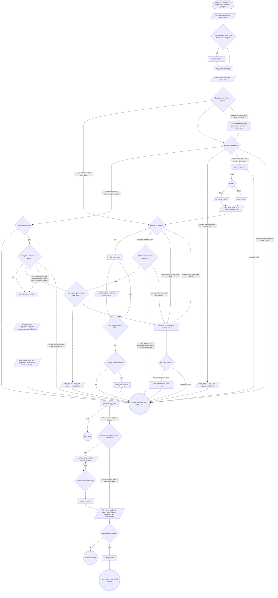

# Lanes and wrap-up

```mermaid
flowchart TB
%% name: shepherdr_lanes
    trigger_job_report([Trigger: a job's report, or a nag about a done job's open pane])
    herd_lanes_report[/"herd_lanes {herd}: the report's lanes"/]
    drift_outside_fence{Drift outside the fence, or a file two jobs changed?}
    flag_drift_collision
    relay_measured_only
    herd_status[/"herd_status {herd}: the status table"/]
    report_claims_merge{Does the report claim a merge?}
    who_merges_lane{Who merges this lane?}
    stop_hand_merge[STOP: never merge, fix or push by hand; route by who merges]:::stop
    all_lane_jobs_done{Every lane job done?}
    integration_job_spawned{Integration job spawned already?}
    ask_integration_strategy
    herd_brief_integration[/"herd_brief {job: integration-<n>, template, strategy, strategies, fill, out}"/]
    herd_spawn_integration[/"herd_spawn {herd, job: integration-<n>, brief, model, effort, account?}"/]
    chat_dm_ship_chain[/"chat_dm {to: <job handle>, body: ship through your skill chain}"/]
    gate_merge_lane
    forge_host{Forge?}
    mr_merge[/"mr_merge {mrUrl}"/]
    gh_pr_merge[/gh pr merge <pr>/]
    herd_lanes_after_merge[/"herd_lanes {herd, job}: after the merge call"/]
    merged_on_repo{Merged on the repo?}
    lane_claimed_merge{Did this lane claim the merge itself?}
    unmerged_reports_spent{Unmerged reports for this lane spent?}
    chat_dm_merge_state[/"chat_dm {to: <job handle>, body: the measured merge state}"/]
    flip_lane_ticket
    herd_close_merged[/"herd_close {job, herd}: the merged lane"/]
    more_merged_lanes{More merged lanes to close?}
    all_jobs_closed{Every job done and closed?}
    show_status_table
    gate_wrap_up_form
    panes_or_trees_closing{Any panes closing or trees disposed?}
    worktree_stop_holders[/"worktree_stop_holders {repoName, tree}"/]
    more_closing_trees{More closing trees to stop?}
    measure_running
    herd_wrap_up[/"herd_wrap_up {herd, closePanes, dispose, deleteJobDirs, archiveRoom}"/]
    herd_wrap_up_refused{herd_wrap_up refused?}
    report_refusal
    shepherd_off_script[Shepherd off-script gate: ask the user]
    off_script_answer{Off-script answer?}
    make_recorded_move[Make the recorded move once]
    back_to_watch_loop(((Back to the watch loop: end the turn)))
    herd_held(((Herd held)))
    herd_wrapped_refusal(((Herd wrapped up, refusal reported)))
    herd_wrapped_up(((Herd wrapped up))):::done
    trigger_job_report --> herd_lanes_report
    herd_lanes_report --> drift_outside_fence
    drift_outside_fence -->|yes| flag_drift_collision
    drift_outside_fence -->|no| relay_measured_only
    flag_drift_collision --> relay_measured_only
    relay_measured_only --> herd_status
    herd_status --> report_claims_merge
    report_claims_merge -->|yes, or a nag about an open pane| merged_on_repo
    report_claims_merge -->|no| who_merges_lane
    who_merges_lane -->|no domain rule: the integration job merges| all_lane_jobs_done
    who_merges_lane -->|domain: the worker ships its own lane| chat_dm_ship_chain
    who_merges_lane -->|domain: the shepherd merges after a gate| gate_merge_lane
    who_merges_lane -->|domain: a human merges on the forge| back_to_watch_loop
    report_claims_merge -->|tempted to merge, fix or push it yourself| stop_hand_merge
    stop_hand_merge --> who_merges_lane
    all_lane_jobs_done -->|no| back_to_watch_loop
    all_lane_jobs_done -->|yes| integration_job_spawned
    integration_job_spawned -->|no| ask_integration_strategy
    integration_job_spawned -->|yes: it reported no merge| unmerged_reports_spent
    integration_job_spawned -->|yes, it has reported and this lane joined after it spawned: a new one for it| ask_integration_strategy
    integration_job_spawned -->|yes, and it is still running: wait for its report| back_to_watch_loop
    ask_integration_strategy --> herd_brief_integration
    herd_brief_integration --> herd_spawn_integration
    herd_spawn_integration --> back_to_watch_loop
    chat_dm_ship_chain --> back_to_watch_loop
    gate_merge_lane -->|merge| forge_host
    gate_merge_lane -->|not yet, or hold| back_to_watch_loop
    forge_host -->|GitLab| mr_merge
    forge_host -->|GitHub| gh_pr_merge
    mr_merge --> herd_lanes_after_merge
    gh_pr_merge --> herd_lanes_after_merge
    herd_lanes_after_merge --> merged_on_repo
    merged_on_repo -->|yes| flip_lane_ticket
    merged_on_repo -->|no: open, closed or none| lane_claimed_merge
    merged_on_repo -->|unknown: quote the read's error| shepherd_off_script
    merged_on_repo -->|no row: quote the skipped reason| shepherd_off_script
    lane_claimed_merge -->|yes| unmerged_reports_spent
    lane_claimed_merge -->|no: it waits on the integration job, the gate or a human's merge| back_to_watch_loop
    lane_claimed_merge -->|no: your own merge call did not land| shepherd_off_script
    unmerged_reports_spent -->|no| chat_dm_merge_state
    unmerged_reports_spent -->|yes: budget spent| shepherd_off_script
    chat_dm_merge_state --> back_to_watch_loop
    flip_lane_ticket --> herd_close_merged
    herd_close_merged --> more_merged_lanes
    more_merged_lanes -->|yes| flip_lane_ticket
    more_merged_lanes -->|no| all_jobs_closed
    all_jobs_closed -->|no| back_to_watch_loop
    all_jobs_closed -->|yes| show_status_table
    show_status_table --> gate_wrap_up_form
    gate_wrap_up_form -->|hold| herd_held
    gate_wrap_up_form -->|close, keep or dispose answers| panes_or_trees_closing
    panes_or_trees_closing -->|yes| worktree_stop_holders
    panes_or_trees_closing -->|no: every pane kept, nothing disposed| herd_wrap_up
    worktree_stop_holders --> more_closing_trees
    more_closing_trees -->|yes| worktree_stop_holders
    more_closing_trees -->|no| measure_running
    measure_running --> herd_wrap_up
    herd_wrap_up --> herd_wrap_up_refused
    herd_wrap_up_refused -->|no| herd_wrapped_up
    herd_wrap_up_refused -->|yes| report_refusal
    report_refusal --> herd_wrapped_refusal
    shepherd_off_script --> off_script_answer
    off_script_answer -->|take the proposed move| make_recorded_move
    off_script_answer -->|hand back or hold| back_to_watch_loop
    make_recorded_move --> back_to_watch_loop
```
