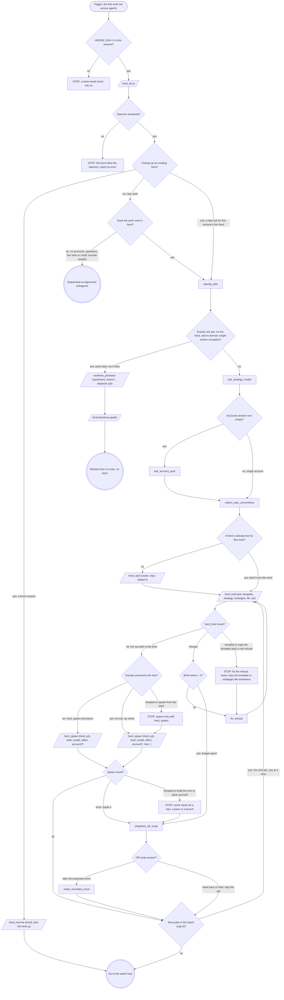

# Start and spawn

Walk this graph from the trigger; a move it does not show goes to the shepherd off-script gate.

```mermaid
flowchart TB
%% name: shepherdr_start
    trigger_fan_out([Trigger: fan this work out across agents])
    herdr_env_session{HERDR_ENV=1 in this session?}
    stop_herdr_needed[STOP: a herd needs herdr; say so]:::stop
    herd_list[/"herd_list {}"/]
    daemon_answered{Daemon answered?}
    stop_daemon_error[STOP: the herd rides the daemon; report its error]:::stop
    picking_up_herd{Picking up an existing herd?}
    herd_resume_pick_up[/"herd_resume {herd}: pick the herd up"/]
    needs_herd{Does the work need a herd?}
    dispatched_subagents(((Dispatched as Agent-tool subagents)))
    specify_jobs
    single_job_no_herd{Exactly one job, no live herd, and no domain single-worker exception?}
    worktree_provision[/"worktree_provision {repoName, branch: <job>, disposal: job}"/]
    enter_worktree[/"EnterWorktree {path}"/]
    worked_in_tree(((Worked here in a tree, no herd)))
    ask_strategy_model
    accounts_section_filled{Accounts section non-empty?}
    ask_account_pool
    collect_repo_conventions
    herd_already_live{A herd is already live for this work?}
    herd_start[/"herd_start {name, repo, hidden?}"/]
    herd_brief[/"herd_brief {job, template, strategy, strategies, fill, out}"/]
    herd_brief_result{herd_brief result?}
    brief_retries_spent{Brief retries = 2?}
    fix_refusal
    stop_copy_template[STOP: fix the refusal; never copy the template or strategies file elsewhere]:::stop
    domain_provisions_tree{Domain provisions the tree?}
    herd_spawn[/"herd_spawn {herd, job, brief, model, effort, account?}"/]
    herd_spawn_domain_tree[/"herd_spawn {herd, job, brief, model, effort, account?, tree: <the domain's tree>}"/]
    stop_hand_spawn[STOP: spawn only with herd_spawn]:::stop
    spawn_result{Spawn result?}
    stop_hand_roll[STOP: never hand-roll a tree, a pane or a launch]:::stop
    shepherd_off_script
    off_script_answer{Off-script answer?}
    make_recorded_move
    more_jobs_in_batch{"More jobs in this batch (cap 6)?"}
    go_to_watch_loop(((Go to the watch loop))):::done
    trigger_fan_out --> herdr_env_session
    herdr_env_session -->|no| stop_herdr_needed
    herdr_env_session -->|yes| herd_list
    herd_list --> daemon_answered
    daemon_answered -->|no| stop_daemon_error
    daemon_answered -->|yes| picking_up_herd
    picking_up_herd -->|yes: a fresh session| herd_resume_pick_up
    picking_up_herd -->|no: new work| needs_herd
    picking_up_herd -->|yes: a later job for this session's live herd| specify_jobs
    herd_resume_pick_up --> go_to_watch_loop
    needs_herd -->|no: no accounts, questions, live view or crash survival needed| dispatched_subagents
    needs_herd -->|yes| specify_jobs
    specify_jobs --> single_job_no_herd
    single_job_no_herd -->|yes: push back, do it here| worktree_provision
    single_job_no_herd -->|no| ask_strategy_model
    worktree_provision --> enter_worktree
    enter_worktree --> worked_in_tree
    ask_strategy_model --> accounts_section_filled
    accounts_section_filled -->|yes| ask_account_pool
    accounts_section_filled -->|no: single account| collect_repo_conventions
    ask_account_pool --> collect_repo_conventions
    collect_repo_conventions --> herd_already_live
    herd_already_live -->|no| herd_start
    herd_already_live -->|yes: brief it into this herd| herd_brief
    herd_start --> herd_brief
    herd_brief --> herd_brief_result
    herd_brief_result -->|ok: the out path is the brief| domain_provisions_tree
    herd_brief_result -->|refused| brief_retries_spent
    herd_brief_result -->|tempted to copy the template past a root refusal| stop_copy_template
    stop_copy_template --> fix_refusal
    brief_retries_spent -->|no| fix_refusal
    brief_retries_spent -->|yes: budget spent| shepherd_off_script
    fix_refusal --> herd_brief
    domain_provisions_tree -->|no: herd_spawn provisions| herd_spawn
    domain_provisions_tree -->|yes: its tree, by name| herd_spawn_domain_tree
    domain_provisions_tree -->|tempted to spawn from the shell| stop_hand_spawn
    stop_hand_spawn --> herd_spawn_domain_tree
    herd_spawn --> spawn_result
    herd_spawn_domain_tree --> spawn_result
    spawn_result -->|ok| more_jobs_in_batch
    spawn_result -->|error: quote it| shepherd_off_script
    spawn_result -->|tempted to build the tree or pane yourself| stop_hand_roll
    stop_hand_roll --> shepherd_off_script
    shepherd_off_script --> off_script_answer
    off_script_answer -->|take the proposed move| make_recorded_move
    off_script_answer -->|hand back or hold: skip this job| more_jobs_in_batch
    make_recorded_move --> more_jobs_in_batch
    more_jobs_in_batch -->|yes: the next job, one at a time| herd_brief
    more_jobs_in_batch -->|no| go_to_watch_loop
```
