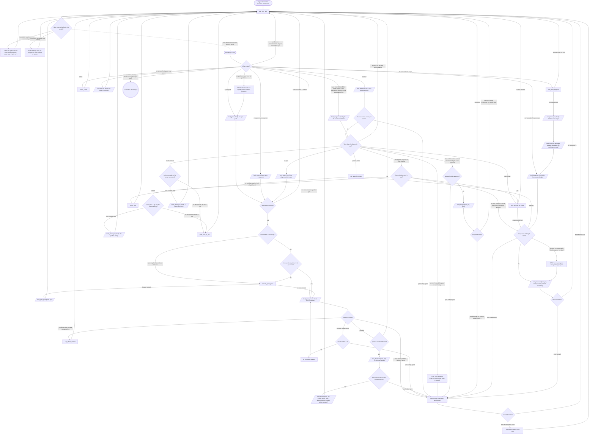

# The watch loop

After the spawns, do nothing until something arrives.

```mermaid
flowchart TB
%% name: shepherdr_watch
    trigger_herd_spawned([Trigger: the herd is spawned or resumed])
    end_turn_wait
    end_turn_next_move{Next move while the turn is ended?}
    stop_read_pane_progress[STOP: the gates and the room report progress; never read a pane for it]:::stop
    stop_arm_watcher[STOP: nothing arms; no background wait, watcher or sweep]:::stop
    something_arrives([Something arrives])
    what_arrived{What arrived?}
    stop_push_text_answer[STOP: answer from the registry, never from the push text]:::stop
    herd_gates_push[/"herd_gates {herd}: the gate push"/]
    herd_resume_relaunch[/"herd_resume {herd}: after a relaunch"/]
    open_gates_returned{Open gates returned?}
    boards_gate{Gate context is boards@1?}
    answer_literal_in_brief{Answer literally in the brief you wrote?}
    present_open_gates
    herd_gate_park[/"herd_gate_park {herd, gate}"/]
    herd_gate_answer[/"herd_gate_answer {herd, gate, answers}"/]
    answer_recorded{Answer recorded?}
    say_which_answer
    answer_retries_spent{Answer retries = 2?}
    fix_answers_verbatim
    spawn_reviewer_chosen{Spawn a reviewer chosen?}
    herd_diagnose_reviewer[/"herd_diagnose {herd, job}: the reviewer budget"/]
    reviewer_rounds_spent{Reviewer rounds on this milestone spent?}
    herd_spawn_reviewer[/"herd_spawn {herd, job: review-<job>, brief: <review brief>, tree: <the job's tree>, disposable: true, model, effort, account?}"/]
    herd_diagnose_blocked[/"herd_diagnose {herd, job}: the blocked job"/]
    blocked_notices_spent{Blocked notices for this job spent?}
    herd_diagnose_unconsumed[/"herd_diagnose {herd, job}: the unconsumed lane"/]
    diagnosis_verdict{What does the diagnosis say?}
    stop_peek_pane[STOP: herd_diagnose reads the pane; never peek it yourself]:::stop
    herd_gates_diagnosed[/"herd_gates {herd}: the diagnosed job's gate"/]
    nudges_spent{Nudges for this gate spent?}
    herd_nudge[/"herd_nudge {herd, job, gate}"/]
    nudge_delivered{Nudge delivered?}
    smart_distribute_pool{Smart-distribute pool in use?}
    pick_account_by_rules
    report_stall
    ask_attend_respawn
    pane_bg_dialog{"Job's pane a bg: ref (the parked dialog)?"}
    pane_bg_human{"Job's pane a bg: ref (a human is needed)?"}
    herd_attend_dialog[/"herd_attend {job, herd}: the parked dialog"/]
    herd_attend_human[/"herd_attend {job, herd}: a human is needed"/]
    point_user_at_tab
    report_crash
    chat_dm_ruling[/"chat_dm {to: <job handle>, body: the ruling or findings}"/]
    ask_finish_kill_hold
    herd_close_killed[/"herd_close {job, herd}: killed for new scope"/]
    herd_brief_respawn[/"herd_brief {job, template, strategy, strategies, fill, out}: the new brief"/]
    herd_diagnose_respawn[/"herd_diagnose {herd, job}: the respawn budget"/]
    respawns_spent{Respawns of this job spent?}
    stop_hand_respawn[STOP: a respawn goes through herd_respawn]:::stop
    herd_respawn[/"herd_respawn {herd, job, brief?, model?, effort?, account?}"/]
    respawn_result{Respawn result?}
    shepherd_off_script[Shepherd off-script gate: ask the user]
    off_script_answer{Off-script answer?}
    make_recorded_move[Make the recorded move once]
    go_lanes_wrap_up(((Go to lanes and wrap-up))):::done
    trigger_herd_spawned --> end_turn_wait
    end_turn_wait --> end_turn_next_move
    end_turn_next_move -.->|none: the daemon pushes the next arrival| something_arrives
    end_turn_next_move -->|tempted to read a pane to see how it goes| stop_read_pane_progress
    end_turn_next_move -->|tempted to arm a wait or a sweep| stop_arm_watcher
    stop_read_pane_progress --> end_turn_wait
    stop_arm_watcher --> end_turn_wait
    something_arrives --> what_arrived
    what_arrived -->|a gate push| herd_gates_push
    what_arrived -->|tempted to answer from the push text| stop_push_text_answer
    stop_push_text_answer --> herd_gates_push
    what_arrived -->|a milestone announcement: its gate push wakes you| end_turn_wait
    what_arrived -->|a relaunch or compaction| herd_resume_relaunch
    what_arrived -->|gate <id> UNCONSUMED in herd_status, or the watchdog's answered-and-unconsumed line| herd_diagnose_unconsumed
    what_arrived -->|<job> blocked| herd_diagnose_blocked
    what_arrived -->|<job> exited| report_crash
    what_arrived -->|a ruling or findings for one worker| chat_dm_ruling
    what_arrived -->|the user redirects scope| ask_finish_kill_hold
    what_arrived -->|the user asks for a respawn| herd_diagnose_respawn
    what_arrived -->|the user answers a parked gate| herd_gate_answer
    what_arrived -->|a report line, or a nag about a done job's open pane| go_lanes_wrap_up
    herd_gates_push --> open_gates_returned
    herd_resume_relaunch --> open_gates_returned
    herd_gates_diagnosed --> open_gates_returned
    open_gates_returned -->|yes| boards_gate
    boards_gate -->|yes: only the human looks at boards| present_open_gates
    boards_gate -->|no| answer_literal_in_brief
    open_gates_returned -->|none: a stale id is normal| end_turn_wait
    answer_literal_in_brief -->|yes| herd_gate_answer
    answer_literal_in_brief -->|no| present_open_gates
    present_open_gates -->|the user answers| herd_gate_answer
    present_open_gates -->|the user parks it| herd_gate_park
    herd_gate_park --> end_turn_wait
    herd_gate_answer --> answer_recorded
    answer_recorded -->|recorded| spawn_reviewer_chosen
    answer_recorded -->|conflict: another surface answered first| say_which_answer
    answer_recorded -->|refused: invalid values| answer_retries_spent
    answer_recorded -->|error: closed, not this herd's, or gone| shepherd_off_script
    say_which_answer --> end_turn_wait
    answer_retries_spent -->|no| fix_answers_verbatim
    answer_retries_spent -->|yes: budget spent| shepherd_off_script
    fix_answers_verbatim --> herd_gate_answer
    spawn_reviewer_chosen -->|no| end_turn_wait
    spawn_reviewer_chosen -->|yes| herd_diagnose_reviewer
    herd_diagnose_reviewer --> reviewer_rounds_spent
    reviewer_rounds_spent -->|no| herd_spawn_reviewer
    reviewer_rounds_spent -->|yes: budget spent| shepherd_off_script
    herd_spawn_reviewer --> end_turn_wait
    herd_diagnose_blocked --> blocked_notices_spent
    blocked_notices_spent -->|no| diagnosis_verdict
    blocked_notices_spent -->|yes: budget spent| shepherd_off_script
    herd_diagnose_unconsumed --> diagnosis_verdict
    diagnosis_verdict -->|at-gate| herd_gates_diagnosed
    diagnosis_verdict -->|idle, and the arrival named an answered gate it has not read| nudges_spent
    diagnosis_verdict -->|working, or idle with nothing waiting| end_turn_wait
    diagnosis_verdict -->|rate-limited| pick_account_by_rules
    diagnosis_verdict -->|dead, gone, no-pane or login-expired| smart_distribute_pool
    diagnosis_verdict -->|parked-modal| ask_attend_respawn
    diagnosis_verdict -->|needs-human| pane_bg_human
    pane_bg_human -->|yes: a hidden herd| herd_attend_human
    pane_bg_human -->|no: the pane is already a tab| point_user_at_tab
    diagnosis_verdict -->|tempted to peek the pane or send a key| stop_peek_pane
    stop_peek_pane --> shepherd_off_script
    nudges_spent -->|no| herd_nudge
    nudges_spent -->|yes: budget spent| shepherd_off_script
    herd_nudge --> nudge_delivered
    nudge_delivered -->|delivered| end_turn_wait
    nudge_delivered -->|refused: already consumed, the worker read it| end_turn_wait
    nudge_delivered -->|needsHuman, or another refusal: quote it| shepherd_off_script
    smart_distribute_pool -->|yes| pick_account_by_rules
    smart_distribute_pool -->|no, and not login-expired: relaunch on the same account| respawns_spent
    smart_distribute_pool -->|no, and login-expired: only a login fixes it| report_stall
    pick_account_by_rules -->|an account picked| respawns_spent
    pick_account_by_rules -->|wait or abandon| end_turn_wait
    report_stall --> end_turn_wait
    ask_attend_respawn -->|attend| pane_bg_dialog
    pane_bg_dialog -->|yes: a hidden herd| herd_attend_dialog
    pane_bg_dialog -->|no: the pane is already a tab| point_user_at_tab
    point_user_at_tab --> end_turn_wait
    ask_attend_respawn -->|respawn| respawns_spent
    herd_attend_dialog --> end_turn_wait
    herd_attend_human --> end_turn_wait
    report_crash --> end_turn_wait
    chat_dm_ruling --> end_turn_wait
    ask_finish_kill_hold -->|let them finish, or hold| end_turn_wait
    ask_finish_kill_hold -->|kill and respawn| herd_close_killed
    herd_close_killed --> herd_brief_respawn
    herd_brief_respawn --> herd_diagnose_respawn
    herd_diagnose_respawn --> respawns_spent
    respawns_spent -->|no| herd_respawn
    respawns_spent -->|yes: budget spent| shepherd_off_script
    respawns_spent -->|tempted to respawn with herd_spawn or the shell| stop_hand_respawn
    stop_hand_respawn --> herd_respawn
    herd_respawn --> respawn_result
    respawn_result -->|ok: announce it| end_turn_wait
    respawn_result -->|error: quote it| shepherd_off_script
    shepherd_off_script --> off_script_answer
    off_script_answer -->|take the proposed move| make_recorded_move
    off_script_answer -->|hand back or hold| end_turn_wait
    make_recorded_move --> end_turn_wait
```
