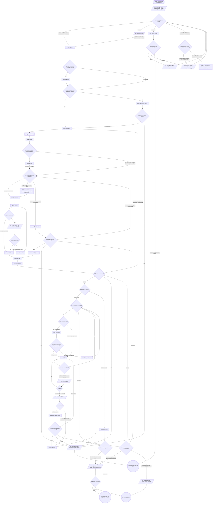

# The self-review graph

```mermaid
flowchart TB
%% name: self_review
    trigger_self_review([Trigger: self-review the current branch])
    run_enter[/"run_enter {flags, skillDir, stage: self-review, runDb?, resume?, spawnedBy?}"/]
    run_enter_mode{self-review run_enter mode?}
    gate_resume_choice
    resume_answer{Self-review resume answer?}
    run_enter_resume[/"run_enter {flags, skillDir, stage: self-review, resume: <picked runId>}"/]
    run_enter_fresh[/"run_enter {flags, skillDir, stage: self-review, fresh: true, spawnedBy?}"/]
    refused_carried_resume{The refused self-review run_enter carried resume?}
    stop_no_run_without_enter[STOP: no self-review run without run_enter; report why to the user]:::stop
    run_snapshot[/"run_snapshot {runDb: <resumed self-review>}"/]
    find_merge_base
    own_run_record{Own self-review run: record the branch?}
    record_branch
    requirements_known{Requirements known: a ticket or the task text?}
    gate_requirements_source
    requirements_answer{Requirements source answer?}
    print_depth_block
    run_depth_checks
    select_rules
    repro_browser{Self-review repro takes a browser screenshot?}
    capture_repro
    who_judges{Who forms the self-review judgment?}
    stop_no_inline_judging[STOP: never judge your own diff inline; dispatch the fresh reviewer]:::stop
    dispatch_reviewer
    check_verdicts
    verdict_problems{Verdict problems left?}
    run_budget_verdict_rounds[/"run_budget {runDb, key: verdict-rounds:<depth>, limit: 2, stage}"/]
    verdict_rounds_spent{verdict-rounds:<depth> spent?}
    repair_verdicts
    fails_to_findings
    open_off_script_gate
    off_script_answer{Self-review off-script answer?}
    make_recorded_move
    assemble_draft
    gate_fix_and_next
    gate_again_failing_output
    next_answer{Self-review next answer?}
    fix_answer{Self-review fix answer?}
    next_finding{Next selected finding to fix?}
    finding_testable{Is the finding testable?}
    write_failing_test
    test_fails_now{Does the new test fail on the current code?}
    record_not_reproduced
    fix_finding
    tests_green{Tests green after the fix?}
    run_budget_fix[/"run_budget {runDb, key: fix:<finding id>:<round>, limit: 3, stage}"/]
    fix_spent{fix:<finding id>:<round> spent?}
    run_budget_reopen[/"run_budget {runDb, key: reopen:<finding id>, limit: 2, stage}"/]
    reopen_spent{reopen:<finding id> spent?}
    stuck_answer{Self-review stuck finding answer?}
    record_left_open
    hand_back_minor
    own_run_close{Own self-review run: close it?}
    own_run_close_abandoned{Own self-review run: close it as abandoned?}
    run_close[/"run_close {runDb, workType: self-review, stage: self-review, outcome}"/]
    closed_as{Self-review closed as?}
    run_stage_fail[/"run_stage {action: fail, stage: <run.current_stage>, reason: <their words>} for self-review"/]
    run_hold[/"run_hold {runDb, stage, reason, decidedBy} for self-review"/]
    held_end_turn(((Self-review held: end the turn)))
    abandoned(((Self-review abandoned)))
    done_calling_flow(((Self-review done: the calling flow continues))):::done
    trigger_self_review --> run_enter
    run_enter --> run_enter_mode
    run_enter_resume --> run_enter_mode
    run_enter_fresh --> run_enter_mode
    run_enter_mode -->|started, or inherited: stage is at.stage| find_merge_base
    run_enter_mode -->|resumed| run_snapshot
    run_enter_mode -->|candidates| gate_resume_choice
    run_enter_mode -->|refused, or the tool is missing| refused_carried_resume
    refused_carried_resume -->|yes: say the resume was refused, start fresh| run_enter_fresh
    refused_carried_resume -->|no: another refusal, or no run_enter tool| stop_no_run_without_enter
    gate_resume_choice --> resume_answer
    resume_answer -->|resume| run_enter_resume
    resume_answer -->|start fresh| run_enter_fresh
    resume_answer -->|hold: no run yet, record nothing| held_end_turn
    run_snapshot -->|re-enter, reuse every recorded answer| find_merge_base
    find_merge_base --> own_run_record
    own_run_record -->|yes| record_branch
    own_run_record -->|no: inherited| requirements_known
    record_branch --> requirements_known
    requirements_known -->|yes| print_depth_block
    requirements_known -->|no| gate_requirements_source
    gate_requirements_source --> requirements_answer
    requirements_answer -->|a source picked| print_depth_block
    requirements_answer -->|hold| run_hold
    print_depth_block --> run_depth_checks
    run_depth_checks --> select_rules
    select_rules --> repro_browser
    repro_browser -->|yes| capture_repro
    repro_browser -->|no: read or verify depth, or the domain's own method| who_judges
    capture_repro -->|Board ready or Not drawn| who_judges
    who_judges -->|a fresh reviewer, always| dispatch_reviewer
    who_judges -->|tempted to give your own read| stop_no_inline_judging
    stop_no_inline_judging --> dispatch_reviewer
    who_judges -->|a bound fill asks for another move| open_off_script_gate
    open_off_script_gate --> off_script_answer
    off_script_answer -->|take| make_recorded_move
    off_script_answer -->|iterate here: decide again with their note| who_judges
    off_script_answer -->|hold| run_hold
    off_script_answer -->|hand back| own_run_close_abandoned
    make_recorded_move --> assemble_draft
    dispatch_reviewer --> check_verdicts
    check_verdicts --> verdict_problems
    verdict_problems -->|none, or no selector| fails_to_findings
    verdict_problems -->|yes| run_budget_verdict_rounds
    run_budget_verdict_rounds --> verdict_rounds_spent
    verdict_rounds_spent -->|no| repair_verdicts
    repair_verdicts --> check_verdicts
    verdict_rounds_spent -->|yes: list them in the notes| fails_to_findings
    fails_to_findings --> assemble_draft
    assemble_draft --> gate_fix_and_next
    gate_fix_and_next --> next_answer
    next_answer -->|proceed| fix_answer
    next_answer -->|iterate here: redo from the depth block with their note| print_depth_block
    next_answer -->|hold| run_hold
    next_answer -->|abandon| own_run_close_abandoned
    fix_answer -->|blocking or all| next_finding
    fix_answer -->|none: ship as is| hand_back_minor
    next_finding -->|yes| finding_testable
    next_finding -->|none left| own_run_close
    finding_testable -->|yes: it has behavior| write_failing_test
    finding_testable -->|no: naming, docs, structure| fix_finding
    write_failing_test --> test_fails_now
    test_fails_now -->|yes: reproduced| fix_finding
    test_fails_now -->|no: it passes before any fix| record_not_reproduced
    record_not_reproduced --> next_finding
    fix_finding --> tests_green
    tests_green -->|yes| next_finding
    tests_green -->|no: charge the failed attempt| run_budget_fix
    run_budget_fix --> fix_spent
    fix_spent -->|no| fix_finding
    fix_spent -->|yes: charge the stuck point| run_budget_reopen
    run_budget_reopen --> reopen_spent
    reopen_spent -->|no: first time stuck| gate_again_failing_output
    reopen_spent -->|yes: stuck after its reopened gate| record_left_open
    gate_again_failing_output --> stuck_answer
    stuck_answer -->|retry:<finding id>: round 2| fix_finding
    stuck_answer -->|leave:<finding id>| record_left_open
    stuck_answer -->|hold| run_hold
    stuck_answer -->|abandon| own_run_close_abandoned
    record_left_open --> next_finding
    hand_back_minor --> own_run_close
    own_run_close -->|yes: own run, outcome done| run_close
    own_run_close -->|no: inherited| done_calling_flow
    own_run_close_abandoned -->|yes: own run, outcome abandoned with their words| run_close
    own_run_close_abandoned -->|no: inherited, the caller decides| run_stage_fail
    run_close --> closed_as
    closed_as -->|done| done_calling_flow
    closed_as -->|abandoned| abandoned
    run_stage_fail --> abandoned
    run_hold --> held_end_turn
```
