# Rebuilding the dev app

One script builds the dev app two ways: `--local` builds a working tree
(uncommitted changes included) and stages it for Matt's one-click restart;
`--ref` rebuilds a pushed ref and swaps it in now. When Matt asks to try
something in the dev app, that request is the go-ahead: run the script
yourself rather than handing him a bundle to swap in.

## Process

```dot
digraph build_dev_app {
    rankdir=TB;

    "Held: the turn ends naming the gate" [shape=doublecircle];
    "Handed back to Matt" [shape=doublecircle];
    "Trigger: a change has to reach the dev app" [shape=ellipse];
    "What changed?" [shape=diamond];
    "Try work in progress or a pushed ref?" [shape=diamond];
    "STOP: build only through build-dev-app.ts" [shape=octagon style=filled fillcolor=red fontcolor=white];
    "git branch --show-current" [shape=plaintext];
    "Shared checkout on main?" [shape=diamond];
    "STOP: never switch the shared checkout's branch" [shape=octagon style=filled fillcolor=red fontcolor=white];
    "git_pull {tree: <shared checkout>}" [shape=plaintext];
    "Shared checkout pull result?" [shape=diamond];
    "What runs from the checkout?" [shape=diamond];
    "deck cmd <app> deploy" [shape=plaintext];
    "deck cmd deck deploy" [shape=plaintext];
    "Live from source" [shape=doublecircle style=filled fillcolor=lightgreen];
    "chat_post {room: \"rt\", body: <source restart notice>}" [shape=plaintext];
    "Source restart announce posted?" [shape=diamond];
    "rt daemon restart, for the pulled source" [shape=plaintext];
    "rt_verb {args: [\"daemon\", \"status\"]}" [shape=plaintext];
    "sourceRev matches the pulled commit?" [shape=diamond];
    "Nothing to do: gitq ships at the next release" [shape=doublecircle];
    "bun scripts/build-dev-app.ts --local --yes" [shape=plaintext];
    "Local build verdict?" [shape=diamond];
    "Tell Matt to click New build · Restart" [shape=box];
    "Already running this build" [shape=doublecircle];
    "Local build attempts = 2?" [shape=diamond];
    "Fix what the failed local step names" [shape=box];
    "Daemon shim changed in the local build?" [shape=diamond];
    "Staged for Matt's restart" [shape=doublecircle style=filled fillcolor=lightgreen];
    "End the turn until Matt says he restarted" [shape=box];
    "Ref pushed to GitHub?" [shape=diamond];
    "bun scripts/build-dev-app.ts --ref <ref> --yes" [shape=plaintext];
    "Ref build verdict?" [shape=diamond];
    "Ref build attempts = 2?" [shape=diamond];
    "Fix what the failed ref step names" [shape=box];
    "Daemon shim changed in the ref build?" [shape=diamond];
    "Dev app rebuilt from the ref" [shape=doublecircle style=filled fillcolor=lightgreen];
    "chat_post {room: \"rt\", body: <shim restart notice>}" [shape=plaintext];
    "Shim restart announce posted?" [shape=diamond];
    "rt daemon restart, for the new shim" [shape=plaintext];
    "rt_verb {args: [\"daemon\", \"status\"]}, after the shim restart" [shape=plaintext];
    "Daemon up on the new bundle?" [shape=diamond];
    "Dev app rebuilt and live" [shape=doublecircle style=filled fillcolor=lightgreen];
    "Off-script gate: shared checkout off main" [shape=box];
    "Shared checkout off main: gate rounds = 2?" [shape=diamond];
    "Off-script gate: shared checkout pull refused" [shape=box];
    "Shared checkout pull refused: gate rounds = 2?" [shape=diamond];
    "Off-script gate: source restart announce failed" [shape=box];
    "Source restart announce failed: gate rounds = 2?" [shape=diamond];
    "Off-script gate: daemon runs another rev" [shape=box];
    "Daemon runs another rev: gate rounds = 2?" [shape=diamond];
    "Off-script gate: local build still failing" [shape=box];
    "Local build still failing: gate rounds = 2?" [shape=diamond];
    "Off-script gate: ref build still failing" [shape=box];
    "Ref build still failing: gate rounds = 2?" [shape=diamond];
    "Off-script gate: shim restart announce failed" [shape=box];
    "Shim restart announce failed: gate rounds = 2?" [shape=diamond];
    "Off-script gate: daemon not up after the shim restart" [shape=box];
    "Daemon not up after the shim restart: gate rounds = 2?" [shape=diamond];

    "Trigger: a change has to reach the dev app" -> "What changed?";
    "What changed?" -> "Try work in progress or a pushed ref?" [label="rt-tray/**"];
    "What changed?" -> "git branch --show-current" [label="board, console, chat, boxscore, deck, or rt CLI or daemon source"];
    "What changed?" -> "Nothing to do: gitq ships at the next release" [label="gitq source"];
    "What changed?" -> "STOP: build only through build-dev-app.ts" [label="tempted to run build.sh in a checkout"];
    "STOP: build only through build-dev-app.ts" -> "Try work in progress or a pushed ref?";
    "Try work in progress or a pushed ref?" -> "bun scripts/build-dev-app.ts --local --yes" [label="work in progress"];
    "Try work in progress or a pushed ref?" -> "Ref pushed to GitHub?" [label="a pushed ref"];
    "git branch --show-current" -> "Shared checkout on main?";
    "Shared checkout on main?" -> "git_pull {tree: <shared checkout>}" [label="yes"];
    "Off-script gate: shared checkout off main" -> "What runs from the checkout?" [label="take: Matt synced it on main himself"];
    "Off-script gate: shared checkout off main" -> "Shared checkout off main: gate rounds = 2?" [label="iterate: Matt fixed the cause"];
    "Off-script gate: shared checkout off main" -> "Held: the turn ends naming the gate" [label="hold"];
    "Off-script gate: shared checkout off main" -> "Handed back to Matt" [label="hand back"];
    "Shared checkout off main: gate rounds = 2?" -> "git branch --show-current" [label="no: retry"];
    "Shared checkout off main: gate rounds = 2?" -> "Handed back to Matt" [label="yes: budget spent"];
    "Shared checkout on main?" -> "Off-script gate: shared checkout off main" [label="no"];
    "Shared checkout on main?" -> "STOP: never switch the shared checkout's branch" [label="tempted to switch its branch"];
    "STOP: never switch the shared checkout's branch" -> "Off-script gate: shared checkout off main";
    "git_pull {tree: <shared checkout>}" -> "Shared checkout pull result?";
    "Shared checkout pull result?" -> "What runs from the checkout?" [label="ok"];
    "Off-script gate: shared checkout pull refused" -> "What runs from the checkout?" [label="take: Matt pulled it himself"];
    "Off-script gate: shared checkout pull refused" -> "Shared checkout pull refused: gate rounds = 2?" [label="iterate: Matt fixed the cause"];
    "Off-script gate: shared checkout pull refused" -> "Held: the turn ends naming the gate" [label="hold"];
    "Off-script gate: shared checkout pull refused" -> "Handed back to Matt" [label="hand back"];
    "Shared checkout pull refused: gate rounds = 2?" -> "git_pull {tree: <shared checkout>}" [label="no: retry"];
    "Shared checkout pull refused: gate rounds = 2?" -> "Handed back to Matt" [label="yes: budget spent"];
    "Shared checkout pull result?" -> "Off-script gate: shared checkout pull refused" [label="refused"];
    "What runs from the checkout?" -> "deck cmd <app> deploy" [label="a served app"];
    "What runs from the checkout?" -> "deck cmd deck deploy" [label="deck"];
    "What runs from the checkout?" -> "chat_post {room: \"rt\", body: <source restart notice>}" [label="the daemon"];
    "deck cmd <app> deploy" -> "Live from source";
    "deck cmd deck deploy" -> "Live from source";
    "chat_post {room: \"rt\", body: <source restart notice>}" -> "Source restart announce posted?";
    "Source restart announce posted?" -> "rt daemon restart, for the pulled source" [label="yes"];
    "Off-script gate: source restart announce failed" -> "rt daemon restart, for the pulled source" [label="take: Matt announced it himself"];
    "Off-script gate: source restart announce failed" -> "Source restart announce failed: gate rounds = 2?" [label="iterate: Matt fixed the cause"];
    "Off-script gate: source restart announce failed" -> "Held: the turn ends naming the gate" [label="hold"];
    "Off-script gate: source restart announce failed" -> "Handed back to Matt" [label="hand back"];
    "Source restart announce failed: gate rounds = 2?" -> "chat_post {room: \"rt\", body: <source restart notice>}" [label="no: retry"];
    "Source restart announce failed: gate rounds = 2?" -> "Handed back to Matt" [label="yes: budget spent"];
    "Source restart announce posted?" -> "Off-script gate: source restart announce failed" [label="no"];
    "rt daemon restart, for the pulled source" -> "rt_verb {args: [\"daemon\", \"status\"]}";
    "rt_verb {args: [\"daemon\", \"status\"]}" -> "sourceRev matches the pulled commit?";
    "sourceRev matches the pulled commit?" -> "Live from source" [label="yes"];
    "Off-script gate: daemon runs another rev" -> "Live from source" [label="take: Matt accepts the running rev"];
    "Off-script gate: daemon runs another rev" -> "Daemon runs another rev: gate rounds = 2?" [label="iterate: Matt fixed the cause"];
    "Off-script gate: daemon runs another rev" -> "Held: the turn ends naming the gate" [label="hold"];
    "Off-script gate: daemon runs another rev" -> "Handed back to Matt" [label="hand back"];
    "Daemon runs another rev: gate rounds = 2?" -> "rt daemon restart, for the pulled source" [label="no: retry"];
    "Daemon runs another rev: gate rounds = 2?" -> "Handed back to Matt" [label="yes: budget spent"];
    "sourceRev matches the pulled commit?" -> "Off-script gate: daemon runs another rev" [label="no"];
    "bun scripts/build-dev-app.ts --local --yes" -> "Local build verdict?";
    "Local build verdict?" -> "Tell Matt to click New build · Restart" [label="staged"];
    "Local build verdict?" -> "Already running this build" [label="already running this build"];
    "Local build verdict?" -> "Local build attempts = 2?" [label="failed"];
    "Local build attempts = 2?" -> "Fix what the failed local step names" [label="no"];
    "Fix what the failed local step names" -> "bun scripts/build-dev-app.ts --local --yes";
    "Off-script gate: local build still failing" -> "Tell Matt to click New build · Restart" [label="take: Matt staged a build himself"];
    "Off-script gate: local build still failing" -> "Local build still failing: gate rounds = 2?" [label="iterate: Matt fixed the cause"];
    "Off-script gate: local build still failing" -> "Held: the turn ends naming the gate" [label="hold"];
    "Off-script gate: local build still failing" -> "Handed back to Matt" [label="hand back"];
    "Local build still failing: gate rounds = 2?" -> "bun scripts/build-dev-app.ts --local --yes" [label="no: retry"];
    "Local build still failing: gate rounds = 2?" -> "Handed back to Matt" [label="yes: budget spent"];
    "Local build attempts = 2?" -> "Off-script gate: local build still failing" [label="yes: budget spent"];
    "Tell Matt to click New build · Restart" -> "Daemon shim changed in the local build?";
    "Daemon shim changed in the local build?" -> "Staged for Matt's restart" [label="no"];
    "Daemon shim changed in the local build?" -> "End the turn until Matt says he restarted" [label="yes"];
    "End the turn until Matt says he restarted" -> "chat_post {room: \"rt\", body: <shim restart notice>}";
    "Ref pushed to GitHub?" -> "bun scripts/build-dev-app.ts --ref <ref> --yes" [label="yes"];
    "Ref pushed to GitHub?" -> "bun scripts/build-dev-app.ts --local --yes" [label="no: build the tree with --local"];
    "bun scripts/build-dev-app.ts --ref <ref> --yes" -> "Ref build verdict?";
    "Ref build verdict?" -> "Daemon shim changed in the ref build?" [label="relaunched"];
    "Ref build verdict?" -> "Ref build attempts = 2?" [label="failed"];
    "Ref build attempts = 2?" -> "Fix what the failed ref step names" [label="no"];
    "Fix what the failed ref step names" -> "bun scripts/build-dev-app.ts --ref <ref> --yes";
    "Off-script gate: ref build still failing" -> "Daemon shim changed in the ref build?" [label="take: Matt swapped a build in himself"];
    "Off-script gate: ref build still failing" -> "Ref build still failing: gate rounds = 2?" [label="iterate: Matt fixed the cause"];
    "Off-script gate: ref build still failing" -> "Held: the turn ends naming the gate" [label="hold"];
    "Off-script gate: ref build still failing" -> "Handed back to Matt" [label="hand back"];
    "Ref build still failing: gate rounds = 2?" -> "bun scripts/build-dev-app.ts --ref <ref> --yes" [label="no: retry"];
    "Ref build still failing: gate rounds = 2?" -> "Handed back to Matt" [label="yes: budget spent"];
    "Ref build attempts = 2?" -> "Off-script gate: ref build still failing" [label="yes: budget spent"];
    "Daemon shim changed in the ref build?" -> "Dev app rebuilt from the ref" [label="no"];
    "Daemon shim changed in the ref build?" -> "chat_post {room: \"rt\", body: <shim restart notice>}" [label="yes"];
    "chat_post {room: \"rt\", body: <shim restart notice>}" -> "Shim restart announce posted?";
    "Shim restart announce posted?" -> "rt daemon restart, for the new shim" [label="yes"];
    "Off-script gate: shim restart announce failed" -> "rt daemon restart, for the new shim" [label="take: Matt announced it himself"];
    "Off-script gate: shim restart announce failed" -> "Shim restart announce failed: gate rounds = 2?" [label="iterate: Matt fixed the cause"];
    "Off-script gate: shim restart announce failed" -> "Held: the turn ends naming the gate" [label="hold"];
    "Off-script gate: shim restart announce failed" -> "Handed back to Matt" [label="hand back"];
    "Shim restart announce failed: gate rounds = 2?" -> "chat_post {room: \"rt\", body: <shim restart notice>}" [label="no: retry"];
    "Shim restart announce failed: gate rounds = 2?" -> "Handed back to Matt" [label="yes: budget spent"];
    "Shim restart announce posted?" -> "Off-script gate: shim restart announce failed" [label="no"];
    "rt daemon restart, for the new shim" -> "rt_verb {args: [\"daemon\", \"status\"]}, after the shim restart";
    "rt_verb {args: [\"daemon\", \"status\"]}, after the shim restart" -> "Daemon up on the new bundle?";
    "Daemon up on the new bundle?" -> "Dev app rebuilt and live" [label="yes"];
    "Off-script gate: daemon not up after the shim restart" -> "Dev app rebuilt and live" [label="take: Matt restarted it himself"];
    "Off-script gate: daemon not up after the shim restart" -> "Daemon not up after the shim restart: gate rounds = 2?" [label="iterate: Matt fixed the cause"];
    "Off-script gate: daemon not up after the shim restart" -> "Held: the turn ends naming the gate" [label="hold"];
    "Off-script gate: daemon not up after the shim restart" -> "Handed back to Matt" [label="hand back"];
    "Daemon not up after the shim restart: gate rounds = 2?" -> "rt daemon restart, for the new shim" [label="no: retry"];
    "Daemon not up after the shim restart: gate rounds = 2?" -> "Handed back to Matt" [label="yes: budget spent"];
    "Daemon up on the new bundle?" -> "Off-script gate: daemon not up after the shim restart" [label="no"];
}
```

Either build command runs in the background with its log redirected, several
minutes each: `bun scripts/build-dev-app.ts --local --yes >
<scratchpad>/build-dev-app.log 2>&1`, same shape for `--ref <ref> --yes`. Run
it from your own repo-tools worktree, else from the shared checkout. Read the
log once when the run exits; its last line is the verdict. `--ref` clones
that ref from the rt repo on GitHub (m4ttstack/mattstack) into a scratch
copy.

`Local build attempts = 2?` and `Ref build attempts = 2?` each count every
build of that kind run in this session, the first attempt included. Every
`<origin>: gate rounds = 2?` counts the iterate answers received at that
gate: it is yes once Matt has answered iterate twice.

### What changed?

| What changed | Then |
| --- | --- |
| `rt-tray/**` in a repo-tools worktree (tray, shims, `build.sh`, `deps.lock`) | work in progress or a pushed ref, the two build paths below |
| board, console, chat, boxscore (served apps) | in the shared checkout, `git branch --show-current`, confirm main, pull, then `deck cmd <app> deploy` |
| deck source | the same pull, then `deck cmd deck deploy` |
| rt CLI or daemon source (`lib/`, `commands/`) | the same pull, then the source restart announce and `rt daemon restart` |
| gitq source | nothing to do: deck neither registers nor serves gitq, so a merge and pull change nothing running; the CLI only picks up the change at the next release |

The shared checkout is `~/Documents/GitHub/mattstack/apps/<name>`, or the
older `~/Documents/GitHub/repo-tools` folder on a machine that has not moved
it; on this machine that folder is `/Users/matt/Documents/GitHub/repo-tools`.
Run `git branch --show-current` there with the Bash tool's working directory
set to that folder, not by `cd`-ing into it from elsewhere.

### Tell Matt to click New build · Restart

The build stages a scratch copy; it does not touch the running app. When it
finishes, mattstack-dev's menu bar says **new build ready** and the window's
tab bar shows **New build · Restart**: tell Matt to click it. Restarting
swaps the build into `/Applications`, reopens the app, and restarts deck and
its managed apps (they run the bundle's `Helpers/bun`, so they must move to
the new bundle too).

Rebuilding an unchanged tree is cheap: each restart keeps the build it
swapped out (the last four, under `~/.mattstack/rt/dev-app/builds/`), and a
`--local` run whose HEAD and uncommitted changes match one of them stages
that bundle in seconds instead of building (its `✓ staged` line says it came
from the cache). A kept build whose worktree has since been deleted is
dropped at the next restart. When the running app already is that build, the
last line is `✓ already running this build` and nothing is staged, so there
is nothing for Matt to click.

Matt can do the same himself from the tray: **Rebuild (tree)** repeats the
last `--local` tree, **Rebuild from ▸** picks any live repo-tools worktree
and marks one `· cached` when a kept build matches its HEAD commit
(uncommitted changes can still differ, and the build step checks those
before reusing it). While a build is staged the menu offers only **New
build · Restart**. A tree under `~/Documents` (the main checkout) makes
macOS ask once whether mattstack-dev may read Documents.

### End the turn until Matt says he restarted

A local build that changed the daemon shim is not live until Matt clicks
**New build · Restart** and the new bundle is actually running; the shim
restart announce and `rt daemon restart` only make sense once that has
happened. End the turn here naming that you are waiting on his restart, and
resume at the shim restart announce only once he confirms he restarted.

### Fix what the failed local step names

The log's `✗` line names the failed step. Fix its cause in the worktree that
has the change, never inside the script's own scratch copy: that copy is
discarded and rebuilt fresh on every run, so a hand patch there vanishes at
the next rerun. Then run `bun scripts/build-dev-app.ts --local --yes` again.

### Fix what the failed ref step names

The log's `✗` line names the failed step. Fix its cause by pushing a fix to
the ref, never by patching the script's own scratch clone: that clone is
discarded and rebuilt fresh on every run, so a hand patch there vanishes at
the next rerun. Then run `bun scripts/build-dev-app.ts --ref <ref> --yes`
again.

### Off-script gate: shared checkout off main

Quote `git branch --show-current`'s output. Take: Matt synced the checkout
onto main himself; continue at `What runs from the checkout?`. Iterate: Matt
fixed the cause, and `git branch --show-current` runs again, counted by
`Shared checkout off main: gate rounds = 2?`. Hold ends the turn naming this
gate. Hand back reports it unresolved. Never switch the shared checkout's
branch yourself.

### Off-script gate: shared checkout pull refused

Quote `git_pull`'s refusal. Take: Matt pulled it himself; continue at `What
runs from the checkout?`. Iterate: Matt fixed the cause, and `git_pull` runs
again, counted by `Shared checkout pull refused: gate rounds = 2?`. Hold ends
the turn naming this gate. Hand back reports the refusal. Never reset,
rebase, or stash to get past it.

### Off-script gate: source restart announce failed

Quote the `chat_post` failure. Take: Matt announced the restart in #rt
himself; the daemon restart proceeds. Iterate: Matt fixed the cause, and
`chat_post` runs again, counted by `Source restart announce failed: gate
rounds = 2?`. Hold ends the turn naming this gate. Hand back reports it
unresolved. Never restart the daemon without the announce landing, or
Matt's take, first.

### Off-script gate: daemon runs another rev

Quote `rt_verb {args: ["daemon", "status"]}`'s `sourceRev` against the pulled
commit. Take: Matt accepts the running rev as it stands. Iterate: Matt fixed
the cause, and `rt daemon restart, for the pulled source` runs again,
counted by `Daemon runs another rev: gate rounds = 2?`. Hold ends the turn
naming this gate. Hand back reports it unresolved. Never call it live from
source without the status check confirming the sha.

### Off-script gate: local build still failing

Quote the `✗` line after two `--local` attempts. Take: Matt staged a build
himself; continue at `Daemon shim changed in the local build?`. Iterate:
Matt fixed the cause, and `bun scripts/build-dev-app.ts --local --yes` runs
again, counted by `Local build still failing: gate rounds = 2?`. Hold ends
the turn naming this gate. Hand back reports the failure.

### Off-script gate: ref build still failing

Quote the `✗` line after two `--ref` attempts. Take: Matt swapped a build in
himself; continue at `Daemon shim changed in the ref build?`. Iterate: Matt
fixed the cause, and `bun scripts/build-dev-app.ts --ref <ref> --yes` runs
again, counted by `Ref build still failing: gate rounds = 2?`. Hold ends the
turn naming this gate. Hand back reports the failure.

### Off-script gate: shim restart announce failed

Quote the `chat_post` failure. Take: Matt announced the restart in #rt
himself; the daemon restart proceeds. Iterate: Matt fixed the cause, and
`chat_post` runs again, counted by `Shim restart announce failed: gate
rounds = 2?`. Hold ends the turn naming this gate. Hand back reports it
unresolved. Never restart the daemon without the announce landing, or
Matt's take, first.

### Off-script gate: daemon not up after the shim restart

Quote `rt_verb {args: ["daemon", "status"]}, after the shim restart`'s
result. Take: Matt restarted it himself and confirms it is up on the new
bundle. Iterate: Matt fixed the cause, and `rt daemon restart, for the new
shim` runs again, counted by `Daemon not up after the shim restart: gate
rounds = 2?`. Hold ends the turn naming this gate. Hand back reports it
unresolved.

## How gates ask

Attended, a gate is an AskUserQuestion form in the pane; inside a herd,
`herd_ask`; inside a pipeline run, `gate_ask`. The first option is the
recommendation, labels are 2 to 6 words, each description is one sentence,
and the question quotes the refusal or failing output.

## What the script already does

Scratch copy (or clone); for `--local`, after `fetch-deps.sh` it also runs
`bun install` and `scripts/build-apps.ts` in the scratch copy to build the
tree rows (board, boxscore, chat, console, gitq), since fetch-deps does not
cover them; then `rt-tray/build.sh dev`, then a swap with rollback that
reopens the app and restarts deck and its managed apps. Doing any of this by
hand is how the app ends up built in a shared checkout, opened from a
worktree path (a new identity for Login Items and TCC), or with managed apps
failing with EPERM on the deleted old bundle.

## Common mistakes

| Mistake | Instead |
| --- | --- |
| `open <worktree>/rt-tray/mattstack-dev.app` | the app only ever runs from `/Applications/mattstack-dev.app` |
| `check-bundle.sh` to verify | it rebuilds both flavors; the script's verdict line is the check |
| committing or pushing work in progress just to try it | `--local` builds the working tree as it is |
