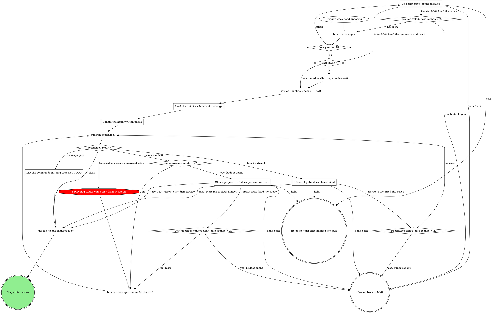

# Updating rt.cool docs

The rt.cool docs site lives in `website/` (a Docusaurus site served at the site root; the CLI reference is not under a docs subpath the way some sites nest it). Two kinds of content live side by side there, and mixing them up is the main way this goes wrong.

## Context

- `website/docs/reference/` is GENERATED. `scripts/gen-docs.ts` builds every page under it from `lib/command-tree-def.ts`, the single source of truth for command names, subcommands, flags, and args. Never hand-edit a generated page; your edit is silently discarded the next time someone runs the generator.
- `website/docs/guides/*`, `website/docs/getting-started/*`, `website/docs/intro.mdx`, and `website/docs/reference/global.mdx` are hand-written. These are where prose, rationale, and workflow explanation live.
- `website/docs/reference/_partials/<relpath>.mdx` files are hand-written worked examples spliced into an otherwise-generated reference page (`<relpath>` mirrors the command's path, e.g. `_partials/worktree/new.mdx` for the `worktree new` command). The generator checks whether a partial exists for a given command and, if so, imports it into the generated page rather than overwriting it. These files are never clobbered by generation, so they are the one place you can add worked prose underneath a generated flag table.

## The rule

You never write or edit a command flag/arg table by hand, anywhere, for any reason. Those tables come only from regenerating against `lib/command-tree-def.ts`. If a table is wrong or incomplete, the fix is a code change to the command tree definition (out of scope for this skill) or a `docs:check` coverage note, never a hand patch to the rendered Markdown. Your job is the part a script cannot do: writing and updating guide prose, adding worked examples in `_partials`, and recognizing when a genuinely new subsystem needs a whole new guide page rather than a paragraph tacked onto an existing one. Judgment, not transcription.

## Process

### Read the diff of each behavior change

For any commit in the range that touches a command handler or `lib/command-tree-def.ts`, read its diff so you understand the actual behavior change, not just the commit subject.

### Update the hand-written pages

For every changed, added, or removed command or behavior, decide:

- Does an existing guide under `website/docs/guides/*` (or a getting-started page) describe this and now need updating? Edit it.
- Would a worked example help under the command's generated reference page? Add or update `website/docs/reference/_partials/<relpath>.mdx`.
- Is this a genuinely new subsystem with no existing home? Propose a new guide file under `website/docs/guides/`, giving it a `sidebar_position` in its frontmatter so it slots into the sidebar correctly.

When nothing hand-written needs to change for a given command, that's a valid outcome; do not pad guides with restatements of the generated flag table. Never invent or guess behavior to fill a gap; if you are not certain a claim is true, go read the actual command handler source before writing the sentence. No em dashes or en dashes in anything you write; use commas, periods, or "..." instead.

### List the commands missing args as a TODO

`docs:check` reports command coverage (commands still missing declared `args`). List the specific commands still missing `args` as a TODO in your report; do not fabricate flags or invent behavior just to close the gap.

### Off-script gate: docs:gen failed

Quote the `docs:gen` failure output. Take means Matt fixed the generator and ran it himself; the graph continues at `Base given?` on his result. Iterate means he fixed the cause and `bun run docs:gen` runs again, counted by `Docs:gen failed: gate rounds = 2?`. Hold ends the turn naming this gate. Hand back reports the failure to whoever is driving the release, unresolved.

### Off-script gate: drift docs:gen cannot clear

Quote the reference drift `docs:check` still reports after two regeneration rounds. Take means Matt accepts the drift for now; the add proceeds on the files as they stand. Iterate means he fixed the cause and `bun run docs:gen, rerun for the drift` runs again, counted by `Drift docs:gen cannot clear: gate rounds = 2?`. Hold ends the turn naming this gate. Hand back reports the unresolved drift.

### Off-script gate: docs:check failed

Quote the `docs:check` failure output (a failure outright, not reference drift or coverage gaps). Take means Matt ran it clean himself; the add proceeds. Iterate means he fixed the cause and `bun run docs:check` runs again, counted by `Docs:check failed: gate rounds = 2?`. Hold ends the turn naming this gate. Hand back reports the failure.

## URL facts

Use these when cross-linking between docs so links resolve correctly:

- Reference pages resolve at `/reference/<path>` (e.g. the page generated for `worktree new` resolves at `/reference/worktree/new`).
- Guides resolve at `/guides/<name>`.
- A `_partials` file is pulled into its generated page with `import Notes from '@site/docs/reference/_partials/<relpath>.mdx';`; you do not link to a partial directly, it only ever appears spliced into its parent reference page.

`git add <each changed file>` stages the specific files you changed or generated, no wildcard adds. It never commits; that's for whoever is driving the release.
