# Updating the mattstack docs

The mattstack docs site lives in `website/` (a Docusaurus site served at https://docs.mattstack.dev with base URL `/`). It has five tabs, one folder each under `website/docs/`: `start/` (Get started), `apps/` (Apps), `rt/` (rt CLI), `gitq/` (gitq) and `skills/` (Skills). Two kinds of content live side by side there, and mixing them up is the main way this goes wrong.

## Context

- `website/docs/rt/reference/` is GENERATED. `scripts/gen-docs.ts` builds every page under it from `lib/command-tree-def.ts`, the single source of truth for command names, subcommands, flags, and args. Never hand-edit a generated page; your edit is silently discarded the next time someone runs the generator. Only three entries under it are hand-written: `_partials/`, `_category_.json` and `global.mdx`.
- Everything else under `website/docs/` is hand-written: every page in `start/`, `apps/`, `skills/` and `gitq/`, and the rt tab's `index.mdx`, `first-commands.mdx` and `guides/*`. These are where prose, rationale, and workflow explanation live.
- `website/docs/gitq/reference/` is hand-written too, not generated. `apps/gitq/tests/docs-coverage.test.ts` checks it: every gitq CLI command has a reference page, and every page in a command subdirectory matches a real command.
- `website/docs/rt/reference/_partials/<relpath>.mdx` files are hand-written worked examples spliced into an otherwise-generated reference page (`<relpath>` mirrors the command's path, e.g. `_partials/worktree/new.mdx` for the `worktree new` command). The generator checks whether a partial exists for a given command and, if so, imports it into the generated page rather than overwriting it. These files are never clobbered by generation, so they are the one place you can add worked prose underneath a generated flag table.

## The rule

You never write or edit a command flag/arg table by hand, anywhere, for any reason. Those tables come only from regenerating against `lib/command-tree-def.ts`. If a table is wrong or incomplete, the fix is a code change to the command tree definition (out of scope for this skill) or a `docs:check` coverage note, never a hand patch to the rendered Markdown. Your job is the part a script cannot do: writing and updating the hand-written pages, adding worked examples in `_partials`, and recognizing when a genuinely new subsystem needs a whole new page rather than a paragraph tacked onto an existing one. Judgment, not transcription.

## Process

```dot
digraph rt_docs {
    rankdir=TB;

    "Held: the turn ends naming the gate" [shape=doublecircle];
    "Handed back to Matt" [shape=doublecircle];
    "Staged for review" [shape=doublecircle style=filled fillcolor=lightgreen];
    "Trigger: docs need updating" [shape=ellipse];
    "bun run docs:gen" [shape=plaintext];
    "docs:gen result?" [shape=diamond];
    "bun scripts/update-docs.ts --dry-run --no-agent" [shape=plaintext];
    "Base given?" [shape=diamond];
    "git describe --tags --abbrev=0" [shape=plaintext];
    "git log --oneline <base>..HEAD" [shape=plaintext];
    "Read the diff of each behavior change" [shape=box];
    "Update the hand-written pages" [shape=box];
    "bun run docs:check" [shape=plaintext];
    "docs:check result?" [shape=diamond];
    "List the commands missing args as a TODO" [shape=box];
    "Regeneration rounds = 2?" [shape=diamond];
    "bun run docs:gen, rerun for the drift" [shape=plaintext];
    "STOP: flag tables come only from docs:gen" [shape=octagon style=filled fillcolor=red fontcolor=white];
    "bun run docs:build" [shape=plaintext];
    "docs:build result?" [shape=diamond];
    "Off-script gate: docs site build failed" [shape=box];
    "Docs site build failed: gate rounds = 2?" [shape=diamond];
    "Fix the links the build names" [shape=box];
    "git add <each changed file>" [shape=plaintext];
    "Off-script gate: docs:gen failed" [shape=box];
    "Docs:gen failed: gate rounds = 2?" [shape=diamond];
    "Off-script gate: drift docs:gen cannot clear" [shape=box];
    "Drift docs:gen cannot clear: gate rounds = 2?" [shape=diamond];
    "Off-script gate: docs:check failed" [shape=box];
    "Docs:check failed: gate rounds = 2?" [shape=diamond];

    "Trigger: docs need updating" -> "bun run docs:gen";
    "bun run docs:gen" -> "docs:gen result?";
    "docs:gen result?" -> "bun scripts/update-docs.ts --dry-run --no-agent" [label="ok"];
    "bun scripts/update-docs.ts --dry-run --no-agent" -> "Base given?";
    "Off-script gate: docs:gen failed" -> "bun scripts/update-docs.ts --dry-run --no-agent" [label="take: Matt fixed the generator and ran it"];
    "Off-script gate: docs:gen failed" -> "Docs:gen failed: gate rounds = 2?" [label="iterate: Matt fixed the cause"];
    "Off-script gate: docs:gen failed" -> "Held: the turn ends naming the gate" [label="hold"];
    "Off-script gate: docs:gen failed" -> "Handed back to Matt" [label="hand back"];
    "Docs:gen failed: gate rounds = 2?" -> "bun run docs:gen" [label="no: retry"];
    "Docs:gen failed: gate rounds = 2?" -> "Handed back to Matt" [label="yes: budget spent"];
    "docs:gen result?" -> "Off-script gate: docs:gen failed" [label="failed"];
    "Base given?" -> "git log --oneline <base>..HEAD" [label="yes"];
    "Base given?" -> "git describe --tags --abbrev=0" [label="no"];
    "git describe --tags --abbrev=0" -> "git log --oneline <base>..HEAD";
    "git log --oneline <base>..HEAD" -> "Read the diff of each behavior change";
    "Read the diff of each behavior change" -> "Update the hand-written pages";
    "Update the hand-written pages" -> "bun run docs:check";
    "bun run docs:check" -> "docs:check result?";
    "bun run docs:gen, rerun for the drift" -> "bun run docs:check";
    "docs:check result?" -> "bun run docs:build" [label="clean"];
    "docs:check result?" -> "List the commands missing args as a TODO" [label="coverage gaps"];
    "List the commands missing args as a TODO" -> "bun run docs:build";
    "docs:check result?" -> "Regeneration rounds = 2?" [label="reference drift"];
    "Regeneration rounds = 2?" -> "bun run docs:gen, rerun for the drift" [label="no"];
    "Off-script gate: drift docs:gen cannot clear" -> "bun run docs:build" [label="take: Matt accepts the drift for now"];
    "Off-script gate: drift docs:gen cannot clear" -> "Drift docs:gen cannot clear: gate rounds = 2?" [label="iterate: Matt fixed the cause"];
    "Off-script gate: drift docs:gen cannot clear" -> "Held: the turn ends naming the gate" [label="hold"];
    "Off-script gate: drift docs:gen cannot clear" -> "Handed back to Matt" [label="hand back"];
    "Drift docs:gen cannot clear: gate rounds = 2?" -> "bun run docs:gen, rerun for the drift" [label="no: retry"];
    "Drift docs:gen cannot clear: gate rounds = 2?" -> "Handed back to Matt" [label="yes: budget spent"];
    "Regeneration rounds = 2?" -> "Off-script gate: drift docs:gen cannot clear" [label="yes: budget spent"];
    "Off-script gate: docs:check failed" -> "bun run docs:build" [label="take: Matt ran it clean himself"];
    "Off-script gate: docs:check failed" -> "Docs:check failed: gate rounds = 2?" [label="iterate: Matt fixed the cause"];
    "Off-script gate: docs:check failed" -> "Held: the turn ends naming the gate" [label="hold"];
    "Off-script gate: docs:check failed" -> "Handed back to Matt" [label="hand back"];
    "Docs:check failed: gate rounds = 2?" -> "bun run docs:check" [label="no: retry"];
    "Docs:check failed: gate rounds = 2?" -> "Handed back to Matt" [label="yes: budget spent"];
    "docs:check result?" -> "Off-script gate: docs:check failed" [label="failed outright"];
    "docs:check result?" -> "STOP: flag tables come only from docs:gen" [label="tempted to patch a generated table"];
    "STOP: flag tables come only from docs:gen" -> "bun run docs:gen, rerun for the drift";
    "bun run docs:build" -> "docs:build result?";
    "docs:build result?" -> "git add <each changed file>" [label="built"];
    "docs:build result?" -> "Off-script gate: docs site build failed" [label="failed: quote the broken links"];
    "Off-script gate: docs site build failed" -> "git add <each changed file>" [label="take: Matt built it clean himself"];
    "Off-script gate: docs site build failed" -> "Docs site build failed: gate rounds = 2?" [label="iterate: fix the links and rebuild"];
    "Off-script gate: docs site build failed" -> "Held: the turn ends naming the gate" [label="hold"];
    "Off-script gate: docs site build failed" -> "Handed back to Matt" [label="hand back"];
    "Docs site build failed: gate rounds = 2?" -> "Fix the links the build names" [label="no"];
    "Docs site build failed: gate rounds = 2?" -> "Handed back to Matt" [label="yes: budget spent"];
    "Fix the links the build names" -> "bun run docs:build";
    "git add <each changed file>" -> "Staged for review";
}
```



### bun scripts/update-docs.ts --dry-run --no-agent

The dry run changes nothing and prints the impact list: a `docs to review:` block naming the docs each changed file in the range touches (`scripts/lib/docs-impact.ts` maps them). It diffs from the newest `v[0-9]*` tag to HEAD; when a base was given, pass `--range <base>` too, so the list covers the same range as the git log. Each line is an area and what to review in it:

```text
[dry-run] docs to review:
  apps: website/docs/apps/board.mdx
  rt: website/docs/rt/
```

| A change under | Lists |
| --- | --- |
| `apps/board/`, `apps/boxscore/`, `apps/chat/`, `apps/console/`, `apps/deck/` | `apps:` that app's page, `website/docs/apps/<app>.mdx` |
| `apps/gitq/` | `gitq: website/docs/gitq/` |
| `commands/`, `lib/command-tree-def.ts` | `rt: website/docs/rt/` |
| `plugins/` | `skills: website/docs/skills/` |
| `rt-tray/`, `lib/setup/`, `lib/team/`, `packages/rt-client/src/settings/` | `start: website/docs/start/` |

`docs to review: none` means no changed file maps to a docs area. Never run update-docs without `--dry-run` here: a full run writes `RELEASE_NOTES.md`, which belongs to the release.

### Read the diff of each behavior change

Start with the impact list. For each area it names, read the diffs of the commits in the range that touch that area's paths (the table above), so you understand the actual behavior change, not just the commit subject. Entered from rt:release's Prepare stage, the impact list is the `docs to review:` block that `bun scripts/update-docs.ts --no-agent` printed there.

Then read the diff of any other commit in the range that touches a command handler or `lib/command-tree-def.ts`. The list is where to start, not the limit: a change outside the mapped paths can still change behavior a hand-written page describes.

### Update the hand-written pages

For every changed, added, or removed behavior, update the page that describes it, by area:

- **apps**: an app change updates that app's page, `website/docs/apps/<app>.mdx`.
- **skills**: a plugin change updates the Skills page for that skill, under `website/docs/skills/` (`website/docs/skills/index.mdx` lists which page covers which skill).
- **start**: a setup, team or settings change updates the Get started page that covers it, under `website/docs/start/` (`setup.mdx`, `teams.mdx`, `settings.mdx` and the rest).
- **gitq**: a gitq change updates its pages under `website/docs/gitq/`, including the hand-written reference in `website/docs/gitq/reference/`. A command added, renamed or removed needs its reference page added, moved or removed; from `apps/gitq`, `bun test tests/docs-coverage.test.ts` confirms the reference still matches the commands.
- **rt**: a command change updates the rt guide that describes it under `website/docs/rt/guides/`, or adds a worked example in `website/docs/rt/reference/_partials/<relpath>.mdx` when one would help under the command's generated page. A genuinely new subsystem with no existing home gets a new guide under `website/docs/rt/guides/`, with a `sidebar_position` in its frontmatter so it slots into the sidebar correctly.

Write and lint every hand-written page by `website/AGENTS.md`: the docs conventions, the terminology table in `website/TERMINOLOGY.md`, and the `doc-standards` workflow with its gate, `python3 skills/doc-standards/scripts/check_docs.py <page> --no-vale`, which must report zero errors on each page you touched. For Docusaurus config and syntax, read `skills/docusaurus-config/SKILL.md` and `skills/docusaurus-documentation/SKILL.md`. These three are listed in `skills/.skillsignore`, so they are not installed for users; read each `SKILL.md` by path.

When nothing hand-written needs to change for a given change, that's a valid outcome; do not pad pages with restatements of the generated flag table. Never invent or guess behavior to fill a gap; if you are not certain a claim is true, go read the actual source before writing the sentence. No em dashes or en dashes in anything you write; use commas, periods, or "..." instead.

### List the commands missing args as a TODO

`docs:check` reports command coverage (commands still missing declared `args`). List the specific commands still missing `args` as a TODO in your report; do not fabricate flags or invent behavior just to close the gap.

### Off-script gate: docs:gen failed

Quote the `docs:gen` failure output. Take means Matt fixed the generator and ran it himself; the graph continues at the impact list on his result. Iterate means he fixed the cause and `bun run docs:gen` runs again, counted by `Docs:gen failed: gate rounds = 2?`. Hold ends the turn naming this gate. Hand back reports the failure to whoever is driving the release, unresolved.

### Off-script gate: drift docs:gen cannot clear

Quote the reference drift `docs:check` still reports after two regeneration rounds. Take means Matt accepts the drift for now; the site build runs on the files as they stand. Iterate means he fixed the cause and `bun run docs:gen, rerun for the drift` runs again, counted by `Drift docs:gen cannot clear: gate rounds = 2?`. Hold ends the turn naming this gate. Hand back reports the unresolved drift.

### Off-script gate: docs:check failed

Quote the `docs:check` failure output (a failure outright, not reference drift or coverage gaps). Take means Matt ran it clean himself; the site build runs. Iterate means he fixed the cause and `bun run docs:check` runs again, counted by `Docs:check failed: gate rounds = 2?`. Hold ends the turn naming this gate. Hand back reports the failure.

### bun run docs:build

`docs:check` reads only the generated reference; the Docusaurus build is what proves the whole site holds together. It installs the site's dependencies and builds `website/`, and the site config makes every broken link, broken anchor and broken Markdown link fail the build. A release commits these pages straight to main and tags without waiting on CI's site build, so the deploy after the tag would be the first build to see a broken link. Every pass through this skill builds the site before anything is staged.

A failed build prints each broken link with the page that holds it. Pass means the build finished and wrote `website/build/`.

### Off-script gate: docs site build failed

Quote the build's broken-link lines (or its error, when it failed some other way), each with the page that holds it, and propose the fix for each. Take means Matt built it clean himself; the add proceeds. Iterate means fix the links the build names and build again, counted by `Docs site build failed: gate rounds = 2?`. Hold ends the turn naming this gate. Hand back reports the broken links unresolved.

### Fix the links the build names

Fix each broken link in the hand-written page that holds it, using the URL facts below for the target. A broken link inside a generated page under `website/docs/rt/reference/` is fixed by `bun run docs:gen` after the source is fixed, never by a hand edit. When a link points at a page that no longer exists, link the page that now covers the topic, or drop the link; never create a page only to satisfy the link.

## How gates ask

Attended, a gate is an AskUserQuestion form in the pane; inside a herd, `herd_ask`; inside a pipeline run, `gate_ask`. The first option is the recommendation, and the question quotes the refusal or failing output. Record the answer before acting on it.

A gate always puts its question, even when Matt is away: that is when it matters most. Take, iterate, hold and hand back are Matt's answers, never the agent's pick. A hold leaves the question open, and the turn's final message names the gate. A #rt post is never the question.

## URL facts

Use these when cross-linking between docs so links resolve correctly. The site home `/` is the Get started tab's index, and the rt tab's home is `/rt`.

- rt reference pages resolve at `/rt/reference/<path>` (e.g. the page generated for `worktree new` resolves at `/rt/reference/worktree/new`).
- rt guides resolve at `/rt/guides/<name>`.
- Get started pages resolve at `/start/<page>`, app pages at `/apps/<app>`, gitq pages under `/gitq/...`, and Skills pages at `/skills/<page>`.
- A `_partials` file is pulled into its generated page with `import Notes from '@site/docs/rt/reference/_partials/<relpath>.mdx';`; you do not link to a partial directly, it only ever appears spliced into its parent reference page.

`git add <each changed file>` stages the specific files you changed or generated, no wildcard adds. It never commits; that's for whoever is driving the release.
