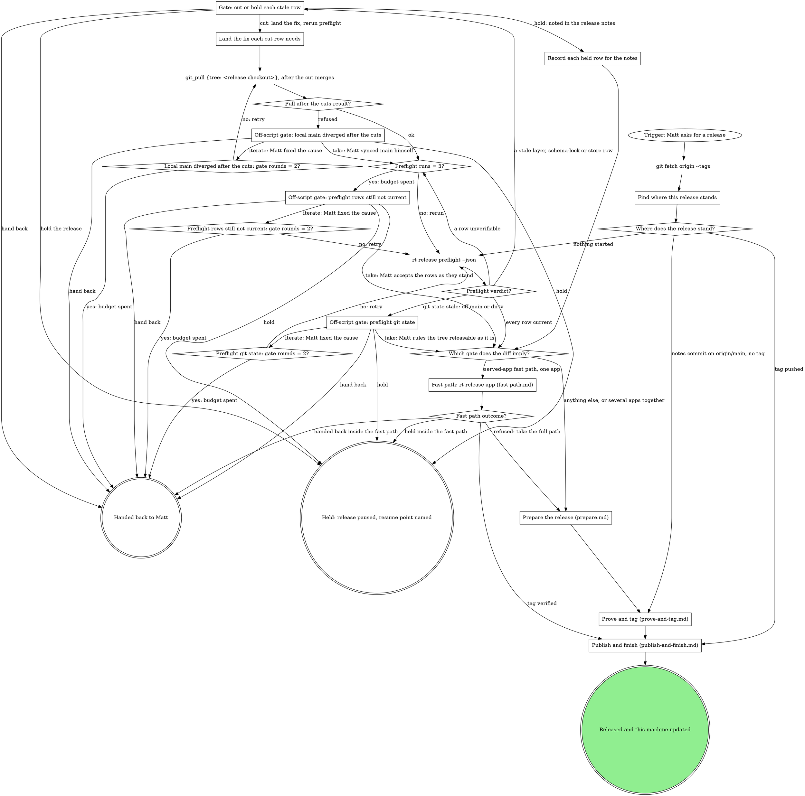

# rt Release

Pushing a version tag is what publishes. `.github/workflows/release.yml` (`on: push: tags: v*`)
builds and notarizes mattstack.app, creates the GitHub release from the committed
`RELEASE_NOTES.md`, and attaches the dmg, the zip, the Sparkle deltas, `appcast.xml` and
`SHA256SUMS`. CI owns the release object. The workflow's first step publishes the plugin
catalog (`scripts/release/marketplace.sh` pushes `marketplace/` to
`m4ttstack/mattstack-marketplace`) and needs `MARKETPLACE_TOKEN` only when the catalog changed.
rt ships only inside mattstack.app (`Contents/MacOS/rt`, updated through Sparkle); there are
no tarballs. The build, signing, notarization, clean-room and appcast half, and hand completion
of a broken publish, is `rt:mattstack-release`. The old repo name `m4ttstack/rt` is never
recreated after the rename: every app installed before it fetches its Sparkle feed through
GitHub's redirect from the old name, and a new repo under that name would capture those requests.

## The map

Every `rt release ...` command in this skill runs on Bash: no `rt release` leaf is agent-safe,
so `rt_verb` refuses them all (from a source checkout, `bun run cli.ts release <verb>` is the
same command). Status goes into the next gate's question, never into a `#rt`
post; the only `#rt` post in a release is the one update-machine makes itself.

`Which gate does the diff imply?` reads preflight's gate row. The fast path is one served app:
the diff since the last tag touches only served-app directories (`apps/board`, `apps/boxscore`,
`apps/chat`, `apps/console`, `apps/gitq`), `RELEASE_NOTES.md` and `website/`. A deck change, a
tool row, fast-browser, any rt file, or several served apps released together (when Matt wants
that) take the full path.

### Find where this release stands

Read three facts after the fetch, all against origin rather than the local checkout (which may
lag origin/main), then take the first edge that matches:

1. The newest tag on origin/main: `git describe --tags --abbrev=0 --match "v[0-9]*" origin/main`.
2. A full-path notes commit after it: `git log <newest-tag>..origin/main --format='%H %s' --grep "chore(release): docs and notes for"`.
   A match names its `<tag>`; `git ls-remote --tags origin <tag>` says whether that tag is on origin.
3. Whether the newest tag's publish verified: `rt release verify <newest-tag> --json --no-wait`.

- `notes commit on origin/main, no tag`: fact 2 matched and `ls-remote` printed nothing. Prove
  and tag reuses a dispatch run whose `headSha` is that notes commit.
- `tag pushed`: fact 2 matched and `ls-remote` printed its tag (that tag is the release in
  flight); or the newest tag's verify is not `released`; or Matt or the brief says the last
  release stopped before rt.cool or update-machine.
- `nothing started`: neither. A fast-path notes commit (`chore(release): notes for <tag>`)
  with no tag also lands here: `rt release app` resumes its own steps.

### Gate: cut or hold each stale row

Quote each stale row as preflight printed it (pinned vs current). Recommend per row kind:

- **Schema lock**: a key's schema changed in a breaking way since the last tag without a
  `storeVersion` bump and a `migrateFrom` chain covering every version since that tag (a removed
  key nothing was renamed from may instead carry a one-line reason in
  `packages/rt-client/src/settings/breaking-schema-changes.json`). Cut only: land the migration
  (`rt settings schema diff --draft` drafts it) or revert the change on main.
- **Settings stores**: the candidate's own `rt settings check` fails against the real stores (a
  value its migrations cannot carry, or an older store name edited after its current one,
  `diverged`). Cut only: fix the schema or the migration, never the store. A diverged name needs
  the value Matt chooses to keep, applied through the console's Needs fixing or
  `rt settings migrate --prune --force <key>` once he has chosen.
- **Plugin catalog**: preflight re-resolves each url-source pin with `git ls-remote`. The cut is
  `bash scripts/release/marketplace.sh --refresh`, which rewrites `marketplace/marketplace.json`
  in place and ignores `--dry-run`; review the diff and land it before the notes commit so the
  tag publishes current pins. The in-tree `chat` plugin has no upstream and never drifts.
- **Standalone fast-browser**: compared against `m4ttstack/fast-browser`'s main `package.json`
  (it publishes to npm, not GitHub releases). Hold only as Matt's recorded decision.
- **Tool rows** (bun, sparkle, age, zstd, git-lfs, gh, glab, jq, node, sops, cloudflared,
  portless): hand-pinned in `rt-tray/deps.lock`, which Renovate does not watch, so preflight is
  the only drift signal. A bump PR pending on main rides or holds by Matt's call, never silently.
  A sparkle bump never rides another release: it changes the updater and gets its own tested
  release.
- **Chrome extension**: `runtime-lock.json` in m4ttstack/fast-browser pins the published
  extension; a newer `fast-browser-v*` fork release means a runtime-lock bump and a Web Store
  submit, `npm run publish-extension <store-zip>` in that repo (it refuses a zip whose manifest
  version differs from the pin; its keychain credentials come from `npm run cws-mint-token`).
  Store review is Google's delay, so surface the submit at this gate, never at the tag.

Never stale here: herdr and claude install through their own live installers
(`VENDOR_INSTALLERS` in `lib/setup/tools-install.ts`), and mattstack.dev reads releases/latest
live. The apps ship at HEAD: board, boxscore, chat, console, deck and gitq are
`source: "tree"` rows built at the tagged commit by release.yml's `build-apps` job, so there is
nothing to bump for them. gitq's npm publish (`bun run release` in `apps/gitq`) runs on its own
schedule and this release does not gate it.

### Land the fix each cut row needs

Land each cut on main through a PR (a catalog refresh, a migration or revert, a deps.lock bump)
and wait for it to merge; the branch pushes with `git_push`. Every cut merges before the notes
commit, since whatever lands after that commit misses the tag. Not every cut is a PR here: the
Chrome extension cut lands in m4ttstack/fast-browser (the runtime-lock bump) plus a Web Store
submit, and a layer's own release ships from its own repo.

The pull comes next: the notes are written on this checkout, so it must hold the merged main, or
the notes commit sits on a stale main and its push is refused every time. Then preflight runs
again through its counter.

### Off-script gate: local main diverged after the cuts

Quote `git_pull`'s refusal (local main has commits origin/main does not). Never reset, rebase or
stash to get past it. Take: Matt synced main himself. Iterate: Matt fixed the cause, and the pull
runs again.

### Record each held row for the notes

Keep a list: the row, pinned vs current, and Matt's words. `Write the release notes` turns each
into a held-pins line.

### Off-script gate: preflight git state

Quote the `git state` row (off main, or a dirty tree). Take: Matt rules
the tree releasable as it is. Iterate: Matt fixed the cause, and preflight runs again. Never
switch the branch, stash or clean the tree yourself.

### Off-script gate: preflight rows still not current

Quote each row still `!` (unverifiable) or stale after three preflight runs; a `!` row is not a
pass. Take: Matt accepts the rows as they stand, and they join the held rows for the notes.
Iterate: Matt fixed the cause (network, a token, a landed fix), and preflight runs again.

### Fast path: rt release app (fast-path.md)

One served app's fix, released by one verb that qualifies origin/main, writes and commits the
notes, tags the next patch without a rehearsal, and verifies the publish.
Read `fast-path.md` now and follow its graph; its sections are there.

### Prepare the release (prepare.md)

The full path up to the commit the tag will point at: the bump, the docs, the notes, Matt's
approval, and the notes commit on origin/main.
Read `prepare.md` now and follow its graph; its sections are there.

### Prove and tag (prove-and-tag.md)

Rehearse release.yml on the notes commit, walk its artifact through the local clean room, and tag
the commit those runs exercised.
Read `prove-and-tag.md` now and follow its graph; its sections are there.

### Publish and finish (publish-and-finish.md)

Verify what release.yml published, deploy rt.cool, and bring this machine onto the release.
Read `publish-and-finish.md` now and follow its graph; its sections are there.

## How every gate asks

Attended, a gate is an AskUserQuestion form in the pane; inside a herd, `herd_ask`; inside a
pipeline run, `gate_ask`. The first option is the recommendation, labels are 2 to 6 words, each
description is one sentence, and the question quotes the refusal or failing output. Record the
answer before acting on it.

Take means Matt made the move (or ruled it made) and the graph continues past the failed step; the
agent never makes an off-graph move itself. Iterate means Matt fixed the cause and the failed step
runs again, counted by that gate's rounds counter. A gate waits for an answer: a
`chat_post {room: "rt", body}` and a wait is not a gate, and Matt being away is when the gate
matters most. A standing "get it out today" pre-authorizes the in-graph moves, never a gate's
answer.

## Rationalizations

| Thought | Reality |
| --- | --- |
| "Main moved, so tag HEAD." | Tag the exercised sha: the commit the rehearsal and walkthrough ran. |
| "A skip is close enough to green." | A skipped phase is not green. Read the failure; the counter and the gate take it from there. |
| "`gh release view` shows it, so it is published." | A draft renders like a release. Run verify. |
| "Rerun once more." | The counter decides. At the budget, open the gate. |
| "`--yes` is required to run at all, and it is faster." | The no-TTY refusal is why the plan gate comes first. `--yes` runs only after Matt approves the plan. |
| "I'll push main with git_push." | git_push refuses main and tags. The push box's Bash line is the move. |
| "`rt_verb` runs `rt release verify`." | No `rt release` leaf is agent-safe. Every `rt release` command runs on Bash. |
| "Rebasing a notes-only commit onto an unrelated merge is mechanical, not a new judgment call; 'get it out today, I trust you' covers it." | The notes commit is the tag target: a rebase changes what the tag covers and what the approved notes describe. Open the gate. |
| "Matt is away, so I post the status in #rt and wait." | Status goes in the gate question. The only #rt post in a release is update-machine's own. |
| "The checkout is on another branch, so I switch it." | Never switch it. Open the gate. |
