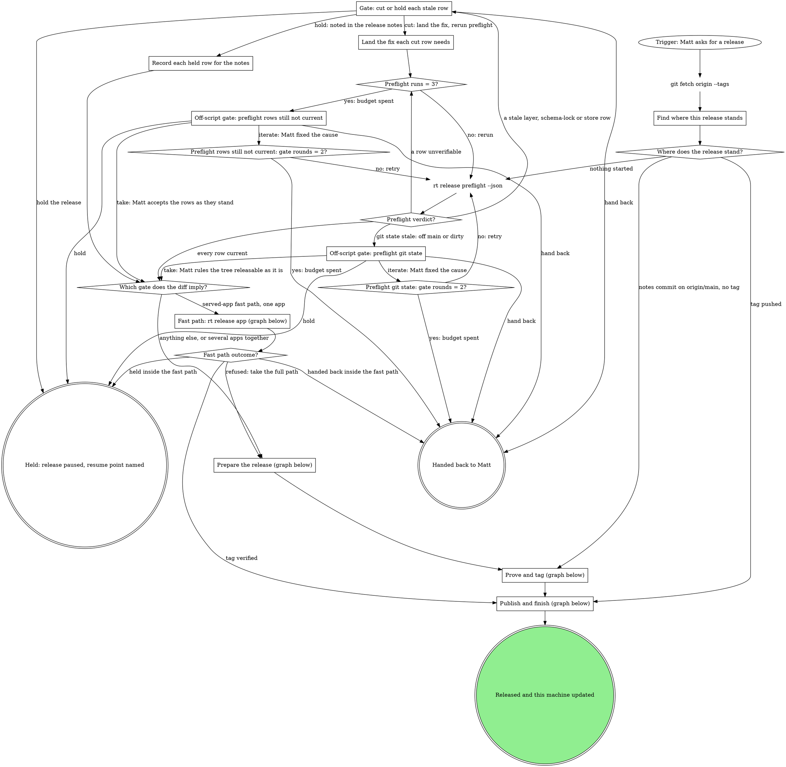
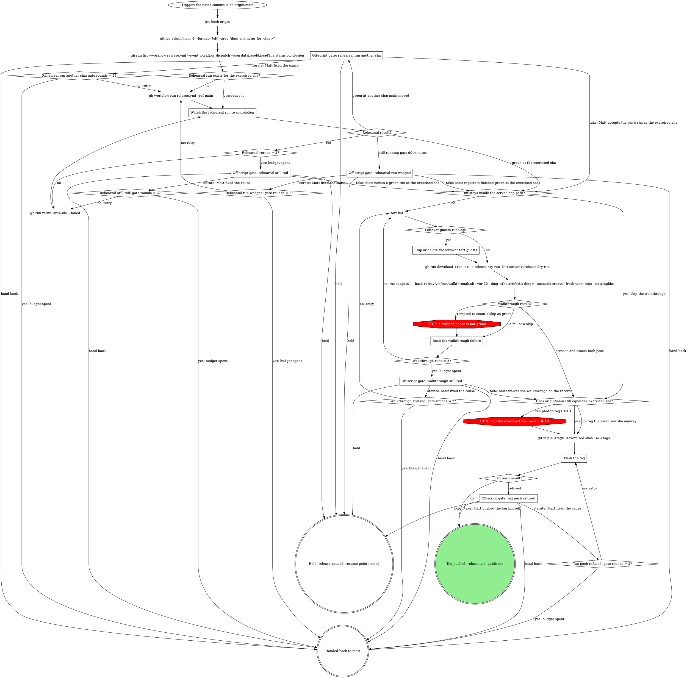

# rt Release

Pushing a version tag is what publishes. `.github/workflows/release.yml` (`on: push: tags: v*`)
builds and notarizes mattstack.app, creates the GitHub release from the committed
`RELEASE_NOTES.md`, and attaches the dmg, the zip, the Sparkle deltas, `appcast.xml` and
`SHA256SUMS`. CI owns the release object. The workflow's first step publishes the plugin
catalog (`scripts/release/marketplace.sh` pushes `marketplace/` to
`m4ttstack/mattstack-marketplace`) and needs `MARKETPLACE_TOKEN` only when the catalog changed.
rt ships only inside mattstack.app (`Contents/MacOS/rt`, updated through Sparkle); there are
no tarballs. The build, signing, notarization, clean-room and appcast half, and hand completion
of a broken publish, is `rt:mattstack-release`. The old repo name `m4ttstack/rt` is never
recreated after the rename: every app installed before it fetches its Sparkle feed through
GitHub's redirect from the old name, and a new repo under that name would capture those requests.

## The map

Every `rt release ...` command in this skill runs on Bash: no `rt release` leaf is agent-safe,
so `rt_verb` refuses them all (from a source checkout, `bun run cli.ts release <verb>` is the
same command). Status goes into the next gate's question, never into a `#rt`
post; the only `#rt` post in a release is the one update-machine makes itself.

`Which gate does the diff imply?` reads preflight's gate row. The fast path is one served app:
the diff since the last tag touches only served-app directories (`apps/board`, `apps/boxscore`,
`apps/chat`, `apps/console`, `apps/gitq`), `RELEASE_NOTES.md` and `website/`. A deck change, a
tool row, fast-browser, any rt file, or several served apps released together (when Matt wants
that) take the full path.

### Find where this release stands

Read three facts after the fetch, then take the first edge that matches:

1. The newest tag: `git describe --tags --abbrev=0`.
2. A full-path notes commit after it: `git log <newest-tag>..origin/main --format='%H %s' --grep "chore(release): docs and notes for"`.
   A match names its `<tag>`; `git ls-remote --tags origin <tag>` says whether that tag is on origin.
3. Whether the newest tag's publish verified: `rt release verify <newest-tag> --json --no-wait`.

- `notes commit on origin/main, no tag`: fact 2 matched and `ls-remote` printed nothing. Prove
  and tag reuses a dispatch run whose `headSha` is that notes commit.
- `tag pushed`: the newest tag's verify is not `released`, or Matt or the brief says the last
  release stopped before rt.cool or update-machine.
- `nothing started`: neither. A fast-path notes commit (`chore(release): notes for <tag>`)
  with no tag also lands here: `rt release app` resumes its own steps.

### Gate: cut or hold each stale row

Quote each stale row as preflight printed it (pinned vs current). Recommend per row kind:

- **Schema lock**: a key's schema changed in a breaking way since the last tag without a
  `storeVersion` bump and a `migrateFrom` chain covering every version since that tag (a removed
  key nothing was renamed from may instead carry a one-line reason in
  `packages/rt-client/src/settings/breaking-schema-changes.json`). Cut only: land the migration
  (`rt settings schema diff --draft` drafts it) or revert the change on main.
- **Settings stores**: the candidate's own `rt settings check` fails against the real stores (a
  value its migrations cannot carry, or an older store name edited after its current one,
  `diverged`). Cut only: fix the schema or the migration, never the store. A diverged name needs
  the value Matt chooses to keep, applied through the console's Needs fixing or
  `rt settings migrate --prune --force <key>` once he has chosen.
- **Plugin catalog**: preflight re-resolves each url-source pin with `git ls-remote`. The cut is
  `bash scripts/release/marketplace.sh --refresh`, which rewrites `marketplace/marketplace.json`
  in place and ignores `--dry-run`; review the diff and land it before the notes commit so the
  tag publishes current pins. The in-tree `chat` plugin has no upstream and never drifts.
- **Standalone fast-browser**: compared against `m4ttstack/fast-browser`'s main `package.json`
  (it publishes to npm, not GitHub releases). Hold only as Matt's recorded decision.
- **Tool rows** (bun, sparkle, age, zstd, git-lfs, gh, glab, jq, node, sops, cloudflared,
  portless): hand-pinned in `rt-tray/deps.lock`, which Renovate does not watch, so preflight is
  the only drift signal. A bump PR pending on main rides or holds by Matt's call, never silently.
  A sparkle bump never rides another release: it changes the updater and gets its own tested
  release.
- **Chrome extension**: `runtime-lock.json` in m4ttstack/fast-browser pins the published
  extension; a newer `fast-browser-v*` fork release means a runtime-lock bump and a Web Store
  submit, `npm run publish-extension <store-zip>` in that repo (it refuses a zip whose manifest
  version differs from the pin; its keychain credentials come from `npm run cws-mint-token`).
  Store review is Google's delay, so surface the submit at this gate, never at the tag.

Never stale here: herdr and claude install through their own live installers
(`VENDOR_INSTALLERS` in `lib/setup/tools-install.ts`), and mattstack.dev reads releases/latest
live. The apps ship at HEAD: board, boxscore, chat, console, deck and gitq are
`source: "tree"` rows built at the tagged commit by release.yml's `build-apps` job, so there is
nothing to bump for them. gitq's npm publish (`bun run release` in `apps/gitq`) runs on its own
schedule and this release does not gate it.

### Land the fix each cut row needs

Land each cut on main through a PR (a catalog refresh, a migration or revert, a deps.lock bump, a
layer's own release) and wait for it to merge; the branch pushes with `git_push`. Every cut
merges before the notes commit, since whatever lands after that commit misses the tag. Then
preflight runs again through its counter.

### Record each held row for the notes

Keep a list: the row, pinned vs current, and Matt's words. `Write the release notes` turns each
into a held-pins line.

### Off-script gate: preflight git state

Quote the `git state` row (off main, a dirty tree, no commits since the last tag). Take: Matt rules
the tree releasable as it is. Iterate: Matt fixed the cause, and preflight runs again. Never
switch the branch, stash or clean the tree yourself.

### Off-script gate: preflight rows still not current

Quote each row still `!` (unverifiable) or stale after three preflight runs; a `!` row is not a
pass. Take: Matt accepts the rows as they stand, and they join the held rows for the notes.
Iterate: Matt fixed the cause (network, a token, a landed fix), and preflight runs again.

### Fast path: rt release app (graph below)

One served app's fix, released by one verb that qualifies origin/main, writes and commits the
notes, tags the next patch without a rehearsal, and verifies the publish.

```dot
digraph fast_path_release_app {
    rankdir=TB;

    "Held: release paused, resume point named" [shape=doublecircle];
    "Handed back to Matt" [shape=doublecircle];
    "Fast path verified: continue at Publish and finish" [shape=doublecircle style=filled fillcolor=lightgreen];
    "Take the full path instead" [shape=doublecircle];
    "Trigger: preflight says fast path for one app" [shape=ellipse];
    "rt release app <name> --dry-run" [shape=plaintext];
    "Dry run qualifies?" [shape=diamond];
    "rt release app <name> --json" [shape=plaintext];
    "Release app status?" [shape=diamond];
    "Gate: approve the fast-path tag and notes" [shape=box];
    "Fast-path approval answer?" [shape=diamond];
    "Fast-path approval rounds = 3?" [shape=diamond];
    "STOP: --yes-notes waits for Matt's approval" [shape=octagon style=filled fillcolor=red fontcolor=white];
    "rt release app <name> --json --yes-notes <notesHash>" [shape=plaintext];
    "Fast-path verify reruns = 4?" [shape=diamond];
    "rt release verify <tag> --json, the fast path's resume" [shape=plaintext];
    "Fast-path resumes = 2?" [shape=diamond];
    "rt release app <name> --json, resuming the failed step" [shape=plaintext];
    "Off-script gate: fast-path publish still pending" [shape=box];
    "Fast-path publish still pending: gate rounds = 2?" [shape=diamond];
    "Off-script gate: fast-path step still failing" [shape=box];
    "Fast-path step still failing: gate rounds = 2?" [shape=diamond];

    "Trigger: preflight says fast path for one app" -> "rt release app <name> --dry-run";
    "rt release app <name> --dry-run" -> "Dry run qualifies?";
    "Dry run qualifies?" -> "rt release app <name> --json" [label="yes"];
    "Dry run qualifies?" -> "Take the full path instead" [label="no: refused outside its gate"];
    "rt release app <name> --json" -> "Release app status?";
    "rt release app <name> --json --yes-notes <notesHash>" -> "Release app status?";
    "rt release verify <tag> --json, the fast path's resume" -> "Release app status?";
    "rt release app <name> --json, resuming the failed step" -> "Release app status?";
    "Release app status?" -> "Gate: approve the fast-path tag and notes" [label="awaiting-approval"];
    "Gate: approve the fast-path tag and notes" -> "Fast-path approval answer?";
    "Fast-path approval answer?" -> "Fast-path approval rounds = 3?" [label="approve"];
    "Fast-path approval answer?" -> "Held: release paused, resume point named" [label="hold"];
    "Fast-path approval answer?" -> "Handed back to Matt" [label="hand back"];
    "Fast-path approval answer?" -> "Take the full path instead" [label="full path"];
    "Fast-path approval answer?" -> "STOP: --yes-notes waits for Matt's approval" [label="tempted to pass --yes-notes before the answer"];
    "STOP: --yes-notes waits for Matt's approval" -> "Gate: approve the fast-path tag and notes";
    "Fast-path approval rounds = 3?" -> "rt release app <name> --json --yes-notes <notesHash>" [label="no"];
    "Fast-path approval rounds = 3?" -> "Handed back to Matt" [label="yes: budget spent"];
    "Release app status?" -> "Fast path verified: continue at Publish and finish" [label="released"];
    "Release app status?" -> "Fast-path verify reruns = 4?" [label="pending"];
    "Fast-path verify reruns = 4?" -> "rt release verify <tag> --json, the fast path's resume" [label="no"];
    "Off-script gate: fast-path publish still pending" -> "Fast path verified: continue at Publish and finish" [label="take: Matt confirms the release is live"];
    "Off-script gate: fast-path publish still pending" -> "Fast-path publish still pending: gate rounds = 2?" [label="iterate: Matt fixed the cause"];
    "Off-script gate: fast-path publish still pending" -> "Held: release paused, resume point named" [label="hold"];
    "Off-script gate: fast-path publish still pending" -> "Handed back to Matt" [label="hand back"];
    "Fast-path publish still pending: gate rounds = 2?" -> "rt release verify <tag> --json, the fast path's resume" [label="no: retry"];
    "Fast-path publish still pending: gate rounds = 2?" -> "Handed back to Matt" [label="yes: budget spent"];
    "Fast-path verify reruns = 4?" -> "Off-script gate: fast-path publish still pending" [label="yes: budget spent"];
    "Release app status?" -> "Fast-path resumes = 2?" [label="failed"];
    "Fast-path resumes = 2?" -> "rt release app <name> --json, resuming the failed step" [label="no"];
    "Off-script gate: fast-path step still failing" -> "Fast path verified: continue at Publish and finish" [label="take: Matt finished the step himself"];
    "Off-script gate: fast-path step still failing" -> "Fast-path step still failing: gate rounds = 2?" [label="iterate: Matt fixed the cause"];
    "Off-script gate: fast-path step still failing" -> "Held: release paused, resume point named" [label="hold"];
    "Off-script gate: fast-path step still failing" -> "Handed back to Matt" [label="hand back"];
    "Fast-path step still failing: gate rounds = 2?" -> "rt release app <name> --json, resuming the failed step" [label="no: retry"];
    "Fast-path step still failing: gate rounds = 2?" -> "Handed back to Matt" [label="yes: budget spent"];
    "Fast-path resumes = 2?" -> "Off-script gate: fast-path step still failing" [label="yes: budget spent"];
}
```

Run each `rt release app ... --json` call in the background: it waits on the tag's release.yml run
(25 to 50 minutes) and prints one envelope when it exits. The dry run shows the qualify result, the
next tag and the commands. The verb skips the rehearsal because its gate admits only the
served-app path, the notes and `website/`, and its qualify step has confirmed the newest tag
verified. Every step detects its own completion, so rerunning the verb resumes, even after a run
killed mid-wait, and a newest tag whose publish has not verified is re-verified before anything
new starts. The verified
outcome continues at Publish and finish for rt.cool and update-machine.

### Gate: approve the fast-path tag and notes

`awaiting-approval` means the notes are not committed on main yet. Show Matt the tag and the full
notes from the envelope. On approve, run the envelope's `resume`,
`rt release app <name> --json --yes-notes <notesHash>` (the flag takes only that hash); it
commits, tags and waits on release.yml. A second `awaiting-approval` means the notes changed after
he approved (another served-app commit landed) and nothing was committed: show him the new notes.

### Off-script gate: fast-path publish still pending

`pending` means tagged but not verified: release.yml is still running past the hour-long watch
(the verify step's detail names the run), or a check, usually releases/latest, has not caught up.
After four verify reruns, quote the pending rows. Take: Matt confirms the release is live.
Iterate: Matt fixed the cause, and verify runs again.

### Off-script gate: fast-path step still failing

Quote the failed step's detail and the `resume` the envelope names. Take: Matt finished the step
himself. Iterate: Matt fixed the cause, and the verb resumes again.

### Prepare the release (graph below)

The full path up to the commit the tag will point at: the bump, the docs, the notes, Matt's
approval, and the notes commit on origin/main.

```dot
digraph prepare_release {
    rankdir=TB;

    "Held: release paused, resume point named" [shape=doublecircle];
    "Handed back to Matt" [shape=doublecircle];
    "Notes commit on origin/main" [shape=doublecircle style=filled fillcolor=lightgreen];
    "Trigger: preflight passed on the full path" [shape=ellipse];
    "Choose the version bump" [shape=box];
    "Bump clear from the subjects?" [shape=diamond];
    "Gate: which version bump?" [shape=box];
    "main ahead of origin/main?" [shape=diamond];
    "Matt pre-authorized pushing main?" [shape=diamond];
    "Gate: push main now or with the notes" [shape=box];
    "Push main: the commits preflight found unpushed" [shape=box];
    "Early push result?" [shape=diamond];
    "Curated notes already in RELEASE_NOTES.md?" [shape=diamond];
    "Copy RELEASE_NOTES.md aside" [shape=box];
    "bun scripts/update-docs.ts --no-agent" [shape=plaintext];
    "update-docs result?" [shape=diamond];
    "Notes copied aside?" [shape=diamond];
    "Restore the curated notes" [shape=box];
    "Update the guides the range changed" [shape=box];
    "Write the release notes" [shape=box];
    "Gate: approve the tag, notes and docs diff" [shape=box];
    "Approval answer?" [shape=diamond];
    "Notes revision rounds = 3?" [shape=diamond];
    "STOP: nothing commits, tags or deploys before the notes approval" [shape=octagon style=filled fillcolor=red fontcolor=white];
    "Release-day PRs merged?" [shape=diamond];
    "git add website RELEASE_NOTES.md" [shape=plaintext];
    "git commit -m \"chore(release): docs and notes for <tag>\"" [shape=plaintext];
    "git rev-parse HEAD" [shape=plaintext];
    "Push main: the notes commit" [shape=box];
    "Notes push result?" [shape=diamond];
    "Off-script gate: early main push refused" [shape=box];
    "Early main push refused: gate rounds = 2?" [shape=diamond];
    "Off-script gate: update-docs failed" [shape=box];
    "Update-docs failed: gate rounds = 2?" [shape=diamond];
    "Off-script gate: release-day PRs still open" [shape=box];
    "Release-day PRs still open: gate rounds = 2?" [shape=diamond];
    "Off-script gate: notes push refused" [shape=box];
    "Notes push refused: gate rounds = 2?" [shape=diamond];

    "Trigger: preflight passed on the full path" -> "Choose the version bump";
    "Choose the version bump" -> "Bump clear from the subjects?";
    "Bump clear from the subjects?" -> "main ahead of origin/main?" [label="yes"];
    "Bump clear from the subjects?" -> "Gate: which version bump?" [label="no: ask"];
    "Gate: which version bump?" -> "main ahead of origin/main?" [label="Matt names the bump"];
    "Gate: which version bump?" -> "Held: release paused, resume point named" [label="hold"];
    "Gate: which version bump?" -> "Handed back to Matt" [label="hand back"];
    "main ahead of origin/main?" -> "Curated notes already in RELEASE_NOTES.md?" [label="no"];
    "main ahead of origin/main?" -> "Matt pre-authorized pushing main?" [label="yes"];
    "Matt pre-authorized pushing main?" -> "Push main: the commits preflight found unpushed" [label="yes: recorded in this session or the brief"];
    "Matt pre-authorized pushing main?" -> "Gate: push main now or with the notes" [label="no"];
    "Gate: push main now or with the notes" -> "Push main: the commits preflight found unpushed" [label="now"];
    "Gate: push main now or with the notes" -> "Curated notes already in RELEASE_NOTES.md?" [label="with the notes"];
    "Gate: push main now or with the notes" -> "Held: release paused, resume point named" [label="hold"];
    "Gate: push main now or with the notes" -> "Handed back to Matt" [label="hand back"];
    "Push main: the commits preflight found unpushed" -> "Early push result?";
    "Early push result?" -> "Curated notes already in RELEASE_NOTES.md?" [label="ok"];
    "Off-script gate: early main push refused" -> "Curated notes already in RELEASE_NOTES.md?" [label="take: Matt pushed it himself"];
    "Off-script gate: early main push refused" -> "Early main push refused: gate rounds = 2?" [label="iterate: Matt fixed the cause"];
    "Off-script gate: early main push refused" -> "Held: release paused, resume point named" [label="hold"];
    "Off-script gate: early main push refused" -> "Handed back to Matt" [label="hand back"];
    "Early main push refused: gate rounds = 2?" -> "Push main: the commits preflight found unpushed" [label="no: retry"];
    "Early main push refused: gate rounds = 2?" -> "Handed back to Matt" [label="yes: budget spent"];
    "Early push result?" -> "Off-script gate: early main push refused" [label="refused"];
    "Curated notes already in RELEASE_NOTES.md?" -> "Copy RELEASE_NOTES.md aside" [label="yes"];
    "Curated notes already in RELEASE_NOTES.md?" -> "bun scripts/update-docs.ts --no-agent" [label="no"];
    "Copy RELEASE_NOTES.md aside" -> "bun scripts/update-docs.ts --no-agent";
    "bun scripts/update-docs.ts --no-agent" -> "update-docs result?";
    "update-docs result?" -> "Notes copied aside?" [label="ok"];
    "Off-script gate: update-docs failed" -> "Notes copied aside?" [label="take: Matt ran it to a clean finish"];
    "Off-script gate: update-docs failed" -> "Update-docs failed: gate rounds = 2?" [label="iterate: Matt fixed the cause"];
    "Off-script gate: update-docs failed" -> "Held: release paused, resume point named" [label="hold"];
    "Off-script gate: update-docs failed" -> "Handed back to Matt" [label="hand back"];
    "Update-docs failed: gate rounds = 2?" -> "bun scripts/update-docs.ts --no-agent" [label="no: retry"];
    "Update-docs failed: gate rounds = 2?" -> "Handed back to Matt" [label="yes: budget spent"];
    "update-docs result?" -> "Off-script gate: update-docs failed" [label="failed"];
    "Notes copied aside?" -> "Restore the curated notes" [label="yes"];
    "Notes copied aside?" -> "Update the guides the range changed" [label="no"];
    "Restore the curated notes" -> "Update the guides the range changed";
    "Update the guides the range changed" -> "Write the release notes";
    "Write the release notes" -> "Gate: approve the tag, notes and docs diff";
    "Gate: approve the tag, notes and docs diff" -> "Approval answer?";
    "Approval answer?" -> "Release-day PRs merged?" [label="approve"];
    "Approval answer?" -> "Notes revision rounds = 3?" [label="revise"];
    "Approval answer?" -> "Held: release paused, resume point named" [label="hold"];
    "Approval answer?" -> "Handed back to Matt" [label="abort: hand back"];
    "Approval answer?" -> "STOP: nothing commits, tags or deploys before the notes approval" [label="tempted to commit before the answer"];
    "STOP: nothing commits, tags or deploys before the notes approval" -> "Gate: approve the tag, notes and docs diff";
    "Notes revision rounds = 3?" -> "Write the release notes" [label="no"];
    "Notes revision rounds = 3?" -> "Handed back to Matt" [label="yes: budget spent"];
    "Release-day PRs merged?" -> "git add website RELEASE_NOTES.md" [label="yes"];
    "Off-script gate: release-day PRs still open" -> "git add website RELEASE_NOTES.md" [label="take: Matt rules they ride the next release"];
    "Off-script gate: release-day PRs still open" -> "Release-day PRs still open: gate rounds = 2?" [label="iterate: Matt fixed the cause"];
    "Off-script gate: release-day PRs still open" -> "Held: release paused, resume point named" [label="hold"];
    "Off-script gate: release-day PRs still open" -> "Handed back to Matt" [label="hand back"];
    "Release-day PRs still open: gate rounds = 2?" -> "Write the release notes" [label="no: retry"];
    "Release-day PRs still open: gate rounds = 2?" -> "Handed back to Matt" [label="yes: budget spent"];
    "Release-day PRs merged?" -> "Off-script gate: release-day PRs still open" [label="no"];
    "git add website RELEASE_NOTES.md" -> "git commit -m \"chore(release): docs and notes for <tag>\"";
    "git commit -m \"chore(release): docs and notes for <tag>\"" -> "git rev-parse HEAD";
    "git rev-parse HEAD" -> "Push main: the notes commit";
    "Push main: the notes commit" -> "Notes push result?";
    "Notes push result?" -> "Notes commit on origin/main" [label="ok"];
    "Off-script gate: notes push refused" -> "Notes commit on origin/main" [label="take: Matt pushed it himself"];
    "Off-script gate: notes push refused" -> "Notes push refused: gate rounds = 2?" [label="iterate: Matt fixed the cause"];
    "Off-script gate: notes push refused" -> "Held: release paused, resume point named" [label="hold"];
    "Off-script gate: notes push refused" -> "Handed back to Matt" [label="hand back"];
    "Notes push refused: gate rounds = 2?" -> "Push main: the notes commit" [label="no: retry"];
    "Notes push refused: gate rounds = 2?" -> "Handed back to Matt" [label="yes: budget spent"];
    "Notes push result?" -> "Off-script gate: notes push refused" [label="refused"];
}
```

CI reads `RELEASE_NOTES.md` at the tagged commit as the release body, so the notes commit is the
tag target. This stage never tags: the tag comes after the rehearsal, at the exercised sha.

### Choose the version bump

From `git log --pretty=%s <last-tag>..HEAD`: any `feat(` or a new module or file is a minor bump;
only `fix(`, `chore(`, `docs(`, `ci(` and `test(` is a patch bump. Anything else is not clear.

### Gate: which version bump?

Quote the subjects that make the bump unclear and recommend one.

### Gate: push main now or with the notes

Matt has not pre-authorized pushing main (his words in this session or the herd brief). List the
unpushed commits (`git log --oneline origin/main..main`). Now pushes them before the docs work;
with the notes lets them ride the notes commit's push.

### Push main: the commits preflight found unpushed

Run `git push origin main` <!-- mcp-lint: allow --> on Bash: git_push refuses main and tags.

A refusal goes straight to its gate. Never force, rebase or pull past it.

### Copy RELEASE_NOTES.md aside

`bun scripts/update-docs.ts --no-agent` regenerates the command reference, runs the drift and
coverage check, and scaffolds `RELEASE_NOTES.md` for `<last-tag>..HEAD` unconditionally,
overwriting what is there. Curated notes exist when `git diff <last-tag> -- RELEASE_NOTES.md` is
not empty (notes written early, or a rerun mid-release): copy the file into the scratchpad first.

### Restore the curated notes

Copy the saved file back over the scaffold. `Write the release notes` then checks it against the
range, which may have grown since it was written.

### Update the guides the range changed

Follow `rt:docs` from its `Read the diff of each behavior change` node: update the guides,
getting-started pages or `_partials` the range's behavior changes require. Do the judgment in this
session; never shell out to a nested headless Claude. Command flag and arg tables come only from
`bun run docs:gen` (update-docs runs it); never hand-write one.

### Write the release notes

Refine `RELEASE_NOTES.md` into the body CI publishes verbatim:

- grouped by scope, a `### ` heading per section, one bullet per change;
- every line traces to a commit in `git log <last-tag>..HEAD`; never invent or embellish;
- no em or en dashes: use commas, periods or "...";
- one held-pins line per row from `Record each held row for the notes`;
- a `**Full Changelog**` compare link from the previous tag to the new tag at the bottom.

Calibrate the tone against a prior release with `gh release view <last-tag>`. When the
`schema lock` row lists `storeVersion bumps for the release notes`, add a "Settings store
versions" section naming each key and its new store name (`rt.roles@2`). Never run
`rt settings migrate --write` on any machine before every app has moved to a build that reads the
new name: writing `key@N` starts divergence for writers still on the old name.

### Gate: approve the tag, notes and docs diff

Print the proposed tag, the full `RELEASE_NOTES.md` body, and `git diff --staged --stat` for
`website/`. A pre-authorized release covers the early main push only; these notes still need
Matt's explicit approval. Revise applies his changes and asks again.

### Push main: the notes commit

Every release-day PR this release depends on (deps.lock pins, a catalog refresh, anything the
notes describe) is merged before the commit. The add is scoped to `website` and
`RELEASE_NOTES.md`, never `git add -A`. The `git rev-parse HEAD` before the push is the exercised
sha.

Run `git push origin main` <!-- mcp-lint: allow --> on Bash: git_push refuses main and tags.

A refusal (another session merged to main since) goes straight to its gate. Never rebase, pull
or force past it: the notes commit is the tag target, and a rebase changes what the tag covers and
what the approved notes describe.

### Off-script gate: early main push refused

Quote git's refusal. Take: Matt pushed main himself. Iterate: Matt fixed the cause, and the push
runs again.

### Off-script gate: update-docs failed

Quote the failing output (the drift or coverage check, or a generation error). Take: Matt ran it
to a clean finish. Iterate: Matt fixed the cause, and update-docs runs again. Never hand-edit the
generated reference to pass the check.

### Off-script gate: release-day PRs still open

List each open PR the notes or a cut row depend on, with its CI state. Take: Matt rules they ride
the next release; recommend it only when the approved notes do not describe them. Iterate: Matt
merged them, the range changed, and the notes are written again and go back through approval.

### Off-script gate: notes push refused

Quote the refusal and what landed on origin/main since (`git log --oneline main..origin/main`).
Matt approved notes for a range that commit is not in, and the tag will point at whatever gets
pushed, so folding it in is his call; "get it out today" or "I trust you" does not answer this
gate. Take: Matt pushed it himself. Iterate: Matt fixed the cause (for example, he rebased the
notes commit after reading the new one), and the push runs again with the exercised sha read anew.

### Prove and tag (graph below)

Rehearse release.yml on the notes commit, walk its artifact through the local clean room, and tag
the commit those runs exercised.

The rehearsal builds, notarizes and clean-rooms exactly as a tag does, but skips the release,
validates the catalog without pushing it and uploads `out/` as the `release-dry-run` artifact. A
tag that fails halfway has already re-signed the app and cost Matt his TCC grants, so the
rehearsal is where defects are cheap. The path fast path: when
`git diff --name-only <last-tag>..<exercised-sha>` stays inside the served-app directories,
`RELEASE_NOTES.md` and `website/`, the tag rests on the rehearsal alone; deck, every tool row,
fast-browser and any rt file keep the walkthrough.

The walkthrough runs only on this machine (GitHub runners cannot nest virtualization), takes
about 25 minutes, and needs the `mattstack-golden-26` image plus: `MATTSTACK_VMTEST_PAT`
(`gh auth token` works for GitHub; `--forge gitlab` needs a GitLab PAT, which the harness exports
as `GITLAB_TOKEN`), `MATTSTACK_VMTEST_ORG=matts-hasura-demo` and
`MATTSTACK_VMTEST_ORG_CONFIRM=matts-hasura-demo` (the README's default org does not exist).
`<scratch>` is this session's scratchpad.

### Watch the rehearsal run to completion

Find the run whose `headSha` is the exercised sha (a new dispatch takes a few seconds to list).
Poll `gh run view <run-id> --json status,conclusion,headSha` every few minutes in the background;
never a bare `gh run watch --exit-status`, which exits nonzero on a false failure while the run is
still in progress. The rehearsal stamps `<next-patch>-ci<run>`, so read the artifact's actual dmg
filename rather than assuming it. check-bundle asserts `Contents/Helpers/gate-fork.sh` exists and
is executable, so a missing copy fails the rehearsal itself.

### Stop or delete the leftover tart guests

macOS caps concurrent VMs at two, so a leftover guest makes the new one fail boot as "ssh as
tester never came up". Stop or delete each running guest, then run `tart list` again: a closed
job's pane may never have run its cleanup.

### Read the walkthrough failure

Green is the report's `screens` and `assert` phases both `pass`; a `skip` is not green. When
`deck.managed` fails, read `~/.mattstack/deck/logs/agent.log` from the guest-home tarball first:

- no entries at all: the silent no-spawn window (launchd never ran the registered agent, often
  right after the FDA relaunch);
- failed-bind holder lines: the port wedge;
- a fresh "serving" line seconds before the step failed: adopt raced deck's registry bootstrap.

All three are rerun-first during a release, and the evidence goes to the deck boot ticket, not
into ad-hoc guest debugging.

### Push the tag

The tag points at the exercised sha, never bare HEAD: other sessions merge to main mid-release,
and the tag must name the commit the rehearsal and walkthrough ran.

Run `git push origin <tag>` <!-- mcp-lint: allow --> on Bash: git_push refuses main and tags.

The push is the publish: never `gh release create`.

### Off-script gate: rehearsal ran another sha

Quote the run id, its `headSha` and the exercised sha. Take: Matt accepts the run's sha as the
exercised sha. Iterate: Matt fixed the cause, and a new dispatch runs.

### Off-script gate: rehearsal run wedged

Quote the run id, the elapsed time and the step it sits on. Take: Matt reports it finished green
at the exercised sha. Iterate: Matt cancelled or cleared it, and a new dispatch runs.

### Off-script gate: rehearsal still red

Quote the failing job, step and error lines (`gh run view <run-id> --log-failed`). Take: Matt
names a green run at the exercised sha. Iterate: Matt fixed an outside cause, and the failed jobs
rerun. A fix that needs a code change moves main past the notes commit, so recommend hold or hand
back for it, not iterate.

### Off-script gate: walkthrough still red

Quote the report's phase results and what `Read the walkthrough failure` found. Take: Matt waives
the walkthrough; record his words with the answer. Iterate: Matt fixed the cause (an image grant,
the environment), and the walkthrough runs again.

### Off-script gate: tag push refused

Quote git's refusal. Take: Matt pushed the tag himself. Iterate: Matt fixed the cause, and the
push runs again.

### Publish and finish (graph below)

Verify what release.yml published, deploy rt.cool, and bring this machine onto the release.

```dot
digraph publish_and_finish {
    rankdir=TB;

    "Held: release paused, resume point named" [shape=doublecircle];
    "Handed back to Matt" [shape=doublecircle];
    "Released and this machine updated" [shape=doublecircle style=filled fillcolor=lightgreen];
    "Trigger: the tag is pushed" [shape=ellipse];
    "rt release verify <tag> --json" [shape=plaintext];
    "Verify status?" [shape=diamond];
    "Verify reruns = 4?" [shape=diamond];
    "rt release verify <tag> --json, rerun after the wait" [shape=plaintext];
    "Failure is the asset-upload 500 flake?" [shape=diamond];
    "Publish recoveries = 1?" [shape=diamond];
    "gh release delete <tag>" [shape=plaintext];
    "gh run rerun <run-id> --failed, after the delete" [shape=plaintext];
    "Draft flips = 1?" [shape=diamond];
    "gh release edit <tag> --draft=false" [shape=plaintext];
    "STOP: CI owns the release object; rerun verify instead" [shape=octagon style=filled fillcolor=red fontcolor=white];
    "bash scripts/deploy-docs.sh" [shape=plaintext];
    "Docs deploy result?" [shape=diamond];
    "Docs deploy attempts = 2?" [shape=diamond];
    "bash scripts/deploy-docs.sh, retried once" [shape=plaintext];
    "rt release update-machine --plan" [shape=plaintext];
    "Gate: approve the update-machine legs" [shape=box];
    "Update-machine plan answer?" [shape=diamond];
    "STOP: --yes runs only after Matt approves the plan" [shape=octagon style=filled fillcolor=red fontcolor=white];
    "rt release update-machine --yes" [shape=plaintext];
    "Update-machine summary?" [shape=diamond];
    "STOP: never switch the shared checkout's branch" [shape=octagon style=filled fillcolor=red fontcolor=white];
    "Update-machine runs = 2?" [shape=diamond];
    "Fix what the halted leg names" [shape=box];
    "rt release update-machine --yes, rerun after the fix" [shape=plaintext];
    "Off-script gate: assets missing" [shape=box];
    "Assets missing: gate rounds = 2?" [shape=diamond];
    "Off-script gate: publish still pending" [shape=box];
    "Publish still pending: gate rounds = 2?" [shape=diamond];
    "Off-script gate: publish run failed another way" [shape=box];
    "Publish run failed another way: gate rounds = 2?" [shape=diamond];
    "Off-script gate: upload flake persists" [shape=box];
    "Upload flake persists: gate rounds = 2?" [shape=diamond];
    "Off-script gate: draft will not publish" [shape=box];
    "Draft will not publish: gate rounds = 2?" [shape=diamond];
    "Off-script gate: rt.cool setup missing" [shape=box];
    "Rt.cool setup missing: gate rounds = 2?" [shape=diamond];
    "Off-script gate: rt.cool deploy failing" [shape=box];
    "Rt.cool deploy failing: gate rounds = 2?" [shape=diamond];
    "Off-script gate: shared checkout off main" [shape=box];
    "Shared checkout off main: gate rounds = 2?" [shape=diamond];
    "Off-script gate: update-machine leg halted" [shape=box];
    "Update-machine leg halted: gate rounds = 2?" [shape=diamond];

    "Trigger: the tag is pushed" -> "rt release verify <tag> --json";
    "rt release verify <tag> --json" -> "Verify status?";
    "rt release verify <tag> --json, rerun after the wait" -> "Verify status?";
    "Verify status?" -> "bash scripts/deploy-docs.sh" [label="released"];
    "Verify status?" -> "Verify reruns = 4?" [label="pending"];
    "Verify status?" -> "Failure is the asset-upload 500 flake?" [label="failed run"];
    "Verify status?" -> "Draft flips = 1?" [label="draft left behind"];
    "Off-script gate: assets missing" -> "rt release verify <tag> --json, rerun after the wait" [label="take: Matt hand-completed them with rt:mattstack-release"];
    "Off-script gate: assets missing" -> "Assets missing: gate rounds = 2?" [label="iterate: Matt fixed the cause"];
    "Off-script gate: assets missing" -> "Held: release paused, resume point named" [label="hold"];
    "Off-script gate: assets missing" -> "Handed back to Matt" [label="hand back"];
    "Assets missing: gate rounds = 2?" -> "rt release verify <tag> --json, rerun after the wait" [label="no: retry"];
    "Assets missing: gate rounds = 2?" -> "Handed back to Matt" [label="yes: budget spent"];
    "Verify status?" -> "Off-script gate: assets missing" [label="missing assets"];
    "Verify status?" -> "STOP: CI owns the release object; rerun verify instead" [label="tempted to create the release or edit its notes by hand"];
    "STOP: CI owns the release object; rerun verify instead" -> "rt release verify <tag> --json, rerun after the wait";
    "Verify reruns = 4?" -> "rt release verify <tag> --json, rerun after the wait" [label="no"];
    "Off-script gate: publish still pending" -> "bash scripts/deploy-docs.sh" [label="take: Matt confirms the release is live"];
    "Off-script gate: publish still pending" -> "Publish still pending: gate rounds = 2?" [label="iterate: Matt fixed the cause"];
    "Off-script gate: publish still pending" -> "Held: release paused, resume point named" [label="hold"];
    "Off-script gate: publish still pending" -> "Handed back to Matt" [label="hand back"];
    "Publish still pending: gate rounds = 2?" -> "rt release verify <tag> --json, rerun after the wait" [label="no: retry"];
    "Publish still pending: gate rounds = 2?" -> "Handed back to Matt" [label="yes: budget spent"];
    "Verify reruns = 4?" -> "Off-script gate: publish still pending" [label="yes: budget spent"];
    "Failure is the asset-upload 500 flake?" -> "Publish recoveries = 1?" [label="yes"];
    "Off-script gate: publish run failed another way" -> "rt release verify <tag> --json, rerun after the wait" [label="take: Matt recovered the run by hand"];
    "Off-script gate: publish run failed another way" -> "Publish run failed another way: gate rounds = 2?" [label="iterate: Matt fixed the cause"];
    "Off-script gate: publish run failed another way" -> "Held: release paused, resume point named" [label="hold"];
    "Off-script gate: publish run failed another way" -> "Handed back to Matt" [label="hand back"];
    "Publish run failed another way: gate rounds = 2?" -> "rt release verify <tag> --json, rerun after the wait" [label="no: retry"];
    "Publish run failed another way: gate rounds = 2?" -> "Handed back to Matt" [label="yes: budget spent"];
    "Failure is the asset-upload 500 flake?" -> "Off-script gate: publish run failed another way" [label="no: any other failure"];
    "Publish recoveries = 1?" -> "gh release delete <tag>" [label="no"];
    "gh release delete <tag>" -> "gh run rerun <run-id> --failed, after the delete";
    "gh run rerun <run-id> --failed, after the delete" -> "rt release verify <tag> --json, rerun after the wait";
    "Off-script gate: upload flake persists" -> "rt release verify <tag> --json, rerun after the wait" [label="take: Matt hand-completed it with rt:mattstack-release"];
    "Off-script gate: upload flake persists" -> "Upload flake persists: gate rounds = 2?" [label="iterate: Matt fixed the cause"];
    "Off-script gate: upload flake persists" -> "Held: release paused, resume point named" [label="hold"];
    "Off-script gate: upload flake persists" -> "Handed back to Matt" [label="hand back"];
    "Upload flake persists: gate rounds = 2?" -> "gh release delete <tag>" [label="no: retry"];
    "Upload flake persists: gate rounds = 2?" -> "Handed back to Matt" [label="yes: budget spent"];
    "Publish recoveries = 1?" -> "Off-script gate: upload flake persists" [label="yes: budget spent"];
    "Draft flips = 1?" -> "gh release edit <tag> --draft=false" [label="no"];
    "gh release edit <tag> --draft=false" -> "rt release verify <tag> --json, rerun after the wait";
    "Off-script gate: draft will not publish" -> "rt release verify <tag> --json, rerun after the wait" [label="take: Matt published the draft himself"];
    "Off-script gate: draft will not publish" -> "Draft will not publish: gate rounds = 2?" [label="iterate: Matt fixed the cause"];
    "Off-script gate: draft will not publish" -> "Held: release paused, resume point named" [label="hold"];
    "Off-script gate: draft will not publish" -> "Handed back to Matt" [label="hand back"];
    "Draft will not publish: gate rounds = 2?" -> "gh release edit <tag> --draft=false" [label="no: retry"];
    "Draft will not publish: gate rounds = 2?" -> "Handed back to Matt" [label="yes: budget spent"];
    "Draft flips = 1?" -> "Off-script gate: draft will not publish" [label="yes: budget spent"];
    "bash scripts/deploy-docs.sh" -> "Docs deploy result?";
    "bash scripts/deploy-docs.sh, retried once" -> "Docs deploy result?";
    "Docs deploy result?" -> "rt release update-machine --plan" [label="deployed"];
    "Off-script gate: rt.cool setup missing" -> "rt release update-machine --plan" [label="take: Matt deployed rt.cool himself"];
    "Off-script gate: rt.cool setup missing" -> "Rt.cool setup missing: gate rounds = 2?" [label="iterate: Matt fixed the cause"];
    "Off-script gate: rt.cool setup missing" -> "Held: release paused, resume point named" [label="hold"];
    "Off-script gate: rt.cool setup missing" -> "Handed back to Matt" [label="hand back"];
    "Rt.cool setup missing: gate rounds = 2?" -> "bash scripts/deploy-docs.sh" [label="no: retry"];
    "Rt.cool setup missing: gate rounds = 2?" -> "Handed back to Matt" [label="yes: budget spent"];
    "Docs deploy result?" -> "Off-script gate: rt.cool setup missing" [label="setup missing"];
    "Docs deploy result?" -> "Docs deploy attempts = 2?" [label="failed"];
    "Docs deploy attempts = 2?" -> "bash scripts/deploy-docs.sh, retried once" [label="no"];
    "Off-script gate: rt.cool deploy failing" -> "rt release update-machine --plan" [label="take: Matt deployed rt.cool himself"];
    "Off-script gate: rt.cool deploy failing" -> "Rt.cool deploy failing: gate rounds = 2?" [label="iterate: Matt fixed the cause"];
    "Off-script gate: rt.cool deploy failing" -> "Held: release paused, resume point named" [label="hold"];
    "Off-script gate: rt.cool deploy failing" -> "Handed back to Matt" [label="hand back"];
    "Rt.cool deploy failing: gate rounds = 2?" -> "bash scripts/deploy-docs.sh, retried once" [label="no: retry"];
    "Rt.cool deploy failing: gate rounds = 2?" -> "Handed back to Matt" [label="yes: budget spent"];
    "Docs deploy attempts = 2?" -> "Off-script gate: rt.cool deploy failing" [label="yes: budget spent"];
    "rt release update-machine --plan" -> "Gate: approve the update-machine legs";
    "Gate: approve the update-machine legs" -> "Update-machine plan answer?";
    "Update-machine plan answer?" -> "rt release update-machine --yes" [label="approve every leg"];
    "Update-machine plan answer?" -> "Held: release paused, resume point named" [label="hold"];
    "Update-machine plan answer?" -> "Handed back to Matt" [label="hand back: Matt runs it with its own prompts"];
    "Update-machine plan answer?" -> "STOP: --yes runs only after Matt approves the plan" [label="tempted to run --yes before the answer"];
    "STOP: --yes runs only after Matt approves the plan" -> "Gate: approve the update-machine legs";
    "rt release update-machine --yes" -> "Update-machine summary?";
    "rt release update-machine --yes, rerun after the fix" -> "Update-machine summary?";
    "Update-machine summary?" -> "Released and this machine updated" [label="every leg ok and the verify sweep clean"];
    "Off-script gate: shared checkout off main" -> "Released and this machine updated" [label="take: Matt finished the halted legs himself"];
    "Off-script gate: shared checkout off main" -> "Shared checkout off main: gate rounds = 2?" [label="iterate: Matt fixed the cause"];
    "Off-script gate: shared checkout off main" -> "Held: release paused, resume point named" [label="hold"];
    "Off-script gate: shared checkout off main" -> "Handed back to Matt" [label="hand back"];
    "Shared checkout off main: gate rounds = 2?" -> "rt release update-machine --yes, rerun after the fix" [label="no: retry"];
    "Shared checkout off main: gate rounds = 2?" -> "Handed back to Matt" [label="yes: budget spent"];
    "Update-machine summary?" -> "Off-script gate: shared checkout off main" [label="the shared checkout is off main"];
    "Update-machine summary?" -> "STOP: never switch the shared checkout's branch" [label="tempted to switch the shared checkout's branch"];
    "STOP: never switch the shared checkout's branch" -> "Off-script gate: shared checkout off main";
    "Update-machine summary?" -> "Update-machine runs = 2?" [label="any other leg halted"];
    "Update-machine runs = 2?" -> "Fix what the halted leg names" [label="no"];
    "Fix what the halted leg names" -> "rt release update-machine --yes, rerun after the fix";
    "Off-script gate: update-machine leg halted" -> "Released and this machine updated" [label="take: Matt finished the halted legs himself"];
    "Off-script gate: update-machine leg halted" -> "Update-machine leg halted: gate rounds = 2?" [label="iterate: Matt fixed the cause"];
    "Off-script gate: update-machine leg halted" -> "Held: release paused, resume point named" [label="hold"];
    "Off-script gate: update-machine leg halted" -> "Handed back to Matt" [label="hand back"];
    "Update-machine leg halted: gate rounds = 2?" -> "rt release update-machine --yes, rerun after the fix" [label="no: retry"];
    "Update-machine leg halted: gate rounds = 2?" -> "Handed back to Matt" [label="yes: budget spent"];
    "Update-machine runs = 2?" -> "Off-script gate: update-machine leg halted" [label="yes: budget spent"];
    "Update-machine summary?" -> "Off-script gate: update-machine leg halted" [label="a halt only Matt can clear: the #rt announce failed or a sha256 mismatch"];
}
```

Run `rt release verify <tag> --json` in the background: it finds the tag's release.yml run and
watches it for up to about an hour, tolerating transient API errors (`--no-wait` takes one
snapshot instead). It confirms the published body equals the committed `RELEASE_NOTES.md`, all
four assets (`mattstack-<ver>.dmg`, `mattstack-<ver>.zip`, `appcast.xml`, `SHA256SUMS`) are
attached, the release is neither a draft nor a prerelease, and the public releases/latest endpoint
resolves to the tag with the same assets. releases/latest caches and can lag up to about 20
minutes behind the flip; the verb says "still propagating" rather than failing, so wait about five
minutes between pending reruns. The verb never recovers anything; it only names the recovery. The
asset-upload 500 on the large files is the known flake: deleting the release keeps the git tag,
and the failed jobs rerun. The release action creates a draft and flips it public last, so a run
that dies mid-upload leaves a draft that `gh release view` renders exactly like a published
release while the public API and mattstack.dev keep serving the previous tag; completing its
assets by hand does not publish it, the flip does.

### Gate: approve the update-machine legs

Show the `--plan` output. Say plainly that `--yes` skips every per-leg confirm: the prod app
replace, the dev app replace, and the daemon restart announced in #rt. From Bash there is no TTY,
and without `--yes` the verb refuses outright rather than guess at consent; that refusal is why
this gate comes first, not a reason to pass `--yes` unasked. The legs, in order:

- **Prod app**: downloads the released dmg, checks it against SHA256SUMS (a mismatch aborts before
  anything mounts), replaces `/Applications/mattstack.app` by moving the old one aside, and never
  launches either copy.
- **Dev bundle**: builds in a scratch tree at the released commit, replaces
  `/Applications/mattstack-dev.app` the same way, opens it and waits for a fresh pid.
- **Shared checkout sync**: the shared `~/Documents/GitHub/mattstack` checkout (or the older
  `~/Documents/GitHub/repo-tools` folder on a machine that has not moved it); refuses unless it is
  on main, then fast-forwards it and runs a frozen install.
- **Daemon**: announces in #rt first and refuses to restart if the announce failed, then checks
  the daemon's `sourceRev` against the released commit (a prod daemon's null `sourceRev` counts as
  a mismatch).
- **Served suite**: re-registers board, console, chat, boxscore and deck from the shared checkout,
  restarts deck's managed apps and restarts stragglers; user-managed rows are left alone.
- **Verify**: a read-only sweep of all of the above.

A leg that ends aborted or in error halts every later state-changing leg; the verify sweep still
runs and the summary names the leg that halted. `--verify-only` runs the sweep alone (refused
with `--plan`). Hand back means Matt runs the verb on a terminal and answers each leg's prompt
himself; declining a prompt skips only that leg.

### Fix what the halted leg names

Only transient halts are fixed here: a download that failed, or a deck-managed app that did not
come back after the restart. Confirm the cause is gone, then rerun. Read the daemon's state with
`rt_verb {args: ["daemon", "status"]}`. Never restart the daemon, post the #rt announce, or pull
or switch the shared checkout by hand: the legs own those moves, and the halts only Matt can clear
have their own edges.

### Off-script gate: assets missing

Quote verify's asset rows. Take: Matt hand-completed them with `rt:mattstack-release` (zip
re-derive, appcast re-sign, draft flip). Iterate: Matt fixed the cause, and verify runs again.

### Off-script gate: publish still pending

Quote the rows still pending after four reruns (past the releases/latest lag). Take: Matt confirms
the release is live. Iterate: Matt fixed the cause, and verify runs again.

### Off-script gate: publish run failed another way

Quote the failing job, step and error lines (`gh run view <run-id> --log-failed`). Take: Matt
recovered the run by hand. Iterate: Matt fixed the cause, and verify runs again.

### Off-script gate: upload flake persists

Quote the second failure's upload errors. One delete-and-rerun is the budget. Take: Matt
hand-completed the release with `rt:mattstack-release`. Iterate: Matt fixed the cause, and the
delete-and-rerun runs once more.

### Off-script gate: draft will not publish

Quote the flip's output and the release's draft state (`gh release view <tag> --json isDraft`).
Take: Matt published the draft himself. Iterate: Matt fixed the cause, and the flip runs again.

### Off-script gate: rt.cool setup missing

`scripts/deploy-docs.sh` builds the site and deploys it to Cloudflare Pages through wrangler. It
needs wrangler auth (`wrangler login` or `CLOUDFLARE_API_TOKEN`) and the Pages project pointed at
rt.cool's DNS, both one-time setup described in the script's header. Quote what is missing and
give Matt those steps; never log in for him. Take: Matt deployed rt.cool himself. Iterate: Matt
did the setup, and the deploy runs again.

### Off-script gate: rt.cool deploy failing

Quote the failing output of both attempts. Take: Matt deployed rt.cool himself. Iterate: Matt
fixed the cause, and the deploy runs again.

### Off-script gate: shared checkout off main

The shared checkout (`~/Documents/GitHub/mattstack`, or the older `~/Documents/GitHub/repo-tools`
folder on a machine that has not moved it) is shared with other sessions, and the branch it sits
on is the dev daemon's deployed code, so it is not always on main. Quote the leg's refusal and the
branch it names. Take: Matt finished the halted legs himself. Iterate: Matt put it on main, and
update-machine runs again.

### Off-script gate: update-machine leg halted

Quote the summary's halted leg and its detail (the failed #rt announce, a sha256 mismatch, or a
leg still halting after the fix). Take: Matt finished the halted legs himself. Iterate: Matt fixed
the cause, and update-machine runs again.

## How every gate asks

Attended, a gate is an AskUserQuestion form in the pane; inside a herd, `herd_ask`; inside a
pipeline run, `gate_ask`. The first option is the recommendation, labels are 2 to 6 words, each
description is one sentence, and the question quotes the refusal or failing output. Record the
answer before acting on it.

Take means Matt made the move (or ruled it made) and the graph continues past the failed step; the
agent never makes an off-graph move itself. Iterate means Matt fixed the cause and the failed step
runs again, counted by that gate's rounds counter. A gate waits for an answer: a
`chat_post {room: "rt", body}` and a wait is not a gate, and Matt being away is when the gate
matters most. A standing "get it out today" pre-authorizes the in-graph moves, never a gate's
answer.

## Rationalizations

| Thought | Reality |
| --- | --- |
| "Main moved, so tag HEAD." | Tag the exercised sha: the commit the rehearsal and walkthrough ran. |
| "A skip is close enough to green." | A skipped phase is not green. Read the failure; the counter and the gate take it from there. |
| "`gh release view` shows it, so it is published." | A draft renders like a release. Run verify. |
| "Rerun once more." | The counter decides. At the budget, open the gate. |
| "`--yes` is required to run at all, and it is faster." | The no-TTY refusal is why the plan gate comes first. `--yes` runs only after Matt approves the plan. |
| "I'll push main with git_push." | git_push refuses main and tags. The push box's Bash line is the move. |
| "`rt_verb` runs `rt release verify`." | No `rt release` leaf is agent-safe. Every `rt release` command runs on Bash. |
| "Rebasing a notes-only commit onto an unrelated merge is mechanical, not a new judgment call; 'get it out today, I trust you' covers it." | The notes commit is the tag target: a rebase changes what the tag covers and what the approved notes describe. Open the gate. |
| "Matt is away, so I post the status in #rt and wait." | Status goes in the gate question. The only #rt post in a release is update-machine's own. |
| "The checkout is on another branch, so I switch it." | Never switch it. Open the gate. |
