# rt release: fast path

This is a stage of the rt:release skill; the `How every gate asks` section of its SKILL.md
applies to every gate here. Every `rt release ...` command here runs on Bash: no `rt release`
leaf is agent-safe, so `rt_verb` refuses them.

One served app's fix, released by one verb that qualifies origin/main, writes and commits the
notes, tags the next patch without a rehearsal, and verifies the publish.

```dot
digraph fast_path_release_app {
    rankdir=TB;

    "Held: release paused, resume point named" [shape=doublecircle];
    "Handed back to Matt" [shape=doublecircle];
    "Fast path verified: continue at Publish and finish" [shape=doublecircle style=filled fillcolor=lightgreen];
    "Take the full path instead" [shape=doublecircle];
    "Trigger: preflight says fast path for one app" [shape=ellipse];
    "rt release app <name> --dry-run" [shape=plaintext];
    "Dry run qualifies?" [shape=diamond];
    "rt release app <name> --json" [shape=plaintext];
    "Release app status?" [shape=diamond];
    "Gate: approve the fast-path tag and notes" [shape=box];
    "Fast-path approval answer?" [shape=diamond];
    "Fast-path approval rounds = 3?" [shape=diamond];
    "STOP: --yes-notes waits for Matt's approval" [shape=octagon style=filled fillcolor=red fontcolor=white];
    "rt release app <name> --json --yes-notes <notesHash>" [shape=plaintext];
    "Fast-path verify reruns = 4?" [shape=diamond];
    "rt release verify <tag> --json, the fast path's resume" [shape=plaintext];
    "Fast-path resumes = 2?" [shape=diamond];
    "rt release app <name> --json, resuming the failed step" [shape=plaintext];
    "Off-script gate: fast-path publish still pending" [shape=box];
    "Fast-path publish still pending: gate rounds = 2?" [shape=diamond];
    "Off-script gate: fast-path step still failing" [shape=box];
    "Fast-path step still failing: gate rounds = 2?" [shape=diamond];
    "Off-script gate: fast path declined" [shape=box];
    "Fast path declined: gate rounds = 2?" [shape=diamond];

    "Trigger: preflight says fast path for one app" -> "rt release app <name> --dry-run";
    "rt release app <name> --dry-run" -> "Dry run qualifies?";
    "Dry run qualifies?" -> "rt release app <name> --json" [label="yes"];
    "Dry run qualifies?" -> "Take the full path instead" [label="no: refused outside its gate"];
    "rt release app <name> --json" -> "Release app status?";
    "rt release app <name> --json --yes-notes <notesHash>" -> "Release app status?";
    "rt release verify <tag> --json, the fast path's resume" -> "Release app status?";
    "rt release app <name> --json, resuming the failed step" -> "Release app status?";
    "Release app status?" -> "Gate: approve the fast-path tag and notes" [label="awaiting-approval"];
    "Gate: approve the fast-path tag and notes" -> "Fast-path approval answer?";
    "Fast-path approval answer?" -> "Fast-path approval rounds = 3?" [label="approve"];
    "Fast-path approval answer?" -> "Held: release paused, resume point named" [label="hold"];
    "Fast-path approval answer?" -> "Handed back to Matt" [label="hand back"];
    "Fast-path approval answer?" -> "Take the full path instead" [label="full path"];
    "Fast-path approval answer?" -> "STOP: --yes-notes waits for Matt's approval" [label="tempted to pass --yes-notes before the answer"];
    "STOP: --yes-notes waits for Matt's approval" -> "Gate: approve the fast-path tag and notes";
    "Fast-path approval rounds = 3?" -> "rt release app <name> --json --yes-notes <notesHash>" [label="no"];
    "Fast-path approval rounds = 3?" -> "Handed back to Matt" [label="yes: budget spent"];
    "Release app status?" -> "Fast path verified: continue at Publish and finish" [label="released"];
    "Release app status?" -> "Fast-path verify reruns = 4?" [label="pending"];
    "Fast-path verify reruns = 4?" -> "rt release verify <tag> --json, the fast path's resume" [label="no"];
    "Off-script gate: fast-path publish still pending" -> "Fast path verified: continue at Publish and finish" [label="take: Matt confirms the release is live"];
    "Off-script gate: fast-path publish still pending" -> "Fast-path publish still pending: gate rounds = 2?" [label="iterate: Matt fixed the cause"];
    "Off-script gate: fast-path publish still pending" -> "Held: release paused, resume point named" [label="hold"];
    "Off-script gate: fast-path publish still pending" -> "Handed back to Matt" [label="hand back"];
    "Fast-path publish still pending: gate rounds = 2?" -> "rt release verify <tag> --json, the fast path's resume" [label="no: retry"];
    "Fast-path publish still pending: gate rounds = 2?" -> "Handed back to Matt" [label="yes: budget spent"];
    "Fast-path verify reruns = 4?" -> "Off-script gate: fast-path publish still pending" [label="yes: budget spent"];
    "Release app status?" -> "Fast-path resumes = 2?" [label="failed"];
    "Fast-path resumes = 2?" -> "rt release app <name> --json, resuming the failed step" [label="no"];
    "Off-script gate: fast-path step still failing" -> "Fast path verified: continue at Publish and finish" [label="take: Matt finished the step himself"];
    "Off-script gate: fast-path step still failing" -> "Fast-path step still failing: gate rounds = 2?" [label="iterate: Matt fixed the cause"];
    "Off-script gate: fast-path step still failing" -> "Held: release paused, resume point named" [label="hold"];
    "Off-script gate: fast-path step still failing" -> "Handed back to Matt" [label="hand back"];
    "Fast-path step still failing: gate rounds = 2?" -> "rt release app <name> --json, resuming the failed step" [label="no: retry"];
    "Fast-path step still failing: gate rounds = 2?" -> "Handed back to Matt" [label="yes: budget spent"];
    "Fast-path resumes = 2?" -> "Off-script gate: fast-path step still failing" [label="yes: budget spent"];
    "Off-script gate: fast path declined" -> "Take the full path instead" [label="take: Matt rules the full path"];
    "Off-script gate: fast path declined" -> "Fast path declined: gate rounds = 2?" [label="iterate: Matt fixed the cause"];
    "Off-script gate: fast path declined" -> "Held: release paused, resume point named" [label="hold"];
    "Off-script gate: fast path declined" -> "Handed back to Matt" [label="hand back"];
    "Fast path declined: gate rounds = 2?" -> "rt release app <name> --dry-run" [label="no: retry"];
    "Fast path declined: gate rounds = 2?" -> "Handed back to Matt" [label="yes: budget spent"];
    "Release app status?" -> "Off-script gate: fast path declined" [label="declined: no longer qualifies"];
}
```

Run each `rt release app ... --json` call in the background: it waits on the tag's release.yml run
(25 to 50 minutes) and prints one envelope when it exits. The dry run shows the qualify result, the
next tag and the commands. The verb skips the rehearsal because its gate admits only the
served-app path, the notes and `website/`, and its qualify step has confirmed the newest tag
verified. Every step detects its own completion, so rerunning the verb resumes, even after a run
killed mid-wait, and a newest tag whose publish has not verified is re-verified before anything
new starts. The verified outcome continues at Publish and finish (`publish-and-finish.md`) for rt.cool and
update-machine.

A verify rerun reports rows, not a status: every row ok reads as `released`, only pending rows as
`pending`, and any stale or error row (a draft left behind, a missing asset) as `failed`, which
resumes through the verb.

Counters: `Fast-path approval rounds = 3?` counts the approve answers received at the approval
gate so far. `Fast-path verify reruns = 4?` counts verify resumes run after the first `pending`,
so it is yes after the fourth. `Fast-path resumes = 2?` counts resumes of the failed step after
the first failure, so it is yes after the second resume also fails. Every
`<origin>: gate rounds = 2?` counts the iterate answers received at that gate: it is yes once
Matt has answered iterate twice.

### Gate: approve the fast-path tag and notes

`awaiting-approval` means the notes are not committed on main yet. Show Matt the tag and the full
notes from the envelope. On approve, run the envelope's `resume`,
`rt release app <name> --json --yes-notes <notesHash>` (the flag takes only that hash); it
commits, tags and waits on release.yml. A second `awaiting-approval` means the notes changed after
he approved (another served-app commit landed) and nothing was committed: show him the new notes.

### Off-script gate: fast-path publish still pending

`pending` means tagged but not verified: release.yml is still running past the hour-long watch
(the verify step's detail names the run), or a check, usually releases/latest, has not caught up.
After four verify reruns, quote the pending rows. Take: Matt confirms the release is live.
Iterate: Matt fixed the cause, and verify runs again.

### Off-script gate: fast-path step still failing

Quote the failed step's detail and the `resume` the envelope names. Take: Matt finished the step
himself. Iterate: Matt fixed the cause, and the verb resumes again.

### Off-script gate: fast path declined

`declined` from a `--json` run means the qualify step refused with no resume: the app no longer
qualifies (main moved outside the served-app path, the app has not moved since the last tag, or
it no longer keeps the fast path) although the dry run passed. Quote the qualify step's detail.
Take: Matt rules the full path, and the release continues there. Iterate: Matt fixed the cause,
and the dry run runs again, counted by `Fast path declined: gate rounds = 2?`.
