# rt release: fast path

This is a stage of the rt:release skill; the `How every gate asks` section of its SKILL.md
applies to every gate here. Every `rt release ...` command here runs on Bash: no `rt release`
leaf is agent-safe, so `rt_verb` refuses them.

Every served app that moved, released together by one verb that qualifies origin/main, writes
and commits the notes, tags the next patch without a rehearsal, and verifies the publish. The
verb takes no app name: it works out which apps moved and the notes name each one. Before it
runs, the docs pages for the apps that moved are updated, approved and pushed to main, and
`bash scripts/release/minimum-update.sh v<the next patch>` prints nothing: the verb never reads
`rt-tray/sparkle-minimum-update`, and a declaration that names an earlier release fails the
tag's appcast step after the push. Anything it prints is handled as prepare.md's "Choose the
version bump" says, and the clearing commit is an `rt-tray/` change that takes this release
off the fast path.

```dot
digraph fast_path_release_apps {
    rankdir=TB;

    "Held: release paused, resume point named" [shape=doublecircle];
    "Handed back to Matt" [shape=doublecircle];
    "Fast path verified: continue at Publish and finish" [shape=doublecircle style=filled fillcolor=lightgreen];
    "Take the full path instead" [shape=doublecircle];
    "Trigger: preflight says fast path" [shape=ellipse];
    "git_pull {tree: <release checkout>}, before the app docs" [shape=plaintext];
    "Pull before the app docs result?" [shape=diamond];
    "Off-script gate: local main diverged before the app docs" [shape=box];
    "Local main diverged before the app docs: gate rounds = 2?" [shape=diamond];
    "git log --oneline <newest-tag>..main --grep \"docs: app pages for the next release\"" [shape=plaintext];
    "An app docs commit since the newest tag?" [shape=diamond];
    "bun scripts/update-docs.ts --dry-run --no-agent, for the apps that moved" [shape=plaintext];
    "bun scripts/update-docs.ts --dry-run --no-agent --range <newest docs commit>" [shape=plaintext];
    "Docs to review?" [shape=diamond];
    "Update the app pages with rt:docs" [shape=box];
    "rt:docs staged a change?" [shape=diamond];
    "git log --oneline origin/main..main --grep \"docs: app pages for the next release\"" [shape=plaintext];
    "An app docs commit only on local main?" [shape=diamond];
    "Gate: confirm the resumed app docs push" [shape=box];
    "Resumed push answer?" [shape=diamond];
    "STOP: the resumed push waits for Matt's confirmation" [shape=octagon style=filled fillcolor=red fontcolor=white];
    "Gate: approve the app docs diff" [shape=box];
    "App docs answer?" [shape=diamond];
    "STOP: the app docs commit waits for Matt's approval" [shape=octagon style=filled fillcolor=red fontcolor=white];
    "git commit -m \"docs: app pages for the next release\"" [shape=plaintext];
    "Push main: the app docs commit" [shape=box];
    "App docs push result?" [shape=diamond];
    "Off-script gate: app docs push refused" [shape=box];
    "App docs push refused: gate rounds = 2?" [shape=diamond];
    "rt release apps --dry-run --json" [shape=plaintext];
    "Dry run qualifies?" [shape=diamond];
    "rt release apps --json" [shape=plaintext];
    "Release apps status?" [shape=diamond];
    "Gate: approve the fast-path tag and notes" [shape=box];
    "Fast-path approval answer?" [shape=diamond];
    "Fast-path approval rounds = 3?" [shape=diamond];
    "STOP: --yes-notes waits for Matt's approval" [shape=octagon style=filled fillcolor=red fontcolor=white];
    "rt release apps --json --yes-notes <notesHash>" [shape=plaintext];
    "Fast-path verify reruns = 4?" [shape=diamond];
    "rt release verify <tag> --json, the fast path's resume" [shape=plaintext];
    "Fast-path resumes = 2?" [shape=diamond];
    "rt release apps --json, resuming the failed step" [shape=plaintext];
    "Off-script gate: fast-path publish still pending" [shape=box];
    "Fast-path publish still pending: gate rounds = 2?" [shape=diamond];
    "Off-script gate: fast-path step still failing" [shape=box];
    "Fast-path step still failing: gate rounds = 2?" [shape=diamond];
    "Off-script gate: fast path declined" [shape=box];
    "Fast path declined: gate rounds = 2?" [shape=diamond];

    "Trigger: preflight says fast path" -> "git_pull {tree: <release checkout>}, before the app docs";
    "git_pull {tree: <release checkout>}, before the app docs" -> "Pull before the app docs result?";
    "Pull before the app docs result?" -> "git log --oneline <newest-tag>..main --grep \"docs: app pages for the next release\"" [label="ok: main is not behind origin/main"];
    "Pull before the app docs result?" -> "Off-script gate: local main diverged before the app docs" [label="refused"];
    "Off-script gate: local main diverged before the app docs" -> "git log --oneline <newest-tag>..main --grep \"docs: app pages for the next release\"" [label="take: Matt synced main himself"];
    "Off-script gate: local main diverged before the app docs" -> "Local main diverged before the app docs: gate rounds = 2?" [label="iterate: Matt fixed the cause"];
    "Off-script gate: local main diverged before the app docs" -> "Held: release paused, resume point named" [label="hold"];
    "Off-script gate: local main diverged before the app docs" -> "Handed back to Matt" [label="hand back"];
    "Local main diverged before the app docs: gate rounds = 2?" -> "git_pull {tree: <release checkout>}, before the app docs" [label="no: retry"];
    "Local main diverged before the app docs: gate rounds = 2?" -> "Handed back to Matt" [label="yes: budget spent"];
    "git log --oneline <newest-tag>..main --grep \"docs: app pages for the next release\"" -> "An app docs commit since the newest tag?";
    "An app docs commit since the newest tag?" -> "bun scripts/update-docs.ts --dry-run --no-agent, for the apps that moved" [label="no"];
    "An app docs commit since the newest tag?" -> "bun scripts/update-docs.ts --dry-run --no-agent --range <newest docs commit>" [label="yes: a resume, review only what landed after it"];
    "bun scripts/update-docs.ts --dry-run --no-agent, for the apps that moved" -> "Docs to review?";
    "bun scripts/update-docs.ts --dry-run --no-agent --range <newest docs commit>" -> "Docs to review?";
    "Docs to review?" -> "git log --oneline origin/main..main --grep \"docs: app pages for the next release\"" [label="none"];
    "Docs to review?" -> "Update the app pages with rt:docs" [label="listed"];
    "Update the app pages with rt:docs" -> "rt:docs staged a change?";
    "rt:docs staged a change?" -> "Gate: approve the app docs diff" [label="yes"];
    "rt:docs staged a change?" -> "git log --oneline origin/main..main --grep \"docs: app pages for the next release\"" [label="no: no page needed a change"];
    "git log --oneline origin/main..main --grep \"docs: app pages for the next release\"" -> "An app docs commit only on local main?";
    "An app docs commit only on local main?" -> "Gate: confirm the resumed app docs push" [label="yes: approved earlier, its push never landed"];
    "Gate: confirm the resumed app docs push" -> "Resumed push answer?";
    "Resumed push answer?" -> "Push main: the app docs commit" [label="approve: push main"];
    "Resumed push answer?" -> "Held: release paused, resume point named" [label="hold"];
    "Resumed push answer?" -> "Handed back to Matt" [label="hand back"];
    "Resumed push answer?" -> "STOP: the resumed push waits for Matt's confirmation" [label="tempted to push before the answer"];
    "STOP: the resumed push waits for Matt's confirmation" -> "Gate: confirm the resumed app docs push";
    "An app docs commit only on local main?" -> "rt release apps --dry-run --json" [label="no"];
    "Gate: approve the app docs diff" -> "App docs answer?";
    "App docs answer?" -> "git commit -m \"docs: app pages for the next release\"" [label="approve: commit and push main"];
    "App docs answer?" -> "Held: release paused, resume point named" [label="hold"];
    "App docs answer?" -> "Handed back to Matt" [label="hand back"];
    "App docs answer?" -> "STOP: the app docs commit waits for Matt's approval" [label="tempted to commit or push before the answer"];
    "STOP: the app docs commit waits for Matt's approval" -> "Gate: approve the app docs diff";
    "git commit -m \"docs: app pages for the next release\"" -> "Push main: the app docs commit";
    "Push main: the app docs commit" -> "App docs push result?";
    "App docs push result?" -> "rt release apps --dry-run --json" [label="ok"];
    "App docs push result?" -> "Off-script gate: app docs push refused" [label="refused"];
    "Off-script gate: app docs push refused" -> "rt release apps --dry-run --json" [label="take: Matt pushed it himself"];
    "Off-script gate: app docs push refused" -> "App docs push refused: gate rounds = 2?" [label="iterate: Matt fixed the cause"];
    "Off-script gate: app docs push refused" -> "Held: release paused, resume point named" [label="hold"];
    "Off-script gate: app docs push refused" -> "Handed back to Matt" [label="hand back"];
    "App docs push refused: gate rounds = 2?" -> "Push main: the app docs commit" [label="no: retry"];
    "App docs push refused: gate rounds = 2?" -> "Handed back to Matt" [label="yes: budget spent"];
    "rt release apps --dry-run --json" -> "Dry run qualifies?";
    "Dry run qualifies?" -> "rt release apps --json" [label="yes"];
    "Dry run qualifies?" -> "Take the full path instead" [label="no: refused outside its gate"];
    "rt release apps --json" -> "Release apps status?";
    "rt release apps --json --yes-notes <notesHash>" -> "Release apps status?";
    "rt release verify <tag> --json, the fast path's resume" -> "Release apps status?";
    "rt release apps --json, resuming the failed step" -> "Release apps status?";
    "Release apps status?" -> "Gate: approve the fast-path tag and notes" [label="awaiting-approval"];
    "Gate: approve the fast-path tag and notes" -> "Fast-path approval answer?";
    "Fast-path approval answer?" -> "Fast-path approval rounds = 3?" [label="approve"];
    "Fast-path approval answer?" -> "Held: release paused, resume point named" [label="hold"];
    "Fast-path approval answer?" -> "Handed back to Matt" [label="hand back"];
    "Fast-path approval answer?" -> "Take the full path instead" [label="full path"];
    "Fast-path approval answer?" -> "STOP: --yes-notes waits for Matt's approval" [label="tempted to pass --yes-notes before the answer"];
    "STOP: --yes-notes waits for Matt's approval" -> "Gate: approve the fast-path tag and notes";
    "Fast-path approval rounds = 3?" -> "rt release apps --json --yes-notes <notesHash>" [label="no"];
    "Fast-path approval rounds = 3?" -> "Handed back to Matt" [label="yes: budget spent"];
    "Release apps status?" -> "Fast path verified: continue at Publish and finish" [label="released"];
    "Release apps status?" -> "Fast-path verify reruns = 4?" [label="pending"];
    "Fast-path verify reruns = 4?" -> "rt release verify <tag> --json, the fast path's resume" [label="no"];
    "Off-script gate: fast-path publish still pending" -> "Fast path verified: continue at Publish and finish" [label="take: Matt confirms the release is live"];
    "Off-script gate: fast-path publish still pending" -> "Fast-path publish still pending: gate rounds = 2?" [label="iterate: Matt fixed the cause"];
    "Off-script gate: fast-path publish still pending" -> "Held: release paused, resume point named" [label="hold"];
    "Off-script gate: fast-path publish still pending" -> "Handed back to Matt" [label="hand back"];
    "Fast-path publish still pending: gate rounds = 2?" -> "rt release verify <tag> --json, the fast path's resume" [label="no: retry"];
    "Fast-path publish still pending: gate rounds = 2?" -> "Handed back to Matt" [label="yes: budget spent"];
    "Fast-path verify reruns = 4?" -> "Off-script gate: fast-path publish still pending" [label="yes: budget spent"];
    "Release apps status?" -> "Fast-path resumes = 2?" [label="failed"];
    "Fast-path resumes = 2?" -> "rt release apps --json, resuming the failed step" [label="no"];
    "Off-script gate: fast-path step still failing" -> "Fast path verified: continue at Publish and finish" [label="take: Matt finished the step himself"];
    "Off-script gate: fast-path step still failing" -> "Fast-path step still failing: gate rounds = 2?" [label="iterate: Matt fixed the cause"];
    "Off-script gate: fast-path step still failing" -> "Held: release paused, resume point named" [label="hold"];
    "Off-script gate: fast-path step still failing" -> "Handed back to Matt" [label="hand back"];
    "Fast-path step still failing: gate rounds = 2?" -> "rt release apps --json, resuming the failed step" [label="no: retry"];
    "Fast-path step still failing: gate rounds = 2?" -> "Handed back to Matt" [label="yes: budget spent"];
    "Fast-path resumes = 2?" -> "Off-script gate: fast-path step still failing" [label="yes: budget spent"];
    "Off-script gate: fast path declined" -> "Take the full path instead" [label="take: Matt rules the full path"];
    "Off-script gate: fast path declined" -> "Fast path declined: gate rounds = 2?" [label="iterate: Matt fixed the cause"];
    "Off-script gate: fast path declined" -> "Held: release paused, resume point named" [label="hold"];
    "Off-script gate: fast path declined" -> "Handed back to Matt" [label="hand back"];
    "Fast path declined: gate rounds = 2?" -> "rt release apps --dry-run --json" [label="no: retry"];
    "Fast path declined: gate rounds = 2?" -> "Handed back to Matt" [label="yes: budget spent"];
    "Release apps status?" -> "Off-script gate: fast path declined" [label="declined: no longer qualifies"];
}
```

Run each `rt release apps ... --json` call in the background: it waits on the tag's release.yml run
(25 to 50 minutes) and prints one envelope when it exits. The dry run prints one envelope too: it
qualifies when its `status` is `planned`, its `nextTag` is the tag a real run cuts, and its
`steps` carry the qualify result and each planned command. The verb skips the rehearsal because its gate admits only the
served-app path, the notes and `website/`, and its qualify step has confirmed the newest tag
verified. Every step detects its own completion, so rerunning the verb resumes, even after a run
killed mid-wait, and a newest tag whose publish has not verified is re-verified before anything
new starts. The verified outcome continues at Publish and finish (`publish-and-finish.md`) for the
docs site and update-machine.

The verb commits only `RELEASE_NOTES.md`, through the GitHub API on top of origin/main
(`commitNotes` in `lib/release/release-app.ts`). It never commits from the local checkout, so the
app docs reach the tag only when their commit is on origin/main before the verb runs: that is why
the docs stage comes first and ends with a push.

A verify rerun reports rows, not a status: every row ok reads as `released`, only pending rows as
`pending`, and any stale or error row (a draft left behind, a missing asset) as `failed`, which
resumes through the verb.

Counters: `Fast-path approval rounds = 3?` counts the approve answers received at the approval
gate so far. `Fast-path verify reruns = 4?` counts verify resumes run after the first `pending`,
so it is yes after the fourth. `Fast-path resumes = 2?` counts resumes of the failed step after
the first failure, so it is yes after the second resume also fails. Every
`<origin>: gate rounds = 2?` counts the iterate answers received at that gate: it is yes once
Matt has answered iterate twice.

### git_pull {tree: <release checkout>}, before the app docs

The docs commit goes on top of local main and the push sends all of local main, so local main
must not be behind origin/main before anything is reviewed. The pull fast-forwards a main that is
behind (staged pages from a held gate ride along when the pull touches none of them) and changes
nothing on a main that is current or only ahead. It refuses a main that has diverged from
origin/main, or one whose fast-forward would overwrite a staged or modified file.

### Off-script gate: local main diverged before the app docs

Quote `git_pull`'s refusal, `git log --oneline origin/main..main` and `git log --oneline
main..origin/main`. Never reset, rebase or stash to get past it. Take: Matt synced main himself.
Iterate: Matt fixed the cause, and the pull runs again, counted by `Local main diverged before the
app docs: gate rounds = 2?`.

### An app docs commit since the newest tag?

Run the log in the release checkout on main. It reads local main, so it finds a docs commit
whether or not its push landed; the impact list alone cannot tell, since it names the same pages
after that commit as before it. No match is a first pass. A match is a resume: the newest match
(the first line) is `<newest docs commit>`, and only what landed after it needs review.

### bun scripts/update-docs.ts --dry-run --no-agent, for the apps that moved

The dry run changes nothing and prints the impact list, the `docs to review:` block rt:docs
describes, for the newest tag to HEAD: on this path, an `apps:` line naming each moved app's page
(`website/docs/apps/<app>.mdx`) and a `gitq:` line when gitq moved. Never run update-docs without
`--dry-run`: a full run writes `RELEASE_NOTES.md`, and on this path the verb writes the notes.

### bun scripts/update-docs.ts --dry-run --no-agent --range <newest docs commit>

The same dry run over `<newest docs commit>..HEAD`: only the app commits that landed after the
pages were last updated. Their pages get a second docs commit with the same subject.

### Docs to review?

`docs to review: none` takes `none`, and nothing is left to update. Anything else takes `listed`.

### An app docs commit only on local main?

The log prints a docs commit when Matt approved it earlier but its push never landed (a refused
push he held or handed back, then a resume). The verb releases origin/main, so that commit would
be left out of the tag: it needs a push, confirmed at its own gate first. No output means every
docs commit is on origin/main, and the verb runs.

### Gate: confirm the resumed app docs push

The push sends every commit on local main, and a resumed session cannot tell which of them the
earlier app docs gate listed: commits made in the release checkout since then ride along. Show
`git log --oneline origin/main..main` and name every commit it lists as part of the push. Approve
is Matt's confirmation for the push to main, covering exactly those listed commits, the same
confirmation Prepare the release (`prepare.md`) asks before its main push: a standing "get it out
today" pre-authorizes no answer here. Hold and hand back leave local main as it is, unpushed.

### Update the app pages with rt:docs

Follow rt:docs from its trigger, scoped by the impact list to the apps that moved: update only
the pages it names (each app's `website/docs/apps/<app>.mdx`, gitq's pages under
`website/docs/gitq/`), and leave rt:docs at its `Staged for review`. A hold inside rt:docs is this
stage's `Held: release paused, resume point named`, resuming at `Update the app pages with
rt:docs`; a hand back inside it is this stage's `Handed back to Matt`. Do the judgment in this
session; never shell out to a nested headless Claude.

### Gate: approve the app docs diff

Show the impact list, `git diff --staged --stat`, the staged diff of each page, and
`git log --oneline origin/main..main`. Everything staged must sit under `website/`. The push sends
every commit that log lists along with the docs commit, so name them as part of the push, or say
the log is empty. Approve is Matt's confirmation for both the commit and the push to main,
covering those listed commits, the same confirmation Prepare the release (`prepare.md`) asks
before its main push: a standing "get it out today" pre-authorizes no answer here. Hold and hand back leave the
pages staged and uncommitted.

### Push main: the app docs commit

Run `git push origin main` <!-- mcp-lint: allow --> on Bash: git_push refuses main and tags.

A refusal (another session pushed to main since) goes straight to its gate. Never rebase, pull or
force past it.

### Off-script gate: app docs push refused

Quote the refusal and what landed on origin/main since (`git log --oneline main..origin/main`).
Take: Matt pushed it himself, and the dry run qualifies the main that now carries it. Iterate:
Matt fixed the cause, and the push runs again, counted by `App docs push refused: gate rounds = 2?`.

### Gate: approve the fast-path tag and notes

`awaiting-approval` means the notes are not committed on main yet. Show Matt the tag and the full
notes from the envelope. On approve, run the envelope's `resume`,
`rt release apps --json --yes-notes <notesHash>` (the flag takes only that hash); it
commits, tags and waits on release.yml. A second `awaiting-approval` means the notes changed after
he approved (another served-app commit landed) and nothing was committed: show him the new notes.

### Off-script gate: fast-path publish still pending

`pending` means tagged but not verified: release.yml is still running past the hour-long watch
(the verify step's detail names the run), or a check, usually releases/latest, has not caught up.
After four verify reruns, quote the pending rows. Take: Matt confirms the release is live.
Iterate: Matt fixed the cause, and verify runs again.

### Off-script gate: fast-path step still failing

Quote the failed step's detail and the `resume` the envelope names. Take: Matt finished the step
himself. Iterate: Matt fixed the cause, and the verb resumes again.

### Off-script gate: fast path declined

`declined` from a `--json` run means the qualify step refused with no resume: main no longer
qualifies (it moved outside the served apps and their kits, or nothing has moved since the last
tag) although the dry run passed. Quote the qualify step's detail.
Take: Matt rules the full path, and the release continues there. Iterate: Matt fixed the cause,
and the dry run runs again, counted by `Fast path declined: gate rounds = 2?`.
