# rt release: prepare the release

This is a stage of the rt:release skill; the `How every gate asks` section of its SKILL.md
applies to every gate here.

The full path up to the commit the tag will point at: the bump, the docs, the notes, Matt's
approval, and the notes commit on origin/main.

```dot
digraph prepare_release {
    rankdir=TB;

    "Held: release paused, resume point named" [shape=doublecircle];
    "Handed back to Matt" [shape=doublecircle];
    "Notes commit on origin/main" [shape=doublecircle style=filled fillcolor=lightgreen];
    "Trigger: preflight passed on the full path" [shape=ellipse];
    "Choose the version bump" [shape=box];
    "Bump clear from the subjects?" [shape=diamond];
    "Gate: which version bump?" [shape=box];
    "main ahead of origin/main?" [shape=diamond];
    "Matt pre-authorized pushing main?" [shape=diamond];
    "Gate: push main now or with the notes" [shape=box];
    "Push main: the commits preflight found unpushed" [shape=box];
    "Early push result?" [shape=diamond];
    "Curated notes already in RELEASE_NOTES.md?" [shape=diamond];
    "Copy RELEASE_NOTES.md aside" [shape=box];
    "bun scripts/update-docs.ts --no-agent" [shape=plaintext];
    "update-docs result?" [shape=diamond];
    "Notes copied aside?" [shape=diamond];
    "Restore the curated notes" [shape=box];
    "Update the guides the range changed" [shape=box];
    "Write the release notes" [shape=box];
    "Gate: approve the tag, notes and docs diff" [shape=box];
    "Approval answer?" [shape=diamond];
    "Notes revision rounds = 3?" [shape=diamond];
    "STOP: nothing commits, tags or deploys before the notes approval" [shape=octagon style=filled fillcolor=red fontcolor=white];
    "Release-day PRs merged?" [shape=diamond];
    "git add website RELEASE_NOTES.md" [shape=plaintext];
    "git commit -m \"chore(release): docs and notes for <tag>\"" [shape=plaintext];
    "git rev-parse HEAD" [shape=plaintext];
    "Push main: the notes commit" [shape=box];
    "Notes push result?" [shape=diamond];
    "Off-script gate: early main push refused" [shape=box];
    "Early main push refused: gate rounds = 2?" [shape=diamond];
    "Off-script gate: update-docs failed" [shape=box];
    "Update-docs failed: gate rounds = 2?" [shape=diamond];
    "git_pull {tree: <release checkout>}, after the release-day merges" [shape=plaintext];
    "Pull after the release-day merges result?" [shape=diamond];
    "Off-script gate: release-day PRs still open" [shape=box];
    "Release-day PRs still open: gate rounds = 2?" [shape=diamond];
    "Off-script gate: local main diverged after the release-day merges" [shape=box];
    "Local main diverged after the release-day merges: gate rounds = 2?" [shape=diamond];
    "Off-script gate: notes push refused" [shape=box];
    "Notes push refused: gate rounds = 2?" [shape=diamond];

    "Trigger: preflight passed on the full path" -> "Choose the version bump";
    "Choose the version bump" -> "Bump clear from the subjects?";
    "Bump clear from the subjects?" -> "main ahead of origin/main?" [label="yes"];
    "Bump clear from the subjects?" -> "Gate: which version bump?" [label="no: ask"];
    "Gate: which version bump?" -> "main ahead of origin/main?" [label="Matt names the bump"];
    "Gate: which version bump?" -> "Held: release paused, resume point named" [label="hold"];
    "Gate: which version bump?" -> "Handed back to Matt" [label="hand back"];
    "main ahead of origin/main?" -> "Curated notes already in RELEASE_NOTES.md?" [label="no"];
    "main ahead of origin/main?" -> "Matt pre-authorized pushing main?" [label="yes"];
    "Matt pre-authorized pushing main?" -> "Push main: the commits preflight found unpushed" [label="yes: recorded in this session or the brief"];
    "Matt pre-authorized pushing main?" -> "Gate: push main now or with the notes" [label="no"];
    "Gate: push main now or with the notes" -> "Push main: the commits preflight found unpushed" [label="now"];
    "Gate: push main now or with the notes" -> "Curated notes already in RELEASE_NOTES.md?" [label="with the notes"];
    "Gate: push main now or with the notes" -> "Held: release paused, resume point named" [label="hold"];
    "Gate: push main now or with the notes" -> "Handed back to Matt" [label="hand back"];
    "Push main: the commits preflight found unpushed" -> "Early push result?";
    "Early push result?" -> "Curated notes already in RELEASE_NOTES.md?" [label="ok"];
    "Off-script gate: early main push refused" -> "Curated notes already in RELEASE_NOTES.md?" [label="take: Matt pushed it himself"];
    "Off-script gate: early main push refused" -> "Early main push refused: gate rounds = 2?" [label="iterate: Matt fixed the cause"];
    "Off-script gate: early main push refused" -> "Held: release paused, resume point named" [label="hold"];
    "Off-script gate: early main push refused" -> "Handed back to Matt" [label="hand back"];
    "Early main push refused: gate rounds = 2?" -> "Push main: the commits preflight found unpushed" [label="no: retry"];
    "Early main push refused: gate rounds = 2?" -> "Handed back to Matt" [label="yes: budget spent"];
    "Early push result?" -> "Off-script gate: early main push refused" [label="refused"];
    "Curated notes already in RELEASE_NOTES.md?" -> "Copy RELEASE_NOTES.md aside" [label="yes"];
    "Curated notes already in RELEASE_NOTES.md?" -> "bun scripts/update-docs.ts --no-agent" [label="no"];
    "Copy RELEASE_NOTES.md aside" -> "bun scripts/update-docs.ts --no-agent";
    "bun scripts/update-docs.ts --no-agent" -> "update-docs result?";
    "update-docs result?" -> "Notes copied aside?" [label="ok"];
    "Off-script gate: update-docs failed" -> "Notes copied aside?" [label="take: Matt ran it to a clean finish"];
    "Off-script gate: update-docs failed" -> "Update-docs failed: gate rounds = 2?" [label="iterate: Matt fixed the cause"];
    "Off-script gate: update-docs failed" -> "Held: release paused, resume point named" [label="hold"];
    "Off-script gate: update-docs failed" -> "Handed back to Matt" [label="hand back"];
    "Update-docs failed: gate rounds = 2?" -> "bun scripts/update-docs.ts --no-agent" [label="no: retry"];
    "Update-docs failed: gate rounds = 2?" -> "Handed back to Matt" [label="yes: budget spent"];
    "update-docs result?" -> "Off-script gate: update-docs failed" [label="failed"];
    "Notes copied aside?" -> "Restore the curated notes" [label="yes"];
    "Notes copied aside?" -> "Update the guides the range changed" [label="no"];
    "Restore the curated notes" -> "Update the guides the range changed";
    "Update the guides the range changed" -> "Write the release notes";
    "Write the release notes" -> "Gate: approve the tag, notes and docs diff";
    "Gate: approve the tag, notes and docs diff" -> "Approval answer?";
    "Approval answer?" -> "Release-day PRs merged?" [label="approve"];
    "Approval answer?" -> "Notes revision rounds = 3?" [label="revise"];
    "Approval answer?" -> "Held: release paused, resume point named" [label="hold"];
    "Approval answer?" -> "Handed back to Matt" [label="abort: hand back"];
    "Approval answer?" -> "STOP: nothing commits, tags or deploys before the notes approval" [label="tempted to commit before the answer"];
    "STOP: nothing commits, tags or deploys before the notes approval" -> "Gate: approve the tag, notes and docs diff";
    "Notes revision rounds = 3?" -> "Write the release notes" [label="no"];
    "Notes revision rounds = 3?" -> "Handed back to Matt" [label="yes: budget spent"];
    "Release-day PRs merged?" -> "git add website RELEASE_NOTES.md" [label="yes"];
    "Off-script gate: release-day PRs still open" -> "git add website RELEASE_NOTES.md" [label="take: Matt rules they ride the next release"];
    "Off-script gate: release-day PRs still open" -> "Release-day PRs still open: gate rounds = 2?" [label="iterate: Matt fixed the cause"];
    "Off-script gate: release-day PRs still open" -> "Held: release paused, resume point named" [label="hold"];
    "Off-script gate: release-day PRs still open" -> "Handed back to Matt" [label="hand back"];
    "Release-day PRs still open: gate rounds = 2?" -> "git_pull {tree: <release checkout>}, after the release-day merges" [label="no: retry"];
    "Release-day PRs still open: gate rounds = 2?" -> "Handed back to Matt" [label="yes: budget spent"];
    "git_pull {tree: <release checkout>}, after the release-day merges" -> "Pull after the release-day merges result?";
    "Pull after the release-day merges result?" -> "Curated notes already in RELEASE_NOTES.md?" [label="ok"];
    "Off-script gate: local main diverged after the release-day merges" -> "Curated notes already in RELEASE_NOTES.md?" [label="take: Matt synced main himself"];
    "Off-script gate: local main diverged after the release-day merges" -> "Local main diverged after the release-day merges: gate rounds = 2?" [label="iterate: Matt fixed the cause"];
    "Off-script gate: local main diverged after the release-day merges" -> "Held: release paused, resume point named" [label="hold"];
    "Off-script gate: local main diverged after the release-day merges" -> "Handed back to Matt" [label="hand back"];
    "Local main diverged after the release-day merges: gate rounds = 2?" -> "git_pull {tree: <release checkout>}, after the release-day merges" [label="no: retry"];
    "Local main diverged after the release-day merges: gate rounds = 2?" -> "Handed back to Matt" [label="yes: budget spent"];
    "Pull after the release-day merges result?" -> "Off-script gate: local main diverged after the release-day merges" [label="refused"];
    "Release-day PRs merged?" -> "Off-script gate: release-day PRs still open" [label="no"];
    "git add website RELEASE_NOTES.md" -> "git commit -m \"chore(release): docs and notes for <tag>\"";
    "git commit -m \"chore(release): docs and notes for <tag>\"" -> "git rev-parse HEAD";
    "git rev-parse HEAD" -> "Push main: the notes commit";
    "Push main: the notes commit" -> "Notes push result?";
    "Notes push result?" -> "Notes commit on origin/main" [label="ok"];
    "Off-script gate: notes push refused" -> "Notes commit on origin/main" [label="take: Matt pushed it himself"];
    "Off-script gate: notes push refused" -> "Notes push refused: gate rounds = 2?" [label="iterate: Matt fixed the cause"];
    "Off-script gate: notes push refused" -> "Held: release paused, resume point named" [label="hold"];
    "Off-script gate: notes push refused" -> "Handed back to Matt" [label="hand back"];
    "Notes push refused: gate rounds = 2?" -> "Push main: the notes commit" [label="no: retry"];
    "Notes push refused: gate rounds = 2?" -> "Handed back to Matt" [label="yes: budget spent"];
    "Notes push result?" -> "Off-script gate: notes push refused" [label="refused"];
}
```

CI reads `RELEASE_NOTES.md` at the tagged commit as the release body, so the notes commit is the
tag target. This stage never tags: the tag comes after the rehearsal, at the exercised sha.

Counters: `Notes revision rounds = 3?` counts the revise answers received at the approval gate
so far. Every `<origin>: gate rounds = 2?` counts the iterate answers received at that gate: it is yes
once Matt has answered iterate twice.

### Choose the version bump

From `git log --pretty=%s <last-tag>..HEAD`: any `feat(` or a new module or file is a minor bump;
only `fix(`, `chore(`, `docs(`, `ci(` and `test(` is a patch bump. Anything else is not clear.

### Gate: which version bump?

Quote the subjects that make the bump unclear and recommend one.

### Gate: push main now or with the notes

Matt has not pre-authorized pushing main (his words in this session or the herd brief). List the
unpushed commits (`git log --oneline origin/main..main`). Now pushes them before the docs work;
with the notes lets them ride the notes commit's push.

### Push main: the commits preflight found unpushed

Run `git push origin main` <!-- mcp-lint: allow --> on Bash: git_push refuses main and tags.

A refusal goes straight to its gate. Never force, rebase or pull past it.

### Copy RELEASE_NOTES.md aside

`bun scripts/update-docs.ts --no-agent` regenerates the command reference, runs the drift and
coverage check, and scaffolds `RELEASE_NOTES.md` for `<last-tag>..HEAD` unconditionally,
overwriting what is there. Curated notes exist when `git diff <last-tag> -- RELEASE_NOTES.md` is
not empty (notes written early, or a rerun mid-release): copy the file into the scratchpad first.

### Restore the curated notes

Copy the saved file back over the scaffold. `Write the release notes` then checks it against the
range, which may have grown since it was written.

### Update the guides the range changed

Follow `rt:docs` from its `Read the diff of each behavior change` node: update the guides,
getting-started pages or `_partials` the range's behavior changes require. Do the judgment in this
session; never shell out to a nested headless Claude. Command flag and arg tables come only from
`bun run docs:gen` (update-docs runs it); never hand-write one.

### Write the release notes

Refine `RELEASE_NOTES.md` into the body CI publishes verbatim:

- grouped by scope, a `### ` heading per section, one bullet per change;
- every line traces to a commit in `git log <last-tag>..HEAD`; never invent or embellish;
- no em or en dashes: use commas, periods or "...";
- one held-pins line per row from `Record each held row for the notes` (SKILL.md);
- a `**Full Changelog**` compare link from the previous tag to the new tag at the bottom.

Calibrate the tone against a prior release with `gh release view <last-tag>`. When the
`schema lock` row lists `storeVersion bumps for the release notes`, add a "Settings store
versions" section naming each key and its new store name (`rt.roles@2`). Never run
`rt settings migrate --write` on any machine before every app has moved to a build that reads the
new name: writing `key@N` starts divergence for writers still on the old name.

### Gate: approve the tag, notes and docs diff

Print the proposed tag, the full `RELEASE_NOTES.md` body, and `git diff --staged --stat` for
`website/`. A pre-authorized release covers the early main push only; these notes still need
Matt's explicit approval. Revise applies his changes and asks again.

### Push main: the notes commit

Every release-day PR this release depends on (deps.lock pins, a catalog refresh, anything the
notes describe) is merged before the commit. The add is scoped to `website` and
`RELEASE_NOTES.md`, never `git add -A`. The `git rev-parse HEAD` before the push is the exercised
sha.

Run `git push origin main` <!-- mcp-lint: allow --> on Bash: git_push refuses main and tags.

A refusal (another session merged to main since) goes straight to its gate. Never rebase, pull
or force past it: the notes commit is the tag target, and a rebase changes what the tag covers and
what the approved notes describe.

### Off-script gate: early main push refused

Quote git's refusal. Take: Matt pushed main himself. Iterate: Matt fixed the cause, and the push
runs again.

### Off-script gate: update-docs failed

Quote the failing output (the drift or coverage check, or a generation error). Take: Matt ran it
to a clean finish. Iterate: Matt fixed the cause, and update-docs runs again. Never hand-edit the
generated reference to pass the check.

### Off-script gate: release-day PRs still open

List each open PR the notes or a cut row depend on, with its CI state. Take: Matt rules they ride
the next release; recommend it only when the approved notes do not describe them. Iterate: Matt
merged them, and the pull runs next: the range changed, so the notes are re-scaffolded and written
on the merged main and go back through approval. Written on a stale main, the notes commit's push
is refused every time.

### Off-script gate: local main diverged after the release-day merges

Quote `git_pull`'s refusal (local main has commits origin/main does not). Never reset, rebase or
stash to get past it. Take: Matt synced main himself. Iterate: Matt fixed the cause, and the pull
runs again.

### Off-script gate: notes push refused

Quote the refusal and what landed on origin/main since (`git log --oneline main..origin/main`).
Matt approved notes for a range that commit is not in, and the tag will point at whatever gets
pushed, so folding it in is his call; "get it out today" or "I trust you" does not answer this
gate. Take: Matt pushed it himself. Iterate: Matt fixed the cause (for example, he rebased the
notes commit after reading the new one), and the push runs again. A rebase changes the notes
commit's sha; Prove and tag (`prove-and-tag.md`) re-derives the exercised sha from origin/main by the commit's subject.
