# rt release: prove and tag

This is a stage of the rt:release skill; the `How every gate asks` section of its SKILL.md
applies to every gate here.

Rehearse release.yml on the notes commit, walk its artifact through the four clean-room
scenarios, and tag the commit those runs exercised.

```dot
digraph prove_and_tag {
    rankdir=TB;

    "Held: release paused, resume point named" [shape=doublecircle];
    "Handed back to Matt" [shape=doublecircle];
    "Tag pushed: release.yml publishes" [shape=doublecircle style=filled fillcolor=lightgreen];
    "Trigger: the notes commit is on origin/main" [shape=ellipse];
    "git fetch origin" [shape=plaintext];
    "git log origin/main -1 --format=%H --grep \"docs and notes for <tag>\"" [shape=plaintext];
    "gh run list --workflow release.yml --event workflow_dispatch --json databaseId,headSha,status,conclusion" [shape=plaintext];
    "Rehearsal run exists for the exercised sha?" [shape=diamond];
    "gh workflow run release.yml --ref main" [shape=plaintext];
    "Watch the rehearsal run to completion" [shape=box];
    "Rehearsal result?" [shape=diamond];
    "Rehearsal reruns = 2?" [shape=diamond];
    "gh run rerun <run-id> --failed" [shape=plaintext];
    "Diff stays inside the served-app path?" [shape=diamond];
    "gh run download <run-id> -n release-dry-run -D <scratch>/release-dry-run" [shape=plaintext];
    "ditto -x -k <the artifact's zip> <scratch>/rehearsal-app" [shape=plaintext];
    "gh release download <previous-tag> --repo m4ttstack/mattstack --pattern '*.dmg' --dir <scratch>/previous" [shape=plaintext];
    "Stage the update leg's feed" [shape=box];
    "tart list" [shape=plaintext];
    "Leftover guests running?" [shape=diamond];
    "Stop or delete the leftover tart guests" [shape=box];
    "hdiutil info" [shape=plaintext];
    "A walkthrough dmg still attached?" [shape=diamond];
    "hdiutil detach <the /dev/disk device hdiutil info names>" [shape=plaintext];
    "Run each walkthrough scenario not yet green" [shape=box];
    "Did the update leg keep its VM?" [shape=diamond];
    "Check the kept update VM" [shape=box];
    "tart stop <kept-vm>" [shape=plaintext];
    "tart delete <kept-vm>" [shape=plaintext];
    "Teardown note names a kept team repo?" [shape=diamond];
    "gh repo delete <kept-slug> --yes" [shape=plaintext];
    "Walkthrough result?" [shape=diamond];
    "Read the walkthrough failure" [shape=box];
    "Runs of the failing scenario >= 2?" [shape=diamond];
    "STOP: a skipped phase is not green" [shape=octagon style=filled fillcolor=red fontcolor=white];
    "git fetch origin, before the tag" [shape=plaintext];
    "git log --oneline <exercised-sha>..origin/main" [shape=plaintext];
    "Does origin/main still equal the exercised sha?" [shape=diamond];
    "STOP: tag the exercised sha, never HEAD" [shape=octagon style=filled fillcolor=red fontcolor=white];
    "git tag -a <tag> <exercised-sha> -m <tag>" [shape=plaintext];
    "Push the tag" [shape=box];
    "Tag push result?" [shape=diamond];
    "Off-script gate: rehearsal ran another sha" [shape=box];
    "Rehearsal ran another sha: gate rounds = 2?" [shape=diamond];
    "Off-script gate: rehearsal run wedged" [shape=box];
    "Rehearsal run wedged: gate rounds = 2?" [shape=diamond];
    "Off-script gate: rehearsal still red" [shape=box];
    "Rehearsal still red: gate rounds = 2?" [shape=diamond];
    "Off-script gate: walkthrough still red" [shape=box];
    "Walkthrough still red: gate rounds = 2?" [shape=diamond];
    "Off-script gate: a fix landed after the exercised sha" [shape=box];
    "A fix landed after the exercised sha: gate rounds = 2?" [shape=diamond];
    "Off-script gate: tag push refused" [shape=box];
    "Tag push refused: gate rounds = 2?" [shape=diamond];

    "Trigger: the notes commit is on origin/main" -> "git fetch origin";
    "git fetch origin" -> "git log origin/main -1 --format=%H --grep \"docs and notes for <tag>\"";
    "git log origin/main -1 --format=%H --grep \"docs and notes for <tag>\"" -> "gh run list --workflow release.yml --event workflow_dispatch --json databaseId,headSha,status,conclusion";
    "gh run list --workflow release.yml --event workflow_dispatch --json databaseId,headSha,status,conclusion" -> "Rehearsal run exists for the exercised sha?";
    "Rehearsal run exists for the exercised sha?" -> "Watch the rehearsal run to completion" [label="yes: reuse it"];
    "Rehearsal run exists for the exercised sha?" -> "gh workflow run release.yml --ref main" [label="no"];
    "gh workflow run release.yml --ref main" -> "Watch the rehearsal run to completion";
    "Watch the rehearsal run to completion" -> "Rehearsal result?";
    "Rehearsal result?" -> "Diff stays inside the served-app path?" [label="green at the exercised sha"];
    "Off-script gate: rehearsal ran another sha" -> "Diff stays inside the served-app path?" [label="take: Matt accepts the run's sha as the exercised sha"];
    "Off-script gate: rehearsal ran another sha" -> "Rehearsal ran another sha: gate rounds = 2?" [label="iterate: Matt fixed the cause"];
    "Off-script gate: rehearsal ran another sha" -> "Held: release paused, resume point named" [label="hold"];
    "Off-script gate: rehearsal ran another sha" -> "Handed back to Matt" [label="hand back"];
    "Rehearsal ran another sha: gate rounds = 2?" -> "gh workflow run release.yml --ref main" [label="no: retry"];
    "Rehearsal ran another sha: gate rounds = 2?" -> "Handed back to Matt" [label="yes: budget spent"];
    "Rehearsal result?" -> "Off-script gate: rehearsal ran another sha" [label="green at another sha: main moved"];
    "Rehearsal result?" -> "Rehearsal reruns = 2?" [label="red"];
    "Off-script gate: rehearsal run wedged" -> "Diff stays inside the served-app path?" [label="take: Matt reports it finished green at the exercised sha"];
    "Off-script gate: rehearsal run wedged" -> "Rehearsal run wedged: gate rounds = 2?" [label="iterate: Matt fixed the cause"];
    "Off-script gate: rehearsal run wedged" -> "Held: release paused, resume point named" [label="hold"];
    "Off-script gate: rehearsal run wedged" -> "Handed back to Matt" [label="hand back"];
    "Rehearsal run wedged: gate rounds = 2?" -> "gh workflow run release.yml --ref main" [label="no: retry"];
    "Rehearsal run wedged: gate rounds = 2?" -> "Handed back to Matt" [label="yes: budget spent"];
    "Rehearsal result?" -> "Off-script gate: rehearsal run wedged" [label="still running past 90 minutes"];
    "Rehearsal reruns = 2?" -> "gh run rerun <run-id> --failed" [label="no"];
    "gh run rerun <run-id> --failed" -> "Watch the rehearsal run to completion";
    "Off-script gate: rehearsal still red" -> "Diff stays inside the served-app path?" [label="take: Matt names a green run at the exercised sha"];
    "Off-script gate: rehearsal still red" -> "Rehearsal still red: gate rounds = 2?" [label="iterate: Matt fixed the cause"];
    "Off-script gate: rehearsal still red" -> "Held: release paused, resume point named" [label="hold"];
    "Off-script gate: rehearsal still red" -> "Handed back to Matt" [label="hand back"];
    "Rehearsal still red: gate rounds = 2?" -> "gh run rerun <run-id> --failed" [label="no: retry"];
    "Rehearsal still red: gate rounds = 2?" -> "Handed back to Matt" [label="yes: budget spent"];
    "Rehearsal reruns = 2?" -> "Off-script gate: rehearsal still red" [label="yes: budget spent"];
    "Diff stays inside the served-app path?" -> "git fetch origin, before the tag" [label="yes: skip the walkthrough"];
    "Diff stays inside the served-app path?" -> "gh run download <run-id> -n release-dry-run -D <scratch>/release-dry-run" [label="no"];
    "gh run download <run-id> -n release-dry-run -D <scratch>/release-dry-run" -> "ditto -x -k <the artifact's zip> <scratch>/rehearsal-app";
    "ditto -x -k <the artifact's zip> <scratch>/rehearsal-app" -> "gh release download <previous-tag> --repo m4ttstack/mattstack --pattern '*.dmg' --dir <scratch>/previous";
    "gh release download <previous-tag> --repo m4ttstack/mattstack --pattern '*.dmg' --dir <scratch>/previous" -> "Stage the update leg's feed";
    "Stage the update leg's feed" -> "tart list";
    "tart list" -> "Leftover guests running?";
    "Leftover guests running?" -> "Stop or delete the leftover tart guests" [label="yes"];
    "Leftover guests running?" -> "hdiutil info" [label="no"];
    "Stop or delete the leftover tart guests" -> "hdiutil info";
    "hdiutil info" -> "A walkthrough dmg still attached?";
    "A walkthrough dmg still attached?" -> "hdiutil detach <the /dev/disk device hdiutil info names>" [label="yes"];
    "A walkthrough dmg still attached?" -> "Run each walkthrough scenario not yet green" [label="no"];
    "hdiutil detach <the /dev/disk device hdiutil info names>" -> "Run each walkthrough scenario not yet green";
    "Run each walkthrough scenario not yet green" -> "Did the update leg keep its VM?";
    "Did the update leg keep its VM?" -> "Check the kept update VM" [label="yes"];
    "Did the update leg keep its VM?" -> "Walkthrough result?" [label="no: it did not run this round, or it failed before boot"];
    "Check the kept update VM" -> "tart stop <kept-vm>";
    "tart stop <kept-vm>" -> "tart delete <kept-vm>";
    "tart delete <kept-vm>" -> "Teardown note names a kept team repo?";
    "Teardown note names a kept team repo?" -> "gh repo delete <kept-slug> --yes" [label="yes"];
    "Teardown note names a kept team repo?" -> "Walkthrough result?" [label="no"];
    "gh repo delete <kept-slug> --yes" -> "Walkthrough result?";
    "Walkthrough result?" -> "git fetch origin, before the tag" [label="every scenario green, or red only as expected noise"];
    "Walkthrough result?" -> "Read the walkthrough failure" [label="a fail or a skip outside the expected noise"];
    "Walkthrough result?" -> "STOP: a skipped phase is not green" [label="tempted to count a skip as green"];
    "STOP: a skipped phase is not green" -> "Read the walkthrough failure";
    "Read the walkthrough failure" -> "Runs of the failing scenario >= 2?";
    "Runs of the failing scenario >= 2?" -> "tart list" [label="no: rerun that scenario"];
    "Off-script gate: walkthrough still red" -> "git fetch origin, before the tag" [label="take: Matt waives the walkthrough on the record"];
    "Off-script gate: walkthrough still red" -> "Walkthrough still red: gate rounds = 2?" [label="iterate: Matt fixed the cause"];
    "Off-script gate: walkthrough still red" -> "Held: release paused, resume point named" [label="hold"];
    "Off-script gate: walkthrough still red" -> "Handed back to Matt" [label="hand back"];
    "Walkthrough still red: gate rounds = 2?" -> "tart list" [label="no: retry"];
    "Walkthrough still red: gate rounds = 2?" -> "Handed back to Matt" [label="yes: budget spent"];
    "Runs of the failing scenario >= 2?" -> "Off-script gate: walkthrough still red" [label="yes: budget spent"];
    "git fetch origin, before the tag" -> "git log --oneline <exercised-sha>..origin/main";
    "git log --oneline <exercised-sha>..origin/main" -> "Does origin/main still equal the exercised sha?";
    "Does origin/main still equal the exercised sha?" -> "git tag -a <tag> <exercised-sha> -m <tag>" [label="yes"];
    "Does origin/main still equal the exercised sha?" -> "git tag -a <tag> <exercised-sha> -m <tag>" [label="no: tag the exercised sha anyway"];
    "Off-script gate: a fix landed after the exercised sha" -> "git tag -a <tag> <exercised-sha> -m <tag>" [label="take: Matt rules the exercised sha still the release"];
    "Off-script gate: a fix landed after the exercised sha" -> "A fix landed after the exercised sha: gate rounds = 2?" [label="iterate: Matt fixed the cause"];
    "Off-script gate: a fix landed after the exercised sha" -> "Held: release paused, resume point named" [label="hold"];
    "Off-script gate: a fix landed after the exercised sha" -> "Handed back to Matt" [label="hand back"];
    "A fix landed after the exercised sha: gate rounds = 2?" -> "git fetch origin, before the tag" [label="no: retry"];
    "A fix landed after the exercised sha: gate rounds = 2?" -> "Handed back to Matt" [label="yes: budget spent"];
    "Does origin/main still equal the exercised sha?" -> "Off-script gate: a fix landed after the exercised sha" [label="no: a fix for this release landed after it"];
    "Does origin/main still equal the exercised sha?" -> "STOP: tag the exercised sha, never HEAD" [label="tempted to tag HEAD"];
    "STOP: tag the exercised sha, never HEAD" -> "git tag -a <tag> <exercised-sha> -m <tag>";
    "git tag -a <tag> <exercised-sha> -m <tag>" -> "Push the tag";
    "Push the tag" -> "Tag push result?";
    "Tag push result?" -> "Tag pushed: release.yml publishes" [label="ok"];
    "Off-script gate: tag push refused" -> "Tag pushed: release.yml publishes" [label="take: Matt pushed the tag himself"];
    "Off-script gate: tag push refused" -> "Tag push refused: gate rounds = 2?" [label="iterate: Matt fixed the cause"];
    "Off-script gate: tag push refused" -> "Held: release paused, resume point named" [label="hold"];
    "Off-script gate: tag push refused" -> "Handed back to Matt" [label="hand back"];
    "Tag push refused: gate rounds = 2?" -> "Push the tag" [label="no: retry"];
    "Tag push refused: gate rounds = 2?" -> "Handed back to Matt" [label="yes: budget spent"];
    "Tag push result?" -> "Off-script gate: tag push refused" [label="refused"];
}
```

The rehearsal builds, notarizes and clean-rooms exactly as a tag does, but skips the release,
validates the catalog without pushing it and uploads `out/` as the `release-dry-run` artifact. A
tag that fails halfway has already re-signed the app and cost Matt his TCC grants, so the
rehearsal is where defects are cheap. The path fast path: when
`git diff --name-only <last-tag>..<exercised-sha>` stays inside the served-app directories,
`RELEASE_NOTES.md` and `website/`, the tag rests on the rehearsal alone; deck, every tool row,
fast-browser and any rt file keep the walkthrough.

The walkthrough runs only on this machine (GitHub runners cannot nest virtualization), takes
about 25 minutes per scenario, and every run needs the `mattstack-golden-26` image plus: `MATTSTACK_VMTEST_PAT`
(`gh auth token` works for GitHub; `--forge gitlab` needs a GitLab PAT, which the harness exports
as `GITLAB_TOKEN`), `MATTSTACK_VMTEST_ORG=matts-hasura-demo` and
`MATTSTACK_VMTEST_ORG_CONFIRM=matts-hasura-demo` (the README's default org does not exist).
`<scratch>` is this session's scratchpad.

Counters: the first dispatch is not a rerun, so `Rehearsal reruns = 2?` is yes after the second
`gh run rerun <run-id> --failed` has also gone red. `Runs of the failing scenario >= 2?` counts
the runs of the scenario that just failed, its first run included, so it is yes from that
scenario's second failed run on, including runs after an iterate; each of the four scenarios
keeps its own count. Every
`<origin>: gate rounds = 2?` counts the iterate answers received at that gate: it is yes once
Matt has answered iterate twice.

### Watch the rehearsal run to completion

On the reuse path, the run is the one `gh run list` found with `headSha` equal to the exercised
sha. After a fresh dispatch, take the newest `workflow_dispatch` run created after the dispatch (it
takes a few seconds to list): `gh workflow run release.yml --ref main` (`--ref release/vX.Y.x`
for a patch release from a release branch) runs that ref's head, so compare
that run's `headSha` with the exercised sha rather than searching for it, since after main moves
no run has it. Poll `gh run view <run-id> --json status,conclusion,headSha` every few minutes in the background;
never a bare `gh run watch --exit-status`, which exits nonzero on a false failure while the run is
still in progress. The rehearsal stamps `<next-patch>-ci<run>`, so read the artifact's actual dmg
filename rather than assuming it. check-bundle asserts `Contents/Helpers/gate-fork.sh` exists and
is executable, so a missing copy fails the rehearsal itself. A dispatch rehearses a patch bump
of the latest release, so while `rt-tray/sparkle-minimum-update` declares a minimum that is not
yet the latest release, every dispatch fails at the appcast step by design: that is not a red
rehearsal to rerun; publish the intermediate release first.

### Stage the update leg's feed

The update leg installs the previous release and lets Sparkle update it to the rehearsal.
`<previous-tag>` is the tag `gh api repos/m4ttstack/mattstack/releases/latest --jq .tag_name`
names, never describe on main: a patch release from a release branch is not reachable from main,
and a declared Sparkle minimum is that latest release, so the leg starts where a real Mac would.
The
rehearsal's `appcast.xml` points its enclosure at a GitHub release tag that does not exist, so the
leg gets a feed of its own until the harness rewrites it itself:

1. Make a fresh `<scratch>/update` and copy the artifact's `mattstack-<ver>-ci<run>.zip` into it.
2. Write `<scratch>/update/appcast.xml` from the artifact's appcast with that zip's enclosure
   `url` rewritten to `http://127.0.0.1:8765/<zip name>`. 8765 is `VM_APPCAST_PORT`
   (`rt-tray/vm/lib/common.sh`), where `helpers/appcast-server.ts` serves the dir inside the guest.
   Sparkle's signature check still holds: the EdDSA signature covers the zip's bytes, not its URL.
3. Read the rehearsal's version for `--update-version` from the extracted app:
   `/usr/libexec/PlistBuddy -c 'Print :CFBundleShortVersionString' <scratch>/rehearsal-app/mattstack.app/Contents/Info.plist`
   (the bare `X.Y.Z`, no `-ci` suffix).

### Stop or delete the leftover tart guests

macOS caps concurrent VMs at two, so a leftover guest makes the new one fail boot as "ssh as
tester never came up". Stop or delete each running guest, then run `tart list` again: a closed
job's pane may never have run its cleanup.

### A walkthrough dmg still attached?

A run that died mid-phase can leave its dmg attached, and the next run that attaches the same
dmg then fails. `hdiutil info` lists every attached image with its `/dev/disk` device. Detach a
leftover by that device: an attach made without a mount point has no `/Volumes` path to name.

### Run each walkthrough scenario not yet green

Four scenarios, every one on the rehearsal build. Set the environment above in each shell.

| Scenario | Command |
| --- | --- |
| create | `bash rt-tray/vm/run/walkthrough.sh --ver 26 --dmg <the artifact's dmg> --scenario create --fresh-team-repo --no-graphics` |
| join | `bash rt-tray/vm/run/walkthrough.sh --ver 26 --dmg <the artifact's dmg> --scenario join --fresh-team-repo --mint-rt <scratch>/rehearsal-app/mattstack.app/Contents/MacOS/rt --no-graphics` |
| solo | `bash rt-tray/vm/run/walkthrough.sh --ver 26 --dmg <the artifact's dmg> --scenario solo --no-graphics` |
| update leg | `bash rt-tray/vm/run/walkthrough.sh --ver 26 --dmg <scratch>/previous/mattstack-<previous ver>.dmg --scenario create --fresh-team-repo --update-dir <scratch>/update --update-version <rehearsal X.Y.Z> --keep --no-graphics` |

Two runs may go at once, never more (the macOS cap), and never two that attach the same dmg at
the same time. Every run's preflight attaches its `--dmg` for a moment to read the version, so
start the second run of a pair only once the first has passed preflight. Join's invite phase
reads rt from the zip beside the dmg when one exists, never attaching the dmg; `--mint-rt` names
the rt to read when there is no zip beside it. Pair create with join first, then solo with the update leg, so the kept update VM
is the last guest up and `Check the kept update VM` reads it before anything else boots; a kept
guest left running would count against the two-VM cap. Between pairs, take the `tart list` and
`hdiutil info` checks again. On a rerun, run only the scenarios not yet green, and run a scenario
alone when its failure looked like VM degradation (below). A scenario is green only on the
rehearsal build it ran; a new rehearsal (after a re-prepare) owes all four again. The previous
release's dmg name is whatever `gh release download` wrote; read it from `<scratch>/previous`.

Green, per scenario, is the report's phases:

- create and join: `screens` and `assert` pass;
- solo: `screens` and `assert` pass;
- update leg: `screens`, `assert` and `update` pass, and `Check the kept update VM` finds what it
  expects.

A scenario red only as expected noise (`Read the walkthrough failure`) is green. In a round with
several scenarios red, take each one through `Read the walkthrough failure` and its own count.
A `skip` is not green, with two by-design exceptions: `update` skips in every scenario but the
update leg, and `team-upgrade` skips in every scenario but solo.

### Check the kept update VM

`--keep` leaves the guest running; the report's teardown note and the run's warning name it
(`kept <vm>`). Reach it with `ssh -i rt-tray/vm/.cache/id_ed25519 tester@$(tart ip <kept-vm>)`
(`VM_SSH_KEY`, `VM_TESTER_USER` in `rt-tray/vm/lib/common.sh`) and confirm:

- `~/.mattstack/rt/setup-state.json` has `lastUpdate.version` naming the rehearsal (the compiled
  tag form, `v<X.Y.Z>-ci<run>`) and a `migrations` list holding every id in `MIGRATIONS`
  (`git show <exercised-sha>:lib/setup/migrations/index.ts`); a failed migration is never
  recorded, so a missing id, or no `migrations` at all, is a migration that did not complete.
- `~/.mattstack/rt/logs/cli.<date>.log` has a line with `"command":"setup update"` timed after the
  Sparkle relaunch.

Either one missing is a red update leg, read like any other failure: copy the file and the log
lines out to `<scratch>` first, since the guest is deleted next. Then `tart stop` and
`tart delete` the guest.

### Teardown note names a kept team repo?

`--keep` keeps the run's fresh team repo too (the teardown note reads `kept <vm> and <slug>`).
Delete only a slug of the shape the harness mints (`<org>/mattstack-vmtest-team-<stamp>`, the
same guard as `retire_fresh_repo` in `walkthrough.sh`), with the same `MATTSTACK_VMTEST_PAT`
as `GH_TOKEN`.

### Read the walkthrough failure

Check the result against the expected noise first. These are not failures of the release:

- `rt --version` carrying the `-ci<run>` suffix: the update assert compares the bare version.
- In the kept update VM, verify's `fastbrowser.setup` external drift (the VM has no Chrome and no
  extension) and its github and Team repo rows (the guest's forge account and team repo are the
  harness's throwaway ones).

Anything else red is a failure. Tell VM degradation from a regression by where it failed and by
history: a failure inside macOS's own UI (the System Settings Full Disk Access toggle, an AX fill
that never reaches the app) at a step an earlier run of any scenario passed on the same build the
same day points at the VM. Rerun that scenario alone, with no second VM up, before any gate; the rerun counts toward
`Runs of the failing scenario >= 2?` like any other. A failure inside the
app, or one no earlier run on this build passed, is a regression until shown otherwise.

When `deck.managed` fails, read `~/.mattstack/deck/logs/agent.log` from the guest-home tarball first:

- no entries at all: the silent no-spawn window (launchd never ran the registered agent, often
  right after the FDA relaunch);
- failed-bind holder lines: the port wedge;
- a fresh "serving" line seconds before the step failed: adopt raced deck's registry bootstrap.

All three are rerun-first during a release, and the evidence goes to the deck boot ticket, not
into ad-hoc guest debugging.

### Push the tag

The tag points at the exercised sha, never bare HEAD: other sessions merge to main mid-release,
and the tag must name the commit the rehearsal and walkthrough ran.

Run `git push origin <tag>` <!-- mcp-lint: allow --> on Bash: git_push refuses main and tags.

The push is the publish: never `gh release create`.

### Off-script gate: rehearsal ran another sha

Quote the run id, its `headSha`, the exercised sha, and the commits between them. A new dispatch
runs main's head again, so iterate clears this only if Matt moves main back. Recommend hold. When
the commits between them include a fix for this release, the hold names "re-prepare on the new
main" as its resume point, and re-entering the release routes through
`notes commit on origin/main, a fix for this release merged after it, no tag` to preflight and
then Prepare, for notes that cover it. Take: Matt accepts the run's sha as the exercised sha, and
the tag then points at a sha the approved notes do not fully describe; say so in the option.
Iterate: Matt fixed the cause, and a new dispatch runs.

### Off-script gate: rehearsal run wedged

Quote the run id, the elapsed time and the step it sits on. Take: Matt reports it finished green
at the exercised sha. Iterate: Matt cancelled or cleared it, and a new dispatch runs.

### Off-script gate: rehearsal still red

Quote the failing job, step and error lines (`gh run view <run-id> --log-failed`). Take: Matt
names a green run at the exercised sha. Iterate: Matt fixed an outside cause, and the failed jobs
rerun. A fix that needs a code change moves main past the notes commit, so recommend hold for
it, not iterate. The hold names "re-prepare on the new main" as its resume point: once the fix
merges, re-entering the release routes through
`notes commit on origin/main, a fix for this release merged after it, no tag` to preflight and
then Prepare.

### Off-script gate: walkthrough still red

Quote the failing scenario's phase results and what `Read the walkthrough failure` found. Take:
Matt waives that scenario; record his words with the answer. Iterate: Matt fixed the cause (an
image grant, the environment), and the scenarios not yet green run again.

### Off-script gate: a fix landed after the exercised sha

The stage fetches origin again before the tag because the rehearsal and walkthrough take long
enough for main to move. Read `git log --oneline <exercised-sha>..origin/main` against this
release's red rehearsal, its walkthrough failure, or a gate still open: unrelated commits take `no:
tag the exercised sha anyway`, and a commit that fixes one of those takes this gate. Quote the
commits and what each fixes. Recommend hold, naming "re-prepare on the new main" as its resume
point: re-entering the release routes through
`notes commit on origin/main, a fix for this release merged after it, no tag` to preflight and
then Prepare, so the notes and the tag cover the fix. Take: Matt rules the exercised sha is still
the release, and the tag goes on it without the fix; say so in the option. Iterate: Matt fixed the
cause, and the fetch and log run again, counted by `A fix landed after the exercised sha: gate
rounds = 2?`.

### Off-script gate: tag push refused

Quote git's refusal. Take: Matt pushed the tag himself. Iterate: Matt fixed the cause, and the
push runs again.
