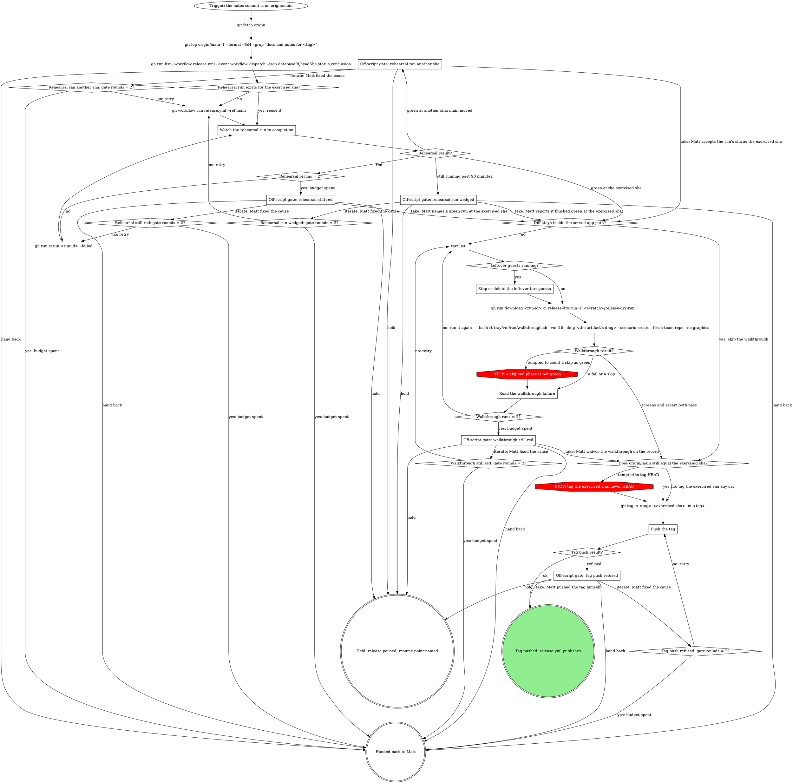

# rt release: prove and tag

This is a stage of the rt:release skill; the `How every gate asks` section of its SKILL.md
applies to every gate here.

Rehearse release.yml on the notes commit, walk its artifact through the local clean room, and tag
the commit those runs exercised.

The rehearsal builds, notarizes and clean-rooms exactly as a tag does, but skips the release,
validates the catalog without pushing it and uploads `out/` as the `release-dry-run` artifact. A
tag that fails halfway has already re-signed the app and cost Matt his TCC grants, so the
rehearsal is where defects are cheap. The path fast path: when
`git diff --name-only <last-tag>..<exercised-sha>` stays inside the served-app directories,
`RELEASE_NOTES.md` and `website/`, the tag rests on the rehearsal alone; deck, every tool row,
fast-browser and any rt file keep the walkthrough.

The walkthrough runs only on this machine (GitHub runners cannot nest virtualization), takes
about 25 minutes, and needs the `mattstack-golden-26` image plus: `MATTSTACK_VMTEST_PAT`
(`gh auth token` works for GitHub; `--forge gitlab` needs a GitLab PAT, which the harness exports
as `GITLAB_TOKEN`), `MATTSTACK_VMTEST_ORG=matts-hasura-demo` and
`MATTSTACK_VMTEST_ORG_CONFIRM=matts-hasura-demo` (the README's default org does not exist).
`<scratch>` is this session's scratchpad.

Counters: the first dispatch is not a rerun, so `Rehearsal reruns = 2?` is yes after the second
`gh run rerun <run-id> --failed` has also gone red. `Walkthrough runs = 2?` counts every
walkthrough run, the first included, so it is yes after the second one fails. Every `<origin>: gate rounds = 2?` counts the iterate answers received at that gate: it is yes
once Matt has answered iterate twice.

### Watch the rehearsal run to completion

On the reuse path, the run is the one `gh run list` found with `headSha` equal to the exercised
sha. After a fresh dispatch, take the newest `workflow_dispatch` run created after the dispatch (it
takes a few seconds to list): `gh workflow run release.yml --ref main` runs main's head, so compare
that run's `headSha` with the exercised sha rather than searching for it, since after main moves
no run has it. Poll `gh run view <run-id> --json status,conclusion,headSha` every few minutes in the background;
never a bare `gh run watch --exit-status`, which exits nonzero on a false failure while the run is
still in progress. The rehearsal stamps `<next-patch>-ci<run>`, so read the artifact's actual dmg
filename rather than assuming it. check-bundle asserts `Contents/Helpers/gate-fork.sh` exists and
is executable, so a missing copy fails the rehearsal itself.

### Stop or delete the leftover tart guests

macOS caps concurrent VMs at two, so a leftover guest makes the new one fail boot as "ssh as
tester never came up". Stop or delete each running guest, then run `tart list` again: a closed
job's pane may never have run its cleanup.

### Read the walkthrough failure

Green is the report's `screens` and `assert` phases both `pass`; a `skip` is not green. When
`deck.managed` fails, read `~/.mattstack/deck/logs/agent.log` from the guest-home tarball first:

- no entries at all: the silent no-spawn window (launchd never ran the registered agent, often
  right after the FDA relaunch);
- failed-bind holder lines: the port wedge;
- a fresh "serving" line seconds before the step failed: adopt raced deck's registry bootstrap.

All three are rerun-first during a release, and the evidence goes to the deck boot ticket, not
into ad-hoc guest debugging.

### Push the tag

The tag points at the exercised sha, never bare HEAD: other sessions merge to main mid-release,
and the tag must name the commit the rehearsal and walkthrough ran.

Run `git push origin <tag>` <!-- mcp-lint: allow --> on Bash: git_push refuses main and tags.

The push is the publish: never `gh release create`.

### Off-script gate: rehearsal ran another sha

Quote the run id, its `headSha`, the exercised sha, and the commits between them. A new dispatch
runs main's head again, so iterate clears this only if Matt moves main back; recommend hold or
hand back. Take: Matt accepts the run's sha as the exercised sha, and the tag then points at a sha
the approved notes do not fully describe; say so in the option. Iterate: Matt fixed the cause, and
a new dispatch runs.

### Off-script gate: rehearsal run wedged

Quote the run id, the elapsed time and the step it sits on. Take: Matt reports it finished green
at the exercised sha. Iterate: Matt cancelled or cleared it, and a new dispatch runs.

### Off-script gate: rehearsal still red

Quote the failing job, step and error lines (`gh run view <run-id> --log-failed`). Take: Matt
names a green run at the exercised sha. Iterate: Matt fixed an outside cause, and the failed jobs
rerun. A fix that needs a code change moves main past the notes commit, so recommend hold or hand
back for it, not iterate.

### Off-script gate: walkthrough still red

Quote the report's phase results and what `Read the walkthrough failure` found. Take: Matt waives
the walkthrough; record his words with the answer. Iterate: Matt fixed the cause (an image grant,
the environment), and the walkthrough runs again.

### Off-script gate: tag push refused

Quote git's refusal. Take: Matt pushed the tag himself. Iterate: Matt fixed the cause, and the
push runs again.
