# rt release: publish and finish

This is a stage of the rt:release skill; the `How every gate asks` section of its SKILL.md
applies to every gate here. Every `rt release ...` command here runs on Bash: no `rt release`
leaf is agent-safe, so `rt_verb` refuses them.

Verify what release.yml published, deploy rt.cool, and bring this machine onto the release.

Verify reports rows, not a status; `Verify status?` reads them. Every row ok reads as `released`;
only pending rows (the rest ok) read as `pending`; any stale row reads as `failed run`,
`draft left behind` or `missing assets` by its detail, and a stale row none of those name (a
release marked prerelease, a release body that does not match the committed notes, or
releases/latest resolving another tag past the propagation window) reads as `release state
wrong`. An `error` row (verify could not check,
for example "could not reach gh") takes the `pending, or an error row` edge: verify reruns
through `Verify reruns = 4?`.

```dot
digraph publish_and_finish {
    rankdir=TB;

    "Held: release paused, resume point named" [shape=doublecircle];
    "Handed back to Matt" [shape=doublecircle];
    "Released and this machine updated" [shape=doublecircle style=filled fillcolor=lightgreen];
    "Trigger: the tag is pushed" [shape=ellipse];
    "rt release verify <tag> --json" [shape=plaintext];
    "Verify status?" [shape=diamond];
    "Verify reruns = 4?" [shape=diamond];
    "rt release verify <tag> --json, rerun after the wait" [shape=plaintext];
    "Failure is the asset-upload 500 flake?" [shape=diamond];
    "Publish recoveries = 1?" [shape=diamond];
    "gh release delete <tag>" [shape=plaintext];
    "gh run rerun <run-id> --failed, after the delete" [shape=plaintext];
    "Draft flips = 1?" [shape=diamond];
    "gh release edit <tag> --draft=false" [shape=plaintext];
    "STOP: CI owns the release object; rerun verify instead" [shape=octagon style=filled fillcolor=red fontcolor=white];
    "bash scripts/deploy-docs.sh" [shape=plaintext];
    "Docs deploy result?" [shape=diamond];
    "Docs deploy attempts = 2?" [shape=diamond];
    "bash scripts/deploy-docs.sh, retried once" [shape=plaintext];
    "rt release update-machine --plan" [shape=plaintext];
    "Gate: approve the update-machine legs" [shape=box];
    "Update-machine plan answer?" [shape=diamond];
    "STOP: --yes runs only after Matt approves the plan" [shape=octagon style=filled fillcolor=red fontcolor=white];
    "rt release update-machine --yes" [shape=plaintext];
    "Update-machine summary?" [shape=diamond];
    "STOP: never switch the shared checkout's branch" [shape=octagon style=filled fillcolor=red fontcolor=white];
    "Update-machine runs = 2?" [shape=diamond];
    "Fix what the halted leg names" [shape=box];
    "rt release update-machine --yes, rerun after the fix" [shape=plaintext];
    "Off-script gate: assets missing" [shape=box];
    "Assets missing: gate rounds = 2?" [shape=diamond];
    "Off-script gate: release state wrong after publish" [shape=box];
    "Release state wrong after publish: gate rounds = 2?" [shape=diamond];
    "Off-script gate: publish still pending" [shape=box];
    "Publish still pending: gate rounds = 2?" [shape=diamond];
    "Off-script gate: publish run failed another way" [shape=box];
    "Publish run failed another way: gate rounds = 2?" [shape=diamond];
    "Off-script gate: upload flake persists" [shape=box];
    "Upload flake persists: gate rounds = 2?" [shape=diamond];
    "Off-script gate: draft will not publish" [shape=box];
    "Draft will not publish: gate rounds = 2?" [shape=diamond];
    "Off-script gate: rt.cool setup missing" [shape=box];
    "Rt.cool setup missing: gate rounds = 2?" [shape=diamond];
    "Off-script gate: rt.cool deploy failing" [shape=box];
    "Rt.cool deploy failing: gate rounds = 2?" [shape=diamond];
    "Off-script gate: shared checkout off main" [shape=box];
    "Shared checkout off main: gate rounds = 2?" [shape=diamond];
    "Off-script gate: update-machine leg halted" [shape=box];
    "Update-machine leg halted: gate rounds = 2?" [shape=diamond];

    "Trigger: the tag is pushed" -> "rt release verify <tag> --json";
    "rt release verify <tag> --json" -> "Verify status?";
    "rt release verify <tag> --json, rerun after the wait" -> "Verify status?";
    "Verify status?" -> "bash scripts/deploy-docs.sh" [label="released"];
    "Verify status?" -> "Verify reruns = 4?" [label="pending, or an error row"];
    "Verify status?" -> "Failure is the asset-upload 500 flake?" [label="failed run"];
    "Verify status?" -> "Draft flips = 1?" [label="draft left behind"];
    "Off-script gate: assets missing" -> "rt release verify <tag> --json, rerun after the wait" [label="take: Matt hand-completed them with rt:mattstack-release"];
    "Off-script gate: assets missing" -> "Assets missing: gate rounds = 2?" [label="iterate: Matt fixed the cause"];
    "Off-script gate: assets missing" -> "Held: release paused, resume point named" [label="hold"];
    "Off-script gate: assets missing" -> "Handed back to Matt" [label="hand back"];
    "Assets missing: gate rounds = 2?" -> "rt release verify <tag> --json, rerun after the wait" [label="no: retry"];
    "Assets missing: gate rounds = 2?" -> "Handed back to Matt" [label="yes: budget spent"];
    "Verify status?" -> "Off-script gate: assets missing" [label="missing assets"];
    "Off-script gate: release state wrong after publish" -> "bash scripts/deploy-docs.sh" [label="take: Matt rules the release right as it stands"];
    "Off-script gate: release state wrong after publish" -> "Release state wrong after publish: gate rounds = 2?" [label="iterate: Matt fixed the cause"];
    "Off-script gate: release state wrong after publish" -> "Held: release paused, resume point named" [label="hold"];
    "Off-script gate: release state wrong after publish" -> "Handed back to Matt" [label="hand back"];
    "Release state wrong after publish: gate rounds = 2?" -> "rt release verify <tag> --json, rerun after the wait" [label="no: retry"];
    "Release state wrong after publish: gate rounds = 2?" -> "Handed back to Matt" [label="yes: budget spent"];
    "Verify status?" -> "Off-script gate: release state wrong after publish" [label="release state wrong"];
    "Verify status?" -> "STOP: CI owns the release object; rerun verify instead" [label="tempted to create the release or edit its notes by hand"];
    "STOP: CI owns the release object; rerun verify instead" -> "rt release verify <tag> --json, rerun after the wait";
    "Verify reruns = 4?" -> "rt release verify <tag> --json, rerun after the wait" [label="no"];
    "Off-script gate: publish still pending" -> "bash scripts/deploy-docs.sh" [label="take: Matt confirms the release is live"];
    "Off-script gate: publish still pending" -> "Publish still pending: gate rounds = 2?" [label="iterate: Matt fixed the cause"];
    "Off-script gate: publish still pending" -> "Held: release paused, resume point named" [label="hold"];
    "Off-script gate: publish still pending" -> "Handed back to Matt" [label="hand back"];
    "Publish still pending: gate rounds = 2?" -> "rt release verify <tag> --json, rerun after the wait" [label="no: retry"];
    "Publish still pending: gate rounds = 2?" -> "Handed back to Matt" [label="yes: budget spent"];
    "Verify reruns = 4?" -> "Off-script gate: publish still pending" [label="yes: budget spent"];
    "Failure is the asset-upload 500 flake?" -> "Publish recoveries = 1?" [label="yes"];
    "Off-script gate: publish run failed another way" -> "rt release verify <tag> --json, rerun after the wait" [label="take: Matt recovered the run by hand"];
    "Off-script gate: publish run failed another way" -> "Publish run failed another way: gate rounds = 2?" [label="iterate: Matt fixed the cause"];
    "Off-script gate: publish run failed another way" -> "Held: release paused, resume point named" [label="hold"];
    "Off-script gate: publish run failed another way" -> "Handed back to Matt" [label="hand back"];
    "Publish run failed another way: gate rounds = 2?" -> "rt release verify <tag> --json, rerun after the wait" [label="no: retry"];
    "Publish run failed another way: gate rounds = 2?" -> "Handed back to Matt" [label="yes: budget spent"];
    "Failure is the asset-upload 500 flake?" -> "Off-script gate: publish run failed another way" [label="no: any other failure"];
    "Publish recoveries = 1?" -> "gh release delete <tag>" [label="no"];
    "gh release delete <tag>" -> "gh run rerun <run-id> --failed, after the delete";
    "gh run rerun <run-id> --failed, after the delete" -> "rt release verify <tag> --json, rerun after the wait";
    "Off-script gate: upload flake persists" -> "rt release verify <tag> --json, rerun after the wait" [label="take: Matt hand-completed it with rt:mattstack-release"];
    "Off-script gate: upload flake persists" -> "Upload flake persists: gate rounds = 2?" [label="iterate: Matt fixed the cause"];
    "Off-script gate: upload flake persists" -> "Held: release paused, resume point named" [label="hold"];
    "Off-script gate: upload flake persists" -> "Handed back to Matt" [label="hand back"];
    "Upload flake persists: gate rounds = 2?" -> "gh release delete <tag>" [label="no: retry"];
    "Upload flake persists: gate rounds = 2?" -> "Handed back to Matt" [label="yes: budget spent"];
    "Publish recoveries = 1?" -> "Off-script gate: upload flake persists" [label="yes: budget spent"];
    "Draft flips = 1?" -> "gh release edit <tag> --draft=false" [label="no"];
    "gh release edit <tag> --draft=false" -> "rt release verify <tag> --json, rerun after the wait";
    "Off-script gate: draft will not publish" -> "rt release verify <tag> --json, rerun after the wait" [label="take: Matt published the draft himself"];
    "Off-script gate: draft will not publish" -> "Draft will not publish: gate rounds = 2?" [label="iterate: Matt fixed the cause"];
    "Off-script gate: draft will not publish" -> "Held: release paused, resume point named" [label="hold"];
    "Off-script gate: draft will not publish" -> "Handed back to Matt" [label="hand back"];
    "Draft will not publish: gate rounds = 2?" -> "gh release edit <tag> --draft=false" [label="no: retry"];
    "Draft will not publish: gate rounds = 2?" -> "Handed back to Matt" [label="yes: budget spent"];
    "Draft flips = 1?" -> "Off-script gate: draft will not publish" [label="yes: budget spent"];
    "bash scripts/deploy-docs.sh" -> "Docs deploy result?";
    "bash scripts/deploy-docs.sh, retried once" -> "Docs deploy result?";
    "Docs deploy result?" -> "rt release update-machine --plan" [label="deployed"];
    "Off-script gate: rt.cool setup missing" -> "rt release update-machine --plan" [label="take: Matt deployed rt.cool himself"];
    "Off-script gate: rt.cool setup missing" -> "Rt.cool setup missing: gate rounds = 2?" [label="iterate: Matt fixed the cause"];
    "Off-script gate: rt.cool setup missing" -> "Held: release paused, resume point named" [label="hold"];
    "Off-script gate: rt.cool setup missing" -> "Handed back to Matt" [label="hand back"];
    "Rt.cool setup missing: gate rounds = 2?" -> "bash scripts/deploy-docs.sh" [label="no: retry"];
    "Rt.cool setup missing: gate rounds = 2?" -> "Handed back to Matt" [label="yes: budget spent"];
    "Docs deploy result?" -> "Off-script gate: rt.cool setup missing" [label="setup missing"];
    "Docs deploy result?" -> "Docs deploy attempts = 2?" [label="failed"];
    "Docs deploy attempts = 2?" -> "bash scripts/deploy-docs.sh, retried once" [label="no"];
    "Off-script gate: rt.cool deploy failing" -> "rt release update-machine --plan" [label="take: Matt deployed rt.cool himself"];
    "Off-script gate: rt.cool deploy failing" -> "Rt.cool deploy failing: gate rounds = 2?" [label="iterate: Matt fixed the cause"];
    "Off-script gate: rt.cool deploy failing" -> "Held: release paused, resume point named" [label="hold"];
    "Off-script gate: rt.cool deploy failing" -> "Handed back to Matt" [label="hand back"];
    "Rt.cool deploy failing: gate rounds = 2?" -> "bash scripts/deploy-docs.sh, retried once" [label="no: retry"];
    "Rt.cool deploy failing: gate rounds = 2?" -> "Handed back to Matt" [label="yes: budget spent"];
    "Docs deploy attempts = 2?" -> "Off-script gate: rt.cool deploy failing" [label="yes: budget spent"];
    "rt release update-machine --plan" -> "Gate: approve the update-machine legs";
    "Gate: approve the update-machine legs" -> "Update-machine plan answer?";
    "Update-machine plan answer?" -> "rt release update-machine --yes" [label="approve every leg"];
    "Update-machine plan answer?" -> "Held: release paused, resume point named" [label="hold"];
    "Update-machine plan answer?" -> "Handed back to Matt" [label="hand back: Matt runs it with its own prompts"];
    "Update-machine plan answer?" -> "STOP: --yes runs only after Matt approves the plan" [label="tempted to run --yes before the answer"];
    "STOP: --yes runs only after Matt approves the plan" -> "Gate: approve the update-machine legs";
    "rt release update-machine --yes" -> "Update-machine summary?";
    "rt release update-machine --yes, rerun after the fix" -> "Update-machine summary?";
    "Update-machine summary?" -> "Released and this machine updated" [label="every leg ok and the verify sweep clean"];
    "Off-script gate: shared checkout off main" -> "Released and this machine updated" [label="take: Matt finished the halted legs himself"];
    "Off-script gate: shared checkout off main" -> "Shared checkout off main: gate rounds = 2?" [label="iterate: Matt fixed the cause"];
    "Off-script gate: shared checkout off main" -> "Held: release paused, resume point named" [label="hold"];
    "Off-script gate: shared checkout off main" -> "Handed back to Matt" [label="hand back"];
    "Shared checkout off main: gate rounds = 2?" -> "rt release update-machine --yes, rerun after the fix" [label="no: retry"];
    "Shared checkout off main: gate rounds = 2?" -> "Handed back to Matt" [label="yes: budget spent"];
    "Update-machine summary?" -> "Off-script gate: shared checkout off main" [label="the shared checkout is off main"];
    "Update-machine summary?" -> "STOP: never switch the shared checkout's branch" [label="tempted to switch the shared checkout's branch"];
    "STOP: never switch the shared checkout's branch" -> "Off-script gate: shared checkout off main";
    "Update-machine summary?" -> "Update-machine runs = 2?" [label="any other leg halted"];
    "Update-machine runs = 2?" -> "Fix what the halted leg names" [label="no"];
    "Fix what the halted leg names" -> "rt release update-machine --yes, rerun after the fix";
    "Off-script gate: update-machine leg halted" -> "Released and this machine updated" [label="take: Matt finished the halted legs himself"];
    "Off-script gate: update-machine leg halted" -> "Update-machine leg halted: gate rounds = 2?" [label="iterate: Matt fixed the cause"];
    "Off-script gate: update-machine leg halted" -> "Held: release paused, resume point named" [label="hold"];
    "Off-script gate: update-machine leg halted" -> "Handed back to Matt" [label="hand back"];
    "Update-machine leg halted: gate rounds = 2?" -> "rt release update-machine --yes, rerun after the fix" [label="no: retry"];
    "Update-machine leg halted: gate rounds = 2?" -> "Handed back to Matt" [label="yes: budget spent"];
    "Update-machine runs = 2?" -> "Off-script gate: update-machine leg halted" [label="yes: budget spent"];
    "Update-machine summary?" -> "Off-script gate: update-machine leg halted" [label="a halt only Matt can clear: the #rt announce failed or a sha256 mismatch"];
}
```

Run `rt release verify <tag> --json` in the background: it finds the tag's release.yml run and
watches it for up to about an hour, tolerating transient API errors (`--no-wait` takes one
snapshot instead). It confirms the published body equals the committed `RELEASE_NOTES.md`, all
four assets (`mattstack-<ver>.dmg`, `mattstack-<ver>.zip`, `appcast.xml`, `SHA256SUMS`) are
attached, the release is neither a draft nor a prerelease, and the public releases/latest endpoint
resolves to the tag with the same assets. releases/latest caches and can lag up to about 20
minutes behind the flip; the verb says "still propagating" rather than failing, so wait about five
minutes between pending reruns. The verb never recovers anything; it only names the recovery. The
asset-upload 500 on the large files is the known flake: deleting the release keeps the git tag,
and the failed jobs rerun. The release action creates a draft and flips it public last, so a run
that dies mid-upload leaves a draft that `gh release view` renders exactly like a published
release while the public API and mattstack.dev keep serving the previous tag; completing its
assets by hand does not publish it, the flip does.

Counters: the first `rt release verify <tag> --json` is not a rerun, so `Verify reruns = 4?` is
yes after the fourth rerun. `Publish recoveries = 1?` counts delete-and-rerun pairs done and
`Draft flips = 1?` counts flips done, so each is yes after the first. `Docs deploy attempts = 2?`
counts every deploy run, the first included. `Update-machine runs = 2?` counts every `--yes` run
in this release, the first included. Every `<origin>: gate rounds = 2?` counts the iterate
answers received at that gate: it is yes once Matt has answered iterate twice.

### Gate: approve the update-machine legs

Show the `--plan` output. Say plainly that `--yes` skips every per-leg confirm: the prod app
replace, the dev app replace, and the daemon restart announced in #rt. From Bash there is no TTY,
and without `--yes` the verb refuses outright rather than guess at consent; that refusal is why
this gate comes first, not a reason to pass `--yes` unasked. The legs, in order:

- **Prod app**: downloads the released dmg, checks it against SHA256SUMS (a mismatch aborts before
  anything mounts), replaces `/Applications/mattstack.app` by moving the old one aside, and never
  launches either copy.
- **Dev bundle**: builds in a scratch tree at the released commit, replaces
  `/Applications/mattstack-dev.app` the same way, opens it and waits for a fresh pid.
- **Shared checkout sync**: the shared `~/Documents/GitHub/mattstack` checkout (or the older
  `~/Documents/GitHub/repo-tools` folder on a machine that has not moved it); refuses unless it is
  on main, then fast-forwards it and runs a frozen install.
- **Daemon**: announces in #rt first, retrying for up to 30 seconds while the daemon comes back from
  the dev app's relaunch, and refuses to restart if the announce never lands, then checks
  the daemon's `sourceRev` against the released commit (a prod daemon's null `sourceRev` counts as
  a mismatch).
- **Served suite**: re-registers board, console, chat, boxscore and deck from the shared checkout,
  restarts deck's managed apps and restarts stragglers; user-managed rows are left alone.
- **Verify**: a read-only sweep of all of the above.

A leg that ends aborted or in error halts every later state-changing leg; the verify sweep still
runs and the summary names the leg that halted. `--verify-only` runs the sweep alone (refused
with `--plan`). Hand back means Matt runs the verb on a terminal and answers each leg's prompt
himself; declining a prompt skips only that leg.

### Fix what the halted leg names

Only transient halts are fixed here: a download that failed, or a deck-managed app that did not
come back after the restart. Confirm the cause is gone, then rerun. Read the daemon's state with
`rt_verb {args: ["daemon", "status"]}`. Never restart the daemon, post the #rt announce, or pull
or switch the shared checkout by hand: the legs own those moves, and the halts only Matt can clear
have their own edges.

### Off-script gate: assets missing

Quote verify's asset rows. Take: Matt hand-completed them with `rt:mattstack-release` (zip
re-derive, appcast re-sign, draft flip). Iterate: Matt fixed the cause, and verify runs again.

### Off-script gate: release state wrong after publish

Quote verify's stale rows and their details: `release state` marked prerelease, `release notes`
not matching the committed `RELEASE_NOTES.md`, or `releases/latest` still resolving another tag
after the propagation window. CI owns the release object, so never flip the prerelease flag or
edit the notes yourself; a wrong notes body is fixed only by a new tag. Take: Matt rules the
release right as it stands, and rt.cool deploys. Iterate: Matt fixed the cause, and verify runs
again, counted by `Release state wrong after publish: gate rounds = 2?`.

### Off-script gate: publish still pending

Quote the rows still pending or in error after four reruns (past the releases/latest lag). Take:
Matt confirms the release is live. Iterate: Matt fixed the cause, and verify runs again.

### Off-script gate: publish run failed another way

Quote the failing job, step and error lines (`gh run view <run-id> --log-failed`). Take: Matt
recovered the run by hand. Iterate: Matt fixed the cause, and verify runs again.

### Off-script gate: upload flake persists

Quote the second failure's upload errors. One delete-and-rerun is the budget. Take: Matt
hand-completed the release with `rt:mattstack-release`. Iterate: Matt fixed the cause, and the
delete-and-rerun runs once more.

### Off-script gate: draft will not publish

Quote the flip's output and the release's draft state (`gh release view <tag> --json isDraft`).
Take: Matt published the draft himself. Iterate: Matt fixed the cause, and the flip runs again.

### Off-script gate: rt.cool setup missing

`scripts/deploy-docs.sh` builds the site and deploys it to Cloudflare Pages through wrangler. It
needs wrangler auth (`wrangler login` or `CLOUDFLARE_API_TOKEN`) and the Pages project pointed at
rt.cool's DNS, both one-time setup described in the script's header. Quote what is missing and
give Matt those steps; never log in for him. Take: Matt deployed rt.cool himself. Iterate: Matt
did the setup, and the deploy runs again.

### Off-script gate: rt.cool deploy failing

Quote the failing output of both attempts. Take: Matt deployed rt.cool himself. Iterate: Matt
fixed the cause, and the deploy runs again.

### Off-script gate: shared checkout off main

The shared checkout (`~/Documents/GitHub/mattstack`, or the older `~/Documents/GitHub/repo-tools`
folder on a machine that has not moved it) is shared with other sessions, and the branch it sits
on is the dev daemon's deployed code, so it is not always on main. Quote the leg's refusal and the
branch it names. Take: Matt finished the halted legs himself. Iterate: Matt put it on main, and
update-machine runs again.

### Off-script gate: update-machine leg halted

Quote the summary's halted leg and its detail (the failed #rt announce, a sha256 mismatch, or a
leg still halting after the fix). Take: Matt finished the halted legs himself. Iterate: Matt fixed
the cause, and update-machine runs again.
