# rt sdm connect (agent orchestration)

Connect the user to a StrongDM-backed database environment. rt owns the
mechanics (app launch, login flow, access request, tunnel, verification);
this skill owns the order, the matching and the human questions. Every `rt
sdm` verb runs in Bash (none is on `rt_verb`); all are non-interactive and
need no TTY.

Never invent values: durations come from the envelope's `durations` list,
the reason comes from `defaultReason`, and production needs the user's yes
to the production question itself.

## The process

```dot
digraph sdm_connect {
    rankdir=TB;

    "Trigger: the user asks for sdm access to an environment" [shape=ellipse];
    "rt sdm status --json" [shape=plaintext];
    "sdm status health?" [shape=diamond];
    "STOP: a missing sdm CLI is the user's install; relay rt's message" [shape=octagon style=filled fillcolor=red fontcolor=white];
    "STOP: a status error goes on to rt sdm connections, never the sdm CLI" [shape=octagon style=filled fillcolor=red fontcolor=white];
    "rt sdm login (preflight, timeout at least 240s)" [shape=plaintext];
    "Preflight login result?" [shape=diamond];
    "rt sdm connections --json" [shape=plaintext];
    "Connections envelope ok?" [shape=diamond];
    "STOP: connections come from rt sdm connections, never the sdm CLI" [shape=octagon style=filled fillcolor=red fontcolor=white];
    "Connections listed twice already?" [shape=diamond];
    "Match the request against label, tier and key" [shape=box];
    "How many plausible matches?" [shape=diamond];
    "Several matches: attended session?" [shape=diamond];
    "AskUserQuestion {questions}: which of the matches" [shape=plaintext];
    "gate_ask {questions, context}: which of the matches" [shape=plaintext];
    "Pick among the matches?" [shape=diamond];
    "No match: attended session?" [shape=diamond];
    "AskUserQuestion {questions}: which of all the labels" [shape=plaintext];
    "gate_ask {questions, context}: which of all the labels" [shape=plaintext];
    "Pick from the full list?" [shape=diamond];
    "Chosen connection already live and no reconnect asked?" [shape=diamond];
    "Chosen connection is production?" [shape=diamond];
    "STOP: confirm production only on the user's yes to that question" [shape=octagon style=filled fillcolor=red fontcolor=white];
    "Production: attended session?" [shape=diamond];
    "AskUserQuestion {questions}: this is production, connect?" [shape=plaintext];
    "gate_ask {questions, context}: this is production, connect?" [shape=plaintext];
    "Production answer?" [shape=diamond];
    "rt sdm connect <key> --json" [shape=plaintext];
    "rt sdm connect <key> --confirm-production --json" [shape=plaintext];
    "rt sdm connect exit?" [shape=diamond];
    "Connect attempts = 2?" [shape=diamond];
    "Asked the production question for this key already?" [shape=diamond];
    "rt sdm login (session expired mid-connect)" [shape=plaintext];
    "Mid-connect login result?" [shape=diamond];
    "Production yes already given for this key?" [shape=diamond];
    "STOP: a failed connect is relayed, never dug into with the sdm CLI" [shape=octagon style=filled fillcolor=red fontcolor=white];
    "Report the tunnel" [shape=box];
    "Hand off: the user runs the manual login in a terminal" [shape=doublecircle];
    "Not connected: the sdm CLI is missing, install message relayed" [shape=doublecircle];
    "Not connected: error and hint relayed" [shape=doublecircle];
    "Not connected: the user declined or chose none" [shape=doublecircle];
    "Tunnel reported" [shape=doublecircle style=filled fillcolor=lightgreen];

    "Trigger: the user asks for sdm access to an environment" -> "rt sdm status --json";
    "rt sdm status --json" -> "sdm status health?";
    "sdm status health?" -> "rt sdm connections --json" [label="ok and authenticated"];
    "sdm status health?" -> "rt sdm login (preflight, timeout at least 240s)" [label="not-authenticated"];
    "sdm status health?" -> "Not connected: the sdm CLI is missing, install message relayed" [label="not-installed"];
    "sdm status health?" -> "rt sdm connections --json" [label="error: go on, connect launches the app"];
    "sdm status health?" -> "STOP: a missing sdm CLI is the user's install; relay rt's message" [label="tempted to install or probe sdm yourself (not-installed)"];
    "sdm status health?" -> "STOP: a status error goes on to rt sdm connections, never the sdm CLI" [label="tempted to probe the error with the sdm CLI"];
    "STOP: a missing sdm CLI is the user's install; relay rt's message" -> "Not connected: the sdm CLI is missing, install message relayed";
    "STOP: a status error goes on to rt sdm connections, never the sdm CLI" -> "rt sdm connections --json";
    "rt sdm login (preflight, timeout at least 240s)" -> "Preflight login result?";
    "Preflight login result?" -> "rt sdm connections --json" [label="exit 0"];
    "Preflight login result?" -> "Hand off: the user runs the manual login in a terminal" [label="non-zero, names the manual login"];
    "Preflight login result?" -> "Not connected: error and hint relayed" [label="non-zero, anything else"];
    "rt sdm connections --json" -> "Connections envelope ok?";
    "Connections envelope ok?" -> "Match the request against label, tier and key" [label="ok: true"];
    "Connections envelope ok?" -> "Connections listed twice already?" [label="ok: false"];
    "Connections envelope ok?" -> "STOP: connections come from rt sdm connections, never the sdm CLI" [label="tempted to list them with the sdm CLI"];
    "STOP: connections come from rt sdm connections, never the sdm CLI" -> "Connections listed twice already?";
    "Connections listed twice already?" -> "rt sdm connections --json" [label="no: retry once"];
    "Connections listed twice already?" -> "Not connected: error and hint relayed" [label="yes: budget spent"];
    "Match the request against label, tier and key" -> "How many plausible matches?";
    "How many plausible matches?" -> "Chosen connection already live and no reconnect asked?" [label="exactly one"];
    "How many plausible matches?" -> "Several matches: attended session?" [label="several"];
    "How many plausible matches?" -> "No match: attended session?" [label="none"];
    "Several matches: attended session?" -> "AskUserQuestion {questions}: which of the matches" [label="yes"];
    "Several matches: attended session?" -> "gate_ask {questions, context}: which of the matches" [label="no: unattended pane"];
    "AskUserQuestion {questions}: which of the matches" -> "Pick among the matches?";
    "gate_ask {questions, context}: which of the matches" -> "Pick among the matches?";
    "Pick among the matches?" -> "Chosen connection already live and no reconnect asked?" [label="a connection"];
    "Pick among the matches?" -> "Not connected: the user declined or chose none" [label="none of them"];
    "No match: attended session?" -> "AskUserQuestion {questions}: which of all the labels" [label="yes"];
    "No match: attended session?" -> "gate_ask {questions, context}: which of all the labels" [label="no: unattended pane"];
    "AskUserQuestion {questions}: which of all the labels" -> "Pick from the full list?";
    "gate_ask {questions, context}: which of all the labels" -> "Pick from the full list?";
    "Pick from the full list?" -> "Chosen connection already live and no reconnect asked?" [label="a connection"];
    "Pick from the full list?" -> "Not connected: the user declined or chose none" [label="none of them"];
    "Chosen connection already live and no reconnect asked?" -> "Report the tunnel" [label="yes: connected is true"];
    "Chosen connection already live and no reconnect asked?" -> "Chosen connection is production?" [label="no"];
    "Chosen connection is production?" -> "rt sdm connect <key> --json" [label="no"];
    "Chosen connection is production?" -> "Production: attended session?" [label="yes"];
    "Chosen connection is production?" -> "STOP: confirm production only on the user's yes to that question" [label="tempted to confirm production on an earlier blanket yes"];
    "STOP: confirm production only on the user's yes to that question" -> "Production: attended session?";
    "Production: attended session?" -> "AskUserQuestion {questions}: this is production, connect?" [label="yes"];
    "Production: attended session?" -> "gate_ask {questions, context}: this is production, connect?" [label="no: unattended pane"];
    "AskUserQuestion {questions}: this is production, connect?" -> "Production answer?";
    "gate_ask {questions, context}: this is production, connect?" -> "Production answer?";
    "Production answer?" -> "rt sdm connect <key> --confirm-production --json" [label="a clear yes"];
    "Production answer?" -> "Not connected: the user declined or chose none" [label="anything else"];
    "rt sdm connect <key> --json" -> "rt sdm connect exit?";
    "rt sdm connect <key> --confirm-production --json" -> "rt sdm connect exit?";
    "rt sdm connect exit?" -> "Report the tunnel" [label="0"];
    "rt sdm connect exit?" -> "Connect attempts = 2?" [label="1, stage login"];
    "rt sdm connect exit?" -> "Asked the production question for this key already?" [label="1, stage confirm"];
    "rt sdm connect exit?" -> "Not connected: error and hint relayed" [label="1, any other stage"];
    "rt sdm connect exit?" -> "STOP: a failed connect is relayed, never dug into with the sdm CLI" [label="tempted to dig with the sdm CLI"];
    "STOP: a failed connect is relayed, never dug into with the sdm CLI" -> "Not connected: error and hint relayed";
    "Asked the production question for this key already?" -> "Production: attended session?" [label="no"];
    "Asked the production question for this key already?" -> "Not connected: error and hint relayed" [label="yes: budget spent"];
    "Connect attempts = 2?" -> "rt sdm login (session expired mid-connect)" [label="no: log in once more"];
    "Connect attempts = 2?" -> "Not connected: error and hint relayed" [label="yes: budget spent"];
    "rt sdm login (session expired mid-connect)" -> "Mid-connect login result?";
    "Mid-connect login result?" -> "Production yes already given for this key?" [label="exit 0"];
    "Mid-connect login result?" -> "Hand off: the user runs the manual login in a terminal" [label="non-zero, names the manual login"];
    "Mid-connect login result?" -> "Not connected: error and hint relayed" [label="non-zero, anything else"];
    "Production yes already given for this key?" -> "rt sdm connect <key> --confirm-production --json" [label="yes"];
    "Production yes already given for this key?" -> "rt sdm connect <key> --json" [label="no"];
    "Report the tunnel" -> "Tunnel reported";
}
```

An **attended** session has a human at this pane's prompt: ask with
`AskUserQuestion`. A pane that a herd, a board or a pipeline launched is
unattended: ask with `gate_ask {questions, context}` and act only on the
recorded answer. When `gate_ask` returns `presentation: wait`, run
`rt gate wait <id>` as a background Bash command and end the turn.

### Match the request against label, tier and key

"staging" matches a connection whose `tier` or `label` says staging; a
named database matches on `label` or `key`. Count a connection as plausible
only when a reasonable person would accept it for the words the user used.
Two plausible connections are two environments: never pick one because the
user is in a hurry.

### Several matches: attended session?

One question, the four closest matches as options, each labelled with the
connection's `label` and described by its `tier` and `key`; name any
further matches in the question text instead of adding more options.

### No match: attended session?

One question listing every `label` from the connections envelope (the four
closest as options; the rest named in the question text). Say which words
of the request matched nothing.

### Production: attended session?

Ask "This is production: <label>. Connect?" with Connect and Do not connect
as the options. Only a yes to this question counts: an earlier "yes to
whatever it asks" was given before the user knew the target was production.
`Production yes already given for this key?` is yes only when this question
was answered yes for this same key in this conversation.

### Report the tunnel

From the success envelope (or the connections row when a tunnel was
already live), tell the user: the label they asked for, `address`, `url`,
`database` and `schema`, and whether the tunnel was `verified`. With
`verified: false`, say the tunnel is up but the test query did not confirm,
and suggest retrying their query. Never paste the whole envelope.

## Call notes

- JSON is on stdout; progress lines are on stderr. Parse stdout only.
- `rt sdm login` is a silent browser flow. It usually finishes in seconds,
  but a cold or MFA session escalates to a visible Chrome window and can
  take about 3 minutes: run it with a timeout of at least 240s and tell the
  user a browser window may appear. When it exits non-zero naming the
  manual login, give the user that exact command to run in a terminal; the
  SAML hop is theirs.
- `health: "error"` with `appRunning: false` is fine: connect launches the
  desktop app itself and waits for it.
- `rt sdm connect` defaults to 8h and the enrichment-authored reason: omit
  `--duration` and `--reason`. Pass `--duration` only when the user asked
  for one, and only a value from the envelope's `durations`.
- `connected: true` in the connections envelope means a tunnel is already
  live at `address`: report it instead of reconnecting, unless the user
  asked to reconnect.
- These verbs are rt's stable agent surface. A field that seems missing is
  a fix in rt, never an ad-hoc sdm CLI call.

## Rationalizations

| Thought | Reality |
| --- | --- |
| "They said yes to whatever it asks." | That yes predates knowing it was production. Ask the production question. |
| "The sdm CLI would show more detail." | Relay rt's `error` and `hint`; a missing field is an rt fix. |
| "One more login might do it." | `Connect attempts = 2?` is the budget. Relay and stop. |
| "They are in a hurry; staging API is obviously the one." | Two plausible matches are two environments. Ask. |
| "brew can install sdm." | A missing CLI is the user's install. Relay rt's message. |
