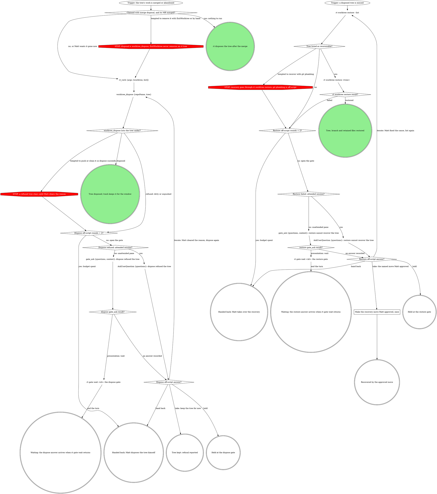

# rt worktree

rt owns the worktree lifecycle in registered repos: it names trees, places
them, registers them with the daemon, and cleans them up. In a repo rt's
worktree list knows, never hand-roll a tree: an unregistered tree gets none
of the guarded disposal, freshening, or auto-cleanup.

Two graphs: starting work in a tree, and finishing or recovering one.

An **attended** session has a human at this pane's prompt: ask with
`AskUserQuestion`. A pane that a herd, a board or a pipeline launched is
unattended: ask with `gate_ask {questions, context}` and act only on the
recorded answer. When `gate_ask` returns `presentation: wait`, run
`rt gate wait <id>` as a background Bash command and end the turn. Every
gate below offers the same four answers: **take** (the move the gate
proposes), **iterate** (Matt fixed the cause; try the same call again),
**hold** (end the turn, nothing moved) and **hand back** (Matt takes it
from here). Each gate's rounds counter sits in front of it, so every
reopening counts; the retry counters are never reset, so a second refusal
comes straight back to the gate.

## Start work

```dot
digraph rt_worktree_start {
    rankdir=TB;

    "Trigger: work needs an isolated tree in a repo rt manages" [shape=ellipse];
    "Task's repo is the session's repo?" [shape=diamond];
    "rt pane send self --text \"/cd <repo>\" --then \"Continue: <the next step>\"" [shape=plaintext];
    "pane send result?" [shape=diamond];
    "Cross-repo off-script rounds = 2?" [shape=diamond];
    "Cross-repo /cd: attended session?" [shape=diamond];
    "AskUserQuestion {questions}: run the /cd for me" [shape=plaintext];
    "gate_ask {questions, context}: run the /cd for me" [shape=plaintext];
    "cross-repo gate_ask result?" [shape=diamond];
    "rt gate wait <id>: the cross-repo gate" [shape=plaintext];
    "Waiting: the cross-repo answer arrives when rt gate wait returns" [shape=doublecircle];
    "Cross-repo off-script answer?" [shape=diamond];
    "rt worktree hook status --json" [shape=plaintext];
    "Hook installed, and no path needed before entering?" [shape=diamond];
    "EnterWorktree {name: <ticket or topic>}" [shape=plaintext];
    "EnterWorktree by name result?" [shape=diamond];
    "ExitWorktree {action: keep}" [shape=plaintext];
    "Provision by ticket or by branch?" [shape=diamond];
    "worktree_provision {repoName, ticket, ticketTitle}" [shape=plaintext];
    "worktree_provision {repoName, branch}" [shape=plaintext];
    "worktree_provision {repoName, branch}: the repo or branch Matt named" [shape=plaintext];
    "worktree_provision result?" [shape=diamond];
    "Provision attempts = 2?" [shape=diamond];
    "STOP: a refused provision is off-script; never hand-roll the tree" [shape=octagon style=filled fillcolor=red fontcolor=white];
    "Provision off-script rounds = 2?" [shape=diamond];
    "Provision refused: attended session?" [shape=diamond];
    "AskUserQuestion {questions}: provision refused" [shape=plaintext];
    "gate_ask {questions, context}: provision refused" [shape=plaintext];
    "provision gate_ask result?" [shape=diamond];
    "rt gate wait <id>: the provision gate" [shape=plaintext];
    "Waiting: the provision answer arrives when rt gate wait returns" [shape=doublecircle];
    "Provision off-script answer?" [shape=diamond];
    "EnterWorktree {path: <the result's path>}" [shape=plaintext];
    "EnterWorktree by path result?" [shape=diamond];
    "STOP: move into a tree only with EnterWorktree" [shape=octagon style=filled fillcolor=red fontcolor=white];
    "Enter-path off-script rounds = 2?" [shape=diamond];
    "Enter by path refused: attended session?" [shape=diamond];
    "AskUserQuestion {questions}: entering the claimed tree was refused" [shape=plaintext];
    "gate_ask {questions, context}: entering the claimed tree was refused" [shape=plaintext];
    "enter-path gate_ask result?" [shape=diamond];
    "rt gate wait <id>: the enter-path gate" [shape=plaintext];
    "Waiting: the enter-path answer arrives when rt gate wait returns" [shape=doublecircle];
    "Enter-path off-script answer?" [shape=diamond];
    "Next command needs dependencies?" [shape=diamond];
    "STOP: dependencies settle through await-ready, never your own install" [shape=octagon style=filled fillcolor=red fontcolor=white];
    "rt_verb {args: [worktree, await-ready, <tree>], cwd: <the tree's path>}" [shape=plaintext];
    "await-ready result?" [shape=diamond];
    "rt_verb {args: [worktree, list]}: is the repo's ready ladder held?" [shape=plaintext];
    "readyHeldRepos names the tree's repo?" [shape=diamond];
    "Surface the held ready steps to Matt" [shape=box];
    "Surface the degraded tree to Matt" [shape=box];
    "Handed off: the Continue line resumes in the right repo" [shape=doublecircle];
    "Handed off: Matt runs the /cd; his next message resumes at hook status" [shape=doublecircle];
    "Held at the cross-repo gate" [shape=doublecircle];
    "Handed back: Matt starts the work in the other repo" [shape=doublecircle];
    "Held at the provision gate" [shape=doublecircle];
    "Handed back: Matt takes over provisioning" [shape=doublecircle];
    "Handed off: Matt moves the session into the claimed tree" [shape=doublecircle];
    "Held at the enter-path gate, naming the claimed tree" [shape=doublecircle];
    "Handed back: Matt takes over the claimed tree, named" [shape=doublecircle];
    "Held: Matt approves the ready steps" [shape=doublecircle];
    "Held: the tree is degraded" [shape=doublecircle];
    "In the tree; await-ready before the first dependency command" [shape=doublecircle style=filled fillcolor=lightgreen];
    "In a ready tree" [shape=doublecircle style=filled fillcolor=lightgreen];

    "Trigger: work needs an isolated tree in a repo rt manages" -> "Task's repo is the session's repo?";
    "Task's repo is the session's repo?" -> "rt worktree hook status --json" [label="yes"];
    "Task's repo is the session's repo?" -> "rt pane send self --text \"/cd <repo>\" --then \"Continue: <the next step>\"" [label="no"];
    "rt pane send self --text \"/cd <repo>\" --then \"Continue: <the next step>\"" -> "pane send result?";
    "pane send result?" -> "Handed off: the Continue line resumes in the right repo" [label="accepted or queued: end the turn"];
    "pane send result?" -> "Cross-repo off-script rounds = 2?" [label="not a herdr pane, or refused"];
    "Cross-repo off-script rounds = 2?" -> "Cross-repo /cd: attended session?" [label="no: open the gate"];
    "Cross-repo off-script rounds = 2?" -> "Handed back: Matt starts the work in the other repo" [label="yes: budget spent"];
    "Cross-repo /cd: attended session?" -> "AskUserQuestion {questions}: run the /cd for me" [label="yes"];
    "Cross-repo /cd: attended session?" -> "gate_ask {questions, context}: run the /cd for me" [label="no: unattended pane"];
    "AskUserQuestion {questions}: run the /cd for me" -> "Cross-repo off-script answer?";
    "gate_ask {questions, context}: run the /cd for me" -> "cross-repo gate_ask result?";
    "cross-repo gate_ask result?" -> "Cross-repo off-script answer?" [label="an answer recorded"];
    "cross-repo gate_ask result?" -> "rt gate wait <id>: the cross-repo gate" [label="presentation: wait"];
    "rt gate wait <id>: the cross-repo gate" -> "Waiting: the cross-repo answer arrives when rt gate wait returns" [label="end the turn"];
    "Cross-repo off-script answer?" -> "Handed off: Matt runs the /cd; his next message resumes at hook status" [label="take: Matt runs the /cd; end the turn"];
    "Cross-repo off-script answer?" -> "rt pane send self --text \"/cd <repo>\" --then \"Continue: <the next step>\"" [label="iterate: Matt fixed the pane, send again"];
    "Cross-repo off-script answer?" -> "Held at the cross-repo gate" [label="hold"];
    "Cross-repo off-script answer?" -> "Handed back: Matt starts the work in the other repo" [label="hand back"];
    "rt worktree hook status --json" -> "Hook installed, and no path needed before entering?";
    "Hook installed, and no path needed before entering?" -> "EnterWorktree {name: <ticket or topic>}" [label="yes"];
    "Hook installed, and no path needed before entering?" -> "Provision by ticket or by branch?" [label="no"];
    "EnterWorktree {name: <ticket or topic>}" -> "EnterWorktree by name result?";
    "EnterWorktree by name result?" -> "Next command needs dependencies?" [label="entered an rt tree"];
    "EnterWorktree by name result?" -> "Provision by ticket or by branch?" [label="refused"];
    "EnterWorktree by name result?" -> "ExitWorktree {action: keep}" [label="entered a stock .claude/worktrees tree"];
    "ExitWorktree {action: keep}" -> "Provision by ticket or by branch?";
    "Provision by ticket or by branch?" -> "worktree_provision {repoName, ticket, ticketTitle}" [label="ticket"];
    "Provision by ticket or by branch?" -> "worktree_provision {repoName, branch}" [label="branch"];
    "worktree_provision {repoName, ticket, ticketTitle}" -> "worktree_provision result?";
    "worktree_provision {repoName, branch}" -> "worktree_provision result?";
    "worktree_provision {repoName, branch}: the repo or branch Matt named" -> "worktree_provision result?";
    "worktree_provision result?" -> "EnterWorktree {path: <the result's path>}" [label="a path, readyHeld or not"];
    "worktree_provision result?" -> "Provision attempts = 2?" [label="an error"];
    "worktree_provision result?" -> "STOP: a refused provision is off-script; never hand-roll the tree" [label="tempted to hand-roll the tree with git"];
    "STOP: a refused provision is off-script; never hand-roll the tree" -> "Provision off-script rounds = 2?";
    "Provision attempts = 2?" -> "Provision by ticket or by branch?" [label="no: retry once"];
    "Provision attempts = 2?" -> "Provision off-script rounds = 2?" [label="yes: budget spent"];
    "Provision off-script rounds = 2?" -> "Provision refused: attended session?" [label="no: open the gate"];
    "Provision off-script rounds = 2?" -> "Handed back: Matt takes over provisioning" [label="yes: budget spent"];
    "Provision refused: attended session?" -> "AskUserQuestion {questions}: provision refused" [label="yes"];
    "Provision refused: attended session?" -> "gate_ask {questions, context}: provision refused" [label="no: unattended pane"];
    "AskUserQuestion {questions}: provision refused" -> "Provision off-script answer?";
    "gate_ask {questions, context}: provision refused" -> "provision gate_ask result?";
    "provision gate_ask result?" -> "Provision off-script answer?" [label="an answer recorded"];
    "provision gate_ask result?" -> "rt gate wait <id>: the provision gate" [label="presentation: wait"];
    "rt gate wait <id>: the provision gate" -> "Waiting: the provision answer arrives when rt gate wait returns" [label="end the turn"];
    "Provision off-script answer?" -> "worktree_provision {repoName, branch}: the repo or branch Matt named" [label="take: provision what Matt named"];
    "Provision off-script answer?" -> "Provision by ticket or by branch?" [label="iterate: Matt fixed the cause, retry"];
    "Provision off-script answer?" -> "Held at the provision gate" [label="hold"];
    "Provision off-script answer?" -> "Handed back: Matt takes over provisioning" [label="hand back"];
    "EnterWorktree {path: <the result's path>}" -> "EnterWorktree by path result?";
    "EnterWorktree by path result?" -> "Next command needs dependencies?" [label="entered"];
    "EnterWorktree by path result?" -> "Enter-path off-script rounds = 2?" [label="prompt denied or refused"];
    "EnterWorktree by path result?" -> "STOP: move into a tree only with EnterWorktree" [label="tempted to change into the tree from Bash"];
    "STOP: move into a tree only with EnterWorktree" -> "Enter-path off-script rounds = 2?";
    "Enter-path off-script rounds = 2?" -> "Enter by path refused: attended session?" [label="no: open the gate"];
    "Enter-path off-script rounds = 2?" -> "Handed back: Matt takes over the claimed tree, named" [label="yes: budget spent"];
    "Enter by path refused: attended session?" -> "AskUserQuestion {questions}: entering the claimed tree was refused" [label="yes"];
    "Enter by path refused: attended session?" -> "gate_ask {questions, context}: entering the claimed tree was refused" [label="no: unattended pane"];
    "AskUserQuestion {questions}: entering the claimed tree was refused" -> "Enter-path off-script answer?";
    "gate_ask {questions, context}: entering the claimed tree was refused" -> "enter-path gate_ask result?";
    "enter-path gate_ask result?" -> "Enter-path off-script answer?" [label="an answer recorded"];
    "enter-path gate_ask result?" -> "rt gate wait <id>: the enter-path gate" [label="presentation: wait"];
    "rt gate wait <id>: the enter-path gate" -> "Waiting: the enter-path answer arrives when rt gate wait returns" [label="end the turn"];
    "Enter-path off-script answer?" -> "Handed off: Matt moves the session into the claimed tree" [label="take: Matt runs the /cd to the tree; end the turn"];
    "Enter-path off-script answer?" -> "EnterWorktree {path: <the result's path>}" [label="iterate: Matt will approve the prompt, enter again"];
    "Enter-path off-script answer?" -> "Held at the enter-path gate, naming the claimed tree" [label="hold"];
    "Enter-path off-script answer?" -> "Handed back: Matt takes over the claimed tree, named" [label="hand back"];
    "Next command needs dependencies?" -> "rt_verb {args: [worktree, await-ready, <tree>], cwd: <the tree's path>}" [label="yes: tests, typecheck, a dev server"];
    "Next command needs dependencies?" -> "In the tree; await-ready before the first dependency command" [label="not yet"];
    "Next command needs dependencies?" -> "STOP: dependencies settle through await-ready, never your own install" [label="tempted to run the install yourself"];
    "STOP: dependencies settle through await-ready, never your own install" -> "rt_verb {args: [worktree, await-ready, <tree>], cwd: <the tree's path>}";
    "rt_verb {args: [worktree, await-ready, <tree>], cwd: <the tree's path>}" -> "await-ready result?";
    "await-ready result?" -> "rt_verb {args: [worktree, list]}: is the repo's ready ladder held?" [label="ready: true"];
    "await-ready result?" -> "Surface the degraded tree to Matt" [label="ready: false (a failedStep, or steps that never settled)"];
    "rt_verb {args: [worktree, list]}: is the repo's ready ladder held?" -> "readyHeldRepos names the tree's repo?";
    "readyHeldRepos names the tree's repo?" -> "In a ready tree" [label="no"];
    "readyHeldRepos names the tree's repo?" -> "Surface the held ready steps to Matt" [label="yes"];
    "Surface the held ready steps to Matt" -> "Held: Matt approves the ready steps";
    "Surface the degraded tree to Matt" -> "Held: the tree is degraded";
}
```



### Cross-repo /cd: attended session?

`EnterWorktree` cannot leave the repo the session started in, so the
session queues a `/cd` and its next step into its own pane and ends the
turn; the `--then` line arrives as the next message, in the right repo.
Type the call as is:

```bash
rt pane send self --text "/cd <repo>" --then "Continue: <the next step>"
```

When that send is refused or this is not a herdr pane, ask Matt to run
`/cd <repo>` himself. Take: he will. A slash command runs only after the
turn ends, so end it; his next message resumes at `rt worktree hook status
--json` in the task's repo. Iterate: Matt fixed the pane (herdr running,
the pane reachable), so send again. Never `cd` in Bash instead: the
session's permissions and hooks stay bound to the old repo. Rules for
queueing into a pane: `rt:herdr-inject`.

### Hook installed, and no path needed before entering?

`rt worktree hook status --json` reports `installed` (and `binaryExists`):
whether Claude Code's `EnterWorktree` is routed through rt. When it is,
`EnterWorktree` in name mode provisions through rt and moves the session
into the tree, promptless; non-rt repos fall back to stock
`.claude/worktrees`. When the hook is not installed, or a path is needed
before entering, provision explicitly and enter the result's `path` by path
mode, which always prompts. When name mode lands in a stock
`.claude/worktrees` tree, the session is inside it: leave it with
`ExitWorktree {action: keep}`, then provision and enter by path.

### Provision by ticket or by branch?

`worktree_provision` claims a tree and returns its path: by ticket
(`{repoName, ticket, ticketTitle}`) or by branch (`{repoName, branch}`).
Repos can opt into a warm pool ("on-deck" trees) that makes claiming
instant; without one, provision creates fresh. `rt worktree create`
pre-warms the pool; it is not how work starts. Provision returns as soon as
the branch is checked out; dependency steps the branch triggers (install,
migrations) keep running in the background, reported as `readyPending`, and
a step that fails surfaces at await-ready. `readyHeld: true` rides beside
the path: enter the tree anyway, and note in the pane that the team's ready
steps wait on approval.

### Provision refused: attended session?

Quote the refusal. Take: provision the repo or branch Matt names instead
(`worktree_provision {repoName, branch}`), never a hand-rolled tree. Iterate:
Matt fixed the cause (the daemon, the registration), so provision the same
ticket or branch again.

### Enter by path refused: attended session?

The tree is already claimed on its branch, so provisioning it again is
refused (`branch-attached:<tree>`); this gate is about entering it. Quote
the refusal and name the tree and its path. Take: Matt moves the session in
himself with `/cd <the tree's path>`; end the turn, and his next message
resumes at the dependency check. Iterate: Matt will approve the prompt, so
enter by path again. Hold and hand back name the claimed tree and its path,
so it is never orphaned.

### Next command needs dependencies?

Never run the tree's install yourself. A pool tree is warm for the default
branch, so its `node_modules` can genuinely be wrong for your branch; the
background step is already fixing that in the same directory, and a
hand-run install races it. Before the first command that needs
dependencies (tests, typecheck, a dev server), call await-ready with `cwd`
set to the tree's path: the server's own cwd is fixed at session start and
does not resolve the right repo otherwise. It joins the running step,
returns `{ready, readyAt, failedStep?}` when it settles, and never hangs.
Never poll the worktree list for readiness.

### Surface the held ready steps to Matt

The list's `readyHeldRepos` names a repo whose team-authored `ready` steps
are held pending approval, so await-ready's `ready: true` covers only the
steps that ran. Only a human clears that: tell Matt to run `rt worktree
ready-approve <repo>`, and do not work around it.

### Surface the degraded tree to Matt

Quote await-ready's `failedStep`; `ready: false` with none means the steps
never settled. Do not repair the tree with an install; Matt decides.

## Finish or recover



Trees claimed with the default `merge` disposal auto-dispose after their MR
merges, so cleanup usually needs no command. `worktree_dispose` is the
manual path, and it is soft: the tree stays in trash for a window. It does
not error on a dirty or unpushed tree; read the result's `disposed` and
`refused` lists. `ExitWorktree` never removes an rt tree.

### Dispose refused: attended session?

Quote the refused reason (dirty, unpushed). Take: keep the tree for now.
Iterate: Matt cleared the reason himself (committed, pushed or discarded),
so dispose again. Never push, commit or clean the tree yourself so that
dispose succeeds; that is the choice this gate hands to Matt.

### Restore failed: attended session?

`rt worktree restore --list` shows what is recoverable, and `rt worktree
restore <tree>` rebuilds the tree, its branch and its retained untracked
files. Both default to the current directory's repo; pass `--repo <repo>`
for a tree from another repo. Reach for them before any git plumbing. When the tree is not listed
or the restore fails, quote what rt said and propose one named recovery
move (for example, a branch from a named reflog entry). Take: Matt approves
that move. Iterate: Matt fixed the cause, so list again.

### Make the recovery move Matt approved, once

Run exactly the move Matt approved, once, and report what it recovered. A
second move is a new gate.

## Reference

- `rt worktree --help` lists every verb, and `rt worktree <cmd> --help`
  carries the current flags. The tools' own descriptions and input schemas
  are the reference for the tools.
- `rt_verb` runs only the agent-safe verbs: `worktree list`, `worktree
  triage` and `worktree await-ready`. It appends `--json` itself, so leave
  it out of `args`. `hook status`, `restore`, `create` and `ready-approve`
  run in Bash.
- Pass explicit args: omitted args open pickers in a TTY and exit with
  usage otherwise.
- `rt_verb {args: ["worktree", "list"]}` is ground truth for what exists
  and where. Tree kinds: `main`, `claimed`, `on-deck`, `unmanaged`.

## Rationalizations

| Thought | Reality |
| --- | --- |
| "The daemon is down, so a quick hand-rolled tree unblocks us." | A refused provision is a gate. Take is another repo or branch Matt names, never a hand-rolled tree. |
| "node_modules is stale; one install fixes it." | The background step is fixing it. Call await-ready. |
| "The commits look intentional, so I'll push them and dispose." | A refused dispose is Matt's call. Open the gate. |
| "restore is a worktree verb, so rt_verb runs it." | Only list, triage and await-ready are on `rt_verb`. Restore runs in Bash. |
| "The reflog has it; I'll just check it out." | Plumbing is a named move Matt approves at the restore gate. |
| "ExitWorktree can remove it." | Disposal is `worktree_dispose`. |
| "The path prompt was denied, so I'll change into the tree from Bash." | Entering is `EnterWorktree`. A denied prompt is its own gate. |
