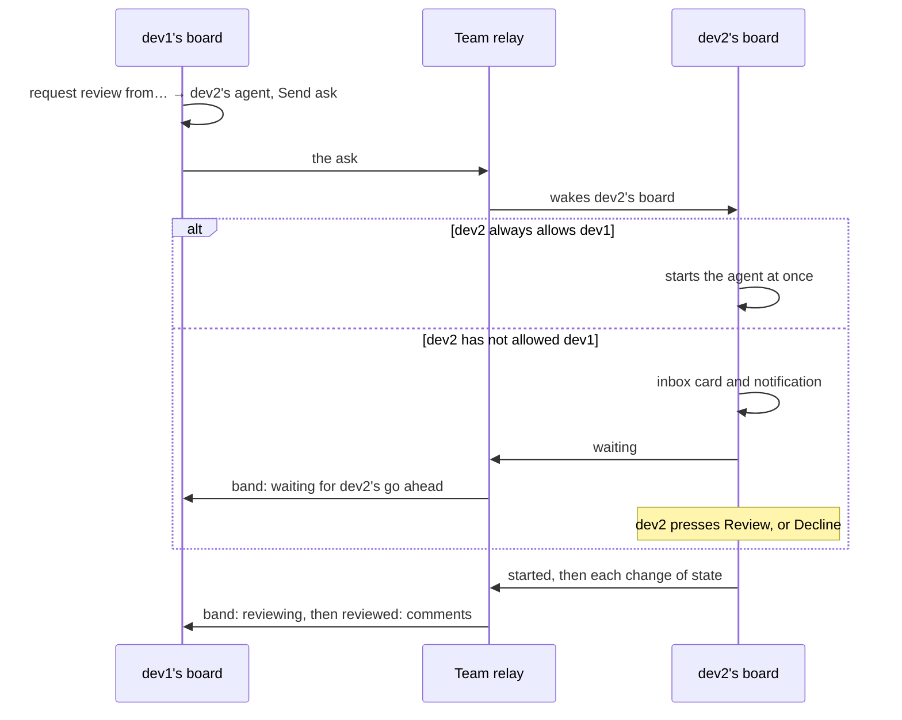

import Screenshot from "@site/src/components/Screenshot";
import BoardIcon from "@site/src/components/BoardIcon";

# board

## What it is

board is one page of your team's open GitLab merge requests that are ready for review, so you can drop a single link in Slack instead of pasting MR URLs. Each row shows a status dot, the title, the branch, one review-state phrase, the diff size, the age and a Linear ticket link when the branch or title carries a ticket id. Merge conflicts and red CI show as their own flag chips, so the phrase always says where the MR sits in review.

<Screenshot name="board/board" alt="board showing the Show chips, the Group and Sort menus, the Team and Needs me tabs, and a list of merge requests" />

## Open it

Open board from the mattstack window, or at `https://board.mattstack`. It is a team app, so it expects you to be in a [team](/start/teams). Turn it on or off with [`rt apps`](/rt/reference/apps).

## What you do in it

**Open or act on an MR.** A click on a row opens the MR in GitLab. Right-click it for [the row menu](#the-row-menu).

**Hand an MR to an agent.** The row menu can start a Claude Code agent in a herdr pane to review someone else's MR, to respond to review on your own, or to fix merge conflicts and red CI. The row shows a live badge while the agent works.

**Run reviews through Slack.** board follows a channel convention: a review request is a message with the MR link, and review state is signalled with three reactions (looking, commented, approved). You can post a request and [set the reactions](#slack-reactions) from a row.

**Ask a teammate's agent.** When teammates run their own boards, your board can ask their agents to work on your MRs, and theirs can ask yours. [Asks between boards](#asks-between-boards) follows an ask from start to finish.

## Three things decide what you see

Most actions depend on three facts about the board you are looking at and the MR you clicked:

- **A local board.** Anything that starts an agent or writes to GitLab or Slack works only on a board opened from this Mac, at its `localhost` or `.mattstack` address. A board opened through a public address shows the same rows, but its menu starts no agents and writes nothing to GitLab or Slack; in their place it shows one greyed row: **agent actions**, "need a local board".
- **Your seat.** The seat is the member the board belongs to, set by `board.defaultMember`. A board set to everyone has no seat, owns no MR, and shows a greyed **author actions** row: "set your seat in board settings to act on your own MRs".
- **Your MR or someone else's.** Respond, doctor, merge, rebase, draft, auto-merge, posting to Slack and asking for reviews are offered only on MRs your seat authored. Reviewing, and asking the author's agent to respond, are offered on everyone else's.

## The row menu

Right-click a row to open its menu. It is titled with the MR's number, and reads top to bottom:

1. **Slack reactions**, a row of three emoji buttons, when the MR's Slack thread is found.
2. **Slack shortcuts**: find the thread, or, on your own MR that is not posted yet, post it.
3. **agent actions**: the agent launches that fit this MR right now.
4. Four flyouts: **all agent actions**, **gitlab**, **slack** and **more**. A flyout with only one item shows that item in place instead.

<Screenshot name="board/row-menu" alt="The right-click menu of an MR, with Slack reactions, agent actions and the all agent actions, gitlab, slack and more flyouts" />

A few behaviors hold across the menu:

- Agent actions carry a bot mark in their lane's color: blue for review, green for respond and orange for doctor.
- A greyed item shows why it cannot run under its label, for example "ask already sent".
- Hold <kbd>Option</kbd> over an agent launch that takes a note and its hint reads "+ note". <kbd>Option</kbd>-click it to type an extra instruction for the agent (up to 2000 characters) before it starts.
- **merge** asks twice: the first click changes its label to "really merge?" and the second merges.
- The Slack reactions keep the menu open, so you can set several.
- GitLab and Slack actions act as you. The board uses your GitLab token and your Slack user token, so a merge, a post or a reaction shows under your name.
- The board itself refuses author actions on someone else's MR.

### Slack reactions

These show on a local board with Slack connected, once the MR's thread is found. Each is a toggle: the label reads "mark as" when the reaction is off and "unmark" when it is on.

| Icon | Label | What it does |
| --- | --- | --- |
| <BoardIcon emoji="👀" /> | mark as looking / unmark looking | Adds or removes your looking reaction on the MR's Slack post. |
| <BoardIcon emoji="💬" /> | mark as commented / unmark commented | Adds or removes your commented reaction. |
| <BoardIcon emoji="✅" /> | mark as approved / unmark approved | Adds or removes your approved reaction. |

When one Slack post links several MRs, the first mark on an MR replies in that post's thread with just the MR's link, and reacts on the reply. Unmark never posts.

The emoji come from the `emoji` key of the `board.slack` setting; the defaults are shown.

### Slack shortcuts

| Icon | Label | What it does | Shows when |
| --- | --- | --- | --- |
| <BoardIcon name="slack" /> | find slack thread | Reads the MR's Slack channel for the first post that contains the MR's link, and links the row to it. It reads only, and posts nothing. After a miss it reads "no thread, find it again". | The thread is not found yet. On your own unposted MR it moves into the **slack** flyout. |
| <BoardIcon name="slack" /> | post to #channel | Posts the MR to its Slack channel under your name ("post to slack" when it has none). If a post with the MR's link is already there, it posts nothing and links the row to that post instead. | Your own MR, not yet posted. Once posted it moves into the **slack** flyout, greyed: "thread exists". |

The MR's channel is the board's Slack channel, or a code owners tab's own channel for an MR that tab collects. The board searches top-level posts from the last 90 days, and checks again every 15 minutes on its own.

### agent actions

Every item here needs a local board. Review, respond and doctor open a Claude Code session in a herdr pane on this Mac, in the `reviews`, `responses` or `doctors` workspace. The session runs under the `board.agent.account` and `board.agent.model` settings, in the folder `board.cwds` names for that kind of work. The board makes no worktree for it. [What each agent does](#what-each-agent-does) follows each one from start to finish.

The ask items start nothing on this Mac: they ask a teammate's board, and the agent runs there (see [Asks between boards](#asks-between-boards)).

| Icon | Label | What it does | Shows when |
| --- | --- | --- | --- |
| <BoardIcon name="agent" lane="review" /> | review | Starts a review agent. Nothing reaches GitLab until you answer its gate. | The board has not reviewed the MR, or its last review failed. |
| <BoardIcon name="agent" lane="review" /> | re-review | For after the author has answered your review. Picks up the earlier review's session, rules on each of your open threads, then looks at what changed. | The board's review finished, or someone already reviewed the MR on GitLab. |
| <BoardIcon name="agent" lane="review" /> | focus review | Brings the running review's pane forward. It reads "relaunch review" when that pane is gone, but it still starts nothing: the board says "pane is gone". | A review is queued or running. |
| <BoardIcon name="agent" lane="respond" /> | respond | Starts an agent that works through the review threads on your MR, with two gates before it posts. Reads "restart response" after a finished one. | Your own MR. |
| <BoardIcon name="agent" lane="respond" /> | focus response | Brings the running response's pane forward. Reads "relaunch response" when the pane is gone, and then starts nothing either. | A response is running on your MR. |
| <BoardIcon name="agent" lane="doctor" /> | call doctor | Starts the doctor on the MR's failing CI or conflicts. What it may change comes from auto-doctor's settings. Reads "call doctor again" after a finished one. | Your own MR, with failing CI or conflicts. |
| <BoardIcon name="agent" lane="doctor" /> | focus doctor | Brings the running doctor's pane forward. | The doctor is running, and the MR still has failing CI or conflicts. |
| <BoardIcon name="agent" lane="doctor" /> | rebase locally | Starts the doctor with one job: rebase your branch onto its target. | Your own MR, when it has conflicts or is behind its target. |
| <BoardIcon name="agentCloud" /> | request review from… | Opens a list of teammates' agents ("dev2's agent") to ask for a review. | Your own MR, when there is a teammate left to ask. Otherwise it sits greyed in **all agent actions**. |
| <BoardIcon name="people" /> | ask dev1's agent to respond | Asks the author's agent to work through your review threads, on the author's Mac. Greyed with "ask already sent", "author's board isn't taking asks" or "no finished review with comments". | Someone else's MR, on a board with a seat. |

"no finished review with comments" means this board's own review has not finished with a comment verdict. A review left by hand on GitLab does not count.

### all agent actions

The rest of the agent work. Items with nothing to act on (no saved session, no report, nothing to dismiss) are left out rather than shown greyed.

| Icon | Label | What it does |
| --- | --- | --- |
| <BoardIcon name="agent" lane="review" /> | review from scratch | Starts a new first review, not a re-review. Offered when someone reviewed the MR on GitLab and the board's own review never ran or failed. |
| <BoardIcon name="agent" lane="review" /> | resume review | Reopens the last review's Claude session in a tab marked ↺, ready for you to type to it. It starts no new work; a note becomes your first message. |
| <BoardIcon name="agent" lane="respond" /> | resume response | The same for the last response, on your own MR. |
| <BoardIcon name="file" /> | view agent review | Opens the review's report on the board. Works on any board. |
| <BoardIcon name="file" /> | view agent response | Opens the response's report on the board. |
| <BoardIcon name="dismiss" /> | dismiss review line | Clears a failed review's line from the row. The review keeps its state and report, and the next run brings the line back. |
| <BoardIcon name="dismiss" /> | dismiss respond line | The same for a failed response. |
| <BoardIcon name="dismiss" /> | dismiss doctor line | The same for a failed doctor. |
| <BoardIcon name="people" /> | ask dev2's agent to re-review | Asks a teammate whose board review finished with comments to re-review, on their Mac. One item per such teammate, on your own MR. |
| <BoardIcon name="agentCloud" /> | request review from… | Shown here, greyed, when there is nobody left to ask: "ask already sent" or "everyone engaged". |

### What each agent does

Each agent's GitLab writes go out under your GitLab account. When an agent needs you, it asks through a gate on the board and waits for your answer.

#### Review

1. Reads the MR and compares its branch with the target in the board's review folder, without changing anything there. A team pack can hand this step to its own review skill.
2. Writes a report, which **view agent review** opens.
3. Stops at a gate: you pick which findings to post, and the verdict, approve or comment. Nothing posts before you answer.
4. Posts one GitLab review: the inline comments you picked and a summary, published, not left as drafts. On approve, it also approves the MR. It never changes code.

With Slack connected, the board adds your looking reaction when the review starts, and commented or approved when it ends. After a comment verdict, with `board.reReview` on, the board also opens a thread on the MR: "**Addressed everything?** Resolve this thread and I'll take another pass over the MR."

#### Re-review

Run it after the author has answered your review: replied to or resolved your threads, or pushed new commits.

1. Reopens the earlier review's Claude session in a tab marked `RE`, so it remembers the first pass. With no session on file it starts fresh.
2. Reads every unresolved thread your account started, and rules on each one at the MR's newest commit: fixed, not fixed, pushback accepted or pushback rejected. It drafts a reply for each. Other reviewers' threads are left alone.
3. Looks for new problems, mostly in the commits since the last one it reviewed.
4. Stops at the gate. For each thread you choose whether to post its reply and whether to resolve it, then pick findings and the verdict as in a review.
5. Posts it all as one GitLab review.

When you have no open threads on the MR (someone reviewed it under another account, say), it runs a full review instead.

#### Respond

1. Reads every unresolved thread from a person on your MR, and drafts a reply to each.
2. First gate: for each thread, **Reply only**, **Fix the code** or **Skip this thread**, then whether to approve the proposed code changes.
3. Makes the approved fixes in the board's respond folder, on whatever branch that checkout is on; it never switches branches. It runs the tests, type check and lint, and commits once per thread. A fix that still fails after three tries is undone.
4. Second gate: for each thread, whether to post the reply and whether to resolve the thread.
5. Pushes only when a thread you picked has a code fix, and only when the checkout is on the MR's branch. It never force-pushes. Otherwise it holds the fixes and says so. A reply-only thread is never resolved.

#### Doctor

**call doctor** runs on its own, without asking first, under auto-doctor's settings in `board.triage`. With those settings as they ship:

- It never uses a checkout, commits or pushes.
- It retries a job that looks flaky, once, then watches CI.
- A failure the MR inherited from its target branch gets a note drafted for you, held until you post it.
- A real CI failure, or conflicts, ends with an error line and its diagnosis on the row.

More needs those settings changed. `cleanApiRebase` lets it ask GitLab to rebase. The `checkout` tier with `mechanicalLint` or `codeFix` lets it fix code and push, usually through a team pack's doctor skill. When a choice is yours, it asks through a gate. The board closes its tab when it is done.

**rebase locally** starts the doctor with one instruction: rebase the branch onto its target, resolve conflicts and push. With a team pack's doctor skill, that happens in a checkout, and the push is a force-push with lease. Without one, the doctor asks GitLab to rebase instead. Conflicts GitLab cannot rebase end in an error, and an MR that is only behind, with green CI, is left as it is.

### gitlab

Everything but **open in gitlab** needs a local board and your own MR. On anyone else's MR this flyout is just **open in gitlab**, shown in place.

| Icon | Label | What it does |
| --- | --- | --- |
| <BoardIcon name="merge" /> | merge | Merges the MR on GitLab, after a second click on "really merge?". It sends no squash or delete-branch choice, so the project's own merge settings decide, the same as GitLab's button. Greyed with GitLab's reason when it cannot merge yet, such as "pipeline must pass", "needs approval" or "open threads". |
| <BoardIcon name="branch" /> | rebase on target | Asks GitLab to rebase the branch on its target, on GitLab's side. Nothing changes on this Mac. Greyed "up to date" when it already is. |
| <BoardIcon name="autoMerge" /> | set auto-merge | Turns on GitLab's merge when the pipeline succeeds. Greyed "draft" or "not mergeable yet" when GitLab does not offer it. |
| <BoardIcon name="autoMerge" /> | cancel auto-merge | Turns it off again. Takes the place of set auto-merge while auto-merge is on. |
| <BoardIcon name="draft" /> | mark as draft / mark ready | Adds `Draft: ` to the MR's title, or removes it. |
| <BoardIcon name="out" /> | open in gitlab | Opens the MR in GitLab in a new tab. |

For rebasing your branch in a local checkout instead, see **rebase locally** under [agent actions](#agent-actions).

### slack

| Icon | Label | What it does |
| --- | --- | --- |
| <BoardIcon name="slack" /> | open MR post in slack | Opens the MR's Slack post in a new browser tab. Greyed "no thread" until the thread is found. |
| <BoardIcon name="slack" /> | post to #channel | The same post as in [Slack shortcuts](#slack-shortcuts). Greyed "thread exists" once it is posted. |
| <BoardIcon name="slack" /> | post to code owners… | Opens a dialog to post your MR to the channel of each code owners section that still has to approve. See [Post to code owners](#post-to-code-owners). |
| <BoardIcon name="copy" /> | copy for slack | Copies one line, the MR's title and link, to the clipboard. The copy drops a `Draft: ` prefix and a leading ticket id from the title; a post keeps them. Nothing is sent. Always offered. |

Everything here but **copy for slack** needs a local board with Slack connected. A post's text comes from the `singleTemplate` key of the `board.slack` setting, `{title}: {url}` by default.

#### Post to code owners

Shows on your own MR when the repo's `board.codeowners` setting turns on `slack.fromSectionName`. Each code owners section names its channel as the last `#channel` in the section's name.

The dialog checks the MR's approvals on GitLab, then lists one switch for each channel still to post to. Below them, it lists the sections it will not post for, each with its reason:

- already approved.
- no channel in its name.
- already posted to that channel.
- Slack has no such channel.
- you are not in the channel.

**post to N channels** posts the message once in each channel you leave on, under your name. The board remembers those posts, so a second visit shows them as already posted.

### more

| Icon | Label | What it does |
| --- | --- | --- |
| <BoardIcon name="note" /> | add a note / edit note | Opens a note on the row, up to 2000 characters. It is saved on this Mac only and never sent to GitLab, Slack or an agent. Save it empty to delete it. |
| <BoardIcon name="dismiss" /> | auto-doctor: ignore this MR | Stops auto-doctor, the board's automatic doctor runs, on your MR, or on the whole stack ("ignore this stack") when other MRs sit on it. A doctor already running on them is told to stop, and its pane is not resumed. The row then carries an "auto-doctor off" flag. Greyed "auto-doctor is off" when auto-doctor is turned off for the board. |
| <BoardIcon name="dismiss" /> | re-enable auto-doctor | Lets auto-doctor act on the MR again. It starts nothing by itself. |

### Several rows at once

Checking a row swaps the tabs for a selection bar. To open the bulk menu, check two or more rows, then right-click one of them or press **actions** in the selection bar. With one row checked, both open that row's own menu.

The bulk menu is titled "N selected". It offers only what every checked MR's own menu offers:

- **agent actions**: review, re-review, call doctor and request review from….
- **gitlab**: rebase on target, set auto-merge, cancel auto-merge, mark ready, mark as draft and merge.
- **slack**: the three Slack reactions and find slack threads.

An MR that is already where an action would take it, such as already rebased, is skipped. Merging asks "really merge N?", and refuses while a checked MR sits on another MR that is still open. Starting more than three reviews, re-reviews or doctors asks first too. When nothing fits every checked MR, the menu says "nothing fits all N".

The board runs the action on four MRs at a time, then shows one summary, for example "merge accepted on !1, !2 · couldn't merge !3 (not approved yet) · 1 didn't need it".

## Show chips, Group and Sort

The controls above the rows choose what you see. Your choices are kept in the page address, so a link you share opens the same view.

### Show chips

Each chip turns a set of MRs on or off and shows how many it holds, whether it is on or off.

| Chip | Shows | Offered |
| --- | --- | --- |
| Posted to #channel | MRs posted to the team's Slack channel. On by default. | When Slack is connected. |
| Not Posted | MRs not posted to the channel yet. Off by default. | When Slack is connected. |
| Waiting on author | Teammates' MRs where it is the author's move. Off by default. See [Waiting on author](#waiting-on-author). | Except on the Needs me tab and when the selected member is you. |
| My drafts | Your own draft MRs. Off by default. Other people's drafts never show. | When the selected member is you. |

### Group

The **Group** menu splits the rows into groups:

| Choice | Groups by |
| --- | --- |
| age | Last activity: Today, Yesterday, N days ago, Last week, 2 weeks ago, Older. |
| author | One group per member. |
| status | Review state: needs review, changes requested, commented, comments resolved, approved. The default. |
| my reviews | The board's own review of each MR: reviewing, queued, review ready, review failed, not reviewed. |
| need | What each MR needs from you: decide, unstick, respond, fix, re-review, review, merge. Only on the Needs me tab, which switches to it. |

A stack of MRs stays together in the group of its bottom MR. Within a group, the oldest activity comes first.

### Sort

**Sort** splits each group again, by any of the same choices except the one you grouped by (and except author when one member is selected), or **none** to keep groups whole. By default the board groups by status and sorts by age.

### Tabs, members and theme

- The tabs come from `board.tabs`. A board with a seat adds **Needs me**, which collects the MRs waiting on you and counts them.
- The sidebar picks everyone or one member.
- The header counts what is open, in the order need you, need a reviewer, waiting on author and ready to merge, and shows when the data last synced.
- The icons at the top right refresh the data, set the color scheme (System, Light or Dark) and open the asks inbox.

## Asks between boards

When your teammates run their own boards, your board can ask a teammate's agent to work on an MR, and theirs can ask yours. The agent runs on the Mac of the person whose agent it is, with their Claude usage, and only after they say go ahead, unless they always allow you.

There are three kinds of ask:

| Ask | Sent by | From the menu item |
| --- | --- | --- |
| review | The MR's author, to a teammate | request review from… |
| re-review | The MR's author, to a teammate whose agent left comments | ask dev2's agent to re-review |
| respond | A reviewer, to the MR's author | ask dev1's agent to respond |

Asks need peering: both boards must be in the same [team](/start/teams) and connected to the team's relay, which `rt team join` sets up. A board that is not connected shows a banner with the command that fixes it.

### The inbox

The inbox icon (<BoardIcon name="inbox" />) at the top right of a local board opens **Asks for your agent**. A badge counts the asks waiting on you. Each waiting ask also sends one desktop notification, such as "dev2 asked for a review", with the MR and "Your agent waits for your go ahead." Click the notification to open the inbox at that ask.

<Screenshot name="board/inbox" alt="The Asks for your agent inbox with waiting asks, each with Decline, a go-ahead button and an always allow checkbox" />

Each waiting ask shows who asked, what they asked for ("asked for a review", "asked for a re-review" or "asked your agent to respond"), the MR and their note, with three controls:

- **Review**, **Re-review** or **Respond** starts your agent. The card shows "Your agent is reviewing !N" for a few seconds, with a **focus** link to its pane.
- **Decline** asks why, with optional reasons (busy right now, not my area, ask me later) and a note, then sends your answer back.
- **always allow dev2** starts dev2's future asks without waiting for you.

**history** lists the asks you handled in the last two weeks, and what came of each: reviewed, re-reviewed, responded, declined, skipped (a rule of your board refused it) or expired. Under it, **Always allowed** lists the teammates whose asks start on their own; remove one to confirm their asks again.

The footer says it plainly: asks run on this Mac with your Claude usage.

### How an ask travels



1. **dev1 asks.** From the menu, dev1 picks dev2's agent. A dialog asks "Ask dev2's agent to review !N?", explains that it runs on dev2's Mac with dev2's Claude usage once dev2 says go ahead, and takes an optional note for dev2. **Send ask** sends it.
2. **The relay carries it.** dev1's board sends the ask to the team's relay, which holds it until dev2's board picks it up. The ask carries the MR's link, number, title and branch, and the note; never its code or any credentials. If the relay cannot be reached, dev1's board keeps the ask and sends it later. One ask per MR is outstanding at a time: while it is, the ask items read "ask already sent".
3. **dev2's board receives it.** dev2's rt daemon wakes the board as soon as the relay has something for it. If dev2 turned asks off, the board declines at once. If dev2 always allows dev1, the agent starts straight away. Otherwise the ask waits in dev2's inbox and dev1's board learns it is waiting.
4. **dev2 decides.** Going ahead starts dev2's agent in a herdr pane on dev2's Mac. Declining sends dev2's reason and note back. An ask nobody answers in 48 hours expires.
5. **The agent's progress travels back.** Each change in the agent's state goes back through the relay, until it finishes with a verdict or stops.

Before it starts the agent, dev2's board checks the ask still makes sense. It refuses, and shows the reason on both boards, when:

- the ask is over 48 hours old.
- a review or response is already running.
- dev2 already reviewed the MR (for a first review).
- there is no earlier review with comments (for a re-review).
- the MR is not dev2's (for respond).

An always-allowed ask also counts against two automatic limits in `board.triage`: a 30 minute cooldown and a daily budget of 3 runs. Going ahead by hand skips both.

### What the sender sees

dev1's row grows a band at its foot that follows the ask. Click it for the trail of each step, with times.

<Screenshot name="board/ask-band" alt="A merge request row with a band reading waiting for the teammate's go ahead" />

| The band reads | Means | Buttons |
| --- | --- | --- |
| review requested (re-review requested, response requested) | Sent, no answer yet. | |
| waiting for dev2's go ahead | It is in dev2's inbox. | Dismiss |
| reviewing (re-reviewing, responding) | dev2's agent is working. | Dismiss |
| reviewed: approved, reviewed: comments (re-reviewed, responded) | dev2's agent finished, with its verdict. | Dismiss |
| stopped: reason, or failed to run | dev2's agent did not finish. | Retry, Dismiss |
| dev2 declined: reason | dev2 said no. | Dismiss |
| dev2 has asks turned off | dev2's board takes no asks. | Dismiss |
| declined: reason | dev2's board refused it, for one of the reasons above. | Retry, Dismiss |
| no answer | dev2's board never replied, or the ask expired. | Retry, Dismiss |
| no update | dev2's agent has been quiet for 30 minutes. | Retry, Dismiss |

**Retry** sends the same ask to the same teammate again, replacing the old one. **Dismiss** clears the band on your board only; nothing is sent. A finished ask clears itself after a day.

### Settings for asks

| Key | Meaning |
| --- | --- |
| `board.peerAsks` | Whether teammates' boards can ask your agent. On by default. Off, your board leaves every ask list and declines what still arrives. |
| `board.peerAsksAlwaysAllow` | The teammates whose asks start without waiting for you. The inbox's always allow checkbox and the Always allowed list edit it. |
| `board.triage` | Its `cooldownMinutes` and `dailyAttemptBudget` pace always-allowed asks, alongside auto-doctor. |

## Waiting on author

An MR is waiting on its author when the next move is theirs, not a reviewer's. The board checks six signals in this order and takes the first that is true and turned on:

| Signal | Label in settings | True when |
| --- | --- | --- |
| `threads` | Unanswered comments | A reviewer's thread waits for the author. |
| `changesRequested` | Changes requested | A reviewer requested changes. |
| `conflicts` | Merge conflicts | The branch conflicts with its target. |
| `rebase` | Needs a rebase | GitLab needs the branch rebased before it can merge. |
| `ciFailing` | CI failing | The pipeline is failing. |
| `readyToMerge` | Approved, ready to merge | The MR is approved and nothing blocks it, so merging is the author's move. |

An MR that is merging is never waiting on its author.

It shows in three places:

- The **Waiting on author** Show chip lists teammates' MRs that are waiting on their authors. It never counts your own MRs; those land on your Needs me tab instead, as respond, fix or merge.
- The header counts them as "waiting on author", except approved and unblocked MRs, which count as "ready to merge".
- On a teammate's MR, the row's status line reads "waiting on the author", sometimes with what for: "for a rebase", "for a ci fix" or "to resolve threads".

### The setting behind it

One setting, `board.turn`, decides which signals count, at team or user scope. Its `author` list is the six signals above; leave it out and every signal counts, set it to an empty list and none do. Its `reviewer` list does the same for what puts an MR in a reviewer's Needs me queue: Assigned and haven't finished, A push reset my approval, The author answered my comment.

Change it from the board's **Settings** button, or with rt:

```bash
rt settings set board.turn '{"author":["threads","ciFailing"]}' --scope team
```

The board reads it on its next refresh; nothing needs a restart. When no author signal is on, the chip's tooltip says that nothing counts as the author's move yet.

## Settings that matter

These are registry keys, so you can read them with `rt settings get <key>`. The keys for asks are under [Settings for asks](#settings-for-asks), and `board.turn` under [The setting behind it](#the-setting-behind-it).

| Key | Meaning |
| --- | --- |
| `board.gitlabHost` | GitLab host the board polls for MRs, shared by the whole team. |
| `board.projects` | GitLab projects the board tracks, shared by the whole team. |
| `board.title` | Display title shown in the board's UI. |
| `board.tabs` | The board's tabs; one tab can show the approval queue for a named codeowners section. |
| `board.defaultMember` | Which member this developer's local board opens as. |
| `board.hiddenMembers` | Usernames you hide from the authors tab's roster. |
| `board.staleAfterDays` | Days of MR inactivity before the board flags it stale, for you. |
| `board.gateGraceMinutes` | Minutes an unanswered review gate stays open before the board parks the review. Default 90. |
| `board.reReview` | Turns the automatic re-review sweep on or off. |
| `board.agent.account` | The cswap account the board's review, respond and doctor panes launch under. |
| `board.agent.model` | Default model for those panes. |

## Related

- [`rt apps`](/rt/reference/apps) turns board on or off.
- [`rt settings`](/rt/reference/settings) reads and writes the keys above, `board.turn`, `board.peerAsks` and the rest.
- [Gates](/skills/gates) explains the decisions board's agents pause on, which board shows for you to answer.
- [Teams and invites](/start/teams) covers the team board expects, and joining the team that asks between boards need.
